# OSCAL


**metamodel version:** 1.11.0

**version:** 1.2.1


OSCAL: Open Security Controls Assessment Language: LinkML Schema


## Class Diagram

```mermaid
classDiagram
AssessmentPart <|-- TermsAndConditionsPart
InventoryItem <|-- SspInventoryItem
Link <|-- ImplementationCommonLink
Link <|-- SspByComponentLink
Link <|-- SspDiagramLink
Link <|-- SspLeveragedAuthorizationLink
Link <|-- SspSystemInformationLink
OscalDocument <|-- AssessmentPlanDocument
OscalDocument <|-- AssessmentResultsDocument
OscalDocument <|-- CatalogDocument
OscalDocument <|-- ComponentDefinitionDocument
OscalDocument <|-- MappingCollectionDocument
OscalDocument <|-- PoamDocument
OscalDocument <|-- ProfileDocument
OscalDocument <|-- SspDocument
PartyExternalId <|-- MetadataPartyExternalId
Property <|-- ImplementationCommonProperty
Property <|-- LocationProperty
Property <|-- MetadataProperty
Property <|-- ParameterProperty
Property <|-- PartProperty
Property <|-- PartyProperty
Property <|-- ProfileAlterationProperty
Property <|-- ResourceProperty
Property <|-- RevisionProperty
Property <|-- SspAllowsAuthenticatedScanProp
Property <|-- SspControlOriginationProp
Property <|-- SspSystemCharacteristicsProp
Property <|-- SspSystemInformationProp
ResponsibleParty <|-- ImplementationResponsibleParty
ResponsibleParty <|-- SspSystemCharacteristicsResponsibleParty
ResponsibleRole <|-- ImplementationResponsibleRole
ResponsibleRole <|-- SspByComponentResponsibleRole
ResponsibleRole <|-- SspImplementedRequirementResponsibleRole
SystemComponent <|-- SspSystemComponent
```

## ERD Diagram

```mermaid
erDiagram
Action {
    DateTimeWithTimezoneType date  
    URIType system  
    ActionTypeEnum type  
    UUIDType uuid  
    MarkupMultilineType remarks  
}
Activity {
    MarkupMultilineType description  
    MarkupLineType title  
    UUIDType uuid  
    MarkupMultilineType remarks  
}
Addition {
    TokenType by_id  
    AdditionPositionEnum position  
    MarkupLineType title  
}
Address {
    stringList addr_lines  
    string city  
    string country  
    string postal_code  
    string state  
    string type  
}
Alteration {
    TokenType control_id  
}
AssessmentAssets {

}
AssessmentLog {

}
AssessmentLogEntry {
    MarkupMultilineType description  
    DateTimeWithTimezoneType end  
    DateTimeWithTimezoneType start  
    MarkupLineType title  
    UUIDType uuid  
    MarkupMultilineType remarks  
}
AssessmentMethod {
    MarkupMultilineType description  
    UUIDType uuid  
    MarkupMultilineType remarks  
}
AssessmentPart {
    TokenType name  
    TokenType _class  
    URIType ns  
    MarkupMultilineType prose  
    MarkupLineType title  
    UUIDType uuid  
}
AssessmentPlan {
    UUIDType uuid  
}
AssessmentPlanDocument {

}
AssessmentPlatform {
    MarkupLineType title  
    UUIDType uuid  
    MarkupMultilineType remarks  
}
AssessmentResults {
    UUIDType uuid  
}
AssessmentResultsDocument {

}
AssessmentResultsLocalDefinitions {
    MarkupMultilineType remarks  
}
AssessmentSelectControlById {
    TokenType control_id  
    TokenTypeList statement_ids  
}
AssessmentSubject {
    MarkupMultilineType description  
    string type  
    MarkupMultilineType remarks  
}
AssessmentSubjectPlaceholder {
    MarkupMultilineType description  
    UUIDType uuid  
    MarkupMultilineType remarks  
}
AssessmentSubjectSource {
    MarkupMultilineType remarks  
    UUIDType task_uuid  
}
AssociatedActivity {
    UUIDType activity_uuid  
    MarkupMultilineType remarks  
}
AssociatedRisk {
    MarkupMultilineType remarks  
    UUIDType risk_uuid  
}
AtFrequency {
    PositiveIntegerType period  
    MarkupMultilineType remarks  
    TimingUnitEnum unit  
}
Attestation {

}
AuthorizationBoundary {
    MarkupMultilineType description  
    MarkupMultilineType remarks  
}
AuthorizedPrivilege {
    MarkupMultilineType description  
    stringList functions_performed  
    MarkupLineType title  
}
BackMatter {

}
Base64Resource {
    TokenType filename  
    string media_type  
    Base64Type value  
}
ByComponent {
    MarkupMultilineType description  
    UUIDType component_uuid  
    MarkupMultilineType remarks  
    UUIDType uuid  
}
Capability {
    string name  
    MarkupMultilineType description  
    UUIDType uuid  
    MarkupMultilineType remarks  
}
Catalog {
    UUIDType uuid  
}
CatalogDocument {

}
Characterization {

}
Citation {
    MarkupLineType text  
}
CombinationRule {
    CombinationMethodEnum method  
}
ComponentDefinition {
    UUIDType uuid  
}
ComponentDefinitionDocument {

}
ComponentStatus {
    MarkupMultilineType remarks  
    ComponentStateEnum state  
}
ConfidenceScore {
    string category  
    float percentage  
}
ConstraintTest {
    string expression  
    MarkupMultilineType remarks  
}
Control {
    TokenType id  
    TokenType _class  
    MarkupLineType title  
}
ControlImplementationSet {
    MarkupMultilineType description  
    URIReferenceType source  
    UUIDType uuid  
}
ControlMatching {
    string pattern  
    MarkupMultilineType remarks  
}
ControlObjectiveSelection {
    MarkupMultilineType description  
    MarkupMultilineType remarks  
}
ControlPart {
    TokenType id  
    TokenType name  
    TokenType _class  
    URIType ns  
    MarkupMultilineType prose  
    MarkupLineType title  
}
ControlResponsibility {
    MarkupMultilineType description  
    UUIDType provided_uuid  
    MarkupMultilineType remarks  
    UUIDType uuid  
}
ControlSelection {
    MarkupMultilineType description  
    MarkupMultilineType remarks  
}
Coverage {
    string generation_method  
    float target_coverage  
}
DataFlow {
    MarkupMultilineType description  
    MarkupMultilineType remarks  
}
DefinedComponent {
    MarkupMultilineType description  
    MarkupLineType purpose  
    MarkupLineType title  
    string type  
    UUIDType uuid  
    MarkupMultilineType remarks  
}
Diagram {
    MarkupMultilineType description  
    string caption  
    MarkupMultilineType remarks  
    UUIDType uuid  
}
DocumentId {
    string identifier  
    URIType scheme  
}
EventTiming {

}
Export {
    MarkupMultilineType description  
}
Facet {
    TokenType name  
    URIType system  
    string value  
    MarkupMultilineType remarks  
}
Finding {
    MarkupMultilineType description  
    UUIDType implementation_statement_uuid  
    MarkupLineType title  
    UUIDType uuid  
    MarkupMultilineType remarks  
}
FindingTarget {
    MarkupMultilineType description  
    TokenType target_id  
    MarkupLineType title  
    FindingTargetTypeEnum type  
    MarkupMultilineType remarks  
}
GapSummary {
    UUIDType uuid  
}
Group {
    TokenType id  
    TokenType _class  
    MarkupLineType title  
}
Hash {
    string algorithm  
    string value  
}
IdentifiedSubject {
    UUIDType subject_placeholder_uuid  
}
ImpactLevel {
    string adjustment_justification  
    string base  
    string selected  
}
ImplementationCommonLink {
    TokenType rel  
    URIReferenceType href  
    string media_type  
    string resource_fragment  
    MarkupLineType text  
}
ImplementationCommonProperty {
    ImplementationPropNameEnum name  
    string value  
    TokenType _class  
    TokenType group  
    URIType ns  
    MarkupMultilineType remarks  
    UUIDType uuid  
}
ImplementationResponsibleParty {
    TokenType role_id  
    UUIDTypeList party_uuids  
    MarkupMultilineType remarks  
}
ImplementationResponsibleRole {
    TokenType role_id  
    UUIDTypeList party_uuids  
    MarkupMultilineType remarks  
}
ImplementationStatus {
    MarkupMultilineType remarks  
    string state  
}
ImplementedComponent {
    UUIDType component_uuid  
    MarkupMultilineType remarks  
}
ImplementedControlStatement {
    MarkupMultilineType description  
    MarkupMultilineType remarks  
    TokenType statement_id  
    UUIDType uuid  
}
ImplementedRequirement {
    MarkupMultilineType description  
    TokenType control_id  
    MarkupMultilineType remarks  
    UUIDType uuid  
}
ImportAssessmentPlan {
    URIReferenceType href  
    MarkupMultilineType remarks  
}
ImportComponentDefinition {
    URIReferenceType href  
    MarkupMultilineType remarks  
}
ImportProfile {
    URIReferenceType href  
    MarkupMultilineType remarks  
}
ImportSSP {
    URIReferenceType href  
    MarkupMultilineType remarks  
}
IncludeAll {

}
IncorporatesComponent {
    MarkupMultilineType description  
    UUIDType component_uuid  
}
InformationType {
    MarkupMultilineType description  
    MarkupLineType title  
    UUIDType uuid  
}
InformationTypeCategorization {
    stringList information_type_ids  
    string system  
}
InheritedControlImplementation {
    MarkupMultilineType description  
    UUIDType provided_uuid  
    MarkupMultilineType remarks  
    UUIDType uuid  
}
InsertControls {
    InsertOrderEnum order  
}
InventoryItem {
    MarkupMultilineType description  
    UUIDType uuid  
    MarkupMultilineType remarks  
}
LeveragedAuthorization {
    string date_authorized  
    UUIDType party_uuid  
    MarkupMultilineType remarks  
    MarkupLineType title  
    UUIDType uuid  
}
Link {
    URIReferenceType href  
    string media_type  
    TokenType rel  
    string resource_fragment  
    MarkupLineType text  
}
LocalDefinitions {
    MarkupMultilineType remarks  
}
LocalObjective {
    MarkupMultilineType description  
    TokenType control_id  
    MarkupMultilineType remarks  
}
Location {
    EmailAddressTypeList email_addresses  
    MarkupLineType title  
    URITypeList urls  
    UUIDType uuid  
    MarkupMultilineType remarks  
}
LocationProperty {
    LocationPropNameEnum name  
    TokenType _class  
    string value  
    TokenType group  
    URIType ns  
    MarkupMultilineType remarks  
    UUIDType uuid  
}
LoggedBy {
    UUIDType party_uuid  
    MarkupMultilineType remarks  
    TokenType role_id  
}
Map {
    MatchingRationaleEnum matching_rationale  
    URIType ns  
    string relationship  
    UUIDType uuid  
    MarkupMultilineType remarks  
}
Mapping {
    MarkupMultilineType mapping_description  
    MatchingRationaleEnum matching_rationale  
    MappingMethodEnum method  
    MappingStatusEnum status  
    UUIDType uuid  
    MarkupMultilineType remarks  
}
MappingCollection {
    UUIDType uuid  
}
MappingCollectionDocument {

}
MappingItem {
    string id_ref  
    MappingSubjectTypeEnum type  
    MarkupMultilineType remarks  
}
MappingProvenance {
    MarkupMultilineType mapping_description  
    MatchingRationaleEnum matching_rationale  
    MappingMethodEnum method  
    MappingStatusEnum status  
    MarkupMultilineType remarks  
}
MappingResourceReference {
    URIReferenceType href  
    URIType ns  
    string type  
    MarkupMultilineType remarks  
}
MergeCustom {

}
MergeFlat {

}
Metadata {
    DateTimeWithTimezoneType last_modified  
    string oscal_version  
    DateTimeWithTimezoneType published  
    MarkupLineType title  
    string version  
    MarkupMultilineType remarks  
}
MetadataPartyExternalId {
    string id  
    URIType scheme  
}
MetadataProperty {
    MetadataPropNameEnum name  
    TokenType _class  
    TokenType group  
    URIType ns  
    MarkupMultilineType remarks  
    UUIDType uuid  
    string value  
}
MitigatingFactor {
    MarkupMultilineType description  
    UUIDType implementation_uuid  
    UUIDType uuid  
}
NetworkArchitecture {
    MarkupMultilineType description  
    MarkupMultilineType remarks  
}
ObjectiveStatus {
    string reason  
    MarkupMultilineType remarks  
    ObjectiveStatusStateEnum state  
}
Observation {
    MarkupMultilineType description  
    DateTimeWithTimezoneType collected  
    DateTimeWithTimezoneType expires  
    stringList methods  
    MarkupLineType title  
    stringList types  
    UUIDType uuid  
    MarkupMultilineType remarks  
}
OnDateCondition {
    DateTimeWithTimezoneType date  
    MarkupMultilineType remarks  
}
Origin {

}
OriginActor {
    UUIDType actor_uuid  
    TokenType role_id  
    OriginActorTypeEnum type  
}
Parameter {
    TokenType id  
    TokenType _class  
    TokenType depends_on  
    MarkupLineType label  
    MarkupMultilineType usage  
    stringList values  
    MarkupMultilineType remarks  
}
ParameterConstraint {
    MarkupMultilineType description  
}
ParameterGuideline {
    MarkupMultilineType prose  
}
ParameterProperty {
    TokenType name  
    TokenType _class  
    TokenType group  
    URIType ns  
    MarkupMultilineType remarks  
    UUIDType uuid  
    string value  
}
ParameterSelection {
    MarkupLineTypeList choice  
    ParameterCardinalityEnum how_many  
}
ParameterSetting {
    TokenType _class  
    TokenType depends_on  
    MarkupLineType label  
    TokenType param_id  
    MarkupMultilineType usage  
    stringList values  
}
Part {
    TokenType id  
    TokenType name  
    TokenType _class  
    URIType ns  
    MarkupMultilineType prose  
    MarkupLineType title  
}
PartProperty {
    PartPropNameEnum name  
    TokenType _class  
    TokenType group  
    URIType ns  
    MarkupMultilineType remarks  
    UUIDType uuid  
    string value  
}
Party {
    string name  
    EmailAddressTypeList email_addresses  
    UUIDTypeList location_uuids  
    UUIDTypeList member_of_organizations  
    string short_name  
    PartyTypeEnum type  
    UUIDType uuid  
    MarkupMultilineType remarks  
}
PartyProperty {
    PartyPropNameEnum name  
    TokenType _class  
    TokenType group  
    URIType ns  
    MarkupMultilineType remarks  
    UUIDType uuid  
    string value  
}
PlanOfActionAndMilestones {
    UUIDType uuid  
}
PoamDocument {

}
PoamItem {
    MarkupMultilineType description  
    MarkupLineType title  
    UUIDType uuid  
    MarkupMultilineType remarks  
}
PoamLocalDefinitions {
    MarkupMultilineType remarks  
}
PortRange {
    NonNegativeIntegerType end  
    MarkupMultilineType remarks  
    NonNegativeIntegerType start  
    TransportEnum transport  
}
Profile {
    UUIDType uuid  
}
ProfileAlterationProperty {
    AlterationPropNameEnum name  
    TokenType _class  
    TokenType group  
    URIType ns  
    MarkupMultilineType remarks  
    UUIDType uuid  
    string value  
}
ProfileDocument {

}
ProfileGroup {
    TokenType id  
    TokenType _class  
    MarkupLineType title  
    MarkupMultilineType remarks  
}
ProfileImport {
    URIReferenceType href  
}
ProfileMerge {
    boolean as_is  
}
ProfileModify {

}
Property {
    TokenType name  
    TokenType _class  
    TokenType group  
    URIType ns  
    MarkupMultilineType remarks  
    UUIDType uuid  
    string value  
}
Protocol {
    string name  
    MarkupLineType title  
    UUIDType uuid  
}
ProvidedControlImplementation {
    MarkupMultilineType description  
    MarkupMultilineType remarks  
    UUIDType uuid  
}
QualifierItem {
    MarkupMultilineType description  
    QualifierCategoryEnum category  
    QualifierPredicateEnum predicate  
    MarkupMultilineType remarks  
    QualifierSubjectEnum subject  
}
RelatedFinding {
    UUIDType finding_uuid  
    MarkupMultilineType remarks  
}
RelatedObservation {
    UUIDType observation_uuid  
    MarkupMultilineType remarks  
}
RelatedTask {
    UUIDType task_uuid  
    MarkupMultilineType remarks  
}
RelevantEvidence {
    MarkupMultilineType description  
    URIReferenceType href  
    MarkupMultilineType remarks  
}
Removal {
    TokenType by_class  
    TokenType by_id  
    ByItemNameEnum by_item_name  
    TokenType by_name  
    URIType by_ns  
    MarkupMultilineType remarks  
}
RequiredAsset {
    MarkupMultilineType description  
    MarkupLineType title  
    UUIDType uuid  
    MarkupMultilineType remarks  
}
Resource {
    MarkupMultilineType description  
    MarkupMultilineType remarks  
    MarkupLineType title  
    UUIDType uuid  
}
ResourceLink {
    URIReferenceType href  
    string media_type  
}
ResourceProperty {
    ResourcePropNameEnum name  
    string value  
    TokenType _class  
    TokenType group  
    URIType ns  
    MarkupMultilineType remarks  
    UUIDType uuid  
}
Response {
    MarkupMultilineType description  
    string lifecycle  
    MarkupLineType title  
    UUIDType uuid  
    MarkupMultilineType remarks  
}
ResponsibleParty {
    UUIDTypeList party_uuids  
    TokenType role_id  
    MarkupMultilineType remarks  
}
ResponsibleRole {
    UUIDTypeList party_uuids  
    TokenType role_id  
    MarkupMultilineType remarks  
}
Result {
    MarkupMultilineType description  
    DateTimeWithTimezoneType end  
    DateTimeWithTimezoneType start  
    MarkupLineType title  
    UUIDType uuid  
    MarkupMultilineType remarks  
}
ResultLocalDefinitions {

}
ReviewedControls {
    MarkupMultilineType description  
    MarkupMultilineType remarks  
}
Revision {
    DateTimeWithTimezoneType last_modified  
    string oscal_version  
    DateTimeWithTimezoneType published  
    MarkupLineType title  
    string version  
    MarkupMultilineType remarks  
}
RevisionProperty {
    RevisionPropNameEnum name  
    TokenType _class  
    TokenType group  
    URIType ns  
    MarkupMultilineType remarks  
    UUIDType uuid  
    string value  
}
Risk {
    MarkupMultilineType description  
    DateTimeWithTimezoneType deadline  
    MarkupMultilineType statement  
    string status  
    MarkupLineType title  
    UUIDType uuid  
}
RiskLog {

}
RiskLogEntry {
    MarkupMultilineType description  
    DateTimeWithTimezoneType end  
    DateTimeWithTimezoneType start  
    string status_change  
    MarkupLineType title  
    UUIDType uuid  
    MarkupMultilineType remarks  
}
RiskResponseReference {
    UUIDType response_uuid  
    MarkupMultilineType remarks  
}
Role {
    TokenType id  
    MarkupMultilineType description  
    string short_name  
    MarkupLineType title  
    MarkupMultilineType remarks  
}
SatisfiedControlImplementation {
    MarkupMultilineType description  
    MarkupMultilineType remarks  
    UUIDType responsibility_uuid  
    UUIDType uuid  
}
SecurityImpactLevel {
    string security_objective_availability  
    string security_objective_confidentiality  
    string security_objective_integrity  
}
SelectControlById {
    WithChildControlsEnum with_child_controls  
    TokenTypeList with_ids  
}
SelectObjectiveById {
    TokenType objective_id  
    MarkupMultilineType remarks  
}
SelectSubjectById {
    UUIDType subject_uuid  
    string type  
    MarkupMultilineType remarks  
}
SetParameter {
    TokenType param_id  
    MarkupMultilineType remarks  
    stringList values  
}
SspAllowsAuthenticatedScanProp {
    string name  
    AllowsAuthenticatedScanEnum value  
    TokenType _class  
    TokenType group  
    URIType ns  
    MarkupMultilineType remarks  
    UUIDType uuid  
}
SspByComponentLink {
    TokenType rel  
    URIReferenceType href  
    string media_type  
    string resource_fragment  
    MarkupLineType text  
}
SspByComponentResponsibleRole {
    TokenType role_id  
    UUIDTypeList party_uuids  
    MarkupMultilineType remarks  
}
SspControlImplementation {
    MarkupMultilineType description  
}
SspControlOriginationProp {
    ControlOriginationPropNameEnum name  
    ControlOriginationValueEnum value  
    TokenType _class  
    TokenType group  
    URIType ns  
    MarkupMultilineType remarks  
    UUIDType uuid  
}
SspDiagramLink {
    TokenType rel  
    URIReferenceType href  
    string media_type  
    string resource_fragment  
    MarkupLineType text  
}
SspDocument {

}
SspImplementedRequirement {
    TokenType control_id  
    MarkupMultilineType remarks  
    UUIDType uuid  
}
SspImplementedRequirementResponsibleRole {
    TokenType role_id  
    UUIDTypeList party_uuids  
    MarkupMultilineType remarks  
}
SspInventoryItem {
    MarkupMultilineType description  
    MarkupMultilineType remarks  
    UUIDType uuid  
}
SspLeveragedAuthorizationLink {
    TokenType rel  
    URIReferenceType href  
    string media_type  
    string resource_fragment  
    MarkupLineType text  
}
SspStatement {
    MarkupMultilineType remarks  
    TokenType statement_id  
    UUIDType uuid  
}
SspSystemCharacteristicsProp {
    SystemCharacteristicsPropNameEnum name  
    string value  
    TokenType _class  
    TokenType group  
    URIType ns  
    MarkupMultilineType remarks  
    UUIDType uuid  
}
SspSystemCharacteristicsResponsibleParty {
    TokenType role_id  
    UUIDTypeList party_uuids  
    MarkupMultilineType remarks  
}
SspSystemComponent {
    MarkupMultilineType description  
    MarkupLineType purpose  
    MarkupMultilineType remarks  
    MarkupLineType title  
    string type  
    UUIDType uuid  
}
SspSystemInformationLink {
    TokenType rel  
    URIReferenceType href  
    string media_type  
    string resource_fragment  
    MarkupLineType text  
}
SspSystemInformationProp {
    SystemInformationPropNameEnum name  
    PrivacyDesignationEnum value  
    TokenType _class  
    TokenType group  
    URIType ns  
    MarkupMultilineType remarks  
    UUIDType uuid  
}
Step {
    MarkupMultilineType description  
    MarkupLineType title  
    UUIDType uuid  
    MarkupMultilineType remarks  
}
SubjectReference {
    UUIDType subject_uuid  
    MarkupLineType title  
    string type  
    MarkupMultilineType remarks  
}
SystemCharacteristics {
    MarkupMultilineType description  
    string date_authorized  
    MarkupMultilineType remarks  
    string security_sensitivity_level  
    string system_name  
    string system_name_short  
}
SystemComponent {
    MarkupMultilineType description  
    MarkupLineType purpose  
    MarkupLineType title  
    string type  
    UUIDType uuid  
    MarkupMultilineType remarks  
}
SystemId {
    string id  
    string identifier_type  
}
SystemImplementation {
    MarkupMultilineType remarks  
}
SystemInformation {

}
SystemSecurityPlan {
    UUIDType uuid  
}
SystemStatus {
    MarkupMultilineType remarks  
    SystemOperatingStatusEnum state  
}
SystemUser {
    MarkupMultilineType description  
    TokenTypeList role_ids  
    string short_name  
    MarkupLineType title  
    UUIDType uuid  
    MarkupMultilineType remarks  
}
Task {
    MarkupMultilineType description  
    MarkupLineType title  
    string type  
    UUIDType uuid  
    MarkupMultilineType remarks  
}
TaskDependency {
    MarkupMultilineType remarks  
    UUIDType task_uuid  
}
TelephoneNumber {
    string number  
    string type  
}
TermsAndConditions {

}
TermsAndConditionsPart {
    TermsAndConditionsPartNameEnum name  
    TokenType _class  
    URIType ns  
    MarkupMultilineType prose  
    MarkupLineType title  
    UUIDType uuid  
}
ThreatId {
    URIType id  
    URIReferenceType href  
    URIType system  
}
UsesComponent {
    UUIDType component_uuid  
    MarkupMultilineType remarks  
}
WithinDateRange {
    DateTimeWithTimezoneType end  
    MarkupMultilineType remarks  
    DateTimeWithTimezoneType start  
}

Action ||--}o Link : "links"
Action ||--}o Property : "props"
Action ||--}o ResponsibleParty : "responsible-parties"
Activity ||--|o ReviewedControls : "related-controls"
Activity ||--}o Link : "links"
Activity ||--}o Property : "props"
Activity ||--}o ResponsibleRole : "responsible-roles"
Activity ||--}o Step : "steps"
Addition ||--}o Link : "links"
Addition ||--}o Parameter : "params"
Addition ||--}o Part : "parts"
Addition ||--}o ProfileAlterationProperty : "props"
Alteration ||--}o Addition : "adds"
Alteration ||--}o Removal : "removes"
AssessmentAssets ||--}o SystemComponent : "components"
AssessmentAssets ||--}| AssessmentPlatform : "assessment-platforms"
AssessmentLog ||--}| AssessmentLogEntry : "entries"
AssessmentLogEntry ||--}o Link : "links"
AssessmentLogEntry ||--}o LoggedBy : "logged-by"
AssessmentLogEntry ||--}o Property : "props"
AssessmentLogEntry ||--}o RelatedTask : "related-tasks"
AssessmentMethod ||--|| AssessmentPart : "part"
AssessmentMethod ||--}o Link : "links"
AssessmentMethod ||--}o Property : "props"
AssessmentPart ||--}o AssessmentPart : "parts"
AssessmentPart ||--}o Link : "links"
AssessmentPart ||--}o Property : "props"
AssessmentPlan ||--|o AssessmentAssets : "assessment-assets"
AssessmentPlan ||--|o BackMatter : "back-matter"
AssessmentPlan ||--|o LocalDefinitions : "local-definitions"
AssessmentPlan ||--|o TermsAndConditions : "terms-and-conditions"
AssessmentPlan ||--|| ImportSSP : "import-ssp"
AssessmentPlan ||--|| Metadata : "metadata"
AssessmentPlan ||--|| ReviewedControls : "reviewed-controls"
AssessmentPlan ||--}o AssessmentSubject : "assessment-subjects"
AssessmentPlan ||--}o Task : "tasks"
AssessmentPlanDocument ||--|| AssessmentPlan : "assessment-plan"
AssessmentPlatform ||--}o Link : "links"
AssessmentPlatform ||--}o Property : "props"
AssessmentPlatform ||--}o UsesComponent : "uses-components"
AssessmentResults ||--|o AssessmentResultsLocalDefinitions : "local-definitions"
AssessmentResults ||--|o BackMatter : "back-matter"
AssessmentResults ||--|| ImportAssessmentPlan : "import-ap"
AssessmentResults ||--|| Metadata : "metadata"
AssessmentResults ||--}| Result : "results"
AssessmentResultsDocument ||--|| AssessmentResults : "assessment-results"
AssessmentResultsLocalDefinitions ||--}o Activity : "activities"
AssessmentResultsLocalDefinitions ||--}o LocalObjective : "objectives-and-methods"
AssessmentSubject ||--|o IncludeAll : "include-all"
AssessmentSubject ||--}o Link : "links"
AssessmentSubject ||--}o Property : "props"
AssessmentSubject ||--}o SelectSubjectById : "exclude-subjects, include-subjects"
AssessmentSubjectPlaceholder ||--}o Link : "links"
AssessmentSubjectPlaceholder ||--}o Property : "props"
AssessmentSubjectPlaceholder ||--}| AssessmentSubjectSource : "sources"
AssociatedActivity ||--}o Link : "links"
AssociatedActivity ||--}o Property : "props"
AssociatedActivity ||--}o ResponsibleRole : "responsible-roles"
AssociatedActivity ||--}| AssessmentSubject : "subjects"
Attestation ||--}o ResponsibleParty : "responsible-parties"
Attestation ||--}| AssessmentPart : "parts"
AuthorizationBoundary ||--}o Diagram : "diagrams"
AuthorizationBoundary ||--}o Link : "links"
AuthorizationBoundary ||--}o Property : "props"
BackMatter ||--}o Resource : "resources"
ByComponent ||--|o Export : "export"
ByComponent ||--|o ImplementationStatus : "implementation-status"
ByComponent ||--}o InheritedControlImplementation : "inherited"
ByComponent ||--}o SatisfiedControlImplementation : "satisfied"
ByComponent ||--}o SetParameter : "set-parameters"
ByComponent ||--}o SspByComponentLink : "links"
ByComponent ||--}o SspByComponentResponsibleRole : "responsible-roles"
ByComponent ||--}o SspControlOriginationProp : "props"
Capability ||--}o ControlImplementationSet : "control-implementations"
Capability ||--}o IncorporatesComponent : "incorporates-components"
Capability ||--}o Link : "links"
Capability ||--}o Property : "props"
Catalog ||--|o BackMatter : "back-matter"
Catalog ||--|| Metadata : "metadata"
Catalog ||--}o Control : "controls"
Catalog ||--}o Group : "groups"
Catalog ||--}o Parameter : "params"
CatalogDocument ||--|| Catalog : "catalog"
Characterization ||--|| Origin : "origin"
Characterization ||--}o Link : "links"
Characterization ||--}o Property : "props"
Characterization ||--}| Facet : "facets"
Citation ||--}o Link : "links"
Citation ||--}o Property : "props"
ComponentDefinition ||--|o BackMatter : "back-matter"
ComponentDefinition ||--|| Metadata : "metadata"
ComponentDefinition ||--}o Capability : "capabilities"
ComponentDefinition ||--}o DefinedComponent : "components"
ComponentDefinition ||--}o ImportComponentDefinition : "import-component-definitions"
ComponentDefinitionDocument ||--|| ComponentDefinition : "component-definition"
Control ||--}o Control : "controls"
Control ||--}o Link : "links"
Control ||--}o Parameter : "params"
Control ||--}o Part : "parts"
Control ||--}o Property : "props"
ControlImplementationSet ||--}o Link : "links"
ControlImplementationSet ||--}o Property : "props"
ControlImplementationSet ||--}o SetParameter : "set-parameters"
ControlImplementationSet ||--}| ImplementedRequirement : "implemented-requirements"
ControlObjectiveSelection ||--|o IncludeAll : "include-all"
ControlObjectiveSelection ||--}o Link : "links"
ControlObjectiveSelection ||--}o Property : "props"
ControlObjectiveSelection ||--}o SelectObjectiveById : "exclude-objectives, include-objectives"
ControlPart ||--}o ControlPart : "parts"
ControlPart ||--}o Link : "links"
ControlPart ||--}o Property : "props"
ControlResponsibility ||--}o Link : "links"
ControlResponsibility ||--}o Property : "props"
ControlResponsibility ||--}o SspByComponentResponsibleRole : "responsible-roles"
ControlSelection ||--|o IncludeAll : "include-all"
ControlSelection ||--}o AssessmentSelectControlById : "exclude-controls, include-controls"
ControlSelection ||--}o Link : "links"
ControlSelection ||--}o Property : "props"
DataFlow ||--}o Diagram : "diagrams"
DataFlow ||--}o Link : "links"
DataFlow ||--}o Property : "props"
DefinedComponent ||--}o ControlImplementationSet : "control-implementations"
DefinedComponent ||--}o Link : "links"
DefinedComponent ||--}o Property : "props"
DefinedComponent ||--}o Protocol : "protocols"
DefinedComponent ||--}o ResponsibleRole : "responsible-roles"
Diagram ||--}o Property : "props"
Diagram ||--}o SspDiagramLink : "links"
EventTiming ||--|o AtFrequency : "at-frequency"
EventTiming ||--|o OnDateCondition : "on-date"
EventTiming ||--|o WithinDateRange : "within-date-range"
Export ||--}o ControlResponsibility : "responsibilities"
Export ||--}o Link : "links"
Export ||--}o Property : "props"
Export ||--}o ProvidedControlImplementation : "provided"
Facet ||--}o Link : "links"
Facet ||--}o Property : "props"
Finding ||--|| FindingTarget : "target"
Finding ||--}o AssociatedRisk : "related-risks"
Finding ||--}o Link : "links"
Finding ||--}o Origin : "origins"
Finding ||--}o Property : "props"
Finding ||--}o RelatedObservation : "related-observations"
FindingTarget ||--|o ImplementationStatus : "implementation-status"
FindingTarget ||--|| ObjectiveStatus : "status"
FindingTarget ||--}o Link : "links"
FindingTarget ||--}o Property : "props"
GapSummary ||--}| SelectControlById : "unmapped-controls"
Group ||--}o Control : "controls"
Group ||--}o Group : "groups"
Group ||--}o Link : "links"
Group ||--}o Parameter : "params"
Group ||--}o Part : "parts"
Group ||--}o Property : "props"
IdentifiedSubject ||--}| AssessmentSubject : "subjects"
ImpactLevel ||--}o Link : "links"
ImpactLevel ||--}o Property : "props"
ImplementationResponsibleParty ||--}o Link : "links"
ImplementationResponsibleParty ||--}o Property : "props"
ImplementationResponsibleRole ||--}o Link : "links"
ImplementationResponsibleRole ||--}o Property : "props"
ImplementedComponent ||--}o ImplementationCommonLink : "links"
ImplementedComponent ||--}o ImplementationCommonProperty : "props"
ImplementedComponent ||--}o ImplementationResponsibleParty : "responsible-parties"
ImplementedControlStatement ||--}o Link : "links"
ImplementedControlStatement ||--}o Property : "props"
ImplementedControlStatement ||--}o ResponsibleRole : "responsible-roles"
ImplementedRequirement ||--}o ImplementedControlStatement : "statements"
ImplementedRequirement ||--}o Link : "links"
ImplementedRequirement ||--}o Property : "props"
ImplementedRequirement ||--}o ResponsibleRole : "responsible-roles"
ImplementedRequirement ||--}o SetParameter : "set-parameters"
InformationType ||--|o ImpactLevel : "availability-impact, confidentiality-impact, integrity-impact"
InformationType ||--}o InformationTypeCategorization : "categorizations"
InformationType ||--}o Link : "links"
InformationType ||--}o Property : "props"
InheritedControlImplementation ||--}o Link : "links"
InheritedControlImplementation ||--}o Property : "props"
InheritedControlImplementation ||--}o SspByComponentResponsibleRole : "responsible-roles"
InsertControls ||--|o IncludeAll : "include-all"
InsertControls ||--}o SelectControlById : "exclude-controls, include-controls"
InventoryItem ||--}o ImplementationCommonLink : "links"
InventoryItem ||--}o ImplementationCommonProperty : "props"
InventoryItem ||--}o ImplementationResponsibleParty : "responsible-parties"
InventoryItem ||--}o ImplementedComponent : "implemented-components"
LeveragedAuthorization ||--}o Property : "props"
LeveragedAuthorization ||--}o SspLeveragedAuthorizationLink : "links"
LocalDefinitions ||--}o Activity : "activities"
LocalDefinitions ||--}o InventoryItem : "inventory-items"
LocalDefinitions ||--}o LocalObjective : "objectives-and-methods"
LocalDefinitions ||--}o SystemComponent : "components"
LocalDefinitions ||--}o SystemUser : "users"
LocalObjective ||--}o Link : "links"
LocalObjective ||--}o Property : "props"
LocalObjective ||--}| ControlPart : "parts"
Location ||--|o Address : "address"
Location ||--}o Link : "links"
Location ||--}o LocationProperty : "props"
Location ||--}o TelephoneNumber : "telephone-numbers"
Map ||--|o ConfidenceScore : "confidence-score"
Map ||--|o Coverage : "coverage"
Map ||--}o Link : "links"
Map ||--}o Property : "props"
Map ||--}o QualifierItem : "qualifiers"
Map ||--}| MappingItem : "sources, targets"
Mapping ||--|o ConfidenceScore : "confidence-score"
Mapping ||--|o Coverage : "coverage"
Mapping ||--|o GapSummary : "source-gap-summary, target-gap-summary"
Mapping ||--|| MappingResourceReference : "source-resource, target-resource"
Mapping ||--}o Link : "links"
Mapping ||--}o Property : "props"
Mapping ||--}| Map : "maps"
MappingCollection ||--|o BackMatter : "back-matter"
MappingCollection ||--|| MappingProvenance : "provenance"
MappingCollection ||--|| Metadata : "metadata"
MappingCollection ||--}| Mapping : "mappings"
MappingCollectionDocument ||--|| MappingCollection : "mapping-collection"
MappingItem ||--}o Link : "links"
MappingItem ||--}o Property : "props"
MappingProvenance ||--|o ConfidenceScore : "confidence-score"
MappingProvenance ||--|o Coverage : "coverage"
MappingProvenance ||--}o Link : "links"
MappingProvenance ||--}o Property : "props"
MappingProvenance ||--}o ResponsibleParty : "responsible-parties"
MappingResourceReference ||--}o Link : "links"
MappingResourceReference ||--}o Property : "props"
MergeCustom ||--}o InsertControls : "insert-controls"
MergeCustom ||--}o ProfileGroup : "groups"
Metadata ||--}o Action : "actions"
Metadata ||--}o DocumentId : "document-ids"
Metadata ||--}o Link : "links"
Metadata ||--}o Location : "locations"
Metadata ||--}o MetadataProperty : "props"
Metadata ||--}o Party : "parties"
Metadata ||--}o ResponsibleParty : "responsible-parties"
Metadata ||--}o Revision : "revisions"
Metadata ||--}o Role : "roles"
MitigatingFactor ||--}o Link : "links"
MitigatingFactor ||--}o Property : "props"
MitigatingFactor ||--}o SubjectReference : "subjects"
NetworkArchitecture ||--}o Diagram : "diagrams"
NetworkArchitecture ||--}o Link : "links"
NetworkArchitecture ||--}o Property : "props"
Observation ||--}o Link : "links"
Observation ||--}o Origin : "origins"
Observation ||--}o Property : "props"
Observation ||--}o RelevantEvidence : "relevant-evidence"
Observation ||--}o SubjectReference : "subjects"
Origin ||--}o RelatedTask : "related-tasks"
Origin ||--}| OriginActor : "actors"
OriginActor ||--}o Link : "links"
OriginActor ||--}o Property : "props"
Parameter ||--|o ParameterSelection : "select"
Parameter ||--}o Link : "links"
Parameter ||--}o ParameterConstraint : "constraints"
Parameter ||--}o ParameterGuideline : "guidelines"
Parameter ||--}o ParameterProperty : "props"
ParameterConstraint ||--}o ConstraintTest : "tests"
ParameterSetting ||--|o ParameterSelection : "select"
ParameterSetting ||--}o Link : "links"
ParameterSetting ||--}o ParameterConstraint : "constraints"
ParameterSetting ||--}o ParameterGuideline : "guidelines"
ParameterSetting ||--}o Property : "props"
Part ||--}o Link : "links"
Part ||--}o Part : "parts"
Part ||--}o PartProperty : "props"
Party ||--}o Address : "addresses"
Party ||--}o Link : "links"
Party ||--}o MetadataPartyExternalId : "external-ids"
Party ||--}o PartyProperty : "props"
Party ||--}o TelephoneNumber : "telephone-numbers"
PlanOfActionAndMilestones ||--|o BackMatter : "back-matter"
PlanOfActionAndMilestones ||--|o ImportSSP : "import-ssp"
PlanOfActionAndMilestones ||--|o PoamLocalDefinitions : "local-definitions"
PlanOfActionAndMilestones ||--|o SystemId : "system-id"
PlanOfActionAndMilestones ||--|| Metadata : "metadata"
PlanOfActionAndMilestones ||--}o Finding : "findings"
PlanOfActionAndMilestones ||--}o Observation : "observations"
PlanOfActionAndMilestones ||--}o Risk : "risks"
PlanOfActionAndMilestones ||--}| PoamItem : "poam-items"
PoamDocument ||--|| PlanOfActionAndMilestones : "plan-of-action-and-milestones"
PoamItem ||--}o AssociatedRisk : "related-risks"
PoamItem ||--}o Link : "links"
PoamItem ||--}o Origin : "origins"
PoamItem ||--}o Property : "props"
PoamItem ||--}o RelatedFinding : "related-findings"
PoamItem ||--}o RelatedObservation : "related-observations"
PoamLocalDefinitions ||--|o AssessmentAssets : "assessment-assets"
PoamLocalDefinitions ||--}o InventoryItem : "inventory-items"
PoamLocalDefinitions ||--}o SystemComponent : "components"
Profile ||--|o BackMatter : "back-matter"
Profile ||--|o ProfileMerge : "merge"
Profile ||--|o ProfileModify : "modify"
Profile ||--|| Metadata : "metadata"
Profile ||--}| ProfileImport : "imports"
ProfileDocument ||--|| Profile : "profile"
ProfileGroup ||--}o InsertControls : "insert-controls"
ProfileGroup ||--}o Link : "links"
ProfileGroup ||--}o Parameter : "params"
ProfileGroup ||--}o Part : "parts"
ProfileGroup ||--}o ProfileGroup : "groups"
ProfileGroup ||--}o Property : "props"
ProfileImport ||--|o IncludeAll : "include-all"
ProfileImport ||--}o SelectControlById : "exclude-controls, include-controls"
ProfileMerge ||--|o CombinationRule : "combine"
ProfileMerge ||--|o MergeCustom : "custom"
ProfileMerge ||--|o MergeFlat : "flat"
ProfileModify ||--}o Alteration : "alters"
ProfileModify ||--}o ParameterSetting : "set-parameters"
Protocol ||--}o PortRange : "port-ranges"
ProvidedControlImplementation ||--}o Link : "links"
ProvidedControlImplementation ||--}o Property : "props"
ProvidedControlImplementation ||--}o SspByComponentResponsibleRole : "responsible-roles"
RelatedTask ||--|o IdentifiedSubject : "identified-subject"
RelatedTask ||--}o AssessmentSubject : "subjects"
RelatedTask ||--}o Link : "links"
RelatedTask ||--}o Property : "props"
RelatedTask ||--}o ResponsibleParty : "responsible-parties"
RelevantEvidence ||--}o Link : "links"
RelevantEvidence ||--}o Property : "props"
RequiredAsset ||--}o Link : "links"
RequiredAsset ||--}o Property : "props"
RequiredAsset ||--}o SubjectReference : "subjects"
Resource ||--|o Base64Resource : "base64"
Resource ||--|o Citation : "citation"
Resource ||--}o DocumentId : "document-ids"
Resource ||--}o ResourceLink : "rlinks"
Resource ||--}o ResourceProperty : "props"
ResourceLink ||--}o Hash : "hashes"
Response ||--}o Link : "links"
Response ||--}o Origin : "origins"
Response ||--}o Property : "props"
Response ||--}o RequiredAsset : "required-assets"
Response ||--}o Task : "tasks"
ResponsibleParty ||--}o Link : "links"
ResponsibleParty ||--}o Property : "props"
ResponsibleRole ||--}o Link : "links"
ResponsibleRole ||--}o Property : "props"
Result ||--|o AssessmentLog : "assessment-log"
Result ||--|o ResultLocalDefinitions : "local-definitions"
Result ||--|| ReviewedControls : "reviewed-controls"
Result ||--}o Attestation : "attestations"
Result ||--}o Finding : "findings"
Result ||--}o Link : "links"
Result ||--}o Observation : "observations"
Result ||--}o Property : "props"
Result ||--}o Risk : "risks"
ResultLocalDefinitions ||--|o AssessmentAssets : "assessment-assets"
ResultLocalDefinitions ||--}o InventoryItem : "inventory-items"
ResultLocalDefinitions ||--}o SystemComponent : "components"
ResultLocalDefinitions ||--}o SystemUser : "users"
ResultLocalDefinitions ||--}o Task : "tasks"
ReviewedControls ||--}o ControlObjectiveSelection : "control-objective-selections"
ReviewedControls ||--}o Link : "links"
ReviewedControls ||--}o Property : "props"
ReviewedControls ||--}| ControlSelection : "control-selections"
Revision ||--}o Link : "links"
Revision ||--}o RevisionProperty : "props"
Risk ||--|o RiskLog : "risk-log"
Risk ||--}o Characterization : "characterizations"
Risk ||--}o Link : "links"
Risk ||--}o MitigatingFactor : "mitigating-factors"
Risk ||--}o Origin : "origins"
Risk ||--}o Property : "props"
Risk ||--}o RelatedObservation : "related-observations"
Risk ||--}o Response : "remediations"
Risk ||--}o ThreatId : "threat-ids"
RiskLog ||--}| RiskLogEntry : "entries"
RiskLogEntry ||--}o Link : "links"
RiskLogEntry ||--}o LoggedBy : "logged-by"
RiskLogEntry ||--}o Property : "props"
RiskLogEntry ||--}o RiskResponseReference : "related-responses"
RiskResponseReference ||--}o Link : "links"
RiskResponseReference ||--}o Property : "props"
RiskResponseReference ||--}o RelatedTask : "related-tasks"
Role ||--}o Link : "links"
Role ||--}o Property : "props"
SatisfiedControlImplementation ||--}o Link : "links"
SatisfiedControlImplementation ||--}o Property : "props"
SatisfiedControlImplementation ||--}o SspByComponentResponsibleRole : "responsible-roles"
SelectControlById ||--}o ControlMatching : "matching"
SelectSubjectById ||--}o Link : "links"
SelectSubjectById ||--}o Property : "props"
SspByComponentResponsibleRole ||--}o Link : "links"
SspByComponentResponsibleRole ||--}o Property : "props"
SspControlImplementation ||--}o SetParameter : "set-parameters"
SspControlImplementation ||--}| SspImplementedRequirement : "implemented-requirements"
SspDocument ||--|| SystemSecurityPlan : "system-security-plan"
SspImplementedRequirement ||--}o ByComponent : "by-components"
SspImplementedRequirement ||--}o Link : "links"
SspImplementedRequirement ||--}o SetParameter : "set-parameters"
SspImplementedRequirement ||--}o SspControlOriginationProp : "props"
SspImplementedRequirement ||--}o SspImplementedRequirementResponsibleRole : "responsible-roles"
SspImplementedRequirement ||--}o SspStatement : "statements"
SspImplementedRequirementResponsibleRole ||--}o Link : "links"
SspImplementedRequirementResponsibleRole ||--}o Property : "props"
SspInventoryItem ||--}o ImplementationCommonLink : "links"
SspInventoryItem ||--}o ImplementationResponsibleParty : "responsible-parties"
SspInventoryItem ||--}o ImplementedComponent : "implemented-components"
SspInventoryItem ||--}o SspAllowsAuthenticatedScanProp : "props"
SspStatement ||--}o ByComponent : "by-components"
SspStatement ||--}o Link : "links"
SspStatement ||--}o SspControlOriginationProp : "props"
SspStatement ||--}o SspImplementedRequirementResponsibleRole : "responsible-roles"
SspSystemCharacteristicsResponsibleParty ||--}o Link : "links"
SspSystemCharacteristicsResponsibleParty ||--}o Property : "props"
SspSystemComponent ||--|| ComponentStatus : "status"
SspSystemComponent ||--}o ImplementationCommonLink : "links"
SspSystemComponent ||--}o ImplementationResponsibleRole : "responsible-roles"
SspSystemComponent ||--}o Protocol : "protocols"
SspSystemComponent ||--}o SspAllowsAuthenticatedScanProp : "props"
Step ||--|o ReviewedControls : "reviewed-controls"
Step ||--}o Link : "links"
Step ||--}o Property : "props"
Step ||--}o ResponsibleRole : "responsible-roles"
SubjectReference ||--}o Link : "links"
SubjectReference ||--}o Property : "props"
SystemCharacteristics ||--|o DataFlow : "data-flow"
SystemCharacteristics ||--|o NetworkArchitecture : "network-architecture"
SystemCharacteristics ||--|o SecurityImpactLevel : "security-impact-level"
SystemCharacteristics ||--|| AuthorizationBoundary : "authorization-boundary"
SystemCharacteristics ||--|| SystemInformation : "system-information"
SystemCharacteristics ||--|| SystemStatus : "system-status"
SystemCharacteristics ||--}o SspSystemCharacteristicsProp : "props"
SystemCharacteristics ||--}o SspSystemCharacteristicsResponsibleParty : "responsible-parties"
SystemCharacteristics ||--}| SystemId : "system-ids"
SystemComponent ||--|| ComponentStatus : "status"
SystemComponent ||--}o ImplementationCommonLink : "links"
SystemComponent ||--}o ImplementationCommonProperty : "props"
SystemComponent ||--}o ImplementationResponsibleRole : "responsible-roles"
SystemComponent ||--}o Protocol : "protocols"
SystemImplementation ||--}o LeveragedAuthorization : "leveraged-authorizations"
SystemImplementation ||--}o Link : "links"
SystemImplementation ||--}o Property : "props"
SystemImplementation ||--}o SspInventoryItem : "inventory-items"
SystemImplementation ||--}o SystemUser : "users"
SystemImplementation ||--}| SspSystemComponent : "components"
SystemInformation ||--}o SspSystemInformationLink : "links"
SystemInformation ||--}o SspSystemInformationProp : "props"
SystemInformation ||--}| InformationType : "information-types"
SystemSecurityPlan ||--|o BackMatter : "back-matter"
SystemSecurityPlan ||--|| ImportProfile : "import-profile"
SystemSecurityPlan ||--|| Metadata : "metadata"
SystemSecurityPlan ||--|| SspControlImplementation : "control-implementation"
SystemSecurityPlan ||--|| SystemCharacteristics : "system-characteristics"
SystemSecurityPlan ||--|| SystemImplementation : "system-implementation"
SystemUser ||--}o AuthorizedPrivilege : "authorized-privileges"
SystemUser ||--}o ImplementationCommonLink : "links"
SystemUser ||--}o ImplementationCommonProperty : "props"
Task ||--|o EventTiming : "timing"
Task ||--}o AssessmentSubject : "subjects"
Task ||--}o AssociatedActivity : "associated-activities"
Task ||--}o Link : "links"
Task ||--}o Property : "props"
Task ||--}o ResponsibleRole : "responsible-roles"
Task ||--}o Task : "tasks"
Task ||--}o TaskDependency : "dependencies"
TermsAndConditions ||--}o TermsAndConditionsPart : "parts"
TermsAndConditionsPart ||--}o Link : "links"
TermsAndConditionsPart ||--}o Property : "props"
TermsAndConditionsPart ||--}o TermsAndConditionsPart : "parts"
UsesComponent ||--}o Link : "links"
UsesComponent ||--}o Property : "props"
UsesComponent ||--}o ResponsibleParty : "responsible-parties"

```

## Base Classes


Foundational classes in the hierarchy (root classes and direct children of Thing):

| Class | Description |
| --- | --- |
| [AssessmentPart](#AssessmentPart) | A partition of an assessment plan or results or a child of another part. |
| [InventoryItem](#InventoryItem) | A single managed inventory item within the system. |
| [Link](#Link) | A reference to a local or remote resource, that has a specific relation to the containing object. |
| [OscalDocument](#OscalDocument) | A root wrapper for an OSCAL document, which may be of any OSCAL document type (e.g. Catalog, Profile, Assessment Plan, SSP). |
| [PartyExternalId](#PartyExternalId) | An identifier for a person or organization using a designated scheme, e.g. an Open Researcher and Contributor ID (ORCID). |
| [Property](#Property) | An attribute, characteristic, or quality of the containing object expressed as a namespace qualified name/value pair. |
| [ResponsibleParty](#ResponsibleParty) | A reference to a set of persons and/or organizations that have responsibility for performing the referenced role in the context of the containing object. |
| [ResponsibleRole](#ResponsibleRole) | A reference to a role with responsibility for performing a function relative to the containing object, optionally associated with a set of persons and/or organizations that perform that role. |
| [SystemComponent](#SystemComponent) | A defined component that can be part of an implemented system. |

## Classes


### Action

An action applied by a role within a given party to the content.

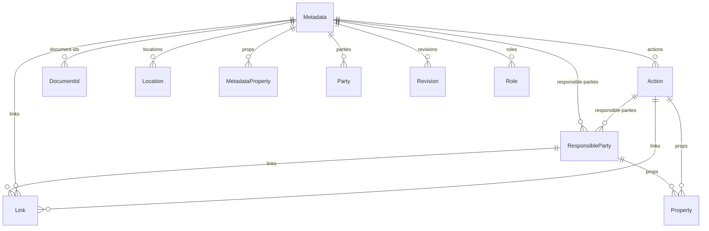

#### Attributes

| Name | Cardinality: | Type | Description |
| --- | --- | --- | --- |
| **[remarks](#Remarks)** | <sub>0..1</sub> | MarkupMultilineType | Additional commentary about the containing object. |
| **[responsible-parties](#Responsible-parties)** | <sub>0..\*</sub> | [ResponsibleParty](#ResponsibleParty) | Responsible party assignments. |
| **[date](#Date)** | <sub>0..1</sub> | DateTimeWithTimezoneType | The date and time when the action occurred. |
| **[system](#System)** | <sub>1..1</sub> | URIType | Specifies the action type system used. |
| **[type](#Type)** | <sub>1..1</sub> | [ActionTypeEnum](#ActionTypeEnum) | The type of action documented by the assembly, such as an approval. |
| **[uuid](#Uuid)** | <sub>1..1</sub> | UUIDType | A unique identifier that can be used to reference this defined action elsewhere in an OSCAL document. |
| **[links](#Links)** | <sub>0..\*</sub> | [Link](#Link) | A list of links. |
| **[props](#Props)** | <sub>0..\*</sub> | [Property](#Property) | A list of properties. |

#### Uses

 *  mixin: [HasResponsibleParties](#HasResponsibleParties) - Mixin providing the responsible-parties slot for objects that carry party assignments.
 *  mixin: [OscalCommon](#OscalCommon) - Mixin providing props, links, and remarks slots common to most OSCAL objects. Extends HasPropsAndLinks.

#### Referenced by:

 *  **[Metadata](#Metadata)** : actions  <sub>0..\*</sub> 


### Activity

Identifies an assessment or related process that can be performed. In the assessment plan, this is an intended activity.

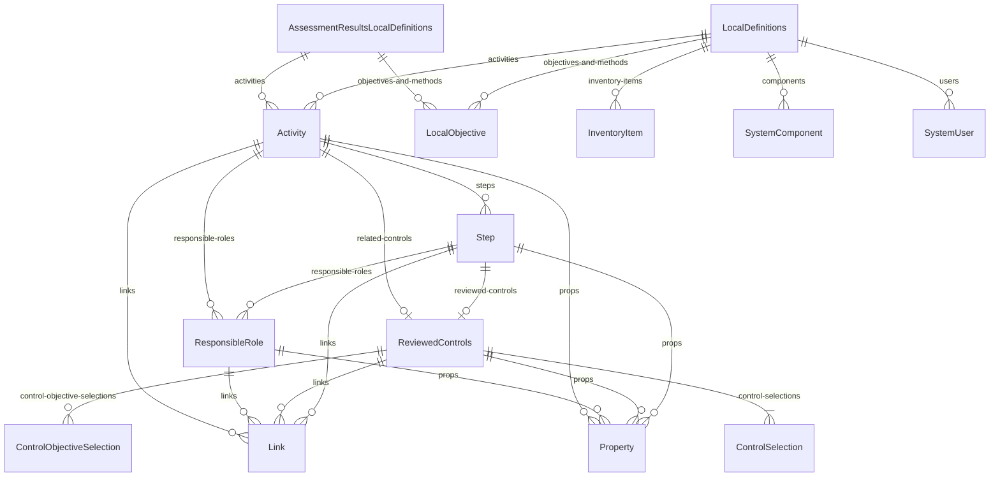

#### Attributes

| Name | Cardinality: | Type | Description |
| --- | --- | --- | --- |
| **[description](#Description)** | <sub>1..1</sub> | MarkupMultilineType | A human-readable description. |
| **[remarks](#Remarks)** | <sub>0..1</sub> | MarkupMultilineType | Additional commentary about the containing object. |
| **[responsible-roles](#Responsible-roles)** | <sub>0..\*</sub> | [ResponsibleRole](#ResponsibleRole) | Responsible role assignments. |
| **[related-controls](#Related-controls)** | <sub>0..1</sub> | [ReviewedControls](#ReviewedControls) | A reference to reviewed controls for this activity or step. |
| **[steps](#Steps)** | <sub>0..\*</sub> | [Step](#Step) | A collection of steps in an activity. |
| **[title](#Title)** | <sub>0..1</sub> | MarkupLineType | A human-readable name or title. |
| **[uuid](#Uuid)** | <sub>1..1</sub> | UUIDType | A machine-oriented, globally unique identifier with a cross-instance scope. |
| **[links](#Links)** | <sub>0..\*</sub> | [Link](#Link) | A list of links. |
| **[props](#Props)** | <sub>0..\*</sub> | [Property](#Property) | A list of properties. |

#### Uses

 *  mixin: [HasResponsibleRoles](#HasResponsibleRoles) - Mixin providing the responsible-roles slot for objects that carry role assignments.
 *  mixin: [OscalCommon](#OscalCommon) - Mixin providing props, links, and remarks slots common to most OSCAL objects. Extends HasPropsAndLinks.

#### Referenced by:

 *  **[AssessmentResultsLocalDefinitions](#AssessmentResultsLocalDefinitions)** : activities  <sub>0..\*</sub> 
 *  **[LocalDefinitions](#LocalDefinitions)** : activities  <sub>0..\*</sub> 


### Addition

Specifies content to be added into controls in resolution.

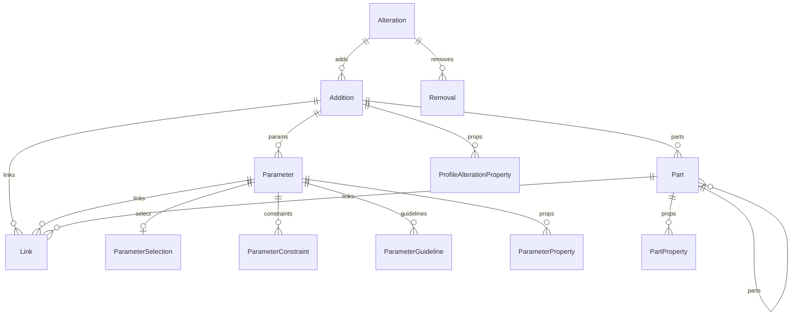

#### Attributes

| Name | Cardinality: | Type | Description |
| --- | --- | --- | --- |
| **[by-id](#By-id)** | <sub>0..1</sub> | TokenType | Identify or target items by their id value. |
| **[links](#Links)** | <sub>0..\*</sub> | [Link](#Link) | A list of links. |
| **[params](#Params)** | <sub>0..\*</sub> | [Parameter](#Parameter) | Parameters providing a mechanism for the dynamic assignment of value(s) in a control. |
| **[parts](#Parts)** | <sub>0..\*</sub> | [Part](#Part) | A collection of parts. |
| **[position](#Position)** | <sub>0..1</sub> | [AdditionPositionEnum](#AdditionPositionEnum) | Where to add new content relative to the targeted element. |
| **[props](#Props)** | <sub>0..\*</sub> | [ProfileAlterationProperty](#ProfileAlterationProperty) | A list of properties. |
| **[title](#Title)** | <sub>0..1</sub> | MarkupLineType | A human-readable name or title. |

#### Referenced by:

 *  **[Alteration](#Alteration)** : adds  <sub>0..\*</sub> 


### Address

A postal address for the location.

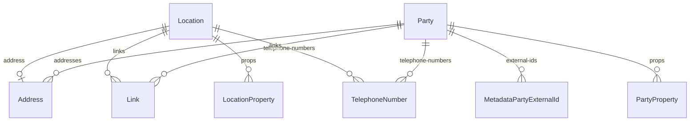

#### Attributes

| Name | Cardinality: | Type | Description |
| --- | --- | --- | --- |
| **[addr-lines](#Addr-lines)** | <sub>0..\*</sub> | string | A single line of an address. |
| **[city](#City)** | <sub>0..1</sub> | string | City, town or geographical region for the mailing address. |
| **[country](#Country)** | <sub>0..1</sub> | string | The ISO 3166-1 alpha-2 country code for the mailing address. |
| **[postal-code](#Postal-code)** | <sub>0..1</sub> | string | Postal or ZIP code for mailing address. |
| **[state](#State)** | <sub>0..1</sub> | string | State, province or analogous geographical region for a mailing address. |
| **[type](#Type)** | <sub>0..1</sub> | string | Indicates the type of address. Recommended values: home, work. Other values are permitted (OSCAL allow-other="yes"). |

#### Referenced by:

 *  **[Location](#Location)** : address  <sub>0..1</sub> 
 *  **[Party](#Party)** : addresses  <sub>0..\*</sub> 


### Alteration

Specifies changes to be made to an included control when a profile is resolved.

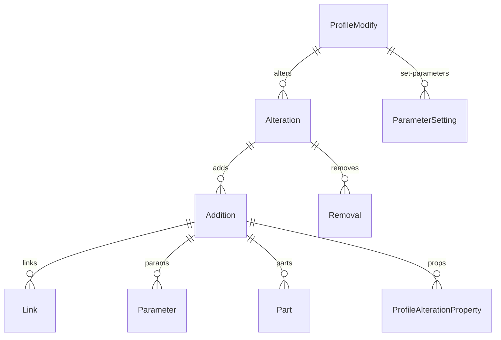

#### Attributes

| Name | Cardinality: | Type | Description |
| --- | --- | --- | --- |
| **[adds](#Adds)** | <sub>0..\*</sub> | [Addition](#Addition) | Specifies content to be added into a control in resolution. |
| **[control-id](#Control-id)** | <sub>1..1</sub> | TokenType | A reference to a control by its identifier. |
| **[removes](#Removes)** | <sub>0..\*</sub> | [Removal](#Removal) | Specifies objects to be removed from a control in resolution. |

#### Referenced by:

 *  **[ProfileModify](#ProfileModify)** : alters  <sub>0..\*</sub> 


### AssessmentAssets

Identifies the assets used to perform this assessment.

```mermaid
erDiagram
AssessmentAssets {

}
AssessmentPlan {

}
AssessmentPlatform {

}
PoamLocalDefinitions {

}
ResultLocalDefinitions {

}
SystemComponent {

}

AssessmentAssets ||--}o SystemComponent : "components"
AssessmentAssets ||--}| AssessmentPlatform : "assessment-platforms"
AssessmentPlan ||--|o AssessmentAssets : "assessment-assets"
AssessmentPlan ||--|o BackMatter : "back-matter"
AssessmentPlan ||--|o LocalDefinitions : "local-definitions"
AssessmentPlan ||--|o TermsAndConditions : "terms-and-conditions"
AssessmentPlan ||--|| ImportSSP : "import-ssp"
AssessmentPlan ||--|| Metadata : "metadata"
AssessmentPlan ||--|| ReviewedControls : "reviewed-controls"
AssessmentPlan ||--}o AssessmentSubject : "assessment-subjects"
AssessmentPlan ||--}o Task : "tasks"
AssessmentPlatform ||--}o Link : "links"
AssessmentPlatform ||--}o Property : "props"
AssessmentPlatform ||--}o UsesComponent : "uses-components"
PoamLocalDefinitions ||--|o AssessmentAssets : "assessment-assets"
PoamLocalDefinitions ||--}o InventoryItem : "inventory-items"
PoamLocalDefinitions ||--}o SystemComponent : "components"
ResultLocalDefinitions ||--|o AssessmentAssets : "assessment-assets"
ResultLocalDefinitions ||--}o InventoryItem : "inventory-items"
ResultLocalDefinitions ||--}o SystemComponent : "components"
ResultLocalDefinitions ||--}o SystemUser : "users"
ResultLocalDefinitions ||--}o Task : "tasks"
SystemComponent ||--|| ComponentStatus : "status"
SystemComponent ||--}o ImplementationCommonLink : "links"
SystemComponent ||--}o ImplementationCommonProperty : "props"
SystemComponent ||--}o ImplementationResponsibleRole : "responsible-roles"
SystemComponent ||--}o Protocol : "protocols"

```

#### Attributes

| Name | Cardinality: | Type | Description |
| --- | --- | --- | --- |
| **[assessment-platforms](#Assessment-platforms)** | <sub>1..\*</sub> | [AssessmentPlatform](#AssessmentPlatform) | A collection of assessment platforms. |
| **[components](#Components)** | <sub>0..\*</sub> | [SystemComponent](#SystemComponent) | A collection of system components. |

#### Referenced by:

 *  **[AssessmentPlan](#AssessmentPlan)** : assessment-assets  <sub>0..1</sub> 
 *  **[PoamLocalDefinitions](#PoamLocalDefinitions)** : assessment-assets  <sub>0..1</sub> 
 *  **[ResultLocalDefinitions](#ResultLocalDefinitions)** : assessment-assets  <sub>0..1</sub> 


### AssessmentLog

A log of all assessment-related actions taken.

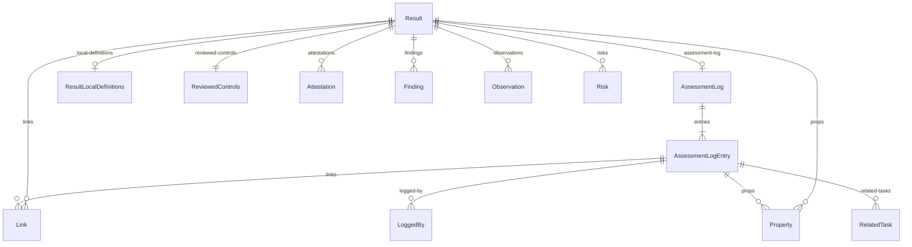

#### Attributes

| Name | Cardinality: | Type | Description |
| --- | --- | --- | --- |
| **[entries](#Entries)** | <sub>1..\*</sub> | [AssessmentLogEntry](#AssessmentLogEntry) | Identifies an individual risk response that occurred as part of managing an identified risk. |

#### Referenced by:

 *  **[Result](#Result)** : assessment-log  <sub>0..1</sub> 
 *  **[Result](#Result)** : assessment-log  <sub>0..1</sub> 


### AssessmentLogEntry

Identifies the result of an action and/or task that occurred as part of executing an assessment plan or assessment event.

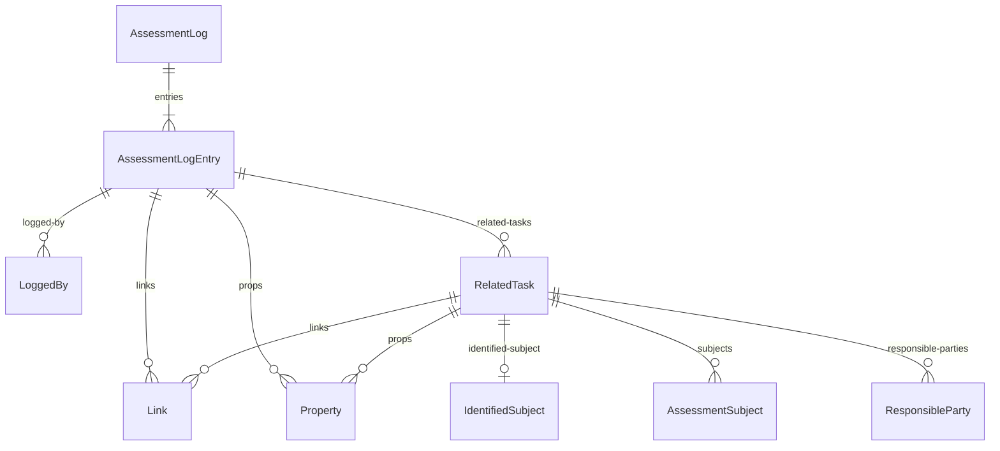

#### Attributes

| Name | Cardinality: | Type | Description |
| --- | --- | --- | --- |
| **[description](#Description)** | <sub>0..1</sub> | MarkupMultilineType | A human-readable description. |
| **[remarks](#Remarks)** | <sub>0..1</sub> | MarkupMultilineType | Additional commentary about the containing object. |
| **[end](#End)** | <sub>0..1</sub> | DateTimeWithTimezoneType | The end date/time. |
| **[logged-by](#Logged-by)** | <sub>0..\*</sub> | [LoggedBy](#LoggedBy) | Used to indicate who created a log entry in what role. |
| **[related-tasks](#Related-tasks)** | <sub>0..\*</sub> | [RelatedTask](#RelatedTask) | Identifies tasks for which the containing object is a consequence. |
| **[start](#Start)** | <sub>1..1</sub> | DateTimeWithTimezoneType | The start date/time. |
| **[title](#Title)** | <sub>0..1</sub> | MarkupLineType | A human-readable name or title. |
| **[uuid](#Uuid)** | <sub>1..1</sub> | UUIDType | A machine-oriented, globally unique identifier with a cross-instance scope. |
| **[links](#Links)** | <sub>0..\*</sub> | [Link](#Link) | A list of links. |
| **[props](#Props)** | <sub>0..\*</sub> | [Property](#Property) | A list of properties. |

#### Uses

 *  mixin: [OscalCommon](#OscalCommon) - Mixin providing props, links, and remarks slots common to most OSCAL objects. Extends HasPropsAndLinks.

#### Referenced by:

 *  **[AssessmentLog](#AssessmentLog)** : entries  <sub>1..\*</sub> 


### AssessmentMethod

A local definition of a control objective.

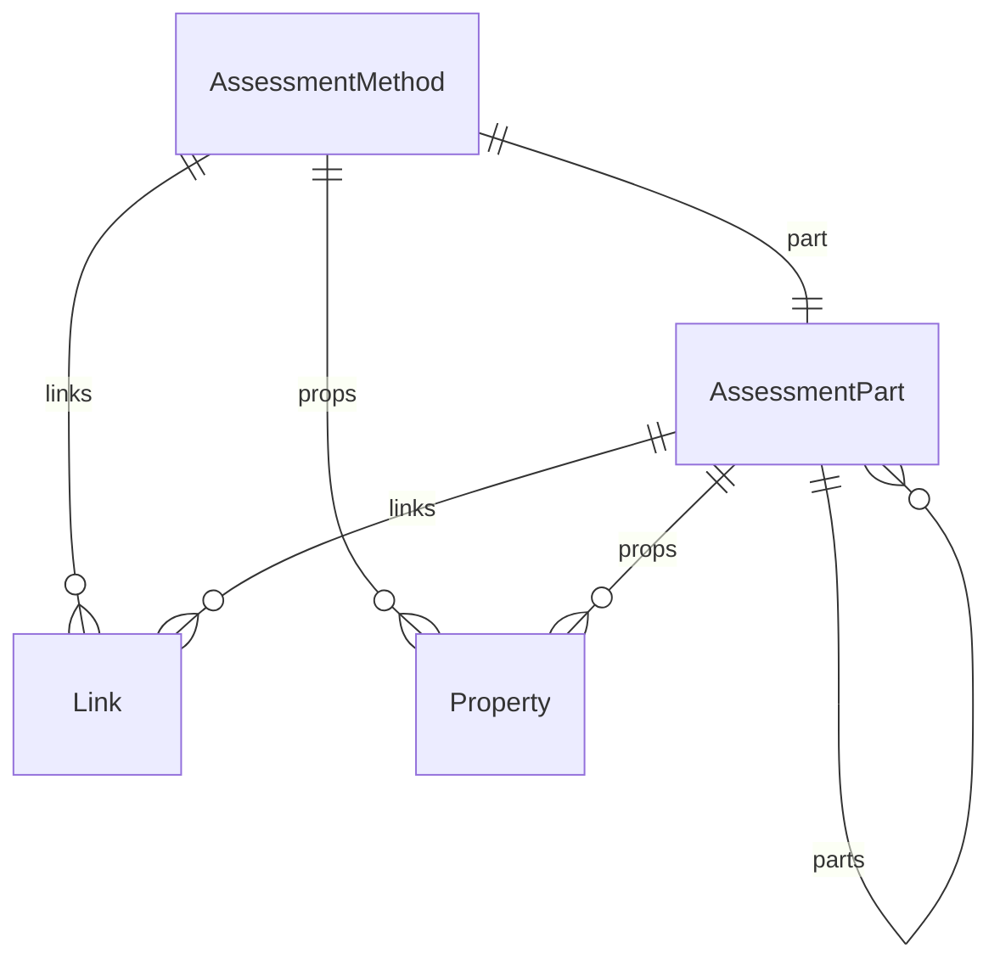

#### Attributes

| Name | Cardinality: | Type | Description |
| --- | --- | --- | --- |
| **[description](#Description)** | <sub>0..1</sub> | MarkupMultilineType | A human-readable description. |
| **[remarks](#Remarks)** | <sub>0..1</sub> | MarkupMultilineType | Additional commentary about the containing object. |
| **[part](#Part)** | <sub>1..1</sub> | [AssessmentPart](#AssessmentPart) | An assessment part. |
| **[uuid](#Uuid)** | <sub>1..1</sub> | UUIDType | A machine-oriented, globally unique identifier with a cross-instance scope. |
| **[links](#Links)** | <sub>0..\*</sub> | [Link](#Link) | A list of links. |
| **[props](#Props)** | <sub>0..\*</sub> | [Property](#Property) | A list of properties. |

#### Uses

 *  mixin: [OscalCommon](#OscalCommon) - Mixin providing props, links, and remarks slots common to most OSCAL objects. Extends HasPropsAndLinks.


### AssessmentPart

A partition of an assessment plan or results or a child of another part.

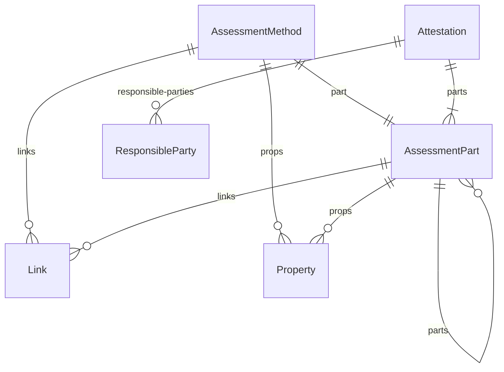

#### Attributes

| Name | Cardinality: | Type | Description |
| --- | --- | --- | --- |
| **[name](#Name)** | <sub>1..1</sub> | TokenType | A textual label that uniquely identifies an attribute or semantic type. |
| **[links](#Links)** | <sub>0..\*</sub> | [Link](#Link) | A list of links. |
| **[props](#Props)** | <sub>0..\*</sub> | [Property](#Property) | A list of properties. |
| **[_class](#Class)** | <sub>0..1</sub> | TokenType | A textual label that provides a sub-type or characterization. |
| **[ns](#Ns)** | <sub>0..1</sub> | URIType | An optional namespace qualifying a name. Allows different organizations to associate distinct semantics with the same name. |
| **[parts](#Parts)** | <sub>0..\*</sub> | [AssessmentPart](#AssessmentPart) | A collection of parts. |
| **[prose](#Prose)** | <sub>0..1</sub> | MarkupMultilineType | Permits multiple paragraphs, lists, tables etc. |
| **[title](#Title)** | <sub>0..1</sub> | MarkupLineType | A human-readable name or title. |
| **[uuid](#Uuid)** | <sub>0..1</sub> | UUIDType | A machine-oriented, globally unique identifier with a cross-instance scope. |

#### Children

 * [TermsAndConditionsPart](#TermsAndConditionsPart) - A terms-and-conditions scoped assessment part.

#### Uses

 *  mixin: [HasPropsAndLinks](#HasPropsAndLinks) - Mixin providing the props and links slots that are common to many OSCAL objects.

#### Referenced by:

 *  **[AssessmentMethod](#AssessmentMethod)** : part  <sub>1..1</sub> 
 *  **[AssessmentPart](#AssessmentPart)** : parts  <sub>0..\*</sub> 
 *  **[Attestation](#Attestation)** : parts  <sub>1..\*</sub> 
 *  **[AssessmentMethod](#AssessmentMethod)** : part  <sub>0..1</sub> 


### AssessmentPlan

An assessment plan, such as those provided by a FedRAMP assessor.

```mermaid
erDiagram
AssessmentAssets {

}
AssessmentPlan {

}
AssessmentPlanDocument {

}
AssessmentSubject {

}
BackMatter {

}
ImportSSP {

}
LocalDefinitions {

}
Metadata {

}
ReviewedControls {

}
Task {

}
TermsAndConditions {

}

AssessmentAssets ||--}o SystemComponent : "components"
AssessmentAssets ||--}| AssessmentPlatform : "assessment-platforms"
AssessmentPlan ||--|o AssessmentAssets : "assessment-assets"
AssessmentPlan ||--|o BackMatter : "back-matter"
AssessmentPlan ||--|o LocalDefinitions : "local-definitions"
AssessmentPlan ||--|o TermsAndConditions : "terms-and-conditions"
AssessmentPlan ||--|| ImportSSP : "import-ssp"
AssessmentPlan ||--|| Metadata : "metadata"
AssessmentPlan ||--|| ReviewedControls : "reviewed-controls"
AssessmentPlan ||--}o AssessmentSubject : "assessment-subjects"
AssessmentPlan ||--}o Task : "tasks"
AssessmentPlanDocument ||--|| AssessmentPlan : "assessment-plan"
AssessmentSubject ||--|o IncludeAll : "include-all"
AssessmentSubject ||--}o Link : "links"
AssessmentSubject ||--}o Property : "props"
AssessmentSubject ||--}o SelectSubjectById : "exclude-subjects, include-subjects"
BackMatter ||--}o Resource : "resources"
LocalDefinitions ||--}o Activity : "activities"
LocalDefinitions ||--}o InventoryItem : "inventory-items"
LocalDefinitions ||--}o LocalObjective : "objectives-and-methods"
LocalDefinitions ||--}o SystemComponent : "components"
LocalDefinitions ||--}o SystemUser : "users"
Metadata ||--}o Action : "actions"
Metadata ||--}o DocumentId : "document-ids"
Metadata ||--}o Link : "links"
Metadata ||--}o Location : "locations"
Metadata ||--}o MetadataProperty : "props"
Metadata ||--}o Party : "parties"
Metadata ||--}o ResponsibleParty : "responsible-parties"
Metadata ||--}o Revision : "revisions"
Metadata ||--}o Role : "roles"
ReviewedControls ||--}o ControlObjectiveSelection : "control-objective-selections"
ReviewedControls ||--}o Link : "links"
ReviewedControls ||--}o Property : "props"
ReviewedControls ||--}| ControlSelection : "control-selections"
Task ||--|o EventTiming : "timing"
Task ||--}o AssessmentSubject : "subjects"
Task ||--}o AssociatedActivity : "associated-activities"
Task ||--}o Link : "links"
Task ||--}o Property : "props"
Task ||--}o ResponsibleRole : "responsible-roles"
Task ||--}o Task : "tasks"
Task ||--}o TaskDependency : "dependencies"
TermsAndConditions ||--}o TermsAndConditionsPart : "parts"

```

#### Attributes

| Name | Cardinality: | Type | Description |
| --- | --- | --- | --- |
| **[assessment-assets](#Assessment-assets)** | <sub>0..1</sub> | [AssessmentAssets](#AssessmentAssets) | Identifies the assets used to perform this assessment. |
| **[assessment-subjects](#Assessment-subjects)** | <sub>0..\*</sub> | [AssessmentSubject](#AssessmentSubject) | Identifies system elements being assessed. |
| **[back-matter](#Back-matter)** | <sub>0..1</sub> | [BackMatter](#BackMatter) | A collection of resources that may be referenced from within the OSCAL document instance. |
| **[import-ssp](#Import-ssp)** | <sub>1..1</sub> | [ImportSSP](#ImportSSP) | Used to import information about the system from an SSP. |
| **[local-definitions](#Local-definitions)** | <sub>0..1</sub> | [LocalDefinitions](#LocalDefinitions) | Used to define data objects that do not appear in the referenced SSP. |
| **[metadata](#Metadata)** | <sub>1..1</sub> | [Metadata](#Metadata) | Provides information about the containing document, and defines concepts shared across the document. |
| **[reviewed-controls](#Reviewed-controls)** | <sub>1..1</sub> | [ReviewedControls](#ReviewedControls) | Identifies the controls being assessed and their control objectives. |
| **[tasks](#Tasks)** | <sub>0..\*</sub> | [Task](#Task) | A collection of tasks. |
| **[terms-and-conditions](#Terms-and-conditions)** | <sub>0..1</sub> | [TermsAndConditions](#TermsAndConditions) | Terms and conditions under which an assessment can be performed. |
| **[uuid](#Uuid)** | <sub>1..1</sub> | UUIDType | Assessment Plan Universally Unique Identifier. |

#### Referenced by:

 *  **[AssessmentPlanDocument](#AssessmentPlanDocument)** : assessment-plan  <sub>1..1</sub> 
 *  **[AssessmentPlanDocument](#AssessmentPlanDocument)** : assessment-plan  <sub>0..1</sub> 


### AssessmentPlanDocument

Root wrapper for an OSCAL Assessment Plan document.

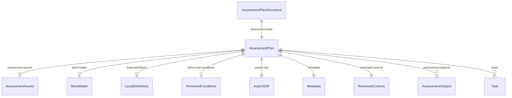

#### Attributes

| Name | Cardinality: | Type | Description |
| --- | --- | --- | --- |
| **[assessment-plan](#Assessment-plan)** | <sub>1..1</sub> | [AssessmentPlan](#AssessmentPlan) | The root assessment plan object. |

#### Parents

 * [OscalDocument](#OscalDocument) - A root wrapper for an OSCAL document, which may be of any OSCAL document type (e.g. Catalog, Profile, Assessment Plan, SSP).


### AssessmentPlatform

Used to represent the toolset used to perform aspects of the assessment.

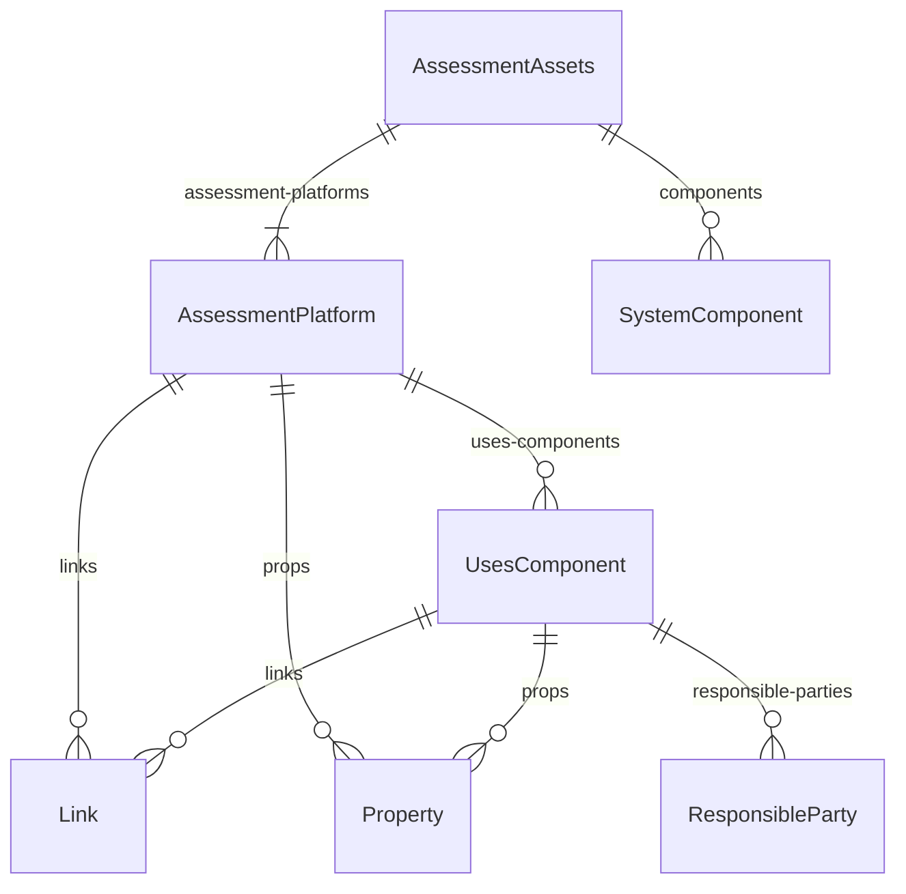

#### Attributes

| Name | Cardinality: | Type | Description |
| --- | --- | --- | --- |
| **[remarks](#Remarks)** | <sub>0..1</sub> | MarkupMultilineType | Additional commentary about the containing object. |
| **[title](#Title)** | <sub>0..1</sub> | MarkupLineType | A human-readable name or title. |
| **[uses-components](#Uses-components)** | <sub>0..\*</sub> | [UsesComponent](#UsesComponent) | The set of components used by the assessment platform. |
| **[uuid](#Uuid)** | <sub>1..1</sub> | UUIDType | A machine-oriented, globally unique identifier with a cross-instance scope. |
| **[links](#Links)** | <sub>0..\*</sub> | [Link](#Link) | A list of links. |
| **[props](#Props)** | <sub>0..\*</sub> | [Property](#Property) | A list of properties. |

#### Uses

 *  mixin: [OscalCommon](#OscalCommon) - Mixin providing props, links, and remarks slots common to most OSCAL objects. Extends HasPropsAndLinks.

#### Referenced by:

 *  **[AssessmentAssets](#AssessmentAssets)** : assessment-platforms  <sub>1..\*</sub> 
 *  **[AssessmentAssets](#AssessmentAssets)** : assessment-platforms  <sub>0..\*</sub> 


### AssessmentResults

Security assessment results, such as those provided by a FedRAMP assessor in a security assessment report.

```mermaid
erDiagram
AssessmentResults {

}
AssessmentResultsDocument {

}
AssessmentResultsLocalDefinitions {

}
BackMatter {

}
ImportAssessmentPlan {

}
Metadata {

}
Result {

}

AssessmentResults ||--|o AssessmentResultsLocalDefinitions : "local-definitions"
AssessmentResults ||--|o BackMatter : "back-matter"
AssessmentResults ||--|| ImportAssessmentPlan : "import-ap"
AssessmentResults ||--|| Metadata : "metadata"
AssessmentResults ||--}| Result : "results"
AssessmentResultsDocument ||--|| AssessmentResults : "assessment-results"
AssessmentResultsLocalDefinitions ||--}o Activity : "activities"
AssessmentResultsLocalDefinitions ||--}o LocalObjective : "objectives-and-methods"
BackMatter ||--}o Resource : "resources"
Metadata ||--}o Action : "actions"
Metadata ||--}o DocumentId : "document-ids"
Metadata ||--}o Link : "links"
Metadata ||--}o Location : "locations"
Metadata ||--}o MetadataProperty : "props"
Metadata ||--}o Party : "parties"
Metadata ||--}o ResponsibleParty : "responsible-parties"
Metadata ||--}o Revision : "revisions"
Metadata ||--}o Role : "roles"
Result ||--|o AssessmentLog : "assessment-log"
Result ||--|o ResultLocalDefinitions : "local-definitions"
Result ||--|| ReviewedControls : "reviewed-controls"
Result ||--}o Attestation : "attestations"
Result ||--}o Finding : "findings"
Result ||--}o Link : "links"
Result ||--}o Observation : "observations"
Result ||--}o Property : "props"
Result ||--}o Risk : "risks"

```

#### Attributes

| Name | Cardinality: | Type | Description |
| --- | --- | --- | --- |
| **[back-matter](#Back-matter)** | <sub>0..1</sub> | [BackMatter](#BackMatter) | A collection of resources that may be referenced from within the OSCAL document instance. |
| **[import-ap](#Import-ap)** | <sub>1..1</sub> | [ImportAssessmentPlan](#ImportAssessmentPlan) | Used to import information about the governing assessment plan. |
| **[local-definitions](#Local-definitions)** | <sub>0..1</sub> | [AssessmentResultsLocalDefinitions](#AssessmentResultsLocalDefinitions) | Used to define data objects that do not appear in the referenced SSP. |
| **[metadata](#Metadata)** | <sub>1..1</sub> | [Metadata](#Metadata) | Provides information about the containing document, and defines concepts shared across the document. |
| **[results](#Results)** | <sub>1..\*</sub> | [Result](#Result) | A collection of assessment results. |
| **[uuid](#Uuid)** | <sub>1..1</sub> | UUIDType | Assessment Results Universally Unique Identifier. |

#### Referenced by:

 *  **[AssessmentResultsDocument](#AssessmentResultsDocument)** : assessment-results  <sub>1..1</sub> 
 *  **[AssessmentResultsDocument](#AssessmentResultsDocument)** : assessment-results  <sub>0..1</sub> 


### AssessmentResultsDocument

Root wrapper for an OSCAL Assessment Results document.

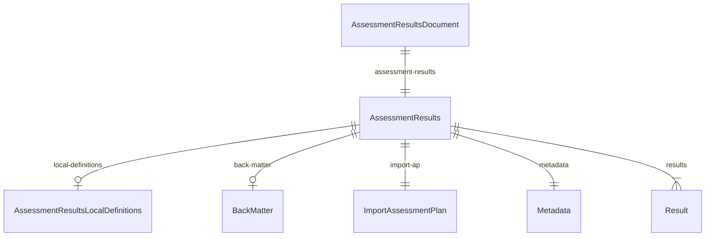

#### Attributes

| Name | Cardinality: | Type | Description |
| --- | --- | --- | --- |
| **[assessment-results](#Assessment-results)** | <sub>1..1</sub> | [AssessmentResults](#AssessmentResults) | The root assessment results object. |

#### Parents

 * [OscalDocument](#OscalDocument) - A root wrapper for an OSCAL document, which may be of any OSCAL document type (e.g. Catalog, Profile, Assessment Plan, SSP).


### AssessmentResultsLocalDefinitions

Used to define data objects that are referenced by the assessment results but do not appear in the imported assessment plan.

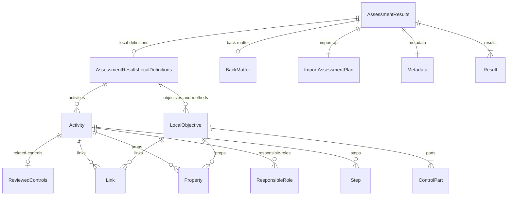

#### Attributes

| Name | Cardinality: | Type | Description |
| --- | --- | --- | --- |
| **[activities](#Activities)** | <sub>0..\*</sub> | [Activity](#Activity) | A collection of activities. |
| **[objectives-and-methods](#Objectives-and-methods)** | <sub>0..\*</sub> | [LocalObjective](#LocalObjective) | A collection of locally-defined control objectives. |
| **[remarks](#Remarks)** | <sub>0..1</sub> | MarkupMultilineType | Additional commentary about the containing object. |

#### Referenced by:

 *  **[AssessmentResults](#AssessmentResults)** : local-definitions  <sub>0..1</sub> 


### AssessmentSelectControlById

Select a specific control for inclusion/exclusion in the assessment by literal control ID and optional statement IDs.

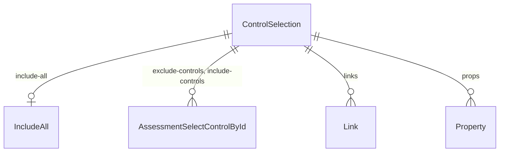

#### Attributes

| Name | Cardinality: | Type | Description |
| --- | --- | --- | --- |
| **[control-id](#Control-id)** | <sub>1..1</sub> | TokenType | A reference to a control by its identifier. |
| **[statement-ids](#Statement-ids)** | <sub>0..\*</sub> | TokenType | Statement IDs for control selection. |

#### Referenced by:

 *  **[ControlSelection](#ControlSelection)** : exclude-controls  <sub>0..\*</sub> 
 *  **[ControlSelection](#ControlSelection)** : include-controls  <sub>0..\*</sub> 


### AssessmentSubject

Identifies system elements being assessed, such as components, inventory items, and locations.

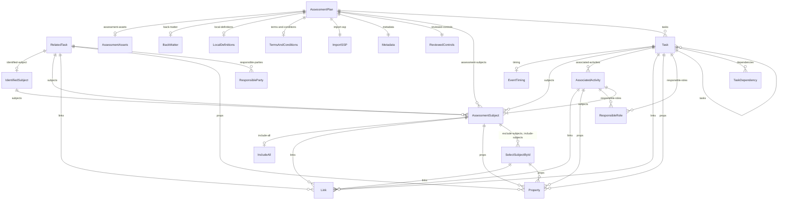

#### Attributes

| Name | Cardinality: | Type | Description |
| --- | --- | --- | --- |
| **[description](#Description)** | <sub>0..1</sub> | MarkupMultilineType | A human-readable description. |
| **[remarks](#Remarks)** | <sub>0..1</sub> | MarkupMultilineType | Additional commentary about the containing object. |
| **[exclude-subjects](#Exclude-subjects)** | <sub>0..\*</sub> | [SelectSubjectById](#SelectSubjectById) | Assessment subjects to exclude. |
| **[include-all](#Include-all)** | <sub>0..1</sub> | [IncludeAll](#IncludeAll) | Include all selectable objects in the containing OSCAL selection context. |
| **[include-subjects](#Include-subjects)** | <sub>0..\*</sub> | [SelectSubjectById](#SelectSubjectById) | Assessment subjects to include. |
| **[type](#Type)** | <sub>1..1</sub> | string | Indicates the nature or kind of the containing object. |
| **[links](#Links)** | <sub>0..\*</sub> | [Link](#Link) | A list of links. |
| **[props](#Props)** | <sub>0..\*</sub> | [Property](#Property) | A list of properties. |

#### Uses

 *  mixin: [OscalCommon](#OscalCommon) - Mixin providing props, links, and remarks slots common to most OSCAL objects. Extends HasPropsAndLinks.

#### Referenced by:

 *  **[AssociatedActivity](#AssociatedActivity)** : subjects  <sub>1..\*</sub> 
 *  **[IdentifiedSubject](#IdentifiedSubject)** : subjects  <sub>1..\*</sub> 
 *  **[RelatedTask](#RelatedTask)** : subjects  <sub>0..\*</sub> 
 *  **[Task](#Task)** : subjects  <sub>0..\*</sub> 
 *  **[AssessmentPlan](#AssessmentPlan)** : assessment-subjects  <sub>0..\*</sub> 


### AssessmentSubjectPlaceholder

Used when the assessment subjects will be determined as part of one or more other assessment activities.

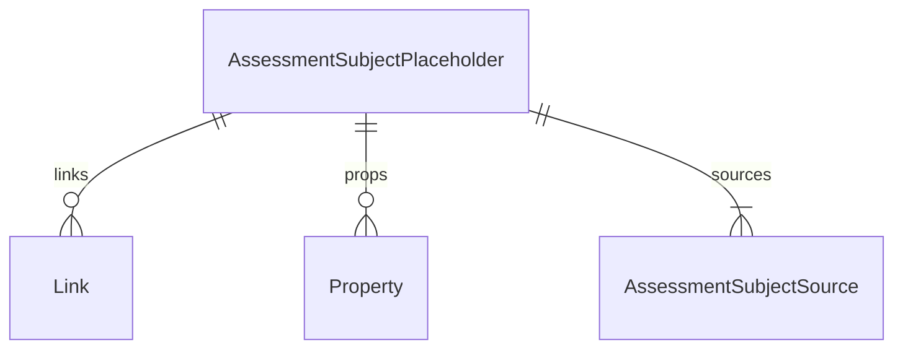

#### Attributes

| Name | Cardinality: | Type | Description |
| --- | --- | --- | --- |
| **[description](#Description)** | <sub>0..1</sub> | MarkupMultilineType | A human-readable description. |
| **[remarks](#Remarks)** | <sub>0..1</sub> | MarkupMultilineType | Additional commentary about the containing object. |
| **[sources](#Sources)** | <sub>1..\*</sub> | [AssessmentSubjectSource](#AssessmentSubjectSource) | Source references or source-participation entries in the containing OSCAL context. The concrete entry class is selected by class-level slot_usage. |
| **[uuid](#Uuid)** | <sub>1..1</sub> | UUIDType | A machine-oriented, globally unique identifier with a cross-instance scope. |
| **[links](#Links)** | <sub>0..\*</sub> | [Link](#Link) | A list of links. |
| **[props](#Props)** | <sub>0..\*</sub> | [Property](#Property) | A list of properties. |

#### Uses

 *  mixin: [OscalCommon](#OscalCommon) - Mixin providing props, links, and remarks slots common to most OSCAL objects. Extends HasPropsAndLinks.


### AssessmentSubjectSource

Assessment subjects will be identified while conducting the referenced activity.

```mermaid
erDiagram
AssessmentSubjectPlaceholder {

}
AssessmentSubjectSource {

}

AssessmentSubjectPlaceholder ||--}o Link : "links"
AssessmentSubjectPlaceholder ||--}o Property : "props"
AssessmentSubjectPlaceholder ||--}| AssessmentSubjectSource : "sources"

```

#### Attributes

| Name | Cardinality: | Type | Description |
| --- | --- | --- | --- |
| **[remarks](#Remarks)** | <sub>0..1</sub> | MarkupMultilineType | Additional commentary about the containing object. |
| **[task-uuid](#Task-uuid)** | <sub>1..1</sub> | UUIDType | A UUID reference to a task. |

#### Referenced by:

 *  **[AssessmentSubjectPlaceholder](#AssessmentSubjectPlaceholder)** : sources  <sub>1..\*</sub> 


### AssociatedActivity

Identifies an individual activity to be performed as part of a task.

```mermaid
erDiagram
AssessmentSubject {

}
AssociatedActivity {

}
Link {

}
Property {

}
ResponsibleRole {

}
Task {

}

AssessmentSubject ||--|o IncludeAll : "include-all"
AssessmentSubject ||--}o Link : "links"
AssessmentSubject ||--}o Property : "props"
AssessmentSubject ||--}o SelectSubjectById : "exclude-subjects, include-subjects"
AssociatedActivity ||--}o Link : "links"
AssociatedActivity ||--}o Property : "props"
AssociatedActivity ||--}o ResponsibleRole : "responsible-roles"
AssociatedActivity ||--}| AssessmentSubject : "subjects"
ResponsibleRole ||--}o Link : "links"
ResponsibleRole ||--}o Property : "props"
Task ||--|o EventTiming : "timing"
Task ||--}o AssessmentSubject : "subjects"
Task ||--}o AssociatedActivity : "associated-activities"
Task ||--}o Link : "links"
Task ||--}o Property : "props"
Task ||--}o ResponsibleRole : "responsible-roles"
Task ||--}o Task : "tasks"
Task ||--}o TaskDependency : "dependencies"

```

#### Attributes

| Name | Cardinality: | Type | Description |
| --- | --- | --- | --- |
| **[remarks](#Remarks)** | <sub>0..1</sub> | MarkupMultilineType | Additional commentary about the containing object. |
| **[responsible-roles](#Responsible-roles)** | <sub>0..\*</sub> | [ResponsibleRole](#ResponsibleRole) | Responsible role assignments. |
| **[activity-uuid](#Activity-uuid)** | <sub>1..1</sub> | UUIDType | A UUID reference to an activity. |
| **[subjects](#Subjects)** | <sub>1..\*</sub> | [AssessmentSubject](#AssessmentSubject) | Assessment subjects or subject references for this object. |
| **[links](#Links)** | <sub>0..\*</sub> | [Link](#Link) | A list of links. |
| **[props](#Props)** | <sub>0..\*</sub> | [Property](#Property) | A list of properties. |

#### Uses

 *  mixin: [HasResponsibleRoles](#HasResponsibleRoles) - Mixin providing the responsible-roles slot for objects that carry role assignments.
 *  mixin: [OscalCommon](#OscalCommon) - Mixin providing props, links, and remarks slots common to most OSCAL objects. Extends HasPropsAndLinks.

#### Referenced by:

 *  **[Task](#Task)** : associated-activities  <sub>0..\*</sub> 


### AssociatedRisk

Relates the finding to a set of referenced risks.

```mermaid
erDiagram
AssociatedRisk {

}
Finding {

}
PoamItem {

}

Finding ||--|| FindingTarget : "target"
Finding ||--}o AssociatedRisk : "related-risks"
Finding ||--}o Link : "links"
Finding ||--}o Origin : "origins"
Finding ||--}o Property : "props"
Finding ||--}o RelatedObservation : "related-observations"
PoamItem ||--}o AssociatedRisk : "related-risks"
PoamItem ||--}o Link : "links"
PoamItem ||--}o Origin : "origins"
PoamItem ||--}o Property : "props"
PoamItem ||--}o RelatedFinding : "related-findings"
PoamItem ||--}o RelatedObservation : "related-observations"

```

#### Attributes

| Name | Cardinality: | Type | Description |
| --- | --- | --- | --- |
| **[remarks](#Remarks)** | <sub>0..1</sub> | MarkupMultilineType | Additional commentary about the containing object. |
| **[risk-uuid](#Risk-uuid)** | <sub>1..1</sub> | UUIDType | A machine-oriented identifier reference to a risk defined in the list of risks. |

#### Referenced by:

 *  **[Finding](#Finding)** : related-risks  <sub>0..\*</sub> 
 *  **[PoamItem](#PoamItem)** : related-risks  <sub>0..\*</sub> 


### AtFrequency

The task is intended to occur at the specified frequency.

```mermaid
erDiagram
AtFrequency {

}
EventTiming {

}

EventTiming ||--|o AtFrequency : "at-frequency"
EventTiming ||--|o OnDateCondition : "on-date"
EventTiming ||--|o WithinDateRange : "within-date-range"

```

#### Attributes

| Name | Cardinality: | Type | Description |
| --- | --- | --- | --- |
| **[period](#Period)** | <sub>1..1</sub> | PositiveIntegerType | The task must occur every period (in the given units). |
| **[remarks](#Remarks)** | <sub>0..1</sub> | MarkupMultilineType | Additional commentary about the containing object. |
| **[unit](#Unit)** | <sub>1..1</sub> | [TimingUnitEnum](#TimingUnitEnum) | The unit of time for the period. |

#### Referenced by:

 *  **[EventTiming](#EventTiming)** : at-frequency  <sub>0..1</sub> 


### Attestation

A set of textual attestation statements, typically written by the assessor.

```mermaid
erDiagram
AssessmentPart {

}
Attestation {

}
ResponsibleParty {

}
Result {

}

AssessmentPart ||--}o AssessmentPart : "parts"
AssessmentPart ||--}o Link : "links"
AssessmentPart ||--}o Property : "props"
Attestation ||--}o ResponsibleParty : "responsible-parties"
Attestation ||--}| AssessmentPart : "parts"
ResponsibleParty ||--}o Link : "links"
ResponsibleParty ||--}o Property : "props"
Result ||--|o AssessmentLog : "assessment-log"
Result ||--|o ResultLocalDefinitions : "local-definitions"
Result ||--|| ReviewedControls : "reviewed-controls"
Result ||--}o Attestation : "attestations"
Result ||--}o Finding : "findings"
Result ||--}o Link : "links"
Result ||--}o Observation : "observations"
Result ||--}o Property : "props"
Result ||--}o Risk : "risks"

```

#### Attributes

| Name | Cardinality: | Type | Description |
| --- | --- | --- | --- |
| **[responsible-parties](#Responsible-parties)** | <sub>0..\*</sub> | [ResponsibleParty](#ResponsibleParty) | Responsible party assignments. |
| **[parts](#Parts)** | <sub>1..\*</sub> | [AssessmentPart](#AssessmentPart) | A collection of parts. |

#### Uses

 *  mixin: [HasResponsibleParties](#HasResponsibleParties) - Mixin providing the responsible-parties slot for objects that carry party assignments.

#### Referenced by:

 *  **[Result](#Result)** : attestations  <sub>0..\*</sub> 


### AuthorizationBoundary

A description of this system's authorization boundary, optionally supplemented with diagrams that illustrate the authorization boundary.

```mermaid
erDiagram
AuthorizationBoundary {

}
Diagram {

}
Link {

}
Property {

}
SystemCharacteristics {

}

AuthorizationBoundary ||--}o Diagram : "diagrams"
AuthorizationBoundary ||--}o Link : "links"
AuthorizationBoundary ||--}o Property : "props"
Diagram ||--}o Property : "props"
Diagram ||--}o SspDiagramLink : "links"
SystemCharacteristics ||--|o DataFlow : "data-flow"
SystemCharacteristics ||--|o NetworkArchitecture : "network-architecture"
SystemCharacteristics ||--|o SecurityImpactLevel : "security-impact-level"
SystemCharacteristics ||--|| AuthorizationBoundary : "authorization-boundary"
SystemCharacteristics ||--|| SystemInformation : "system-information"
SystemCharacteristics ||--|| SystemStatus : "system-status"
SystemCharacteristics ||--}o SspSystemCharacteristicsProp : "props"
SystemCharacteristics ||--}o SspSystemCharacteristicsResponsibleParty : "responsible-parties"
SystemCharacteristics ||--}| SystemId : "system-ids"

```

#### Attributes

| Name | Cardinality: | Type | Description |
| --- | --- | --- | --- |
| **[description](#Description)** | <sub>1..1</sub> | MarkupMultilineType | A human-readable description. |
| **[diagrams](#Diagrams)** | <sub>0..\*</sub> | [Diagram](#Diagram) | A collection of diagrams that visually depict the subject. |
| **[links](#Links)** | <sub>0..\*</sub> | [Link](#Link) | A list of links. |
| **[props](#Props)** | <sub>0..\*</sub> | [Property](#Property) | A list of properties. |
| **[remarks](#Remarks)** | <sub>0..1</sub> | MarkupMultilineType | Additional commentary about the containing object. |

#### Referenced by:

 *  **[SystemCharacteristics](#SystemCharacteristics)** : authorization-boundary  <sub>1..1</sub> 
 *  **[SystemCharacteristics](#SystemCharacteristics)** : authorization-boundary  <sub>0..1</sub> 


### AuthorizedPrivilege

Identifies a specific system privilege held by the user, along with an associated description and/or rationale for the privilege.

```mermaid
erDiagram
AuthorizedPrivilege {

}
SystemUser {

}

SystemUser ||--}o AuthorizedPrivilege : "authorized-privileges"
SystemUser ||--}o ImplementationCommonLink : "links"
SystemUser ||--}o ImplementationCommonProperty : "props"

```

#### Attributes

| Name | Cardinality: | Type | Description |
| --- | --- | --- | --- |
| **[description](#Description)** | <sub>0..1</sub> | MarkupMultilineType | A human-readable description. |
| **[functions-performed](#Functions-performed)** | <sub>1..\*</sub> | string | Describes a function performed for a given authorized privilege. |
| **[title](#Title)** | <sub>1..1</sub> | MarkupLineType | A human-readable name or title. |

#### Referenced by:

 *  **[SystemUser](#SystemUser)** : authorized-privileges  <sub>0..\*</sub> 


### BackMatter

A collection of resources that may be referenced from within the OSCAL document instance.

```mermaid
erDiagram
AssessmentPlan {

}
AssessmentResults {

}
BackMatter {

}
Catalog {

}
ComponentDefinition {

}
MappingCollection {

}
PlanOfActionAndMilestones {

}
Profile {

}
Resource {

}
SystemSecurityPlan {

}

AssessmentPlan ||--|o AssessmentAssets : "assessment-assets"
AssessmentPlan ||--|o BackMatter : "back-matter"
AssessmentPlan ||--|o LocalDefinitions : "local-definitions"
AssessmentPlan ||--|o TermsAndConditions : "terms-and-conditions"
AssessmentPlan ||--|| ImportSSP : "import-ssp"
AssessmentPlan ||--|| Metadata : "metadata"
AssessmentPlan ||--|| ReviewedControls : "reviewed-controls"
AssessmentPlan ||--}o AssessmentSubject : "assessment-subjects"
AssessmentPlan ||--}o Task : "tasks"
AssessmentResults ||--|o AssessmentResultsLocalDefinitions : "local-definitions"
AssessmentResults ||--|o BackMatter : "back-matter"
AssessmentResults ||--|| ImportAssessmentPlan : "import-ap"
AssessmentResults ||--|| Metadata : "metadata"
AssessmentResults ||--}| Result : "results"
BackMatter ||--}o Resource : "resources"
Catalog ||--|o BackMatter : "back-matter"
Catalog ||--|| Metadata : "metadata"
Catalog ||--}o Control : "controls"
Catalog ||--}o Group : "groups"
Catalog ||--}o Parameter : "params"
ComponentDefinition ||--|o BackMatter : "back-matter"
ComponentDefinition ||--|| Metadata : "metadata"
ComponentDefinition ||--}o Capability : "capabilities"
ComponentDefinition ||--}o DefinedComponent : "components"
ComponentDefinition ||--}o ImportComponentDefinition : "import-component-definitions"
MappingCollection ||--|o BackMatter : "back-matter"
MappingCollection ||--|| MappingProvenance : "provenance"
MappingCollection ||--|| Metadata : "metadata"
MappingCollection ||--}| Mapping : "mappings"
PlanOfActionAndMilestones ||--|o BackMatter : "back-matter"
PlanOfActionAndMilestones ||--|o ImportSSP : "import-ssp"
PlanOfActionAndMilestones ||--|o PoamLocalDefinitions : "local-definitions"
PlanOfActionAndMilestones ||--|o SystemId : "system-id"
PlanOfActionAndMilestones ||--|| Metadata : "metadata"
PlanOfActionAndMilestones ||--}o Finding : "findings"
PlanOfActionAndMilestones ||--}o Observation : "observations"
PlanOfActionAndMilestones ||--}o Risk : "risks"
PlanOfActionAndMilestones ||--}| PoamItem : "poam-items"
Profile ||--|o BackMatter : "back-matter"
Profile ||--|o ProfileMerge : "merge"
Profile ||--|o ProfileModify : "modify"
Profile ||--|| Metadata : "metadata"
Profile ||--}| ProfileImport : "imports"
Resource ||--|o Base64Resource : "base64"
Resource ||--|o Citation : "citation"
Resource ||--}o DocumentId : "document-ids"
Resource ||--}o ResourceLink : "rlinks"
Resource ||--}o ResourceProperty : "props"
SystemSecurityPlan ||--|o BackMatter : "back-matter"
SystemSecurityPlan ||--|| ImportProfile : "import-profile"
SystemSecurityPlan ||--|| Metadata : "metadata"
SystemSecurityPlan ||--|| SspControlImplementation : "control-implementation"
SystemSecurityPlan ||--|| SystemCharacteristics : "system-characteristics"
SystemSecurityPlan ||--|| SystemImplementation : "system-implementation"

```

#### Attributes

| Name | Cardinality: | Type | Description |
| --- | --- | --- | --- |
| **[resources](#Resources)** | <sub>0..\*</sub> | [Resource](#Resource) | A resource associated with content in the containing document instance. A resource may be directly included in the document using base64 encoding or may point to one or more equivalent internet resources. |

#### Referenced by:

 *  **[AssessmentPlan](#AssessmentPlan)** : back-matter  <sub>0..1</sub> 
 *  **[AssessmentResults](#AssessmentResults)** : back-matter  <sub>0..1</sub> 
 *  **[Catalog](#Catalog)** : back-matter  <sub>0..1</sub> 
 *  **[ComponentDefinition](#ComponentDefinition)** : back-matter  <sub>0..1</sub> 
 *  **[MappingCollection](#MappingCollection)** : back-matter  <sub>0..1</sub> 
 *  **[PlanOfActionAndMilestones](#PlanOfActionAndMilestones)** : back-matter  <sub>0..1</sub> 
 *  **[Profile](#Profile)** : back-matter  <sub>0..1</sub> 
 *  **[SystemSecurityPlan](#SystemSecurityPlan)** : back-matter  <sub>0..1</sub> 


### Base64Resource

A resource encoded using the Base64 alphabet defined by RFC 2045.

```mermaid
erDiagram
Base64Resource {

}
Resource {

}

Resource ||--|o Base64Resource : "base64"
Resource ||--|o Citation : "citation"
Resource ||--}o DocumentId : "document-ids"
Resource ||--}o ResourceLink : "rlinks"
Resource ||--}o ResourceProperty : "props"

```

#### Attributes

| Name | Cardinality: | Type | Description |
| --- | --- | --- | --- |
| **[filename](#Filename)** | <sub>0..1</sub> | TokenType | Name of the file before it was encoded as Base64 to be embedded in a resource. |
| **[media-type](#Media-type)** | <sub>0..1</sub> | string | A label that indicates the nature of a resource, as a data serialization or format. |
| **[value](#Value)** | <sub>1..1</sub> | Base64Type | The value associated with the containing object. |

#### Referenced by:

 *  **[Resource](#Resource)** : base64  <sub>0..1</sub> 


### ByComponent

Defines how the referenced component implements a set of controls.

```mermaid
erDiagram
ByComponent {

}
Export {

}
ImplementationStatus {

}
InheritedControlImplementation {

}
SatisfiedControlImplementation {

}
SetParameter {

}
SspByComponentLink {

}
SspByComponentResponsibleRole {

}
SspControlOriginationProp {

}
SspImplementedRequirement {

}
SspStatement {

}

ByComponent ||--|o Export : "export"
ByComponent ||--|o ImplementationStatus : "implementation-status"
ByComponent ||--}o InheritedControlImplementation : "inherited"
ByComponent ||--}o SatisfiedControlImplementation : "satisfied"
ByComponent ||--}o SetParameter : "set-parameters"
ByComponent ||--}o SspByComponentLink : "links"
ByComponent ||--}o SspByComponentResponsibleRole : "responsible-roles"
ByComponent ||--}o SspControlOriginationProp : "props"
Export ||--}o ControlResponsibility : "responsibilities"
Export ||--}o Link : "links"
Export ||--}o Property : "props"
Export ||--}o ProvidedControlImplementation : "provided"
InheritedControlImplementation ||--}o Link : "links"
InheritedControlImplementation ||--}o Property : "props"
InheritedControlImplementation ||--}o SspByComponentResponsibleRole : "responsible-roles"
SatisfiedControlImplementation ||--}o Link : "links"
SatisfiedControlImplementation ||--}o Property : "props"
SatisfiedControlImplementation ||--}o SspByComponentResponsibleRole : "responsible-roles"
SspByComponentResponsibleRole ||--}o Link : "links"
SspByComponentResponsibleRole ||--}o Property : "props"
SspImplementedRequirement ||--}o ByComponent : "by-components"
SspImplementedRequirement ||--}o Link : "links"
SspImplementedRequirement ||--}o SetParameter : "set-parameters"
SspImplementedRequirement ||--}o SspControlOriginationProp : "props"
SspImplementedRequirement ||--}o SspImplementedRequirementResponsibleRole : "responsible-roles"
SspImplementedRequirement ||--}o SspStatement : "statements"
SspStatement ||--}o ByComponent : "by-components"
SspStatement ||--}o Link : "links"
SspStatement ||--}o SspControlOriginationProp : "props"
SspStatement ||--}o SspImplementedRequirementResponsibleRole : "responsible-roles"

```

#### Attributes

| Name | Cardinality: | Type | Description |
| --- | --- | --- | --- |
| **[description](#Description)** | <sub>1..1</sub> | MarkupMultilineType | A human-readable description. |
| **[component-uuid](#Component-uuid)** | <sub>1..1</sub> | UUIDType | A UUID reference to a component. |
| **[export](#Export)** | <sub>0..1</sub> | [Export](#Export) | Defines a set of control implementations that are provided as reference implementations for use by organizations implementing the leveraged system. |
| **[implementation-status](#Implementation-status)** | <sub>0..1</sub> | [ImplementationStatus](#ImplementationStatus) | Identifies the implementation status of the control. |
| **[inherited](#Inherited)** | <sub>0..\*</sub> | [InheritedControlImplementation](#InheritedControlImplementation) | Describes a control implementation inherited by a leveraging system. |
| **[links](#Links)** | <sub>0..\*</sub> | [SspByComponentLink](#SspByComponentLink) | A list of links. |
| **[props](#Props)** | <sub>0..\*</sub> | [SspControlOriginationProp](#SspControlOriginationProp) | A list of properties. |
| **[remarks](#Remarks)** | <sub>0..1</sub> | MarkupMultilineType | Additional commentary about the containing object. |
| **[responsible-roles](#Responsible-roles)** | <sub>0..\*</sub> | [SspByComponentResponsibleRole](#SspByComponentResponsibleRole) | Responsible role assignments. |
| **[satisfied](#Satisfied)** | <sub>0..\*</sub> | [SatisfiedControlImplementation](#SatisfiedControlImplementation) | Describes how this system satisfies a responsibility imposed by a leveraged system. |
| **[set-parameters](#Set-parameters)** | <sub>0..\*</sub> | [SetParameter](#SetParameter) | Identifies the parameter that will be set by the enclosed value. |
| **[uuid](#Uuid)** | <sub>1..1</sub> | UUIDType | A machine-oriented, globally unique identifier with a cross-instance scope. |

#### Referenced by:

 *  **[SspImplementedRequirement](#SspImplementedRequirement)** : by-components  <sub>0..\*</sub> 
 *  **[SspStatement](#SspStatement)** : by-components  <sub>0..\*</sub> 


### Capability

A grouping of other components and/or capabilities.

```mermaid
erDiagram
Capability {

}
ComponentDefinition {

}
ControlImplementationSet {

}
IncorporatesComponent {

}
Link {

}
Property {

}

Capability ||--}o ControlImplementationSet : "control-implementations"
Capability ||--}o IncorporatesComponent : "incorporates-components"
Capability ||--}o Link : "links"
Capability ||--}o Property : "props"
ComponentDefinition ||--|o BackMatter : "back-matter"
ComponentDefinition ||--|| Metadata : "metadata"
ComponentDefinition ||--}o Capability : "capabilities"
ComponentDefinition ||--}o DefinedComponent : "components"
ComponentDefinition ||--}o ImportComponentDefinition : "import-component-definitions"
ControlImplementationSet ||--}o Link : "links"
ControlImplementationSet ||--}o Property : "props"
ControlImplementationSet ||--}o SetParameter : "set-parameters"
ControlImplementationSet ||--}| ImplementedRequirement : "implemented-requirements"

```

#### Attributes

| Name | Cardinality: | Type | Description |
| --- | --- | --- | --- |
| **[name](#Name)** | <sub>1..1</sub> | string | A textual label that uniquely identifies an attribute or semantic type. |
| **[description](#Description)** | <sub>1..1</sub> | MarkupMultilineType | A human-readable description. |
| **[remarks](#Remarks)** | <sub>0..1</sub> | MarkupMultilineType | Additional commentary about the containing object. |
| **[control-implementations](#Control-implementations)** | <sub>0..\*</sub> | [ControlImplementationSet](#ControlImplementationSet) | Control implementation sets for a component or capability. |
| **[incorporates-components](#Incorporates-components)** | <sub>0..\*</sub> | [IncorporatesComponent](#IncorporatesComponent) | Component references incorporated by a capability. |
| **[uuid](#Uuid)** | <sub>1..1</sub> | UUIDType | A machine-oriented, globally unique identifier with a cross-instance scope. |
| **[links](#Links)** | <sub>0..\*</sub> | [Link](#Link) | A list of links. |
| **[props](#Props)** | <sub>0..\*</sub> | [Property](#Property) | A list of properties. |

#### Uses

 *  mixin: [OscalCommon](#OscalCommon) - Mixin providing props, links, and remarks slots common to most OSCAL objects. Extends HasPropsAndLinks.

#### Referenced by:

 *  **[ComponentDefinition](#ComponentDefinition)** : capabilities  <sub>0..\*</sub> 


### Catalog

A structured, organized collection of control information.

```mermaid
erDiagram
BackMatter {

}
Catalog {

}
CatalogDocument {

}
Control {

}
Group {

}
Metadata {

}
Parameter {

}

BackMatter ||--}o Resource : "resources"
Catalog ||--|o BackMatter : "back-matter"
Catalog ||--|| Metadata : "metadata"
Catalog ||--}o Control : "controls"
Catalog ||--}o Group : "groups"
Catalog ||--}o Parameter : "params"
CatalogDocument ||--|| Catalog : "catalog"
Control ||--}o Control : "controls"
Control ||--}o Link : "links"
Control ||--}o Parameter : "params"
Control ||--}o Part : "parts"
Control ||--}o Property : "props"
Group ||--}o Control : "controls"
Group ||--}o Group : "groups"
Group ||--}o Link : "links"
Group ||--}o Parameter : "params"
Group ||--}o Part : "parts"
Group ||--}o Property : "props"
Metadata ||--}o Action : "actions"
Metadata ||--}o DocumentId : "document-ids"
Metadata ||--}o Link : "links"
Metadata ||--}o Location : "locations"
Metadata ||--}o MetadataProperty : "props"
Metadata ||--}o Party : "parties"
Metadata ||--}o ResponsibleParty : "responsible-parties"
Metadata ||--}o Revision : "revisions"
Metadata ||--}o Role : "roles"
Parameter ||--|o ParameterSelection : "select"
Parameter ||--}o Link : "links"
Parameter ||--}o ParameterConstraint : "constraints"
Parameter ||--}o ParameterGuideline : "guidelines"
Parameter ||--}o ParameterProperty : "props"

```

#### Attributes

| Name | Cardinality: | Type | Description |
| --- | --- | --- | --- |
| **[back-matter](#Back-matter)** | <sub>0..1</sub> | [BackMatter](#BackMatter) | A collection of resources that may be referenced from within the OSCAL document instance. |
| **[controls](#Controls)** | <sub>0..\*</sub> | [Control](#Control) | A collection of controls. |
| **[groups](#Groups)** | <sub>0..\*</sub> | [Group](#Group) | A collection of control groups. |
| **[metadata](#Metadata)** | <sub>1..1</sub> | [Metadata](#Metadata) | Provides information about the containing document, and defines concepts shared across the document. |
| **[params](#Params)** | <sub>0..\*</sub> | [Parameter](#Parameter) | Parameters providing a mechanism for the dynamic assignment of value(s) in a control. |
| **[uuid](#Uuid)** | <sub>1..1</sub> | UUIDType | Provides a globally unique means to identify a given catalog instance. |

#### Referenced by:

 *  **[CatalogDocument](#CatalogDocument)** : catalog  <sub>1..1</sub> 
 *  **[CatalogDocument](#CatalogDocument)** : catalog  <sub>0..1</sub> 


### CatalogDocument

Root wrapper for an OSCAL Catalog document.

```mermaid
erDiagram
Catalog {

}
CatalogDocument {

}

Catalog ||--|o BackMatter : "back-matter"
Catalog ||--|| Metadata : "metadata"
Catalog ||--}o Control : "controls"
Catalog ||--}o Group : "groups"
Catalog ||--}o Parameter : "params"
CatalogDocument ||--|| Catalog : "catalog"

```

#### Attributes

| Name | Cardinality: | Type | Description |
| --- | --- | --- | --- |
| **[catalog](#Catalog)** | <sub>1..1</sub> | [Catalog](#Catalog) | Root catalog document. |

#### Parents

 * [OscalDocument](#OscalDocument) - A root wrapper for an OSCAL document, which may be of any OSCAL document type (e.g. Catalog, Profile, Assessment Plan, SSP).


### Characterization

A collection of descriptive data about the containing object from a specific origin.

```mermaid
erDiagram
Characterization {

}
Facet {

}
Link {

}
Origin {

}
Property {

}
Risk {

}

Characterization ||--|| Origin : "origin"
Characterization ||--}o Link : "links"
Characterization ||--}o Property : "props"
Characterization ||--}| Facet : "facets"
Facet ||--}o Link : "links"
Facet ||--}o Property : "props"
Origin ||--}o RelatedTask : "related-tasks"
Origin ||--}| OriginActor : "actors"
Risk ||--|o RiskLog : "risk-log"
Risk ||--}o Characterization : "characterizations"
Risk ||--}o Link : "links"
Risk ||--}o MitigatingFactor : "mitigating-factors"
Risk ||--}o Origin : "origins"
Risk ||--}o Property : "props"
Risk ||--}o RelatedObservation : "related-observations"
Risk ||--}o Response : "remediations"
Risk ||--}o ThreatId : "threat-ids"

```

#### Attributes

| Name | Cardinality: | Type | Description |
| --- | --- | --- | --- |
| **[links](#Links)** | <sub>0..\*</sub> | [Link](#Link) | A list of links. |
| **[props](#Props)** | <sub>0..\*</sub> | [Property](#Property) | A list of properties. |
| **[facets](#Facets)** | <sub>1..\*</sub> | [Facet](#Facet) | An individual characteristic that is part of a larger set produced by the same actor. |
| **[origin](#Origin)** | <sub>1..1</sub> | [Origin](#Origin) | The source of the finding. |

#### Uses

 *  mixin: [HasPropsAndLinks](#HasPropsAndLinks) - Mixin providing the props and links slots that are common to many OSCAL objects.

#### Referenced by:

 *  **[Risk](#Risk)** : characterizations  <sub>0..\*</sub> 


### Citation

An optional citation consisting of end note text using structured markup.

```mermaid
erDiagram
Citation {

}
Link {

}
Property {

}
Resource {

}

Citation ||--}o Link : "links"
Citation ||--}o Property : "props"
Resource ||--|o Base64Resource : "base64"
Resource ||--|o Citation : "citation"
Resource ||--}o DocumentId : "document-ids"
Resource ||--}o ResourceLink : "rlinks"
Resource ||--}o ResourceProperty : "props"

```

#### Attributes

| Name | Cardinality: | Type | Description |
| --- | --- | --- | --- |
| **[props](#Props)** | <sub>0..\*</sub> | [Property](#Property) | A list of properties. |
| **[links](#Links)** | <sub>0..\*</sub> | [Link](#Link) | A list of links. |
| **[text](#Text)** | <sub>1..1</sub> | MarkupLineType | A line of citation text. |

#### Uses

 *  mixin: [HasPropsAndLinks](#HasPropsAndLinks) - Mixin providing the props and links slots that are common to many OSCAL objects.

#### Referenced by:

 *  **[Resource](#Resource)** : citation  <sub>0..1</sub> 


### CombinationRule

Defines how to resolve duplicate instances of the same control (e.g., controls with the same ID) encountered in a profile merge.

```mermaid
erDiagram
CombinationRule {

}
ProfileMerge {

}

ProfileMerge ||--|o CombinationRule : "combine"
ProfileMerge ||--|o MergeCustom : "custom"
ProfileMerge ||--|o MergeFlat : "flat"

```

#### Attributes

| Name | Cardinality: | Type | Description |
| --- | --- | --- | --- |
| **[method](#Method)** | <sub>0..1</sub> | [CombinationMethodEnum](#CombinationMethodEnum) | Method indicator used by the containing OSCAL context. Allowed values are constrained by class-level slot_usage. |

#### Referenced by:

 *  **[ProfileMerge](#ProfileMerge)** : combine  <sub>0..1</sub> 


### ComponentDefinition

A collection of component descriptions, which may optionally be grouped by capability.

```mermaid
erDiagram
BackMatter {

}
Capability {

}
ComponentDefinition {

}
ComponentDefinitionDocument {

}
DefinedComponent {

}
ImportComponentDefinition {

}
Metadata {

}

BackMatter ||--}o Resource : "resources"
Capability ||--}o ControlImplementationSet : "control-implementations"
Capability ||--}o IncorporatesComponent : "incorporates-components"
Capability ||--}o Link : "links"
Capability ||--}o Property : "props"
ComponentDefinition ||--|o BackMatter : "back-matter"
ComponentDefinition ||--|| Metadata : "metadata"
ComponentDefinition ||--}o Capability : "capabilities"
ComponentDefinition ||--}o DefinedComponent : "components"
ComponentDefinition ||--}o ImportComponentDefinition : "import-component-definitions"
ComponentDefinitionDocument ||--|| ComponentDefinition : "component-definition"
DefinedComponent ||--}o ControlImplementationSet : "control-implementations"
DefinedComponent ||--}o Link : "links"
DefinedComponent ||--}o Property : "props"
DefinedComponent ||--}o Protocol : "protocols"
DefinedComponent ||--}o ResponsibleRole : "responsible-roles"
Metadata ||--}o Action : "actions"
Metadata ||--}o DocumentId : "document-ids"
Metadata ||--}o Link : "links"
Metadata ||--}o Location : "locations"
Metadata ||--}o MetadataProperty : "props"
Metadata ||--}o Party : "parties"
Metadata ||--}o ResponsibleParty : "responsible-parties"
Metadata ||--}o Revision : "revisions"
Metadata ||--}o Role : "roles"

```

#### Attributes

| Name | Cardinality: | Type | Description |
| --- | --- | --- | --- |
| **[back-matter](#Back-matter)** | <sub>0..1</sub> | [BackMatter](#BackMatter) | A collection of resources that may be referenced from within the OSCAL document instance. |
| **[capabilities](#Capabilities)** | <sub>0..\*</sub> | [Capability](#Capability) | Capability groupings for the defined components. |
| **[components](#Components)** | <sub>0..\*</sub> | [DefinedComponent](#DefinedComponent) | A collection of system components. |
| **[import-component-definitions](#Import-component-definitions)** | <sub>0..\*</sub> | [ImportComponentDefinition](#ImportComponentDefinition) | Component-definition resources imported into this document. |
| **[metadata](#Metadata)** | <sub>1..1</sub> | [Metadata](#Metadata) | Provides information about the containing document, and defines concepts shared across the document. |
| **[uuid](#Uuid)** | <sub>1..1</sub> | UUIDType | A machine-oriented, globally unique identifier with a cross-instance scope. |

#### Referenced by:

 *  **[ComponentDefinitionDocument](#ComponentDefinitionDocument)** : component-definition  <sub>1..1</sub> 
 *  **[ComponentDefinitionDocument](#ComponentDefinitionDocument)** : component-definition  <sub>0..1</sub> 


### ComponentDefinitionDocument

Root wrapper for an OSCAL Component Definition document.

```mermaid
erDiagram
ComponentDefinition {

}
ComponentDefinitionDocument {

}

ComponentDefinition ||--|o BackMatter : "back-matter"
ComponentDefinition ||--|| Metadata : "metadata"
ComponentDefinition ||--}o Capability : "capabilities"
ComponentDefinition ||--}o DefinedComponent : "components"
ComponentDefinition ||--}o ImportComponentDefinition : "import-component-definitions"
ComponentDefinitionDocument ||--|| ComponentDefinition : "component-definition"

```

#### Attributes

| Name | Cardinality: | Type | Description |
| --- | --- | --- | --- |
| **[component-definition](#Component-definition)** | <sub>1..1</sub> | [ComponentDefinition](#ComponentDefinition) | The root component-definition object. |

#### Parents

 * [OscalDocument](#OscalDocument) - A root wrapper for an OSCAL document, which may be of any OSCAL document type (e.g. Catalog, Profile, Assessment Plan, SSP).


### ComponentStatus

Describes the operational status of the system component.

```mermaid
erDiagram
ComponentStatus {

}
SystemComponent {

}

SystemComponent ||--|| ComponentStatus : "status"
SystemComponent ||--}o ImplementationCommonLink : "links"
SystemComponent ||--}o ImplementationCommonProperty : "props"
SystemComponent ||--}o ImplementationResponsibleRole : "responsible-roles"
SystemComponent ||--}o Protocol : "protocols"

```

#### Attributes

| Name | Cardinality: | Type | Description |
| --- | --- | --- | --- |
| **[remarks](#Remarks)** | <sub>0..1</sub> | MarkupMultilineType | Additional commentary about the containing object. |
| **[state](#State)** | <sub>1..1</sub> | [ComponentStateEnum](#ComponentStateEnum) | The operational status. |

#### Referenced by:

 *  **[SystemComponent](#SystemComponent)** : status  <sub>1..1</sub> 


### ConfidenceScore

Confidence represented as a category and/or percentage value.

```mermaid
erDiagram
ConfidenceScore {

}
Map {

}
Mapping {

}
MappingProvenance {

}

Map ||--|o ConfidenceScore : "confidence-score"
Map ||--|o Coverage : "coverage"
Map ||--}o Link : "links"
Map ||--}o Property : "props"
Map ||--}o QualifierItem : "qualifiers"
Map ||--}| MappingItem : "sources, targets"
Mapping ||--|o ConfidenceScore : "confidence-score"
Mapping ||--|o Coverage : "coverage"
Mapping ||--|o GapSummary : "source-gap-summary, target-gap-summary"
Mapping ||--|| MappingResourceReference : "source-resource, target-resource"
Mapping ||--}o Link : "links"
Mapping ||--}o Property : "props"
Mapping ||--}| Map : "maps"
MappingProvenance ||--|o ConfidenceScore : "confidence-score"
MappingProvenance ||--|o Coverage : "coverage"
MappingProvenance ||--}o Link : "links"
MappingProvenance ||--}o Property : "props"
MappingProvenance ||--}o ResponsibleParty : "responsible-parties"

```

#### Attributes

| Name | Cardinality: | Type | Description |
| --- | --- | --- | --- |
| **[category](#Category)** | <sub>0..1</sub> | string | Confidence category label or qualifier category value. |
| **[percentage](#Percentage)** | <sub>0..1</sub> | float | A decimal percentage value in the range 0 to 1. |

#### Referenced by:

 *  **[Map](#Map)** : confidence-score  <sub>0..1</sub> 
 *  **[Mapping](#Mapping)** : confidence-score  <sub>0..1</sub> 
 *  **[MappingProvenance](#MappingProvenance)** : confidence-score  <sub>0..1</sub> 


### ConstraintTest

A test expression which is expected to be evaluated by a tool.

```mermaid
erDiagram
ConstraintTest {

}
ParameterConstraint {

}

ParameterConstraint ||--}o ConstraintTest : "tests"

```

#### Attributes

| Name | Cardinality: | Type | Description |
| --- | --- | --- | --- |
| **[expression](#Expression)** | <sub>1..1</sub> | string | A formal (executable) expression of a constraint. |
| **[remarks](#Remarks)** | <sub>0..1</sub> | MarkupMultilineType | Additional commentary about the containing object. |

#### Referenced by:

 *  **[ParameterConstraint](#ParameterConstraint)** : tests  <sub>0..\*</sub> 


### Control

A structured object representing a requirement or guideline, which when implemented will reduce an aspect of risk related to an information system and its information.

```mermaid
erDiagram
Catalog {

}
Control {

}
Group {

}
Link {

}
Parameter {

}
Part {

}
Property {

}

Catalog ||--|o BackMatter : "back-matter"
Catalog ||--|| Metadata : "metadata"
Catalog ||--}o Control : "controls"
Catalog ||--}o Group : "groups"
Catalog ||--}o Parameter : "params"
Control ||--}o Control : "controls"
Control ||--}o Link : "links"
Control ||--}o Parameter : "params"
Control ||--}o Part : "parts"
Control ||--}o Property : "props"
Group ||--}o Control : "controls"
Group ||--}o Group : "groups"
Group ||--}o Link : "links"
Group ||--}o Parameter : "params"
Group ||--}o Part : "parts"
Group ||--}o Property : "props"
Parameter ||--|o ParameterSelection : "select"
Parameter ||--}o Link : "links"
Parameter ||--}o ParameterConstraint : "constraints"
Parameter ||--}o ParameterGuideline : "guidelines"
Parameter ||--}o ParameterProperty : "props"
Part ||--}o Link : "links"
Part ||--}o Part : "parts"
Part ||--}o PartProperty : "props"

```

#### Attributes

| Name | Cardinality: | Type | Description |
| --- | --- | --- | --- |
| **[id](#Id)** | <sub>1..1</sub> | TokenType | Identifies a control such that it can be referenced in the defining catalog and other OSCAL instances (e.g., profiles). |
| **[links](#Links)** | <sub>0..\*</sub> | [Link](#Link) | A list of links. |
| **[props](#Props)** | <sub>0..\*</sub> | [Property](#Property) | A list of properties. |
| **[_class](#Class)** | <sub>0..1</sub> | TokenType | A textual label that provides a sub-type or characterization of the control. |
| **[controls](#Controls)** | <sub>0..\*</sub> | [Control](#Control) | A collection of controls. |
| **[params](#Params)** | <sub>0..\*</sub> | [Parameter](#Parameter) | Parameters providing a mechanism for the dynamic assignment of value(s) in a control. |
| **[parts](#Parts)** | <sub>0..\*</sub> | [Part](#Part) | A collection of parts. |
| **[title](#Title)** | <sub>1..1</sub> | MarkupLineType | A name given to the control, which may be used by a tool for display and navigation. |

#### Uses

 *  mixin: [HasPropsAndLinks](#HasPropsAndLinks) - Mixin providing the props and links slots that are common to many OSCAL objects.

#### Referenced by:

 *  **[Catalog](#Catalog)** : controls  <sub>0..\*</sub> 
 *  **[Control](#Control)** : controls  <sub>0..\*</sub> 
 *  **[Group](#Group)** : controls  <sub>0..\*</sub> 


### ControlImplementationSet

Defines how the component or capability supports a set of controls.

```mermaid
erDiagram
Capability {

}
ControlImplementationSet {

}
DefinedComponent {

}
ImplementedRequirement {

}
Link {

}
Property {

}
SetParameter {

}

Capability ||--}o ControlImplementationSet : "control-implementations"
Capability ||--}o IncorporatesComponent : "incorporates-components"
Capability ||--}o Link : "links"
Capability ||--}o Property : "props"
ControlImplementationSet ||--}o Link : "links"
ControlImplementationSet ||--}o Property : "props"
ControlImplementationSet ||--}o SetParameter : "set-parameters"
ControlImplementationSet ||--}| ImplementedRequirement : "implemented-requirements"
DefinedComponent ||--}o ControlImplementationSet : "control-implementations"
DefinedComponent ||--}o Link : "links"
DefinedComponent ||--}o Property : "props"
DefinedComponent ||--}o Protocol : "protocols"
DefinedComponent ||--}o ResponsibleRole : "responsible-roles"
ImplementedRequirement ||--}o ImplementedControlStatement : "statements"
ImplementedRequirement ||--}o Link : "links"
ImplementedRequirement ||--}o Property : "props"
ImplementedRequirement ||--}o ResponsibleRole : "responsible-roles"
ImplementedRequirement ||--}o SetParameter : "set-parameters"

```

#### Attributes

| Name | Cardinality: | Type | Description |
| --- | --- | --- | --- |
| **[description](#Description)** | <sub>1..1</sub> | MarkupMultilineType | A human-readable description. |
| **[links](#Links)** | <sub>0..\*</sub> | [Link](#Link) | A list of links. |
| **[props](#Props)** | <sub>0..\*</sub> | [Property](#Property) | A list of properties. |
| **[implemented-requirements](#Implemented-requirements)** | <sub>1..\*</sub> | [ImplementedRequirement](#ImplementedRequirement) | Control implementation requirement entries in the containing OSCAL context. The concrete entry class is selected by class-level slot_usage. |
| **[set-parameters](#Set-parameters)** | <sub>0..\*</sub> | [SetParameter](#SetParameter) | Parameter values applied in the containing implementation context. |
| **[source](#Source)** | <sub>1..1</sub> | URIReferenceType | Reference to an external catalog or profile resource. |
| **[uuid](#Uuid)** | <sub>1..1</sub> | UUIDType | A machine-oriented, globally unique identifier with a cross-instance scope. |

#### Uses

 *  mixin: [HasPropsAndLinks](#HasPropsAndLinks) - Mixin providing the props and links slots that are common to many OSCAL objects.

#### Referenced by:

 *  **[Capability](#Capability)** : control-implementations  <sub>0..\*</sub> 
 *  **[DefinedComponent](#DefinedComponent)** : control-implementations  <sub>0..\*</sub> 


### ControlMatching

Selecting a set of controls by matching their IDs with a wildcard pattern.

```mermaid
erDiagram
ControlMatching {

}
SelectControlById {

}

SelectControlById ||--}o ControlMatching : "matching"

```

#### Attributes

| Name | Cardinality: | Type | Description |
| --- | --- | --- | --- |
| **[pattern](#Pattern)** | <sub>0..1</sub> | string | A glob expression matching the IDs of one or more controls to be selected. |
| **[remarks](#Remarks)** | <sub>0..1</sub> | MarkupMultilineType | Additional commentary about the containing object. |

#### Referenced by:

 *  **[SelectControlById](#SelectControlById)** : matching  <sub>0..\*</sub> 


### ControlObjectiveSelection

Identifies the control objectives of the assessment.

```mermaid
erDiagram
ControlObjectiveSelection {

}
IncludeAll {

}
Link {

}
Property {

}
ReviewedControls {

}
SelectObjectiveById {

}

ControlObjectiveSelection ||--|o IncludeAll : "include-all"
ControlObjectiveSelection ||--}o Link : "links"
ControlObjectiveSelection ||--}o Property : "props"
ControlObjectiveSelection ||--}o SelectObjectiveById : "exclude-objectives, include-objectives"
ReviewedControls ||--}o ControlObjectiveSelection : "control-objective-selections"
ReviewedControls ||--}o Link : "links"
ReviewedControls ||--}o Property : "props"
ReviewedControls ||--}| ControlSelection : "control-selections"

```

#### Attributes

| Name | Cardinality: | Type | Description |
| --- | --- | --- | --- |
| **[description](#Description)** | <sub>0..1</sub> | MarkupMultilineType | A human-readable description. |
| **[remarks](#Remarks)** | <sub>0..1</sub> | MarkupMultilineType | Additional commentary about the containing object. |
| **[exclude-objectives](#Exclude-objectives)** | <sub>0..\*</sub> | [SelectObjectiveById](#SelectObjectiveById) | Objectives to exclude from the assessment. |
| **[include-all](#Include-all)** | <sub>0..1</sub> | [IncludeAll](#IncludeAll) | Include all selectable objects in the containing OSCAL selection context. |
| **[include-objectives](#Include-objectives)** | <sub>0..\*</sub> | [SelectObjectiveById](#SelectObjectiveById) | Objectives to include in the assessment. |
| **[links](#Links)** | <sub>0..\*</sub> | [Link](#Link) | A list of links. |
| **[props](#Props)** | <sub>0..\*</sub> | [Property](#Property) | A list of properties. |

#### Uses

 *  mixin: [OscalCommon](#OscalCommon) - Mixin providing props, links, and remarks slots common to most OSCAL objects. Extends HasPropsAndLinks.

#### Referenced by:

 *  **[ReviewedControls](#ReviewedControls)** : control-objective-selections  <sub>0..\*</sub> 


### ControlPart

An annotated, markup-based textual element of a control's or catalog group's definition, or a child of another part.

```mermaid
erDiagram
ControlPart {

}
Link {

}
LocalObjective {

}
Property {

}

ControlPart ||--}o ControlPart : "parts"
ControlPart ||--}o Link : "links"
ControlPart ||--}o Property : "props"
LocalObjective ||--}o Link : "links"
LocalObjective ||--}o Property : "props"
LocalObjective ||--}| ControlPart : "parts"

```

#### Attributes

| Name | Cardinality: | Type | Description |
| --- | --- | --- | --- |
| **[id](#Id)** | <sub>0..1</sub> | TokenType | A unique human-oriented identifier within a particular context. |
| **[name](#Name)** | <sub>1..1</sub> | TokenType | A textual label that uniquely identifies an attribute or semantic type. |
| **[links](#Links)** | <sub>0..\*</sub> | [Link](#Link) | A list of links. |
| **[props](#Props)** | <sub>0..\*</sub> | [Property](#Property) | A list of properties. |
| **[_class](#Class)** | <sub>0..1</sub> | TokenType | A textual label that provides a sub-type or characterization. |
| **[ns](#Ns)** | <sub>0..1</sub> | URIType | An optional namespace qualifying a name. Allows different organizations to associate distinct semantics with the same name. |
| **[parts](#Parts)** | <sub>0..\*</sub> | [ControlPart](#ControlPart) | A collection of parts. |
| **[prose](#Prose)** | <sub>0..1</sub> | MarkupMultilineType | Permits multiple paragraphs, lists, tables etc. |
| **[title](#Title)** | <sub>0..1</sub> | MarkupLineType | A human-readable name or title. |

#### Uses

 *  mixin: [HasPropsAndLinks](#HasPropsAndLinks) - Mixin providing the props and links slots that are common to many OSCAL objects.

#### Referenced by:

 *  **[ControlPart](#ControlPart)** : parts  <sub>0..\*</sub> 
 *  **[LocalObjective](#LocalObjective)** : parts  <sub>1..\*</sub> 


### ControlResponsibility

Describes a control implementation responsibility imposed on a leveraging system.

```mermaid
erDiagram
ControlResponsibility {

}
Export {

}
Link {

}
Property {

}
SspByComponentResponsibleRole {

}

ControlResponsibility ||--}o Link : "links"
ControlResponsibility ||--}o Property : "props"
ControlResponsibility ||--}o SspByComponentResponsibleRole : "responsible-roles"
Export ||--}o ControlResponsibility : "responsibilities"
Export ||--}o Link : "links"
Export ||--}o Property : "props"
Export ||--}o ProvidedControlImplementation : "provided"
SspByComponentResponsibleRole ||--}o Link : "links"
SspByComponentResponsibleRole ||--}o Property : "props"

```

#### Attributes

| Name | Cardinality: | Type | Description |
| --- | --- | --- | --- |
| **[description](#Description)** | <sub>1..1</sub> | MarkupMultilineType | A human-readable description. |
| **[links](#Links)** | <sub>0..\*</sub> | [Link](#Link) | A list of links. |
| **[props](#Props)** | <sub>0..\*</sub> | [Property](#Property) | A list of properties. |
| **[provided-uuid](#Provided-uuid)** | <sub>0..1</sub> | UUIDType | Machine-oriented identifier reference to an inherited control implementation that a leveraging system is implementing. |
| **[remarks](#Remarks)** | <sub>0..1</sub> | MarkupMultilineType | Additional commentary about the containing object. |
| **[responsible-roles](#Responsible-roles)** | <sub>0..\*</sub> | [SspByComponentResponsibleRole](#SspByComponentResponsibleRole) | Responsible role assignments. |
| **[uuid](#Uuid)** | <sub>1..1</sub> | UUIDType | A machine-oriented, globally unique identifier with a cross-instance scope. |

#### Referenced by:

 *  **[Export](#Export)** : responsibilities  <sub>0..\*</sub> 


### ControlSelection

Identifies the controls being assessed.

```mermaid
erDiagram
AssessmentSelectControlById {

}
ControlSelection {

}
IncludeAll {

}
Link {

}
Property {

}
ReviewedControls {

}

ControlSelection ||--|o IncludeAll : "include-all"
ControlSelection ||--}o AssessmentSelectControlById : "exclude-controls, include-controls"
ControlSelection ||--}o Link : "links"
ControlSelection ||--}o Property : "props"
ReviewedControls ||--}o ControlObjectiveSelection : "control-objective-selections"
ReviewedControls ||--}o Link : "links"
ReviewedControls ||--}o Property : "props"
ReviewedControls ||--}| ControlSelection : "control-selections"

```

#### Attributes

| Name | Cardinality: | Type | Description |
| --- | --- | --- | --- |
| **[description](#Description)** | <sub>0..1</sub> | MarkupMultilineType | A human-readable description. |
| **[remarks](#Remarks)** | <sub>0..1</sub> | MarkupMultilineType | Additional commentary about the containing object. |
| **[exclude-controls](#Exclude-controls)** | <sub>0..\*</sub> | [AssessmentSelectControlById](#AssessmentSelectControlById) | Control-selection entries to exclude in the containing OSCAL context. The concrete entry class is selected by class-level slot_usage. |
| **[include-all](#Include-all)** | <sub>0..1</sub> | [IncludeAll](#IncludeAll) | Include all selectable objects in the containing OSCAL selection context. |
| **[include-controls](#Include-controls)** | <sub>0..\*</sub> | [AssessmentSelectControlById](#AssessmentSelectControlById) | Control-selection entries to include in the containing OSCAL context. The concrete entry class is selected by class-level slot_usage. |
| **[links](#Links)** | <sub>0..\*</sub> | [Link](#Link) | A list of links. |
| **[props](#Props)** | <sub>0..\*</sub> | [Property](#Property) | A list of properties. |

#### Uses

 *  mixin: [OscalCommon](#OscalCommon) - Mixin providing props, links, and remarks slots common to most OSCAL objects. Extends HasPropsAndLinks.

#### Referenced by:

 *  **[ReviewedControls](#ReviewedControls)** : control-selections  <sub>1..\*</sub> 
 *  **[ReviewedControls](#ReviewedControls)** : control-selections  <sub>0..\*</sub> 


### Coverage

A percentage representing target coverage by source mappings.

```mermaid
erDiagram
Coverage {

}
Map {

}
Mapping {

}
MappingProvenance {

}

Map ||--|o ConfidenceScore : "confidence-score"
Map ||--|o Coverage : "coverage"
Map ||--}o Link : "links"
Map ||--}o Property : "props"
Map ||--}o QualifierItem : "qualifiers"
Map ||--}| MappingItem : "sources, targets"
Mapping ||--|o ConfidenceScore : "confidence-score"
Mapping ||--|o Coverage : "coverage"
Mapping ||--|o GapSummary : "source-gap-summary, target-gap-summary"
Mapping ||--|| MappingResourceReference : "source-resource, target-resource"
Mapping ||--}o Link : "links"
Mapping ||--}o Property : "props"
Mapping ||--}| Map : "maps"
MappingProvenance ||--|o ConfidenceScore : "confidence-score"
MappingProvenance ||--|o Coverage : "coverage"
MappingProvenance ||--}o Link : "links"
MappingProvenance ||--}o Property : "props"
MappingProvenance ||--}o ResponsibleParty : "responsible-parties"

```

#### Attributes

| Name | Cardinality: | Type | Description |
| --- | --- | --- | --- |
| **[generation-method](#Generation-method)** | <sub>0..1</sub> | string | Method used to determine the coverage value. Recommended values are in CoverageGenerationMethodEnum; other values are permitted. |
| **[target-coverage](#Target-coverage)** | <sub>1..1</sub> | float | Percentage coverage of targets by sources. |

#### Referenced by:

 *  **[Map](#Map)** : coverage  <sub>0..1</sub> 
 *  **[Mapping](#Mapping)** : coverage  <sub>0..1</sub> 
 *  **[MappingProvenance](#MappingProvenance)** : coverage  <sub>0..1</sub> 


### DataFlow

A description of the logical flow of information within the system and across its boundaries, optionally supplemented with diagrams.

```mermaid
erDiagram
DataFlow {

}
Diagram {

}
Link {

}
Property {

}
SystemCharacteristics {

}

DataFlow ||--}o Diagram : "diagrams"
DataFlow ||--}o Link : "links"
DataFlow ||--}o Property : "props"
Diagram ||--}o Property : "props"
Diagram ||--}o SspDiagramLink : "links"
SystemCharacteristics ||--|o DataFlow : "data-flow"
SystemCharacteristics ||--|o NetworkArchitecture : "network-architecture"
SystemCharacteristics ||--|o SecurityImpactLevel : "security-impact-level"
SystemCharacteristics ||--|| AuthorizationBoundary : "authorization-boundary"
SystemCharacteristics ||--|| SystemInformation : "system-information"
SystemCharacteristics ||--|| SystemStatus : "system-status"
SystemCharacteristics ||--}o SspSystemCharacteristicsProp : "props"
SystemCharacteristics ||--}o SspSystemCharacteristicsResponsibleParty : "responsible-parties"
SystemCharacteristics ||--}| SystemId : "system-ids"

```

#### Attributes

| Name | Cardinality: | Type | Description |
| --- | --- | --- | --- |
| **[description](#Description)** | <sub>1..1</sub> | MarkupMultilineType | A human-readable description. |
| **[diagrams](#Diagrams)** | <sub>0..\*</sub> | [Diagram](#Diagram) | A collection of diagrams that visually depict the subject. |
| **[links](#Links)** | <sub>0..\*</sub> | [Link](#Link) | A list of links. |
| **[props](#Props)** | <sub>0..\*</sub> | [Property](#Property) | A list of properties. |
| **[remarks](#Remarks)** | <sub>0..1</sub> | MarkupMultilineType | Additional commentary about the containing object. |

#### Referenced by:

 *  **[SystemCharacteristics](#SystemCharacteristics)** : data-flow  <sub>0..1</sub> 


### DefinedComponent

A defined component that can be part of an implemented system.

```mermaid
erDiagram
ComponentDefinition {

}
ControlImplementationSet {

}
DefinedComponent {

}
Link {

}
Property {

}
Protocol {

}
ResponsibleRole {

}

ComponentDefinition ||--|o BackMatter : "back-matter"
ComponentDefinition ||--|| Metadata : "metadata"
ComponentDefinition ||--}o Capability : "capabilities"
ComponentDefinition ||--}o DefinedComponent : "components"
ComponentDefinition ||--}o ImportComponentDefinition : "import-component-definitions"
ControlImplementationSet ||--}o Link : "links"
ControlImplementationSet ||--}o Property : "props"
ControlImplementationSet ||--}o SetParameter : "set-parameters"
ControlImplementationSet ||--}| ImplementedRequirement : "implemented-requirements"
DefinedComponent ||--}o ControlImplementationSet : "control-implementations"
DefinedComponent ||--}o Link : "links"
DefinedComponent ||--}o Property : "props"
DefinedComponent ||--}o Protocol : "protocols"
DefinedComponent ||--}o ResponsibleRole : "responsible-roles"
Protocol ||--}o PortRange : "port-ranges"
ResponsibleRole ||--}o Link : "links"
ResponsibleRole ||--}o Property : "props"

```

#### Attributes

| Name | Cardinality: | Type | Description |
| --- | --- | --- | --- |
| **[description](#Description)** | <sub>1..1</sub> | MarkupMultilineType | A human-readable description. |
| **[remarks](#Remarks)** | <sub>0..1</sub> | MarkupMultilineType | Additional commentary about the containing object. |
| **[responsible-roles](#Responsible-roles)** | <sub>0..\*</sub> | [ResponsibleRole](#ResponsibleRole) | Responsible role assignments. |
| **[control-implementations](#Control-implementations)** | <sub>0..\*</sub> | [ControlImplementationSet](#ControlImplementationSet) | Control implementation sets for a component or capability. |
| **[protocols](#Protocols)** | <sub>0..\*</sub> | [Protocol](#Protocol) | Information about the protocol used to provide a service. |
| **[purpose](#Purpose)** | <sub>0..1</sub> | MarkupLineType | A summary of the technological or business purpose of the component. |
| **[title](#Title)** | <sub>1..1</sub> | MarkupLineType | A human-readable name or title. |
| **[type](#Type)** | <sub>1..1</sub> | string | Indicates the nature or kind of the containing object. |
| **[uuid](#Uuid)** | <sub>1..1</sub> | UUIDType | A machine-oriented, globally unique identifier with a cross-instance scope. |
| **[links](#Links)** | <sub>0..\*</sub> | [Link](#Link) | A list of links. |
| **[props](#Props)** | <sub>0..\*</sub> | [Property](#Property) | A list of properties. |

#### Uses

 *  mixin: [HasResponsibleRoles](#HasResponsibleRoles) - Mixin providing the responsible-roles slot for objects that carry role assignments.
 *  mixin: [OscalCommon](#OscalCommon) - Mixin providing props, links, and remarks slots common to most OSCAL objects. Extends HasPropsAndLinks.

#### Referenced by:

 *  **[ComponentDefinition](#ComponentDefinition)** : components  <sub>0..\*</sub> 


### Diagram

A graphic that provides a visual representation the system, or some aspect of it.

```mermaid
erDiagram
AuthorizationBoundary {

}
DataFlow {

}
Diagram {

}
NetworkArchitecture {

}
Property {

}
SspDiagramLink {

}

AuthorizationBoundary ||--}o Diagram : "diagrams"
AuthorizationBoundary ||--}o Link : "links"
AuthorizationBoundary ||--}o Property : "props"
DataFlow ||--}o Diagram : "diagrams"
DataFlow ||--}o Link : "links"
DataFlow ||--}o Property : "props"
Diagram ||--}o Property : "props"
Diagram ||--}o SspDiagramLink : "links"
NetworkArchitecture ||--}o Diagram : "diagrams"
NetworkArchitecture ||--}o Link : "links"
NetworkArchitecture ||--}o Property : "props"

```

#### Attributes

| Name | Cardinality: | Type | Description |
| --- | --- | --- | --- |
| **[description](#Description)** | <sub>0..1</sub> | MarkupMultilineType | A human-readable description. |
| **[caption](#Caption)** | <sub>0..1</sub> | string | A brief caption to annotate the diagram. |
| **[links](#Links)** | <sub>0..\*</sub> | [SspDiagramLink](#SspDiagramLink) | A list of links. |
| **[props](#Props)** | <sub>0..\*</sub> | [Property](#Property) | A list of properties. |
| **[remarks](#Remarks)** | <sub>0..1</sub> | MarkupMultilineType | Additional commentary about the containing object. |
| **[uuid](#Uuid)** | <sub>1..1</sub> | UUIDType | A machine-oriented, globally unique identifier with a cross-instance scope. |

#### Referenced by:

 *  **[AuthorizationBoundary](#AuthorizationBoundary)** : diagrams  <sub>0..\*</sub> 
 *  **[DataFlow](#DataFlow)** : diagrams  <sub>0..\*</sub> 
 *  **[NetworkArchitecture](#NetworkArchitecture)** : diagrams  <sub>0..\*</sub> 


### DocumentId

A document identifier qualified by an identifier scheme.

```mermaid
erDiagram
DocumentId {

}
Metadata {

}
Resource {

}

Metadata ||--}o Action : "actions"
Metadata ||--}o DocumentId : "document-ids"
Metadata ||--}o Link : "links"
Metadata ||--}o Location : "locations"
Metadata ||--}o MetadataProperty : "props"
Metadata ||--}o Party : "parties"
Metadata ||--}o ResponsibleParty : "responsible-parties"
Metadata ||--}o Revision : "revisions"
Metadata ||--}o Role : "roles"
Resource ||--|o Base64Resource : "base64"
Resource ||--|o Citation : "citation"
Resource ||--}o DocumentId : "document-ids"
Resource ||--}o ResourceLink : "rlinks"
Resource ||--}o ResourceProperty : "props"

```

#### Attributes

| Name | Cardinality: | Type | Description |
| --- | --- | --- | --- |
| **[identifier](#Identifier)** | <sub>1..1</sub> | string | A document identifier value. |
| **[scheme](#Scheme)** | <sub>0..1</sub> | URIType | Qualifies the kind of identifier using a URI. |

#### Referenced by:

 *  **[Resource](#Resource)** : document-ids  <sub>0..\*</sub> 
 *  **[Metadata](#Metadata)** : document-ids  <sub>0..\*</sub> 
 *  **[Resource](#Resource)** : document-ids  <sub>0..\*</sub> 


### EventTiming

The timing under which the task is intended to occur.

```mermaid
erDiagram
AtFrequency {

}
EventTiming {

}
OnDateCondition {

}
Task {

}
WithinDateRange {

}

EventTiming ||--|o AtFrequency : "at-frequency"
EventTiming ||--|o OnDateCondition : "on-date"
EventTiming ||--|o WithinDateRange : "within-date-range"
Task ||--|o EventTiming : "timing"
Task ||--}o AssessmentSubject : "subjects"
Task ||--}o AssociatedActivity : "associated-activities"
Task ||--}o Link : "links"
Task ||--}o Property : "props"
Task ||--}o ResponsibleRole : "responsible-roles"
Task ||--}o Task : "tasks"
Task ||--}o TaskDependency : "dependencies"

```

#### Attributes

| Name | Cardinality: | Type | Description |
| --- | --- | --- | --- |
| **[at-frequency](#At-frequency)** | <sub>0..1</sub> | [AtFrequency](#AtFrequency) | The task is intended to occur at the specified frequency. |
| **[on-date](#On-date)** | <sub>0..1</sub> | [OnDateCondition](#OnDateCondition) | The task is intended to occur on the specified date. |
| **[within-date-range](#Within-date-range)** | <sub>0..1</sub> | [WithinDateRange](#WithinDateRange) | The task is intended to occur within the specified date range. |

#### Referenced by:

 *  **[Task](#Task)** : timing  <sub>0..1</sub> 


### Export

Defines a set of control implementations that are provided as reference implementations for use by organizations implementing the leveraged system.

```mermaid
erDiagram
ByComponent {

}
ControlResponsibility {

}
Export {

}
Link {

}
Property {

}
ProvidedControlImplementation {

}

ByComponent ||--|o Export : "export"
ByComponent ||--|o ImplementationStatus : "implementation-status"
ByComponent ||--}o InheritedControlImplementation : "inherited"
ByComponent ||--}o SatisfiedControlImplementation : "satisfied"
ByComponent ||--}o SetParameter : "set-parameters"
ByComponent ||--}o SspByComponentLink : "links"
ByComponent ||--}o SspByComponentResponsibleRole : "responsible-roles"
ByComponent ||--}o SspControlOriginationProp : "props"
ControlResponsibility ||--}o Link : "links"
ControlResponsibility ||--}o Property : "props"
ControlResponsibility ||--}o SspByComponentResponsibleRole : "responsible-roles"
Export ||--}o ControlResponsibility : "responsibilities"
Export ||--}o Link : "links"
Export ||--}o Property : "props"
Export ||--}o ProvidedControlImplementation : "provided"
ProvidedControlImplementation ||--}o Link : "links"
ProvidedControlImplementation ||--}o Property : "props"
ProvidedControlImplementation ||--}o SspByComponentResponsibleRole : "responsible-roles"

```

#### Attributes

| Name | Cardinality: | Type | Description |
| --- | --- | --- | --- |
| **[description](#Description)** | <sub>0..1</sub> | MarkupMultilineType | A human-readable description. |
| **[links](#Links)** | <sub>0..\*</sub> | [Link](#Link) | A list of links. |
| **[props](#Props)** | <sub>0..\*</sub> | [Property](#Property) | A list of properties. |
| **[provided](#Provided)** | <sub>0..\*</sub> | [ProvidedControlImplementation](#ProvidedControlImplementation) | Describes a capability which may be inherited by a leveraging system. |
| **[responsibilities](#Responsibilities)** | <sub>0..\*</sub> | [ControlResponsibility](#ControlResponsibility) | Describes a control implementation responsibility imposed on a leveraging system. |

#### Referenced by:

 *  **[ByComponent](#ByComponent)** : export  <sub>0..1</sub> 


### Facet

An individual characteristic that is part of a larger set produced by the same actor.

```mermaid
erDiagram
Characterization {

}
Facet {

}
Link {

}
Property {

}

Characterization ||--|| Origin : "origin"
Characterization ||--}o Link : "links"
Characterization ||--}o Property : "props"
Characterization ||--}| Facet : "facets"
Facet ||--}o Link : "links"
Facet ||--}o Property : "props"

```

#### Attributes

| Name | Cardinality: | Type | Description |
| --- | --- | --- | --- |
| **[name](#Name)** | <sub>1..1</sub> | TokenType | A textual label that uniquely identifies an attribute or semantic type. |
| **[remarks](#Remarks)** | <sub>0..1</sub> | MarkupMultilineType | Additional commentary about the containing object. |
| **[system](#System)** | <sub>1..1</sub> | URIType | Specifies the system or scheme from which the identifier originates. |
| **[value](#Value)** | <sub>1..1</sub> | string | The value associated with the containing object. |
| **[links](#Links)** | <sub>0..\*</sub> | [Link](#Link) | A list of links. |
| **[props](#Props)** | <sub>0..\*</sub> | [Property](#Property) | A list of properties. |

#### Uses

 *  mixin: [OscalCommon](#OscalCommon) - Mixin providing props, links, and remarks slots common to most OSCAL objects. Extends HasPropsAndLinks.

#### Referenced by:

 *  **[Characterization](#Characterization)** : facets  <sub>1..\*</sub> 
 *  **[Characterization](#Characterization)** : facets  <sub>0..\*</sub> 


### Finding

Describes an individual finding.

```mermaid
erDiagram
AssociatedRisk {

}
Finding {

}
FindingTarget {

}
Link {

}
Origin {

}
PlanOfActionAndMilestones {

}
Property {

}
RelatedObservation {

}
Result {

}

Finding ||--|| FindingTarget : "target"
Finding ||--}o AssociatedRisk : "related-risks"
Finding ||--}o Link : "links"
Finding ||--}o Origin : "origins"
Finding ||--}o Property : "props"
Finding ||--}o RelatedObservation : "related-observations"
FindingTarget ||--|o ImplementationStatus : "implementation-status"
FindingTarget ||--|| ObjectiveStatus : "status"
FindingTarget ||--}o Link : "links"
FindingTarget ||--}o Property : "props"
Origin ||--}o RelatedTask : "related-tasks"
Origin ||--}| OriginActor : "actors"
PlanOfActionAndMilestones ||--|o BackMatter : "back-matter"
PlanOfActionAndMilestones ||--|o ImportSSP : "import-ssp"
PlanOfActionAndMilestones ||--|o PoamLocalDefinitions : "local-definitions"
PlanOfActionAndMilestones ||--|o SystemId : "system-id"
PlanOfActionAndMilestones ||--|| Metadata : "metadata"
PlanOfActionAndMilestones ||--}o Finding : "findings"
PlanOfActionAndMilestones ||--}o Observation : "observations"
PlanOfActionAndMilestones ||--}o Risk : "risks"
PlanOfActionAndMilestones ||--}| PoamItem : "poam-items"
Result ||--|o AssessmentLog : "assessment-log"
Result ||--|o ResultLocalDefinitions : "local-definitions"
Result ||--|| ReviewedControls : "reviewed-controls"
Result ||--}o Attestation : "attestations"
Result ||--}o Finding : "findings"
Result ||--}o Link : "links"
Result ||--}o Observation : "observations"
Result ||--}o Property : "props"
Result ||--}o Risk : "risks"

```

#### Attributes

| Name | Cardinality: | Type | Description |
| --- | --- | --- | --- |
| **[description](#Description)** | <sub>1..1</sub> | MarkupMultilineType | A human-readable description. |
| **[remarks](#Remarks)** | <sub>0..1</sub> | MarkupMultilineType | Additional commentary about the containing object. |
| **[implementation-statement-uuid](#Implementation-statement-uuid)** | <sub>0..1</sub> | UUIDType | A reference to the implementation statement in the SSP to which this finding is related. |
| **[origins](#Origins)** | <sub>0..\*</sub> | [Origin](#Origin) | Identifies the source of observations, findings, or risks. |
| **[related-observations](#Related-observations)** | <sub>0..\*</sub> | [RelatedObservation](#RelatedObservation) | Relates the containing object to a set of referenced observations. |
| **[related-risks](#Related-risks)** | <sub>0..\*</sub> | [AssociatedRisk](#AssociatedRisk) | Relates the finding to a set of referenced risks. |
| **[target](#Target)** | <sub>1..1</sub> | [FindingTarget](#FindingTarget) | Identifies the target of a finding. |
| **[title](#Title)** | <sub>1..1</sub> | MarkupLineType | A human-readable name or title. |
| **[uuid](#Uuid)** | <sub>1..1</sub> | UUIDType | A machine-oriented, globally unique identifier with a cross-instance scope. |
| **[links](#Links)** | <sub>0..\*</sub> | [Link](#Link) | A list of links. |
| **[props](#Props)** | <sub>0..\*</sub> | [Property](#Property) | A list of properties. |

#### Uses

 *  mixin: [OscalCommon](#OscalCommon) - Mixin providing props, links, and remarks slots common to most OSCAL objects. Extends HasPropsAndLinks.

#### Referenced by:

 *  **[PlanOfActionAndMilestones](#PlanOfActionAndMilestones)** : findings  <sub>0..\*</sub> 
 *  **[Result](#Result)** : findings  <sub>0..\*</sub> 


### FindingTarget

Captures an assessor's conclusions regarding the degree to which an objective is satisfied.

```mermaid
erDiagram
Finding {

}
FindingTarget {

}
ImplementationStatus {

}
Link {

}
ObjectiveStatus {

}
Property {

}

Finding ||--|| FindingTarget : "target"
Finding ||--}o AssociatedRisk : "related-risks"
Finding ||--}o Link : "links"
Finding ||--}o Origin : "origins"
Finding ||--}o Property : "props"
Finding ||--}o RelatedObservation : "related-observations"
FindingTarget ||--|o ImplementationStatus : "implementation-status"
FindingTarget ||--|| ObjectiveStatus : "status"
FindingTarget ||--}o Link : "links"
FindingTarget ||--}o Property : "props"

```

#### Attributes

| Name | Cardinality: | Type | Description |
| --- | --- | --- | --- |
| **[description](#Description)** | <sub>0..1</sub> | MarkupMultilineType | A human-readable description. |
| **[remarks](#Remarks)** | <sub>0..1</sub> | MarkupMultilineType | Additional commentary about the containing object. |
| **[implementation-status](#Implementation-status)** | <sub>0..1</sub> | [ImplementationStatus](#ImplementationStatus) | Identifies the implementation status of the control. |
| **[status](#Status)** | <sub>1..1</sub> | [ObjectiveStatus](#ObjectiveStatus) | Status indicator used by the containing OSCAL context. Allowed values are constrained by class-level slot_usage. |
| **[target-id](#Target-id)** | <sub>1..1</sub> | TokenType | Identifies the specific target qualified by the type. |
| **[title](#Title)** | <sub>0..1</sub> | MarkupLineType | A human-readable name or title. |
| **[type](#Type)** | <sub>1..1</sub> | [FindingTargetTypeEnum](#FindingTargetTypeEnum) | Indicates the nature or kind of the containing object. |
| **[links](#Links)** | <sub>0..\*</sub> | [Link](#Link) | A list of links. |
| **[props](#Props)** | <sub>0..\*</sub> | [Property](#Property) | A list of properties. |

#### Uses

 *  mixin: [OscalCommon](#OscalCommon) - Mixin providing props, links, and remarks slots common to most OSCAL objects. Extends HasPropsAndLinks.

#### Referenced by:

 *  **[Finding](#Finding)** : target  <sub>1..1</sub> 
 *  **[Finding](#Finding)** : target  <sub>0..1</sub> 


### GapSummary

A summary of controls that were not mapped.

```mermaid
erDiagram
GapSummary {

}
Mapping {

}
SelectControlById {

}

GapSummary ||--}| SelectControlById : "unmapped-controls"
Mapping ||--|o ConfidenceScore : "confidence-score"
Mapping ||--|o Coverage : "coverage"
Mapping ||--|o GapSummary : "source-gap-summary, target-gap-summary"
Mapping ||--|| MappingResourceReference : "source-resource, target-resource"
Mapping ||--}o Link : "links"
Mapping ||--}o Property : "props"
Mapping ||--}| Map : "maps"
SelectControlById ||--}o ControlMatching : "matching"

```

#### Attributes

| Name | Cardinality: | Type | Description |
| --- | --- | --- | --- |
| **[unmapped-controls](#Unmapped-controls)** | <sub>1..\*</sub> | [SelectControlById](#SelectControlById) | Controls that remain unmapped. |
| **[uuid](#Uuid)** | <sub>1..1</sub> | UUIDType | A machine-oriented, globally unique identifier with a cross-instance scope. |

#### Referenced by:

 *  **[Mapping](#Mapping)** : source-gap-summary  <sub>0..1</sub> 
 *  **[Mapping](#Mapping)** : target-gap-summary  <sub>0..1</sub> 


### Group

A group of controls, or of groups of controls.

```mermaid
erDiagram
Catalog {

}
Control {

}
Group {

}
Link {

}
MergeCustom {

}
Parameter {

}
Part {

}
ProfileGroup {

}
Property {

}

Catalog ||--|o BackMatter : "back-matter"
Catalog ||--|| Metadata : "metadata"
Catalog ||--}o Control : "controls"
Catalog ||--}o Group : "groups"
Catalog ||--}o Parameter : "params"
Control ||--}o Control : "controls"
Control ||--}o Link : "links"
Control ||--}o Parameter : "params"
Control ||--}o Part : "parts"
Control ||--}o Property : "props"
Group ||--}o Control : "controls"
Group ||--}o Group : "groups"
Group ||--}o Link : "links"
Group ||--}o Parameter : "params"
Group ||--}o Part : "parts"
Group ||--}o Property : "props"
MergeCustom ||--}o InsertControls : "insert-controls"
MergeCustom ||--}o ProfileGroup : "groups"
Parameter ||--|o ParameterSelection : "select"
Parameter ||--}o Link : "links"
Parameter ||--}o ParameterConstraint : "constraints"
Parameter ||--}o ParameterGuideline : "guidelines"
Parameter ||--}o ParameterProperty : "props"
Part ||--}o Link : "links"
Part ||--}o Part : "parts"
Part ||--}o PartProperty : "props"
ProfileGroup ||--}o InsertControls : "insert-controls"
ProfileGroup ||--}o Link : "links"
ProfileGroup ||--}o Parameter : "params"
ProfileGroup ||--}o Part : "parts"
ProfileGroup ||--}o ProfileGroup : "groups"
ProfileGroup ||--}o Property : "props"

```

#### Attributes

| Name | Cardinality: | Type | Description |
| --- | --- | --- | --- |
| **[id](#Id)** | <sub>0..1</sub> | TokenType | Identifies the group for the purpose of cross-linking within the defining instance or from other instances that reference the catalog. |
| **[links](#Links)** | <sub>0..\*</sub> | [Link](#Link) | A list of links. |
| **[props](#Props)** | <sub>0..\*</sub> | [Property](#Property) | A list of properties. |
| **[_class](#Class)** | <sub>0..1</sub> | TokenType | A textual label that provides a sub-type or characterization of the group. |
| **[controls](#Controls)** | <sub>0..\*</sub> | [Control](#Control) | A collection of controls. |
| **[groups](#Groups)** | <sub>0..\*</sub> | [Group](#Group) | A collection of control groups. |
| **[params](#Params)** | <sub>0..\*</sub> | [Parameter](#Parameter) | Parameters providing a mechanism for the dynamic assignment of value(s) in a control. |
| **[parts](#Parts)** | <sub>0..\*</sub> | [Part](#Part) | A collection of parts. |
| **[title](#Title)** | <sub>1..1</sub> | MarkupLineType | A name given to the group, which may be used by a tool for display and navigation. |

#### Uses

 *  mixin: [HasPropsAndLinks](#HasPropsAndLinks) - Mixin providing the props and links slots that are common to many OSCAL objects.

#### Referenced by:

 *  **[Catalog](#Catalog)** : groups  <sub>0..\*</sub> 
 *  **[Group](#Group)** : groups  <sub>0..\*</sub> 
 *  **[MergeCustom](#MergeCustom)** : groups  <sub>0..\*</sub> 
 *  **[ProfileGroup](#ProfileGroup)** : groups  <sub>0..\*</sub> 


### Hash

A representation of a cryptographic digest generated over a resource using a specified hash algorithm.

```mermaid
erDiagram
Hash {

}
ResourceLink {

}

ResourceLink ||--}o Hash : "hashes"

```

#### Attributes

| Name | Cardinality: | Type | Description |
| --- | --- | --- | --- |
| **[algorithm](#Algorithm)** | <sub>1..1</sub> | string | The digest method by which a hash is derived. Recommended values are in HashAlgorithmEnum; other values are permitted (OSCAL allow-other="yes"). |
| **[value](#Value)** | <sub>1..1</sub> | string | The value associated with the containing object. |

#### Referenced by:

 *  **[ResourceLink](#ResourceLink)** : hashes  <sub>0..\*</sub> 


### IdentifiedSubject

Used to detail assessment subjects that were identified by this task.

```mermaid
erDiagram
AssessmentSubject {

}
IdentifiedSubject {

}
RelatedTask {

}

AssessmentSubject ||--|o IncludeAll : "include-all"
AssessmentSubject ||--}o Link : "links"
AssessmentSubject ||--}o Property : "props"
AssessmentSubject ||--}o SelectSubjectById : "exclude-subjects, include-subjects"
IdentifiedSubject ||--}| AssessmentSubject : "subjects"
RelatedTask ||--|o IdentifiedSubject : "identified-subject"
RelatedTask ||--}o AssessmentSubject : "subjects"
RelatedTask ||--}o Link : "links"
RelatedTask ||--}o Property : "props"
RelatedTask ||--}o ResponsibleParty : "responsible-parties"

```

#### Attributes

| Name | Cardinality: | Type | Description |
| --- | --- | --- | --- |
| **[subject-placeholder-uuid](#Subject-placeholder-uuid)** | <sub>1..1</sub> | UUIDType | A reference to an assessment subject placeholder defined in the assessment plan. |
| **[subjects](#Subjects)** | <sub>1..\*</sub> | [AssessmentSubject](#AssessmentSubject) | Assessment subjects or subject references for this object. |

#### Referenced by:

 *  **[RelatedTask](#RelatedTask)** : identified-subject  <sub>0..1</sub> 


### ImpactLevel

The expected level of impact resulting from the described information's confidentiality, integrity, or availability affect.

```mermaid
erDiagram
ImpactLevel {

}
InformationType {

}
Link {

}
Property {

}

ImpactLevel ||--}o Link : "links"
ImpactLevel ||--}o Property : "props"
InformationType ||--|o ImpactLevel : "availability-impact, confidentiality-impact, integrity-impact"
InformationType ||--}o InformationTypeCategorization : "categorizations"
InformationType ||--}o Link : "links"
InformationType ||--}o Property : "props"

```

#### Attributes

| Name | Cardinality: | Type | Description |
| --- | --- | --- | --- |
| **[adjustment-justification](#Adjustment-justification)** | <sub>0..1</sub> | string | If the selected security level is different from the base security level, this contains the justification for the change. |
| **[base](#Base)** | <sub>1..1</sub> | string | The prescribed base (Confidentiality, Integrity, or Availability) security impact level. |
| **[links](#Links)** | <sub>0..\*</sub> | [Link](#Link) | A list of links. |
| **[props](#Props)** | <sub>0..\*</sub> | [Property](#Property) | A list of properties. |
| **[selected](#Selected)** | <sub>0..1</sub> | string | The selected (Confidentiality, Integrity, or Availability) security impact level. |

#### Referenced by:

 *  **[InformationType](#InformationType)** : availability-impact  <sub>0..1</sub> 
 *  **[InformationType](#InformationType)** : confidentiality-impact  <sub>0..1</sub> 
 *  **[InformationType](#InformationType)** : integrity-impact  <sub>0..1</sub> 


### ImplementationCommonLink

Implementation-common scoped OSCAL link.

```mermaid
erDiagram
ImplementationCommonLink {

}
ImplementedComponent {

}
InventoryItem {

}
SystemComponent {

}
SystemUser {

}

ImplementedComponent ||--}o ImplementationCommonLink : "links"
ImplementedComponent ||--}o ImplementationCommonProperty : "props"
ImplementedComponent ||--}o ImplementationResponsibleParty : "responsible-parties"
InventoryItem ||--}o ImplementationCommonLink : "links"
InventoryItem ||--}o ImplementationCommonProperty : "props"
InventoryItem ||--}o ImplementationResponsibleParty : "responsible-parties"
InventoryItem ||--}o ImplementedComponent : "implemented-components"
SystemComponent ||--|| ComponentStatus : "status"
SystemComponent ||--}o ImplementationCommonLink : "links"
SystemComponent ||--}o ImplementationCommonProperty : "props"
SystemComponent ||--}o ImplementationResponsibleRole : "responsible-roles"
SystemComponent ||--}o Protocol : "protocols"
SystemUser ||--}o AuthorizedPrivilege : "authorized-privileges"
SystemUser ||--}o ImplementationCommonLink : "links"
SystemUser ||--}o ImplementationCommonProperty : "props"

```

#### Attributes

| Name | Cardinality: | Type | Description |
| --- | --- | --- | --- |
| **[href](#Href)** | <sub>1..1</sub> | URIReferenceType | A resolvable URL reference to a resource. |
| **[media-type](#Media-type)** | <sub>0..1</sub> | string | A label that indicates the nature of a resource, as a data serialization or format. |
| **[resource-fragment](#Resource-fragment)** | <sub>0..1</sub> | string | In case where the href points to a back-matter/resource, this value will indicate the URI fragment to append to any rlink associated with the resource. This value MUST be URI encoded. |
| **[text](#Text)** | <sub>0..1</sub> | MarkupLineType | A textual label to associate with the containing object. |
| **[rel](#Rel)** | <sub>0..1</sub> | TokenType | Describes the type of relationship provided by the link's hypertext reference. This can be an indicator of the link's purpose. |

#### Parents

 * [Link](#Link) - A reference to a local or remote resource, that has a specific relation to the containing object.

#### Referenced by:

 *  **[ImplementedComponent](#ImplementedComponent)** : links  <sub>0..\*</sub> 
 *  **[InventoryItem](#InventoryItem)** : links  <sub>0..\*</sub> 
 *  **[SystemComponent](#SystemComponent)** : links  <sub>0..\*</sub> 
 *  **[SystemUser](#SystemUser)** : links  <sub>0..\*</sub> 


### ImplementationCommonProperty

Implementation-common scoped OSCAL property.

```mermaid
erDiagram
ImplementationCommonProperty {

}
ImplementedComponent {

}
InventoryItem {

}
SystemComponent {

}
SystemUser {

}

ImplementedComponent ||--}o ImplementationCommonLink : "links"
ImplementedComponent ||--}o ImplementationCommonProperty : "props"
ImplementedComponent ||--}o ImplementationResponsibleParty : "responsible-parties"
InventoryItem ||--}o ImplementationCommonLink : "links"
InventoryItem ||--}o ImplementationCommonProperty : "props"
InventoryItem ||--}o ImplementationResponsibleParty : "responsible-parties"
InventoryItem ||--}o ImplementedComponent : "implemented-components"
SystemComponent ||--|| ComponentStatus : "status"
SystemComponent ||--}o ImplementationCommonLink : "links"
SystemComponent ||--}o ImplementationCommonProperty : "props"
SystemComponent ||--}o ImplementationResponsibleRole : "responsible-roles"
SystemComponent ||--}o Protocol : "protocols"
SystemUser ||--}o AuthorizedPrivilege : "authorized-privileges"
SystemUser ||--}o ImplementationCommonLink : "links"
SystemUser ||--}o ImplementationCommonProperty : "props"

```

#### Attributes

| Name | Cardinality: | Type | Description |
| --- | --- | --- | --- |
| **[name](#Name)** | <sub>1..1</sub> | [ImplementationPropNameEnum](#ImplementationPropNameEnum) | A textual label, within a namespace, that identifies a specific attribute, characteristic, or quality of the property's containing object. |
| **[_class](#Class)** | <sub>0..1</sub> | TokenType | A textual label that provides a sub-type or characterization of the property's name. |
| **[group](#Group)** | <sub>0..1</sub> | TokenType | An identifier for relating distinct sets of properties. |
| **[ns](#Ns)** | <sub>0..1</sub> | URIType | A namespace qualifying the property's name. This allows different organizations to associate distinct semantics with the same name. |
| **[remarks](#Remarks)** | <sub>0..1</sub> | MarkupMultilineType | Additional commentary about the containing object. |
| **[uuid](#Uuid)** | <sub>0..1</sub> | UUIDType | A unique identifier for a property. |
| **[value](#Value)** | <sub>1..1</sub> | string | Indicates the value of the attribute, characteristic, or quality. |

#### Parents

 * [Property](#Property) - An attribute, characteristic, or quality of the containing object expressed as a namespace qualified name/value pair.

#### Referenced by:

 *  **[ImplementedComponent](#ImplementedComponent)** : props  <sub>0..\*</sub> 
 *  **[InventoryItem](#InventoryItem)** : props  <sub>0..\*</sub> 
 *  **[SystemComponent](#SystemComponent)** : props  <sub>0..\*</sub> 
 *  **[SystemUser](#SystemUser)** : props  <sub>0..\*</sub> 


### ImplementationResponsibleParty

Implementation-common scoped responsible party.

```mermaid
erDiagram
ImplementationResponsibleParty {

}
ImplementedComponent {

}
InventoryItem {

}
Link {

}
Property {

}

ImplementationResponsibleParty ||--}o Link : "links"
ImplementationResponsibleParty ||--}o Property : "props"
ImplementedComponent ||--}o ImplementationCommonLink : "links"
ImplementedComponent ||--}o ImplementationCommonProperty : "props"
ImplementedComponent ||--}o ImplementationResponsibleParty : "responsible-parties"
InventoryItem ||--}o ImplementationCommonLink : "links"
InventoryItem ||--}o ImplementationCommonProperty : "props"
InventoryItem ||--}o ImplementationResponsibleParty : "responsible-parties"
InventoryItem ||--}o ImplementedComponent : "implemented-components"

```

#### Attributes

| Name | Cardinality: | Type | Description |
| --- | --- | --- | --- |
| **[party-uuids](#Party-uuids)** | <sub>1..\*</sub> | UUIDType | References to party UUIDs. |
| **[role-id](#Role-id)** | <sub>1..1</sub> | TokenType | A reference to a role performed by a party. |
| **[links](#Links)** | <sub>0..\*</sub> | [Link](#Link) | A list of links. |
| **[props](#Props)** | <sub>0..\*</sub> | [Property](#Property) | A list of properties. |
| **[remarks](#Remarks)** | <sub>0..1</sub> | MarkupMultilineType | Additional commentary about the containing object. |

#### Parents

 * [ResponsibleParty](#ResponsibleParty) - A reference to a set of persons and/or organizations that have responsibility for performing the referenced role in the context of the containing object.

#### Referenced by:

 *  **[ImplementedComponent](#ImplementedComponent)** : responsible-parties  <sub>0..\*</sub> 
 *  **[InventoryItem](#InventoryItem)** : responsible-parties  <sub>0..\*</sub> 


### ImplementationResponsibleRole

Implementation-common scoped responsible role.

```mermaid
erDiagram
ImplementationResponsibleRole {

}
Link {

}
Property {

}
SystemComponent {

}

ImplementationResponsibleRole ||--}o Link : "links"
ImplementationResponsibleRole ||--}o Property : "props"
SystemComponent ||--|| ComponentStatus : "status"
SystemComponent ||--}o ImplementationCommonLink : "links"
SystemComponent ||--}o ImplementationCommonProperty : "props"
SystemComponent ||--}o ImplementationResponsibleRole : "responsible-roles"
SystemComponent ||--}o Protocol : "protocols"

```

#### Attributes

| Name | Cardinality: | Type | Description |
| --- | --- | --- | --- |
| **[party-uuids](#Party-uuids)** | <sub>0..\*</sub> | UUIDType | References to party UUIDs. |
| **[role-id](#Role-id)** | <sub>1..1</sub> | TokenType | A human-oriented identifier reference to a role performed. |
| **[links](#Links)** | <sub>0..\*</sub> | [Link](#Link) | A list of links. |
| **[props](#Props)** | <sub>0..\*</sub> | [Property](#Property) | A list of properties. |
| **[remarks](#Remarks)** | <sub>0..1</sub> | MarkupMultilineType | Additional commentary about the containing object. |

#### Parents

 * [ResponsibleRole](#ResponsibleRole) - A reference to a role with responsibility for performing a function relative to the containing object, optionally associated with a set of persons and/or organizations that perform that role.

#### Referenced by:

 *  **[SystemComponent](#SystemComponent)** : responsible-roles  <sub>0..\*</sub> 


### ImplementationStatus

Indicates the degree to which a given control is implemented.

```mermaid
erDiagram
ByComponent {

}
FindingTarget {

}
ImplementationStatus {

}

ByComponent ||--|o Export : "export"
ByComponent ||--|o ImplementationStatus : "implementation-status"
ByComponent ||--}o InheritedControlImplementation : "inherited"
ByComponent ||--}o SatisfiedControlImplementation : "satisfied"
ByComponent ||--}o SetParameter : "set-parameters"
ByComponent ||--}o SspByComponentLink : "links"
ByComponent ||--}o SspByComponentResponsibleRole : "responsible-roles"
ByComponent ||--}o SspControlOriginationProp : "props"
FindingTarget ||--|o ImplementationStatus : "implementation-status"
FindingTarget ||--|| ObjectiveStatus : "status"
FindingTarget ||--}o Link : "links"
FindingTarget ||--}o Property : "props"

```

#### Attributes

| Name | Cardinality: | Type | Description |
| --- | --- | --- | --- |
| **[remarks](#Remarks)** | <sub>0..1</sub> | MarkupMultilineType | Additional commentary about the containing object. |
| **[state](#State)** | <sub>1..1</sub> | string | Identifies the implementation status of the control or control objective. Recommended values are in ImplementationStatusStateEnum; other values are permitted (OSCAL allow-other="yes"). |

#### Referenced by:

 *  **[ByComponent](#ByComponent)** : implementation-status  <sub>0..1</sub> 
 *  **[FindingTarget](#FindingTarget)** : implementation-status  <sub>0..1</sub> 


### ImplementedComponent

The set of components that are implemented in a given system inventory item.

```mermaid
erDiagram
ImplementationCommonLink {

}
ImplementationCommonProperty {

}
ImplementationResponsibleParty {

}
ImplementedComponent {

}
InventoryItem {

}

ImplementationResponsibleParty ||--}o Link : "links"
ImplementationResponsibleParty ||--}o Property : "props"
ImplementedComponent ||--}o ImplementationCommonLink : "links"
ImplementedComponent ||--}o ImplementationCommonProperty : "props"
ImplementedComponent ||--}o ImplementationResponsibleParty : "responsible-parties"
InventoryItem ||--}o ImplementationCommonLink : "links"
InventoryItem ||--}o ImplementationCommonProperty : "props"
InventoryItem ||--}o ImplementationResponsibleParty : "responsible-parties"
InventoryItem ||--}o ImplementedComponent : "implemented-components"

```

#### Attributes

| Name | Cardinality: | Type | Description |
| --- | --- | --- | --- |
| **[remarks](#Remarks)** | <sub>0..1</sub> | MarkupMultilineType | Additional commentary about the containing object. |
| **[component-uuid](#Component-uuid)** | <sub>1..1</sub> | UUIDType | A UUID reference to a component. |
| **[links](#Links)** | <sub>0..\*</sub> | [ImplementationCommonLink](#ImplementationCommonLink) | A list of links. |
| **[props](#Props)** | <sub>0..\*</sub> | [ImplementationCommonProperty](#ImplementationCommonProperty) | A list of properties. |
| **[responsible-parties](#Responsible-parties)** | <sub>0..\*</sub> | [ImplementationResponsibleParty](#ImplementationResponsibleParty) | Responsible party assignments. |

#### Uses

 *  mixin: [HasResponsibleParties](#HasResponsibleParties) - Mixin providing the responsible-parties slot for objects that carry party assignments.
 *  mixin: [OscalCommon](#OscalCommon) - Mixin providing props, links, and remarks slots common to most OSCAL objects. Extends HasPropsAndLinks.

#### Referenced by:

 *  **[InventoryItem](#InventoryItem)** : implemented-components  <sub>0..\*</sub> 


### ImplementedControlStatement

Identifies which statements within a control are addressed.

```mermaid
erDiagram
ImplementedControlStatement {

}
ImplementedRequirement {

}
Link {

}
Property {

}
ResponsibleRole {

}

ImplementedControlStatement ||--}o Link : "links"
ImplementedControlStatement ||--}o Property : "props"
ImplementedControlStatement ||--}o ResponsibleRole : "responsible-roles"
ImplementedRequirement ||--}o ImplementedControlStatement : "statements"
ImplementedRequirement ||--}o Link : "links"
ImplementedRequirement ||--}o Property : "props"
ImplementedRequirement ||--}o ResponsibleRole : "responsible-roles"
ImplementedRequirement ||--}o SetParameter : "set-parameters"
ResponsibleRole ||--}o Link : "links"
ResponsibleRole ||--}o Property : "props"

```

#### Attributes

| Name | Cardinality: | Type | Description |
| --- | --- | --- | --- |
| **[description](#Description)** | <sub>1..1</sub> | MarkupMultilineType | A human-readable description. |
| **[links](#Links)** | <sub>0..\*</sub> | [Link](#Link) | A list of links. |
| **[props](#Props)** | <sub>0..\*</sub> | [Property](#Property) | A list of properties. |
| **[responsible-roles](#Responsible-roles)** | <sub>0..\*</sub> | [ResponsibleRole](#ResponsibleRole) | Responsible role assignments. |
| **[remarks](#Remarks)** | <sub>0..1</sub> | MarkupMultilineType | Additional commentary about the containing object. |
| **[statement-id](#Statement-id)** | <sub>1..1</sub> | TokenType | A reference to a control statement identifier. |
| **[uuid](#Uuid)** | <sub>1..1</sub> | UUIDType | A machine-oriented, globally unique identifier with a cross-instance scope. |

#### Uses

 *  mixin: [HasPropsAndLinks](#HasPropsAndLinks) - Mixin providing the props and links slots that are common to many OSCAL objects.
 *  mixin: [HasResponsibleRoles](#HasResponsibleRoles) - Mixin providing the responsible-roles slot for objects that carry role assignments.

#### Referenced by:

 *  **[ImplementedRequirement](#ImplementedRequirement)** : statements  <sub>0..\*</sub> 


### ImplementedRequirement

Describes how the containing component or capability implements an individual control.

```mermaid
erDiagram
ControlImplementationSet {

}
ImplementedControlStatement {

}
ImplementedRequirement {

}
Link {

}
Property {

}
ResponsibleRole {

}
SetParameter {

}

ControlImplementationSet ||--}o Link : "links"
ControlImplementationSet ||--}o Property : "props"
ControlImplementationSet ||--}o SetParameter : "set-parameters"
ControlImplementationSet ||--}| ImplementedRequirement : "implemented-requirements"
ImplementedControlStatement ||--}o Link : "links"
ImplementedControlStatement ||--}o Property : "props"
ImplementedControlStatement ||--}o ResponsibleRole : "responsible-roles"
ImplementedRequirement ||--}o ImplementedControlStatement : "statements"
ImplementedRequirement ||--}o Link : "links"
ImplementedRequirement ||--}o Property : "props"
ImplementedRequirement ||--}o ResponsibleRole : "responsible-roles"
ImplementedRequirement ||--}o SetParameter : "set-parameters"
ResponsibleRole ||--}o Link : "links"
ResponsibleRole ||--}o Property : "props"

```

#### Attributes

| Name | Cardinality: | Type | Description |
| --- | --- | --- | --- |
| **[description](#Description)** | <sub>1..1</sub> | MarkupMultilineType | A human-readable description. |
| **[links](#Links)** | <sub>0..\*</sub> | [Link](#Link) | A list of links. |
| **[props](#Props)** | <sub>0..\*</sub> | [Property](#Property) | A list of properties. |
| **[responsible-roles](#Responsible-roles)** | <sub>0..\*</sub> | [ResponsibleRole](#ResponsibleRole) | Responsible role assignments. |
| **[control-id](#Control-id)** | <sub>1..1</sub> | TokenType | A reference to a control by its identifier. |
| **[remarks](#Remarks)** | <sub>0..1</sub> | MarkupMultilineType | Additional commentary about the containing object. |
| **[set-parameters](#Set-parameters)** | <sub>0..\*</sub> | [SetParameter](#SetParameter) | Parameter values applied in the containing implementation context. |
| **[statements](#Statements)** | <sub>0..\*</sub> | [ImplementedControlStatement](#ImplementedControlStatement) | Control statement implementation entries in the containing OSCAL context. The concrete entry class is selected by class-level slot_usage. |
| **[uuid](#Uuid)** | <sub>1..1</sub> | UUIDType | A machine-oriented, globally unique identifier with a cross-instance scope. |

#### Uses

 *  mixin: [HasPropsAndLinks](#HasPropsAndLinks) - Mixin providing the props and links slots that are common to many OSCAL objects.
 *  mixin: [HasResponsibleRoles](#HasResponsibleRoles) - Mixin providing the responsible-roles slot for objects that carry role assignments.

#### Referenced by:

 *  **[ControlImplementationSet](#ControlImplementationSet)** : implemented-requirements  <sub>1..\*</sub> 


### ImportAssessmentPlan

Used by assessment-results to import information about the original plan for assessing the system.

```mermaid
erDiagram
AssessmentResults {

}
ImportAssessmentPlan {

}

AssessmentResults ||--|o AssessmentResultsLocalDefinitions : "local-definitions"
AssessmentResults ||--|o BackMatter : "back-matter"
AssessmentResults ||--|| ImportAssessmentPlan : "import-ap"
AssessmentResults ||--|| Metadata : "metadata"
AssessmentResults ||--}| Result : "results"

```

#### Attributes

| Name | Cardinality: | Type | Description |
| --- | --- | --- | --- |
| **[href](#Href)** | <sub>1..1</sub> | URIReferenceType | A resolvable URL reference to a resource. |
| **[remarks](#Remarks)** | <sub>0..1</sub> | MarkupMultilineType | Additional commentary about the containing object. |

#### Referenced by:

 *  **[AssessmentResults](#AssessmentResults)** : import-ap  <sub>1..1</sub> 
 *  **[AssessmentResults](#AssessmentResults)** : import-ap  <sub>0..1</sub> 


### ImportComponentDefinition

Loads a component definition from another resource.

```mermaid
erDiagram
ComponentDefinition {

}
ImportComponentDefinition {

}

ComponentDefinition ||--|o BackMatter : "back-matter"
ComponentDefinition ||--|| Metadata : "metadata"
ComponentDefinition ||--}o Capability : "capabilities"
ComponentDefinition ||--}o DefinedComponent : "components"
ComponentDefinition ||--}o ImportComponentDefinition : "import-component-definitions"

```

#### Attributes

| Name | Cardinality: | Type | Description |
| --- | --- | --- | --- |
| **[href](#Href)** | <sub>1..1</sub> | URIReferenceType | A resolvable URL reference to a resource. |
| **[remarks](#Remarks)** | <sub>0..1</sub> | MarkupMultilineType | Additional commentary about the containing object. |

#### Referenced by:

 *  **[ComponentDefinition](#ComponentDefinition)** : import-component-definitions  <sub>0..\*</sub> 


### ImportProfile

Used to import the OSCAL profile representing the system's control baseline.

```mermaid
erDiagram
ImportProfile {

}
SystemSecurityPlan {

}

SystemSecurityPlan ||--|o BackMatter : "back-matter"
SystemSecurityPlan ||--|| ImportProfile : "import-profile"
SystemSecurityPlan ||--|| Metadata : "metadata"
SystemSecurityPlan ||--|| SspControlImplementation : "control-implementation"
SystemSecurityPlan ||--|| SystemCharacteristics : "system-characteristics"
SystemSecurityPlan ||--|| SystemImplementation : "system-implementation"

```

#### Attributes

| Name | Cardinality: | Type | Description |
| --- | --- | --- | --- |
| **[href](#Href)** | <sub>1..1</sub> | URIReferenceType | A resolvable URL reference to a resource. |
| **[remarks](#Remarks)** | <sub>0..1</sub> | MarkupMultilineType | Additional commentary about the containing object. |

#### Referenced by:

 *  **[SystemSecurityPlan](#SystemSecurityPlan)** : import-profile  <sub>1..1</sub> 
 *  **[SystemSecurityPlan](#SystemSecurityPlan)** : import-profile  <sub>0..1</sub> 


### ImportSSP

Used by the assessment plan and POA&M to import information about the system.

```mermaid
erDiagram
AssessmentPlan {

}
ImportSSP {

}
PlanOfActionAndMilestones {

}

AssessmentPlan ||--|o AssessmentAssets : "assessment-assets"
AssessmentPlan ||--|o BackMatter : "back-matter"
AssessmentPlan ||--|o LocalDefinitions : "local-definitions"
AssessmentPlan ||--|o TermsAndConditions : "terms-and-conditions"
AssessmentPlan ||--|| ImportSSP : "import-ssp"
AssessmentPlan ||--|| Metadata : "metadata"
AssessmentPlan ||--|| ReviewedControls : "reviewed-controls"
AssessmentPlan ||--}o AssessmentSubject : "assessment-subjects"
AssessmentPlan ||--}o Task : "tasks"
PlanOfActionAndMilestones ||--|o BackMatter : "back-matter"
PlanOfActionAndMilestones ||--|o ImportSSP : "import-ssp"
PlanOfActionAndMilestones ||--|o PoamLocalDefinitions : "local-definitions"
PlanOfActionAndMilestones ||--|o SystemId : "system-id"
PlanOfActionAndMilestones ||--|| Metadata : "metadata"
PlanOfActionAndMilestones ||--}o Finding : "findings"
PlanOfActionAndMilestones ||--}o Observation : "observations"
PlanOfActionAndMilestones ||--}o Risk : "risks"
PlanOfActionAndMilestones ||--}| PoamItem : "poam-items"

```

#### Attributes

| Name | Cardinality: | Type | Description |
| --- | --- | --- | --- |
| **[href](#Href)** | <sub>1..1</sub> | URIReferenceType | A resolvable URL reference to a resource. |
| **[remarks](#Remarks)** | <sub>0..1</sub> | MarkupMultilineType | Additional commentary about the containing object. |

#### Referenced by:

 *  **[AssessmentPlan](#AssessmentPlan)** : import-ssp  <sub>1..1</sub> 
 *  **[AssessmentPlan](#AssessmentPlan)** : import-ssp  <sub>0..1</sub> 
 *  **[PlanOfActionAndMilestones](#PlanOfActionAndMilestones)** : import-ssp  <sub>0..1</sub> 


### IncludeAll

Include all controls from the imported catalog or profile resources.

```mermaid
erDiagram
AssessmentSubject {

}
ControlObjectiveSelection {

}
ControlSelection {

}
IncludeAll {

}
InsertControls {

}
ProfileImport {

}

AssessmentSubject ||--|o IncludeAll : "include-all"
AssessmentSubject ||--}o Link : "links"
AssessmentSubject ||--}o Property : "props"
AssessmentSubject ||--}o SelectSubjectById : "exclude-subjects, include-subjects"
ControlObjectiveSelection ||--|o IncludeAll : "include-all"
ControlObjectiveSelection ||--}o Link : "links"
ControlObjectiveSelection ||--}o Property : "props"
ControlObjectiveSelection ||--}o SelectObjectiveById : "exclude-objectives, include-objectives"
ControlSelection ||--|o IncludeAll : "include-all"
ControlSelection ||--}o AssessmentSelectControlById : "exclude-controls, include-controls"
ControlSelection ||--}o Link : "links"
ControlSelection ||--}o Property : "props"
InsertControls ||--|o IncludeAll : "include-all"
InsertControls ||--}o SelectControlById : "exclude-controls, include-controls"
ProfileImport ||--|o IncludeAll : "include-all"
ProfileImport ||--}o SelectControlById : "exclude-controls, include-controls"

```

This class has no attributes


#### Referenced by:

 *  **[AssessmentSubject](#AssessmentSubject)** : include-all  <sub>0..1</sub> 
 *  **[ControlObjectiveSelection](#ControlObjectiveSelection)** : include-all  <sub>0..1</sub> 
 *  **[ControlSelection](#ControlSelection)** : include-all  <sub>0..1</sub> 
 *  **[InsertControls](#InsertControls)** : include-all  <sub>0..1</sub> 
 *  **[ProfileImport](#ProfileImport)** : include-all  <sub>0..1</sub> 


### IncorporatesComponent

The collection of components comprising a capability.

```mermaid
erDiagram
Capability {

}
IncorporatesComponent {

}

Capability ||--}o ControlImplementationSet : "control-implementations"
Capability ||--}o IncorporatesComponent : "incorporates-components"
Capability ||--}o Link : "links"
Capability ||--}o Property : "props"

```

#### Attributes

| Name | Cardinality: | Type | Description |
| --- | --- | --- | --- |
| **[description](#Description)** | <sub>1..1</sub> | MarkupMultilineType | A human-readable description. |
| **[component-uuid](#Component-uuid)** | <sub>1..1</sub> | UUIDType | A UUID reference to a component. |

#### Referenced by:

 *  **[Capability](#Capability)** : incorporates-components  <sub>0..\*</sub> 


### InformationType

Contains details about one information type that is stored, processed, or transmitted by the system, such as privacy information, and its impact level.

```mermaid
erDiagram
ImpactLevel {

}
InformationType {

}
InformationTypeCategorization {

}
Link {

}
Property {

}
SystemInformation {

}

ImpactLevel ||--}o Link : "links"
ImpactLevel ||--}o Property : "props"
InformationType ||--|o ImpactLevel : "availability-impact, confidentiality-impact, integrity-impact"
InformationType ||--}o InformationTypeCategorization : "categorizations"
InformationType ||--}o Link : "links"
InformationType ||--}o Property : "props"
SystemInformation ||--}o SspSystemInformationLink : "links"
SystemInformation ||--}o SspSystemInformationProp : "props"
SystemInformation ||--}| InformationType : "information-types"

```

#### Attributes

| Name | Cardinality: | Type | Description |
| --- | --- | --- | --- |
| **[description](#Description)** | <sub>1..1</sub> | MarkupMultilineType | A human-readable description. |
| **[availability-impact](#Availability-impact)** | <sub>0..1</sub> | [ImpactLevel](#ImpactLevel) | The expected level of impact resulting from the disruption of access to or use of the described information or the information system. |
| **[categorizations](#Categorizations)** | <sub>0..\*</sub> | [InformationTypeCategorization](#InformationTypeCategorization) | A set of information type identifiers qualified by the given identification system used. |
| **[confidentiality-impact](#Confidentiality-impact)** | <sub>0..1</sub> | [ImpactLevel](#ImpactLevel) | The expected level of impact resulting from the unauthorized disclosure of the described information. |
| **[integrity-impact](#Integrity-impact)** | <sub>0..1</sub> | [ImpactLevel](#ImpactLevel) | The expected level of impact resulting from the unauthorized modification of the described information. |
| **[links](#Links)** | <sub>0..\*</sub> | [Link](#Link) | A list of links. |
| **[props](#Props)** | <sub>0..\*</sub> | [Property](#Property) | A list of properties. |
| **[title](#Title)** | <sub>1..1</sub> | MarkupLineType | A human-readable name or title. |
| **[uuid](#Uuid)** | <sub>0..1</sub> | UUIDType | A machine-oriented, globally unique identifier with a cross-instance scope. |

#### Referenced by:

 *  **[SystemInformation](#SystemInformation)** : information-types  <sub>1..\*</sub> 
 *  **[SystemInformation](#SystemInformation)** : information-types  <sub>0..\*</sub> 


### InformationTypeCategorization

A set of information type identifiers qualified by the given identification system used.

```mermaid
erDiagram
InformationType {

}
InformationTypeCategorization {

}

InformationType ||--|o ImpactLevel : "availability-impact, confidentiality-impact, integrity-impact"
InformationType ||--}o InformationTypeCategorization : "categorizations"
InformationType ||--}o Link : "links"
InformationType ||--}o Property : "props"

```

#### Attributes

| Name | Cardinality: | Type | Description |
| --- | --- | --- | --- |
| **[information-type-ids](#Information-type-ids)** | <sub>0..\*</sub> | string | An identifier qualified by the given identification system used, such as NIST SP 800-60. |
| **[system](#System)** | <sub>1..1</sub> | string | Specifies the information type identification system used. Recommended values are in InformationTypeCategorizationSystemEnum; other values are permitted (OSCAL allow-other="yes"). |

#### Referenced by:

 *  **[InformationType](#InformationType)** : categorizations  <sub>0..\*</sub> 


### InheritedControlImplementation

Describes a control implementation inherited by a leveraging system.

```mermaid
erDiagram
ByComponent {

}
InheritedControlImplementation {

}
Link {

}
Property {

}
SspByComponentResponsibleRole {

}

ByComponent ||--|o Export : "export"
ByComponent ||--|o ImplementationStatus : "implementation-status"
ByComponent ||--}o InheritedControlImplementation : "inherited"
ByComponent ||--}o SatisfiedControlImplementation : "satisfied"
ByComponent ||--}o SetParameter : "set-parameters"
ByComponent ||--}o SspByComponentLink : "links"
ByComponent ||--}o SspByComponentResponsibleRole : "responsible-roles"
ByComponent ||--}o SspControlOriginationProp : "props"
InheritedControlImplementation ||--}o Link : "links"
InheritedControlImplementation ||--}o Property : "props"
InheritedControlImplementation ||--}o SspByComponentResponsibleRole : "responsible-roles"
SspByComponentResponsibleRole ||--}o Link : "links"
SspByComponentResponsibleRole ||--}o Property : "props"

```

#### Attributes

| Name | Cardinality: | Type | Description |
| --- | --- | --- | --- |
| **[description](#Description)** | <sub>1..1</sub> | MarkupMultilineType | A human-readable description. |
| **[links](#Links)** | <sub>0..\*</sub> | [Link](#Link) | A list of links. |
| **[props](#Props)** | <sub>0..\*</sub> | [Property](#Property) | A list of properties. |
| **[provided-uuid](#Provided-uuid)** | <sub>0..1</sub> | UUIDType | Machine-oriented identifier reference to an inherited control implementation that a leveraging system is implementing. |
| **[remarks](#Remarks)** | <sub>0..1</sub> | MarkupMultilineType | Additional commentary about the containing object. |
| **[responsible-roles](#Responsible-roles)** | <sub>0..\*</sub> | [SspByComponentResponsibleRole](#SspByComponentResponsibleRole) | Responsible role assignments. |
| **[uuid](#Uuid)** | <sub>1..1</sub> | UUIDType | A machine-oriented, globally unique identifier with a cross-instance scope. |

#### Referenced by:

 *  **[ByComponent](#ByComponent)** : inherited  <sub>0..\*</sub> 


### InsertControls

Specifies which controls to use in the containing context (as part of a group or custom merge structure).

```mermaid
erDiagram
IncludeAll {

}
InsertControls {

}
MergeCustom {

}
ProfileGroup {

}
SelectControlById {

}

InsertControls ||--|o IncludeAll : "include-all"
InsertControls ||--}o SelectControlById : "exclude-controls, include-controls"
MergeCustom ||--}o InsertControls : "insert-controls"
MergeCustom ||--}o ProfileGroup : "groups"
ProfileGroup ||--}o InsertControls : "insert-controls"
ProfileGroup ||--}o Link : "links"
ProfileGroup ||--}o Parameter : "params"
ProfileGroup ||--}o Part : "parts"
ProfileGroup ||--}o ProfileGroup : "groups"
ProfileGroup ||--}o Property : "props"
SelectControlById ||--}o ControlMatching : "matching"

```

#### Attributes

| Name | Cardinality: | Type | Description |
| --- | --- | --- | --- |
| **[exclude-controls](#Exclude-controls)** | <sub>0..\*</sub> | [SelectControlById](#SelectControlById) | Control-selection entries to exclude in the containing OSCAL context. The concrete entry class is selected by class-level slot_usage. |
| **[include-all](#Include-all)** | <sub>0..1</sub> | [IncludeAll](#IncludeAll) | Include all selectable objects in the containing OSCAL selection context. |
| **[include-controls](#Include-controls)** | <sub>0..\*</sub> | [SelectControlById](#SelectControlById) | Control-selection entries to include in the containing OSCAL context. The concrete entry class is selected by class-level slot_usage. |
| **[order](#Order)** | <sub>0..1</sub> | [InsertOrderEnum](#InsertOrderEnum) | A designation of how a selection of controls is to be ordered. |

#### Referenced by:

 *  **[MergeCustom](#MergeCustom)** : insert-controls  <sub>0..\*</sub> 
 *  **[ProfileGroup](#ProfileGroup)** : insert-controls  <sub>0..\*</sub> 


### InventoryItem

A single managed inventory item within the system.

```mermaid
erDiagram
ImplementationCommonLink {

}
ImplementationCommonProperty {

}
ImplementationResponsibleParty {

}
ImplementedComponent {

}
InventoryItem {

}
LocalDefinitions {

}
PoamLocalDefinitions {

}
ResultLocalDefinitions {

}
SystemImplementation {

}

ImplementationResponsibleParty ||--}o Link : "links"
ImplementationResponsibleParty ||--}o Property : "props"
ImplementedComponent ||--}o ImplementationCommonLink : "links"
ImplementedComponent ||--}o ImplementationCommonProperty : "props"
ImplementedComponent ||--}o ImplementationResponsibleParty : "responsible-parties"
InventoryItem ||--}o ImplementationCommonLink : "links"
InventoryItem ||--}o ImplementationCommonProperty : "props"
InventoryItem ||--}o ImplementationResponsibleParty : "responsible-parties"
InventoryItem ||--}o ImplementedComponent : "implemented-components"
LocalDefinitions ||--}o Activity : "activities"
LocalDefinitions ||--}o InventoryItem : "inventory-items"
LocalDefinitions ||--}o LocalObjective : "objectives-and-methods"
LocalDefinitions ||--}o SystemComponent : "components"
LocalDefinitions ||--}o SystemUser : "users"
PoamLocalDefinitions ||--|o AssessmentAssets : "assessment-assets"
PoamLocalDefinitions ||--}o InventoryItem : "inventory-items"
PoamLocalDefinitions ||--}o SystemComponent : "components"
ResultLocalDefinitions ||--|o AssessmentAssets : "assessment-assets"
ResultLocalDefinitions ||--}o InventoryItem : "inventory-items"
ResultLocalDefinitions ||--}o SystemComponent : "components"
ResultLocalDefinitions ||--}o SystemUser : "users"
ResultLocalDefinitions ||--}o Task : "tasks"
SystemImplementation ||--}o LeveragedAuthorization : "leveraged-authorizations"
SystemImplementation ||--}o Link : "links"
SystemImplementation ||--}o Property : "props"
SystemImplementation ||--}o SspInventoryItem : "inventory-items"
SystemImplementation ||--}o SystemUser : "users"
SystemImplementation ||--}| SspSystemComponent : "components"

```

#### Attributes

| Name | Cardinality: | Type | Description |
| --- | --- | --- | --- |
| **[description](#Description)** | <sub>1..1</sub> | MarkupMultilineType | A human-readable description. |
| **[remarks](#Remarks)** | <sub>0..1</sub> | MarkupMultilineType | Additional commentary about the containing object. |
| **[implemented-components](#Implemented-components)** | <sub>0..\*</sub> | [ImplementedComponent](#ImplementedComponent) | A collection of implemented components. |
| **[links](#Links)** | <sub>0..\*</sub> | [ImplementationCommonLink](#ImplementationCommonLink) | A list of links. |
| **[props](#Props)** | <sub>0..\*</sub> | [ImplementationCommonProperty](#ImplementationCommonProperty) | A list of properties. |
| **[responsible-parties](#Responsible-parties)** | <sub>0..\*</sub> | [ImplementationResponsibleParty](#ImplementationResponsibleParty) | Responsible party assignments. |
| **[uuid](#Uuid)** | <sub>1..1</sub> | UUIDType | A machine-oriented, globally unique identifier with a cross-instance scope. |

#### Children

 * [SspInventoryItem](#SspInventoryItem) - SSP-scoped inventory item with allows-authenticated-scan property typing.

#### Uses

 *  mixin: [HasResponsibleParties](#HasResponsibleParties) - Mixin providing the responsible-parties slot for objects that carry party assignments.
 *  mixin: [OscalCommon](#OscalCommon) - Mixin providing props, links, and remarks slots common to most OSCAL objects. Extends HasPropsAndLinks.

#### Referenced by:

 *  **[LocalDefinitions](#LocalDefinitions)** : inventory-items  <sub>0..\*</sub> 
 *  **[PoamLocalDefinitions](#PoamLocalDefinitions)** : inventory-items  <sub>0..\*</sub> 
 *  **[ResultLocalDefinitions](#ResultLocalDefinitions)** : inventory-items  <sub>0..\*</sub> 
 *  **[SystemImplementation](#SystemImplementation)** : inventory-items  <sub>0..\*</sub> 


### LeveragedAuthorization

A description of another authorized system from which this system inherits capabilities that satisfy security requirements. Another term for this concept is a common control provider.

```mermaid
erDiagram
LeveragedAuthorization {

}
Property {

}
SspLeveragedAuthorizationLink {

}
SystemImplementation {

}

LeveragedAuthorization ||--}o Property : "props"
LeveragedAuthorization ||--}o SspLeveragedAuthorizationLink : "links"
SystemImplementation ||--}o LeveragedAuthorization : "leveraged-authorizations"
SystemImplementation ||--}o Link : "links"
SystemImplementation ||--}o Property : "props"
SystemImplementation ||--}o SspInventoryItem : "inventory-items"
SystemImplementation ||--}o SystemUser : "users"
SystemImplementation ||--}| SspSystemComponent : "components"

```

#### Attributes

| Name | Cardinality: | Type | Description |
| --- | --- | --- | --- |
| **[date-authorized](#Date-authorized)** | <sub>1..1</sub> | string | The date the system received its authorization. |
| **[links](#Links)** | <sub>0..\*</sub> | [SspLeveragedAuthorizationLink](#SspLeveragedAuthorizationLink) | A list of links. |
| **[party-uuid](#Party-uuid)** | <sub>1..1</sub> | UUIDType | A machine-oriented identifier reference to the party who is making the log entry. |
| **[props](#Props)** | <sub>0..\*</sub> | [Property](#Property) | A list of properties. |
| **[remarks](#Remarks)** | <sub>0..1</sub> | MarkupMultilineType | Additional commentary about the containing object. |
| **[title](#Title)** | <sub>1..1</sub> | MarkupLineType | A human-readable name or title. |
| **[uuid](#Uuid)** | <sub>1..1</sub> | UUIDType | A machine-oriented, globally unique identifier with a cross-instance scope. |

#### Referenced by:

 *  **[SystemImplementation](#SystemImplementation)** : leveraged-authorizations  <sub>0..\*</sub> 


### Link

A reference to a local or remote resource, that has a specific relation to the containing object.

```mermaid
erDiagram
Addition {

}
AuthorizationBoundary {

}
ByComponent {

}
Citation {

}
ControlResponsibility {

}
DataFlow {

}
Diagram {

}
Export {

}
HasPropsAndLinks {

}
ImpactLevel {

}
InformationType {

}
InheritedControlImplementation {

}
LeveragedAuthorization {

}
Link {

}
Metadata {

}
NetworkArchitecture {

}
ProvidedControlImplementation {

}
Revision {

}
SatisfiedControlImplementation {

}
SspImplementedRequirement {

}
SspStatement {

}
SystemImplementation {

}
SystemInformation {

}

Addition ||--}o Link : "links"
Addition ||--}o Parameter : "params"
Addition ||--}o Part : "parts"
Addition ||--}o ProfileAlterationProperty : "props"
AuthorizationBoundary ||--}o Diagram : "diagrams"
AuthorizationBoundary ||--}o Link : "links"
AuthorizationBoundary ||--}o Property : "props"
ByComponent ||--|o Export : "export"
ByComponent ||--|o ImplementationStatus : "implementation-status"
ByComponent ||--}o InheritedControlImplementation : "inherited"
ByComponent ||--}o SatisfiedControlImplementation : "satisfied"
ByComponent ||--}o SetParameter : "set-parameters"
ByComponent ||--}o SspByComponentLink : "links"
ByComponent ||--}o SspByComponentResponsibleRole : "responsible-roles"
ByComponent ||--}o SspControlOriginationProp : "props"
Citation ||--}o Link : "links"
Citation ||--}o Property : "props"
ControlResponsibility ||--}o Link : "links"
ControlResponsibility ||--}o Property : "props"
ControlResponsibility ||--}o SspByComponentResponsibleRole : "responsible-roles"
DataFlow ||--}o Diagram : "diagrams"
DataFlow ||--}o Link : "links"
DataFlow ||--}o Property : "props"
Diagram ||--}o Property : "props"
Diagram ||--}o SspDiagramLink : "links"
Export ||--}o ControlResponsibility : "responsibilities"
Export ||--}o Link : "links"
Export ||--}o Property : "props"
Export ||--}o ProvidedControlImplementation : "provided"
HasPropsAndLinks ||--}o Link : "links"
HasPropsAndLinks ||--}o Property : "props"
ImpactLevel ||--}o Link : "links"
ImpactLevel ||--}o Property : "props"
InformationType ||--|o ImpactLevel : "availability-impact, confidentiality-impact, integrity-impact"
InformationType ||--}o InformationTypeCategorization : "categorizations"
InformationType ||--}o Link : "links"
InformationType ||--}o Property : "props"
InheritedControlImplementation ||--}o Link : "links"
InheritedControlImplementation ||--}o Property : "props"
InheritedControlImplementation ||--}o SspByComponentResponsibleRole : "responsible-roles"
LeveragedAuthorization ||--}o Property : "props"
LeveragedAuthorization ||--}o SspLeveragedAuthorizationLink : "links"
Metadata ||--}o Action : "actions"
Metadata ||--}o DocumentId : "document-ids"
Metadata ||--}o Link : "links"
Metadata ||--}o Location : "locations"
Metadata ||--}o MetadataProperty : "props"
Metadata ||--}o Party : "parties"
Metadata ||--}o ResponsibleParty : "responsible-parties"
Metadata ||--}o Revision : "revisions"
Metadata ||--}o Role : "roles"
NetworkArchitecture ||--}o Diagram : "diagrams"
NetworkArchitecture ||--}o Link : "links"
NetworkArchitecture ||--}o Property : "props"
ProvidedControlImplementation ||--}o Link : "links"
ProvidedControlImplementation ||--}o Property : "props"
ProvidedControlImplementation ||--}o SspByComponentResponsibleRole : "responsible-roles"
Revision ||--}o Link : "links"
Revision ||--}o RevisionProperty : "props"
SatisfiedControlImplementation ||--}o Link : "links"
SatisfiedControlImplementation ||--}o Property : "props"
SatisfiedControlImplementation ||--}o SspByComponentResponsibleRole : "responsible-roles"
SspImplementedRequirement ||--}o ByComponent : "by-components"
SspImplementedRequirement ||--}o Link : "links"
SspImplementedRequirement ||--}o SetParameter : "set-parameters"
SspImplementedRequirement ||--}o SspControlOriginationProp : "props"
SspImplementedRequirement ||--}o SspImplementedRequirementResponsibleRole : "responsible-roles"
SspImplementedRequirement ||--}o SspStatement : "statements"
SspStatement ||--}o ByComponent : "by-components"
SspStatement ||--}o Link : "links"
SspStatement ||--}o SspControlOriginationProp : "props"
SspStatement ||--}o SspImplementedRequirementResponsibleRole : "responsible-roles"
SystemImplementation ||--}o LeveragedAuthorization : "leveraged-authorizations"
SystemImplementation ||--}o Link : "links"
SystemImplementation ||--}o Property : "props"
SystemImplementation ||--}o SspInventoryItem : "inventory-items"
SystemImplementation ||--}o SystemUser : "users"
SystemImplementation ||--}| SspSystemComponent : "components"
SystemInformation ||--}o SspSystemInformationLink : "links"
SystemInformation ||--}o SspSystemInformationProp : "props"
SystemInformation ||--}| InformationType : "information-types"

```

#### Attributes

| Name | Cardinality: | Type | Description |
| --- | --- | --- | --- |
| **[href](#Href)** | <sub>1..1</sub> | URIReferenceType | A resolvable URL reference to a resource. |
| **[media-type](#Media-type)** | <sub>0..1</sub> | string | A label that indicates the nature of a resource, as a data serialization or format. |
| **[rel](#Rel)** | <sub>0..1</sub> | TokenType | Describes the type of relationship provided by the link's hypertext reference. This can be an indicator of the link's purpose. |
| **[resource-fragment](#Resource-fragment)** | <sub>0..1</sub> | string | In case where the href points to a back-matter/resource, this value will indicate the URI fragment to append to any rlink associated with the resource. This value MUST be URI encoded. |
| **[text](#Text)** | <sub>0..1</sub> | MarkupLineType | A textual label to associate with the containing object. |

#### Children

 * [ImplementationCommonLink](#ImplementationCommonLink) - Implementation-common scoped OSCAL link.
 * [SspByComponentLink](#SspByComponentLink) - SSP-scoped link used in by-component contexts.
 * [SspDiagramLink](#SspDiagramLink) - SSP-scoped link used in diagram objects.
 * [SspLeveragedAuthorizationLink](#SspLeveragedAuthorizationLink) - SSP-scoped link used in leveraged authorization objects.
 * [SspSystemInformationLink](#SspSystemInformationLink) - SSP-scoped link used in system information.

#### Referenced by:

 *  **[Citation](#Citation)** : links  <sub>0..\*</sub> 
 *  **[Metadata](#Metadata)** : links  <sub>0..\*</sub> 
 *  **[Revision](#Revision)** : links  <sub>0..\*</sub> 
 *  **[Addition](#Addition)** : links  <sub>0..\*</sub> 
 *  **[AuthorizationBoundary](#AuthorizationBoundary)** : links  <sub>0..\*</sub> 
 *  **[ByComponent](#ByComponent)** : links  <sub>0..\*</sub> 
 *  **[ControlResponsibility](#ControlResponsibility)** : links  <sub>0..\*</sub> 
 *  **[DataFlow](#DataFlow)** : links  <sub>0..\*</sub> 
 *  **[Diagram](#Diagram)** : links  <sub>0..\*</sub> 
 *  **[Export](#Export)** : links  <sub>0..\*</sub> 
 *  **[HasPropsAndLinks](#HasPropsAndLinks)** : links  <sub>0..\*</sub> 
 *  **[ImpactLevel](#ImpactLevel)** : links  <sub>0..\*</sub> 
 *  **[InformationType](#InformationType)** : links  <sub>0..\*</sub> 
 *  **[InheritedControlImplementation](#InheritedControlImplementation)** : links  <sub>0..\*</sub> 
 *  **[LeveragedAuthorization](#LeveragedAuthorization)** : links  <sub>0..\*</sub> 
 *  **[NetworkArchitecture](#NetworkArchitecture)** : links  <sub>0..\*</sub> 
 *  **[ProvidedControlImplementation](#ProvidedControlImplementation)** : links  <sub>0..\*</sub> 
 *  **[SatisfiedControlImplementation](#SatisfiedControlImplementation)** : links  <sub>0..\*</sub> 
 *  **[SspImplementedRequirement](#SspImplementedRequirement)** : links  <sub>0..\*</sub> 
 *  **[SspStatement](#SspStatement)** : links  <sub>0..\*</sub> 
 *  **[SystemImplementation](#SystemImplementation)** : links  <sub>0..\*</sub> 
 *  **[SystemInformation](#SystemInformation)** : links  <sub>0..\*</sub> 


### LocalDefinitions

Used to define data objects that are used in the assessment plan, that do not appear in the referenced SSP.

```mermaid
erDiagram
Activity {

}
AssessmentPlan {

}
AssessmentResults {

}
InventoryItem {

}
LocalDefinitions {

}
LocalObjective {

}
PlanOfActionAndMilestones {

}
Result {

}
SystemComponent {

}
SystemUser {

}

Activity ||--|o ReviewedControls : "related-controls"
Activity ||--}o Link : "links"
Activity ||--}o Property : "props"
Activity ||--}o ResponsibleRole : "responsible-roles"
Activity ||--}o Step : "steps"
AssessmentPlan ||--|o AssessmentAssets : "assessment-assets"
AssessmentPlan ||--|o BackMatter : "back-matter"
AssessmentPlan ||--|o LocalDefinitions : "local-definitions"
AssessmentPlan ||--|o TermsAndConditions : "terms-and-conditions"
AssessmentPlan ||--|| ImportSSP : "import-ssp"
AssessmentPlan ||--|| Metadata : "metadata"
AssessmentPlan ||--|| ReviewedControls : "reviewed-controls"
AssessmentPlan ||--}o AssessmentSubject : "assessment-subjects"
AssessmentPlan ||--}o Task : "tasks"
AssessmentResults ||--|o AssessmentResultsLocalDefinitions : "local-definitions"
AssessmentResults ||--|o BackMatter : "back-matter"
AssessmentResults ||--|| ImportAssessmentPlan : "import-ap"
AssessmentResults ||--|| Metadata : "metadata"
AssessmentResults ||--}| Result : "results"
InventoryItem ||--}o ImplementationCommonLink : "links"
InventoryItem ||--}o ImplementationCommonProperty : "props"
InventoryItem ||--}o ImplementationResponsibleParty : "responsible-parties"
InventoryItem ||--}o ImplementedComponent : "implemented-components"
LocalDefinitions ||--}o Activity : "activities"
LocalDefinitions ||--}o InventoryItem : "inventory-items"
LocalDefinitions ||--}o LocalObjective : "objectives-and-methods"
LocalDefinitions ||--}o SystemComponent : "components"
LocalDefinitions ||--}o SystemUser : "users"
LocalObjective ||--}o Link : "links"
LocalObjective ||--}o Property : "props"
LocalObjective ||--}| ControlPart : "parts"
PlanOfActionAndMilestones ||--|o BackMatter : "back-matter"
PlanOfActionAndMilestones ||--|o ImportSSP : "import-ssp"
PlanOfActionAndMilestones ||--|o PoamLocalDefinitions : "local-definitions"
PlanOfActionAndMilestones ||--|o SystemId : "system-id"
PlanOfActionAndMilestones ||--|| Metadata : "metadata"
PlanOfActionAndMilestones ||--}o Finding : "findings"
PlanOfActionAndMilestones ||--}o Observation : "observations"
PlanOfActionAndMilestones ||--}o Risk : "risks"
PlanOfActionAndMilestones ||--}| PoamItem : "poam-items"
Result ||--|o AssessmentLog : "assessment-log"
Result ||--|o ResultLocalDefinitions : "local-definitions"
Result ||--|| ReviewedControls : "reviewed-controls"
Result ||--}o Attestation : "attestations"
Result ||--}o Finding : "findings"
Result ||--}o Link : "links"
Result ||--}o Observation : "observations"
Result ||--}o Property : "props"
Result ||--}o Risk : "risks"
SystemComponent ||--|| ComponentStatus : "status"
SystemComponent ||--}o ImplementationCommonLink : "links"
SystemComponent ||--}o ImplementationCommonProperty : "props"
SystemComponent ||--}o ImplementationResponsibleRole : "responsible-roles"
SystemComponent ||--}o Protocol : "protocols"
SystemUser ||--}o AuthorizedPrivilege : "authorized-privileges"
SystemUser ||--}o ImplementationCommonLink : "links"
SystemUser ||--}o ImplementationCommonProperty : "props"

```

#### Attributes

| Name | Cardinality: | Type | Description |
| --- | --- | --- | --- |
| **[activities](#Activities)** | <sub>0..\*</sub> | [Activity](#Activity) | A collection of activities. |
| **[components](#Components)** | <sub>0..\*</sub> | [SystemComponent](#SystemComponent) | A collection of system components. |
| **[inventory-items](#Inventory-items)** | <sub>0..\*</sub> | [InventoryItem](#InventoryItem) | A collection of inventory items. |
| **[objectives-and-methods](#Objectives-and-methods)** | <sub>0..\*</sub> | [LocalObjective](#LocalObjective) | A collection of locally-defined control objectives. |
| **[remarks](#Remarks)** | <sub>0..1</sub> | MarkupMultilineType | Additional commentary about the containing object. |
| **[users](#Users)** | <sub>0..\*</sub> | [SystemUser](#SystemUser) | A collection of system users. |

#### Referenced by:

 *  **[AssessmentPlan](#AssessmentPlan)** : local-definitions  <sub>0..1</sub> 
 *  **[AssessmentResults](#AssessmentResults)** : local-definitions  <sub>0..1</sub> 
 *  **[PlanOfActionAndMilestones](#PlanOfActionAndMilestones)** : local-definitions  <sub>0..1</sub> 
 *  **[Result](#Result)** : local-definitions  <sub>0..1</sub> 


### LocalObjective

A local definition of a control objective for this assessment. Uses catalog syntax for control objective and assessment actions.

```mermaid
erDiagram
AssessmentResultsLocalDefinitions {

}
ControlPart {

}
Link {

}
LocalDefinitions {

}
LocalObjective {

}
Property {

}

AssessmentResultsLocalDefinitions ||--}o Activity : "activities"
AssessmentResultsLocalDefinitions ||--}o LocalObjective : "objectives-and-methods"
ControlPart ||--}o ControlPart : "parts"
ControlPart ||--}o Link : "links"
ControlPart ||--}o Property : "props"
LocalDefinitions ||--}o Activity : "activities"
LocalDefinitions ||--}o InventoryItem : "inventory-items"
LocalDefinitions ||--}o LocalObjective : "objectives-and-methods"
LocalDefinitions ||--}o SystemComponent : "components"
LocalDefinitions ||--}o SystemUser : "users"
LocalObjective ||--}o Link : "links"
LocalObjective ||--}o Property : "props"
LocalObjective ||--}| ControlPart : "parts"

```

#### Attributes

| Name | Cardinality: | Type | Description |
| --- | --- | --- | --- |
| **[description](#Description)** | <sub>0..1</sub> | MarkupMultilineType | A human-readable description. |
| **[remarks](#Remarks)** | <sub>0..1</sub> | MarkupMultilineType | Additional commentary about the containing object. |
| **[control-id](#Control-id)** | <sub>1..1</sub> | TokenType | A reference to a control by its identifier. |
| **[parts](#Parts)** | <sub>1..\*</sub> | [ControlPart](#ControlPart) | A collection of parts. |
| **[links](#Links)** | <sub>0..\*</sub> | [Link](#Link) | A list of links. |
| **[props](#Props)** | <sub>0..\*</sub> | [Property](#Property) | A list of properties. |

#### Uses

 *  mixin: [OscalCommon](#OscalCommon) - Mixin providing props, links, and remarks slots common to most OSCAL objects. Extends HasPropsAndLinks.

#### Referenced by:

 *  **[AssessmentResultsLocalDefinitions](#AssessmentResultsLocalDefinitions)** : objectives-and-methods  <sub>0..\*</sub> 
 *  **[LocalDefinitions](#LocalDefinitions)** : objectives-and-methods  <sub>0..\*</sub> 


### Location

A physical point of presence, which may be associated with people, organizations, or other concepts within the current or linked OSCAL document.

```mermaid
erDiagram
Address {

}
Link {

}
Location {

}
LocationProperty {

}
Metadata {

}
TelephoneNumber {

}

Location ||--|o Address : "address"
Location ||--}o Link : "links"
Location ||--}o LocationProperty : "props"
Location ||--}o TelephoneNumber : "telephone-numbers"
Metadata ||--}o Action : "actions"
Metadata ||--}o DocumentId : "document-ids"
Metadata ||--}o Link : "links"
Metadata ||--}o Location : "locations"
Metadata ||--}o MetadataProperty : "props"
Metadata ||--}o Party : "parties"
Metadata ||--}o ResponsibleParty : "responsible-parties"
Metadata ||--}o Revision : "revisions"
Metadata ||--}o Role : "roles"

```

#### Attributes

| Name | Cardinality: | Type | Description |
| --- | --- | --- | --- |
| **[remarks](#Remarks)** | <sub>0..1</sub> | MarkupMultilineType | Additional commentary about the containing object. |
| **[address](#Address)** | <sub>0..1</sub> | [Address](#Address) | A postal address for the location. |
| **[email-addresses](#Email-addresses)** | <sub>0..\*</sub> | EmailAddressType | Email addresses associated with the containing object. |
| **[props](#Props)** | <sub>0..\*</sub> | [LocationProperty](#LocationProperty) | A list of properties. |
| **[telephone-numbers](#Telephone-numbers)** | <sub>0..\*</sub> | [TelephoneNumber](#TelephoneNumber) | Telephone numbers associated with the containing object. |
| **[title](#Title)** | <sub>0..1</sub> | MarkupLineType | A human-readable name or title. |
| **[urls](#Urls)** | <sub>0..\*</sub> | URIType | The uniform resource locator (URL) for a web site or other resource associated with the location. |
| **[uuid](#Uuid)** | <sub>1..1</sub> | UUIDType | A machine-oriented, globally unique identifier with a cross-instance scope. |
| **[links](#Links)** | <sub>0..\*</sub> | [Link](#Link) | A list of links. |

#### Uses

 *  mixin: [OscalCommon](#OscalCommon) - Mixin providing props, links, and remarks slots common to most OSCAL objects. Extends HasPropsAndLinks.

#### Referenced by:

 *  **[Metadata](#Metadata)** : locations  <sub>0..\*</sub> 


### LocationProperty

Location-scoped OSCAL property.

```mermaid
erDiagram
Location {

}
LocationProperty {

}

Location ||--|o Address : "address"
Location ||--}o Link : "links"
Location ||--}o LocationProperty : "props"
Location ||--}o TelephoneNumber : "telephone-numbers"

```

#### Attributes

| Name | Cardinality: | Type | Description |
| --- | --- | --- | --- |
| **[name](#Name)** | <sub>1..1</sub> | [LocationPropNameEnum](#LocationPropNameEnum) | A textual label, within a namespace, that identifies a specific attribute, characteristic, or quality of the property's containing object. |
| **[group](#Group)** | <sub>0..1</sub> | TokenType | An identifier for relating distinct sets of properties. |
| **[ns](#Ns)** | <sub>0..1</sub> | URIType | A namespace qualifying the property's name. This allows different organizations to associate distinct semantics with the same name. |
| **[remarks](#Remarks)** | <sub>0..1</sub> | MarkupMultilineType | Additional commentary about the containing object. |
| **[uuid](#Uuid)** | <sub>0..1</sub> | UUIDType | A unique identifier for a property. |
| **[_class](#Class)** | <sub>0..1</sub> | TokenType | A textual label that provides a sub-type or characterization of the property's name. |
| **[value](#Value)** | <sub>1..1</sub> | string | Indicates the value of the attribute, characteristic, or quality. |

#### Parents

 * [Property](#Property) - An attribute, characteristic, or quality of the containing object expressed as a namespace qualified name/value pair.

#### Referenced by:

 *  **[Location](#Location)** : props  <sub>0..\*</sub> 


### LoggedBy

Used to indicate who created a log entry in what role.

```mermaid
erDiagram
AssessmentLogEntry {

}
LoggedBy {

}
RiskLogEntry {

}

AssessmentLogEntry ||--}o Link : "links"
AssessmentLogEntry ||--}o LoggedBy : "logged-by"
AssessmentLogEntry ||--}o Property : "props"
AssessmentLogEntry ||--}o RelatedTask : "related-tasks"
RiskLogEntry ||--}o Link : "links"
RiskLogEntry ||--}o LoggedBy : "logged-by"
RiskLogEntry ||--}o Property : "props"
RiskLogEntry ||--}o RiskResponseReference : "related-responses"

```

#### Attributes

| Name | Cardinality: | Type | Description |
| --- | --- | --- | --- |
| **[party-uuid](#Party-uuid)** | <sub>1..1</sub> | UUIDType | A machine-oriented identifier reference to the party who is making the log entry. |
| **[remarks](#Remarks)** | <sub>0..1</sub> | MarkupMultilineType | Additional commentary about the containing object. |
| **[role-id](#Role-id)** | <sub>0..1</sub> | TokenType | A reference to a role by its identifier. |

#### Referenced by:

 *  **[AssessmentLogEntry](#AssessmentLogEntry)** : logged-by  <sub>0..\*</sub> 
 *  **[RiskLogEntry](#RiskLogEntry)** : logged-by  <sub>0..\*</sub> 


### Map

A relationship-based mapping entry between source and target sets.

```mermaid
erDiagram
ConfidenceScore {

}
Coverage {

}
Link {

}
Map {

}
Mapping {

}
MappingItem {

}
Property {

}
QualifierItem {

}

Map ||--|o ConfidenceScore : "confidence-score"
Map ||--|o Coverage : "coverage"
Map ||--}o Link : "links"
Map ||--}o Property : "props"
Map ||--}o QualifierItem : "qualifiers"
Map ||--}| MappingItem : "sources, targets"
Mapping ||--|o ConfidenceScore : "confidence-score"
Mapping ||--|o Coverage : "coverage"
Mapping ||--|o GapSummary : "source-gap-summary, target-gap-summary"
Mapping ||--|| MappingResourceReference : "source-resource, target-resource"
Mapping ||--}o Link : "links"
Mapping ||--}o Property : "props"
Mapping ||--}| Map : "maps"
MappingItem ||--}o Link : "links"
MappingItem ||--}o Property : "props"

```

#### Attributes

| Name | Cardinality: | Type | Description |
| --- | --- | --- | --- |
| **[remarks](#Remarks)** | <sub>0..1</sub> | MarkupMultilineType | Additional commentary about the containing object. |
| **[confidence-score](#Confidence-score)** | <sub>0..1</sub> | [ConfidenceScore](#ConfidenceScore) | Confidence descriptor for a mapping. |
| **[coverage](#Coverage)** | <sub>0..1</sub> | [Coverage](#Coverage) | Coverage metadata for a mapping. |
| **[matching-rationale](#Matching-rationale)** | <sub>0..1</sub> | [MatchingRationaleEnum](#MatchingRationaleEnum) | The rationale method used to relate mapped items. |
| **[ns](#Ns)** | <sub>0..1</sub> | URIType | An optional namespace qualifying a name. Allows different organizations to associate distinct semantics with the same name. |
| **[qualifiers](#Qualifiers)** | <sub>0..\*</sub> | [QualifierItem](#QualifierItem) | Qualifier statements for a mapping entry. |
| **[relationship](#Relationship)** | <sub>1..1</sub> | string | Relationship type for a mapping entry. OSCAL namespace values are defined by RelationshipEnum. |
| **[sources](#Sources)** | <sub>1..\*</sub> | [MappingItem](#MappingItem) | Source references or source-participation entries in the containing OSCAL context. The concrete entry class is selected by class-level slot_usage. |
| **[targets](#Targets)** | <sub>1..\*</sub> | [MappingItem](#MappingItem) | Target subjects participating in a mapping entry. |
| **[uuid](#Uuid)** | <sub>1..1</sub> | UUIDType | A machine-oriented, globally unique identifier with a cross-instance scope. |
| **[links](#Links)** | <sub>0..\*</sub> | [Link](#Link) | A list of links. |
| **[props](#Props)** | <sub>0..\*</sub> | [Property](#Property) | A list of properties. |

#### Uses

 *  mixin: [OscalCommon](#OscalCommon) - Mixin providing props, links, and remarks slots common to most OSCAL objects. Extends HasPropsAndLinks.

#### Referenced by:

 *  **[Mapping](#Mapping)** : maps  <sub>1..\*</sub> 
 *  **[Mapping](#Mapping)** : maps  <sub>0..\*</sub> 


### Mapping

A mapping between two mapped resources.

```mermaid
erDiagram
ConfidenceScore {

}
Coverage {

}
GapSummary {

}
Link {

}
Map {

}
Mapping {

}
MappingCollection {

}
MappingResourceReference {

}
Property {

}

GapSummary ||--}| SelectControlById : "unmapped-controls"
Map ||--|o ConfidenceScore : "confidence-score"
Map ||--|o Coverage : "coverage"
Map ||--}o Link : "links"
Map ||--}o Property : "props"
Map ||--}o QualifierItem : "qualifiers"
Map ||--}| MappingItem : "sources, targets"
Mapping ||--|o ConfidenceScore : "confidence-score"
Mapping ||--|o Coverage : "coverage"
Mapping ||--|o GapSummary : "source-gap-summary, target-gap-summary"
Mapping ||--|| MappingResourceReference : "source-resource, target-resource"
Mapping ||--}o Link : "links"
Mapping ||--}o Property : "props"
Mapping ||--}| Map : "maps"
MappingCollection ||--|o BackMatter : "back-matter"
MappingCollection ||--|| MappingProvenance : "provenance"
MappingCollection ||--|| Metadata : "metadata"
MappingCollection ||--}| Mapping : "mappings"
MappingResourceReference ||--}o Link : "links"
MappingResourceReference ||--}o Property : "props"

```

#### Attributes

| Name | Cardinality: | Type | Description |
| --- | --- | --- | --- |
| **[remarks](#Remarks)** | <sub>0..1</sub> | MarkupMultilineType | Additional commentary about the containing object. |
| **[confidence-score](#Confidence-score)** | <sub>0..1</sub> | [ConfidenceScore](#ConfidenceScore) | Confidence descriptor for a mapping. |
| **[coverage](#Coverage)** | <sub>0..1</sub> | [Coverage](#Coverage) | Coverage metadata for a mapping. |
| **[mapping-description](#Mapping-description)** | <sub>0..1</sub> | MarkupMultilineType | Description of the context and intended use of the mapping. |
| **[maps](#Maps)** | <sub>1..\*</sub> | [Map](#Map) | Mapping entries relating source items to target items. |
| **[matching-rationale](#Matching-rationale)** | <sub>0..1</sub> | [MatchingRationaleEnum](#MatchingRationaleEnum) | The rationale method used to relate mapped items. |
| **[method](#Method)** | <sub>0..1</sub> | [MappingMethodEnum](#MappingMethodEnum) | Method indicator used by the containing OSCAL context. Allowed values are constrained by class-level slot_usage. |
| **[source-gap-summary](#Source-gap-summary)** | <sub>0..1</sub> | [GapSummary](#GapSummary) | Summary of unmapped source controls. |
| **[source-resource](#Source-resource)** | <sub>1..1</sub> | [MappingResourceReference](#MappingResourceReference) | Reference to the mapping source resource. |
| **[status](#Status)** | <sub>0..1</sub> | [MappingStatusEnum](#MappingStatusEnum) | Status indicator used by the containing OSCAL context. Allowed values are constrained by class-level slot_usage. |
| **[target-gap-summary](#Target-gap-summary)** | <sub>0..1</sub> | [GapSummary](#GapSummary) | Summary of unmapped target controls. |
| **[target-resource](#Target-resource)** | <sub>1..1</sub> | [MappingResourceReference](#MappingResourceReference) | Reference to the mapping target resource. |
| **[uuid](#Uuid)** | <sub>1..1</sub> | UUIDType | A machine-oriented, globally unique identifier with a cross-instance scope. |
| **[links](#Links)** | <sub>0..\*</sub> | [Link](#Link) | A list of links. |
| **[props](#Props)** | <sub>0..\*</sub> | [Property](#Property) | A list of properties. |

#### Uses

 *  mixin: [OscalCommon](#OscalCommon) - Mixin providing props, links, and remarks slots common to most OSCAL objects. Extends HasPropsAndLinks.

#### Referenced by:

 *  **[MappingCollection](#MappingCollection)** : mappings  <sub>1..\*</sub> 
 *  **[MappingCollection](#MappingCollection)** : mappings  <sub>0..\*</sub> 


### MappingCollection

A collection of control mappings between source and target resources.

```mermaid
erDiagram
BackMatter {

}
Mapping {

}
MappingCollection {

}
MappingCollectionDocument {

}
MappingProvenance {

}
Metadata {

}

BackMatter ||--}o Resource : "resources"
Mapping ||--|o ConfidenceScore : "confidence-score"
Mapping ||--|o Coverage : "coverage"
Mapping ||--|o GapSummary : "source-gap-summary, target-gap-summary"
Mapping ||--|| MappingResourceReference : "source-resource, target-resource"
Mapping ||--}o Link : "links"
Mapping ||--}o Property : "props"
Mapping ||--}| Map : "maps"
MappingCollection ||--|o BackMatter : "back-matter"
MappingCollection ||--|| MappingProvenance : "provenance"
MappingCollection ||--|| Metadata : "metadata"
MappingCollection ||--}| Mapping : "mappings"
MappingCollectionDocument ||--|| MappingCollection : "mapping-collection"
MappingProvenance ||--|o ConfidenceScore : "confidence-score"
MappingProvenance ||--|o Coverage : "coverage"
MappingProvenance ||--}o Link : "links"
MappingProvenance ||--}o Property : "props"
MappingProvenance ||--}o ResponsibleParty : "responsible-parties"
Metadata ||--}o Action : "actions"
Metadata ||--}o DocumentId : "document-ids"
Metadata ||--}o Link : "links"
Metadata ||--}o Location : "locations"
Metadata ||--}o MetadataProperty : "props"
Metadata ||--}o Party : "parties"
Metadata ||--}o ResponsibleParty : "responsible-parties"
Metadata ||--}o Revision : "revisions"
Metadata ||--}o Role : "roles"

```

#### Attributes

| Name | Cardinality: | Type | Description |
| --- | --- | --- | --- |
| **[back-matter](#Back-matter)** | <sub>0..1</sub> | [BackMatter](#BackMatter) | A collection of resources that may be referenced from within the OSCAL document instance. |
| **[mappings](#Mappings)** | <sub>1..\*</sub> | [Mapping](#Mapping) | A collection of control mappings. |
| **[metadata](#Metadata)** | <sub>1..1</sub> | [Metadata](#Metadata) | Provides information about the containing document, and defines concepts shared across the document. |
| **[provenance](#Provenance)** | <sub>1..1</sub> | [MappingProvenance](#MappingProvenance) | Global provenance and mapping method metadata. |
| **[uuid](#Uuid)** | <sub>1..1</sub> | UUIDType | A machine-oriented, globally unique identifier with a cross-instance scope. |

#### Referenced by:

 *  **[MappingCollectionDocument](#MappingCollectionDocument)** : mapping-collection  <sub>1..1</sub> 
 *  **[MappingCollectionDocument](#MappingCollectionDocument)** : mapping-collection  <sub>0..1</sub> 


### MappingCollectionDocument

Root wrapper for an OSCAL Mapping Collection document.

```mermaid
erDiagram
MappingCollection {

}
MappingCollectionDocument {

}

MappingCollection ||--|o BackMatter : "back-matter"
MappingCollection ||--|| MappingProvenance : "provenance"
MappingCollection ||--|| Metadata : "metadata"
MappingCollection ||--}| Mapping : "mappings"
MappingCollectionDocument ||--|| MappingCollection : "mapping-collection"

```

#### Attributes

| Name | Cardinality: | Type | Description |
| --- | --- | --- | --- |
| **[mapping-collection](#Mapping-collection)** | <sub>1..1</sub> | [MappingCollection](#MappingCollection) | The root mapping collection object. |

#### Parents

 * [OscalDocument](#OscalDocument) - A root wrapper for an OSCAL document, which may be of any OSCAL document type (e.g. Catalog, Profile, Assessment Plan, SSP).


### MappingItem

A source or target item participating in a mapping entry.

```mermaid
erDiagram
Link {

}
Map {

}
MappingItem {

}
Property {

}

Map ||--|o ConfidenceScore : "confidence-score"
Map ||--|o Coverage : "coverage"
Map ||--}o Link : "links"
Map ||--}o Property : "props"
Map ||--}o QualifierItem : "qualifiers"
Map ||--}| MappingItem : "sources, targets"
MappingItem ||--}o Link : "links"
MappingItem ||--}o Property : "props"

```

#### Attributes

| Name | Cardinality: | Type | Description |
| --- | --- | --- | --- |
| **[remarks](#Remarks)** | <sub>0..1</sub> | MarkupMultilineType | Additional commentary about the containing object. |
| **[id-ref](#Id-ref)** | <sub>1..1</sub> | string | Identifier reference of a source/target subject. |
| **[type](#Type)** | <sub>1..1</sub> | [MappingSubjectTypeEnum](#MappingSubjectTypeEnum) | Indicates the nature or kind of the containing object. |
| **[links](#Links)** | <sub>0..\*</sub> | [Link](#Link) | A list of links. |
| **[props](#Props)** | <sub>0..\*</sub> | [Property](#Property) | A list of properties. |

#### Uses

 *  mixin: [OscalCommon](#OscalCommon) - Mixin providing props, links, and remarks slots common to most OSCAL objects. Extends HasPropsAndLinks.

#### Referenced by:

 *  **[Map](#Map)** : sources  <sub>1..\*</sub> 
 *  **[Map](#Map)** : targets  <sub>1..\*</sub> 
 *  **[Map](#Map)** : targets  <sub>0..\*</sub> 


### MappingProvenance

Mapping-level provenance details and mapping defaults.

```mermaid
erDiagram
ConfidenceScore {

}
Coverage {

}
Link {

}
MappingCollection {

}
MappingProvenance {

}
Property {

}
ResponsibleParty {

}

MappingCollection ||--|o BackMatter : "back-matter"
MappingCollection ||--|| MappingProvenance : "provenance"
MappingCollection ||--|| Metadata : "metadata"
MappingCollection ||--}| Mapping : "mappings"
MappingProvenance ||--|o ConfidenceScore : "confidence-score"
MappingProvenance ||--|o Coverage : "coverage"
MappingProvenance ||--}o Link : "links"
MappingProvenance ||--}o Property : "props"
MappingProvenance ||--}o ResponsibleParty : "responsible-parties"
ResponsibleParty ||--}o Link : "links"
ResponsibleParty ||--}o Property : "props"

```

#### Attributes

| Name | Cardinality: | Type | Description |
| --- | --- | --- | --- |
| **[remarks](#Remarks)** | <sub>0..1</sub> | MarkupMultilineType | Additional commentary about the containing object. |
| **[responsible-parties](#Responsible-parties)** | <sub>0..\*</sub> | [ResponsibleParty](#ResponsibleParty) | Responsible party assignments. |
| **[confidence-score](#Confidence-score)** | <sub>0..1</sub> | [ConfidenceScore](#ConfidenceScore) | Confidence descriptor for a mapping. |
| **[coverage](#Coverage)** | <sub>0..1</sub> | [Coverage](#Coverage) | Coverage metadata for a mapping. |
| **[mapping-description](#Mapping-description)** | <sub>1..1</sub> | MarkupMultilineType | Description of the context and intended use of the mapping. |
| **[matching-rationale](#Matching-rationale)** | <sub>1..1</sub> | [MatchingRationaleEnum](#MatchingRationaleEnum) | The rationale method used to relate mapped items. |
| **[method](#Method)** | <sub>1..1</sub> | [MappingMethodEnum](#MappingMethodEnum) | Method indicator used by the containing OSCAL context. Allowed values are constrained by class-level slot_usage. |
| **[status](#Status)** | <sub>1..1</sub> | [MappingStatusEnum](#MappingStatusEnum) | Status indicator used by the containing OSCAL context. Allowed values are constrained by class-level slot_usage. |
| **[links](#Links)** | <sub>0..\*</sub> | [Link](#Link) | A list of links. |
| **[props](#Props)** | <sub>0..\*</sub> | [Property](#Property) | A list of properties. |

#### Uses

 *  mixin: [HasResponsibleParties](#HasResponsibleParties) - Mixin providing the responsible-parties slot for objects that carry party assignments.
 *  mixin: [OscalCommon](#OscalCommon) - Mixin providing props, links, and remarks slots common to most OSCAL objects. Extends HasPropsAndLinks.

#### Referenced by:

 *  **[MappingCollection](#MappingCollection)** : provenance  <sub>1..1</sub> 
 *  **[MappingCollection](#MappingCollection)** : provenance  <sub>0..1</sub> 


### MappingResourceReference

A reference to the source or target resource for a mapping.

```mermaid
erDiagram
Link {

}
Mapping {

}
MappingResourceReference {

}
Property {

}

Mapping ||--|o ConfidenceScore : "confidence-score"
Mapping ||--|o Coverage : "coverage"
Mapping ||--|o GapSummary : "source-gap-summary, target-gap-summary"
Mapping ||--|| MappingResourceReference : "source-resource, target-resource"
Mapping ||--}o Link : "links"
Mapping ||--}o Property : "props"
Mapping ||--}| Map : "maps"
MappingResourceReference ||--}o Link : "links"
MappingResourceReference ||--}o Property : "props"

```

#### Attributes

| Name | Cardinality: | Type | Description |
| --- | --- | --- | --- |
| **[remarks](#Remarks)** | <sub>0..1</sub> | MarkupMultilineType | Additional commentary about the containing object. |
| **[href](#Href)** | <sub>1..1</sub> | URIReferenceType | A resolvable URL reference to a resource. |
| **[ns](#Ns)** | <sub>0..1</sub> | URIType | An optional namespace qualifying a name. Allows different organizations to associate distinct semantics with the same name. |
| **[type](#Type)** | <sub>1..1</sub> | string | The semantic type of the referenced resource. OSCAL defines catalog and profile, while locally defined values are also permitted. |
| **[links](#Links)** | <sub>0..\*</sub> | [Link](#Link) | A list of links. |
| **[props](#Props)** | <sub>0..\*</sub> | [Property](#Property) | A list of properties. |

#### Uses

 *  mixin: [OscalCommon](#OscalCommon) - Mixin providing props, links, and remarks slots common to most OSCAL objects. Extends HasPropsAndLinks.

#### Referenced by:

 *  **[Mapping](#Mapping)** : source-resource  <sub>1..1</sub> 
 *  **[Mapping](#Mapping)** : target-resource  <sub>1..1</sub> 
 *  **[Mapping](#Mapping)** : source-resource  <sub>0..1</sub> 
 *  **[Mapping](#Mapping)** : target-resource  <sub>0..1</sub> 


### MergeCustom

Provides an alternate grouping structure that selected controls will be placed in after profile resolution.

```mermaid
erDiagram
InsertControls {

}
MergeCustom {

}
ProfileGroup {

}
ProfileMerge {

}

InsertControls ||--|o IncludeAll : "include-all"
InsertControls ||--}o SelectControlById : "exclude-controls, include-controls"
MergeCustom ||--}o InsertControls : "insert-controls"
MergeCustom ||--}o ProfileGroup : "groups"
ProfileGroup ||--}o InsertControls : "insert-controls"
ProfileGroup ||--}o Link : "links"
ProfileGroup ||--}o Parameter : "params"
ProfileGroup ||--}o Part : "parts"
ProfileGroup ||--}o ProfileGroup : "groups"
ProfileGroup ||--}o Property : "props"
ProfileMerge ||--|o CombinationRule : "combine"
ProfileMerge ||--|o MergeCustom : "custom"
ProfileMerge ||--|o MergeFlat : "flat"

```

#### Attributes

| Name | Cardinality: | Type | Description |
| --- | --- | --- | --- |
| **[groups](#Groups)** | <sub>0..\*</sub> | [ProfileGroup](#ProfileGroup) | A collection of control groups. |
| **[insert-controls](#Insert-controls)** | <sub>0..\*</sub> | [InsertControls](#InsertControls) | Specifies which controls to use in the containing context. |

#### Referenced by:

 *  **[ProfileMerge](#ProfileMerge)** : custom  <sub>0..1</sub> 


### MergeFlat

Directs that controls appear without any grouping structure after profile resolution.

```mermaid
erDiagram
MergeFlat {

}
ProfileMerge {

}

ProfileMerge ||--|o CombinationRule : "combine"
ProfileMerge ||--|o MergeCustom : "custom"
ProfileMerge ||--|o MergeFlat : "flat"

```

This class has no attributes


#### Referenced by:

 *  **[ProfileMerge](#ProfileMerge)** : flat  <sub>0..1</sub> 


### Metadata

Provides information about the containing document, and defines concepts shared across the document.

```mermaid
erDiagram
Action {

}
AssessmentPlan {

}
AssessmentResults {

}
Catalog {

}
ComponentDefinition {

}
DocumentId {

}
Link {

}
Location {

}
MappingCollection {

}
Metadata {

}
MetadataProperty {

}
Party {

}
PlanOfActionAndMilestones {

}
Profile {

}
ResponsibleParty {

}
Revision {

}
Role {

}
SystemSecurityPlan {

}

Action ||--}o Link : "links"
Action ||--}o Property : "props"
Action ||--}o ResponsibleParty : "responsible-parties"
AssessmentPlan ||--|o AssessmentAssets : "assessment-assets"
AssessmentPlan ||--|o BackMatter : "back-matter"
AssessmentPlan ||--|o LocalDefinitions : "local-definitions"
AssessmentPlan ||--|o TermsAndConditions : "terms-and-conditions"
AssessmentPlan ||--|| ImportSSP : "import-ssp"
AssessmentPlan ||--|| Metadata : "metadata"
AssessmentPlan ||--|| ReviewedControls : "reviewed-controls"
AssessmentPlan ||--}o AssessmentSubject : "assessment-subjects"
AssessmentPlan ||--}o Task : "tasks"
AssessmentResults ||--|o AssessmentResultsLocalDefinitions : "local-definitions"
AssessmentResults ||--|o BackMatter : "back-matter"
AssessmentResults ||--|| ImportAssessmentPlan : "import-ap"
AssessmentResults ||--|| Metadata : "metadata"
AssessmentResults ||--}| Result : "results"
Catalog ||--|o BackMatter : "back-matter"
Catalog ||--|| Metadata : "metadata"
Catalog ||--}o Control : "controls"
Catalog ||--}o Group : "groups"
Catalog ||--}o Parameter : "params"
ComponentDefinition ||--|o BackMatter : "back-matter"
ComponentDefinition ||--|| Metadata : "metadata"
ComponentDefinition ||--}o Capability : "capabilities"
ComponentDefinition ||--}o DefinedComponent : "components"
ComponentDefinition ||--}o ImportComponentDefinition : "import-component-definitions"
Location ||--|o Address : "address"
Location ||--}o Link : "links"
Location ||--}o LocationProperty : "props"
Location ||--}o TelephoneNumber : "telephone-numbers"
MappingCollection ||--|o BackMatter : "back-matter"
MappingCollection ||--|| MappingProvenance : "provenance"
MappingCollection ||--|| Metadata : "metadata"
MappingCollection ||--}| Mapping : "mappings"
Metadata ||--}o Action : "actions"
Metadata ||--}o DocumentId : "document-ids"
Metadata ||--}o Link : "links"
Metadata ||--}o Location : "locations"
Metadata ||--}o MetadataProperty : "props"
Metadata ||--}o Party : "parties"
Metadata ||--}o ResponsibleParty : "responsible-parties"
Metadata ||--}o Revision : "revisions"
Metadata ||--}o Role : "roles"
Party ||--}o Address : "addresses"
Party ||--}o Link : "links"
Party ||--}o MetadataPartyExternalId : "external-ids"
Party ||--}o PartyProperty : "props"
Party ||--}o TelephoneNumber : "telephone-numbers"
PlanOfActionAndMilestones ||--|o BackMatter : "back-matter"
PlanOfActionAndMilestones ||--|o ImportSSP : "import-ssp"
PlanOfActionAndMilestones ||--|o PoamLocalDefinitions : "local-definitions"
PlanOfActionAndMilestones ||--|o SystemId : "system-id"
PlanOfActionAndMilestones ||--|| Metadata : "metadata"
PlanOfActionAndMilestones ||--}o Finding : "findings"
PlanOfActionAndMilestones ||--}o Observation : "observations"
PlanOfActionAndMilestones ||--}o Risk : "risks"
PlanOfActionAndMilestones ||--}| PoamItem : "poam-items"
Profile ||--|o BackMatter : "back-matter"
Profile ||--|o ProfileMerge : "merge"
Profile ||--|o ProfileModify : "modify"
Profile ||--|| Metadata : "metadata"
Profile ||--}| ProfileImport : "imports"
ResponsibleParty ||--}o Link : "links"
ResponsibleParty ||--}o Property : "props"
Revision ||--}o Link : "links"
Revision ||--}o RevisionProperty : "props"
Role ||--}o Link : "links"
Role ||--}o Property : "props"
SystemSecurityPlan ||--|o BackMatter : "back-matter"
SystemSecurityPlan ||--|| ImportProfile : "import-profile"
SystemSecurityPlan ||--|| Metadata : "metadata"
SystemSecurityPlan ||--|| SspControlImplementation : "control-implementation"
SystemSecurityPlan ||--|| SystemCharacteristics : "system-characteristics"
SystemSecurityPlan ||--|| SystemImplementation : "system-implementation"

```

#### Attributes

| Name | Cardinality: | Type | Description |
| --- | --- | --- | --- |
| **[remarks](#Remarks)** | <sub>0..1</sub> | MarkupMultilineType | Additional commentary about the containing object. |
| **[responsible-parties](#Responsible-parties)** | <sub>0..\*</sub> | [ResponsibleParty](#ResponsibleParty) | Responsible party assignments. |
| **[actions](#Actions)** | <sub>0..\*</sub> | [Action](#Action) | An action applied by a role within a given party to the content. |
| **[document-ids](#Document-ids)** | <sub>0..\*</sub> | [DocumentId](#DocumentId) | Document identifiers qualified by an identifier scheme. |
| **[last-modified](#Last-modified)** | <sub>1..1</sub> | DateTimeWithTimezoneType | The date and time the document was last stored for later retrieval. |
| **[links](#Links)** | <sub>0..\*</sub> | [Link](#Link) | A list of links. |
| **[locations](#Locations)** | <sub>0..\*</sub> | [Location](#Location) | A physical point of presence, which may be associated with people, organizations, or other concepts within the current or linked OSCAL document. |
| **[oscal-version](#Oscal-version)** | <sub>1..1</sub> | string | The OSCAL model version the document was authored against. |
| **[parties](#Parties)** | <sub>0..\*</sub> | [Party](#Party) | An organization or person, which may be associated with roles or other concepts within the current or linked OSCAL document. |
| **[props](#Props)** | <sub>0..\*</sub> | [MetadataProperty](#MetadataProperty) | A list of properties. |
| **[published](#Published)** | <sub>0..1</sub> | DateTimeWithTimezoneType | The date and time the document was last made available. |
| **[revisions](#Revisions)** | <sub>0..\*</sub> | [Revision](#Revision) | An entry in a sequential list of revisions to the containing document, expected to be in reverse chronological order (i.e. latest first). |
| **[roles](#Roles)** | <sub>0..\*</sub> | [Role](#Role) | Defines a function, which might be assigned to a party in a specific situation. |
| **[title](#Title)** | <sub>1..1</sub> | MarkupLineType | A name given to the document. |
| **[version](#Version)** | <sub>1..1</sub> | string | Used to distinguish a specific revision of an OSCAL document. |

#### Uses

 *  mixin: [HasResponsibleParties](#HasResponsibleParties) - Mixin providing the responsible-parties slot for objects that carry party assignments.
 *  mixin: [OscalCommon](#OscalCommon) - Mixin providing props, links, and remarks slots common to most OSCAL objects. Extends HasPropsAndLinks.

#### Referenced by:

 *  **[AssessmentPlan](#AssessmentPlan)** : metadata  <sub>1..1</sub> 
 *  **[AssessmentResults](#AssessmentResults)** : metadata  <sub>1..1</sub> 
 *  **[Catalog](#Catalog)** : metadata  <sub>1..1</sub> 
 *  **[ComponentDefinition](#ComponentDefinition)** : metadata  <sub>1..1</sub> 
 *  **[MappingCollection](#MappingCollection)** : metadata  <sub>1..1</sub> 
 *  **[PlanOfActionAndMilestones](#PlanOfActionAndMilestones)** : metadata  <sub>1..1</sub> 
 *  **[Profile](#Profile)** : metadata  <sub>1..1</sub> 
 *  **[SystemSecurityPlan](#SystemSecurityPlan)** : metadata  <sub>1..1</sub> 
 *  **[AssessmentPlan](#AssessmentPlan)** : metadata  <sub>0..1</sub> 
 *  **[AssessmentResults](#AssessmentResults)** : metadata  <sub>0..1</sub> 
 *  **[Catalog](#Catalog)** : metadata  <sub>0..1</sub> 
 *  **[ComponentDefinition](#ComponentDefinition)** : metadata  <sub>0..1</sub> 
 *  **[MappingCollection](#MappingCollection)** : metadata  <sub>0..1</sub> 
 *  **[PlanOfActionAndMilestones](#PlanOfActionAndMilestones)** : metadata  <sub>0..1</sub> 
 *  **[Profile](#Profile)** : metadata  <sub>0..1</sub> 
 *  **[SystemSecurityPlan](#SystemSecurityPlan)** : metadata  <sub>0..1</sub> 


### MetadataPartyExternalId

Metadata-scoped external identifier.

```mermaid
erDiagram
MetadataPartyExternalId {

}
Party {

}

Party ||--}o Address : "addresses"
Party ||--}o Link : "links"
Party ||--}o MetadataPartyExternalId : "external-ids"
Party ||--}o PartyProperty : "props"
Party ||--}o TelephoneNumber : "telephone-numbers"

```

#### Attributes

| Name | Cardinality: | Type | Description |
| --- | --- | --- | --- |
| **[id](#Id)** | <sub>1..1</sub> | string | A unique human-oriented identifier within a particular context. |
| **[scheme](#Scheme)** | <sub>1..1</sub> | URIType | Indicates the type of external identifier. |

#### Parents

 * [PartyExternalId](#PartyExternalId) - An identifier for a person or organization using a designated scheme, e.g. an Open Researcher and Contributor ID (ORCID).

#### Referenced by:

 *  **[Party](#Party)** : external-ids  <sub>0..\*</sub> 


### MetadataProperty

Metadata-scoped OSCAL property.

```mermaid
erDiagram
Metadata {

}
MetadataProperty {

}

Metadata ||--}o Action : "actions"
Metadata ||--}o DocumentId : "document-ids"
Metadata ||--}o Link : "links"
Metadata ||--}o Location : "locations"
Metadata ||--}o MetadataProperty : "props"
Metadata ||--}o Party : "parties"
Metadata ||--}o ResponsibleParty : "responsible-parties"
Metadata ||--}o Revision : "revisions"
Metadata ||--}o Role : "roles"

```

#### Attributes

| Name | Cardinality: | Type | Description |
| --- | --- | --- | --- |
| **[name](#Name)** | <sub>1..1</sub> | [MetadataPropNameEnum](#MetadataPropNameEnum) | A textual label, within a namespace, that identifies a specific attribute, characteristic, or quality of the property's containing object. |
| **[_class](#Class)** | <sub>0..1</sub> | TokenType | A textual label that provides a sub-type or characterization of the property's name. |
| **[group](#Group)** | <sub>0..1</sub> | TokenType | An identifier for relating distinct sets of properties. |
| **[ns](#Ns)** | <sub>0..1</sub> | URIType | A namespace qualifying the property's name. This allows different organizations to associate distinct semantics with the same name. |
| **[remarks](#Remarks)** | <sub>0..1</sub> | MarkupMultilineType | Additional commentary about the containing object. |
| **[uuid](#Uuid)** | <sub>0..1</sub> | UUIDType | A unique identifier for a property. |
| **[value](#Value)** | <sub>1..1</sub> | string | Indicates the value of the attribute, characteristic, or quality. |

#### Parents

 * [Property](#Property) - An attribute, characteristic, or quality of the containing object expressed as a namespace qualified name/value pair.

#### Referenced by:

 *  **[Metadata](#Metadata)** : props  <sub>0..\*</sub> 


### MitigatingFactor

Describes an existing mitigating factor that may affect the overall determination of the risk.

```mermaid
erDiagram
Link {

}
MitigatingFactor {

}
Property {

}
Risk {

}
SubjectReference {

}

MitigatingFactor ||--}o Link : "links"
MitigatingFactor ||--}o Property : "props"
MitigatingFactor ||--}o SubjectReference : "subjects"
Risk ||--|o RiskLog : "risk-log"
Risk ||--}o Characterization : "characterizations"
Risk ||--}o Link : "links"
Risk ||--}o MitigatingFactor : "mitigating-factors"
Risk ||--}o Origin : "origins"
Risk ||--}o Property : "props"
Risk ||--}o RelatedObservation : "related-observations"
Risk ||--}o Response : "remediations"
Risk ||--}o ThreatId : "threat-ids"
SubjectReference ||--}o Link : "links"
SubjectReference ||--}o Property : "props"

```

#### Attributes

| Name | Cardinality: | Type | Description |
| --- | --- | --- | --- |
| **[description](#Description)** | <sub>1..1</sub> | MarkupMultilineType | A human-readable description. |
| **[links](#Links)** | <sub>0..\*</sub> | [Link](#Link) | A list of links. |
| **[props](#Props)** | <sub>0..\*</sub> | [Property](#Property) | A list of properties. |
| **[implementation-uuid](#Implementation-uuid)** | <sub>0..1</sub> | UUIDType | A machine-oriented, globally unique identifier with cross-instance scope that can be used to reference this implementation statement elsewhere in this or other OSCAL instances. |
| **[subjects](#Subjects)** | <sub>0..\*</sub> | [SubjectReference](#SubjectReference) | Assessment subjects or subject references for this object. |
| **[uuid](#Uuid)** | <sub>1..1</sub> | UUIDType | A machine-oriented, globally unique identifier with a cross-instance scope. |

#### Uses

 *  mixin: [HasPropsAndLinks](#HasPropsAndLinks) - Mixin providing the props and links slots that are common to many OSCAL objects.

#### Referenced by:

 *  **[Risk](#Risk)** : mitigating-factors  <sub>0..\*</sub> 


### NetworkArchitecture

A description of the system's network architecture, optionally supplemented with diagrams that illustrate the network architecture.

```mermaid
erDiagram
Diagram {

}
Link {

}
NetworkArchitecture {

}
Property {

}
SystemCharacteristics {

}

Diagram ||--}o Property : "props"
Diagram ||--}o SspDiagramLink : "links"
NetworkArchitecture ||--}o Diagram : "diagrams"
NetworkArchitecture ||--}o Link : "links"
NetworkArchitecture ||--}o Property : "props"
SystemCharacteristics ||--|o DataFlow : "data-flow"
SystemCharacteristics ||--|o NetworkArchitecture : "network-architecture"
SystemCharacteristics ||--|o SecurityImpactLevel : "security-impact-level"
SystemCharacteristics ||--|| AuthorizationBoundary : "authorization-boundary"
SystemCharacteristics ||--|| SystemInformation : "system-information"
SystemCharacteristics ||--|| SystemStatus : "system-status"
SystemCharacteristics ||--}o SspSystemCharacteristicsProp : "props"
SystemCharacteristics ||--}o SspSystemCharacteristicsResponsibleParty : "responsible-parties"
SystemCharacteristics ||--}| SystemId : "system-ids"

```

#### Attributes

| Name | Cardinality: | Type | Description |
| --- | --- | --- | --- |
| **[description](#Description)** | <sub>1..1</sub> | MarkupMultilineType | A human-readable description. |
| **[diagrams](#Diagrams)** | <sub>0..\*</sub> | [Diagram](#Diagram) | A collection of diagrams that visually depict the subject. |
| **[links](#Links)** | <sub>0..\*</sub> | [Link](#Link) | A list of links. |
| **[props](#Props)** | <sub>0..\*</sub> | [Property](#Property) | A list of properties. |
| **[remarks](#Remarks)** | <sub>0..1</sub> | MarkupMultilineType | Additional commentary about the containing object. |

#### Referenced by:

 *  **[SystemCharacteristics](#SystemCharacteristics)** : network-architecture  <sub>0..1</sub> 


### ObjectiveStatus

A determination of if the objective is satisfied or not within a given system.

```mermaid
erDiagram
FindingTarget {

}
ObjectiveStatus {

}

FindingTarget ||--|o ImplementationStatus : "implementation-status"
FindingTarget ||--|| ObjectiveStatus : "status"
FindingTarget ||--}o Link : "links"
FindingTarget ||--}o Property : "props"

```

#### Attributes

| Name | Cardinality: | Type | Description |
| --- | --- | --- | --- |
| **[reason](#Reason)** | <sub>0..1</sub> | string | The reason the objective was given its status. Recommended values are in ObjectiveStatusReasonEnum; other values are permitted (OSCAL allow-other="yes"). |
| **[remarks](#Remarks)** | <sub>0..1</sub> | MarkupMultilineType | Additional commentary about the containing object. |
| **[state](#State)** | <sub>1..1</sub> | [ObjectiveStatusStateEnum](#ObjectiveStatusStateEnum) | An indication as to whether the objective is satisfied or not. |

#### Referenced by:

 *  **[FindingTarget](#FindingTarget)** : status  <sub>1..1</sub> 


### Observation

Describes an individual observation.

```mermaid
erDiagram
Link {

}
Observation {

}
Origin {

}
PlanOfActionAndMilestones {

}
Property {

}
RelevantEvidence {

}
Result {

}
SubjectReference {

}

Observation ||--}o Link : "links"
Observation ||--}o Origin : "origins"
Observation ||--}o Property : "props"
Observation ||--}o RelevantEvidence : "relevant-evidence"
Observation ||--}o SubjectReference : "subjects"
Origin ||--}o RelatedTask : "related-tasks"
Origin ||--}| OriginActor : "actors"
PlanOfActionAndMilestones ||--|o BackMatter : "back-matter"
PlanOfActionAndMilestones ||--|o ImportSSP : "import-ssp"
PlanOfActionAndMilestones ||--|o PoamLocalDefinitions : "local-definitions"
PlanOfActionAndMilestones ||--|o SystemId : "system-id"
PlanOfActionAndMilestones ||--|| Metadata : "metadata"
PlanOfActionAndMilestones ||--}o Finding : "findings"
PlanOfActionAndMilestones ||--}o Observation : "observations"
PlanOfActionAndMilestones ||--}o Risk : "risks"
PlanOfActionAndMilestones ||--}| PoamItem : "poam-items"
RelevantEvidence ||--}o Link : "links"
RelevantEvidence ||--}o Property : "props"
Result ||--|o AssessmentLog : "assessment-log"
Result ||--|o ResultLocalDefinitions : "local-definitions"
Result ||--|| ReviewedControls : "reviewed-controls"
Result ||--}o Attestation : "attestations"
Result ||--}o Finding : "findings"
Result ||--}o Link : "links"
Result ||--}o Observation : "observations"
Result ||--}o Property : "props"
Result ||--}o Risk : "risks"
SubjectReference ||--}o Link : "links"
SubjectReference ||--}o Property : "props"

```

#### Attributes

| Name | Cardinality: | Type | Description |
| --- | --- | --- | --- |
| **[description](#Description)** | <sub>1..1</sub> | MarkupMultilineType | A human-readable description. |
| **[remarks](#Remarks)** | <sub>0..1</sub> | MarkupMultilineType | Additional commentary about the containing object. |
| **[collected](#Collected)** | <sub>1..1</sub> | DateTimeWithTimezoneType | Date/time stamp identifying when the finding information was collected. |
| **[expires](#Expires)** | <sub>0..1</sub> | DateTimeWithTimezoneType | Date/time identifying when the finding information is no longer considered valid. |
| **[methods](#Methods)** | <sub>1..\*</sub> | string | Identifies how the observation was made. Recommended values are in ObservationMethodEnum; other values are permitted (OSCAL allow-other="yes"). |
| **[origins](#Origins)** | <sub>0..\*</sub> | [Origin](#Origin) | Identifies the source of observations, findings, or risks. |
| **[relevant-evidence](#Relevant-evidence)** | <sub>0..\*</sub> | [RelevantEvidence](#RelevantEvidence) | Links the observation to relevant evidence. |
| **[subjects](#Subjects)** | <sub>0..\*</sub> | [SubjectReference](#SubjectReference) | Assessment subjects or subject references for this object. |
| **[title](#Title)** | <sub>0..1</sub> | MarkupLineType | A human-readable name or title. |
| **[types](#Types)** | <sub>0..\*</sub> | string | Identifies the nature of the observation. Recommended values are in ObservationTypeEnum; other values are permitted (OSCAL allow-other="yes"). |
| **[uuid](#Uuid)** | <sub>1..1</sub> | UUIDType | A machine-oriented, globally unique identifier with a cross-instance scope. |
| **[links](#Links)** | <sub>0..\*</sub> | [Link](#Link) | A list of links. |
| **[props](#Props)** | <sub>0..\*</sub> | [Property](#Property) | A list of properties. |

#### Uses

 *  mixin: [OscalCommon](#OscalCommon) - Mixin providing props, links, and remarks slots common to most OSCAL objects. Extends HasPropsAndLinks.

#### Referenced by:

 *  **[PlanOfActionAndMilestones](#PlanOfActionAndMilestones)** : observations  <sub>0..\*</sub> 
 *  **[Result](#Result)** : observations  <sub>0..\*</sub> 


### OnDateCondition

The task is intended to occur on the specified date.

```mermaid
erDiagram
EventTiming {

}
OnDateCondition {

}

EventTiming ||--|o AtFrequency : "at-frequency"
EventTiming ||--|o OnDateCondition : "on-date"
EventTiming ||--|o WithinDateRange : "within-date-range"

```

#### Attributes

| Name | Cardinality: | Type | Description |
| --- | --- | --- | --- |
| **[date](#Date)** | <sub>1..1</sub> | DateTimeWithTimezoneType | The date and time when the action occurred. |
| **[remarks](#Remarks)** | <sub>0..1</sub> | MarkupMultilineType | Additional commentary about the containing object. |

#### Referenced by:

 *  **[EventTiming](#EventTiming)** : on-date  <sub>0..1</sub> 


### Origin

Identifies the source of the finding, such as a tool, interviewed person, or activity.

```mermaid
erDiagram
Characterization {

}
Finding {

}
Observation {

}
Origin {

}
OriginActor {

}
PoamItem {

}
RelatedTask {

}
Response {

}
Risk {

}

Characterization ||--|| Origin : "origin"
Characterization ||--}o Link : "links"
Characterization ||--}o Property : "props"
Characterization ||--}| Facet : "facets"
Finding ||--|| FindingTarget : "target"
Finding ||--}o AssociatedRisk : "related-risks"
Finding ||--}o Link : "links"
Finding ||--}o Origin : "origins"
Finding ||--}o Property : "props"
Finding ||--}o RelatedObservation : "related-observations"
Observation ||--}o Link : "links"
Observation ||--}o Origin : "origins"
Observation ||--}o Property : "props"
Observation ||--}o RelevantEvidence : "relevant-evidence"
Observation ||--}o SubjectReference : "subjects"
Origin ||--}o RelatedTask : "related-tasks"
Origin ||--}| OriginActor : "actors"
OriginActor ||--}o Link : "links"
OriginActor ||--}o Property : "props"
PoamItem ||--}o AssociatedRisk : "related-risks"
PoamItem ||--}o Link : "links"
PoamItem ||--}o Origin : "origins"
PoamItem ||--}o Property : "props"
PoamItem ||--}o RelatedFinding : "related-findings"
PoamItem ||--}o RelatedObservation : "related-observations"
RelatedTask ||--|o IdentifiedSubject : "identified-subject"
RelatedTask ||--}o AssessmentSubject : "subjects"
RelatedTask ||--}o Link : "links"
RelatedTask ||--}o Property : "props"
RelatedTask ||--}o ResponsibleParty : "responsible-parties"
Response ||--}o Link : "links"
Response ||--}o Origin : "origins"
Response ||--}o Property : "props"
Response ||--}o RequiredAsset : "required-assets"
Response ||--}o Task : "tasks"
Risk ||--|o RiskLog : "risk-log"
Risk ||--}o Characterization : "characterizations"
Risk ||--}o Link : "links"
Risk ||--}o MitigatingFactor : "mitigating-factors"
Risk ||--}o Origin : "origins"
Risk ||--}o Property : "props"
Risk ||--}o RelatedObservation : "related-observations"
Risk ||--}o Response : "remediations"
Risk ||--}o ThreatId : "threat-ids"

```

#### Attributes

| Name | Cardinality: | Type | Description |
| --- | --- | --- | --- |
| **[actors](#Actors)** | <sub>1..\*</sub> | [OriginActor](#OriginActor) | The actor that produces an observation, a finding, or a risk. |
| **[related-tasks](#Related-tasks)** | <sub>0..\*</sub> | [RelatedTask](#RelatedTask) | Identifies tasks for which the containing object is a consequence. |

#### Referenced by:

 *  **[Characterization](#Characterization)** : origin  <sub>1..1</sub> 
 *  **[Characterization](#Characterization)** : origin  <sub>0..1</sub> 
 *  **[Finding](#Finding)** : origins  <sub>0..\*</sub> 
 *  **[Observation](#Observation)** : origins  <sub>0..\*</sub> 
 *  **[PoamItem](#PoamItem)** : origins  <sub>0..\*</sub> 
 *  **[Response](#Response)** : origins  <sub>0..\*</sub> 
 *  **[Risk](#Risk)** : origins  <sub>0..\*</sub> 


### OriginActor

The actor that produces an observation, a finding, or a risk.

```mermaid
erDiagram
Link {

}
Origin {

}
OriginActor {

}
Property {

}

Origin ||--}o RelatedTask : "related-tasks"
Origin ||--}| OriginActor : "actors"
OriginActor ||--}o Link : "links"
OriginActor ||--}o Property : "props"

```

#### Attributes

| Name | Cardinality: | Type | Description |
| --- | --- | --- | --- |
| **[links](#Links)** | <sub>0..\*</sub> | [Link](#Link) | A list of links. |
| **[props](#Props)** | <sub>0..\*</sub> | [Property](#Property) | A list of properties. |
| **[actor-uuid](#Actor-uuid)** | <sub>1..1</sub> | UUIDType | A machine-oriented identifier reference to the tool or person based on the associated type. |
| **[role-id](#Role-id)** | <sub>0..1</sub> | TokenType | A reference to a role by its identifier. |
| **[type](#Type)** | <sub>1..1</sub> | [OriginActorTypeEnum](#OriginActorTypeEnum) | Indicates the nature or kind of the containing object. |

#### Uses

 *  mixin: [HasPropsAndLinks](#HasPropsAndLinks) - Mixin providing the props and links slots that are common to many OSCAL objects.

#### Referenced by:

 *  **[Origin](#Origin)** : actors  <sub>1..\*</sub> 
 *  **[Origin](#Origin)** : actors  <sub>0..\*</sub> 


### OscalDocument

A root wrapper for an OSCAL document, which may be of any OSCAL document type (e.g. Catalog, Profile, Assessment Plan, SSP).


#### Local class diagram

```mermaid
classDiagram
OscalDocument <|-- AssessmentPlanDocument
OscalDocument <|-- AssessmentResultsDocument
OscalDocument <|-- CatalogDocument
OscalDocument <|-- ComponentDefinitionDocument
OscalDocument <|-- MappingCollectionDocument
OscalDocument <|-- PoamDocument
OscalDocument <|-- ProfileDocument
OscalDocument <|-- SspDocument
```

This class has no attributes


#### Children

 * [AssessmentPlanDocument](#AssessmentPlanDocument) - Root wrapper for an OSCAL Assessment Plan document.
 * [AssessmentResultsDocument](#AssessmentResultsDocument) - Root wrapper for an OSCAL Assessment Results document.
 * [CatalogDocument](#CatalogDocument) - Root wrapper for an OSCAL Catalog document.
 * [ComponentDefinitionDocument](#ComponentDefinitionDocument) - Root wrapper for an OSCAL Component Definition document.
 * [MappingCollectionDocument](#MappingCollectionDocument) - Root wrapper for an OSCAL Mapping Collection document.
 * [PoamDocument](#PoamDocument) - Root wrapper for an OSCAL Plan of Action and Milestones document.
 * [ProfileDocument](#ProfileDocument) - Root wrapper for an OSCAL Profile document.
 * [SspDocument](#SspDocument) - Root wrapper for an OSCAL System Security Plan document.


### Parameter

Parameters provide a mechanism for the dynamic assignment of value(s) in a control.

```mermaid
erDiagram
Addition {

}
Catalog {

}
Control {

}
Group {

}
Link {

}
Parameter {

}
ParameterConstraint {

}
ParameterGuideline {

}
ParameterProperty {

}
ParameterSelection {

}
ProfileGroup {

}

Addition ||--}o Link : "links"
Addition ||--}o Parameter : "params"
Addition ||--}o Part : "parts"
Addition ||--}o ProfileAlterationProperty : "props"
Catalog ||--|o BackMatter : "back-matter"
Catalog ||--|| Metadata : "metadata"
Catalog ||--}o Control : "controls"
Catalog ||--}o Group : "groups"
Catalog ||--}o Parameter : "params"
Control ||--}o Control : "controls"
Control ||--}o Link : "links"
Control ||--}o Parameter : "params"
Control ||--}o Part : "parts"
Control ||--}o Property : "props"
Group ||--}o Control : "controls"
Group ||--}o Group : "groups"
Group ||--}o Link : "links"
Group ||--}o Parameter : "params"
Group ||--}o Part : "parts"
Group ||--}o Property : "props"
Parameter ||--|o ParameterSelection : "select"
Parameter ||--}o Link : "links"
Parameter ||--}o ParameterConstraint : "constraints"
Parameter ||--}o ParameterGuideline : "guidelines"
Parameter ||--}o ParameterProperty : "props"
ParameterConstraint ||--}o ConstraintTest : "tests"
ProfileGroup ||--}o InsertControls : "insert-controls"
ProfileGroup ||--}o Link : "links"
ProfileGroup ||--}o Parameter : "params"
ProfileGroup ||--}o Part : "parts"
ProfileGroup ||--}o ProfileGroup : "groups"
ProfileGroup ||--}o Property : "props"

```

#### Attributes

| Name | Cardinality: | Type | Description |
| --- | --- | --- | --- |
| **[id](#Id)** | <sub>1..1</sub> | TokenType | A unique identifier for the parameter. |
| **[remarks](#Remarks)** | <sub>0..1</sub> | MarkupMultilineType | Additional commentary about the containing object. |
| **[_class](#Class)** | <sub>0..1</sub> | TokenType | A textual label that provides a characterization of the type, purpose, use or scope of the parameter. |
| **[constraints](#Constraints)** | <sub>0..\*</sub> | [ParameterConstraint](#ParameterConstraint) | A formal or informal expression of a constraint or test. |
| **[depends-on](#Depends-on)** | <sub>0..1</sub> | TokenType | (deprecated) Another parameter invoking this one. This construct has been deprecated and should not be used. |
| **[guidelines](#Guidelines)** | <sub>0..\*</sub> | [ParameterGuideline](#ParameterGuideline) | A prose statement that provides a recommendation for the use of a parameter. |
| **[label](#Label)** | <sub>0..1</sub> | MarkupLineType | A short, placeholder name for the parameter, which can be used as a substitute for a value if no value is assigned. |
| **[props](#Props)** | <sub>0..\*</sub> | [ParameterProperty](#ParameterProperty) | A list of properties. |
| **[select](#Select)** | <sub>0..1</sub> | [ParameterSelection](#ParameterSelection) | Presenting a choice among alternatives. |
| **[usage](#Usage)** | <sub>0..1</sub> | MarkupMultilineType | Describes the purpose and use of a parameter. |
| **[values](#Values)** | <sub>0..\*</sub> | string | A parameter value or set of values. |
| **[links](#Links)** | <sub>0..\*</sub> | [Link](#Link) | A list of links. |

#### Uses

 *  mixin: [OscalCommon](#OscalCommon) - Mixin providing props, links, and remarks slots common to most OSCAL objects. Extends HasPropsAndLinks.

#### Referenced by:

 *  **[Addition](#Addition)** : params  <sub>0..\*</sub> 
 *  **[Catalog](#Catalog)** : params  <sub>0..\*</sub> 
 *  **[Control](#Control)** : params  <sub>0..\*</sub> 
 *  **[Group](#Group)** : params  <sub>0..\*</sub> 
 *  **[ProfileGroup](#ProfileGroup)** : params  <sub>0..\*</sub> 


### ParameterConstraint

A formal or informal expression of a constraint or test.

```mermaid
erDiagram
ConstraintTest {

}
Parameter {

}
ParameterConstraint {

}
ParameterSetting {

}

Parameter ||--|o ParameterSelection : "select"
Parameter ||--}o Link : "links"
Parameter ||--}o ParameterConstraint : "constraints"
Parameter ||--}o ParameterGuideline : "guidelines"
Parameter ||--}o ParameterProperty : "props"
ParameterConstraint ||--}o ConstraintTest : "tests"
ParameterSetting ||--|o ParameterSelection : "select"
ParameterSetting ||--}o Link : "links"
ParameterSetting ||--}o ParameterConstraint : "constraints"
ParameterSetting ||--}o ParameterGuideline : "guidelines"
ParameterSetting ||--}o Property : "props"

```

#### Attributes

| Name | Cardinality: | Type | Description |
| --- | --- | --- | --- |
| **[description](#Description)** | <sub>0..1</sub> | MarkupMultilineType | A textual summary of the constraint to be applied. |
| **[tests](#Tests)** | <sub>0..\*</sub> | [ConstraintTest](#ConstraintTest) | A test expression which is expected to be evaluated by a tool. |

#### Referenced by:

 *  **[Parameter](#Parameter)** : constraints  <sub>0..\*</sub> 
 *  **[ParameterSetting](#ParameterSetting)** : constraints  <sub>0..\*</sub> 


### ParameterGuideline

A prose statement that provides a recommendation for the use of a parameter.

```mermaid
erDiagram
Parameter {

}
ParameterGuideline {

}
ParameterSetting {

}

Parameter ||--|o ParameterSelection : "select"
Parameter ||--}o Link : "links"
Parameter ||--}o ParameterConstraint : "constraints"
Parameter ||--}o ParameterGuideline : "guidelines"
Parameter ||--}o ParameterProperty : "props"
ParameterSetting ||--|o ParameterSelection : "select"
ParameterSetting ||--}o Link : "links"
ParameterSetting ||--}o ParameterConstraint : "constraints"
ParameterSetting ||--}o ParameterGuideline : "guidelines"
ParameterSetting ||--}o Property : "props"

```

#### Attributes

| Name | Cardinality: | Type | Description |
| --- | --- | --- | --- |
| **[prose](#Prose)** | <sub>1..1</sub> | MarkupMultilineType | Prose permits multiple paragraphs, lists, tables etc. |

#### Referenced by:

 *  **[Parameter](#Parameter)** : guidelines  <sub>0..\*</sub> 
 *  **[ParameterSetting](#ParameterSetting)** : guidelines  <sub>0..\*</sub> 


### ParameterProperty

Control-common parameter-scoped OSCAL property.

```mermaid
erDiagram
Parameter {

}
ParameterProperty {

}

Parameter ||--|o ParameterSelection : "select"
Parameter ||--}o Link : "links"
Parameter ||--}o ParameterConstraint : "constraints"
Parameter ||--}o ParameterGuideline : "guidelines"
Parameter ||--}o ParameterProperty : "props"

```

#### Attributes

| Name | Cardinality: | Type | Description |
| --- | --- | --- | --- |
| **[name](#Name)** | <sub>1..1</sub> | TokenType | A textual label, within a namespace, that identifies a specific attribute, characteristic, or quality of the property's containing object. |
| **[_class](#Class)** | <sub>0..1</sub> | TokenType | A textual label that provides a sub-type or characterization of the property's name. |
| **[group](#Group)** | <sub>0..1</sub> | TokenType | An identifier for relating distinct sets of properties. |
| **[ns](#Ns)** | <sub>0..1</sub> | URIType | A namespace qualifying the property's name. This allows different organizations to associate distinct semantics with the same name. |
| **[remarks](#Remarks)** | <sub>0..1</sub> | MarkupMultilineType | Additional commentary about the containing object. |
| **[uuid](#Uuid)** | <sub>0..1</sub> | UUIDType | A unique identifier for a property. |
| **[value](#Value)** | <sub>1..1</sub> | string | Indicates the value of the attribute, characteristic, or quality. |

#### Parents

 * [Property](#Property) - An attribute, characteristic, or quality of the containing object expressed as a namespace qualified name/value pair.

#### Referenced by:

 *  **[Parameter](#Parameter)** : props  <sub>0..\*</sub> 


### ParameterSelection

Presenting a choice among alternatives.

```mermaid
erDiagram
Parameter {

}
ParameterSelection {

}
ParameterSetting {

}

Parameter ||--|o ParameterSelection : "select"
Parameter ||--}o Link : "links"
Parameter ||--}o ParameterConstraint : "constraints"
Parameter ||--}o ParameterGuideline : "guidelines"
Parameter ||--}o ParameterProperty : "props"
ParameterSetting ||--|o ParameterSelection : "select"
ParameterSetting ||--}o Link : "links"
ParameterSetting ||--}o ParameterConstraint : "constraints"
ParameterSetting ||--}o ParameterGuideline : "guidelines"
ParameterSetting ||--}o Property : "props"

```

#### Attributes

| Name | Cardinality: | Type | Description |
| --- | --- | --- | --- |
| **[choice](#Choice)** | <sub>0..\*</sub> | MarkupLineType | A value selection among several such options. |
| **[how-many](#How-many)** | <sub>0..1</sub> | [ParameterCardinalityEnum](#ParameterCardinalityEnum) | Describes the number of selections that must occur. Without this setting, only one value should be assumed to be permitted. |

#### Referenced by:

 *  **[Parameter](#Parameter)** : select  <sub>0..1</sub> 
 *  **[ParameterSetting](#ParameterSetting)** : select  <sub>0..1</sub> 


### ParameterSetting

A parameter setting to be propagated to points of insertion in a resolved profile.

```mermaid
erDiagram
Link {

}
ParameterConstraint {

}
ParameterGuideline {

}
ParameterSelection {

}
ParameterSetting {

}
ProfileModify {

}
Property {

}

ParameterConstraint ||--}o ConstraintTest : "tests"
ParameterSetting ||--|o ParameterSelection : "select"
ParameterSetting ||--}o Link : "links"
ParameterSetting ||--}o ParameterConstraint : "constraints"
ParameterSetting ||--}o ParameterGuideline : "guidelines"
ParameterSetting ||--}o Property : "props"
ProfileModify ||--}o Alteration : "alters"
ProfileModify ||--}o ParameterSetting : "set-parameters"

```

#### Attributes

| Name | Cardinality: | Type | Description |
| --- | --- | --- | --- |
| **[links](#Links)** | <sub>0..\*</sub> | [Link](#Link) | A list of links. |
| **[props](#Props)** | <sub>0..\*</sub> | [Property](#Property) | A list of properties. |
| **[_class](#Class)** | <sub>0..1</sub> | TokenType | A textual label that provides a sub-type or characterization. |
| **[constraints](#Constraints)** | <sub>0..\*</sub> | [ParameterConstraint](#ParameterConstraint) | A formal or informal expression of a constraint or test. |
| **[depends-on](#Depends-on)** | <sub>0..1</sub> | TokenType | (deprecated) Another parameter invoking this one. This construct has been deprecated and should not be used. |
| **[guidelines](#Guidelines)** | <sub>0..\*</sub> | [ParameterGuideline](#ParameterGuideline) | A prose statement that provides a recommendation for the use of a parameter. |
| **[label](#Label)** | <sub>0..1</sub> | MarkupLineType | A short, placeholder name for the parameter, which can be used as a substitute for a value if no value is assigned. |
| **[param-id](#Param-id)** | <sub>1..1</sub> | TokenType | The identifier for the parameter being set or referenced. |
| **[select](#Select)** | <sub>0..1</sub> | [ParameterSelection](#ParameterSelection) | Presenting a choice among alternatives. |
| **[usage](#Usage)** | <sub>0..1</sub> | MarkupMultilineType | Describes the purpose and use of a parameter. |
| **[values](#Values)** | <sub>0..\*</sub> | string | A parameter value or set of values. |

#### Uses

 *  mixin: [HasPropsAndLinks](#HasPropsAndLinks) - Mixin providing the props and links slots that are common to many OSCAL objects.

#### Referenced by:

 *  **[ProfileModify](#ProfileModify)** : set-parameters  <sub>0..\*</sub> 


### Part

An annotated, markup-based textual element of a control's or catalog group's definition, or a child of another part.

```mermaid
erDiagram
Addition {

}
AssessmentPart {

}
Attestation {

}
Control {

}
ControlPart {

}
Group {

}
Link {

}
LocalObjective {

}
Part {

}
PartProperty {

}
ProfileGroup {

}
TermsAndConditions {

}

Addition ||--}o Link : "links"
Addition ||--}o Parameter : "params"
Addition ||--}o Part : "parts"
Addition ||--}o ProfileAlterationProperty : "props"
AssessmentPart ||--}o AssessmentPart : "parts"
AssessmentPart ||--}o Link : "links"
AssessmentPart ||--}o Property : "props"
Attestation ||--}o ResponsibleParty : "responsible-parties"
Attestation ||--}| AssessmentPart : "parts"
Control ||--}o Control : "controls"
Control ||--}o Link : "links"
Control ||--}o Parameter : "params"
Control ||--}o Part : "parts"
Control ||--}o Property : "props"
ControlPart ||--}o ControlPart : "parts"
ControlPart ||--}o Link : "links"
ControlPart ||--}o Property : "props"
Group ||--}o Control : "controls"
Group ||--}o Group : "groups"
Group ||--}o Link : "links"
Group ||--}o Parameter : "params"
Group ||--}o Part : "parts"
Group ||--}o Property : "props"
LocalObjective ||--}o Link : "links"
LocalObjective ||--}o Property : "props"
LocalObjective ||--}| ControlPart : "parts"
Part ||--}o Link : "links"
Part ||--}o Part : "parts"
Part ||--}o PartProperty : "props"
ProfileGroup ||--}o InsertControls : "insert-controls"
ProfileGroup ||--}o Link : "links"
ProfileGroup ||--}o Parameter : "params"
ProfileGroup ||--}o Part : "parts"
ProfileGroup ||--}o ProfileGroup : "groups"
ProfileGroup ||--}o Property : "props"
TermsAndConditions ||--}o TermsAndConditionsPart : "parts"

```

#### Attributes

| Name | Cardinality: | Type | Description |
| --- | --- | --- | --- |
| **[id](#Id)** | <sub>0..1</sub> | TokenType | A unique identifier for the part. |
| **[name](#Name)** | <sub>1..1</sub> | TokenType | A textual label that uniquely identifies the part's semantic type, which exists in a value space qualified by the ns. |
| **[links](#Links)** | <sub>0..\*</sub> | [Link](#Link) | A list of links. |
| **[_class](#Class)** | <sub>0..1</sub> | TokenType | An optional textual providing a sub-type or characterization of the part's name, or a category to which the part belongs. |
| **[ns](#Ns)** | <sub>0..1</sub> | URIType | An optional namespace qualifying the part's name. This allows different organizations to associate distinct semantics with the same name. |
| **[parts](#Parts)** | <sub>0..\*</sub> | [Part](#Part) | A collection of parts. |
| **[props](#Props)** | <sub>0..\*</sub> | [PartProperty](#PartProperty) | A list of properties. |
| **[prose](#Prose)** | <sub>0..1</sub> | MarkupMultilineType | Permits multiple paragraphs, lists, tables etc. |
| **[title](#Title)** | <sub>0..1</sub> | MarkupLineType | An optional name given to the part, which may be used by a tool for display and navigation. |

#### Uses

 *  mixin: [HasPropsAndLinks](#HasPropsAndLinks) - Mixin providing the props and links slots that are common to many OSCAL objects.

#### Referenced by:

 *  **[Addition](#Addition)** : parts  <sub>0..\*</sub> 
 *  **[AssessmentPart](#AssessmentPart)** : parts  <sub>0..\*</sub> 
 *  **[Attestation](#Attestation)** : parts  <sub>0..\*</sub> 
 *  **[Control](#Control)** : parts  <sub>0..\*</sub> 
 *  **[ControlPart](#ControlPart)** : parts  <sub>0..\*</sub> 
 *  **[Group](#Group)** : parts  <sub>0..\*</sub> 
 *  **[LocalObjective](#LocalObjective)** : parts  <sub>0..\*</sub> 
 *  **[Part](#Part)** : parts  <sub>0..\*</sub> 
 *  **[ProfileGroup](#ProfileGroup)** : parts  <sub>0..\*</sub> 
 *  **[TermsAndConditions](#TermsAndConditions)** : parts  <sub>0..\*</sub> 


### PartProperty

Control-common part-scoped OSCAL property.

```mermaid
erDiagram
Part {

}
PartProperty {

}

Part ||--}o Link : "links"
Part ||--}o Part : "parts"
Part ||--}o PartProperty : "props"

```

#### Attributes

| Name | Cardinality: | Type | Description |
| --- | --- | --- | --- |
| **[name](#Name)** | <sub>1..1</sub> | [PartPropNameEnum](#PartPropNameEnum) | A textual label, within a namespace, that identifies a specific attribute, characteristic, or quality of the property's containing object. |
| **[_class](#Class)** | <sub>0..1</sub> | TokenType | A textual label that provides a sub-type or characterization of the property's name. |
| **[group](#Group)** | <sub>0..1</sub> | TokenType | An identifier for relating distinct sets of properties. |
| **[ns](#Ns)** | <sub>0..1</sub> | URIType | A namespace qualifying the property's name. This allows different organizations to associate distinct semantics with the same name. |
| **[remarks](#Remarks)** | <sub>0..1</sub> | MarkupMultilineType | Additional commentary about the containing object. |
| **[uuid](#Uuid)** | <sub>0..1</sub> | UUIDType | A unique identifier for a property. |
| **[value](#Value)** | <sub>1..1</sub> | string | Indicates the value of the attribute, characteristic, or quality. |

#### Parents

 * [Property](#Property) - An attribute, characteristic, or quality of the containing object expressed as a namespace qualified name/value pair.

#### Referenced by:

 *  **[Part](#Part)** : props  <sub>0..\*</sub> 


### Party

An organization or person, which may be associated with roles or other concepts within the current or linked OSCAL document.

```mermaid
erDiagram
Address {

}
Link {

}
Metadata {

}
MetadataPartyExternalId {

}
Party {

}
PartyProperty {

}
TelephoneNumber {

}

Metadata ||--}o Action : "actions"
Metadata ||--}o DocumentId : "document-ids"
Metadata ||--}o Link : "links"
Metadata ||--}o Location : "locations"
Metadata ||--}o MetadataProperty : "props"
Metadata ||--}o Party : "parties"
Metadata ||--}o ResponsibleParty : "responsible-parties"
Metadata ||--}o Revision : "revisions"
Metadata ||--}o Role : "roles"
Party ||--}o Address : "addresses"
Party ||--}o Link : "links"
Party ||--}o MetadataPartyExternalId : "external-ids"
Party ||--}o PartyProperty : "props"
Party ||--}o TelephoneNumber : "telephone-numbers"

```

#### Attributes

| Name | Cardinality: | Type | Description |
| --- | --- | --- | --- |
| **[name](#Name)** | <sub>0..1</sub> | string | The full name of the party. |
| **[remarks](#Remarks)** | <sub>0..1</sub> | MarkupMultilineType | Additional commentary about the containing object. |
| **[addresses](#Addresses)** | <sub>0..\*</sub> | [Address](#Address) | Postal addresses associated with the containing object. |
| **[email-addresses](#Email-addresses)** | <sub>0..\*</sub> | EmailAddressType | Email addresses associated with the containing object. |
| **[external-ids](#External-ids)** | <sub>0..\*</sub> | [MetadataPartyExternalId](#MetadataPartyExternalId) | An identifier for a person or organization using a designated scheme, e.g. an Open Researcher and Contributor ID (ORCID). |
| **[location-uuids](#Location-uuids)** | <sub>0..\*</sub> | UUIDType | Reference to a location by UUID. |
| **[member-of-organizations](#Member-of-organizations)** | <sub>0..\*</sub> | UUIDType | A reference to another party by UUID, typically an organization, that this subject is associated with. |
| **[props](#Props)** | <sub>0..\*</sub> | [PartyProperty](#PartyProperty) | A list of properties. |
| **[short-name](#Short-name)** | <sub>0..1</sub> | string | A short common name, abbreviation, or acronym. |
| **[telephone-numbers](#Telephone-numbers)** | <sub>0..\*</sub> | [TelephoneNumber](#TelephoneNumber) | Telephone numbers associated with the containing object. |
| **[type](#Type)** | <sub>1..1</sub> | [PartyTypeEnum](#PartyTypeEnum) | A category describing the kind of party the object describes. |
| **[uuid](#Uuid)** | <sub>1..1</sub> | UUIDType | A machine-oriented, globally unique identifier with a cross-instance scope. |
| **[links](#Links)** | <sub>0..\*</sub> | [Link](#Link) | A list of links. |

#### Uses

 *  mixin: [OscalCommon](#OscalCommon) - Mixin providing props, links, and remarks slots common to most OSCAL objects. Extends HasPropsAndLinks.

#### Referenced by:

 *  **[Metadata](#Metadata)** : parties  <sub>0..\*</sub> 


### PartyExternalId

An identifier for a person or organization using a designated scheme, e.g. an Open Researcher and Contributor ID (ORCID).

```mermaid
erDiagram
Party {

}
PartyExternalId {

}

Party ||--}o Address : "addresses"
Party ||--}o Link : "links"
Party ||--}o MetadataPartyExternalId : "external-ids"
Party ||--}o PartyProperty : "props"
Party ||--}o TelephoneNumber : "telephone-numbers"

```

#### Attributes

| Name | Cardinality: | Type | Description |
| --- | --- | --- | --- |
| **[id](#Id)** | <sub>1..1</sub> | string | A unique human-oriented identifier within a particular context. |
| **[scheme](#Scheme)** | <sub>1..1</sub> | URIType | Indicates the type of external identifier. |

#### Children

 * [MetadataPartyExternalId](#MetadataPartyExternalId) - Metadata-scoped external identifier.

#### Referenced by:

 *  **[Party](#Party)** : external-ids  <sub>0..\*</sub> 


### PartyProperty

Party-scoped OSCAL property.

```mermaid
erDiagram
Party {

}
PartyProperty {

}

Party ||--}o Address : "addresses"
Party ||--}o Link : "links"
Party ||--}o MetadataPartyExternalId : "external-ids"
Party ||--}o PartyProperty : "props"
Party ||--}o TelephoneNumber : "telephone-numbers"

```

#### Attributes

| Name | Cardinality: | Type | Description |
| --- | --- | --- | --- |
| **[name](#Name)** | <sub>1..1</sub> | [PartyPropNameEnum](#PartyPropNameEnum) | A textual label, within a namespace, that identifies a specific attribute, characteristic, or quality of the property's containing object. |
| **[_class](#Class)** | <sub>0..1</sub> | TokenType | A textual label that provides a sub-type or characterization of the property's name. |
| **[group](#Group)** | <sub>0..1</sub> | TokenType | An identifier for relating distinct sets of properties. |
| **[ns](#Ns)** | <sub>0..1</sub> | URIType | A namespace qualifying the property's name. This allows different organizations to associate distinct semantics with the same name. |
| **[remarks](#Remarks)** | <sub>0..1</sub> | MarkupMultilineType | Additional commentary about the containing object. |
| **[uuid](#Uuid)** | <sub>0..1</sub> | UUIDType | A unique identifier for a property. |
| **[value](#Value)** | <sub>1..1</sub> | string | Indicates the value of the attribute, characteristic, or quality. |

#### Parents

 * [Property](#Property) - An attribute, characteristic, or quality of the containing object expressed as a namespace qualified name/value pair.

#### Referenced by:

 *  **[Party](#Party)** : props  <sub>0..\*</sub> 


### PlanOfActionAndMilestones

A plan of action and milestones that identifies initial and residual risks, deviations, and disposition.

```mermaid
erDiagram
BackMatter {

}
Finding {

}
ImportSSP {

}
Metadata {

}
Observation {

}
PlanOfActionAndMilestones {

}
PoamDocument {

}
PoamItem {

}
PoamLocalDefinitions {

}
Risk {

}
SystemId {

}

BackMatter ||--}o Resource : "resources"
Finding ||--|| FindingTarget : "target"
Finding ||--}o AssociatedRisk : "related-risks"
Finding ||--}o Link : "links"
Finding ||--}o Origin : "origins"
Finding ||--}o Property : "props"
Finding ||--}o RelatedObservation : "related-observations"
Metadata ||--}o Action : "actions"
Metadata ||--}o DocumentId : "document-ids"
Metadata ||--}o Link : "links"
Metadata ||--}o Location : "locations"
Metadata ||--}o MetadataProperty : "props"
Metadata ||--}o Party : "parties"
Metadata ||--}o ResponsibleParty : "responsible-parties"
Metadata ||--}o Revision : "revisions"
Metadata ||--}o Role : "roles"
Observation ||--}o Link : "links"
Observation ||--}o Origin : "origins"
Observation ||--}o Property : "props"
Observation ||--}o RelevantEvidence : "relevant-evidence"
Observation ||--}o SubjectReference : "subjects"
PlanOfActionAndMilestones ||--|o BackMatter : "back-matter"
PlanOfActionAndMilestones ||--|o ImportSSP : "import-ssp"
PlanOfActionAndMilestones ||--|o PoamLocalDefinitions : "local-definitions"
PlanOfActionAndMilestones ||--|o SystemId : "system-id"
PlanOfActionAndMilestones ||--|| Metadata : "metadata"
PlanOfActionAndMilestones ||--}o Finding : "findings"
PlanOfActionAndMilestones ||--}o Observation : "observations"
PlanOfActionAndMilestones ||--}o Risk : "risks"
PlanOfActionAndMilestones ||--}| PoamItem : "poam-items"
PoamDocument ||--|| PlanOfActionAndMilestones : "plan-of-action-and-milestones"
PoamItem ||--}o AssociatedRisk : "related-risks"
PoamItem ||--}o Link : "links"
PoamItem ||--}o Origin : "origins"
PoamItem ||--}o Property : "props"
PoamItem ||--}o RelatedFinding : "related-findings"
PoamItem ||--}o RelatedObservation : "related-observations"
PoamLocalDefinitions ||--|o AssessmentAssets : "assessment-assets"
PoamLocalDefinitions ||--}o InventoryItem : "inventory-items"
PoamLocalDefinitions ||--}o SystemComponent : "components"
Risk ||--|o RiskLog : "risk-log"
Risk ||--}o Characterization : "characterizations"
Risk ||--}o Link : "links"
Risk ||--}o MitigatingFactor : "mitigating-factors"
Risk ||--}o Origin : "origins"
Risk ||--}o Property : "props"
Risk ||--}o RelatedObservation : "related-observations"
Risk ||--}o Response : "remediations"
Risk ||--}o ThreatId : "threat-ids"

```

#### Attributes

| Name | Cardinality: | Type | Description |
| --- | --- | --- | --- |
| **[back-matter](#Back-matter)** | <sub>0..1</sub> | [BackMatter](#BackMatter) | A collection of resources that may be referenced from within the OSCAL document instance. |
| **[findings](#Findings)** | <sub>0..\*</sub> | [Finding](#Finding) | A collection of findings captured in the containing context. |
| **[import-ssp](#Import-ssp)** | <sub>0..1</sub> | [ImportSSP](#ImportSSP) | Used to import information about the system from an SSP. |
| **[local-definitions](#Local-definitions)** | <sub>0..1</sub> | [PoamLocalDefinitions](#PoamLocalDefinitions) | Used to define data objects that do not appear in the referenced SSP. |
| **[metadata](#Metadata)** | <sub>1..1</sub> | [Metadata](#Metadata) | Provides information about the containing document, and defines concepts shared across the document. |
| **[observations](#Observations)** | <sub>0..\*</sub> | [Observation](#Observation) | A collection of observations captured in the containing context. |
| **[poam-items](#Poam-items)** | <sub>1..\*</sub> | [PoamItem](#PoamItem) | A collection of POA&M items. |
| **[risks](#Risks)** | <sub>0..\*</sub> | [Risk](#Risk) | A collection of risks captured in the containing context. |
| **[system-id](#System-id)** | <sub>0..1</sub> | [SystemId](#SystemId) | A human-oriented, globally unique identifier for a system. |
| **[uuid](#Uuid)** | <sub>1..1</sub> | UUIDType | A machine-oriented, globally unique identifier with a cross-instance scope. |

#### Referenced by:

 *  **[PoamDocument](#PoamDocument)** : plan-of-action-and-milestones  <sub>1..1</sub> 
 *  **[PoamDocument](#PoamDocument)** : plan-of-action-and-milestones  <sub>0..1</sub> 


### PoamDocument

Root wrapper for an OSCAL Plan of Action and Milestones document.

```mermaid
erDiagram
PlanOfActionAndMilestones {

}
PoamDocument {

}

PlanOfActionAndMilestones ||--|o BackMatter : "back-matter"
PlanOfActionAndMilestones ||--|o ImportSSP : "import-ssp"
PlanOfActionAndMilestones ||--|o PoamLocalDefinitions : "local-definitions"
PlanOfActionAndMilestones ||--|o SystemId : "system-id"
PlanOfActionAndMilestones ||--|| Metadata : "metadata"
PlanOfActionAndMilestones ||--}o Finding : "findings"
PlanOfActionAndMilestones ||--}o Observation : "observations"
PlanOfActionAndMilestones ||--}o Risk : "risks"
PlanOfActionAndMilestones ||--}| PoamItem : "poam-items"
PoamDocument ||--|| PlanOfActionAndMilestones : "plan-of-action-and-milestones"

```

#### Attributes

| Name | Cardinality: | Type | Description |
| --- | --- | --- | --- |
| **[plan-of-action-and-milestones](#Plan-of-action-and-milestones)** | <sub>1..1</sub> | [PlanOfActionAndMilestones](#PlanOfActionAndMilestones) | The root plan of action and milestones object. |

#### Parents

 * [OscalDocument](#OscalDocument) - A root wrapper for an OSCAL document, which may be of any OSCAL document type (e.g. Catalog, Profile, Assessment Plan, SSP).


### PoamItem

Describes an individual POA&M item.

```mermaid
erDiagram
AssociatedRisk {

}
Link {

}
Origin {

}
PlanOfActionAndMilestones {

}
PoamItem {

}
Property {

}
RelatedFinding {

}
RelatedObservation {

}

Origin ||--}o RelatedTask : "related-tasks"
Origin ||--}| OriginActor : "actors"
PlanOfActionAndMilestones ||--|o BackMatter : "back-matter"
PlanOfActionAndMilestones ||--|o ImportSSP : "import-ssp"
PlanOfActionAndMilestones ||--|o PoamLocalDefinitions : "local-definitions"
PlanOfActionAndMilestones ||--|o SystemId : "system-id"
PlanOfActionAndMilestones ||--|| Metadata : "metadata"
PlanOfActionAndMilestones ||--}o Finding : "findings"
PlanOfActionAndMilestones ||--}o Observation : "observations"
PlanOfActionAndMilestones ||--}o Risk : "risks"
PlanOfActionAndMilestones ||--}| PoamItem : "poam-items"
PoamItem ||--}o AssociatedRisk : "related-risks"
PoamItem ||--}o Link : "links"
PoamItem ||--}o Origin : "origins"
PoamItem ||--}o Property : "props"
PoamItem ||--}o RelatedFinding : "related-findings"
PoamItem ||--}o RelatedObservation : "related-observations"

```

#### Attributes

| Name | Cardinality: | Type | Description |
| --- | --- | --- | --- |
| **[description](#Description)** | <sub>1..1</sub> | MarkupMultilineType | A human-readable description. |
| **[remarks](#Remarks)** | <sub>0..1</sub> | MarkupMultilineType | Additional commentary about the containing object. |
| **[origins](#Origins)** | <sub>0..\*</sub> | [Origin](#Origin) | Identifies the source of observations, findings, or risks. |
| **[related-findings](#Related-findings)** | <sub>0..\*</sub> | [RelatedFinding](#RelatedFinding) | Relates a POA&M item to one or more findings. |
| **[related-observations](#Related-observations)** | <sub>0..\*</sub> | [RelatedObservation](#RelatedObservation) | Relates the containing object to a set of referenced observations. |
| **[related-risks](#Related-risks)** | <sub>0..\*</sub> | [AssociatedRisk](#AssociatedRisk) | Relates the finding to a set of referenced risks. |
| **[title](#Title)** | <sub>1..1</sub> | MarkupLineType | A human-readable name or title. |
| **[uuid](#Uuid)** | <sub>0..1</sub> | UUIDType | A machine-oriented, globally unique identifier with a cross-instance scope. |
| **[links](#Links)** | <sub>0..\*</sub> | [Link](#Link) | A list of links. |
| **[props](#Props)** | <sub>0..\*</sub> | [Property](#Property) | A list of properties. |

#### Uses

 *  mixin: [OscalCommon](#OscalCommon) - Mixin providing props, links, and remarks slots common to most OSCAL objects. Extends HasPropsAndLinks.

#### Referenced by:

 *  **[PlanOfActionAndMilestones](#PlanOfActionAndMilestones)** : poam-items  <sub>1..\*</sub> 
 *  **[PlanOfActionAndMilestones](#PlanOfActionAndMilestones)** : poam-items  <sub>0..\*</sub> 


### PoamLocalDefinitions

Allows components and inventory items to be defined within the POA&M for cases where no OSCAL SSP is available with the POA&M.

```mermaid
erDiagram
AssessmentAssets {

}
InventoryItem {

}
PlanOfActionAndMilestones {

}
PoamLocalDefinitions {

}
SystemComponent {

}

AssessmentAssets ||--}o SystemComponent : "components"
AssessmentAssets ||--}| AssessmentPlatform : "assessment-platforms"
InventoryItem ||--}o ImplementationCommonLink : "links"
InventoryItem ||--}o ImplementationCommonProperty : "props"
InventoryItem ||--}o ImplementationResponsibleParty : "responsible-parties"
InventoryItem ||--}o ImplementedComponent : "implemented-components"
PlanOfActionAndMilestones ||--|o BackMatter : "back-matter"
PlanOfActionAndMilestones ||--|o ImportSSP : "import-ssp"
PlanOfActionAndMilestones ||--|o PoamLocalDefinitions : "local-definitions"
PlanOfActionAndMilestones ||--|o SystemId : "system-id"
PlanOfActionAndMilestones ||--|| Metadata : "metadata"
PlanOfActionAndMilestones ||--}o Finding : "findings"
PlanOfActionAndMilestones ||--}o Observation : "observations"
PlanOfActionAndMilestones ||--}o Risk : "risks"
PlanOfActionAndMilestones ||--}| PoamItem : "poam-items"
PoamLocalDefinitions ||--|o AssessmentAssets : "assessment-assets"
PoamLocalDefinitions ||--}o InventoryItem : "inventory-items"
PoamLocalDefinitions ||--}o SystemComponent : "components"
SystemComponent ||--|| ComponentStatus : "status"
SystemComponent ||--}o ImplementationCommonLink : "links"
SystemComponent ||--}o ImplementationCommonProperty : "props"
SystemComponent ||--}o ImplementationResponsibleRole : "responsible-roles"
SystemComponent ||--}o Protocol : "protocols"

```

#### Attributes

| Name | Cardinality: | Type | Description |
| --- | --- | --- | --- |
| **[assessment-assets](#Assessment-assets)** | <sub>0..1</sub> | [AssessmentAssets](#AssessmentAssets) | Identifies the assets used to perform this assessment. |
| **[components](#Components)** | <sub>0..\*</sub> | [SystemComponent](#SystemComponent) | A collection of system components. |
| **[inventory-items](#Inventory-items)** | <sub>0..\*</sub> | [InventoryItem](#InventoryItem) | A collection of inventory items. |
| **[remarks](#Remarks)** | <sub>0..1</sub> | MarkupMultilineType | Additional commentary about the containing object. |

#### Referenced by:

 *  **[PlanOfActionAndMilestones](#PlanOfActionAndMilestones)** : local-definitions  <sub>0..1</sub> 


### PortRange

Where applicable, the transport layer protocol port range.

```mermaid
erDiagram
PortRange {

}
Protocol {

}

Protocol ||--}o PortRange : "port-ranges"

```

#### Attributes

| Name | Cardinality: | Type | Description |
| --- | --- | --- | --- |
| **[end](#End)** | <sub>0..1</sub> | NonNegativeIntegerType | The end date/time. |
| **[remarks](#Remarks)** | <sub>0..1</sub> | MarkupMultilineType | Additional commentary about the containing object. |
| **[start](#Start)** | <sub>0..1</sub> | NonNegativeIntegerType | The start date/time. |
| **[transport](#Transport)** | <sub>0..1</sub> | [TransportEnum](#TransportEnum) | Indicates the transport type. |

#### Referenced by:

 *  **[Protocol](#Protocol)** : port-ranges  <sub>0..\*</sub> 


### Profile

An OSCAL Profile that designates a set of controls from one or more catalogs or profiles, optionally restructures and modifies them, to describe a basis for a security standard or body of practice.

```mermaid
erDiagram
BackMatter {

}
Metadata {

}
Profile {

}
ProfileDocument {

}
ProfileImport {

}
ProfileMerge {

}
ProfileModify {

}

BackMatter ||--}o Resource : "resources"
Metadata ||--}o Action : "actions"
Metadata ||--}o DocumentId : "document-ids"
Metadata ||--}o Link : "links"
Metadata ||--}o Location : "locations"
Metadata ||--}o MetadataProperty : "props"
Metadata ||--}o Party : "parties"
Metadata ||--}o ResponsibleParty : "responsible-parties"
Metadata ||--}o Revision : "revisions"
Metadata ||--}o Role : "roles"
Profile ||--|o BackMatter : "back-matter"
Profile ||--|o ProfileMerge : "merge"
Profile ||--|o ProfileModify : "modify"
Profile ||--|| Metadata : "metadata"
Profile ||--}| ProfileImport : "imports"
ProfileDocument ||--|| Profile : "profile"
ProfileImport ||--|o IncludeAll : "include-all"
ProfileImport ||--}o SelectControlById : "exclude-controls, include-controls"
ProfileMerge ||--|o CombinationRule : "combine"
ProfileMerge ||--|o MergeCustom : "custom"
ProfileMerge ||--|o MergeFlat : "flat"
ProfileModify ||--}o Alteration : "alters"
ProfileModify ||--}o ParameterSetting : "set-parameters"

```

#### Attributes

| Name | Cardinality: | Type | Description |
| --- | --- | --- | --- |
| **[back-matter](#Back-matter)** | <sub>0..1</sub> | [BackMatter](#BackMatter) | A collection of resources that may be referenced from within the OSCAL document instance. |
| **[imports](#Imports)** | <sub>1..\*</sub> | [ProfileImport](#ProfileImport) | Designates source catalog or profile resources to be imported into the profile. |
| **[merge](#Merge)** | <sub>0..1</sub> | [ProfileMerge](#ProfileMerge) | Structuring directives for how controls are organized after profile resolution. |
| **[metadata](#Metadata)** | <sub>1..1</sub> | [Metadata](#Metadata) | Provides information about the containing document, and defines concepts shared across the document. |
| **[modify](#Modify)** | <sub>0..1</sub> | [ProfileModify](#ProfileModify) | Set parameters or amend controls in resolution. |
| **[uuid](#Uuid)** | <sub>1..1</sub> | UUIDType | A machine-oriented, globally unique identifier with a cross-instance scope. |

#### Referenced by:

 *  **[ProfileDocument](#ProfileDocument)** : profile  <sub>1..1</sub> 
 *  **[ProfileDocument](#ProfileDocument)** : profile  <sub>0..1</sub> 


### ProfileAlterationProperty

OSCAL property entries allowed in profile modify additions.

```mermaid
erDiagram
Addition {

}
ProfileAlterationProperty {

}

Addition ||--}o Link : "links"
Addition ||--}o Parameter : "params"
Addition ||--}o Part : "parts"
Addition ||--}o ProfileAlterationProperty : "props"

```

#### Attributes

| Name | Cardinality: | Type | Description |
| --- | --- | --- | --- |
| **[name](#Name)** | <sub>1..1</sub> | [AlterationPropNameEnum](#AlterationPropNameEnum) | A textual label, within a namespace, that identifies a specific attribute, characteristic, or quality of the property's containing object. |
| **[_class](#Class)** | <sub>0..1</sub> | TokenType | A textual label that provides a sub-type or characterization of the property's name. |
| **[group](#Group)** | <sub>0..1</sub> | TokenType | An identifier for relating distinct sets of properties. |
| **[ns](#Ns)** | <sub>0..1</sub> | URIType | A namespace qualifying the property's name. This allows different organizations to associate distinct semantics with the same name. |
| **[remarks](#Remarks)** | <sub>0..1</sub> | MarkupMultilineType | Additional commentary about the containing object. |
| **[uuid](#Uuid)** | <sub>0..1</sub> | UUIDType | A unique identifier for a property. |
| **[value](#Value)** | <sub>1..1</sub> | string | Indicates the value of the attribute, characteristic, or quality. |

#### Parents

 * [Property](#Property) - An attribute, characteristic, or quality of the containing object expressed as a namespace qualified name/value pair.

#### Referenced by:

 *  **[Addition](#Addition)** : props  <sub>0..\*</sub> 


### ProfileDocument

Root wrapper for an OSCAL Profile document.

```mermaid
erDiagram
Profile {

}
ProfileDocument {

}

Profile ||--|o BackMatter : "back-matter"
Profile ||--|o ProfileMerge : "merge"
Profile ||--|o ProfileModify : "modify"
Profile ||--|| Metadata : "metadata"
Profile ||--}| ProfileImport : "imports"
ProfileDocument ||--|| Profile : "profile"

```

#### Attributes

| Name | Cardinality: | Type | Description |
| --- | --- | --- | --- |
| **[profile](#Profile)** | <sub>1..1</sub> | [Profile](#Profile) | The root profile object. |

#### Parents

 * [OscalDocument](#OscalDocument) - A root wrapper for an OSCAL document, which may be of any OSCAL document type (e.g. Catalog, Profile, Assessment Plan, SSP).


### ProfileGroup

A group of (selected) controls or of groups of controls within a profile custom merge structure.

```mermaid
erDiagram
InsertControls {

}
Link {

}
MergeCustom {

}
Parameter {

}
Part {

}
ProfileGroup {

}
Property {

}

InsertControls ||--|o IncludeAll : "include-all"
InsertControls ||--}o SelectControlById : "exclude-controls, include-controls"
MergeCustom ||--}o InsertControls : "insert-controls"
MergeCustom ||--}o ProfileGroup : "groups"
Parameter ||--|o ParameterSelection : "select"
Parameter ||--}o Link : "links"
Parameter ||--}o ParameterConstraint : "constraints"
Parameter ||--}o ParameterGuideline : "guidelines"
Parameter ||--}o ParameterProperty : "props"
Part ||--}o Link : "links"
Part ||--}o Part : "parts"
Part ||--}o PartProperty : "props"
ProfileGroup ||--}o InsertControls : "insert-controls"
ProfileGroup ||--}o Link : "links"
ProfileGroup ||--}o Parameter : "params"
ProfileGroup ||--}o Part : "parts"
ProfileGroup ||--}o ProfileGroup : "groups"
ProfileGroup ||--}o Property : "props"

```

#### Attributes

| Name | Cardinality: | Type | Description |
| --- | --- | --- | --- |
| **[id](#Id)** | <sub>0..1</sub> | TokenType | A unique human-oriented identifier within a particular context. |
| **[remarks](#Remarks)** | <sub>0..1</sub> | MarkupMultilineType | Additional commentary about the containing object. |
| **[_class](#Class)** | <sub>0..1</sub> | TokenType | A textual label that provides a sub-type or characterization. |
| **[groups](#Groups)** | <sub>0..\*</sub> | [ProfileGroup](#ProfileGroup) | A collection of control groups. |
| **[insert-controls](#Insert-controls)** | <sub>0..\*</sub> | [InsertControls](#InsertControls) | Specifies which controls to use in the containing context. |
| **[params](#Params)** | <sub>0..\*</sub> | [Parameter](#Parameter) | Parameters providing a mechanism for the dynamic assignment of value(s) in a control. |
| **[parts](#Parts)** | <sub>0..\*</sub> | [Part](#Part) | A collection of parts. |
| **[title](#Title)** | <sub>1..1</sub> | MarkupLineType | A human-readable name or title. |
| **[links](#Links)** | <sub>0..\*</sub> | [Link](#Link) | A list of links. |
| **[props](#Props)** | <sub>0..\*</sub> | [Property](#Property) | A list of properties. |

#### Uses

 *  mixin: [OscalCommon](#OscalCommon) - Mixin providing props, links, and remarks slots common to most OSCAL objects. Extends HasPropsAndLinks.

#### Referenced by:

 *  **[MergeCustom](#MergeCustom)** : groups  <sub>0..\*</sub> 
 *  **[ProfileGroup](#ProfileGroup)** : groups  <sub>0..\*</sub> 


### ProfileImport

Designates a referenced source catalog or profile that provides a source of control information for use in creating a new overlay or baseline.

```mermaid
erDiagram
IncludeAll {

}
Profile {

}
ProfileImport {

}
SelectControlById {

}

Profile ||--|o BackMatter : "back-matter"
Profile ||--|o ProfileMerge : "merge"
Profile ||--|o ProfileModify : "modify"
Profile ||--|| Metadata : "metadata"
Profile ||--}| ProfileImport : "imports"
ProfileImport ||--|o IncludeAll : "include-all"
ProfileImport ||--}o SelectControlById : "exclude-controls, include-controls"
SelectControlById ||--}o ControlMatching : "matching"

```

#### Attributes

| Name | Cardinality: | Type | Description |
| --- | --- | --- | --- |
| **[exclude-controls](#Exclude-controls)** | <sub>0..\*</sub> | [SelectControlById](#SelectControlById) | Control-selection entries to exclude in the containing OSCAL context. The concrete entry class is selected by class-level slot_usage. |
| **[href](#Href)** | <sub>1..1</sub> | URIReferenceType | A resolvable URL reference to a resource. |
| **[include-all](#Include-all)** | <sub>0..1</sub> | [IncludeAll](#IncludeAll) | Include all selectable objects in the containing OSCAL selection context. |
| **[include-controls](#Include-controls)** | <sub>0..\*</sub> | [SelectControlById](#SelectControlById) | Control-selection entries to include in the containing OSCAL context. The concrete entry class is selected by class-level slot_usage. |

#### Referenced by:

 *  **[Profile](#Profile)** : imports  <sub>1..\*</sub> 
 *  **[Profile](#Profile)** : imports  <sub>0..\*</sub> 


### ProfileMerge

Provides structuring directives that instruct how controls are organized after profile resolution.

```mermaid
erDiagram
CombinationRule {

}
MergeCustom {

}
MergeFlat {

}
Profile {

}
ProfileMerge {

}

MergeCustom ||--}o InsertControls : "insert-controls"
MergeCustom ||--}o ProfileGroup : "groups"
Profile ||--|o BackMatter : "back-matter"
Profile ||--|o ProfileMerge : "merge"
Profile ||--|o ProfileModify : "modify"
Profile ||--|| Metadata : "metadata"
Profile ||--}| ProfileImport : "imports"
ProfileMerge ||--|o CombinationRule : "combine"
ProfileMerge ||--|o MergeCustom : "custom"
ProfileMerge ||--|o MergeFlat : "flat"

```

#### Attributes

| Name | Cardinality: | Type | Description |
| --- | --- | --- | --- |
| **[as-is](#As-is)** | <sub>0..1</sub> | boolean | When true, retain the original grouping structure as defined in the import source. |
| **[combine](#Combine)** | <sub>0..1</sub> | [CombinationRule](#CombinationRule) | Defines how to resolve duplicate instances of the same control. |
| **[custom](#Custom)** | <sub>0..1</sub> | [MergeCustom](#MergeCustom) | Provides an alternate grouping structure that selected controls will be placed in. |
| **[flat](#Flat)** | <sub>0..1</sub> | [MergeFlat](#MergeFlat) | Directs that controls appear without any grouping structure. |

#### Referenced by:

 *  **[Profile](#Profile)** : merge  <sub>0..1</sub> 


### ProfileModify

Set parameters or amend controls in resolution.

```mermaid
erDiagram
Alteration {

}
ParameterSetting {

}
Profile {

}
ProfileModify {

}

Alteration ||--}o Addition : "adds"
Alteration ||--}o Removal : "removes"
ParameterSetting ||--|o ParameterSelection : "select"
ParameterSetting ||--}o Link : "links"
ParameterSetting ||--}o ParameterConstraint : "constraints"
ParameterSetting ||--}o ParameterGuideline : "guidelines"
ParameterSetting ||--}o Property : "props"
Profile ||--|o BackMatter : "back-matter"
Profile ||--|o ProfileMerge : "merge"
Profile ||--|o ProfileModify : "modify"
Profile ||--|| Metadata : "metadata"
Profile ||--}| ProfileImport : "imports"
ProfileModify ||--}o Alteration : "alters"
ProfileModify ||--}o ParameterSetting : "set-parameters"

```

#### Attributes

| Name | Cardinality: | Type | Description |
| --- | --- | --- | --- |
| **[alters](#Alters)** | <sub>0..\*</sub> | [Alteration](#Alteration) | Specifies changes to be made to included controls in resolution. |
| **[set-parameters](#Set-parameters)** | <sub>0..\*</sub> | [ParameterSetting](#ParameterSetting) | A parameter setting to be propagated to points of insertion. |

#### Referenced by:

 *  **[Profile](#Profile)** : modify  <sub>0..1</sub> 


### Property

An attribute, characteristic, or quality of the containing object expressed as a namespace qualified name/value pair.

```mermaid
erDiagram
Addition {

}
AuthorizationBoundary {

}
ByComponent {

}
ControlResponsibility {

}
DataFlow {

}
Diagram {

}
Export {

}
HasPropsAndLinks {

}
ImpactLevel {

}
InformationType {

}
InheritedControlImplementation {

}
LeveragedAuthorization {

}
NetworkArchitecture {

}
Property {

}
ProvidedControlImplementation {

}
Resource {

}
SatisfiedControlImplementation {

}
SspImplementedRequirement {

}
SspStatement {

}
SystemImplementation {

}
SystemInformation {

}

Addition ||--}o Link : "links"
Addition ||--}o Parameter : "params"
Addition ||--}o Part : "parts"
Addition ||--}o ProfileAlterationProperty : "props"
AuthorizationBoundary ||--}o Diagram : "diagrams"
AuthorizationBoundary ||--}o Link : "links"
AuthorizationBoundary ||--}o Property : "props"
ByComponent ||--|o Export : "export"
ByComponent ||--|o ImplementationStatus : "implementation-status"
ByComponent ||--}o InheritedControlImplementation : "inherited"
ByComponent ||--}o SatisfiedControlImplementation : "satisfied"
ByComponent ||--}o SetParameter : "set-parameters"
ByComponent ||--}o SspByComponentLink : "links"
ByComponent ||--}o SspByComponentResponsibleRole : "responsible-roles"
ByComponent ||--}o SspControlOriginationProp : "props"
ControlResponsibility ||--}o Link : "links"
ControlResponsibility ||--}o Property : "props"
ControlResponsibility ||--}o SspByComponentResponsibleRole : "responsible-roles"
DataFlow ||--}o Diagram : "diagrams"
DataFlow ||--}o Link : "links"
DataFlow ||--}o Property : "props"
Diagram ||--}o Property : "props"
Diagram ||--}o SspDiagramLink : "links"
Export ||--}o ControlResponsibility : "responsibilities"
Export ||--}o Link : "links"
Export ||--}o Property : "props"
Export ||--}o ProvidedControlImplementation : "provided"
HasPropsAndLinks ||--}o Link : "links"
HasPropsAndLinks ||--}o Property : "props"
ImpactLevel ||--}o Link : "links"
ImpactLevel ||--}o Property : "props"
InformationType ||--|o ImpactLevel : "availability-impact, confidentiality-impact, integrity-impact"
InformationType ||--}o InformationTypeCategorization : "categorizations"
InformationType ||--}o Link : "links"
InformationType ||--}o Property : "props"
InheritedControlImplementation ||--}o Link : "links"
InheritedControlImplementation ||--}o Property : "props"
InheritedControlImplementation ||--}o SspByComponentResponsibleRole : "responsible-roles"
LeveragedAuthorization ||--}o Property : "props"
LeveragedAuthorization ||--}o SspLeveragedAuthorizationLink : "links"
NetworkArchitecture ||--}o Diagram : "diagrams"
NetworkArchitecture ||--}o Link : "links"
NetworkArchitecture ||--}o Property : "props"
ProvidedControlImplementation ||--}o Link : "links"
ProvidedControlImplementation ||--}o Property : "props"
ProvidedControlImplementation ||--}o SspByComponentResponsibleRole : "responsible-roles"
Resource ||--|o Base64Resource : "base64"
Resource ||--|o Citation : "citation"
Resource ||--}o DocumentId : "document-ids"
Resource ||--}o ResourceLink : "rlinks"
Resource ||--}o ResourceProperty : "props"
SatisfiedControlImplementation ||--}o Link : "links"
SatisfiedControlImplementation ||--}o Property : "props"
SatisfiedControlImplementation ||--}o SspByComponentResponsibleRole : "responsible-roles"
SspImplementedRequirement ||--}o ByComponent : "by-components"
SspImplementedRequirement ||--}o Link : "links"
SspImplementedRequirement ||--}o SetParameter : "set-parameters"
SspImplementedRequirement ||--}o SspControlOriginationProp : "props"
SspImplementedRequirement ||--}o SspImplementedRequirementResponsibleRole : "responsible-roles"
SspImplementedRequirement ||--}o SspStatement : "statements"
SspStatement ||--}o ByComponent : "by-components"
SspStatement ||--}o Link : "links"
SspStatement ||--}o SspControlOriginationProp : "props"
SspStatement ||--}o SspImplementedRequirementResponsibleRole : "responsible-roles"
SystemImplementation ||--}o LeveragedAuthorization : "leveraged-authorizations"
SystemImplementation ||--}o Link : "links"
SystemImplementation ||--}o Property : "props"
SystemImplementation ||--}o SspInventoryItem : "inventory-items"
SystemImplementation ||--}o SystemUser : "users"
SystemImplementation ||--}| SspSystemComponent : "components"
SystemInformation ||--}o SspSystemInformationLink : "links"
SystemInformation ||--}o SspSystemInformationProp : "props"
SystemInformation ||--}| InformationType : "information-types"

```

#### Attributes

| Name | Cardinality: | Type | Description |
| --- | --- | --- | --- |
| **[name](#Name)** | <sub>1..1</sub> | TokenType | A textual label, within a namespace, that identifies a specific attribute, characteristic, or quality of the property's containing object. |
| **[_class](#Class)** | <sub>0..1</sub> | TokenType | A textual label that provides a sub-type or characterization of the property's name. |
| **[group](#Group)** | <sub>0..1</sub> | TokenType | An identifier for relating distinct sets of properties. |
| **[ns](#Ns)** | <sub>0..1</sub> | URIType | A namespace qualifying the property's name. This allows different organizations to associate distinct semantics with the same name. |
| **[remarks](#Remarks)** | <sub>0..1</sub> | MarkupMultilineType | Additional commentary about the containing object. |
| **[uuid](#Uuid)** | <sub>0..1</sub> | UUIDType | A unique identifier for a property. |
| **[value](#Value)** | <sub>1..1</sub> | string | Indicates the value of the attribute, characteristic, or quality. |

#### Children

 * [ImplementationCommonProperty](#ImplementationCommonProperty) - Implementation-common scoped OSCAL property.
 * [LocationProperty](#LocationProperty) - Location-scoped OSCAL property.
 * [MetadataProperty](#MetadataProperty) - Metadata-scoped OSCAL property.
 * [ParameterProperty](#ParameterProperty) - Control-common parameter-scoped OSCAL property.
 * [PartProperty](#PartProperty) - Control-common part-scoped OSCAL property.
 * [PartyProperty](#PartyProperty) - Party-scoped OSCAL property.
 * [ProfileAlterationProperty](#ProfileAlterationProperty) - OSCAL property entries allowed in profile modify additions.
 * [ResourceProperty](#ResourceProperty) - Back-matter resource-scoped OSCAL property.
 * [RevisionProperty](#RevisionProperty) - Revision-scoped OSCAL property.
 * [SspAllowsAuthenticatedScanProp](#SspAllowsAuthenticatedScanProp) - SSP-scoped property used for component and inventory allows-authenticated-scan.
 * [SspControlOriginationProp](#SspControlOriginationProp) - SSP-scoped property used in implemented requirement and by-component contexts.
 * [SspSystemCharacteristicsProp](#SspSystemCharacteristicsProp) - SSP-scoped property used in system characteristics.
 * [SspSystemInformationProp](#SspSystemInformationProp) - SSP-scoped property used in system information.

#### Referenced by:

 *  **[Addition](#Addition)** : props  <sub>0..\*</sub> 
 *  **[AuthorizationBoundary](#AuthorizationBoundary)** : props  <sub>0..\*</sub> 
 *  **[ByComponent](#ByComponent)** : props  <sub>0..\*</sub> 
 *  **[ControlResponsibility](#ControlResponsibility)** : props  <sub>0..\*</sub> 
 *  **[DataFlow](#DataFlow)** : props  <sub>0..\*</sub> 
 *  **[Diagram](#Diagram)** : props  <sub>0..\*</sub> 
 *  **[Export](#Export)** : props  <sub>0..\*</sub> 
 *  **[HasPropsAndLinks](#HasPropsAndLinks)** : props  <sub>0..\*</sub> 
 *  **[ImpactLevel](#ImpactLevel)** : props  <sub>0..\*</sub> 
 *  **[InformationType](#InformationType)** : props  <sub>0..\*</sub> 
 *  **[InheritedControlImplementation](#InheritedControlImplementation)** : props  <sub>0..\*</sub> 
 *  **[LeveragedAuthorization](#LeveragedAuthorization)** : props  <sub>0..\*</sub> 
 *  **[NetworkArchitecture](#NetworkArchitecture)** : props  <sub>0..\*</sub> 
 *  **[ProvidedControlImplementation](#ProvidedControlImplementation)** : props  <sub>0..\*</sub> 
 *  **[Resource](#Resource)** : props  <sub>0..\*</sub> 
 *  **[SatisfiedControlImplementation](#SatisfiedControlImplementation)** : props  <sub>0..\*</sub> 
 *  **[SspImplementedRequirement](#SspImplementedRequirement)** : props  <sub>0..\*</sub> 
 *  **[SspStatement](#SspStatement)** : props  <sub>0..\*</sub> 
 *  **[SystemImplementation](#SystemImplementation)** : props  <sub>0..\*</sub> 
 *  **[SystemInformation](#SystemInformation)** : props  <sub>0..\*</sub> 


### Protocol

Information about the protocol used to provide a service.

```mermaid
erDiagram
DefinedComponent {

}
PortRange {

}
Protocol {

}
SystemComponent {

}

DefinedComponent ||--}o ControlImplementationSet : "control-implementations"
DefinedComponent ||--}o Link : "links"
DefinedComponent ||--}o Property : "props"
DefinedComponent ||--}o Protocol : "protocols"
DefinedComponent ||--}o ResponsibleRole : "responsible-roles"
Protocol ||--}o PortRange : "port-ranges"
SystemComponent ||--|| ComponentStatus : "status"
SystemComponent ||--}o ImplementationCommonLink : "links"
SystemComponent ||--}o ImplementationCommonProperty : "props"
SystemComponent ||--}o ImplementationResponsibleRole : "responsible-roles"
SystemComponent ||--}o Protocol : "protocols"

```

#### Attributes

| Name | Cardinality: | Type | Description |
| --- | --- | --- | --- |
| **[name](#Name)** | <sub>0..1</sub> | string | A textual label that uniquely identifies an attribute or semantic type. |
| **[port-ranges](#Port-ranges)** | <sub>0..\*</sub> | [PortRange](#PortRange) | Where applicable, the transport layer protocol port range. |
| **[title](#Title)** | <sub>0..1</sub> | MarkupLineType | A human-readable name or title. |
| **[uuid](#Uuid)** | <sub>0..1</sub> | UUIDType | A machine-oriented, globally unique identifier with a cross-instance scope. |

#### Referenced by:

 *  **[DefinedComponent](#DefinedComponent)** : protocols  <sub>0..\*</sub> 
 *  **[SystemComponent](#SystemComponent)** : protocols  <sub>0..\*</sub> 


### ProvidedControlImplementation

Describes a capability which may be inherited by a leveraging system.

```mermaid
erDiagram
Export {

}
Link {

}
Property {

}
ProvidedControlImplementation {

}
SspByComponentResponsibleRole {

}

Export ||--}o ControlResponsibility : "responsibilities"
Export ||--}o Link : "links"
Export ||--}o Property : "props"
Export ||--}o ProvidedControlImplementation : "provided"
ProvidedControlImplementation ||--}o Link : "links"
ProvidedControlImplementation ||--}o Property : "props"
ProvidedControlImplementation ||--}o SspByComponentResponsibleRole : "responsible-roles"
SspByComponentResponsibleRole ||--}o Link : "links"
SspByComponentResponsibleRole ||--}o Property : "props"

```

#### Attributes

| Name | Cardinality: | Type | Description |
| --- | --- | --- | --- |
| **[description](#Description)** | <sub>1..1</sub> | MarkupMultilineType | A human-readable description. |
| **[links](#Links)** | <sub>0..\*</sub> | [Link](#Link) | A list of links. |
| **[props](#Props)** | <sub>0..\*</sub> | [Property](#Property) | A list of properties. |
| **[remarks](#Remarks)** | <sub>0..1</sub> | MarkupMultilineType | Additional commentary about the containing object. |
| **[responsible-roles](#Responsible-roles)** | <sub>0..\*</sub> | [SspByComponentResponsibleRole](#SspByComponentResponsibleRole) | Responsible role assignments. |
| **[uuid](#Uuid)** | <sub>1..1</sub> | UUIDType | A machine-oriented, globally unique identifier with a cross-instance scope. |

#### Referenced by:

 *  **[Export](#Export)** : provided  <sub>0..\*</sub> 


### QualifierItem

A qualifier describing requirements or incompatibilities.

```mermaid
erDiagram
Map {

}
QualifierItem {

}

Map ||--|o ConfidenceScore : "confidence-score"
Map ||--|o Coverage : "coverage"
Map ||--}o Link : "links"
Map ||--}o Property : "props"
Map ||--}o QualifierItem : "qualifiers"
Map ||--}| MappingItem : "sources, targets"

```

#### Attributes

| Name | Cardinality: | Type | Description |
| --- | --- | --- | --- |
| **[description](#Description)** | <sub>1..1</sub> | MarkupMultilineType | A human-readable description. |
| **[category](#Category)** | <sub>1..1</sub> | [QualifierCategoryEnum](#QualifierCategoryEnum) | Confidence category label or qualifier category value. |
| **[predicate](#Predicate)** | <sub>1..1</sub> | [QualifierPredicateEnum](#QualifierPredicateEnum) | Predicate describing qualifier semantics. |
| **[remarks](#Remarks)** | <sub>0..1</sub> | MarkupMultilineType | Additional commentary about the containing object. |
| **[subject](#Subject)** | <sub>1..1</sub> | [QualifierSubjectEnum](#QualifierSubjectEnum) | Subject to which the qualifier applies. |

#### Referenced by:

 *  **[Map](#Map)** : qualifiers  <sub>0..\*</sub> 


### RelatedFinding

Relates a POA&M item to a referenced finding.

```mermaid
erDiagram
PoamItem {

}
RelatedFinding {

}

PoamItem ||--}o AssociatedRisk : "related-risks"
PoamItem ||--}o Link : "links"
PoamItem ||--}o Origin : "origins"
PoamItem ||--}o Property : "props"
PoamItem ||--}o RelatedFinding : "related-findings"
PoamItem ||--}o RelatedObservation : "related-observations"

```

#### Attributes

| Name | Cardinality: | Type | Description |
| --- | --- | --- | --- |
| **[finding-uuid](#Finding-uuid)** | <sub>1..1</sub> | UUIDType | A UUID reference to a finding. |
| **[remarks](#Remarks)** | <sub>0..1</sub> | MarkupMultilineType | Additional commentary about the containing object. |

#### Referenced by:

 *  **[PoamItem](#PoamItem)** : related-findings  <sub>0..\*</sub> 


### RelatedObservation

Relates the identified element to a set of referenced observations.

```mermaid
erDiagram
Finding {

}
PoamItem {

}
RelatedObservation {

}
Risk {

}

Finding ||--|| FindingTarget : "target"
Finding ||--}o AssociatedRisk : "related-risks"
Finding ||--}o Link : "links"
Finding ||--}o Origin : "origins"
Finding ||--}o Property : "props"
Finding ||--}o RelatedObservation : "related-observations"
PoamItem ||--}o AssociatedRisk : "related-risks"
PoamItem ||--}o Link : "links"
PoamItem ||--}o Origin : "origins"
PoamItem ||--}o Property : "props"
PoamItem ||--}o RelatedFinding : "related-findings"
PoamItem ||--}o RelatedObservation : "related-observations"
Risk ||--|o RiskLog : "risk-log"
Risk ||--}o Characterization : "characterizations"
Risk ||--}o Link : "links"
Risk ||--}o MitigatingFactor : "mitigating-factors"
Risk ||--}o Origin : "origins"
Risk ||--}o Property : "props"
Risk ||--}o RelatedObservation : "related-observations"
Risk ||--}o Response : "remediations"
Risk ||--}o ThreatId : "threat-ids"

```

#### Attributes

| Name | Cardinality: | Type | Description |
| --- | --- | --- | --- |
| **[observation-uuid](#Observation-uuid)** | <sub>1..1</sub> | UUIDType | A machine-oriented identifier reference to an observation defined in the list of observations. |
| **[remarks](#Remarks)** | <sub>0..1</sub> | MarkupMultilineType | Additional commentary about the containing object. |

#### Referenced by:

 *  **[Finding](#Finding)** : related-observations  <sub>0..\*</sub> 
 *  **[PoamItem](#PoamItem)** : related-observations  <sub>0..\*</sub> 
 *  **[Risk](#Risk)** : related-observations  <sub>0..\*</sub> 


### RelatedTask

Identifies an individual task for which the containing object is a consequence of.

```mermaid
erDiagram
AssessmentLogEntry {

}
AssessmentSubject {

}
IdentifiedSubject {

}
Link {

}
Origin {

}
Property {

}
RelatedTask {

}
ResponsibleParty {

}
RiskResponseReference {

}

AssessmentLogEntry ||--}o Link : "links"
AssessmentLogEntry ||--}o LoggedBy : "logged-by"
AssessmentLogEntry ||--}o Property : "props"
AssessmentLogEntry ||--}o RelatedTask : "related-tasks"
AssessmentSubject ||--|o IncludeAll : "include-all"
AssessmentSubject ||--}o Link : "links"
AssessmentSubject ||--}o Property : "props"
AssessmentSubject ||--}o SelectSubjectById : "exclude-subjects, include-subjects"
IdentifiedSubject ||--}| AssessmentSubject : "subjects"
Origin ||--}o RelatedTask : "related-tasks"
Origin ||--}| OriginActor : "actors"
RelatedTask ||--|o IdentifiedSubject : "identified-subject"
RelatedTask ||--}o AssessmentSubject : "subjects"
RelatedTask ||--}o Link : "links"
RelatedTask ||--}o Property : "props"
RelatedTask ||--}o ResponsibleParty : "responsible-parties"
ResponsibleParty ||--}o Link : "links"
ResponsibleParty ||--}o Property : "props"
RiskResponseReference ||--}o Link : "links"
RiskResponseReference ||--}o Property : "props"
RiskResponseReference ||--}o RelatedTask : "related-tasks"

```

#### Attributes

| Name | Cardinality: | Type | Description |
| --- | --- | --- | --- |
| **[remarks](#Remarks)** | <sub>0..1</sub> | MarkupMultilineType | Additional commentary about the containing object. |
| **[responsible-parties](#Responsible-parties)** | <sub>0..\*</sub> | [ResponsibleParty](#ResponsibleParty) | Responsible party assignments. |
| **[identified-subject](#Identified-subject)** | <sub>0..1</sub> | [IdentifiedSubject](#IdentifiedSubject) | Used to detail assessment subjects that were identified by this task. |
| **[subjects](#Subjects)** | <sub>0..\*</sub> | [AssessmentSubject](#AssessmentSubject) | Assessment subjects or subject references for this object. |
| **[task-uuid](#Task-uuid)** | <sub>1..1</sub> | UUIDType | A UUID reference to a task. |
| **[links](#Links)** | <sub>0..\*</sub> | [Link](#Link) | A list of links. |
| **[props](#Props)** | <sub>0..\*</sub> | [Property](#Property) | A list of properties. |

#### Uses

 *  mixin: [HasResponsibleParties](#HasResponsibleParties) - Mixin providing the responsible-parties slot for objects that carry party assignments.
 *  mixin: [OscalCommon](#OscalCommon) - Mixin providing props, links, and remarks slots common to most OSCAL objects. Extends HasPropsAndLinks.

#### Referenced by:

 *  **[AssessmentLogEntry](#AssessmentLogEntry)** : related-tasks  <sub>0..\*</sub> 
 *  **[Origin](#Origin)** : related-tasks  <sub>0..\*</sub> 
 *  **[RiskResponseReference](#RiskResponseReference)** : related-tasks  <sub>0..\*</sub> 


### RelevantEvidence

Links this observation to relevant evidence.

```mermaid
erDiagram
Link {

}
Observation {

}
Property {

}
RelevantEvidence {

}

Observation ||--}o Link : "links"
Observation ||--}o Origin : "origins"
Observation ||--}o Property : "props"
Observation ||--}o RelevantEvidence : "relevant-evidence"
Observation ||--}o SubjectReference : "subjects"
RelevantEvidence ||--}o Link : "links"
RelevantEvidence ||--}o Property : "props"

```

#### Attributes

| Name | Cardinality: | Type | Description |
| --- | --- | --- | --- |
| **[description](#Description)** | <sub>1..1</sub> | MarkupMultilineType | A human-readable description. |
| **[remarks](#Remarks)** | <sub>0..1</sub> | MarkupMultilineType | Additional commentary about the containing object. |
| **[href](#Href)** | <sub>0..1</sub> | URIReferenceType | A resolvable URL reference to a resource. |
| **[links](#Links)** | <sub>0..\*</sub> | [Link](#Link) | A list of links. |
| **[props](#Props)** | <sub>0..\*</sub> | [Property](#Property) | A list of properties. |

#### Uses

 *  mixin: [OscalCommon](#OscalCommon) - Mixin providing props, links, and remarks slots common to most OSCAL objects. Extends HasPropsAndLinks.

#### Referenced by:

 *  **[Observation](#Observation)** : relevant-evidence  <sub>0..\*</sub> 


### Removal

Specifies objects to be removed from a control based on aspects of the object that must all match.

```mermaid
erDiagram
Alteration {

}
Removal {

}

Alteration ||--}o Addition : "adds"
Alteration ||--}o Removal : "removes"

```

#### Attributes

| Name | Cardinality: | Type | Description |
| --- | --- | --- | --- |
| **[by-class](#By-class)** | <sub>0..1</sub> | TokenType | Identify items to remove by their class label. |
| **[by-id](#By-id)** | <sub>0..1</sub> | TokenType | Identify or target items by their id value. |
| **[by-item-name](#By-item-name)** | <sub>0..1</sub> | [ByItemNameEnum](#ByItemNameEnum) | Identify items to remove by the item's information object type name. |
| **[by-name](#By-name)** | <sub>0..1</sub> | TokenType | Identify items to remove by their assigned name. |
| **[by-ns](#By-ns)** | <sub>0..1</sub> | URIType | Identify items to remove by the item's namespace. |
| **[remarks](#Remarks)** | <sub>0..1</sub> | MarkupMultilineType | Additional commentary about the containing object. |

#### Referenced by:

 *  **[Alteration](#Alteration)** : removes  <sub>0..\*</sub> 


### RequiredAsset

Identifies an asset required to achieve remediation.

```mermaid
erDiagram
Link {

}
Property {

}
RequiredAsset {

}
Response {

}
SubjectReference {

}

RequiredAsset ||--}o Link : "links"
RequiredAsset ||--}o Property : "props"
RequiredAsset ||--}o SubjectReference : "subjects"
Response ||--}o Link : "links"
Response ||--}o Origin : "origins"
Response ||--}o Property : "props"
Response ||--}o RequiredAsset : "required-assets"
Response ||--}o Task : "tasks"
SubjectReference ||--}o Link : "links"
SubjectReference ||--}o Property : "props"

```

#### Attributes

| Name | Cardinality: | Type | Description |
| --- | --- | --- | --- |
| **[description](#Description)** | <sub>1..1</sub> | MarkupMultilineType | A human-readable description. |
| **[remarks](#Remarks)** | <sub>0..1</sub> | MarkupMultilineType | Additional commentary about the containing object. |
| **[subjects](#Subjects)** | <sub>0..\*</sub> | [SubjectReference](#SubjectReference) | Assessment subjects or subject references for this object. |
| **[title](#Title)** | <sub>0..1</sub> | MarkupLineType | A human-readable name or title. |
| **[uuid](#Uuid)** | <sub>1..1</sub> | UUIDType | A machine-oriented, globally unique identifier with a cross-instance scope. |
| **[links](#Links)** | <sub>0..\*</sub> | [Link](#Link) | A list of links. |
| **[props](#Props)** | <sub>0..\*</sub> | [Property](#Property) | A list of properties. |

#### Uses

 *  mixin: [OscalCommon](#OscalCommon) - Mixin providing props, links, and remarks slots common to most OSCAL objects. Extends HasPropsAndLinks.

#### Referenced by:

 *  **[Response](#Response)** : required-assets  <sub>0..\*</sub> 


### Resource

A resource associated with content in the containing document instance. A resource may be directly included in the document using base64 encoding or may point to one or more equivalent internet resources.

```mermaid
erDiagram
BackMatter {

}
Base64Resource {

}
Citation {

}
DocumentId {

}
Resource {

}
ResourceLink {

}
ResourceProperty {

}

BackMatter ||--}o Resource : "resources"
Citation ||--}o Link : "links"
Citation ||--}o Property : "props"
Resource ||--|o Base64Resource : "base64"
Resource ||--|o Citation : "citation"
Resource ||--}o DocumentId : "document-ids"
Resource ||--}o ResourceLink : "rlinks"
Resource ||--}o ResourceProperty : "props"
ResourceLink ||--}o Hash : "hashes"

```

#### Attributes

| Name | Cardinality: | Type | Description |
| --- | --- | --- | --- |
| **[description](#Description)** | <sub>0..1</sub> | MarkupMultilineType | An optional short summary of the resource used to indicate the purpose of the resource. |
| **[base64](#Base64)** | <sub>0..1</sub> | [Base64Resource](#Base64Resource) | A resource encoded using the Base64 alphabet defined by RFC 2045. |
| **[citation](#Citation)** | <sub>0..1</sub> | [Citation](#Citation) | An optional citation consisting of end note text using structured markup. |
| **[document-ids](#Document-ids)** | <sub>0..\*</sub> | [DocumentId](#DocumentId) | Document identifiers qualified by an identifier scheme. |
| **[props](#Props)** | <sub>0..\*</sub> | [ResourceProperty](#ResourceProperty) | A list of properties. |
| **[remarks](#Remarks)** | <sub>0..1</sub> | MarkupMultilineType | Additional commentary about the containing object. |
| **[rlinks](#Rlinks)** | <sub>0..\*</sub> | [ResourceLink](#ResourceLink) | A URL-based pointer to an external resource with an optional hash for verification and change detection. |
| **[title](#Title)** | <sub>0..1</sub> | MarkupLineType | An optional name given to the resource, which may be used by a tool for display and navigation. |
| **[uuid](#Uuid)** | <sub>1..1</sub> | UUIDType | A unique identifier for a resource. |

#### Referenced by:

 *  **[BackMatter](#BackMatter)** : resources  <sub>0..\*</sub> 


### ResourceLink

A URL-based pointer to an external resource with an optional hash for verification and change detection.

```mermaid
erDiagram
Hash {

}
Resource {

}
ResourceLink {

}

Resource ||--|o Base64Resource : "base64"
Resource ||--|o Citation : "citation"
Resource ||--}o DocumentId : "document-ids"
Resource ||--}o ResourceLink : "rlinks"
Resource ||--}o ResourceProperty : "props"
ResourceLink ||--}o Hash : "hashes"

```

#### Attributes

| Name | Cardinality: | Type | Description |
| --- | --- | --- | --- |
| **[hashes](#Hashes)** | <sub>0..\*</sub> | [Hash](#Hash) | A representation of a cryptographic digest generated over a resource using a specified hash algorithm. |
| **[href](#Href)** | <sub>1..1</sub> | URIReferenceType | A resolvable URL pointing to the referenced resource. |
| **[media-type](#Media-type)** | <sub>0..1</sub> | string | A label that indicates the nature of a resource, as a data serialization or format. |

#### Referenced by:

 *  **[Resource](#Resource)** : rlinks  <sub>0..\*</sub> 


### ResourceProperty

Back-matter resource-scoped OSCAL property.

```mermaid
erDiagram
Resource {

}
ResourceProperty {

}

Resource ||--|o Base64Resource : "base64"
Resource ||--|o Citation : "citation"
Resource ||--}o DocumentId : "document-ids"
Resource ||--}o ResourceLink : "rlinks"
Resource ||--}o ResourceProperty : "props"

```

#### Attributes

| Name | Cardinality: | Type | Description |
| --- | --- | --- | --- |
| **[name](#Name)** | <sub>1..1</sub> | [ResourcePropNameEnum](#ResourcePropNameEnum) | A textual label, within a namespace, that identifies a specific attribute, characteristic, or quality of the property's containing object. |
| **[_class](#Class)** | <sub>0..1</sub> | TokenType | A textual label that provides a sub-type or characterization of the property's name. |
| **[group](#Group)** | <sub>0..1</sub> | TokenType | An identifier for relating distinct sets of properties. |
| **[ns](#Ns)** | <sub>0..1</sub> | URIType | A namespace qualifying the property's name. This allows different organizations to associate distinct semantics with the same name. |
| **[remarks](#Remarks)** | <sub>0..1</sub> | MarkupMultilineType | Additional commentary about the containing object. |
| **[uuid](#Uuid)** | <sub>0..1</sub> | UUIDType | A unique identifier for a property. |
| **[value](#Value)** | <sub>1..1</sub> | string | Indicates the value of the attribute, characteristic, or quality. |

#### Parents

 * [Property](#Property) - An attribute, characteristic, or quality of the containing object expressed as a namespace qualified name/value pair.

#### Referenced by:

 *  **[Resource](#Resource)** : props  <sub>0..\*</sub> 


### Response

Describes either recommended or an actual plan for addressing the risk.

```mermaid
erDiagram
Link {

}
Origin {

}
Property {

}
RequiredAsset {

}
Response {

}
Risk {

}
Task {

}

Origin ||--}o RelatedTask : "related-tasks"
Origin ||--}| OriginActor : "actors"
RequiredAsset ||--}o Link : "links"
RequiredAsset ||--}o Property : "props"
RequiredAsset ||--}o SubjectReference : "subjects"
Response ||--}o Link : "links"
Response ||--}o Origin : "origins"
Response ||--}o Property : "props"
Response ||--}o RequiredAsset : "required-assets"
Response ||--}o Task : "tasks"
Risk ||--|o RiskLog : "risk-log"
Risk ||--}o Characterization : "characterizations"
Risk ||--}o Link : "links"
Risk ||--}o MitigatingFactor : "mitigating-factors"
Risk ||--}o Origin : "origins"
Risk ||--}o Property : "props"
Risk ||--}o RelatedObservation : "related-observations"
Risk ||--}o Response : "remediations"
Risk ||--}o ThreatId : "threat-ids"
Task ||--|o EventTiming : "timing"
Task ||--}o AssessmentSubject : "subjects"
Task ||--}o AssociatedActivity : "associated-activities"
Task ||--}o Link : "links"
Task ||--}o Property : "props"
Task ||--}o ResponsibleRole : "responsible-roles"
Task ||--}o Task : "tasks"
Task ||--}o TaskDependency : "dependencies"

```

#### Attributes

| Name | Cardinality: | Type | Description |
| --- | --- | --- | --- |
| **[description](#Description)** | <sub>1..1</sub> | MarkupMultilineType | A human-readable description. |
| **[remarks](#Remarks)** | <sub>0..1</sub> | MarkupMultilineType | Additional commentary about the containing object. |
| **[lifecycle](#Lifecycle)** | <sub>1..1</sub> | string | Identifies whether this is a recommendation or an actual plan. Recommended values are in ResponseLifecycleEnum; other values are permitted (OSCAL allow-other="yes"). |
| **[origins](#Origins)** | <sub>0..\*</sub> | [Origin](#Origin) | Identifies the source of observations, findings, or risks. |
| **[required-assets](#Required-assets)** | <sub>0..\*</sub> | [RequiredAsset](#RequiredAsset) | Identifies an asset required to achieve remediation. |
| **[tasks](#Tasks)** | <sub>0..\*</sub> | [Task](#Task) | A collection of tasks. |
| **[title](#Title)** | <sub>1..1</sub> | MarkupLineType | A human-readable name or title. |
| **[uuid](#Uuid)** | <sub>1..1</sub> | UUIDType | A machine-oriented, globally unique identifier with a cross-instance scope. |
| **[links](#Links)** | <sub>0..\*</sub> | [Link](#Link) | A list of links. |
| **[props](#Props)** | <sub>0..\*</sub> | [Property](#Property) | A list of properties. |

#### Uses

 *  mixin: [OscalCommon](#OscalCommon) - Mixin providing props, links, and remarks slots common to most OSCAL objects. Extends HasPropsAndLinks.

#### Referenced by:

 *  **[Risk](#Risk)** : remediations  <sub>0..\*</sub> 


### ResponsibleParty

A reference to a set of persons and/or organizations that have responsibility for performing the referenced role in the context of the containing object.

```mermaid
erDiagram
HasResponsibleParties {

}
Link {

}
Property {

}
ResponsibleParty {

}
SystemCharacteristics {

}

HasResponsibleParties ||--}o ResponsibleParty : "responsible-parties"
ResponsibleParty ||--}o Link : "links"
ResponsibleParty ||--}o Property : "props"
SystemCharacteristics ||--|o DataFlow : "data-flow"
SystemCharacteristics ||--|o NetworkArchitecture : "network-architecture"
SystemCharacteristics ||--|o SecurityImpactLevel : "security-impact-level"
SystemCharacteristics ||--|| AuthorizationBoundary : "authorization-boundary"
SystemCharacteristics ||--|| SystemInformation : "system-information"
SystemCharacteristics ||--|| SystemStatus : "system-status"
SystemCharacteristics ||--}o SspSystemCharacteristicsProp : "props"
SystemCharacteristics ||--}o SspSystemCharacteristicsResponsibleParty : "responsible-parties"
SystemCharacteristics ||--}| SystemId : "system-ids"

```

#### Attributes

| Name | Cardinality: | Type | Description |
| --- | --- | --- | --- |
| **[remarks](#Remarks)** | <sub>0..1</sub> | MarkupMultilineType | Additional commentary about the containing object. |
| **[party-uuids](#Party-uuids)** | <sub>1..\*</sub> | UUIDType | References to party UUIDs. |
| **[role-id](#Role-id)** | <sub>1..1</sub> | TokenType | A reference to a role performed by a party. |
| **[links](#Links)** | <sub>0..\*</sub> | [Link](#Link) | A list of links. |
| **[props](#Props)** | <sub>0..\*</sub> | [Property](#Property) | A list of properties. |

#### Children

 * [ImplementationResponsibleParty](#ImplementationResponsibleParty) - Implementation-common scoped responsible party.
 * [SspSystemCharacteristicsResponsibleParty](#SspSystemCharacteristicsResponsibleParty) - SSP-scoped responsible party for system characteristics.

#### Uses

 *  mixin: [OscalCommon](#OscalCommon) - Mixin providing props, links, and remarks slots common to most OSCAL objects. Extends HasPropsAndLinks.

#### Referenced by:

 *  **[HasResponsibleParties](#HasResponsibleParties)** : responsible-parties  <sub>0..\*</sub> 
 *  **[SystemCharacteristics](#SystemCharacteristics)** : responsible-parties  <sub>0..\*</sub> 


### ResponsibleRole

A reference to a role with responsibility for performing a function relative to the containing object, optionally associated with a set of persons and/or organizations that perform that role.

```mermaid
erDiagram
ByComponent {

}
ControlResponsibility {

}
HasResponsibleRoles {

}
InheritedControlImplementation {

}
Link {

}
Property {

}
ProvidedControlImplementation {

}
ResponsibleRole {

}
SatisfiedControlImplementation {

}
SspImplementedRequirement {

}
SspStatement {

}

ByComponent ||--|o Export : "export"
ByComponent ||--|o ImplementationStatus : "implementation-status"
ByComponent ||--}o InheritedControlImplementation : "inherited"
ByComponent ||--}o SatisfiedControlImplementation : "satisfied"
ByComponent ||--}o SetParameter : "set-parameters"
ByComponent ||--}o SspByComponentLink : "links"
ByComponent ||--}o SspByComponentResponsibleRole : "responsible-roles"
ByComponent ||--}o SspControlOriginationProp : "props"
ControlResponsibility ||--}o Link : "links"
ControlResponsibility ||--}o Property : "props"
ControlResponsibility ||--}o SspByComponentResponsibleRole : "responsible-roles"
HasResponsibleRoles ||--}o ResponsibleRole : "responsible-roles"
InheritedControlImplementation ||--}o Link : "links"
InheritedControlImplementation ||--}o Property : "props"
InheritedControlImplementation ||--}o SspByComponentResponsibleRole : "responsible-roles"
ProvidedControlImplementation ||--}o Link : "links"
ProvidedControlImplementation ||--}o Property : "props"
ProvidedControlImplementation ||--}o SspByComponentResponsibleRole : "responsible-roles"
ResponsibleRole ||--}o Link : "links"
ResponsibleRole ||--}o Property : "props"
SatisfiedControlImplementation ||--}o Link : "links"
SatisfiedControlImplementation ||--}o Property : "props"
SatisfiedControlImplementation ||--}o SspByComponentResponsibleRole : "responsible-roles"
SspImplementedRequirement ||--}o ByComponent : "by-components"
SspImplementedRequirement ||--}o Link : "links"
SspImplementedRequirement ||--}o SetParameter : "set-parameters"
SspImplementedRequirement ||--}o SspControlOriginationProp : "props"
SspImplementedRequirement ||--}o SspImplementedRequirementResponsibleRole : "responsible-roles"
SspImplementedRequirement ||--}o SspStatement : "statements"
SspStatement ||--}o ByComponent : "by-components"
SspStatement ||--}o Link : "links"
SspStatement ||--}o SspControlOriginationProp : "props"
SspStatement ||--}o SspImplementedRequirementResponsibleRole : "responsible-roles"

```

#### Attributes

| Name | Cardinality: | Type | Description |
| --- | --- | --- | --- |
| **[remarks](#Remarks)** | <sub>0..1</sub> | MarkupMultilineType | Additional commentary about the containing object. |
| **[party-uuids](#Party-uuids)** | <sub>0..\*</sub> | UUIDType | References to party UUIDs. |
| **[role-id](#Role-id)** | <sub>1..1</sub> | TokenType | A human-oriented identifier reference to a role performed. |
| **[links](#Links)** | <sub>0..\*</sub> | [Link](#Link) | A list of links. |
| **[props](#Props)** | <sub>0..\*</sub> | [Property](#Property) | A list of properties. |

#### Children

 * [ImplementationResponsibleRole](#ImplementationResponsibleRole) - Implementation-common scoped responsible role.
 * [SspByComponentResponsibleRole](#SspByComponentResponsibleRole) - SSP-scoped responsible role used by by-component contexts.
 * [SspImplementedRequirementResponsibleRole](#SspImplementedRequirementResponsibleRole) - SSP-scoped responsible role used by implemented requirement and statement contexts.

#### Uses

 *  mixin: [OscalCommon](#OscalCommon) - Mixin providing props, links, and remarks slots common to most OSCAL objects. Extends HasPropsAndLinks.

#### Referenced by:

 *  **[ByComponent](#ByComponent)** : responsible-roles  <sub>0..\*</sub> 
 *  **[ControlResponsibility](#ControlResponsibility)** : responsible-roles  <sub>0..\*</sub> 
 *  **[HasResponsibleRoles](#HasResponsibleRoles)** : responsible-roles  <sub>0..\*</sub> 
 *  **[InheritedControlImplementation](#InheritedControlImplementation)** : responsible-roles  <sub>0..\*</sub> 
 *  **[ProvidedControlImplementation](#ProvidedControlImplementation)** : responsible-roles  <sub>0..\*</sub> 
 *  **[SatisfiedControlImplementation](#SatisfiedControlImplementation)** : responsible-roles  <sub>0..\*</sub> 
 *  **[SspImplementedRequirement](#SspImplementedRequirement)** : responsible-roles  <sub>0..\*</sub> 
 *  **[SspStatement](#SspStatement)** : responsible-roles  <sub>0..\*</sub> 


### Result

Identifies all of the assessment observations and findings, initial and residual risks, deviations, and disposition for a particular execution of the assessment.

```mermaid
erDiagram
AssessmentLog {

}
AssessmentResults {

}
Attestation {

}
Finding {

}
Link {

}
Observation {

}
Property {

}
Result {

}
ResultLocalDefinitions {

}
ReviewedControls {

}
Risk {

}

AssessmentLog ||--}| AssessmentLogEntry : "entries"
AssessmentResults ||--|o AssessmentResultsLocalDefinitions : "local-definitions"
AssessmentResults ||--|o BackMatter : "back-matter"
AssessmentResults ||--|| ImportAssessmentPlan : "import-ap"
AssessmentResults ||--|| Metadata : "metadata"
AssessmentResults ||--}| Result : "results"
Attestation ||--}o ResponsibleParty : "responsible-parties"
Attestation ||--}| AssessmentPart : "parts"
Finding ||--|| FindingTarget : "target"
Finding ||--}o AssociatedRisk : "related-risks"
Finding ||--}o Link : "links"
Finding ||--}o Origin : "origins"
Finding ||--}o Property : "props"
Finding ||--}o RelatedObservation : "related-observations"
Observation ||--}o Link : "links"
Observation ||--}o Origin : "origins"
Observation ||--}o Property : "props"
Observation ||--}o RelevantEvidence : "relevant-evidence"
Observation ||--}o SubjectReference : "subjects"
Result ||--|o AssessmentLog : "assessment-log"
Result ||--|o ResultLocalDefinitions : "local-definitions"
Result ||--|| ReviewedControls : "reviewed-controls"
Result ||--}o Attestation : "attestations"
Result ||--}o Finding : "findings"
Result ||--}o Link : "links"
Result ||--}o Observation : "observations"
Result ||--}o Property : "props"
Result ||--}o Risk : "risks"
ResultLocalDefinitions ||--|o AssessmentAssets : "assessment-assets"
ResultLocalDefinitions ||--}o InventoryItem : "inventory-items"
ResultLocalDefinitions ||--}o SystemComponent : "components"
ResultLocalDefinitions ||--}o SystemUser : "users"
ResultLocalDefinitions ||--}o Task : "tasks"
ReviewedControls ||--}o ControlObjectiveSelection : "control-objective-selections"
ReviewedControls ||--}o Link : "links"
ReviewedControls ||--}o Property : "props"
ReviewedControls ||--}| ControlSelection : "control-selections"
Risk ||--|o RiskLog : "risk-log"
Risk ||--}o Characterization : "characterizations"
Risk ||--}o Link : "links"
Risk ||--}o MitigatingFactor : "mitigating-factors"
Risk ||--}o Origin : "origins"
Risk ||--}o Property : "props"
Risk ||--}o RelatedObservation : "related-observations"
Risk ||--}o Response : "remediations"
Risk ||--}o ThreatId : "threat-ids"

```

#### Attributes

| Name | Cardinality: | Type | Description |
| --- | --- | --- | --- |
| **[description](#Description)** | <sub>1..1</sub> | MarkupMultilineType | A human-readable description. |
| **[remarks](#Remarks)** | <sub>0..1</sub> | MarkupMultilineType | Additional commentary about the containing object. |
| **[assessment-log](#Assessment-log)** | <sub>0..1</sub> | [AssessmentLog](#AssessmentLog) | A log of assessment-related actions taken. |
| **[attestations](#Attestations)** | <sub>0..\*</sub> | [Attestation](#Attestation) | A set of attestation statements for the result. |
| **[end](#End)** | <sub>0..1</sub> | DateTimeWithTimezoneType | The end date/time. |
| **[findings](#Findings)** | <sub>0..\*</sub> | [Finding](#Finding) | A collection of findings captured in the containing context. |
| **[local-definitions](#Local-definitions)** | <sub>0..1</sub> | [ResultLocalDefinitions](#ResultLocalDefinitions) | Used to define data objects that do not appear in the referenced SSP. |
| **[observations](#Observations)** | <sub>0..\*</sub> | [Observation](#Observation) | A collection of observations captured in the containing context. |
| **[reviewed-controls](#Reviewed-controls)** | <sub>1..1</sub> | [ReviewedControls](#ReviewedControls) | Identifies the controls being assessed and their control objectives. |
| **[risks](#Risks)** | <sub>0..\*</sub> | [Risk](#Risk) | A collection of risks captured in the containing context. |
| **[start](#Start)** | <sub>1..1</sub> | DateTimeWithTimezoneType | The start date/time. |
| **[title](#Title)** | <sub>1..1</sub> | MarkupLineType | A human-readable name or title. |
| **[uuid](#Uuid)** | <sub>1..1</sub> | UUIDType | A machine-oriented, globally unique identifier with a cross-instance scope. |
| **[links](#Links)** | <sub>0..\*</sub> | [Link](#Link) | A list of links. |
| **[props](#Props)** | <sub>0..\*</sub> | [Property](#Property) | A list of properties. |

#### Uses

 *  mixin: [OscalCommon](#OscalCommon) - Mixin providing props, links, and remarks slots common to most OSCAL objects. Extends HasPropsAndLinks.

#### Referenced by:

 *  **[AssessmentResults](#AssessmentResults)** : results  <sub>1..\*</sub> 
 *  **[AssessmentResults](#AssessmentResults)** : results  <sub>0..\*</sub> 


### ResultLocalDefinitions

Used to define local implementation and assessment assets referenced by a result that do not appear in the imported system security plan.

```mermaid
erDiagram
AssessmentAssets {

}
InventoryItem {

}
Result {

}
ResultLocalDefinitions {

}
SystemComponent {

}
SystemUser {

}
Task {

}

AssessmentAssets ||--}o SystemComponent : "components"
AssessmentAssets ||--}| AssessmentPlatform : "assessment-platforms"
InventoryItem ||--}o ImplementationCommonLink : "links"
InventoryItem ||--}o ImplementationCommonProperty : "props"
InventoryItem ||--}o ImplementationResponsibleParty : "responsible-parties"
InventoryItem ||--}o ImplementedComponent : "implemented-components"
Result ||--|o AssessmentLog : "assessment-log"
Result ||--|o ResultLocalDefinitions : "local-definitions"
Result ||--|| ReviewedControls : "reviewed-controls"
Result ||--}o Attestation : "attestations"
Result ||--}o Finding : "findings"
Result ||--}o Link : "links"
Result ||--}o Observation : "observations"
Result ||--}o Property : "props"
Result ||--}o Risk : "risks"
ResultLocalDefinitions ||--|o AssessmentAssets : "assessment-assets"
ResultLocalDefinitions ||--}o InventoryItem : "inventory-items"
ResultLocalDefinitions ||--}o SystemComponent : "components"
ResultLocalDefinitions ||--}o SystemUser : "users"
ResultLocalDefinitions ||--}o Task : "tasks"
SystemComponent ||--|| ComponentStatus : "status"
SystemComponent ||--}o ImplementationCommonLink : "links"
SystemComponent ||--}o ImplementationCommonProperty : "props"
SystemComponent ||--}o ImplementationResponsibleRole : "responsible-roles"
SystemComponent ||--}o Protocol : "protocols"
SystemUser ||--}o AuthorizedPrivilege : "authorized-privileges"
SystemUser ||--}o ImplementationCommonLink : "links"
SystemUser ||--}o ImplementationCommonProperty : "props"
Task ||--|o EventTiming : "timing"
Task ||--}o AssessmentSubject : "subjects"
Task ||--}o AssociatedActivity : "associated-activities"
Task ||--}o Link : "links"
Task ||--}o Property : "props"
Task ||--}o ResponsibleRole : "responsible-roles"
Task ||--}o Task : "tasks"
Task ||--}o TaskDependency : "dependencies"

```

#### Attributes

| Name | Cardinality: | Type | Description |
| --- | --- | --- | --- |
| **[assessment-assets](#Assessment-assets)** | <sub>0..1</sub> | [AssessmentAssets](#AssessmentAssets) | Identifies the assets used to perform this assessment. |
| **[components](#Components)** | <sub>0..\*</sub> | [SystemComponent](#SystemComponent) | A collection of system components. |
| **[inventory-items](#Inventory-items)** | <sub>0..\*</sub> | [InventoryItem](#InventoryItem) | A collection of inventory items. |
| **[tasks](#Tasks)** | <sub>0..\*</sub> | [Task](#Task) | A collection of tasks. |
| **[users](#Users)** | <sub>0..\*</sub> | [SystemUser](#SystemUser) | A collection of system users. |

#### Referenced by:

 *  **[Result](#Result)** : local-definitions  <sub>0..1</sub> 


### ReviewedControls

Identifies the controls being assessed and their control objectives.

```mermaid
erDiagram
Activity {

}
AssessmentPlan {

}
ControlObjectiveSelection {

}
ControlSelection {

}
Link {

}
Property {

}
Result {

}
ReviewedControls {

}
Step {

}

Activity ||--|o ReviewedControls : "related-controls"
Activity ||--}o Link : "links"
Activity ||--}o Property : "props"
Activity ||--}o ResponsibleRole : "responsible-roles"
Activity ||--}o Step : "steps"
AssessmentPlan ||--|o AssessmentAssets : "assessment-assets"
AssessmentPlan ||--|o BackMatter : "back-matter"
AssessmentPlan ||--|o LocalDefinitions : "local-definitions"
AssessmentPlan ||--|o TermsAndConditions : "terms-and-conditions"
AssessmentPlan ||--|| ImportSSP : "import-ssp"
AssessmentPlan ||--|| Metadata : "metadata"
AssessmentPlan ||--|| ReviewedControls : "reviewed-controls"
AssessmentPlan ||--}o AssessmentSubject : "assessment-subjects"
AssessmentPlan ||--}o Task : "tasks"
ControlObjectiveSelection ||--|o IncludeAll : "include-all"
ControlObjectiveSelection ||--}o Link : "links"
ControlObjectiveSelection ||--}o Property : "props"
ControlObjectiveSelection ||--}o SelectObjectiveById : "exclude-objectives, include-objectives"
ControlSelection ||--|o IncludeAll : "include-all"
ControlSelection ||--}o AssessmentSelectControlById : "exclude-controls, include-controls"
ControlSelection ||--}o Link : "links"
ControlSelection ||--}o Property : "props"
Result ||--|o AssessmentLog : "assessment-log"
Result ||--|o ResultLocalDefinitions : "local-definitions"
Result ||--|| ReviewedControls : "reviewed-controls"
Result ||--}o Attestation : "attestations"
Result ||--}o Finding : "findings"
Result ||--}o Link : "links"
Result ||--}o Observation : "observations"
Result ||--}o Property : "props"
Result ||--}o Risk : "risks"
ReviewedControls ||--}o ControlObjectiveSelection : "control-objective-selections"
ReviewedControls ||--}o Link : "links"
ReviewedControls ||--}o Property : "props"
ReviewedControls ||--}| ControlSelection : "control-selections"
Step ||--|o ReviewedControls : "reviewed-controls"
Step ||--}o Link : "links"
Step ||--}o Property : "props"
Step ||--}o ResponsibleRole : "responsible-roles"

```

#### Attributes

| Name | Cardinality: | Type | Description |
| --- | --- | --- | --- |
| **[description](#Description)** | <sub>0..1</sub> | MarkupMultilineType | A human-readable description. |
| **[remarks](#Remarks)** | <sub>0..1</sub> | MarkupMultilineType | Additional commentary about the containing object. |
| **[control-objective-selections](#Control-objective-selections)** | <sub>0..\*</sub> | [ControlObjectiveSelection](#ControlObjectiveSelection) | Identifies the control objectives of the assessment. |
| **[control-selections](#Control-selections)** | <sub>1..\*</sub> | [ControlSelection](#ControlSelection) | Identifies the controls being assessed. |
| **[links](#Links)** | <sub>0..\*</sub> | [Link](#Link) | A list of links. |
| **[props](#Props)** | <sub>0..\*</sub> | [Property](#Property) | A list of properties. |

#### Uses

 *  mixin: [OscalCommon](#OscalCommon) - Mixin providing props, links, and remarks slots common to most OSCAL objects. Extends HasPropsAndLinks.

#### Referenced by:

 *  **[AssessmentPlan](#AssessmentPlan)** : reviewed-controls  <sub>1..1</sub> 
 *  **[Result](#Result)** : reviewed-controls  <sub>1..1</sub> 
 *  **[Activity](#Activity)** : related-controls  <sub>0..1</sub> 
 *  **[AssessmentPlan](#AssessmentPlan)** : reviewed-controls  <sub>0..1</sub> 
 *  **[Result](#Result)** : reviewed-controls  <sub>0..1</sub> 
 *  **[Step](#Step)** : reviewed-controls  <sub>0..1</sub> 


### Revision

An entry in a sequential list of revisions to the containing document.

```mermaid
erDiagram
Link {

}
Metadata {

}
Revision {

}
RevisionProperty {

}

Metadata ||--}o Action : "actions"
Metadata ||--}o DocumentId : "document-ids"
Metadata ||--}o Link : "links"
Metadata ||--}o Location : "locations"
Metadata ||--}o MetadataProperty : "props"
Metadata ||--}o Party : "parties"
Metadata ||--}o ResponsibleParty : "responsible-parties"
Metadata ||--}o Revision : "revisions"
Metadata ||--}o Role : "roles"
Revision ||--}o Link : "links"
Revision ||--}o RevisionProperty : "props"

```

#### Attributes

| Name | Cardinality: | Type | Description |
| --- | --- | --- | --- |
| **[remarks](#Remarks)** | <sub>0..1</sub> | MarkupMultilineType | Additional commentary about the containing object. |
| **[last-modified](#Last-modified)** | <sub>0..1</sub> | DateTimeWithTimezoneType | The date and time the document was last modified. |
| **[links](#Links)** | <sub>0..\*</sub> | [Link](#Link) | A list of links. |
| **[oscal-version](#Oscal-version)** | <sub>0..1</sub> | string | The OSCAL model version the document was authored against and will conform to as valid. |
| **[props](#Props)** | <sub>0..\*</sub> | [RevisionProperty](#RevisionProperty) | A list of properties. |
| **[published](#Published)** | <sub>0..1</sub> | DateTimeWithTimezoneType | The date and time the document was last made available. |
| **[title](#Title)** | <sub>0..1</sub> | MarkupLineType | A human-readable name or title. |
| **[version](#Version)** | <sub>1..1</sub> | string | Used to distinguish a specific revision of an OSCAL document from other previous and future versions. |

#### Uses

 *  mixin: [OscalCommon](#OscalCommon) - Mixin providing props, links, and remarks slots common to most OSCAL objects. Extends HasPropsAndLinks.

#### Referenced by:

 *  **[Metadata](#Metadata)** : revisions  <sub>0..\*</sub> 


### RevisionProperty

Revision-scoped OSCAL property.

```mermaid
erDiagram
Revision {

}
RevisionProperty {

}

Revision ||--}o Link : "links"
Revision ||--}o RevisionProperty : "props"

```

#### Attributes

| Name | Cardinality: | Type | Description |
| --- | --- | --- | --- |
| **[name](#Name)** | <sub>1..1</sub> | [RevisionPropNameEnum](#RevisionPropNameEnum) | A textual label, within a namespace, that identifies a specific attribute, characteristic, or quality of the property's containing object. |
| **[_class](#Class)** | <sub>0..1</sub> | TokenType | A textual label that provides a sub-type or characterization of the property's name. |
| **[group](#Group)** | <sub>0..1</sub> | TokenType | An identifier for relating distinct sets of properties. |
| **[ns](#Ns)** | <sub>0..1</sub> | URIType | A namespace qualifying the property's name. This allows different organizations to associate distinct semantics with the same name. |
| **[remarks](#Remarks)** | <sub>0..1</sub> | MarkupMultilineType | Additional commentary about the containing object. |
| **[uuid](#Uuid)** | <sub>0..1</sub> | UUIDType | A unique identifier for a property. |
| **[value](#Value)** | <sub>1..1</sub> | string | Indicates the value of the attribute, characteristic, or quality. |

#### Parents

 * [Property](#Property) - An attribute, characteristic, or quality of the containing object expressed as a namespace qualified name/value pair.

#### Referenced by:

 *  **[Revision](#Revision)** : props  <sub>0..\*</sub> 


### Risk

An identified risk.

```mermaid
erDiagram
Characterization {

}
Link {

}
MitigatingFactor {

}
Origin {

}
PlanOfActionAndMilestones {

}
Property {

}
RelatedObservation {

}
Response {

}
Result {

}
Risk {

}
RiskLog {

}
ThreatId {

}

Characterization ||--|| Origin : "origin"
Characterization ||--}o Link : "links"
Characterization ||--}o Property : "props"
Characterization ||--}| Facet : "facets"
MitigatingFactor ||--}o Link : "links"
MitigatingFactor ||--}o Property : "props"
MitigatingFactor ||--}o SubjectReference : "subjects"
Origin ||--}o RelatedTask : "related-tasks"
Origin ||--}| OriginActor : "actors"
PlanOfActionAndMilestones ||--|o BackMatter : "back-matter"
PlanOfActionAndMilestones ||--|o ImportSSP : "import-ssp"
PlanOfActionAndMilestones ||--|o PoamLocalDefinitions : "local-definitions"
PlanOfActionAndMilestones ||--|o SystemId : "system-id"
PlanOfActionAndMilestones ||--|| Metadata : "metadata"
PlanOfActionAndMilestones ||--}o Finding : "findings"
PlanOfActionAndMilestones ||--}o Observation : "observations"
PlanOfActionAndMilestones ||--}o Risk : "risks"
PlanOfActionAndMilestones ||--}| PoamItem : "poam-items"
Response ||--}o Link : "links"
Response ||--}o Origin : "origins"
Response ||--}o Property : "props"
Response ||--}o RequiredAsset : "required-assets"
Response ||--}o Task : "tasks"
Result ||--|o AssessmentLog : "assessment-log"
Result ||--|o ResultLocalDefinitions : "local-definitions"
Result ||--|| ReviewedControls : "reviewed-controls"
Result ||--}o Attestation : "attestations"
Result ||--}o Finding : "findings"
Result ||--}o Link : "links"
Result ||--}o Observation : "observations"
Result ||--}o Property : "props"
Result ||--}o Risk : "risks"
Risk ||--|o RiskLog : "risk-log"
Risk ||--}o Characterization : "characterizations"
Risk ||--}o Link : "links"
Risk ||--}o MitigatingFactor : "mitigating-factors"
Risk ||--}o Origin : "origins"
Risk ||--}o Property : "props"
Risk ||--}o RelatedObservation : "related-observations"
Risk ||--}o Response : "remediations"
Risk ||--}o ThreatId : "threat-ids"
RiskLog ||--}| RiskLogEntry : "entries"

```

#### Attributes

| Name | Cardinality: | Type | Description |
| --- | --- | --- | --- |
| **[description](#Description)** | <sub>1..1</sub> | MarkupMultilineType | A human-readable description. |
| **[links](#Links)** | <sub>0..\*</sub> | [Link](#Link) | A list of links. |
| **[props](#Props)** | <sub>0..\*</sub> | [Property](#Property) | A list of properties. |
| **[characterizations](#Characterizations)** | <sub>0..\*</sub> | [Characterization](#Characterization) | Supporting information about the risk and how it relates to the system. |
| **[deadline](#Deadline)** | <sub>0..1</sub> | DateTimeWithTimezoneType | The date/time by which the risk must be resolved. |
| **[mitigating-factors](#Mitigating-factors)** | <sub>0..\*</sub> | [MitigatingFactor](#MitigatingFactor) | Describes existing mitigating factors that may affect the overall determination of the risk. |
| **[origins](#Origins)** | <sub>0..\*</sub> | [Origin](#Origin) | Identifies the source of observations, findings, or risks. |
| **[related-observations](#Related-observations)** | <sub>0..\*</sub> | [RelatedObservation](#RelatedObservation) | Relates the containing object to a set of referenced observations. |
| **[remediations](#Remediations)** | <sub>0..\*</sub> | [Response](#Response) | Describes either recommended or actual responses to a risk. |
| **[risk-log](#Risk-log)** | <sub>0..1</sub> | [RiskLog](#RiskLog) | A log of all risk-related tasks taken. |
| **[statement](#Statement)** | <sub>1..1</sub> | MarkupMultilineType | An assessor's summary of the risk, in narrative form. |
| **[status](#Status)** | <sub>1..1</sub> | string | Status indicator used by the containing OSCAL context. Allowed values are constrained by class-level slot_usage. |
| **[threat-ids](#Threat-ids)** | <sub>0..\*</sub> | [ThreatId](#ThreatId) | The referenced threat identifiers. |
| **[title](#Title)** | <sub>1..1</sub> | MarkupLineType | A human-readable name or title. |
| **[uuid](#Uuid)** | <sub>1..1</sub> | UUIDType | A machine-oriented, globally unique identifier with a cross-instance scope. |

#### Uses

 *  mixin: [HasPropsAndLinks](#HasPropsAndLinks) - Mixin providing the props and links slots that are common to many OSCAL objects.

#### Referenced by:

 *  **[PlanOfActionAndMilestones](#PlanOfActionAndMilestones)** : risks  <sub>0..\*</sub> 
 *  **[Result](#Result)** : risks  <sub>0..\*</sub> 


### RiskLog

A log of all risk-related tasks taken.

```mermaid
erDiagram
Risk {

}
RiskLog {

}
RiskLogEntry {

}

Risk ||--|o RiskLog : "risk-log"
Risk ||--}o Characterization : "characterizations"
Risk ||--}o Link : "links"
Risk ||--}o MitigatingFactor : "mitigating-factors"
Risk ||--}o Origin : "origins"
Risk ||--}o Property : "props"
Risk ||--}o RelatedObservation : "related-observations"
Risk ||--}o Response : "remediations"
Risk ||--}o ThreatId : "threat-ids"
RiskLog ||--}| RiskLogEntry : "entries"
RiskLogEntry ||--}o Link : "links"
RiskLogEntry ||--}o LoggedBy : "logged-by"
RiskLogEntry ||--}o Property : "props"
RiskLogEntry ||--}o RiskResponseReference : "related-responses"

```

#### Attributes

| Name | Cardinality: | Type | Description |
| --- | --- | --- | --- |
| **[entries](#Entries)** | <sub>1..\*</sub> | [RiskLogEntry](#RiskLogEntry) | Identifies an individual risk response that occurred as part of managing an identified risk. |

#### Referenced by:

 *  **[Risk](#Risk)** : risk-log  <sub>0..1</sub> 


### RiskLogEntry

Identifies an individual risk response that occurred as part of managing an identified risk.

```mermaid
erDiagram
AssessmentLog {

}
Link {

}
LoggedBy {

}
Property {

}
RiskLog {

}
RiskLogEntry {

}
RiskResponseReference {

}

AssessmentLog ||--}| AssessmentLogEntry : "entries"
RiskLog ||--}| RiskLogEntry : "entries"
RiskLogEntry ||--}o Link : "links"
RiskLogEntry ||--}o LoggedBy : "logged-by"
RiskLogEntry ||--}o Property : "props"
RiskLogEntry ||--}o RiskResponseReference : "related-responses"
RiskResponseReference ||--}o Link : "links"
RiskResponseReference ||--}o Property : "props"
RiskResponseReference ||--}o RelatedTask : "related-tasks"

```

#### Attributes

| Name | Cardinality: | Type | Description |
| --- | --- | --- | --- |
| **[description](#Description)** | <sub>0..1</sub> | MarkupMultilineType | A human-readable description. |
| **[remarks](#Remarks)** | <sub>0..1</sub> | MarkupMultilineType | Additional commentary about the containing object. |
| **[end](#End)** | <sub>0..1</sub> | DateTimeWithTimezoneType | The end date/time. |
| **[logged-by](#Logged-by)** | <sub>0..\*</sub> | [LoggedBy](#LoggedBy) | Used to indicate who created a log entry in what role. |
| **[related-responses](#Related-responses)** | <sub>0..\*</sub> | [RiskResponseReference](#RiskResponseReference) | Identifies an individual risk response that this log entry is for. |
| **[start](#Start)** | <sub>1..1</sub> | DateTimeWithTimezoneType | The start date/time. |
| **[status-change](#Status-change)** | <sub>0..1</sub> | string | Identifies the risk change that prompted the log entry. Recommended values are in RiskStatusEnum; other values are permitted (OSCAL allow-other="yes"). |
| **[title](#Title)** | <sub>0..1</sub> | MarkupLineType | A human-readable name or title. |
| **[uuid](#Uuid)** | <sub>1..1</sub> | UUIDType | A machine-oriented, globally unique identifier with a cross-instance scope. |
| **[links](#Links)** | <sub>0..\*</sub> | [Link](#Link) | A list of links. |
| **[props](#Props)** | <sub>0..\*</sub> | [Property](#Property) | A list of properties. |

#### Uses

 *  mixin: [OscalCommon](#OscalCommon) - Mixin providing props, links, and remarks slots common to most OSCAL objects. Extends HasPropsAndLinks.

#### Referenced by:

 *  **[RiskLog](#RiskLog)** : entries  <sub>1..\*</sub> 
 *  **[AssessmentLog](#AssessmentLog)** : entries  <sub>0..\*</sub> 
 *  **[RiskLog](#RiskLog)** : entries  <sub>0..\*</sub> 


### RiskResponseReference

Identifies an individual risk response that this log entry is for.

```mermaid
erDiagram
Link {

}
Property {

}
RelatedTask {

}
RiskLogEntry {

}
RiskResponseReference {

}

RelatedTask ||--|o IdentifiedSubject : "identified-subject"
RelatedTask ||--}o AssessmentSubject : "subjects"
RelatedTask ||--}o Link : "links"
RelatedTask ||--}o Property : "props"
RelatedTask ||--}o ResponsibleParty : "responsible-parties"
RiskLogEntry ||--}o Link : "links"
RiskLogEntry ||--}o LoggedBy : "logged-by"
RiskLogEntry ||--}o Property : "props"
RiskLogEntry ||--}o RiskResponseReference : "related-responses"
RiskResponseReference ||--}o Link : "links"
RiskResponseReference ||--}o Property : "props"
RiskResponseReference ||--}o RelatedTask : "related-tasks"

```

#### Attributes

| Name | Cardinality: | Type | Description |
| --- | --- | --- | --- |
| **[remarks](#Remarks)** | <sub>0..1</sub> | MarkupMultilineType | Additional commentary about the containing object. |
| **[related-tasks](#Related-tasks)** | <sub>0..\*</sub> | [RelatedTask](#RelatedTask) | Identifies tasks for which the containing object is a consequence. |
| **[response-uuid](#Response-uuid)** | <sub>1..1</sub> | UUIDType | A machine-oriented identifier reference to a unique risk response. |
| **[links](#Links)** | <sub>0..\*</sub> | [Link](#Link) | A list of links. |
| **[props](#Props)** | <sub>0..\*</sub> | [Property](#Property) | A list of properties. |

#### Uses

 *  mixin: [OscalCommon](#OscalCommon) - Mixin providing props, links, and remarks slots common to most OSCAL objects. Extends HasPropsAndLinks.

#### Referenced by:

 *  **[RiskLogEntry](#RiskLogEntry)** : related-responses  <sub>0..\*</sub> 


### Role

Defines a function, which might be assigned to a party in a specific situation.

```mermaid
erDiagram
Link {

}
Metadata {

}
Property {

}
Role {

}

Metadata ||--}o Action : "actions"
Metadata ||--}o DocumentId : "document-ids"
Metadata ||--}o Link : "links"
Metadata ||--}o Location : "locations"
Metadata ||--}o MetadataProperty : "props"
Metadata ||--}o Party : "parties"
Metadata ||--}o ResponsibleParty : "responsible-parties"
Metadata ||--}o Revision : "revisions"
Metadata ||--}o Role : "roles"
Role ||--}o Link : "links"
Role ||--}o Property : "props"

```

#### Attributes

| Name | Cardinality: | Type | Description |
| --- | --- | --- | --- |
| **[id](#Id)** | <sub>1..1</sub> | TokenType | A unique identifier for the role. |
| **[description](#Description)** | <sub>0..1</sub> | MarkupMultilineType | A human-readable description. |
| **[remarks](#Remarks)** | <sub>0..1</sub> | MarkupMultilineType | Additional commentary about the containing object. |
| **[short-name](#Short-name)** | <sub>0..1</sub> | string | A short common name, abbreviation, or acronym. |
| **[title](#Title)** | <sub>1..1</sub> | MarkupLineType | A human-readable name or title. |
| **[links](#Links)** | <sub>0..\*</sub> | [Link](#Link) | A list of links. |
| **[props](#Props)** | <sub>0..\*</sub> | [Property](#Property) | A list of properties. |

#### Uses

 *  mixin: [OscalCommon](#OscalCommon) - Mixin providing props, links, and remarks slots common to most OSCAL objects. Extends HasPropsAndLinks.

#### Referenced by:

 *  **[Metadata](#Metadata)** : roles  <sub>0..\*</sub> 


### SatisfiedControlImplementation

Describes how this system satisfies a responsibility imposed by a leveraged system.

```mermaid
erDiagram
ByComponent {

}
Link {

}
Property {

}
SatisfiedControlImplementation {

}
SspByComponentResponsibleRole {

}

ByComponent ||--|o Export : "export"
ByComponent ||--|o ImplementationStatus : "implementation-status"
ByComponent ||--}o InheritedControlImplementation : "inherited"
ByComponent ||--}o SatisfiedControlImplementation : "satisfied"
ByComponent ||--}o SetParameter : "set-parameters"
ByComponent ||--}o SspByComponentLink : "links"
ByComponent ||--}o SspByComponentResponsibleRole : "responsible-roles"
ByComponent ||--}o SspControlOriginationProp : "props"
SatisfiedControlImplementation ||--}o Link : "links"
SatisfiedControlImplementation ||--}o Property : "props"
SatisfiedControlImplementation ||--}o SspByComponentResponsibleRole : "responsible-roles"
SspByComponentResponsibleRole ||--}o Link : "links"
SspByComponentResponsibleRole ||--}o Property : "props"

```

#### Attributes

| Name | Cardinality: | Type | Description |
| --- | --- | --- | --- |
| **[description](#Description)** | <sub>1..1</sub> | MarkupMultilineType | A human-readable description. |
| **[links](#Links)** | <sub>0..\*</sub> | [Link](#Link) | A list of links. |
| **[props](#Props)** | <sub>0..\*</sub> | [Property](#Property) | A list of properties. |
| **[remarks](#Remarks)** | <sub>0..1</sub> | MarkupMultilineType | Additional commentary about the containing object. |
| **[responsibility-uuid](#Responsibility-uuid)** | <sub>0..1</sub> | UUIDType | Machine-oriented identifier reference to a control implementation responsibility imposed by a leveraged system. |
| **[responsible-roles](#Responsible-roles)** | <sub>0..\*</sub> | [SspByComponentResponsibleRole](#SspByComponentResponsibleRole) | Responsible role assignments. |
| **[uuid](#Uuid)** | <sub>1..1</sub> | UUIDType | A machine-oriented, globally unique identifier with a cross-instance scope. |

#### Referenced by:

 *  **[ByComponent](#ByComponent)** : satisfied  <sub>0..\*</sub> 


### SecurityImpactLevel

The overall level of expected impact resulting from unauthorized disclosure, modification, or loss of access to information.

```mermaid
erDiagram
SecurityImpactLevel {

}
SystemCharacteristics {

}

SystemCharacteristics ||--|o DataFlow : "data-flow"
SystemCharacteristics ||--|o NetworkArchitecture : "network-architecture"
SystemCharacteristics ||--|o SecurityImpactLevel : "security-impact-level"
SystemCharacteristics ||--|| AuthorizationBoundary : "authorization-boundary"
SystemCharacteristics ||--|| SystemInformation : "system-information"
SystemCharacteristics ||--|| SystemStatus : "system-status"
SystemCharacteristics ||--}o SspSystemCharacteristicsProp : "props"
SystemCharacteristics ||--}o SspSystemCharacteristicsResponsibleParty : "responsible-parties"
SystemCharacteristics ||--}| SystemId : "system-ids"

```

#### Attributes

| Name | Cardinality: | Type | Description |
| --- | --- | --- | --- |
| **[security-objective-availability](#Security-objective-availability)** | <sub>1..1</sub> | string | A target-level of availability for the system, based on the sensitivity of information within the system. |
| **[security-objective-confidentiality](#Security-objective-confidentiality)** | <sub>1..1</sub> | string | A target-level of confidentiality for the system, based on the sensitivity of information within the system. |
| **[security-objective-integrity](#Security-objective-integrity)** | <sub>1..1</sub> | string | A target-level of integrity for the system, based on the sensitivity of information within the system. |

#### Referenced by:

 *  **[SystemCharacteristics](#SystemCharacteristics)** : security-impact-level  <sub>0..1</sub> 


### SelectControlById

Select a control or controls from an imported control set.

```mermaid
erDiagram
ControlMatching {

}
GapSummary {

}
InsertControls {

}
ProfileImport {

}
SelectControlById {

}

GapSummary ||--}| SelectControlById : "unmapped-controls"
InsertControls ||--|o IncludeAll : "include-all"
InsertControls ||--}o SelectControlById : "exclude-controls, include-controls"
ProfileImport ||--|o IncludeAll : "include-all"
ProfileImport ||--}o SelectControlById : "exclude-controls, include-controls"
SelectControlById ||--}o ControlMatching : "matching"

```

#### Attributes

| Name | Cardinality: | Type | Description |
| --- | --- | --- | --- |
| **[matching](#Matching)** | <sub>0..\*</sub> | [ControlMatching](#ControlMatching) | Selecting a set of controls by matching their IDs with a wildcard pattern. |
| **[with-child-controls](#With-child-controls)** | <sub>0..1</sub> | [WithChildControlsEnum](#WithChildControlsEnum) | When a control is included, whether its child (dependent) controls are also included. |
| **[with-ids](#With-ids)** | <sub>0..\*</sub> | TokenType | Selecting a control by its ID given as a literal. |

#### Referenced by:

 *  **[GapSummary](#GapSummary)** : unmapped-controls  <sub>1..\*</sub> 
 *  **[InsertControls](#InsertControls)** : exclude-controls  <sub>0..\*</sub> 
 *  **[InsertControls](#InsertControls)** : include-controls  <sub>0..\*</sub> 
 *  **[ProfileImport](#ProfileImport)** : exclude-controls  <sub>0..\*</sub> 
 *  **[ProfileImport](#ProfileImport)** : include-controls  <sub>0..\*</sub> 
 *  **[GapSummary](#GapSummary)** : unmapped-controls  <sub>0..\*</sub> 


### SelectObjectiveById

Used to select a control objective for inclusion/exclusion.

```mermaid
erDiagram
ControlObjectiveSelection {

}
SelectObjectiveById {

}

ControlObjectiveSelection ||--|o IncludeAll : "include-all"
ControlObjectiveSelection ||--}o Link : "links"
ControlObjectiveSelection ||--}o Property : "props"
ControlObjectiveSelection ||--}o SelectObjectiveById : "exclude-objectives, include-objectives"

```

#### Attributes

| Name | Cardinality: | Type | Description |
| --- | --- | --- | --- |
| **[objective-id](#Objective-id)** | <sub>1..1</sub> | TokenType | Reference to a control objective by its identifier. |
| **[remarks](#Remarks)** | <sub>0..1</sub> | MarkupMultilineType | Additional commentary about the containing object. |

#### Referenced by:

 *  **[ControlObjectiveSelection](#ControlObjectiveSelection)** : exclude-objectives  <sub>0..\*</sub> 
 *  **[ControlObjectiveSelection](#ControlObjectiveSelection)** : include-objectives  <sub>0..\*</sub> 


### SelectSubjectById

Identifies a set of assessment subjects to include/exclude by UUID.

```mermaid
erDiagram
AssessmentSubject {

}
Link {

}
Property {

}
SelectSubjectById {

}

AssessmentSubject ||--|o IncludeAll : "include-all"
AssessmentSubject ||--}o Link : "links"
AssessmentSubject ||--}o Property : "props"
AssessmentSubject ||--}o SelectSubjectById : "exclude-subjects, include-subjects"
SelectSubjectById ||--}o Link : "links"
SelectSubjectById ||--}o Property : "props"

```

#### Attributes

| Name | Cardinality: | Type | Description |
| --- | --- | --- | --- |
| **[remarks](#Remarks)** | <sub>0..1</sub> | MarkupMultilineType | Additional commentary about the containing object. |
| **[subject-uuid](#Subject-uuid)** | <sub>1..1</sub> | UUIDType | A UUID reference to the identified subject. |
| **[type](#Type)** | <sub>1..1</sub> | string | Indicates the nature or kind of the containing object. |
| **[links](#Links)** | <sub>0..\*</sub> | [Link](#Link) | A list of links. |
| **[props](#Props)** | <sub>0..\*</sub> | [Property](#Property) | A list of properties. |

#### Uses

 *  mixin: [OscalCommon](#OscalCommon) - Mixin providing props, links, and remarks slots common to most OSCAL objects. Extends HasPropsAndLinks.

#### Referenced by:

 *  **[AssessmentSubject](#AssessmentSubject)** : exclude-subjects  <sub>0..\*</sub> 
 *  **[AssessmentSubject](#AssessmentSubject)** : include-subjects  <sub>0..\*</sub> 


### SetParameter

Identifies the parameter that will be set by the enclosed value.

```mermaid
erDiagram
ByComponent {

}
ControlImplementationSet {

}
ImplementedRequirement {

}
SetParameter {

}
SspControlImplementation {

}
SspImplementedRequirement {

}

ByComponent ||--|o Export : "export"
ByComponent ||--|o ImplementationStatus : "implementation-status"
ByComponent ||--}o InheritedControlImplementation : "inherited"
ByComponent ||--}o SatisfiedControlImplementation : "satisfied"
ByComponent ||--}o SetParameter : "set-parameters"
ByComponent ||--}o SspByComponentLink : "links"
ByComponent ||--}o SspByComponentResponsibleRole : "responsible-roles"
ByComponent ||--}o SspControlOriginationProp : "props"
ControlImplementationSet ||--}o Link : "links"
ControlImplementationSet ||--}o Property : "props"
ControlImplementationSet ||--}o SetParameter : "set-parameters"
ControlImplementationSet ||--}| ImplementedRequirement : "implemented-requirements"
ImplementedRequirement ||--}o ImplementedControlStatement : "statements"
ImplementedRequirement ||--}o Link : "links"
ImplementedRequirement ||--}o Property : "props"
ImplementedRequirement ||--}o ResponsibleRole : "responsible-roles"
ImplementedRequirement ||--}o SetParameter : "set-parameters"
SspControlImplementation ||--}o SetParameter : "set-parameters"
SspControlImplementation ||--}| SspImplementedRequirement : "implemented-requirements"
SspImplementedRequirement ||--}o ByComponent : "by-components"
SspImplementedRequirement ||--}o Link : "links"
SspImplementedRequirement ||--}o SetParameter : "set-parameters"
SspImplementedRequirement ||--}o SspControlOriginationProp : "props"
SspImplementedRequirement ||--}o SspImplementedRequirementResponsibleRole : "responsible-roles"
SspImplementedRequirement ||--}o SspStatement : "statements"

```

#### Attributes

| Name | Cardinality: | Type | Description |
| --- | --- | --- | --- |
| **[param-id](#Param-id)** | <sub>1..1</sub> | TokenType | The identifier for the parameter being set or referenced. |
| **[remarks](#Remarks)** | <sub>0..1</sub> | MarkupMultilineType | Additional commentary about the containing object. |
| **[values](#Values)** | <sub>1..\*</sub> | string | A parameter value or set of values. |

#### Referenced by:

 *  **[ByComponent](#ByComponent)** : set-parameters  <sub>0..\*</sub> 
 *  **[ControlImplementationSet](#ControlImplementationSet)** : set-parameters  <sub>0..\*</sub> 
 *  **[ImplementedRequirement](#ImplementedRequirement)** : set-parameters  <sub>0..\*</sub> 
 *  **[SspControlImplementation](#SspControlImplementation)** : set-parameters  <sub>0..\*</sub> 
 *  **[SspImplementedRequirement](#SspImplementedRequirement)** : set-parameters  <sub>0..\*</sub> 


### SspAllowsAuthenticatedScanProp

SSP-scoped property used for component and inventory allows-authenticated-scan.

```mermaid
erDiagram
SspAllowsAuthenticatedScanProp {

}
SspInventoryItem {

}
SspSystemComponent {

}

SspInventoryItem ||--}o ImplementationCommonLink : "links"
SspInventoryItem ||--}o ImplementationResponsibleParty : "responsible-parties"
SspInventoryItem ||--}o ImplementedComponent : "implemented-components"
SspInventoryItem ||--}o SspAllowsAuthenticatedScanProp : "props"
SspSystemComponent ||--|| ComponentStatus : "status"
SspSystemComponent ||--}o ImplementationCommonLink : "links"
SspSystemComponent ||--}o ImplementationResponsibleRole : "responsible-roles"
SspSystemComponent ||--}o Protocol : "protocols"
SspSystemComponent ||--}o SspAllowsAuthenticatedScanProp : "props"

```

#### Attributes

| Name | Cardinality: | Type | Description |
| --- | --- | --- | --- |
| **[name](#Name)** | <sub>1..1</sub> | string | A textual label, within a namespace, that identifies a specific attribute, characteristic, or quality of the property's containing object. |
| **[_class](#Class)** | <sub>0..1</sub> | TokenType | A textual label that provides a sub-type or characterization of the property's name. |
| **[group](#Group)** | <sub>0..1</sub> | TokenType | An identifier for relating distinct sets of properties. |
| **[ns](#Ns)** | <sub>0..1</sub> | URIType | A namespace qualifying the property's name. This allows different organizations to associate distinct semantics with the same name. |
| **[remarks](#Remarks)** | <sub>0..1</sub> | MarkupMultilineType | Additional commentary about the containing object. |
| **[uuid](#Uuid)** | <sub>0..1</sub> | UUIDType | A unique identifier for a property. |
| **[value](#Value)** | <sub>1..1</sub> | [AllowsAuthenticatedScanEnum](#AllowsAuthenticatedScanEnum) | Indicates the value of the attribute, characteristic, or quality. |

#### Parents

 * [Property](#Property) - An attribute, characteristic, or quality of the containing object expressed as a namespace qualified name/value pair.

#### Referenced by:

 *  **[SspInventoryItem](#SspInventoryItem)** : props  <sub>0..\*</sub> 
 *  **[SspSystemComponent](#SspSystemComponent)** : props  <sub>0..\*</sub> 


### SspByComponentLink

SSP-scoped link used in by-component contexts.

```mermaid
erDiagram
ByComponent {

}
SspByComponentLink {

}

ByComponent ||--|o Export : "export"
ByComponent ||--|o ImplementationStatus : "implementation-status"
ByComponent ||--}o InheritedControlImplementation : "inherited"
ByComponent ||--}o SatisfiedControlImplementation : "satisfied"
ByComponent ||--}o SetParameter : "set-parameters"
ByComponent ||--}o SspByComponentLink : "links"
ByComponent ||--}o SspByComponentResponsibleRole : "responsible-roles"
ByComponent ||--}o SspControlOriginationProp : "props"

```

#### Attributes

| Name | Cardinality: | Type | Description |
| --- | --- | --- | --- |
| **[href](#Href)** | <sub>1..1</sub> | URIReferenceType | A resolvable URL reference to a resource. |
| **[media-type](#Media-type)** | <sub>0..1</sub> | string | A label that indicates the nature of a resource, as a data serialization or format. |
| **[resource-fragment](#Resource-fragment)** | <sub>0..1</sub> | string | In case where the href points to a back-matter/resource, this value will indicate the URI fragment to append to any rlink associated with the resource. This value MUST be URI encoded. |
| **[text](#Text)** | <sub>0..1</sub> | MarkupLineType | A textual label to associate with the containing object. |
| **[rel](#Rel)** | <sub>0..1</sub> | TokenType | Describes the type of relationship provided by the link's hypertext reference. This can be an indicator of the link's purpose. |

#### Parents

 * [Link](#Link) - A reference to a local or remote resource, that has a specific relation to the containing object.

#### Referenced by:

 *  **[ByComponent](#ByComponent)** : links  <sub>0..\*</sub> 


### SspByComponentResponsibleRole

SSP-scoped responsible role used by by-component contexts.

```mermaid
erDiagram
ByComponent {

}
ControlResponsibility {

}
InheritedControlImplementation {

}
Link {

}
Property {

}
ProvidedControlImplementation {

}
SatisfiedControlImplementation {

}
SspByComponentResponsibleRole {

}

ByComponent ||--|o Export : "export"
ByComponent ||--|o ImplementationStatus : "implementation-status"
ByComponent ||--}o InheritedControlImplementation : "inherited"
ByComponent ||--}o SatisfiedControlImplementation : "satisfied"
ByComponent ||--}o SetParameter : "set-parameters"
ByComponent ||--}o SspByComponentLink : "links"
ByComponent ||--}o SspByComponentResponsibleRole : "responsible-roles"
ByComponent ||--}o SspControlOriginationProp : "props"
ControlResponsibility ||--}o Link : "links"
ControlResponsibility ||--}o Property : "props"
ControlResponsibility ||--}o SspByComponentResponsibleRole : "responsible-roles"
InheritedControlImplementation ||--}o Link : "links"
InheritedControlImplementation ||--}o Property : "props"
InheritedControlImplementation ||--}o SspByComponentResponsibleRole : "responsible-roles"
ProvidedControlImplementation ||--}o Link : "links"
ProvidedControlImplementation ||--}o Property : "props"
ProvidedControlImplementation ||--}o SspByComponentResponsibleRole : "responsible-roles"
SatisfiedControlImplementation ||--}o Link : "links"
SatisfiedControlImplementation ||--}o Property : "props"
SatisfiedControlImplementation ||--}o SspByComponentResponsibleRole : "responsible-roles"
SspByComponentResponsibleRole ||--}o Link : "links"
SspByComponentResponsibleRole ||--}o Property : "props"

```

#### Attributes

| Name | Cardinality: | Type | Description |
| --- | --- | --- | --- |
| **[party-uuids](#Party-uuids)** | <sub>0..\*</sub> | UUIDType | References to party UUIDs. |
| **[role-id](#Role-id)** | <sub>1..1</sub> | TokenType | A human-oriented identifier reference to a role performed. |
| **[links](#Links)** | <sub>0..\*</sub> | [Link](#Link) | A list of links. |
| **[props](#Props)** | <sub>0..\*</sub> | [Property](#Property) | A list of properties. |
| **[remarks](#Remarks)** | <sub>0..1</sub> | MarkupMultilineType | Additional commentary about the containing object. |

#### Parents

 * [ResponsibleRole](#ResponsibleRole) - A reference to a role with responsibility for performing a function relative to the containing object, optionally associated with a set of persons and/or organizations that perform that role.

#### Referenced by:

 *  **[ByComponent](#ByComponent)** : responsible-roles  <sub>0..\*</sub> 
 *  **[ControlResponsibility](#ControlResponsibility)** : responsible-roles  <sub>0..\*</sub> 
 *  **[InheritedControlImplementation](#InheritedControlImplementation)** : responsible-roles  <sub>0..\*</sub> 
 *  **[ProvidedControlImplementation](#ProvidedControlImplementation)** : responsible-roles  <sub>0..\*</sub> 
 *  **[SatisfiedControlImplementation](#SatisfiedControlImplementation)** : responsible-roles  <sub>0..\*</sub> 


### SspControlImplementation

Describes how the system satisfies a set of controls.

```mermaid
erDiagram
SetParameter {

}
SspControlImplementation {

}
SspImplementedRequirement {

}
SystemSecurityPlan {

}

SspControlImplementation ||--}o SetParameter : "set-parameters"
SspControlImplementation ||--}| SspImplementedRequirement : "implemented-requirements"
SspImplementedRequirement ||--}o ByComponent : "by-components"
SspImplementedRequirement ||--}o Link : "links"
SspImplementedRequirement ||--}o SetParameter : "set-parameters"
SspImplementedRequirement ||--}o SspControlOriginationProp : "props"
SspImplementedRequirement ||--}o SspImplementedRequirementResponsibleRole : "responsible-roles"
SspImplementedRequirement ||--}o SspStatement : "statements"
SystemSecurityPlan ||--|o BackMatter : "back-matter"
SystemSecurityPlan ||--|| ImportProfile : "import-profile"
SystemSecurityPlan ||--|| Metadata : "metadata"
SystemSecurityPlan ||--|| SspControlImplementation : "control-implementation"
SystemSecurityPlan ||--|| SystemCharacteristics : "system-characteristics"
SystemSecurityPlan ||--|| SystemImplementation : "system-implementation"

```

#### Attributes

| Name | Cardinality: | Type | Description |
| --- | --- | --- | --- |
| **[description](#Description)** | <sub>1..1</sub> | MarkupMultilineType | A human-readable description. |
| **[implemented-requirements](#Implemented-requirements)** | <sub>1..\*</sub> | [SspImplementedRequirement](#SspImplementedRequirement) | Control implementation requirement entries in the containing OSCAL context. The concrete entry class is selected by class-level slot_usage. |
| **[set-parameters](#Set-parameters)** | <sub>0..\*</sub> | [SetParameter](#SetParameter) | Identifies the parameter that will be set by the enclosed value. |

#### Referenced by:

 *  **[SystemSecurityPlan](#SystemSecurityPlan)** : control-implementation  <sub>1..1</sub> 
 *  **[SystemSecurityPlan](#SystemSecurityPlan)** : control-implementation  <sub>0..1</sub> 


### SspControlOriginationProp

SSP-scoped property used in implemented requirement and by-component contexts.

```mermaid
erDiagram
ByComponent {

}
SspControlOriginationProp {

}
SspImplementedRequirement {

}
SspStatement {

}

ByComponent ||--|o Export : "export"
ByComponent ||--|o ImplementationStatus : "implementation-status"
ByComponent ||--}o InheritedControlImplementation : "inherited"
ByComponent ||--}o SatisfiedControlImplementation : "satisfied"
ByComponent ||--}o SetParameter : "set-parameters"
ByComponent ||--}o SspByComponentLink : "links"
ByComponent ||--}o SspByComponentResponsibleRole : "responsible-roles"
ByComponent ||--}o SspControlOriginationProp : "props"
SspImplementedRequirement ||--}o ByComponent : "by-components"
SspImplementedRequirement ||--}o Link : "links"
SspImplementedRequirement ||--}o SetParameter : "set-parameters"
SspImplementedRequirement ||--}o SspControlOriginationProp : "props"
SspImplementedRequirement ||--}o SspImplementedRequirementResponsibleRole : "responsible-roles"
SspImplementedRequirement ||--}o SspStatement : "statements"
SspStatement ||--}o ByComponent : "by-components"
SspStatement ||--}o Link : "links"
SspStatement ||--}o SspControlOriginationProp : "props"
SspStatement ||--}o SspImplementedRequirementResponsibleRole : "responsible-roles"

```

#### Attributes

| Name | Cardinality: | Type | Description |
| --- | --- | --- | --- |
| **[name](#Name)** | <sub>1..1</sub> | [ControlOriginationPropNameEnum](#ControlOriginationPropNameEnum) | A textual label, within a namespace, that identifies a specific attribute, characteristic, or quality of the property's containing object. |
| **[_class](#Class)** | <sub>0..1</sub> | TokenType | A textual label that provides a sub-type or characterization of the property's name. |
| **[group](#Group)** | <sub>0..1</sub> | TokenType | An identifier for relating distinct sets of properties. |
| **[ns](#Ns)** | <sub>0..1</sub> | URIType | A namespace qualifying the property's name. This allows different organizations to associate distinct semantics with the same name. |
| **[remarks](#Remarks)** | <sub>0..1</sub> | MarkupMultilineType | Additional commentary about the containing object. |
| **[uuid](#Uuid)** | <sub>0..1</sub> | UUIDType | A unique identifier for a property. |
| **[value](#Value)** | <sub>1..1</sub> | [ControlOriginationValueEnum](#ControlOriginationValueEnum) | Indicates the value of the attribute, characteristic, or quality. |

#### Parents

 * [Property](#Property) - An attribute, characteristic, or quality of the containing object expressed as a namespace qualified name/value pair.

#### Referenced by:

 *  **[ByComponent](#ByComponent)** : props  <sub>0..\*</sub> 
 *  **[SspImplementedRequirement](#SspImplementedRequirement)** : props  <sub>0..\*</sub> 
 *  **[SspStatement](#SspStatement)** : props  <sub>0..\*</sub> 


### SspDiagramLink

SSP-scoped link used in diagram objects.

```mermaid
erDiagram
Diagram {

}
SspDiagramLink {

}

Diagram ||--}o Property : "props"
Diagram ||--}o SspDiagramLink : "links"

```

#### Attributes

| Name | Cardinality: | Type | Description |
| --- | --- | --- | --- |
| **[href](#Href)** | <sub>1..1</sub> | URIReferenceType | A resolvable URL reference to a resource. |
| **[media-type](#Media-type)** | <sub>0..1</sub> | string | A label that indicates the nature of a resource, as a data serialization or format. |
| **[resource-fragment](#Resource-fragment)** | <sub>0..1</sub> | string | In case where the href points to a back-matter/resource, this value will indicate the URI fragment to append to any rlink associated with the resource. This value MUST be URI encoded. |
| **[text](#Text)** | <sub>0..1</sub> | MarkupLineType | A textual label to associate with the containing object. |
| **[rel](#Rel)** | <sub>0..1</sub> | TokenType | Describes the type of relationship provided by the link's hypertext reference. This can be an indicator of the link's purpose. |

#### Parents

 * [Link](#Link) - A reference to a local or remote resource, that has a specific relation to the containing object.

#### Referenced by:

 *  **[Diagram](#Diagram)** : links  <sub>0..\*</sub> 


### SspDocument

Root wrapper for an OSCAL System Security Plan document.

```mermaid
erDiagram
SspDocument {

}
SystemSecurityPlan {

}

SspDocument ||--|| SystemSecurityPlan : "system-security-plan"
SystemSecurityPlan ||--|o BackMatter : "back-matter"
SystemSecurityPlan ||--|| ImportProfile : "import-profile"
SystemSecurityPlan ||--|| Metadata : "metadata"
SystemSecurityPlan ||--|| SspControlImplementation : "control-implementation"
SystemSecurityPlan ||--|| SystemCharacteristics : "system-characteristics"
SystemSecurityPlan ||--|| SystemImplementation : "system-implementation"

```

#### Attributes

| Name | Cardinality: | Type | Description |
| --- | --- | --- | --- |
| **[system-security-plan](#System-security-plan)** | <sub>1..1</sub> | [SystemSecurityPlan](#SystemSecurityPlan) | A system security plan, such as those described in NIST SP 800-18. |

#### Parents

 * [OscalDocument](#OscalDocument) - A root wrapper for an OSCAL document, which may be of any OSCAL document type (e.g. Catalog, Profile, Assessment Plan, SSP).


### SspImplementedRequirement

Describes how the system satisfies an individual control.

```mermaid
erDiagram
ByComponent {

}
Link {

}
SetParameter {

}
SspControlImplementation {

}
SspControlOriginationProp {

}
SspImplementedRequirement {

}
SspImplementedRequirementResponsibleRole {

}
SspStatement {

}

ByComponent ||--|o Export : "export"
ByComponent ||--|o ImplementationStatus : "implementation-status"
ByComponent ||--}o InheritedControlImplementation : "inherited"
ByComponent ||--}o SatisfiedControlImplementation : "satisfied"
ByComponent ||--}o SetParameter : "set-parameters"
ByComponent ||--}o SspByComponentLink : "links"
ByComponent ||--}o SspByComponentResponsibleRole : "responsible-roles"
ByComponent ||--}o SspControlOriginationProp : "props"
SspControlImplementation ||--}o SetParameter : "set-parameters"
SspControlImplementation ||--}| SspImplementedRequirement : "implemented-requirements"
SspImplementedRequirement ||--}o ByComponent : "by-components"
SspImplementedRequirement ||--}o Link : "links"
SspImplementedRequirement ||--}o SetParameter : "set-parameters"
SspImplementedRequirement ||--}o SspControlOriginationProp : "props"
SspImplementedRequirement ||--}o SspImplementedRequirementResponsibleRole : "responsible-roles"
SspImplementedRequirement ||--}o SspStatement : "statements"
SspImplementedRequirementResponsibleRole ||--}o Link : "links"
SspImplementedRequirementResponsibleRole ||--}o Property : "props"
SspStatement ||--}o ByComponent : "by-components"
SspStatement ||--}o Link : "links"
SspStatement ||--}o SspControlOriginationProp : "props"
SspStatement ||--}o SspImplementedRequirementResponsibleRole : "responsible-roles"

```

#### Attributes

| Name | Cardinality: | Type | Description |
| --- | --- | --- | --- |
| **[by-components](#By-components)** | <sub>0..\*</sub> | [ByComponent](#ByComponent) | Defines how the referenced component implements a set of controls. |
| **[control-id](#Control-id)** | <sub>1..1</sub> | TokenType | A reference to a control by its identifier. |
| **[links](#Links)** | <sub>0..\*</sub> | [Link](#Link) | A list of links. |
| **[props](#Props)** | <sub>0..\*</sub> | [SspControlOriginationProp](#SspControlOriginationProp) | A list of properties. |
| **[remarks](#Remarks)** | <sub>0..1</sub> | MarkupMultilineType | Additional commentary about the containing object. |
| **[responsible-roles](#Responsible-roles)** | <sub>0..\*</sub> | [SspImplementedRequirementResponsibleRole](#SspImplementedRequirementResponsibleRole) | Responsible role assignments. |
| **[set-parameters](#Set-parameters)** | <sub>0..\*</sub> | [SetParameter](#SetParameter) | Identifies the parameter that will be set by the enclosed value. |
| **[statements](#Statements)** | <sub>0..\*</sub> | [SspStatement](#SspStatement) | Control statement implementation entries in the containing OSCAL context. The concrete entry class is selected by class-level slot_usage. |
| **[uuid](#Uuid)** | <sub>1..1</sub> | UUIDType | A machine-oriented, globally unique identifier with a cross-instance scope. |

#### Referenced by:

 *  **[SspControlImplementation](#SspControlImplementation)** : implemented-requirements  <sub>1..\*</sub> 


### SspImplementedRequirementResponsibleRole

SSP-scoped responsible role used by implemented requirement and statement contexts.

```mermaid
erDiagram
Link {

}
Property {

}
SspImplementedRequirement {

}
SspImplementedRequirementResponsibleRole {

}
SspStatement {

}

SspImplementedRequirement ||--}o ByComponent : "by-components"
SspImplementedRequirement ||--}o Link : "links"
SspImplementedRequirement ||--}o SetParameter : "set-parameters"
SspImplementedRequirement ||--}o SspControlOriginationProp : "props"
SspImplementedRequirement ||--}o SspImplementedRequirementResponsibleRole : "responsible-roles"
SspImplementedRequirement ||--}o SspStatement : "statements"
SspImplementedRequirementResponsibleRole ||--}o Link : "links"
SspImplementedRequirementResponsibleRole ||--}o Property : "props"
SspStatement ||--}o ByComponent : "by-components"
SspStatement ||--}o Link : "links"
SspStatement ||--}o SspControlOriginationProp : "props"
SspStatement ||--}o SspImplementedRequirementResponsibleRole : "responsible-roles"

```

#### Attributes

| Name | Cardinality: | Type | Description |
| --- | --- | --- | --- |
| **[party-uuids](#Party-uuids)** | <sub>0..\*</sub> | UUIDType | References to party UUIDs. |
| **[role-id](#Role-id)** | <sub>1..1</sub> | TokenType | A human-oriented identifier reference to a role performed. |
| **[links](#Links)** | <sub>0..\*</sub> | [Link](#Link) | A list of links. |
| **[props](#Props)** | <sub>0..\*</sub> | [Property](#Property) | A list of properties. |
| **[remarks](#Remarks)** | <sub>0..1</sub> | MarkupMultilineType | Additional commentary about the containing object. |

#### Parents

 * [ResponsibleRole](#ResponsibleRole) - A reference to a role with responsibility for performing a function relative to the containing object, optionally associated with a set of persons and/or organizations that perform that role.

#### Referenced by:

 *  **[SspImplementedRequirement](#SspImplementedRequirement)** : responsible-roles  <sub>0..\*</sub> 
 *  **[SspStatement](#SspStatement)** : responsible-roles  <sub>0..\*</sub> 


### SspInventoryItem

SSP-scoped inventory item with allows-authenticated-scan property typing.

```mermaid
erDiagram
ImplementationCommonLink {

}
ImplementationResponsibleParty {

}
ImplementedComponent {

}
SspAllowsAuthenticatedScanProp {

}
SspInventoryItem {

}
SystemImplementation {

}

ImplementationResponsibleParty ||--}o Link : "links"
ImplementationResponsibleParty ||--}o Property : "props"
ImplementedComponent ||--}o ImplementationCommonLink : "links"
ImplementedComponent ||--}o ImplementationCommonProperty : "props"
ImplementedComponent ||--}o ImplementationResponsibleParty : "responsible-parties"
SspInventoryItem ||--}o ImplementationCommonLink : "links"
SspInventoryItem ||--}o ImplementationResponsibleParty : "responsible-parties"
SspInventoryItem ||--}o ImplementedComponent : "implemented-components"
SspInventoryItem ||--}o SspAllowsAuthenticatedScanProp : "props"
SystemImplementation ||--}o LeveragedAuthorization : "leveraged-authorizations"
SystemImplementation ||--}o Link : "links"
SystemImplementation ||--}o Property : "props"
SystemImplementation ||--}o SspInventoryItem : "inventory-items"
SystemImplementation ||--}o SystemUser : "users"
SystemImplementation ||--}| SspSystemComponent : "components"

```

#### Attributes

| Name | Cardinality: | Type | Description |
| --- | --- | --- | --- |
| **[description](#Description)** | <sub>1..1</sub> | MarkupMultilineType | A human-readable description. |
| **[implemented-components](#Implemented-components)** | <sub>0..\*</sub> | [ImplementedComponent](#ImplementedComponent) | A collection of implemented components. |
| **[links](#Links)** | <sub>0..\*</sub> | [ImplementationCommonLink](#ImplementationCommonLink) | A list of links. |
| **[responsible-parties](#Responsible-parties)** | <sub>0..\*</sub> | [ImplementationResponsibleParty](#ImplementationResponsibleParty) | Responsible party assignments. |
| **[uuid](#Uuid)** | <sub>1..1</sub> | UUIDType | A machine-oriented, globally unique identifier with a cross-instance scope. |
| **[props](#Props)** | <sub>0..\*</sub> | [SspAllowsAuthenticatedScanProp](#SspAllowsAuthenticatedScanProp) | A list of properties. |
| **[remarks](#Remarks)** | <sub>0..1</sub> | MarkupMultilineType | Additional commentary about the containing object. |

#### Parents

 * [InventoryItem](#InventoryItem) - A single managed inventory item within the system.

#### Referenced by:

 *  **[SystemImplementation](#SystemImplementation)** : inventory-items  <sub>0..\*</sub> 


### SspLeveragedAuthorizationLink

SSP-scoped link used in leveraged authorization objects.

```mermaid
erDiagram
LeveragedAuthorization {

}
SspLeveragedAuthorizationLink {

}

LeveragedAuthorization ||--}o Property : "props"
LeveragedAuthorization ||--}o SspLeveragedAuthorizationLink : "links"

```

#### Attributes

| Name | Cardinality: | Type | Description |
| --- | --- | --- | --- |
| **[href](#Href)** | <sub>1..1</sub> | URIReferenceType | A resolvable URL reference to a resource. |
| **[media-type](#Media-type)** | <sub>0..1</sub> | string | A label that indicates the nature of a resource, as a data serialization or format. |
| **[resource-fragment](#Resource-fragment)** | <sub>0..1</sub> | string | In case where the href points to a back-matter/resource, this value will indicate the URI fragment to append to any rlink associated with the resource. This value MUST be URI encoded. |
| **[text](#Text)** | <sub>0..1</sub> | MarkupLineType | A textual label to associate with the containing object. |
| **[rel](#Rel)** | <sub>0..1</sub> | TokenType | Describes the type of relationship provided by the link's hypertext reference. This can be an indicator of the link's purpose. |

#### Parents

 * [Link](#Link) - A reference to a local or remote resource, that has a specific relation to the containing object.

#### Referenced by:

 *  **[LeveragedAuthorization](#LeveragedAuthorization)** : links  <sub>0..\*</sub> 


### SspStatement

Identifies which statements within a control are addressed.

```mermaid
erDiagram
ByComponent {

}
Link {

}
SspControlOriginationProp {

}
SspImplementedRequirement {

}
SspImplementedRequirementResponsibleRole {

}
SspStatement {

}

ByComponent ||--|o Export : "export"
ByComponent ||--|o ImplementationStatus : "implementation-status"
ByComponent ||--}o InheritedControlImplementation : "inherited"
ByComponent ||--}o SatisfiedControlImplementation : "satisfied"
ByComponent ||--}o SetParameter : "set-parameters"
ByComponent ||--}o SspByComponentLink : "links"
ByComponent ||--}o SspByComponentResponsibleRole : "responsible-roles"
ByComponent ||--}o SspControlOriginationProp : "props"
SspImplementedRequirement ||--}o ByComponent : "by-components"
SspImplementedRequirement ||--}o Link : "links"
SspImplementedRequirement ||--}o SetParameter : "set-parameters"
SspImplementedRequirement ||--}o SspControlOriginationProp : "props"
SspImplementedRequirement ||--}o SspImplementedRequirementResponsibleRole : "responsible-roles"
SspImplementedRequirement ||--}o SspStatement : "statements"
SspImplementedRequirementResponsibleRole ||--}o Link : "links"
SspImplementedRequirementResponsibleRole ||--}o Property : "props"
SspStatement ||--}o ByComponent : "by-components"
SspStatement ||--}o Link : "links"
SspStatement ||--}o SspControlOriginationProp : "props"
SspStatement ||--}o SspImplementedRequirementResponsibleRole : "responsible-roles"

```

#### Attributes

| Name | Cardinality: | Type | Description |
| --- | --- | --- | --- |
| **[by-components](#By-components)** | <sub>0..\*</sub> | [ByComponent](#ByComponent) | Defines how the referenced component implements a set of controls. |
| **[links](#Links)** | <sub>0..\*</sub> | [Link](#Link) | A list of links. |
| **[props](#Props)** | <sub>0..\*</sub> | [SspControlOriginationProp](#SspControlOriginationProp) | A list of properties. |
| **[remarks](#Remarks)** | <sub>0..1</sub> | MarkupMultilineType | Additional commentary about the containing object. |
| **[responsible-roles](#Responsible-roles)** | <sub>0..\*</sub> | [SspImplementedRequirementResponsibleRole](#SspImplementedRequirementResponsibleRole) | Responsible role assignments. |
| **[statement-id](#Statement-id)** | <sub>1..1</sub> | TokenType | A reference to a control statement identifier. |
| **[uuid](#Uuid)** | <sub>1..1</sub> | UUIDType | A machine-oriented, globally unique identifier with a cross-instance scope. |

#### Referenced by:

 *  **[SspImplementedRequirement](#SspImplementedRequirement)** : statements  <sub>0..\*</sub> 


### SspSystemCharacteristicsProp

SSP-scoped property used in system characteristics.

```mermaid
erDiagram
SspSystemCharacteristicsProp {

}
SystemCharacteristics {

}

SystemCharacteristics ||--|o DataFlow : "data-flow"
SystemCharacteristics ||--|o NetworkArchitecture : "network-architecture"
SystemCharacteristics ||--|o SecurityImpactLevel : "security-impact-level"
SystemCharacteristics ||--|| AuthorizationBoundary : "authorization-boundary"
SystemCharacteristics ||--|| SystemInformation : "system-information"
SystemCharacteristics ||--|| SystemStatus : "system-status"
SystemCharacteristics ||--}o SspSystemCharacteristicsProp : "props"
SystemCharacteristics ||--}o SspSystemCharacteristicsResponsibleParty : "responsible-parties"
SystemCharacteristics ||--}| SystemId : "system-ids"

```

#### Attributes

| Name | Cardinality: | Type | Description |
| --- | --- | --- | --- |
| **[name](#Name)** | <sub>1..1</sub> | [SystemCharacteristicsPropNameEnum](#SystemCharacteristicsPropNameEnum) | A textual label, within a namespace, that identifies a specific attribute, characteristic, or quality of the property's containing object. |
| **[_class](#Class)** | <sub>0..1</sub> | TokenType | A textual label that provides a sub-type or characterization of the property's name. |
| **[group](#Group)** | <sub>0..1</sub> | TokenType | An identifier for relating distinct sets of properties. |
| **[ns](#Ns)** | <sub>0..1</sub> | URIType | A namespace qualifying the property's name. This allows different organizations to associate distinct semantics with the same name. |
| **[remarks](#Remarks)** | <sub>0..1</sub> | MarkupMultilineType | Additional commentary about the containing object. |
| **[uuid](#Uuid)** | <sub>0..1</sub> | UUIDType | A unique identifier for a property. |
| **[value](#Value)** | <sub>1..1</sub> | string | Indicates the value of the attribute, characteristic, or quality. |

#### Parents

 * [Property](#Property) - An attribute, characteristic, or quality of the containing object expressed as a namespace qualified name/value pair.

#### Referenced by:

 *  **[SystemCharacteristics](#SystemCharacteristics)** : props  <sub>0..\*</sub> 


### SspSystemCharacteristicsResponsibleParty

SSP-scoped responsible party for system characteristics.

```mermaid
erDiagram
Link {

}
Property {

}
SspSystemCharacteristicsResponsibleParty {

}
SystemCharacteristics {

}

SspSystemCharacteristicsResponsibleParty ||--}o Link : "links"
SspSystemCharacteristicsResponsibleParty ||--}o Property : "props"
SystemCharacteristics ||--|o DataFlow : "data-flow"
SystemCharacteristics ||--|o NetworkArchitecture : "network-architecture"
SystemCharacteristics ||--|o SecurityImpactLevel : "security-impact-level"
SystemCharacteristics ||--|| AuthorizationBoundary : "authorization-boundary"
SystemCharacteristics ||--|| SystemInformation : "system-information"
SystemCharacteristics ||--|| SystemStatus : "system-status"
SystemCharacteristics ||--}o SspSystemCharacteristicsProp : "props"
SystemCharacteristics ||--}o SspSystemCharacteristicsResponsibleParty : "responsible-parties"
SystemCharacteristics ||--}| SystemId : "system-ids"

```

#### Attributes

| Name | Cardinality: | Type | Description |
| --- | --- | --- | --- |
| **[party-uuids](#Party-uuids)** | <sub>1..\*</sub> | UUIDType | References to party UUIDs. |
| **[role-id](#Role-id)** | <sub>1..1</sub> | TokenType | A reference to a role performed by a party. |
| **[links](#Links)** | <sub>0..\*</sub> | [Link](#Link) | A list of links. |
| **[props](#Props)** | <sub>0..\*</sub> | [Property](#Property) | A list of properties. |
| **[remarks](#Remarks)** | <sub>0..1</sub> | MarkupMultilineType | Additional commentary about the containing object. |

#### Parents

 * [ResponsibleParty](#ResponsibleParty) - A reference to a set of persons and/or organizations that have responsibility for performing the referenced role in the context of the containing object.

#### Referenced by:

 *  **[SystemCharacteristics](#SystemCharacteristics)** : responsible-parties  <sub>0..\*</sub> 


### SspSystemComponent

SSP-scoped system component with allows-authenticated-scan property typing.

```mermaid
erDiagram
ComponentStatus {

}
ImplementationCommonLink {

}
ImplementationResponsibleRole {

}
Protocol {

}
SspAllowsAuthenticatedScanProp {

}
SspSystemComponent {

}
SystemImplementation {

}

ImplementationResponsibleRole ||--}o Link : "links"
ImplementationResponsibleRole ||--}o Property : "props"
Protocol ||--}o PortRange : "port-ranges"
SspSystemComponent ||--|| ComponentStatus : "status"
SspSystemComponent ||--}o ImplementationCommonLink : "links"
SspSystemComponent ||--}o ImplementationResponsibleRole : "responsible-roles"
SspSystemComponent ||--}o Protocol : "protocols"
SspSystemComponent ||--}o SspAllowsAuthenticatedScanProp : "props"
SystemImplementation ||--}o LeveragedAuthorization : "leveraged-authorizations"
SystemImplementation ||--}o Link : "links"
SystemImplementation ||--}o Property : "props"
SystemImplementation ||--}o SspInventoryItem : "inventory-items"
SystemImplementation ||--}o SystemUser : "users"
SystemImplementation ||--}| SspSystemComponent : "components"

```

#### Attributes

| Name | Cardinality: | Type | Description |
| --- | --- | --- | --- |
| **[description](#Description)** | <sub>1..1</sub> | MarkupMultilineType | A human-readable description. |
| **[links](#Links)** | <sub>0..\*</sub> | [ImplementationCommonLink](#ImplementationCommonLink) | A list of links. |
| **[protocols](#Protocols)** | <sub>0..\*</sub> | [Protocol](#Protocol) | Information about the protocol used to provide a service. |
| **[purpose](#Purpose)** | <sub>0..1</sub> | MarkupLineType | A summary of the technological or business purpose of the component. |
| **[responsible-roles](#Responsible-roles)** | <sub>0..\*</sub> | [ImplementationResponsibleRole](#ImplementationResponsibleRole) | Responsible role assignments. |
| **[status](#Status)** | <sub>1..1</sub> | [ComponentStatus](#ComponentStatus) | Status indicator used by the containing OSCAL context. Allowed values are constrained by class-level slot_usage. |
| **[title](#Title)** | <sub>1..1</sub> | MarkupLineType | A human-readable name or title. |
| **[type](#Type)** | <sub>1..1</sub> | string | Indicates the nature or kind of the containing object. |
| **[uuid](#Uuid)** | <sub>1..1</sub> | UUIDType | A machine-oriented, globally unique identifier with a cross-instance scope. |
| **[props](#Props)** | <sub>0..\*</sub> | [SspAllowsAuthenticatedScanProp](#SspAllowsAuthenticatedScanProp) | A list of properties. |
| **[remarks](#Remarks)** | <sub>0..1</sub> | MarkupMultilineType | Additional commentary about the containing object. |

#### Parents

 * [SystemComponent](#SystemComponent) - A defined component that can be part of an implemented system.

#### Referenced by:

 *  **[SystemImplementation](#SystemImplementation)** : components  <sub>1..\*</sub> 


### SspSystemInformationLink

SSP-scoped link used in system information.

```mermaid
erDiagram
SspSystemInformationLink {

}
SystemInformation {

}

SystemInformation ||--}o SspSystemInformationLink : "links"
SystemInformation ||--}o SspSystemInformationProp : "props"
SystemInformation ||--}| InformationType : "information-types"

```

#### Attributes

| Name | Cardinality: | Type | Description |
| --- | --- | --- | --- |
| **[href](#Href)** | <sub>1..1</sub> | URIReferenceType | A resolvable URL reference to a resource. |
| **[media-type](#Media-type)** | <sub>0..1</sub> | string | A label that indicates the nature of a resource, as a data serialization or format. |
| **[resource-fragment](#Resource-fragment)** | <sub>0..1</sub> | string | In case where the href points to a back-matter/resource, this value will indicate the URI fragment to append to any rlink associated with the resource. This value MUST be URI encoded. |
| **[text](#Text)** | <sub>0..1</sub> | MarkupLineType | A textual label to associate with the containing object. |
| **[rel](#Rel)** | <sub>0..1</sub> | TokenType | Describes the type of relationship provided by the link's hypertext reference. This can be an indicator of the link's purpose. |

#### Parents

 * [Link](#Link) - A reference to a local or remote resource, that has a specific relation to the containing object.

#### Referenced by:

 *  **[SystemInformation](#SystemInformation)** : links  <sub>0..\*</sub> 


### SspSystemInformationProp

SSP-scoped property used in system information.

```mermaid
erDiagram
SspSystemInformationProp {

}
SystemInformation {

}

SystemInformation ||--}o SspSystemInformationLink : "links"
SystemInformation ||--}o SspSystemInformationProp : "props"
SystemInformation ||--}| InformationType : "information-types"

```

#### Attributes

| Name | Cardinality: | Type | Description |
| --- | --- | --- | --- |
| **[name](#Name)** | <sub>1..1</sub> | [SystemInformationPropNameEnum](#SystemInformationPropNameEnum) | A textual label, within a namespace, that identifies a specific attribute, characteristic, or quality of the property's containing object. |
| **[_class](#Class)** | <sub>0..1</sub> | TokenType | A textual label that provides a sub-type or characterization of the property's name. |
| **[group](#Group)** | <sub>0..1</sub> | TokenType | An identifier for relating distinct sets of properties. |
| **[ns](#Ns)** | <sub>0..1</sub> | URIType | A namespace qualifying the property's name. This allows different organizations to associate distinct semantics with the same name. |
| **[remarks](#Remarks)** | <sub>0..1</sub> | MarkupMultilineType | Additional commentary about the containing object. |
| **[uuid](#Uuid)** | <sub>0..1</sub> | UUIDType | A unique identifier for a property. |
| **[value](#Value)** | <sub>1..1</sub> | [PrivacyDesignationEnum](#PrivacyDesignationEnum) | Indicates the value of the attribute, characteristic, or quality. |

#### Parents

 * [Property](#Property) - An attribute, characteristic, or quality of the containing object expressed as a namespace qualified name/value pair.

#### Referenced by:

 *  **[SystemInformation](#SystemInformation)** : props  <sub>0..\*</sub> 


### Step

Identifies an individual step in a series of steps related to an activity, such as an assessment test or examination procedure.

```mermaid
erDiagram
Activity {

}
Link {

}
Property {

}
ResponsibleRole {

}
ReviewedControls {

}
Step {

}

Activity ||--|o ReviewedControls : "related-controls"
Activity ||--}o Link : "links"
Activity ||--}o Property : "props"
Activity ||--}o ResponsibleRole : "responsible-roles"
Activity ||--}o Step : "steps"
ResponsibleRole ||--}o Link : "links"
ResponsibleRole ||--}o Property : "props"
ReviewedControls ||--}o ControlObjectiveSelection : "control-objective-selections"
ReviewedControls ||--}o Link : "links"
ReviewedControls ||--}o Property : "props"
ReviewedControls ||--}| ControlSelection : "control-selections"
Step ||--|o ReviewedControls : "reviewed-controls"
Step ||--}o Link : "links"
Step ||--}o Property : "props"
Step ||--}o ResponsibleRole : "responsible-roles"

```

#### Attributes

| Name | Cardinality: | Type | Description |
| --- | --- | --- | --- |
| **[description](#Description)** | <sub>1..1</sub> | MarkupMultilineType | A human-readable description. |
| **[remarks](#Remarks)** | <sub>0..1</sub> | MarkupMultilineType | Additional commentary about the containing object. |
| **[responsible-roles](#Responsible-roles)** | <sub>0..\*</sub> | [ResponsibleRole](#ResponsibleRole) | Responsible role assignments. |
| **[reviewed-controls](#Reviewed-controls)** | <sub>0..1</sub> | [ReviewedControls](#ReviewedControls) | Identifies the controls being assessed and their control objectives. |
| **[title](#Title)** | <sub>0..1</sub> | MarkupLineType | A human-readable name or title. |
| **[uuid](#Uuid)** | <sub>1..1</sub> | UUIDType | A machine-oriented, globally unique identifier with a cross-instance scope. |
| **[links](#Links)** | <sub>0..\*</sub> | [Link](#Link) | A list of links. |
| **[props](#Props)** | <sub>0..\*</sub> | [Property](#Property) | A list of properties. |

#### Uses

 *  mixin: [HasResponsibleRoles](#HasResponsibleRoles) - Mixin providing the responsible-roles slot for objects that carry role assignments.
 *  mixin: [OscalCommon](#OscalCommon) - Mixin providing props, links, and remarks slots common to most OSCAL objects. Extends HasPropsAndLinks.

#### Referenced by:

 *  **[Activity](#Activity)** : steps  <sub>0..\*</sub> 


### SubjectReference

A human-oriented identifier reference to a resource. Use type to indicate whether the identified resource is a component, inventory item, location, user, or something else.

```mermaid
erDiagram
Link {

}
MitigatingFactor {

}
Observation {

}
Property {

}
RequiredAsset {

}
SubjectReference {

}

MitigatingFactor ||--}o Link : "links"
MitigatingFactor ||--}o Property : "props"
MitigatingFactor ||--}o SubjectReference : "subjects"
Observation ||--}o Link : "links"
Observation ||--}o Origin : "origins"
Observation ||--}o Property : "props"
Observation ||--}o RelevantEvidence : "relevant-evidence"
Observation ||--}o SubjectReference : "subjects"
RequiredAsset ||--}o Link : "links"
RequiredAsset ||--}o Property : "props"
RequiredAsset ||--}o SubjectReference : "subjects"
SubjectReference ||--}o Link : "links"
SubjectReference ||--}o Property : "props"

```

#### Attributes

| Name | Cardinality: | Type | Description |
| --- | --- | --- | --- |
| **[remarks](#Remarks)** | <sub>0..1</sub> | MarkupMultilineType | Additional commentary about the containing object. |
| **[subject-uuid](#Subject-uuid)** | <sub>1..1</sub> | UUIDType | A UUID reference to the identified subject. |
| **[title](#Title)** | <sub>0..1</sub> | MarkupLineType | A human-readable name or title. |
| **[type](#Type)** | <sub>1..1</sub> | string | Indicates the nature or kind of the containing object. |
| **[links](#Links)** | <sub>0..\*</sub> | [Link](#Link) | A list of links. |
| **[props](#Props)** | <sub>0..\*</sub> | [Property](#Property) | A list of properties. |

#### Uses

 *  mixin: [OscalCommon](#OscalCommon) - Mixin providing props, links, and remarks slots common to most OSCAL objects. Extends HasPropsAndLinks.

#### Referenced by:

 *  **[MitigatingFactor](#MitigatingFactor)** : subjects  <sub>0..\*</sub> 
 *  **[Observation](#Observation)** : subjects  <sub>0..\*</sub> 
 *  **[RequiredAsset](#RequiredAsset)** : subjects  <sub>0..\*</sub> 


### SystemCharacteristics

Contains the characteristics of the system, such as its name, purpose, and security impact level.

```mermaid
erDiagram
AuthorizationBoundary {

}
DataFlow {

}
NetworkArchitecture {

}
SecurityImpactLevel {

}
SspSystemCharacteristicsProp {

}
SspSystemCharacteristicsResponsibleParty {

}
SystemCharacteristics {

}
SystemId {

}
SystemInformation {

}
SystemSecurityPlan {

}
SystemStatus {

}

AuthorizationBoundary ||--}o Diagram : "diagrams"
AuthorizationBoundary ||--}o Link : "links"
AuthorizationBoundary ||--}o Property : "props"
DataFlow ||--}o Diagram : "diagrams"
DataFlow ||--}o Link : "links"
DataFlow ||--}o Property : "props"
NetworkArchitecture ||--}o Diagram : "diagrams"
NetworkArchitecture ||--}o Link : "links"
NetworkArchitecture ||--}o Property : "props"
SspSystemCharacteristicsResponsibleParty ||--}o Link : "links"
SspSystemCharacteristicsResponsibleParty ||--}o Property : "props"
SystemCharacteristics ||--|o DataFlow : "data-flow"
SystemCharacteristics ||--|o NetworkArchitecture : "network-architecture"
SystemCharacteristics ||--|o SecurityImpactLevel : "security-impact-level"
SystemCharacteristics ||--|| AuthorizationBoundary : "authorization-boundary"
SystemCharacteristics ||--|| SystemInformation : "system-information"
SystemCharacteristics ||--|| SystemStatus : "system-status"
SystemCharacteristics ||--}o SspSystemCharacteristicsProp : "props"
SystemCharacteristics ||--}o SspSystemCharacteristicsResponsibleParty : "responsible-parties"
SystemCharacteristics ||--}| SystemId : "system-ids"
SystemInformation ||--}o SspSystemInformationLink : "links"
SystemInformation ||--}o SspSystemInformationProp : "props"
SystemInformation ||--}| InformationType : "information-types"
SystemSecurityPlan ||--|o BackMatter : "back-matter"
SystemSecurityPlan ||--|| ImportProfile : "import-profile"
SystemSecurityPlan ||--|| Metadata : "metadata"
SystemSecurityPlan ||--|| SspControlImplementation : "control-implementation"
SystemSecurityPlan ||--|| SystemCharacteristics : "system-characteristics"
SystemSecurityPlan ||--|| SystemImplementation : "system-implementation"

```

#### Attributes

| Name | Cardinality: | Type | Description |
| --- | --- | --- | --- |
| **[description](#Description)** | <sub>1..1</sub> | MarkupMultilineType | A human-readable description. |
| **[authorization-boundary](#Authorization-boundary)** | <sub>1..1</sub> | [AuthorizationBoundary](#AuthorizationBoundary) | A description of this system's authorization boundary, optionally supplemented with diagrams that illustrate the authorization boundary. |
| **[data-flow](#Data-flow)** | <sub>0..1</sub> | [DataFlow](#DataFlow) | A description of the logical flow of information within the system and across its boundaries, optionally supplemented with diagrams. |
| **[date-authorized](#Date-authorized)** | <sub>0..1</sub> | string | The date the system received its authorization. |
| **[network-architecture](#Network-architecture)** | <sub>0..1</sub> | [NetworkArchitecture](#NetworkArchitecture) | A description of the system's network architecture, optionally supplemented with diagrams that illustrate the network architecture. |
| **[props](#Props)** | <sub>0..\*</sub> | [SspSystemCharacteristicsProp](#SspSystemCharacteristicsProp) | A list of properties. |
| **[remarks](#Remarks)** | <sub>0..1</sub> | MarkupMultilineType | Additional commentary about the containing object. |
| **[responsible-parties](#Responsible-parties)** | <sub>0..\*</sub> | [SspSystemCharacteristicsResponsibleParty](#SspSystemCharacteristicsResponsibleParty) | Responsible party assignments. |
| **[security-impact-level](#Security-impact-level)** | <sub>0..1</sub> | [SecurityImpactLevel](#SecurityImpactLevel) | The overall level of expected impact resulting from unauthorized disclosure, modification, or loss of access to information. |
| **[security-sensitivity-level](#Security-sensitivity-level)** | <sub>0..1</sub> | string | The overall information system sensitivity categorization, such as defined by FIPS-199. |
| **[system-ids](#System-ids)** | <sub>1..\*</sub> | [SystemId](#SystemId) | Unique identifiers for the system. |
| **[system-information](#System-information)** | <sub>1..1</sub> | [SystemInformation](#SystemInformation) | Contains details about all information types that are stored, processed, or transmitted by the system. |
| **[system-name](#System-name)** | <sub>1..1</sub> | string | The full name of the system. |
| **[system-name-short](#System-name-short)** | <sub>0..1</sub> | string | A short name for the system, such as an acronym, that is suitable for display in a data table or summary list. |
| **[system-status](#System-status)** | <sub>1..1</sub> | [SystemStatus](#SystemStatus) | Describes the operational status of the system. |

#### Referenced by:

 *  **[SystemSecurityPlan](#SystemSecurityPlan)** : system-characteristics  <sub>1..1</sub> 
 *  **[SystemSecurityPlan](#SystemSecurityPlan)** : system-characteristics  <sub>0..1</sub> 


### SystemComponent

A defined component that can be part of an implemented system.

```mermaid
erDiagram
AssessmentAssets {

}
ComponentDefinition {

}
ComponentStatus {

}
ImplementationCommonLink {

}
ImplementationCommonProperty {

}
ImplementationResponsibleRole {

}
LocalDefinitions {

}
PoamLocalDefinitions {

}
Protocol {

}
ResultLocalDefinitions {

}
SystemComponent {

}
SystemImplementation {

}

AssessmentAssets ||--}o SystemComponent : "components"
AssessmentAssets ||--}| AssessmentPlatform : "assessment-platforms"
ComponentDefinition ||--|o BackMatter : "back-matter"
ComponentDefinition ||--|| Metadata : "metadata"
ComponentDefinition ||--}o Capability : "capabilities"
ComponentDefinition ||--}o DefinedComponent : "components"
ComponentDefinition ||--}o ImportComponentDefinition : "import-component-definitions"
ImplementationResponsibleRole ||--}o Link : "links"
ImplementationResponsibleRole ||--}o Property : "props"
LocalDefinitions ||--}o Activity : "activities"
LocalDefinitions ||--}o InventoryItem : "inventory-items"
LocalDefinitions ||--}o LocalObjective : "objectives-and-methods"
LocalDefinitions ||--}o SystemComponent : "components"
LocalDefinitions ||--}o SystemUser : "users"
PoamLocalDefinitions ||--|o AssessmentAssets : "assessment-assets"
PoamLocalDefinitions ||--}o InventoryItem : "inventory-items"
PoamLocalDefinitions ||--}o SystemComponent : "components"
Protocol ||--}o PortRange : "port-ranges"
ResultLocalDefinitions ||--|o AssessmentAssets : "assessment-assets"
ResultLocalDefinitions ||--}o InventoryItem : "inventory-items"
ResultLocalDefinitions ||--}o SystemComponent : "components"
ResultLocalDefinitions ||--}o SystemUser : "users"
ResultLocalDefinitions ||--}o Task : "tasks"
SystemComponent ||--|| ComponentStatus : "status"
SystemComponent ||--}o ImplementationCommonLink : "links"
SystemComponent ||--}o ImplementationCommonProperty : "props"
SystemComponent ||--}o ImplementationResponsibleRole : "responsible-roles"
SystemComponent ||--}o Protocol : "protocols"
SystemImplementation ||--}o LeveragedAuthorization : "leveraged-authorizations"
SystemImplementation ||--}o Link : "links"
SystemImplementation ||--}o Property : "props"
SystemImplementation ||--}o SspInventoryItem : "inventory-items"
SystemImplementation ||--}o SystemUser : "users"
SystemImplementation ||--}| SspSystemComponent : "components"

```

#### Attributes

| Name | Cardinality: | Type | Description |
| --- | --- | --- | --- |
| **[description](#Description)** | <sub>1..1</sub> | MarkupMultilineType | A human-readable description. |
| **[remarks](#Remarks)** | <sub>0..1</sub> | MarkupMultilineType | Additional commentary about the containing object. |
| **[links](#Links)** | <sub>0..\*</sub> | [ImplementationCommonLink](#ImplementationCommonLink) | A list of links. |
| **[props](#Props)** | <sub>0..\*</sub> | [ImplementationCommonProperty](#ImplementationCommonProperty) | A list of properties. |
| **[protocols](#Protocols)** | <sub>0..\*</sub> | [Protocol](#Protocol) | Information about the protocol used to provide a service. |
| **[purpose](#Purpose)** | <sub>0..1</sub> | MarkupLineType | A summary of the technological or business purpose of the component. |
| **[responsible-roles](#Responsible-roles)** | <sub>0..\*</sub> | [ImplementationResponsibleRole](#ImplementationResponsibleRole) | Responsible role assignments. |
| **[status](#Status)** | <sub>1..1</sub> | [ComponentStatus](#ComponentStatus) | Status indicator used by the containing OSCAL context. Allowed values are constrained by class-level slot_usage. |
| **[title](#Title)** | <sub>1..1</sub> | MarkupLineType | A human-readable name or title. |
| **[type](#Type)** | <sub>1..1</sub> | string | Indicates the nature or kind of the containing object. |
| **[uuid](#Uuid)** | <sub>1..1</sub> | UUIDType | A machine-oriented, globally unique identifier with a cross-instance scope. |

#### Children

 * [SspSystemComponent](#SspSystemComponent) - SSP-scoped system component with allows-authenticated-scan property typing.

#### Uses

 *  mixin: [HasResponsibleRoles](#HasResponsibleRoles) - Mixin providing the responsible-roles slot for objects that carry role assignments.
 *  mixin: [OscalCommon](#OscalCommon) - Mixin providing props, links, and remarks slots common to most OSCAL objects. Extends HasPropsAndLinks.

#### Referenced by:

 *  **[AssessmentAssets](#AssessmentAssets)** : components  <sub>0..\*</sub> 
 *  **[ComponentDefinition](#ComponentDefinition)** : components  <sub>0..\*</sub> 
 *  **[LocalDefinitions](#LocalDefinitions)** : components  <sub>0..\*</sub> 
 *  **[PoamLocalDefinitions](#PoamLocalDefinitions)** : components  <sub>0..\*</sub> 
 *  **[ResultLocalDefinitions](#ResultLocalDefinitions)** : components  <sub>0..\*</sub> 
 *  **[SystemImplementation](#SystemImplementation)** : components  <sub>0..\*</sub> 


### SystemId

A human-oriented, globally unique identifier for a system.

```mermaid
erDiagram
PlanOfActionAndMilestones {

}
SystemCharacteristics {

}
SystemId {

}

PlanOfActionAndMilestones ||--|o BackMatter : "back-matter"
PlanOfActionAndMilestones ||--|o ImportSSP : "import-ssp"
PlanOfActionAndMilestones ||--|o PoamLocalDefinitions : "local-definitions"
PlanOfActionAndMilestones ||--|o SystemId : "system-id"
PlanOfActionAndMilestones ||--|| Metadata : "metadata"
PlanOfActionAndMilestones ||--}o Finding : "findings"
PlanOfActionAndMilestones ||--}o Observation : "observations"
PlanOfActionAndMilestones ||--}o Risk : "risks"
PlanOfActionAndMilestones ||--}| PoamItem : "poam-items"
SystemCharacteristics ||--|o DataFlow : "data-flow"
SystemCharacteristics ||--|o NetworkArchitecture : "network-architecture"
SystemCharacteristics ||--|o SecurityImpactLevel : "security-impact-level"
SystemCharacteristics ||--|| AuthorizationBoundary : "authorization-boundary"
SystemCharacteristics ||--|| SystemInformation : "system-information"
SystemCharacteristics ||--|| SystemStatus : "system-status"
SystemCharacteristics ||--}o SspSystemCharacteristicsProp : "props"
SystemCharacteristics ||--}o SspSystemCharacteristicsResponsibleParty : "responsible-parties"
SystemCharacteristics ||--}| SystemId : "system-ids"

```

#### Attributes

| Name | Cardinality: | Type | Description |
| --- | --- | --- | --- |
| **[id](#Id)** | <sub>1..1</sub> | string | A unique human-oriented identifier within a particular context. |
| **[identifier-type](#Identifier-type)** | <sub>0..1</sub> | string | A human-readable label for a specific identifier scheme. Recommended values are in SystemIdentifierTypeEnum; other URI values are permitted (OSCAL allow-other="yes"). |

#### Referenced by:

 *  **[SystemCharacteristics](#SystemCharacteristics)** : system-ids  <sub>1..\*</sub> 
 *  **[PlanOfActionAndMilestones](#PlanOfActionAndMilestones)** : system-id  <sub>0..1</sub> 
 *  **[SystemCharacteristics](#SystemCharacteristics)** : system-ids  <sub>0..\*</sub> 


### SystemImplementation

Provides information as to how the system is implemented.

```mermaid
erDiagram
LeveragedAuthorization {

}
Link {

}
Property {

}
SspInventoryItem {

}
SspSystemComponent {

}
SystemImplementation {

}
SystemSecurityPlan {

}
SystemUser {

}

LeveragedAuthorization ||--}o Property : "props"
LeveragedAuthorization ||--}o SspLeveragedAuthorizationLink : "links"
SspInventoryItem ||--}o ImplementationCommonLink : "links"
SspInventoryItem ||--}o ImplementationResponsibleParty : "responsible-parties"
SspInventoryItem ||--}o ImplementedComponent : "implemented-components"
SspInventoryItem ||--}o SspAllowsAuthenticatedScanProp : "props"
SspSystemComponent ||--|| ComponentStatus : "status"
SspSystemComponent ||--}o ImplementationCommonLink : "links"
SspSystemComponent ||--}o ImplementationResponsibleRole : "responsible-roles"
SspSystemComponent ||--}o Protocol : "protocols"
SspSystemComponent ||--}o SspAllowsAuthenticatedScanProp : "props"
SystemImplementation ||--}o LeveragedAuthorization : "leveraged-authorizations"
SystemImplementation ||--}o Link : "links"
SystemImplementation ||--}o Property : "props"
SystemImplementation ||--}o SspInventoryItem : "inventory-items"
SystemImplementation ||--}o SystemUser : "users"
SystemImplementation ||--}| SspSystemComponent : "components"
SystemSecurityPlan ||--|o BackMatter : "back-matter"
SystemSecurityPlan ||--|| ImportProfile : "import-profile"
SystemSecurityPlan ||--|| Metadata : "metadata"
SystemSecurityPlan ||--|| SspControlImplementation : "control-implementation"
SystemSecurityPlan ||--|| SystemCharacteristics : "system-characteristics"
SystemSecurityPlan ||--|| SystemImplementation : "system-implementation"
SystemUser ||--}o AuthorizedPrivilege : "authorized-privileges"
SystemUser ||--}o ImplementationCommonLink : "links"
SystemUser ||--}o ImplementationCommonProperty : "props"

```

#### Attributes

| Name | Cardinality: | Type | Description |
| --- | --- | --- | --- |
| **[components](#Components)** | <sub>1..\*</sub> | [SspSystemComponent](#SspSystemComponent) | A collection of system components. |
| **[inventory-items](#Inventory-items)** | <sub>0..\*</sub> | [SspInventoryItem](#SspInventoryItem) | A collection of inventory items. |
| **[leveraged-authorizations](#Leveraged-authorizations)** | <sub>0..\*</sub> | [LeveragedAuthorization](#LeveragedAuthorization) | A description of another authorized system from which this system inherits capabilities that satisfy security requirements. |
| **[links](#Links)** | <sub>0..\*</sub> | [Link](#Link) | A list of links. |
| **[props](#Props)** | <sub>0..\*</sub> | [Property](#Property) | A list of properties. |
| **[remarks](#Remarks)** | <sub>0..1</sub> | MarkupMultilineType | Additional commentary about the containing object. |
| **[users](#Users)** | <sub>0..\*</sub> | [SystemUser](#SystemUser) | A collection of system users. |

#### Referenced by:

 *  **[SystemSecurityPlan](#SystemSecurityPlan)** : system-implementation  <sub>1..1</sub> 
 *  **[SystemSecurityPlan](#SystemSecurityPlan)** : system-implementation  <sub>0..1</sub> 


### SystemInformation

Contains details about all information types that are stored, processed, or transmitted by the system, such as privacy information.

```mermaid
erDiagram
InformationType {

}
SspSystemInformationLink {

}
SspSystemInformationProp {

}
SystemCharacteristics {

}
SystemInformation {

}

InformationType ||--|o ImpactLevel : "availability-impact, confidentiality-impact, integrity-impact"
InformationType ||--}o InformationTypeCategorization : "categorizations"
InformationType ||--}o Link : "links"
InformationType ||--}o Property : "props"
SystemCharacteristics ||--|o DataFlow : "data-flow"
SystemCharacteristics ||--|o NetworkArchitecture : "network-architecture"
SystemCharacteristics ||--|o SecurityImpactLevel : "security-impact-level"
SystemCharacteristics ||--|| AuthorizationBoundary : "authorization-boundary"
SystemCharacteristics ||--|| SystemInformation : "system-information"
SystemCharacteristics ||--|| SystemStatus : "system-status"
SystemCharacteristics ||--}o SspSystemCharacteristicsProp : "props"
SystemCharacteristics ||--}o SspSystemCharacteristicsResponsibleParty : "responsible-parties"
SystemCharacteristics ||--}| SystemId : "system-ids"
SystemInformation ||--}o SspSystemInformationLink : "links"
SystemInformation ||--}o SspSystemInformationProp : "props"
SystemInformation ||--}| InformationType : "information-types"

```

#### Attributes

| Name | Cardinality: | Type | Description |
| --- | --- | --- | --- |
| **[information-types](#Information-types)** | <sub>1..\*</sub> | [InformationType](#InformationType) | Contains details about one information type that is stored, processed, or transmitted by the system. |
| **[links](#Links)** | <sub>0..\*</sub> | [SspSystemInformationLink](#SspSystemInformationLink) | A list of links. |
| **[props](#Props)** | <sub>0..\*</sub> | [SspSystemInformationProp](#SspSystemInformationProp) | A list of properties. |

#### Referenced by:

 *  **[SystemCharacteristics](#SystemCharacteristics)** : system-information  <sub>1..1</sub> 
 *  **[SystemCharacteristics](#SystemCharacteristics)** : system-information  <sub>0..1</sub> 


### SystemSecurityPlan

A system security plan, such as those described in NIST SP 800-18.

```mermaid
erDiagram
BackMatter {

}
ImportProfile {

}
Metadata {

}
SspControlImplementation {

}
SspDocument {

}
SystemCharacteristics {

}
SystemImplementation {

}
SystemSecurityPlan {

}

BackMatter ||--}o Resource : "resources"
Metadata ||--}o Action : "actions"
Metadata ||--}o DocumentId : "document-ids"
Metadata ||--}o Link : "links"
Metadata ||--}o Location : "locations"
Metadata ||--}o MetadataProperty : "props"
Metadata ||--}o Party : "parties"
Metadata ||--}o ResponsibleParty : "responsible-parties"
Metadata ||--}o Revision : "revisions"
Metadata ||--}o Role : "roles"
SspControlImplementation ||--}o SetParameter : "set-parameters"
SspControlImplementation ||--}| SspImplementedRequirement : "implemented-requirements"
SspDocument ||--|| SystemSecurityPlan : "system-security-plan"
SystemCharacteristics ||--|o DataFlow : "data-flow"
SystemCharacteristics ||--|o NetworkArchitecture : "network-architecture"
SystemCharacteristics ||--|o SecurityImpactLevel : "security-impact-level"
SystemCharacteristics ||--|| AuthorizationBoundary : "authorization-boundary"
SystemCharacteristics ||--|| SystemInformation : "system-information"
SystemCharacteristics ||--|| SystemStatus : "system-status"
SystemCharacteristics ||--}o SspSystemCharacteristicsProp : "props"
SystemCharacteristics ||--}o SspSystemCharacteristicsResponsibleParty : "responsible-parties"
SystemCharacteristics ||--}| SystemId : "system-ids"
SystemImplementation ||--}o LeveragedAuthorization : "leveraged-authorizations"
SystemImplementation ||--}o Link : "links"
SystemImplementation ||--}o Property : "props"
SystemImplementation ||--}o SspInventoryItem : "inventory-items"
SystemImplementation ||--}o SystemUser : "users"
SystemImplementation ||--}| SspSystemComponent : "components"
SystemSecurityPlan ||--|o BackMatter : "back-matter"
SystemSecurityPlan ||--|| ImportProfile : "import-profile"
SystemSecurityPlan ||--|| Metadata : "metadata"
SystemSecurityPlan ||--|| SspControlImplementation : "control-implementation"
SystemSecurityPlan ||--|| SystemCharacteristics : "system-characteristics"
SystemSecurityPlan ||--|| SystemImplementation : "system-implementation"

```

#### Attributes

| Name | Cardinality: | Type | Description |
| --- | --- | --- | --- |
| **[back-matter](#Back-matter)** | <sub>0..1</sub> | [BackMatter](#BackMatter) | A collection of resources that may be referenced from within the OSCAL document instance. |
| **[control-implementation](#Control-implementation)** | <sub>1..1</sub> | [SspControlImplementation](#SspControlImplementation) | Describes how the system satisfies a set of controls. |
| **[import-profile](#Import-profile)** | <sub>1..1</sub> | [ImportProfile](#ImportProfile) | Used to import the OSCAL profile representing the system's control baseline. |
| **[metadata](#Metadata)** | <sub>1..1</sub> | [Metadata](#Metadata) | Provides information about the containing document, and defines concepts shared across the document. |
| **[system-characteristics](#System-characteristics)** | <sub>1..1</sub> | [SystemCharacteristics](#SystemCharacteristics) | Contains the characteristics of the system, such as its name, purpose, and security impact level. |
| **[system-implementation](#System-implementation)** | <sub>1..1</sub> | [SystemImplementation](#SystemImplementation) | Provides information as to how the system is implemented. |
| **[uuid](#Uuid)** | <sub>1..1</sub> | UUIDType | A machine-oriented, globally unique identifier with a cross-instance scope. |

#### Referenced by:

 *  **[SspDocument](#SspDocument)** : system-security-plan  <sub>1..1</sub> 
 *  **[SspDocument](#SspDocument)** : system-security-plan  <sub>0..1</sub> 


### SystemStatus

Describes the operational status of the system.

```mermaid
erDiagram
SystemCharacteristics {

}
SystemStatus {

}

SystemCharacteristics ||--|o DataFlow : "data-flow"
SystemCharacteristics ||--|o NetworkArchitecture : "network-architecture"
SystemCharacteristics ||--|o SecurityImpactLevel : "security-impact-level"
SystemCharacteristics ||--|| AuthorizationBoundary : "authorization-boundary"
SystemCharacteristics ||--|| SystemInformation : "system-information"
SystemCharacteristics ||--|| SystemStatus : "system-status"
SystemCharacteristics ||--}o SspSystemCharacteristicsProp : "props"
SystemCharacteristics ||--}o SspSystemCharacteristicsResponsibleParty : "responsible-parties"
SystemCharacteristics ||--}| SystemId : "system-ids"

```

#### Attributes

| Name | Cardinality: | Type | Description |
| --- | --- | --- | --- |
| **[remarks](#Remarks)** | <sub>0..1</sub> | MarkupMultilineType | Additional commentary about the containing object. |
| **[state](#State)** | <sub>1..1</sub> | [SystemOperatingStatusEnum](#SystemOperatingStatusEnum) | The current operating status of the system. |

#### Referenced by:

 *  **[SystemCharacteristics](#SystemCharacteristics)** : system-status  <sub>1..1</sub> 
 *  **[SystemCharacteristics](#SystemCharacteristics)** : system-status  <sub>0..1</sub> 


### SystemUser

A type of user that interacts with the system based on an associated role.

```mermaid
erDiagram
AuthorizedPrivilege {

}
ImplementationCommonLink {

}
ImplementationCommonProperty {

}
LocalDefinitions {

}
ResultLocalDefinitions {

}
SystemImplementation {

}
SystemUser {

}

LocalDefinitions ||--}o Activity : "activities"
LocalDefinitions ||--}o InventoryItem : "inventory-items"
LocalDefinitions ||--}o LocalObjective : "objectives-and-methods"
LocalDefinitions ||--}o SystemComponent : "components"
LocalDefinitions ||--}o SystemUser : "users"
ResultLocalDefinitions ||--|o AssessmentAssets : "assessment-assets"
ResultLocalDefinitions ||--}o InventoryItem : "inventory-items"
ResultLocalDefinitions ||--}o SystemComponent : "components"
ResultLocalDefinitions ||--}o SystemUser : "users"
ResultLocalDefinitions ||--}o Task : "tasks"
SystemImplementation ||--}o LeveragedAuthorization : "leveraged-authorizations"
SystemImplementation ||--}o Link : "links"
SystemImplementation ||--}o Property : "props"
SystemImplementation ||--}o SspInventoryItem : "inventory-items"
SystemImplementation ||--}o SystemUser : "users"
SystemImplementation ||--}| SspSystemComponent : "components"
SystemUser ||--}o AuthorizedPrivilege : "authorized-privileges"
SystemUser ||--}o ImplementationCommonLink : "links"
SystemUser ||--}o ImplementationCommonProperty : "props"

```

#### Attributes

| Name | Cardinality: | Type | Description |
| --- | --- | --- | --- |
| **[description](#Description)** | <sub>0..1</sub> | MarkupMultilineType | A human-readable description. |
| **[remarks](#Remarks)** | <sub>0..1</sub> | MarkupMultilineType | Additional commentary about the containing object. |
| **[authorized-privileges](#Authorized-privileges)** | <sub>0..\*</sub> | [AuthorizedPrivilege](#AuthorizedPrivilege) | A collection of authorized privileges. |
| **[links](#Links)** | <sub>0..\*</sub> | [ImplementationCommonLink](#ImplementationCommonLink) | A list of links. |
| **[props](#Props)** | <sub>0..\*</sub> | [ImplementationCommonProperty](#ImplementationCommonProperty) | A list of properties. |
| **[role-ids](#Role-ids)** | <sub>0..\*</sub> | TokenType | Role identifiers associated with the user. |
| **[short-name](#Short-name)** | <sub>0..1</sub> | string | A short common name, abbreviation, or acronym. |
| **[title](#Title)** | <sub>0..1</sub> | MarkupLineType | A human-readable name or title. |
| **[uuid](#Uuid)** | <sub>1..1</sub> | UUIDType | A machine-oriented, globally unique identifier with a cross-instance scope. |

#### Uses

 *  mixin: [OscalCommon](#OscalCommon) - Mixin providing props, links, and remarks slots common to most OSCAL objects. Extends HasPropsAndLinks.

#### Referenced by:

 *  **[LocalDefinitions](#LocalDefinitions)** : users  <sub>0..\*</sub> 
 *  **[ResultLocalDefinitions](#ResultLocalDefinitions)** : users  <sub>0..\*</sub> 
 *  **[SystemImplementation](#SystemImplementation)** : users  <sub>0..\*</sub> 


### Task

Represents a scheduled event or milestone, which may be associated with a series of assessment actions.

```mermaid
erDiagram
AssessmentPlan {

}
AssessmentSubject {

}
AssociatedActivity {

}
EventTiming {

}
Link {

}
Property {

}
Response {

}
ResponsibleRole {

}
ResultLocalDefinitions {

}
Task {

}
TaskDependency {

}

AssessmentPlan ||--|o AssessmentAssets : "assessment-assets"
AssessmentPlan ||--|o BackMatter : "back-matter"
AssessmentPlan ||--|o LocalDefinitions : "local-definitions"
AssessmentPlan ||--|o TermsAndConditions : "terms-and-conditions"
AssessmentPlan ||--|| ImportSSP : "import-ssp"
AssessmentPlan ||--|| Metadata : "metadata"
AssessmentPlan ||--|| ReviewedControls : "reviewed-controls"
AssessmentPlan ||--}o AssessmentSubject : "assessment-subjects"
AssessmentPlan ||--}o Task : "tasks"
AssessmentSubject ||--|o IncludeAll : "include-all"
AssessmentSubject ||--}o Link : "links"
AssessmentSubject ||--}o Property : "props"
AssessmentSubject ||--}o SelectSubjectById : "exclude-subjects, include-subjects"
AssociatedActivity ||--}o Link : "links"
AssociatedActivity ||--}o Property : "props"
AssociatedActivity ||--}o ResponsibleRole : "responsible-roles"
AssociatedActivity ||--}| AssessmentSubject : "subjects"
EventTiming ||--|o AtFrequency : "at-frequency"
EventTiming ||--|o OnDateCondition : "on-date"
EventTiming ||--|o WithinDateRange : "within-date-range"
Response ||--}o Link : "links"
Response ||--}o Origin : "origins"
Response ||--}o Property : "props"
Response ||--}o RequiredAsset : "required-assets"
Response ||--}o Task : "tasks"
ResponsibleRole ||--}o Link : "links"
ResponsibleRole ||--}o Property : "props"
ResultLocalDefinitions ||--|o AssessmentAssets : "assessment-assets"
ResultLocalDefinitions ||--}o InventoryItem : "inventory-items"
ResultLocalDefinitions ||--}o SystemComponent : "components"
ResultLocalDefinitions ||--}o SystemUser : "users"
ResultLocalDefinitions ||--}o Task : "tasks"
Task ||--|o EventTiming : "timing"
Task ||--}o AssessmentSubject : "subjects"
Task ||--}o AssociatedActivity : "associated-activities"
Task ||--}o Link : "links"
Task ||--}o Property : "props"
Task ||--}o ResponsibleRole : "responsible-roles"
Task ||--}o Task : "tasks"
Task ||--}o TaskDependency : "dependencies"

```

#### Attributes

| Name | Cardinality: | Type | Description |
| --- | --- | --- | --- |
| **[description](#Description)** | <sub>0..1</sub> | MarkupMultilineType | A human-readable description. |
| **[remarks](#Remarks)** | <sub>0..1</sub> | MarkupMultilineType | Additional commentary about the containing object. |
| **[responsible-roles](#Responsible-roles)** | <sub>0..\*</sub> | [ResponsibleRole](#ResponsibleRole) | Responsible role assignments. |
| **[associated-activities](#Associated-activities)** | <sub>0..\*</sub> | [AssociatedActivity](#AssociatedActivity) | Activities associated with this task. |
| **[dependencies](#Dependencies)** | <sub>0..\*</sub> | [TaskDependency](#TaskDependency) | Tasks that this task depends on. |
| **[subjects](#Subjects)** | <sub>0..\*</sub> | [AssessmentSubject](#AssessmentSubject) | Assessment subjects or subject references for this object. |
| **[tasks](#Tasks)** | <sub>0..\*</sub> | [Task](#Task) | A collection of tasks. |
| **[timing](#Timing)** | <sub>0..1</sub> | [EventTiming](#EventTiming) | The timing under which a task is intended to occur. |
| **[title](#Title)** | <sub>1..1</sub> | MarkupLineType | A human-readable name or title. |
| **[type](#Type)** | <sub>1..1</sub> | string | Indicates the nature or kind of the containing object. |
| **[uuid](#Uuid)** | <sub>1..1</sub> | UUIDType | A machine-oriented, globally unique identifier with a cross-instance scope. |
| **[links](#Links)** | <sub>0..\*</sub> | [Link](#Link) | A list of links. |
| **[props](#Props)** | <sub>0..\*</sub> | [Property](#Property) | A list of properties. |

#### Uses

 *  mixin: [HasResponsibleRoles](#HasResponsibleRoles) - Mixin providing the responsible-roles slot for objects that carry role assignments.
 *  mixin: [OscalCommon](#OscalCommon) - Mixin providing props, links, and remarks slots common to most OSCAL objects. Extends HasPropsAndLinks.

#### Referenced by:

 *  **[AssessmentPlan](#AssessmentPlan)** : tasks  <sub>0..\*</sub> 
 *  **[Response](#Response)** : tasks  <sub>0..\*</sub> 
 *  **[ResultLocalDefinitions](#ResultLocalDefinitions)** : tasks  <sub>0..\*</sub> 
 *  **[Task](#Task)** : tasks  <sub>0..\*</sub> 


### TaskDependency

Used to indicate that a task is dependent on another task.

```mermaid
erDiagram
Task {

}
TaskDependency {

}

Task ||--|o EventTiming : "timing"
Task ||--}o AssessmentSubject : "subjects"
Task ||--}o AssociatedActivity : "associated-activities"
Task ||--}o Link : "links"
Task ||--}o Property : "props"
Task ||--}o ResponsibleRole : "responsible-roles"
Task ||--}o Task : "tasks"
Task ||--}o TaskDependency : "dependencies"

```

#### Attributes

| Name | Cardinality: | Type | Description |
| --- | --- | --- | --- |
| **[remarks](#Remarks)** | <sub>0..1</sub> | MarkupMultilineType | Additional commentary about the containing object. |
| **[task-uuid](#Task-uuid)** | <sub>1..1</sub> | UUIDType | A UUID reference to a task. |

#### Referenced by:

 *  **[Task](#Task)** : dependencies  <sub>0..\*</sub> 


### TelephoneNumber

A telephone service number as defined by ITU-T E.164.

```mermaid
erDiagram
Location {

}
Party {

}
TelephoneNumber {

}

Location ||--|o Address : "address"
Location ||--}o Link : "links"
Location ||--}o LocationProperty : "props"
Location ||--}o TelephoneNumber : "telephone-numbers"
Party ||--}o Address : "addresses"
Party ||--}o Link : "links"
Party ||--}o MetadataPartyExternalId : "external-ids"
Party ||--}o PartyProperty : "props"
Party ||--}o TelephoneNumber : "telephone-numbers"

```

#### Attributes

| Name | Cardinality: | Type | Description |
| --- | --- | --- | --- |
| **[number](#Number)** | <sub>1..1</sub> | string | A telephone number value. |
| **[type](#Type)** | <sub>0..1</sub> | string | Indicates the type of phone number. Recommended values: home, office, mobile. Other values are permitted (OSCAL allow-other="yes"). |

#### Referenced by:

 *  **[Location](#Location)** : telephone-numbers  <sub>0..\*</sub> 
 *  **[Party](#Party)** : telephone-numbers  <sub>0..\*</sub> 


### TermsAndConditions

Used to define various terms and conditions under which an assessment can be performed.

```mermaid
erDiagram
AssessmentPlan {

}
TermsAndConditions {

}
TermsAndConditionsPart {

}

AssessmentPlan ||--|o AssessmentAssets : "assessment-assets"
AssessmentPlan ||--|o BackMatter : "back-matter"
AssessmentPlan ||--|o LocalDefinitions : "local-definitions"
AssessmentPlan ||--|o TermsAndConditions : "terms-and-conditions"
AssessmentPlan ||--|| ImportSSP : "import-ssp"
AssessmentPlan ||--|| Metadata : "metadata"
AssessmentPlan ||--|| ReviewedControls : "reviewed-controls"
AssessmentPlan ||--}o AssessmentSubject : "assessment-subjects"
AssessmentPlan ||--}o Task : "tasks"
TermsAndConditions ||--}o TermsAndConditionsPart : "parts"
TermsAndConditionsPart ||--}o Link : "links"
TermsAndConditionsPart ||--}o Property : "props"
TermsAndConditionsPart ||--}o TermsAndConditionsPart : "parts"

```

#### Attributes

| Name | Cardinality: | Type | Description |
| --- | --- | --- | --- |
| **[parts](#Parts)** | <sub>0..\*</sub> | [TermsAndConditionsPart](#TermsAndConditionsPart) | A collection of parts. |

#### Referenced by:

 *  **[AssessmentPlan](#AssessmentPlan)** : terms-and-conditions  <sub>0..1</sub> 


### TermsAndConditionsPart

A terms-and-conditions scoped assessment part.

```mermaid
erDiagram
Link {

}
Property {

}
TermsAndConditions {

}
TermsAndConditionsPart {

}

TermsAndConditions ||--}o TermsAndConditionsPart : "parts"
TermsAndConditionsPart ||--}o Link : "links"
TermsAndConditionsPart ||--}o Property : "props"
TermsAndConditionsPart ||--}o TermsAndConditionsPart : "parts"

```

#### Attributes

| Name | Cardinality: | Type | Description |
| --- | --- | --- | --- |
| **[name](#Name)** | <sub>1..1</sub> | [TermsAndConditionsPartNameEnum](#TermsAndConditionsPartNameEnum) | A textual label that uniquely identifies an attribute or semantic type. |
| **[_class](#Class)** | <sub>0..1</sub> | TokenType | A textual label that provides a sub-type or characterization. |
| **[ns](#Ns)** | <sub>0..1</sub> | URIType | An optional namespace qualifying a name. Allows different organizations to associate distinct semantics with the same name. |
| **[prose](#Prose)** | <sub>0..1</sub> | MarkupMultilineType | Permits multiple paragraphs, lists, tables etc. |
| **[title](#Title)** | <sub>0..1</sub> | MarkupLineType | A human-readable name or title. |
| **[uuid](#Uuid)** | <sub>0..1</sub> | UUIDType | A machine-oriented, globally unique identifier with a cross-instance scope. |
| **[parts](#Parts)** | <sub>0..\*</sub> | [TermsAndConditionsPart](#TermsAndConditionsPart) | A collection of parts. |
| **[links](#Links)** | <sub>0..\*</sub> | [Link](#Link) | A list of links. |
| **[props](#Props)** | <sub>0..\*</sub> | [Property](#Property) | A list of properties. |

#### Parents

 * [AssessmentPart](#AssessmentPart) - A partition of an assessment plan or results or a child of another part.

#### Referenced by:

 *  **[TermsAndConditionsPart](#TermsAndConditionsPart)** : parts  <sub>0..\*</sub> 
 *  **[TermsAndConditions](#TermsAndConditions)** : parts  <sub>0..\*</sub> 


### ThreatId

A pointer, by ID, to an externally-defined threat.

```mermaid
erDiagram
Risk {

}
ThreatId {

}

Risk ||--|o RiskLog : "risk-log"
Risk ||--}o Characterization : "characterizations"
Risk ||--}o Link : "links"
Risk ||--}o MitigatingFactor : "mitigating-factors"
Risk ||--}o Origin : "origins"
Risk ||--}o Property : "props"
Risk ||--}o RelatedObservation : "related-observations"
Risk ||--}o Response : "remediations"
Risk ||--}o ThreatId : "threat-ids"

```

#### Attributes

| Name | Cardinality: | Type | Description |
| --- | --- | --- | --- |
| **[id](#Id)** | <sub>1..1</sub> | URIType | A unique human-oriented identifier within a particular context. |
| **[href](#Href)** | <sub>0..1</sub> | URIReferenceType | A resolvable URL reference to a resource. |
| **[system](#System)** | <sub>1..1</sub> | URIType | Specifies the system or scheme from which the identifier originates. |

#### Referenced by:

 *  **[Risk](#Risk)** : threat-ids  <sub>0..\*</sub> 


### UsesComponent

The set of components that are used by the assessment platform.

```mermaid
erDiagram
AssessmentPlatform {

}
Link {

}
Property {

}
ResponsibleParty {

}
UsesComponent {

}

AssessmentPlatform ||--}o Link : "links"
AssessmentPlatform ||--}o Property : "props"
AssessmentPlatform ||--}o UsesComponent : "uses-components"
ResponsibleParty ||--}o Link : "links"
ResponsibleParty ||--}o Property : "props"
UsesComponent ||--}o Link : "links"
UsesComponent ||--}o Property : "props"
UsesComponent ||--}o ResponsibleParty : "responsible-parties"

```

#### Attributes

| Name | Cardinality: | Type | Description |
| --- | --- | --- | --- |
| **[remarks](#Remarks)** | <sub>0..1</sub> | MarkupMultilineType | Additional commentary about the containing object. |
| **[responsible-parties](#Responsible-parties)** | <sub>0..\*</sub> | [ResponsibleParty](#ResponsibleParty) | Responsible party assignments. |
| **[component-uuid](#Component-uuid)** | <sub>1..1</sub> | UUIDType | A UUID reference to a component. |
| **[links](#Links)** | <sub>0..\*</sub> | [Link](#Link) | A list of links. |
| **[props](#Props)** | <sub>0..\*</sub> | [Property](#Property) | A list of properties. |

#### Uses

 *  mixin: [HasResponsibleParties](#HasResponsibleParties) - Mixin providing the responsible-parties slot for objects that carry party assignments.
 *  mixin: [OscalCommon](#OscalCommon) - Mixin providing props, links, and remarks slots common to most OSCAL objects. Extends HasPropsAndLinks.

#### Referenced by:

 *  **[AssessmentPlatform](#AssessmentPlatform)** : uses-components  <sub>0..\*</sub> 


### WithinDateRange

The task is intended to occur within the specified date range.

```mermaid
erDiagram
EventTiming {

}
WithinDateRange {

}

EventTiming ||--|o AtFrequency : "at-frequency"
EventTiming ||--|o OnDateCondition : "on-date"
EventTiming ||--|o WithinDateRange : "within-date-range"

```

#### Attributes

| Name | Cardinality: | Type | Description |
| --- | --- | --- | --- |
| **[end](#End)** | <sub>1..1</sub> | DateTimeWithTimezoneType | The end date/time. |
| **[remarks](#Remarks)** | <sub>0..1</sub> | MarkupMultilineType | Additional commentary about the containing object. |
| **[start](#Start)** | <sub>1..1</sub> | DateTimeWithTimezoneType | The start date/time. |

#### Referenced by:

 *  **[EventTiming](#EventTiming)** : within-date-range  <sub>0..1</sub> 


## Mixins


### HasPropsAndLinks

Mixin providing the props and links slots that are common to many OSCAL objects.

```mermaid
erDiagram
HasPropsAndLinks {

}
Link {

}
Property {

}

HasPropsAndLinks ||--}o Link : "links"
HasPropsAndLinks ||--}o Property : "props"

```

#### Attributes

| Name | Cardinality: | Type | Description |
| --- | --- | --- | --- |
| **[links](#Links)** | <sub>0..\*</sub> | [Link](#Link) | A list of links. |
| **[props](#Props)** | <sub>0..\*</sub> | [Property](#Property) | A list of properties. |

#### Used as mixin by

 * [AssessmentPart](#AssessmentPart) - A partition of an assessment plan or results or a child of another part.
 * [Characterization](#Characterization) - A collection of descriptive data about the containing object from a specific origin.
 * [Citation](#Citation) - An optional citation consisting of end note text using structured markup.
 * [Control](#Control) - A structured object representing a requirement or guideline, which when implemented will reduce an aspect of risk related to an information system and its information.
 * [ControlImplementationSet](#ControlImplementationSet) - Defines how the component or capability supports a set of controls.
 * [ControlPart](#ControlPart) - An annotated, markup-based textual element of a control's or catalog group's definition, or a child of another part.
 * [Group](#Group) - A group of controls, or of groups of controls.
 * [ImplementedControlStatement](#ImplementedControlStatement) - Identifies which statements within a control are addressed.
 * [ImplementedRequirement](#ImplementedRequirement) - Describes how the containing component or capability implements an individual control.
 * [MitigatingFactor](#MitigatingFactor) - Describes an existing mitigating factor that may affect the overall determination of the risk.
 * [OriginActor](#OriginActor) - The actor that produces an observation, a finding, or a risk.
 * [OscalCommon](#OscalCommon) - Mixin providing props, links, and remarks slots common to most OSCAL objects. Extends HasPropsAndLinks.
 * [ParameterSetting](#ParameterSetting) - A parameter setting to be propagated to points of insertion in a resolved profile.
 * [Part](#Part) - An annotated, markup-based textual element of a control's or catalog group's definition, or a child of another part.
 * [Risk](#Risk) - An identified risk.

### HasResponsibleParties

Mixin providing the responsible-parties slot for objects that carry party assignments.

```mermaid
erDiagram
HasResponsibleParties {

}
ResponsibleParty {

}

HasResponsibleParties ||--}o ResponsibleParty : "responsible-parties"
ResponsibleParty ||--}o Link : "links"
ResponsibleParty ||--}o Property : "props"

```

#### Attributes

| Name | Cardinality: | Type | Description |
| --- | --- | --- | --- |
| **[responsible-parties](#Responsible-parties)** | <sub>0..\*</sub> | [ResponsibleParty](#ResponsibleParty) | Responsible party assignments. |

#### Used as mixin by

 * [Action](#Action) - An action applied by a role within a given party to the content.
 * [Attestation](#Attestation) - A set of textual attestation statements, typically written by the assessor.
 * [ImplementedComponent](#ImplementedComponent) - The set of components that are implemented in a given system inventory item.
 * [InventoryItem](#InventoryItem) - A single managed inventory item within the system.
 * [MappingProvenance](#MappingProvenance) - Mapping-level provenance details and mapping defaults.
 * [Metadata](#Metadata) - Provides information about the containing document, and defines concepts shared across the document.
 * [RelatedTask](#RelatedTask) - Identifies an individual task for which the containing object is a consequence of.
 * [UsesComponent](#UsesComponent) - The set of components that are used by the assessment platform.

### HasResponsibleRoles

Mixin providing the responsible-roles slot for objects that carry role assignments.

```mermaid
erDiagram
HasResponsibleRoles {

}
ResponsibleRole {

}

HasResponsibleRoles ||--}o ResponsibleRole : "responsible-roles"
ResponsibleRole ||--}o Link : "links"
ResponsibleRole ||--}o Property : "props"

```

#### Attributes

| Name | Cardinality: | Type | Description |
| --- | --- | --- | --- |
| **[responsible-roles](#Responsible-roles)** | <sub>0..\*</sub> | [ResponsibleRole](#ResponsibleRole) | Responsible role assignments. |

#### Used as mixin by

 * [Activity](#Activity) - Identifies an assessment or related process that can be performed. In the assessment plan, this is an intended activity.
 * [AssociatedActivity](#AssociatedActivity) - Identifies an individual activity to be performed as part of a task.
 * [DefinedComponent](#DefinedComponent) - A defined component that can be part of an implemented system.
 * [ImplementedControlStatement](#ImplementedControlStatement) - Identifies which statements within a control are addressed.
 * [ImplementedRequirement](#ImplementedRequirement) - Describes how the containing component or capability implements an individual control.
 * [Step](#Step) - Identifies an individual step in a series of steps related to an activity, such as an assessment test or examination procedure.
 * [SystemComponent](#SystemComponent) - A defined component that can be part of an implemented system.
 * [Task](#Task) - Represents a scheduled event or milestone, which may be associated with a series of assessment actions.

### OscalCommon

Mixin providing props, links, and remarks slots common to most OSCAL objects. Extends HasPropsAndLinks.

```mermaid
erDiagram
Link {

}
OscalCommon {

}
Property {

}

OscalCommon ||--}o Link : "links"
OscalCommon ||--}o Property : "props"

```

#### Attributes

| Name | Cardinality: | Type | Description |
| --- | --- | --- | --- |
| **[links](#Links)** | <sub>0..\*</sub> | [Link](#Link) | A list of links. |
| **[props](#Props)** | <sub>0..\*</sub> | [Property](#Property) | A list of properties. |
| **[remarks](#Remarks)** | <sub>0..1</sub> | MarkupMultilineType | Additional commentary about the containing object. |

#### Uses

 *  mixin: [HasPropsAndLinks](#HasPropsAndLinks) - Mixin providing the props and links slots that are common to many OSCAL objects.

#### Used as mixin by

 * [Action](#Action) - An action applied by a role within a given party to the content.
 * [Activity](#Activity) - Identifies an assessment or related process that can be performed. In the assessment plan, this is an intended activity.
 * [AssessmentLogEntry](#AssessmentLogEntry) - Identifies the result of an action and/or task that occurred as part of executing an assessment plan or assessment event.
 * [AssessmentMethod](#AssessmentMethod) - A local definition of a control objective.
 * [AssessmentPlatform](#AssessmentPlatform) - Used to represent the toolset used to perform aspects of the assessment.
 * [AssessmentSubject](#AssessmentSubject) - Identifies system elements being assessed, such as components, inventory items, and locations.
 * [AssessmentSubjectPlaceholder](#AssessmentSubjectPlaceholder) - Used when the assessment subjects will be determined as part of one or more other assessment activities.
 * [AssociatedActivity](#AssociatedActivity) - Identifies an individual activity to be performed as part of a task.
 * [Capability](#Capability) - A grouping of other components and/or capabilities.
 * [ControlObjectiveSelection](#ControlObjectiveSelection) - Identifies the control objectives of the assessment.
 * [ControlSelection](#ControlSelection) - Identifies the controls being assessed.
 * [DefinedComponent](#DefinedComponent) - A defined component that can be part of an implemented system.
 * [Facet](#Facet) - An individual characteristic that is part of a larger set produced by the same actor.
 * [Finding](#Finding) - Describes an individual finding.
 * [FindingTarget](#FindingTarget) - Captures an assessor's conclusions regarding the degree to which an objective is satisfied.
 * [ImplementedComponent](#ImplementedComponent) - The set of components that are implemented in a given system inventory item.
 * [InventoryItem](#InventoryItem) - A single managed inventory item within the system.
 * [LocalObjective](#LocalObjective) - A local definition of a control objective for this assessment. Uses catalog syntax for control objective and assessment actions.
 * [Location](#Location) - A physical point of presence, which may be associated with people, organizations, or other concepts within the current or linked OSCAL document.
 * [Map](#Map) - A relationship-based mapping entry between source and target sets.
 * [Mapping](#Mapping) - A mapping between two mapped resources.
 * [MappingItem](#MappingItem) - A source or target item participating in a mapping entry.
 * [MappingProvenance](#MappingProvenance) - Mapping-level provenance details and mapping defaults.
 * [MappingResourceReference](#MappingResourceReference) - A reference to the source or target resource for a mapping.
 * [Metadata](#Metadata) - Provides information about the containing document, and defines concepts shared across the document.
 * [Observation](#Observation) - Describes an individual observation.
 * [Parameter](#Parameter) - Parameters provide a mechanism for the dynamic assignment of value(s) in a control.
 * [Party](#Party) - An organization or person, which may be associated with roles or other concepts within the current or linked OSCAL document.
 * [PoamItem](#PoamItem) - Describes an individual POA&M item.
 * [ProfileGroup](#ProfileGroup) - A group of (selected) controls or of groups of controls within a profile custom merge structure.
 * [RelatedTask](#RelatedTask) - Identifies an individual task for which the containing object is a consequence of.
 * [RelevantEvidence](#RelevantEvidence) - Links this observation to relevant evidence.
 * [RequiredAsset](#RequiredAsset) - Identifies an asset required to achieve remediation.
 * [Response](#Response) - Describes either recommended or an actual plan for addressing the risk.
 * [ResponsibleParty](#ResponsibleParty) - A reference to a set of persons and/or organizations that have responsibility for performing the referenced role in the context of the containing object.
 * [ResponsibleRole](#ResponsibleRole) - A reference to a role with responsibility for performing a function relative to the containing object, optionally associated with a set of persons and/or organizations that perform that role.
 * [Result](#Result) - Identifies all of the assessment observations and findings, initial and residual risks, deviations, and disposition for a particular execution of the assessment.
 * [ReviewedControls](#ReviewedControls) - Identifies the controls being assessed and their control objectives.
 * [Revision](#Revision) - An entry in a sequential list of revisions to the containing document.
 * [RiskLogEntry](#RiskLogEntry) - Identifies an individual risk response that occurred as part of managing an identified risk.
 * [RiskResponseReference](#RiskResponseReference) - Identifies an individual risk response that this log entry is for.
 * [Role](#Role) - Defines a function, which might be assigned to a party in a specific situation.
 * [SelectSubjectById](#SelectSubjectById) - Identifies a set of assessment subjects to include/exclude by UUID.
 * [Step](#Step) - Identifies an individual step in a series of steps related to an activity, such as an assessment test or examination procedure.
 * [SubjectReference](#SubjectReference) - A human-oriented identifier reference to a resource. Use type to indicate whether the identified resource is a component, inventory item, location, user, or something else.
 * [SystemComponent](#SystemComponent) - A defined component that can be part of an implemented system.
 * [SystemUser](#SystemUser) - A type of user that interacts with the system based on an associated role.
 * [Task](#Task) - Represents a scheduled event or milestone, which may be associated with a series of assessment actions.
 * [UsesComponent](#UsesComponent) - The set of components that are used by the assessment platform.

## Slots

| Name | Cardinality/Range | Used By |
| --- | --- | --- |
| <a id="Id"></a>**id**<br/>A unique human-oriented identifier within a particular context. | <sub>0..1</sub><br/>TokenType | [Control](#Control), [ControlPart](#ControlPart), [Group](#Group), [MetadataPartyExternalId](#MetadataPartyExternalId), [Parameter](#Parameter), [Part](#Part), [PartyExternalId](#PartyExternalId), [ProfileGroup](#ProfileGroup), [Role](#Role), [SystemId](#SystemId), [ThreatId](#ThreatId) |
| <a id="Name"></a>**name**<br/>A textual label that uniquely identifies an attribute or semantic type. | <sub>0..1</sub><br/>TokenType | [AssessmentPart](#AssessmentPart), [Capability](#Capability), [ControlPart](#ControlPart), [Facet](#Facet), [ImplementationCommonProperty](#ImplementationCommonProperty), [LocationProperty](#LocationProperty), [MetadataProperty](#MetadataProperty), [ParameterProperty](#ParameterProperty), [Part](#Part), [PartProperty](#PartProperty), [Party](#Party), [PartyProperty](#PartyProperty), [ProfileAlterationProperty](#ProfileAlterationProperty), [Property](#Property), [Protocol](#Protocol), [ResourceProperty](#ResourceProperty), [RevisionProperty](#RevisionProperty), [SspAllowsAuthenticatedScanProp](#SspAllowsAuthenticatedScanProp), [SspControlOriginationProp](#SspControlOriginationProp), [SspSystemCharacteristicsProp](#SspSystemCharacteristicsProp), [SspSystemInformationProp](#SspSystemInformationProp), [TermsAndConditionsPart](#TermsAndConditionsPart) |
| <a id="Description"></a>**description**<br/>A human-readable description. | <sub>0..1</sub><br/>MarkupMultilineType | [Activity](#Activity), [AssessmentLogEntry](#AssessmentLogEntry), [AssessmentMethod](#AssessmentMethod), [AssessmentSubject](#AssessmentSubject), [AssessmentSubjectPlaceholder](#AssessmentSubjectPlaceholder), [AuthorizationBoundary](#AuthorizationBoundary), [AuthorizedPrivilege](#AuthorizedPrivilege), [ByComponent](#ByComponent), [Capability](#Capability), [ControlImplementationSet](#ControlImplementationSet), [ControlObjectiveSelection](#ControlObjectiveSelection), [ControlResponsibility](#ControlResponsibility), [ControlSelection](#ControlSelection), [DataFlow](#DataFlow), [DefinedComponent](#DefinedComponent), [Diagram](#Diagram), [Export](#Export), [Finding](#Finding), [FindingTarget](#FindingTarget), [ImplementedControlStatement](#ImplementedControlStatement), [ImplementedRequirement](#ImplementedRequirement), [IncorporatesComponent](#IncorporatesComponent), [InformationType](#InformationType), [InheritedControlImplementation](#InheritedControlImplementation), [InventoryItem](#InventoryItem), [LocalObjective](#LocalObjective), [MitigatingFactor](#MitigatingFactor), [NetworkArchitecture](#NetworkArchitecture), [Observation](#Observation), [ParameterConstraint](#ParameterConstraint), [PoamItem](#PoamItem), [ProvidedControlImplementation](#ProvidedControlImplementation), [QualifierItem](#QualifierItem), [RelevantEvidence](#RelevantEvidence), [RequiredAsset](#RequiredAsset), [Resource](#Resource), [Response](#Response), [Result](#Result), [ReviewedControls](#ReviewedControls), [Risk](#Risk), [RiskLogEntry](#RiskLogEntry), [Role](#Role), [SatisfiedControlImplementation](#SatisfiedControlImplementation), [SspControlImplementation](#SspControlImplementation), [SspInventoryItem](#SspInventoryItem), [SspSystemComponent](#SspSystemComponent), [Step](#Step), [SystemCharacteristics](#SystemCharacteristics), [SystemComponent](#SystemComponent), [SystemUser](#SystemUser), [Task](#Task) |
| <a id="ActionSystem"></a>**Action_system**<br/>Specifies the action type system used. | <sub>1..1</sub><br/>URIType |  |
| <a id="ActionType"></a>**Action_type**<br/>The type of action documented by the assembly, such as an approval. | <sub>1..1</sub><br/>[ActionTypeEnum](#ActionTypeEnum) |  |
| <a id="ActionUuid"></a>**Action_uuid**<br/>A unique identifier that can be used to reference this defined action elsewhere in an OSCAL document. | <sub>1..1</sub><br/>UUIDType |  |
| <a id="ActivityDescription"></a>**Activity_description**<br/>A human-readable description. | <sub>1..1</sub><br/>MarkupMultilineType |  |
| <a id="ActivityUuid"></a>**Activity_uuid**<br/>A machine-oriented, globally unique identifier with a cross-instance scope. | <sub>1..1</sub><br/>UUIDType |  |
| <a id="AdditionProps"></a>**Addition_props**<br/>A list of properties. | <sub>0..\*</sub><br/>[ProfileAlterationProperty](#ProfileAlterationProperty) |  |
| <a id="AddressType"></a>**Address_type**<br/>Indicates the type of address. Recommended values: home, work. Other values are permitted (OSCAL allow-other="yes"). | <sub>0..1</sub><br/>string |  |
| <a id="AlterationControl-id"></a>**Alteration_control-id**<br/>A reference to a control by its identifier. | <sub>1..1</sub><br/>TokenType |  |
| <a id="AssessmentAssetsAssessment-platforms"></a>**AssessmentAssets_assessment-platforms**<br/>A collection of assessment platforms. | <sub>1..\*</sub><br/>[AssessmentPlatform](#AssessmentPlatform) |  |
| <a id="AssessmentLogEntryStart"></a>**AssessmentLogEntry_start**<br/>The start date/time. | <sub>1..1</sub><br/>DateTimeWithTimezoneType |  |
| <a id="AssessmentLogEntryUuid"></a>**AssessmentLogEntry_uuid**<br/>A machine-oriented, globally unique identifier with a cross-instance scope. | <sub>1..1</sub><br/>UUIDType |  |
| <a id="AssessmentLogEntries"></a>**AssessmentLog_entries**<br/>Identifies an individual risk response that occurred as part of managing an identified risk. | <sub>1..\*</sub><br/>[AssessmentLogEntry](#AssessmentLogEntry) |  |
| <a id="AssessmentMethodPart"></a>**AssessmentMethod_part**<br/>An assessment part. | <sub>1..1</sub><br/>[AssessmentPart](#AssessmentPart) |  |
| <a id="AssessmentMethodUuid"></a>**AssessmentMethod_uuid**<br/>A machine-oriented, globally unique identifier with a cross-instance scope. | <sub>1..1</sub><br/>UUIDType |  |
| <a id="AssessmentPartName"></a>**AssessmentPart_name**<br/>A textual label that uniquely identifies an attribute or semantic type. | <sub>1..1</sub><br/>TokenType |  |
| <a id="AssessmentPartParts"></a>**AssessmentPart_parts**<br/>A collection of parts. | <sub>0..\*</sub><br/>[AssessmentPart](#AssessmentPart) |  |
| <a id="AssessmentPlanDocumentAssessment-plan"></a>**AssessmentPlanDocument_assessment-plan**<br/>The root assessment plan object. | <sub>1..1</sub><br/>[AssessmentPlan](#AssessmentPlan) |  |
| <a id="AssessmentPlanImport-ssp"></a>**AssessmentPlan_import-ssp**<br/>Used to import information about the system from an SSP. | <sub>1..1</sub><br/>[ImportSSP](#ImportSSP) |  |
| <a id="AssessmentPlanMetadata"></a>**AssessmentPlan_metadata**<br/>Provides information about the containing document, and defines concepts shared across the document. | <sub>1..1</sub><br/>[Metadata](#Metadata) |  |
| <a id="AssessmentPlanReviewed-controls"></a>**AssessmentPlan_reviewed-controls**<br/>Identifies the controls being assessed and their control objectives. | <sub>1..1</sub><br/>[ReviewedControls](#ReviewedControls) |  |
| <a id="AssessmentPlanUuid"></a>**AssessmentPlan_uuid**<br/>Assessment Plan Universally Unique Identifier. | <sub>1..1</sub><br/>UUIDType |  |
| <a id="AssessmentPlatformUuid"></a>**AssessmentPlatform_uuid**<br/>A machine-oriented, globally unique identifier with a cross-instance scope. | <sub>1..1</sub><br/>UUIDType |  |
| <a id="AssessmentResultsDocumentAssessment-results"></a>**AssessmentResultsDocument_assessment-results**<br/>The root assessment results object. | <sub>1..1</sub><br/>[AssessmentResults](#AssessmentResults) |  |
| <a id="AssessmentResultsImport-ap"></a>**AssessmentResults_import-ap**<br/>Used to import information about the governing assessment plan. | <sub>1..1</sub><br/>[ImportAssessmentPlan](#ImportAssessmentPlan) |  |
| <a id="AssessmentResultsLocal-definitions"></a>**AssessmentResults_local-definitions**<br/>Used to define data objects that do not appear in the referenced SSP. | <sub>0..1</sub><br/>[AssessmentResultsLocalDefinitions](#AssessmentResultsLocalDefinitions) |  |
| <a id="AssessmentResultsMetadata"></a>**AssessmentResults_metadata**<br/>Provides information about the containing document, and defines concepts shared across the document. | <sub>1..1</sub><br/>[Metadata](#Metadata) |  |
| <a id="AssessmentResultsResults"></a>**AssessmentResults_results**<br/>A collection of assessment results. | <sub>1..\*</sub><br/>[Result](#Result) |  |
| <a id="AssessmentResultsUuid"></a>**AssessmentResults_uuid**<br/>Assessment Results Universally Unique Identifier. | <sub>1..1</sub><br/>UUIDType |  |
| <a id="AssessmentSelectControlByIdControl-id"></a>**AssessmentSelectControlById_control-id**<br/>A reference to a control by its identifier. | <sub>1..1</sub><br/>TokenType |  |
| <a id="AssessmentSubjectPlaceholderSources"></a>**AssessmentSubjectPlaceholder_sources**<br/>Source references or source-participation entries in the containing OSCAL context. The concrete entry class is selected by class-level slot_usage. | <sub>1..\*</sub><br/>[AssessmentSubjectSource](#AssessmentSubjectSource) |  |
| <a id="AssessmentSubjectPlaceholderUuid"></a>**AssessmentSubjectPlaceholder_uuid**<br/>A machine-oriented, globally unique identifier with a cross-instance scope. | <sub>1..1</sub><br/>UUIDType |  |
| <a id="AssessmentSubjectSourceTask-uuid"></a>**AssessmentSubjectSource_task-uuid**<br/>A UUID reference to a task. | <sub>1..1</sub><br/>UUIDType |  |
| <a id="AssessmentSubjectType"></a>**AssessmentSubject_type**<br/>Indicates the nature or kind of the containing object. | <sub>1..1</sub><br/>string |  |
| <a id="AssociatedActivityActivity-uuid"></a>**AssociatedActivity_activity-uuid**<br/>A UUID reference to an activity. | <sub>1..1</sub><br/>UUIDType |  |
| <a id="AssociatedActivitySubjects"></a>**AssociatedActivity_subjects**<br/>Assessment subjects or subject references for this object. | <sub>1..\*</sub><br/>[AssessmentSubject](#AssessmentSubject) |  |
| <a id="AssociatedRiskRisk-uuid"></a>**AssociatedRisk_risk-uuid**<br/>A machine-oriented identifier reference to a risk defined in the list of risks. | <sub>1..1</sub><br/>UUIDType |  |
| <a id="AtFrequencyPeriod"></a>**AtFrequency_period**<br/>The task must occur every period (in the given units). | <sub>1..1</sub><br/>PositiveIntegerType |  |
| <a id="AtFrequencyUnit"></a>**AtFrequency_unit**<br/>The unit of time for the period. | <sub>1..1</sub><br/>[TimingUnitEnum](#TimingUnitEnum) |  |
| <a id="AttestationParts"></a>**Attestation_parts**<br/>A collection of parts. | <sub>1..\*</sub><br/>[AssessmentPart](#AssessmentPart) |  |
| <a id="AuthorizationBoundaryDescription"></a>**AuthorizationBoundary_description**<br/>A human-readable description. | <sub>1..1</sub><br/>MarkupMultilineType |  |
| <a id="AuthorizedPrivilegeFunctions-performed"></a>**AuthorizedPrivilege_functions-performed**<br/>Describes a function performed for a given authorized privilege. | <sub>1..\*</sub><br/>string |  |
| <a id="AuthorizedPrivilegeTitle"></a>**AuthorizedPrivilege_title**<br/>A human-readable name or title. | <sub>1..1</sub><br/>MarkupLineType |  |
| <a id="Base64ResourceValue"></a>**Base64Resource_value**<br/>The value associated with the containing object. | <sub>1..1</sub><br/>Base64Type |  |
| <a id="ByComponentComponent-uuid"></a>**ByComponent_component-uuid**<br/>A UUID reference to a component. | <sub>1..1</sub><br/>UUIDType |  |
| <a id="ByComponentDescription"></a>**ByComponent_description**<br/>A human-readable description. | <sub>1..1</sub><br/>MarkupMultilineType |  |
| <a id="ByComponentLinks"></a>**ByComponent_links**<br/>A list of links. | <sub>0..\*</sub><br/>[SspByComponentLink](#SspByComponentLink) |  |
| <a id="ByComponentProps"></a>**ByComponent_props**<br/>A list of properties. | <sub>0..\*</sub><br/>[SspControlOriginationProp](#SspControlOriginationProp) |  |
| <a id="ByComponentResponsible-roles"></a>**ByComponent_responsible-roles**<br/>Responsible role assignments. | <sub>0..\*</sub><br/>[SspByComponentResponsibleRole](#SspByComponentResponsibleRole) |  |
| <a id="ByComponentSet-parameters"></a>**ByComponent_set-parameters**<br/>Identifies the parameter that will be set by the enclosed value. | <sub>0..\*</sub><br/>[SetParameter](#SetParameter) |  |
| <a id="ByComponentUuid"></a>**ByComponent_uuid**<br/>A machine-oriented, globally unique identifier with a cross-instance scope. | <sub>1..1</sub><br/>UUIDType |  |
| <a id="CapabilityDescription"></a>**Capability_description**<br/>A human-readable description. | <sub>1..1</sub><br/>MarkupMultilineType |  |
| <a id="CapabilityName"></a>**Capability_name**<br/>A textual label that uniquely identifies an attribute or semantic type. | <sub>1..1</sub><br/>string |  |
| <a id="CapabilityUuid"></a>**Capability_uuid**<br/>A machine-oriented, globally unique identifier with a cross-instance scope. | <sub>1..1</sub><br/>UUIDType |  |
| <a id="CatalogDocumentCatalog"></a>**CatalogDocument_catalog**<br/>Root catalog document. | <sub>1..1</sub><br/>[Catalog](#Catalog) |  |
| <a id="CatalogMetadata"></a>**Catalog_metadata**<br/>Provides information about the containing document, and defines concepts shared across the document. | <sub>1..1</sub><br/>[Metadata](#Metadata) |  |
| <a id="CatalogUuid"></a>**Catalog_uuid**<br/>Provides a globally unique means to identify a given catalog instance. | <sub>1..1</sub><br/>UUIDType |  |
| <a id="CharacterizationFacets"></a>**Characterization_facets**<br/>An individual characteristic that is part of a larger set produced by the same actor. | <sub>1..\*</sub><br/>[Facet](#Facet) |  |
| <a id="CharacterizationOrigin"></a>**Characterization_origin**<br/>The source of the finding. | <sub>1..1</sub><br/>[Origin](#Origin) |  |
| <a id="CitationLinks"></a>**Citation_links**<br/>A list of links. | <sub>0..\*</sub><br/>[Link](#Link) |  |
| <a id="CitationText"></a>**Citation_text**<br/>A line of citation text. | <sub>1..1</sub><br/>MarkupLineType |  |
| <a id="CombinationRuleMethod"></a>**CombinationRule_method**<br/>Method indicator used by the containing OSCAL context. Allowed values are constrained by class-level slot_usage. | <sub>0..1</sub><br/>[CombinationMethodEnum](#CombinationMethodEnum) |  |
| <a id="ComponentDefinitionDocumentComponent-definition"></a>**ComponentDefinitionDocument_component-definition**<br/>The root component-definition object. | <sub>1..1</sub><br/>[ComponentDefinition](#ComponentDefinition) |  |
| <a id="ComponentDefinitionComponents"></a>**ComponentDefinition_components**<br/>A collection of system components. | <sub>0..\*</sub><br/>[DefinedComponent](#DefinedComponent) |  |
| <a id="ComponentDefinitionMetadata"></a>**ComponentDefinition_metadata**<br/>Provides information about the containing document, and defines concepts shared across the document. | <sub>1..1</sub><br/>[Metadata](#Metadata) |  |
| <a id="ComponentDefinitionUuid"></a>**ComponentDefinition_uuid**<br/>A machine-oriented, globally unique identifier with a cross-instance scope. | <sub>1..1</sub><br/>UUIDType |  |
| <a id="ComponentStatusState"></a>**ComponentStatus_state**<br/>The operational status. | <sub>1..1</sub><br/>[ComponentStateEnum](#ComponentStateEnum) |  |
| <a id="ConfidenceScoreCategory"></a>**ConfidenceScore_category**<br/>Confidence category label or qualifier category value. | <sub>0..1</sub><br/>string |  |
| <a id="ConstraintTestExpression"></a>**ConstraintTest_expression**<br/>A formal (executable) expression of a constraint. | <sub>1..1</sub><br/>string |  |
| <a id="ControlImplementationSetDescription"></a>**ControlImplementationSet_description**<br/>A human-readable description. | <sub>1..1</sub><br/>MarkupMultilineType |  |
| <a id="ControlImplementationSetImplemented-requirements"></a>**ControlImplementationSet_implemented-requirements**<br/>Control implementation requirement entries in the containing OSCAL context. The concrete entry class is selected by class-level slot_usage. | <sub>1..\*</sub><br/>[ImplementedRequirement](#ImplementedRequirement) |  |
| <a id="ControlImplementationSetSet-parameters"></a>**ControlImplementationSet_set-parameters**<br/>Parameter values applied in the containing implementation context. | <sub>0..\*</sub><br/>[SetParameter](#SetParameter) |  |
| <a id="ControlImplementationSetSource"></a>**ControlImplementationSet_source**<br/>Reference to an external catalog or profile resource. | <sub>1..1</sub><br/>URIReferenceType |  |
| <a id="ControlImplementationSetUuid"></a>**ControlImplementationSet_uuid**<br/>A machine-oriented, globally unique identifier with a cross-instance scope. | <sub>1..1</sub><br/>UUIDType |  |
| <a id="ControlPartName"></a>**ControlPart_name**<br/>A textual label that uniquely identifies an attribute or semantic type. | <sub>1..1</sub><br/>TokenType |  |
| <a id="ControlPartParts"></a>**ControlPart_parts**<br/>A collection of parts. | <sub>0..\*</sub><br/>[ControlPart](#ControlPart) |  |
| <a id="ControlResponsibilityDescription"></a>**ControlResponsibility_description**<br/>A human-readable description. | <sub>1..1</sub><br/>MarkupMultilineType |  |
| <a id="ControlResponsibilityResponsible-roles"></a>**ControlResponsibility_responsible-roles**<br/>Responsible role assignments. | <sub>0..\*</sub><br/>[SspByComponentResponsibleRole](#SspByComponentResponsibleRole) |  |
| <a id="ControlResponsibilityUuid"></a>**ControlResponsibility_uuid**<br/>A machine-oriented, globally unique identifier with a cross-instance scope. | <sub>1..1</sub><br/>UUIDType |  |
| <a id="ControlSelectionExclude-controls"></a>**ControlSelection_exclude-controls**<br/>Control-selection entries to exclude in the containing OSCAL context. The concrete entry class is selected by class-level slot_usage. | <sub>0..\*</sub><br/>[AssessmentSelectControlById](#AssessmentSelectControlById) |  |
| <a id="ControlSelectionInclude-controls"></a>**ControlSelection_include-controls**<br/>Control-selection entries to include in the containing OSCAL context. The concrete entry class is selected by class-level slot_usage. | <sub>0..\*</sub><br/>[AssessmentSelectControlById](#AssessmentSelectControlById) |  |
| <a id="ControlClass"></a>**Control__class**<br/>A textual label that provides a sub-type or characterization of the control. | <sub>0..1</sub><br/>TokenType |  |
| <a id="ControlId"></a>**Control_id**<br/>Identifies a control such that it can be referenced in the defining catalog and other OSCAL instances (e.g., profiles). | <sub>1..1</sub><br/>TokenType |  |
| <a id="ControlTitle"></a>**Control_title**<br/>A name given to the control, which may be used by a tool for display and navigation. | <sub>1..1</sub><br/>MarkupLineType |  |
| <a id="CoverageTarget-coverage"></a>**Coverage_target-coverage**<br/>Percentage coverage of targets by sources. | <sub>1..1</sub><br/>float |  |
| <a id="DataFlowDescription"></a>**DataFlow_description**<br/>A human-readable description. | <sub>1..1</sub><br/>MarkupMultilineType |  |
| <a id="DefinedComponentDescription"></a>**DefinedComponent_description**<br/>A human-readable description. | <sub>1..1</sub><br/>MarkupMultilineType |  |
| <a id="DefinedComponentTitle"></a>**DefinedComponent_title**<br/>A human-readable name or title. | <sub>1..1</sub><br/>MarkupLineType |  |
| <a id="DefinedComponentType"></a>**DefinedComponent_type**<br/>Indicates the nature or kind of the containing object. | <sub>1..1</sub><br/>string |  |
| <a id="DefinedComponentUuid"></a>**DefinedComponent_uuid**<br/>A machine-oriented, globally unique identifier with a cross-instance scope. | <sub>1..1</sub><br/>UUIDType |  |
| <a id="DiagramLinks"></a>**Diagram_links**<br/>A list of links. | <sub>0..\*</sub><br/>[SspDiagramLink](#SspDiagramLink) |  |
| <a id="DiagramUuid"></a>**Diagram_uuid**<br/>A machine-oriented, globally unique identifier with a cross-instance scope. | <sub>1..1</sub><br/>UUIDType |  |
| <a id="DocumentIdIdentifier"></a>**DocumentId_identifier**<br/>A document identifier value. | <sub>1..1</sub><br/>string |  |
| <a id="DocumentIdScheme"></a>**DocumentId_scheme**<br/>Qualifies the kind of identifier using a URI. | <sub>0..1</sub><br/>URIType |  |
| <a id="FacetName"></a>**Facet_name**<br/>A textual label that uniquely identifies an attribute or semantic type. | <sub>1..1</sub><br/>TokenType |  |
| <a id="FacetSystem"></a>**Facet_system**<br/>Specifies the system or scheme from which the identifier originates. | <sub>1..1</sub><br/>URIType |  |
| <a id="FacetValue"></a>**Facet_value**<br/>The value associated with the containing object. | <sub>1..1</sub><br/>string |  |
| <a id="FindingTargetStatus"></a>**FindingTarget_status**<br/>Status indicator used by the containing OSCAL context. Allowed values are constrained by class-level slot_usage. | <sub>1..1</sub><br/>[ObjectiveStatus](#ObjectiveStatus) |  |
| <a id="FindingTargetTarget-id"></a>**FindingTarget_target-id**<br/>Identifies the specific target qualified by the type. | <sub>1..1</sub><br/>TokenType |  |
| <a id="FindingTargetType"></a>**FindingTarget_type**<br/>Indicates the nature or kind of the containing object. | <sub>1..1</sub><br/>[FindingTargetTypeEnum](#FindingTargetTypeEnum) |  |
| <a id="FindingDescription"></a>**Finding_description**<br/>A human-readable description. | <sub>1..1</sub><br/>MarkupMultilineType |  |
| <a id="FindingTarget"></a>**Finding_target**<br/>Identifies the target of a finding. | <sub>1..1</sub><br/>[FindingTarget](#FindingTarget) |  |
| <a id="FindingTitle"></a>**Finding_title**<br/>A human-readable name or title. | <sub>1..1</sub><br/>MarkupLineType |  |
| <a id="FindingUuid"></a>**Finding_uuid**<br/>A machine-oriented, globally unique identifier with a cross-instance scope. | <sub>1..1</sub><br/>UUIDType |  |
| <a id="GapSummaryUnmapped-controls"></a>**GapSummary_unmapped-controls**<br/>Controls that remain unmapped. | <sub>1..\*</sub><br/>[SelectControlById](#SelectControlById) |  |
| <a id="GapSummaryUuid"></a>**GapSummary_uuid**<br/>A machine-oriented, globally unique identifier with a cross-instance scope. | <sub>1..1</sub><br/>UUIDType |  |
| <a id="GroupClass"></a>**Group__class**<br/>A textual label that provides a sub-type or characterization of the group. | <sub>0..1</sub><br/>TokenType |  |
| <a id="GroupId"></a>**Group_id**<br/>Identifies the group for the purpose of cross-linking within the defining instance or from other instances that reference the catalog. | <sub>0..1</sub><br/>TokenType |  |
| <a id="GroupTitle"></a>**Group_title**<br/>A name given to the group, which may be used by a tool for display and navigation. | <sub>1..1</sub><br/>MarkupLineType |  |
| <a id="HashAlgorithm"></a>**Hash_algorithm**<br/>The digest method by which a hash is derived. Recommended values are in HashAlgorithmEnum; other values are permitted (OSCAL allow-other="yes"). | <sub>1..1</sub><br/>string |  |
| <a id="HashValue"></a>**Hash_value**<br/>The value associated with the containing object. | <sub>1..1</sub><br/>string |  |
| <a id="IdentifiedSubjectSubject-placeholder-uuid"></a>**IdentifiedSubject_subject-placeholder-uuid**<br/>A reference to an assessment subject placeholder defined in the assessment plan. | <sub>1..1</sub><br/>UUIDType |  |
| <a id="IdentifiedSubjectSubjects"></a>**IdentifiedSubject_subjects**<br/>Assessment subjects or subject references for this object. | <sub>1..\*</sub><br/>[AssessmentSubject](#AssessmentSubject) |  |
| <a id="ImpactLevelBase"></a>**ImpactLevel_base**<br/>The prescribed base (Confidentiality, Integrity, or Availability) security impact level. | <sub>1..1</sub><br/>string |  |
| <a id="ImpactLevelSelected"></a>**ImpactLevel_selected**<br/>The selected (Confidentiality, Integrity, or Availability) security impact level. | <sub>0..1</sub><br/>string |  |
| <a id="ImplementationCommonLinkRel"></a>**ImplementationCommonLink_rel**<br/>Describes the type of relationship provided by the link's hypertext reference. This can be an indicator of the link's purpose. | <sub>0..1</sub><br/>TokenType |  |
| <a id="ImplementationCommonPropertyName"></a>**ImplementationCommonProperty_name**<br/>A textual label that uniquely identifies an attribute or semantic type. | <sub>1..1</sub><br/>[ImplementationPropNameEnum](#ImplementationPropNameEnum) |  |
| <a id="ImplementationCommonPropertyValue"></a>**ImplementationCommonProperty_value**<br/>The value associated with the containing object. | <sub>1..1</sub><br/>string |  |
| <a id="ImplementationResponsiblePartyRole-id"></a>**ImplementationResponsibleParty_role-id**<br/>A reference to a role by its identifier. | <sub>1..1</sub><br/>TokenType |  |
| <a id="ImplementationResponsibleRoleRole-id"></a>**ImplementationResponsibleRole_role-id**<br/>A reference to a role by its identifier. | <sub>1..1</sub><br/>TokenType |  |
| <a id="ImplementationStatusState"></a>**ImplementationStatus_state**<br/>Identifies the implementation status of the control or control objective. Recommended values are in ImplementationStatusStateEnum; other values are permitted (OSCAL allow-other="yes"). | <sub>1..1</sub><br/>string |  |
| <a id="ImplementedComponentComponent-uuid"></a>**ImplementedComponent_component-uuid**<br/>A UUID reference to a component. | <sub>1..1</sub><br/>UUIDType |  |
| <a id="ImplementedComponentLinks"></a>**ImplementedComponent_links**<br/>A list of links. | <sub>0..\*</sub><br/>[ImplementationCommonLink](#ImplementationCommonLink) |  |
| <a id="ImplementedComponentProps"></a>**ImplementedComponent_props**<br/>A list of properties. | <sub>0..\*</sub><br/>[ImplementationCommonProperty](#ImplementationCommonProperty) |  |
| <a id="ImplementedComponentResponsible-parties"></a>**ImplementedComponent_responsible-parties**<br/>Responsible party assignments. | <sub>0..\*</sub><br/>[ImplementationResponsibleParty](#ImplementationResponsibleParty) |  |
| <a id="ImplementedControlStatementDescription"></a>**ImplementedControlStatement_description**<br/>A human-readable description. | <sub>1..1</sub><br/>MarkupMultilineType |  |
| <a id="ImplementedControlStatementStatement-id"></a>**ImplementedControlStatement_statement-id**<br/>A reference to a control statement identifier. | <sub>1..1</sub><br/>TokenType |  |
| <a id="ImplementedControlStatementUuid"></a>**ImplementedControlStatement_uuid**<br/>A machine-oriented, globally unique identifier with a cross-instance scope. | <sub>1..1</sub><br/>UUIDType |  |
| <a id="ImplementedRequirementControl-id"></a>**ImplementedRequirement_control-id**<br/>A reference to a control by its identifier. | <sub>1..1</sub><br/>TokenType |  |
| <a id="ImplementedRequirementDescription"></a>**ImplementedRequirement_description**<br/>A human-readable description. | <sub>1..1</sub><br/>MarkupMultilineType |  |
| <a id="ImplementedRequirementSet-parameters"></a>**ImplementedRequirement_set-parameters**<br/>Parameter values applied in the containing implementation context. | <sub>0..\*</sub><br/>[SetParameter](#SetParameter) |  |
| <a id="ImplementedRequirementStatements"></a>**ImplementedRequirement_statements**<br/>Control statement implementation entries in the containing OSCAL context. The concrete entry class is selected by class-level slot_usage. | <sub>0..\*</sub><br/>[ImplementedControlStatement](#ImplementedControlStatement) |  |
| <a id="ImplementedRequirementUuid"></a>**ImplementedRequirement_uuid**<br/>A machine-oriented, globally unique identifier with a cross-instance scope. | <sub>1..1</sub><br/>UUIDType |  |
| <a id="ImportAssessmentPlanHref"></a>**ImportAssessmentPlan_href**<br/>A resolvable URL reference to a resource. | <sub>1..1</sub><br/>URIReferenceType |  |
| <a id="ImportComponentDefinitionHref"></a>**ImportComponentDefinition_href**<br/>A resolvable URL reference to a resource. | <sub>1..1</sub><br/>URIReferenceType |  |
| <a id="ImportProfileHref"></a>**ImportProfile_href**<br/>A resolvable URL reference to a resource. | <sub>1..1</sub><br/>URIReferenceType |  |
| <a id="ImportSSPHref"></a>**ImportSSP_href**<br/>A resolvable URL reference to a resource. | <sub>1..1</sub><br/>URIReferenceType |  |
| <a id="IncorporatesComponentComponent-uuid"></a>**IncorporatesComponent_component-uuid**<br/>A UUID reference to a component. | <sub>1..1</sub><br/>UUIDType |  |
| <a id="IncorporatesComponentDescription"></a>**IncorporatesComponent_description**<br/>A human-readable description. | <sub>1..1</sub><br/>MarkupMultilineType |  |
| <a id="InformationTypeDescription"></a>**InformationType_description**<br/>A human-readable description. | <sub>1..1</sub><br/>MarkupMultilineType |  |
| <a id="InformationTypeTitle"></a>**InformationType_title**<br/>A human-readable name or title. | <sub>1..1</sub><br/>MarkupLineType |  |
| <a id="InheritedControlImplementationDescription"></a>**InheritedControlImplementation_description**<br/>A human-readable description. | <sub>1..1</sub><br/>MarkupMultilineType |  |
| <a id="InheritedControlImplementationResponsible-roles"></a>**InheritedControlImplementation_responsible-roles**<br/>Responsible role assignments. | <sub>0..\*</sub><br/>[SspByComponentResponsibleRole](#SspByComponentResponsibleRole) |  |
| <a id="InheritedControlImplementationUuid"></a>**InheritedControlImplementation_uuid**<br/>A machine-oriented, globally unique identifier with a cross-instance scope. | <sub>1..1</sub><br/>UUIDType |  |
| <a id="InsertControlsExclude-controls"></a>**InsertControls_exclude-controls**<br/>Control-selection entries to exclude in the containing OSCAL context. The concrete entry class is selected by class-level slot_usage. | <sub>0..\*</sub><br/>[SelectControlById](#SelectControlById) |  |
| <a id="InsertControlsInclude-controls"></a>**InsertControls_include-controls**<br/>Control-selection entries to include in the containing OSCAL context. The concrete entry class is selected by class-level slot_usage. | <sub>0..\*</sub><br/>[SelectControlById](#SelectControlById) |  |
| <a id="InventoryItemDescription"></a>**InventoryItem_description**<br/>A human-readable description. | <sub>1..1</sub><br/>MarkupMultilineType |  |
| <a id="InventoryItemLinks"></a>**InventoryItem_links**<br/>A list of links. | <sub>0..\*</sub><br/>[ImplementationCommonLink](#ImplementationCommonLink) |  |
| <a id="InventoryItemProps"></a>**InventoryItem_props**<br/>A list of properties. | <sub>0..\*</sub><br/>[ImplementationCommonProperty](#ImplementationCommonProperty) |  |
| <a id="InventoryItemResponsible-parties"></a>**InventoryItem_responsible-parties**<br/>Responsible party assignments. | <sub>0..\*</sub><br/>[ImplementationResponsibleParty](#ImplementationResponsibleParty) |  |
| <a id="InventoryItemUuid"></a>**InventoryItem_uuid**<br/>A machine-oriented, globally unique identifier with a cross-instance scope. | <sub>1..1</sub><br/>UUIDType |  |
| <a id="LeveragedAuthorizationDate-authorized"></a>**LeveragedAuthorization_date-authorized**<br/>The date the system received its authorization. | <sub>1..1</sub><br/>string |  |
| <a id="LeveragedAuthorizationLinks"></a>**LeveragedAuthorization_links**<br/>A list of links. | <sub>0..\*</sub><br/>[SspLeveragedAuthorizationLink](#SspLeveragedAuthorizationLink) |  |
| <a id="LeveragedAuthorizationParty-uuid"></a>**LeveragedAuthorization_party-uuid**<br/>A machine-oriented identifier reference to the party who is making the log entry. | <sub>1..1</sub><br/>UUIDType |  |
| <a id="LeveragedAuthorizationTitle"></a>**LeveragedAuthorization_title**<br/>A human-readable name or title. | <sub>1..1</sub><br/>MarkupLineType |  |
| <a id="LeveragedAuthorizationUuid"></a>**LeveragedAuthorization_uuid**<br/>A machine-oriented, globally unique identifier with a cross-instance scope. | <sub>1..1</sub><br/>UUIDType |  |
| <a id="LinkHref"></a>**Link_href**<br/>A resolvable URL reference to a resource. | <sub>1..1</sub><br/>URIReferenceType |  |
| <a id="LinkRel"></a>**Link_rel**<br/>Describes the type of relationship provided by the link's hypertext reference. This can be an indicator of the link's purpose. | <sub>0..1</sub><br/>TokenType |  |
| <a id="LocalObjectiveControl-id"></a>**LocalObjective_control-id**<br/>A reference to a control by its identifier. | <sub>1..1</sub><br/>TokenType |  |
| <a id="LocalObjectiveParts"></a>**LocalObjective_parts**<br/>A collection of parts. | <sub>1..\*</sub><br/>[ControlPart](#ControlPart) |  |
| <a id="LocationPropertyClass"></a>**LocationProperty__class**<br/>A textual label that provides a sub-type or characterization. | <sub>0..1</sub><br/>TokenType |  |
| <a id="LocationPropertyName"></a>**LocationProperty_name**<br/>A textual label that uniquely identifies an attribute or semantic type. | <sub>1..1</sub><br/>[LocationPropNameEnum](#LocationPropNameEnum) |  |
| <a id="LocationPropertyValue"></a>**LocationProperty_value**<br/>The value associated with the containing object. | <sub>1..1</sub><br/>string |  |
| <a id="LocationProps"></a>**Location_props**<br/>A list of properties. | <sub>0..\*</sub><br/>[LocationProperty](#LocationProperty) |  |
| <a id="LocationUuid"></a>**Location_uuid**<br/>A machine-oriented, globally unique identifier with a cross-instance scope. | <sub>1..1</sub><br/>UUIDType |  |
| <a id="LoggedByParty-uuid"></a>**LoggedBy_party-uuid**<br/>A machine-oriented identifier reference to the party who is making the log entry. | <sub>1..1</sub><br/>UUIDType |  |
| <a id="MapRelationship"></a>**Map_relationship**<br/>Relationship type for a mapping entry. OSCAL namespace values are defined by RelationshipEnum. | <sub>1..1</sub><br/>string |  |
| <a id="MapSources"></a>**Map_sources**<br/>Source references or source-participation entries in the containing OSCAL context. The concrete entry class is selected by class-level slot_usage. | <sub>1..\*</sub><br/>[MappingItem](#MappingItem) |  |
| <a id="MapTargets"></a>**Map_targets**<br/>Target subjects participating in a mapping entry. | <sub>1..\*</sub><br/>[MappingItem](#MappingItem) |  |
| <a id="MapUuid"></a>**Map_uuid**<br/>A machine-oriented, globally unique identifier with a cross-instance scope. | <sub>1..1</sub><br/>UUIDType |  |
| <a id="MappingCollectionDocumentMapping-collection"></a>**MappingCollectionDocument_mapping-collection**<br/>The root mapping collection object. | <sub>1..1</sub><br/>[MappingCollection](#MappingCollection) |  |
| <a id="MappingCollectionMappings"></a>**MappingCollection_mappings**<br/>A collection of control mappings. | <sub>1..\*</sub><br/>[Mapping](#Mapping) |  |
| <a id="MappingCollectionMetadata"></a>**MappingCollection_metadata**<br/>Provides information about the containing document, and defines concepts shared across the document. | <sub>1..1</sub><br/>[Metadata](#Metadata) |  |
| <a id="MappingCollectionProvenance"></a>**MappingCollection_provenance**<br/>Global provenance and mapping method metadata. | <sub>1..1</sub><br/>[MappingProvenance](#MappingProvenance) |  |
| <a id="MappingCollectionUuid"></a>**MappingCollection_uuid**<br/>A machine-oriented, globally unique identifier with a cross-instance scope. | <sub>1..1</sub><br/>UUIDType |  |
| <a id="MappingItemId-ref"></a>**MappingItem_id-ref**<br/>Identifier reference of a source/target subject. | <sub>1..1</sub><br/>string |  |
| <a id="MappingItemType"></a>**MappingItem_type**<br/>Indicates the nature or kind of the containing object. | <sub>1..1</sub><br/>[MappingSubjectTypeEnum](#MappingSubjectTypeEnum) |  |
| <a id="MappingProvenanceMapping-description"></a>**MappingProvenance_mapping-description**<br/>Description of the context and intended use of the mapping. | <sub>1..1</sub><br/>MarkupMultilineType |  |
| <a id="MappingProvenanceMatching-rationale"></a>**MappingProvenance_matching-rationale**<br/>The rationale method used to relate mapped items. | <sub>1..1</sub><br/>[MatchingRationaleEnum](#MatchingRationaleEnum) |  |
| <a id="MappingProvenanceMethod"></a>**MappingProvenance_method**<br/>Method indicator used by the containing OSCAL context. Allowed values are constrained by class-level slot_usage. | <sub>1..1</sub><br/>[MappingMethodEnum](#MappingMethodEnum) |  |
| <a id="MappingProvenanceStatus"></a>**MappingProvenance_status**<br/>Status indicator used by the containing OSCAL context. Allowed values are constrained by class-level slot_usage. | <sub>1..1</sub><br/>[MappingStatusEnum](#MappingStatusEnum) |  |
| <a id="MappingResourceReferenceHref"></a>**MappingResourceReference_href**<br/>A resolvable URL reference to a resource. | <sub>1..1</sub><br/>URIReferenceType |  |
| <a id="MappingResourceReferenceType"></a>**MappingResourceReference_type**<br/>The semantic type of the referenced resource. OSCAL defines catalog and profile, while locally defined values are also permitted. | <sub>1..1</sub><br/>string |  |
| <a id="MappingMaps"></a>**Mapping_maps**<br/>Mapping entries relating source items to target items. | <sub>1..\*</sub><br/>[Map](#Map) |  |
| <a id="MappingMethod"></a>**Mapping_method**<br/>Method indicator used by the containing OSCAL context. Allowed values are constrained by class-level slot_usage. | <sub>0..1</sub><br/>[MappingMethodEnum](#MappingMethodEnum) |  |
| <a id="MappingSource-resource"></a>**Mapping_source-resource**<br/>Reference to the mapping source resource. | <sub>1..1</sub><br/>[MappingResourceReference](#MappingResourceReference) |  |
| <a id="MappingStatus"></a>**Mapping_status**<br/>Status indicator used by the containing OSCAL context. Allowed values are constrained by class-level slot_usage. | <sub>0..1</sub><br/>[MappingStatusEnum](#MappingStatusEnum) |  |
| <a id="MappingTarget-resource"></a>**Mapping_target-resource**<br/>Reference to the mapping target resource. | <sub>1..1</sub><br/>[MappingResourceReference](#MappingResourceReference) |  |
| <a id="MappingUuid"></a>**Mapping_uuid**<br/>A machine-oriented, globally unique identifier with a cross-instance scope. | <sub>1..1</sub><br/>UUIDType |  |
| <a id="MergeCustomGroups"></a>**MergeCustom_groups**<br/>A collection of control groups. | <sub>0..\*</sub><br/>[ProfileGroup](#ProfileGroup) |  |
| <a id="MetadataPropertyName"></a>**MetadataProperty_name**<br/>A textual label that uniquely identifies an attribute or semantic type. | <sub>1..1</sub><br/>[MetadataPropNameEnum](#MetadataPropNameEnum) |  |
| <a id="MetadataLast-modified"></a>**Metadata_last-modified**<br/>The date and time the document was last stored for later retrieval. | <sub>1..1</sub><br/>DateTimeWithTimezoneType |  |
| <a id="MetadataLinks"></a>**Metadata_links**<br/>A list of links. | <sub>0..\*</sub><br/>[Link](#Link) |  |
| <a id="MetadataOscal-version"></a>**Metadata_oscal-version**<br/>The OSCAL model version the document was authored against. | <sub>1..1</sub><br/>string |  |
| <a id="MetadataProps"></a>**Metadata_props**<br/>A list of properties. | <sub>0..\*</sub><br/>[MetadataProperty](#MetadataProperty) |  |
| <a id="MetadataTitle"></a>**Metadata_title**<br/>A name given to the document. | <sub>1..1</sub><br/>MarkupLineType |  |
| <a id="MetadataVersion"></a>**Metadata_version**<br/>Used to distinguish a specific revision of an OSCAL document. | <sub>1..1</sub><br/>string |  |
| <a id="MitigatingFactorDescription"></a>**MitigatingFactor_description**<br/>A human-readable description. | <sub>1..1</sub><br/>MarkupMultilineType |  |
| <a id="MitigatingFactorSubjects"></a>**MitigatingFactor_subjects**<br/>Assessment subjects or subject references for this object. | <sub>0..\*</sub><br/>[SubjectReference](#SubjectReference) |  |
| <a id="MitigatingFactorUuid"></a>**MitigatingFactor_uuid**<br/>A machine-oriented, globally unique identifier with a cross-instance scope. | <sub>1..1</sub><br/>UUIDType |  |
| <a id="NetworkArchitectureDescription"></a>**NetworkArchitecture_description**<br/>A human-readable description. | <sub>1..1</sub><br/>MarkupMultilineType |  |
| <a id="ObjectiveStatusState"></a>**ObjectiveStatus_state**<br/>An indication as to whether the objective is satisfied or not. | <sub>1..1</sub><br/>[ObjectiveStatusStateEnum](#ObjectiveStatusStateEnum) |  |
| <a id="ObservationCollected"></a>**Observation_collected**<br/>Date/time stamp identifying when the finding information was collected. | <sub>1..1</sub><br/>DateTimeWithTimezoneType |  |
| <a id="ObservationDescription"></a>**Observation_description**<br/>A human-readable description. | <sub>1..1</sub><br/>MarkupMultilineType |  |
| <a id="ObservationMethods"></a>**Observation_methods**<br/>Identifies how the observation was made. Recommended values are in ObservationMethodEnum; other values are permitted (OSCAL allow-other="yes"). | <sub>1..\*</sub><br/>string |  |
| <a id="ObservationSubjects"></a>**Observation_subjects**<br/>Assessment subjects or subject references for this object. | <sub>0..\*</sub><br/>[SubjectReference](#SubjectReference) |  |
| <a id="ObservationUuid"></a>**Observation_uuid**<br/>A machine-oriented, globally unique identifier with a cross-instance scope. | <sub>1..1</sub><br/>UUIDType |  |
| <a id="OnDateConditionDate"></a>**OnDateCondition_date**<br/>The date and time when the action occurred. | <sub>1..1</sub><br/>DateTimeWithTimezoneType |  |
| <a id="OriginActorActor-uuid"></a>**OriginActor_actor-uuid**<br/>A machine-oriented identifier reference to the tool or person based on the associated type. | <sub>1..1</sub><br/>UUIDType |  |
| <a id="OriginActorType"></a>**OriginActor_type**<br/>Indicates the nature or kind of the containing object. | <sub>1..1</sub><br/>[OriginActorTypeEnum](#OriginActorTypeEnum) |  |
| <a id="OriginActors"></a>**Origin_actors**<br/>The actor that produces an observation, a finding, or a risk. | <sub>1..\*</sub><br/>[OriginActor](#OriginActor) |  |
| <a id="ParameterConstraintDescription"></a>**ParameterConstraint_description**<br/>A textual summary of the constraint to be applied. | <sub>0..1</sub><br/>MarkupMultilineType |  |
| <a id="ParameterGuidelineProse"></a>**ParameterGuideline_prose**<br/>Prose permits multiple paragraphs, lists, tables etc. | <sub>1..1</sub><br/>MarkupMultilineType |  |
| <a id="ParameterPropertyName"></a>**ParameterProperty_name**<br/>A textual label that uniquely identifies an attribute or semantic type. | <sub>1..1</sub><br/>TokenType |  |
| <a id="ParameterSettingParam-id"></a>**ParameterSetting_param-id**<br/>The identifier for the parameter being set or referenced. | <sub>1..1</sub><br/>TokenType |  |
| <a id="ParameterClass"></a>**Parameter__class**<br/>A textual label that provides a characterization of the type, purpose, use or scope of the parameter. | <sub>0..1</sub><br/>TokenType |  |
| <a id="ParameterId"></a>**Parameter_id**<br/>A unique identifier for the parameter. | <sub>1..1</sub><br/>TokenType |  |
| <a id="ParameterProps"></a>**Parameter_props**<br/>A list of properties. | <sub>0..\*</sub><br/>[ParameterProperty](#ParameterProperty) |  |
| <a id="PartPropertyName"></a>**PartProperty_name**<br/>A textual label that uniquely identifies an attribute or semantic type. | <sub>1..1</sub><br/>[PartPropNameEnum](#PartPropNameEnum) |  |
| <a id="PartClass"></a>**Part__class**<br/>An optional textual providing a sub-type or characterization of the part's name, or a category to which the part belongs. | <sub>0..1</sub><br/>TokenType |  |
| <a id="PartId"></a>**Part_id**<br/>A unique identifier for the part. | <sub>0..1</sub><br/>TokenType |  |
| <a id="PartName"></a>**Part_name**<br/>A textual label that uniquely identifies the part's semantic type, which exists in a value space qualified by the ns. | <sub>1..1</sub><br/>TokenType |  |
| <a id="PartNs"></a>**Part_ns**<br/>An optional namespace qualifying the part's name. This allows different organizations to associate distinct semantics with the same name. | <sub>0..1</sub><br/>URIType |  |
| <a id="PartProps"></a>**Part_props**<br/>A list of properties. | <sub>0..\*</sub><br/>[PartProperty](#PartProperty) |  |
| <a id="PartProse"></a>**Part_prose**<br/>Permits multiple paragraphs, lists, tables etc. | <sub>0..1</sub><br/>MarkupMultilineType |  |
| <a id="PartTitle"></a>**Part_title**<br/>An optional name given to the part, which may be used by a tool for display and navigation. | <sub>0..1</sub><br/>MarkupLineType |  |
| <a id="PartyExternalIdId"></a>**PartyExternalId_id**<br/>A unique human-oriented identifier within a particular context. | <sub>1..1</sub><br/>string |  |
| <a id="PartyExternalIdScheme"></a>**PartyExternalId_scheme**<br/>Indicates the type of external identifier. | <sub>1..1</sub><br/>URIType |  |
| <a id="PartyPropertyName"></a>**PartyProperty_name**<br/>A textual label that uniquely identifies an attribute or semantic type. | <sub>1..1</sub><br/>[PartyPropNameEnum](#PartyPropNameEnum) |  |
| <a id="PartyExternal-ids"></a>**Party_external-ids**<br/>An identifier for a person or organization using a designated scheme, e.g. an Open Researcher and Contributor ID (ORCID). | <sub>0..\*</sub><br/>[MetadataPartyExternalId](#MetadataPartyExternalId) |  |
| <a id="PartyName"></a>**Party_name**<br/>The full name of the party. | <sub>0..1</sub><br/>string |  |
| <a id="PartyProps"></a>**Party_props**<br/>A list of properties. | <sub>0..\*</sub><br/>[PartyProperty](#PartyProperty) |  |
| <a id="PartyType"></a>**Party_type**<br/>A category describing the kind of party the object describes. | <sub>1..1</sub><br/>[PartyTypeEnum](#PartyTypeEnum) |  |
| <a id="PartyUuid"></a>**Party_uuid**<br/>A machine-oriented, globally unique identifier with a cross-instance scope. | <sub>1..1</sub><br/>UUIDType |  |
| <a id="PlanOfActionAndMilestonesLocal-definitions"></a>**PlanOfActionAndMilestones_local-definitions**<br/>Used to define data objects that do not appear in the referenced SSP. | <sub>0..1</sub><br/>[PoamLocalDefinitions](#PoamLocalDefinitions) |  |
| <a id="PlanOfActionAndMilestonesMetadata"></a>**PlanOfActionAndMilestones_metadata**<br/>Provides information about the containing document, and defines concepts shared across the document. | <sub>1..1</sub><br/>[Metadata](#Metadata) |  |
| <a id="PlanOfActionAndMilestonesPoam-items"></a>**PlanOfActionAndMilestones_poam-items**<br/>A collection of POA&M items. | <sub>1..\*</sub><br/>[PoamItem](#PoamItem) |  |
| <a id="PlanOfActionAndMilestonesUuid"></a>**PlanOfActionAndMilestones_uuid**<br/>A machine-oriented, globally unique identifier with a cross-instance scope. | <sub>1..1</sub><br/>UUIDType |  |
| <a id="PoamDocumentPlan-of-action-and-milestones"></a>**PoamDocument_plan-of-action-and-milestones**<br/>The root plan of action and milestones object. | <sub>1..1</sub><br/>[PlanOfActionAndMilestones](#PlanOfActionAndMilestones) |  |
| <a id="PoamItemDescription"></a>**PoamItem_description**<br/>A human-readable description. | <sub>1..1</sub><br/>MarkupMultilineType |  |
| <a id="PoamItemTitle"></a>**PoamItem_title**<br/>A human-readable name or title. | <sub>1..1</sub><br/>MarkupLineType |  |
| <a id="PortRangeEnd"></a>**PortRange_end**<br/>The end date/time. | <sub>0..1</sub><br/>NonNegativeIntegerType |  |
| <a id="PortRangeStart"></a>**PortRange_start**<br/>The start date/time. | <sub>0..1</sub><br/>NonNegativeIntegerType |  |
| <a id="ProfileAlterationPropertyName"></a>**ProfileAlterationProperty_name**<br/>A textual label that uniquely identifies an attribute or semantic type. | <sub>1..1</sub><br/>[AlterationPropNameEnum](#AlterationPropNameEnum) |  |
| <a id="ProfileDocumentProfile"></a>**ProfileDocument_profile**<br/>The root profile object. | <sub>1..1</sub><br/>[Profile](#Profile) |  |
| <a id="ProfileGroupGroups"></a>**ProfileGroup_groups**<br/>A collection of control groups. | <sub>0..\*</sub><br/>[ProfileGroup](#ProfileGroup) |  |
| <a id="ProfileGroupTitle"></a>**ProfileGroup_title**<br/>A human-readable name or title. | <sub>1..1</sub><br/>MarkupLineType |  |
| <a id="ProfileImportExclude-controls"></a>**ProfileImport_exclude-controls**<br/>Control-selection entries to exclude in the containing OSCAL context. The concrete entry class is selected by class-level slot_usage. | <sub>0..\*</sub><br/>[SelectControlById](#SelectControlById) |  |
| <a id="ProfileImportHref"></a>**ProfileImport_href**<br/>A resolvable URL reference to a resource. | <sub>1..1</sub><br/>URIReferenceType |  |
| <a id="ProfileImportInclude-controls"></a>**ProfileImport_include-controls**<br/>Control-selection entries to include in the containing OSCAL context. The concrete entry class is selected by class-level slot_usage. | <sub>0..\*</sub><br/>[SelectControlById](#SelectControlById) |  |
| <a id="ProfileModifySet-parameters"></a>**ProfileModify_set-parameters**<br/>A parameter setting to be propagated to points of insertion. | <sub>0..\*</sub><br/>[ParameterSetting](#ParameterSetting) |  |
| <a id="ProfileImports"></a>**Profile_imports**<br/>Designates source catalog or profile resources to be imported into the profile. | <sub>1..\*</sub><br/>[ProfileImport](#ProfileImport) |  |
| <a id="ProfileMetadata"></a>**Profile_metadata**<br/>Provides information about the containing document, and defines concepts shared across the document. | <sub>1..1</sub><br/>[Metadata](#Metadata) |  |
| <a id="ProfileUuid"></a>**Profile_uuid**<br/>A machine-oriented, globally unique identifier with a cross-instance scope. | <sub>1..1</sub><br/>UUIDType |  |
| <a id="PropertyClass"></a>**Property__class**<br/>A textual label that provides a sub-type or characterization of the property's name. | <sub>0..1</sub><br/>TokenType |  |
| <a id="PropertyName"></a>**Property_name**<br/>A textual label, within a namespace, that identifies a specific attribute, characteristic, or quality of the property's containing object. | <sub>1..1</sub><br/>TokenType |  |
| <a id="PropertyNs"></a>**Property_ns**<br/>A namespace qualifying the property's name. This allows different organizations to associate distinct semantics with the same name. | <sub>0..1</sub><br/>URIType |  |
| <a id="PropertyUuid"></a>**Property_uuid**<br/>A unique identifier for a property. | <sub>0..1</sub><br/>UUIDType |  |
| <a id="PropertyValue"></a>**Property_value**<br/>Indicates the value of the attribute, characteristic, or quality. | <sub>1..1</sub><br/>string |  |
| <a id="ProtocolName"></a>**Protocol_name**<br/>A textual label that uniquely identifies an attribute or semantic type. | <sub>0..1</sub><br/>string |  |
| <a id="ProvidedControlImplementationDescription"></a>**ProvidedControlImplementation_description**<br/>A human-readable description. | <sub>1..1</sub><br/>MarkupMultilineType |  |
| <a id="ProvidedControlImplementationResponsible-roles"></a>**ProvidedControlImplementation_responsible-roles**<br/>Responsible role assignments. | <sub>0..\*</sub><br/>[SspByComponentResponsibleRole](#SspByComponentResponsibleRole) |  |
| <a id="ProvidedControlImplementationUuid"></a>**ProvidedControlImplementation_uuid**<br/>A machine-oriented, globally unique identifier with a cross-instance scope. | <sub>1..1</sub><br/>UUIDType |  |
| <a id="QualifierItemCategory"></a>**QualifierItem_category**<br/>Confidence category label or qualifier category value. | <sub>1..1</sub><br/>[QualifierCategoryEnum](#QualifierCategoryEnum) |  |
| <a id="QualifierItemDescription"></a>**QualifierItem_description**<br/>A human-readable description. | <sub>1..1</sub><br/>MarkupMultilineType |  |
| <a id="QualifierItemPredicate"></a>**QualifierItem_predicate**<br/>Predicate describing qualifier semantics. | <sub>1..1</sub><br/>[QualifierPredicateEnum](#QualifierPredicateEnum) |  |
| <a id="QualifierItemSubject"></a>**QualifierItem_subject**<br/>Subject to which the qualifier applies. | <sub>1..1</sub><br/>[QualifierSubjectEnum](#QualifierSubjectEnum) |  |
| <a id="RelatedFindingFinding-uuid"></a>**RelatedFinding_finding-uuid**<br/>A UUID reference to a finding. | <sub>1..1</sub><br/>UUIDType |  |
| <a id="RelatedObservationObservation-uuid"></a>**RelatedObservation_observation-uuid**<br/>A machine-oriented identifier reference to an observation defined in the list of observations. | <sub>1..1</sub><br/>UUIDType |  |
| <a id="RelatedTaskSubjects"></a>**RelatedTask_subjects**<br/>Assessment subjects or subject references for this object. | <sub>0..\*</sub><br/>[AssessmentSubject](#AssessmentSubject) |  |
| <a id="RelatedTaskTask-uuid"></a>**RelatedTask_task-uuid**<br/>A UUID reference to a task. | <sub>1..1</sub><br/>UUIDType |  |
| <a id="RelevantEvidenceDescription"></a>**RelevantEvidence_description**<br/>A human-readable description. | <sub>1..1</sub><br/>MarkupMultilineType |  |
| <a id="RequiredAssetDescription"></a>**RequiredAsset_description**<br/>A human-readable description. | <sub>1..1</sub><br/>MarkupMultilineType |  |
| <a id="RequiredAssetSubjects"></a>**RequiredAsset_subjects**<br/>Assessment subjects or subject references for this object. | <sub>0..\*</sub><br/>[SubjectReference](#SubjectReference) |  |
| <a id="RequiredAssetUuid"></a>**RequiredAsset_uuid**<br/>A machine-oriented, globally unique identifier with a cross-instance scope. | <sub>1..1</sub><br/>UUIDType |  |
| <a id="ResourceLinkHref"></a>**ResourceLink_href**<br/>A resolvable URL pointing to the referenced resource. | <sub>1..1</sub><br/>URIReferenceType |  |
| <a id="ResourcePropertyName"></a>**ResourceProperty_name**<br/>A textual label that uniquely identifies an attribute or semantic type. | <sub>1..1</sub><br/>[ResourcePropNameEnum](#ResourcePropNameEnum) |  |
| <a id="ResourcePropertyValue"></a>**ResourceProperty_value**<br/>The value associated with the containing object. | <sub>1..1</sub><br/>string |  |
| <a id="ResourceDescription"></a>**Resource_description**<br/>An optional short summary of the resource used to indicate the purpose of the resource. | <sub>0..1</sub><br/>MarkupMultilineType |  |
| <a id="ResourceDocument-ids"></a>**Resource_document-ids**<br/>Document identifiers qualified by an identifier scheme. | <sub>0..\*</sub><br/>[DocumentId](#DocumentId) |  |
| <a id="ResourceProps"></a>**Resource_props**<br/>A list of properties. | <sub>0..\*</sub><br/>[ResourceProperty](#ResourceProperty) |  |
| <a id="ResourceTitle"></a>**Resource_title**<br/>An optional name given to the resource, which may be used by a tool for display and navigation. | <sub>0..1</sub><br/>MarkupLineType |  |
| <a id="ResourceUuid"></a>**Resource_uuid**<br/>A unique identifier for a resource. | <sub>1..1</sub><br/>UUIDType |  |
| <a id="ResponseDescription"></a>**Response_description**<br/>A human-readable description. | <sub>1..1</sub><br/>MarkupMultilineType |  |
| <a id="ResponseLifecycle"></a>**Response_lifecycle**<br/>Identifies whether this is a recommendation or an actual plan. Recommended values are in ResponseLifecycleEnum; other values are permitted (OSCAL allow-other="yes"). | <sub>1..1</sub><br/>string |  |
| <a id="ResponseTitle"></a>**Response_title**<br/>A human-readable name or title. | <sub>1..1</sub><br/>MarkupLineType |  |
| <a id="ResponseUuid"></a>**Response_uuid**<br/>A machine-oriented, globally unique identifier with a cross-instance scope. | <sub>1..1</sub><br/>UUIDType |  |
| <a id="ResponsiblePartyParty-uuids"></a>**ResponsibleParty_party-uuids**<br/>References to party UUIDs. | <sub>1..\*</sub><br/>UUIDType |  |
| <a id="ResponsiblePartyRole-id"></a>**ResponsibleParty_role-id**<br/>A reference to a role performed by a party. | <sub>1..1</sub><br/>TokenType |  |
| <a id="ResponsibleRoleRole-id"></a>**ResponsibleRole_role-id**<br/>A human-oriented identifier reference to a role performed. | <sub>1..1</sub><br/>TokenType |  |
| <a id="ResultAssessment-log"></a>**Result_assessment-log**<br/>A log of assessment-related actions taken. | <sub>0..1</sub><br/>[AssessmentLog](#AssessmentLog) |  |
| <a id="ResultDescription"></a>**Result_description**<br/>A human-readable description. | <sub>1..1</sub><br/>MarkupMultilineType |  |
| <a id="ResultLocal-definitions"></a>**Result_local-definitions**<br/>Used to define data objects that do not appear in the referenced SSP. | <sub>0..1</sub><br/>[ResultLocalDefinitions](#ResultLocalDefinitions) |  |
| <a id="ResultReviewed-controls"></a>**Result_reviewed-controls**<br/>Identifies the controls being assessed and their control objectives. | <sub>1..1</sub><br/>[ReviewedControls](#ReviewedControls) |  |
| <a id="ResultStart"></a>**Result_start**<br/>The start date/time. | <sub>1..1</sub><br/>DateTimeWithTimezoneType |  |
| <a id="ResultTitle"></a>**Result_title**<br/>A human-readable name or title. | <sub>1..1</sub><br/>MarkupLineType |  |
| <a id="ResultUuid"></a>**Result_uuid**<br/>A machine-oriented, globally unique identifier with a cross-instance scope. | <sub>1..1</sub><br/>UUIDType |  |
| <a id="ReviewedControlsControl-selections"></a>**ReviewedControls_control-selections**<br/>Identifies the controls being assessed. | <sub>1..\*</sub><br/>[ControlSelection](#ControlSelection) |  |
| <a id="RevisionPropertyName"></a>**RevisionProperty_name**<br/>A textual label that uniquely identifies an attribute or semantic type. | <sub>1..1</sub><br/>[RevisionPropNameEnum](#RevisionPropNameEnum) |  |
| <a id="RevisionLinks"></a>**Revision_links**<br/>A list of links. | <sub>0..\*</sub><br/>[Link](#Link) |  |
| <a id="RevisionProps"></a>**Revision_props**<br/>A list of properties. | <sub>0..\*</sub><br/>[RevisionProperty](#RevisionProperty) |  |
| <a id="RevisionVersion"></a>**Revision_version**<br/>Used to distinguish a specific revision of an OSCAL document from other previous and future versions. | <sub>1..1</sub><br/>string |  |
| <a id="RiskLogEntryStart"></a>**RiskLogEntry_start**<br/>The start date/time. | <sub>1..1</sub><br/>DateTimeWithTimezoneType |  |
| <a id="RiskLogEntryUuid"></a>**RiskLogEntry_uuid**<br/>A machine-oriented, globally unique identifier with a cross-instance scope. | <sub>1..1</sub><br/>UUIDType |  |
| <a id="RiskLogEntries"></a>**RiskLog_entries**<br/>Identifies an individual risk response that occurred as part of managing an identified risk. | <sub>1..\*</sub><br/>[RiskLogEntry](#RiskLogEntry) |  |
| <a id="RiskResponseReferenceResponse-uuid"></a>**RiskResponseReference_response-uuid**<br/>A machine-oriented identifier reference to a unique risk response. | <sub>1..1</sub><br/>UUIDType |  |
| <a id="RiskDescription"></a>**Risk_description**<br/>A human-readable description. | <sub>1..1</sub><br/>MarkupMultilineType |  |
| <a id="RiskStatement"></a>**Risk_statement**<br/>An assessor's summary of the risk, in narrative form. | <sub>1..1</sub><br/>MarkupMultilineType |  |
| <a id="RiskStatus"></a>**Risk_status**<br/>Status indicator used by the containing OSCAL context. Allowed values are constrained by class-level slot_usage. | <sub>1..1</sub><br/>string |  |
| <a id="RiskTitle"></a>**Risk_title**<br/>A human-readable name or title. | <sub>1..1</sub><br/>MarkupLineType |  |
| <a id="RiskUuid"></a>**Risk_uuid**<br/>A machine-oriented, globally unique identifier with a cross-instance scope. | <sub>1..1</sub><br/>UUIDType |  |
| <a id="RoleId"></a>**Role_id**<br/>A unique identifier for the role. | <sub>1..1</sub><br/>TokenType |  |
| <a id="RoleTitle"></a>**Role_title**<br/>A human-readable name or title. | <sub>1..1</sub><br/>MarkupLineType |  |
| <a id="SatisfiedControlImplementationDescription"></a>**SatisfiedControlImplementation_description**<br/>A human-readable description. | <sub>1..1</sub><br/>MarkupMultilineType |  |
| <a id="SatisfiedControlImplementationResponsible-roles"></a>**SatisfiedControlImplementation_responsible-roles**<br/>Responsible role assignments. | <sub>0..\*</sub><br/>[SspByComponentResponsibleRole](#SspByComponentResponsibleRole) |  |
| <a id="SatisfiedControlImplementationUuid"></a>**SatisfiedControlImplementation_uuid**<br/>A machine-oriented, globally unique identifier with a cross-instance scope. | <sub>1..1</sub><br/>UUIDType |  |
| <a id="SecurityImpactLevelSecurity-objective-availability"></a>**SecurityImpactLevel_security-objective-availability**<br/>A target-level of availability for the system, based on the sensitivity of information within the system. | <sub>1..1</sub><br/>string |  |
| <a id="SecurityImpactLevelSecurity-objective-confidentiality"></a>**SecurityImpactLevel_security-objective-confidentiality**<br/>A target-level of confidentiality for the system, based on the sensitivity of information within the system. | <sub>1..1</sub><br/>string |  |
| <a id="SecurityImpactLevelSecurity-objective-integrity"></a>**SecurityImpactLevel_security-objective-integrity**<br/>A target-level of integrity for the system, based on the sensitivity of information within the system. | <sub>1..1</sub><br/>string |  |
| <a id="SelectObjectiveByIdObjective-id"></a>**SelectObjectiveById_objective-id**<br/>Reference to a control objective by its identifier. | <sub>1..1</sub><br/>TokenType |  |
| <a id="SelectSubjectByIdSubject-uuid"></a>**SelectSubjectById_subject-uuid**<br/>A UUID reference to the identified subject. | <sub>1..1</sub><br/>UUIDType |  |
| <a id="SelectSubjectByIdType"></a>**SelectSubjectById_type**<br/>Indicates the nature or kind of the containing object. | <sub>1..1</sub><br/>string |  |
| <a id="SetParameterParam-id"></a>**SetParameter_param-id**<br/>The identifier for the parameter being set or referenced. | <sub>1..1</sub><br/>TokenType |  |
| <a id="SetParameterValues"></a>**SetParameter_values**<br/>A parameter value or set of values. | <sub>1..\*</sub><br/>string |  |
| <a id="SspAllowsAuthenticatedScanPropName"></a>**SspAllowsAuthenticatedScanProp_name**<br/>A textual label that uniquely identifies an attribute or semantic type. | <sub>1..1</sub><br/>string |  |
| <a id="SspAllowsAuthenticatedScanPropValue"></a>**SspAllowsAuthenticatedScanProp_value**<br/>The value associated with the containing object. | <sub>1..1</sub><br/>[AllowsAuthenticatedScanEnum](#AllowsAuthenticatedScanEnum) |  |
| <a id="SspByComponentLinkRel"></a>**SspByComponentLink_rel**<br/>Describes the type of relationship provided by the link's hypertext reference. This can be an indicator of the link's purpose. | <sub>0..1</sub><br/>TokenType |  |
| <a id="SspByComponentResponsibleRoleRole-id"></a>**SspByComponentResponsibleRole_role-id**<br/>A reference to a role by its identifier. | <sub>1..1</sub><br/>TokenType |  |
| <a id="SspControlImplementationDescription"></a>**SspControlImplementation_description**<br/>A human-readable description. | <sub>1..1</sub><br/>MarkupMultilineType |  |
| <a id="SspControlImplementationImplemented-requirements"></a>**SspControlImplementation_implemented-requirements**<br/>Control implementation requirement entries in the containing OSCAL context. The concrete entry class is selected by class-level slot_usage. | <sub>1..\*</sub><br/>[SspImplementedRequirement](#SspImplementedRequirement) |  |
| <a id="SspControlImplementationSet-parameters"></a>**SspControlImplementation_set-parameters**<br/>Identifies the parameter that will be set by the enclosed value. | <sub>0..\*</sub><br/>[SetParameter](#SetParameter) |  |
| <a id="SspControlOriginationPropName"></a>**SspControlOriginationProp_name**<br/>A textual label that uniquely identifies an attribute or semantic type. | <sub>1..1</sub><br/>[ControlOriginationPropNameEnum](#ControlOriginationPropNameEnum) |  |
| <a id="SspControlOriginationPropValue"></a>**SspControlOriginationProp_value**<br/>The value associated with the containing object. | <sub>1..1</sub><br/>[ControlOriginationValueEnum](#ControlOriginationValueEnum) |  |
| <a id="SspDiagramLinkRel"></a>**SspDiagramLink_rel**<br/>Describes the type of relationship provided by the link's hypertext reference. This can be an indicator of the link's purpose. | <sub>0..1</sub><br/>TokenType |  |
| <a id="SspDocumentSystem-security-plan"></a>**SspDocument_system-security-plan**<br/>A system security plan, such as those described in NIST SP 800-18. | <sub>1..1</sub><br/>[SystemSecurityPlan](#SystemSecurityPlan) |  |
| <a id="SspImplementedRequirementResponsibleRoleRole-id"></a>**SspImplementedRequirementResponsibleRole_role-id**<br/>A reference to a role by its identifier. | <sub>1..1</sub><br/>TokenType |  |
| <a id="SspImplementedRequirementControl-id"></a>**SspImplementedRequirement_control-id**<br/>A reference to a control by its identifier. | <sub>1..1</sub><br/>TokenType |  |
| <a id="SspImplementedRequirementProps"></a>**SspImplementedRequirement_props**<br/>A list of properties. | <sub>0..\*</sub><br/>[SspControlOriginationProp](#SspControlOriginationProp) |  |
| <a id="SspImplementedRequirementResponsible-roles"></a>**SspImplementedRequirement_responsible-roles**<br/>Responsible role assignments. | <sub>0..\*</sub><br/>[SspImplementedRequirementResponsibleRole](#SspImplementedRequirementResponsibleRole) |  |
| <a id="SspImplementedRequirementSet-parameters"></a>**SspImplementedRequirement_set-parameters**<br/>Identifies the parameter that will be set by the enclosed value. | <sub>0..\*</sub><br/>[SetParameter](#SetParameter) |  |
| <a id="SspImplementedRequirementStatements"></a>**SspImplementedRequirement_statements**<br/>Control statement implementation entries in the containing OSCAL context. The concrete entry class is selected by class-level slot_usage. | <sub>0..\*</sub><br/>[SspStatement](#SspStatement) |  |
| <a id="SspImplementedRequirementUuid"></a>**SspImplementedRequirement_uuid**<br/>A machine-oriented, globally unique identifier with a cross-instance scope. | <sub>1..1</sub><br/>UUIDType |  |
| <a id="SspInventoryItemProps"></a>**SspInventoryItem_props**<br/>A list of properties. | <sub>0..\*</sub><br/>[SspAllowsAuthenticatedScanProp](#SspAllowsAuthenticatedScanProp) |  |
| <a id="SspLeveragedAuthorizationLinkRel"></a>**SspLeveragedAuthorizationLink_rel**<br/>Describes the type of relationship provided by the link's hypertext reference. This can be an indicator of the link's purpose. | <sub>0..1</sub><br/>TokenType |  |
| <a id="SspStatementProps"></a>**SspStatement_props**<br/>A list of properties. | <sub>0..\*</sub><br/>[SspControlOriginationProp](#SspControlOriginationProp) |  |
| <a id="SspStatementResponsible-roles"></a>**SspStatement_responsible-roles**<br/>Responsible role assignments. | <sub>0..\*</sub><br/>[SspImplementedRequirementResponsibleRole](#SspImplementedRequirementResponsibleRole) |  |
| <a id="SspStatementStatement-id"></a>**SspStatement_statement-id**<br/>A reference to a control statement identifier. | <sub>1..1</sub><br/>TokenType |  |
| <a id="SspStatementUuid"></a>**SspStatement_uuid**<br/>A machine-oriented, globally unique identifier with a cross-instance scope. | <sub>1..1</sub><br/>UUIDType |  |
| <a id="SspSystemCharacteristicsPropName"></a>**SspSystemCharacteristicsProp_name**<br/>A textual label that uniquely identifies an attribute or semantic type. | <sub>1..1</sub><br/>[SystemCharacteristicsPropNameEnum](#SystemCharacteristicsPropNameEnum) |  |
| <a id="SspSystemCharacteristicsPropValue"></a>**SspSystemCharacteristicsProp_value**<br/>The value associated with the containing object. | <sub>1..1</sub><br/>string |  |
| <a id="SspSystemCharacteristicsResponsiblePartyRole-id"></a>**SspSystemCharacteristicsResponsibleParty_role-id**<br/>A reference to a role by its identifier. | <sub>1..1</sub><br/>TokenType |  |
| <a id="SspSystemComponentProps"></a>**SspSystemComponent_props**<br/>A list of properties. | <sub>0..\*</sub><br/>[SspAllowsAuthenticatedScanProp](#SspAllowsAuthenticatedScanProp) |  |
| <a id="SspSystemInformationLinkRel"></a>**SspSystemInformationLink_rel**<br/>Describes the type of relationship provided by the link's hypertext reference. This can be an indicator of the link's purpose. | <sub>0..1</sub><br/>TokenType |  |
| <a id="SspSystemInformationPropName"></a>**SspSystemInformationProp_name**<br/>A textual label that uniquely identifies an attribute or semantic type. | <sub>1..1</sub><br/>[SystemInformationPropNameEnum](#SystemInformationPropNameEnum) |  |
| <a id="SspSystemInformationPropValue"></a>**SspSystemInformationProp_value**<br/>The value associated with the containing object. | <sub>1..1</sub><br/>[PrivacyDesignationEnum](#PrivacyDesignationEnum) |  |
| <a id="StepDescription"></a>**Step_description**<br/>A human-readable description. | <sub>1..1</sub><br/>MarkupMultilineType |  |
| <a id="StepUuid"></a>**Step_uuid**<br/>A machine-oriented, globally unique identifier with a cross-instance scope. | <sub>1..1</sub><br/>UUIDType |  |
| <a id="SubjectReferenceSubject-uuid"></a>**SubjectReference_subject-uuid**<br/>A UUID reference to the identified subject. | <sub>1..1</sub><br/>UUIDType |  |
| <a id="SubjectReferenceType"></a>**SubjectReference_type**<br/>Indicates the nature or kind of the containing object. | <sub>1..1</sub><br/>string |  |
| <a id="SystemCharacteristicsAuthorization-boundary"></a>**SystemCharacteristics_authorization-boundary**<br/>A description of this system's authorization boundary, optionally supplemented with diagrams that illustrate the authorization boundary. | <sub>1..1</sub><br/>[AuthorizationBoundary](#AuthorizationBoundary) |  |
| <a id="SystemCharacteristicsDescription"></a>**SystemCharacteristics_description**<br/>A human-readable description. | <sub>1..1</sub><br/>MarkupMultilineType |  |
| <a id="SystemCharacteristicsProps"></a>**SystemCharacteristics_props**<br/>A list of properties. | <sub>0..\*</sub><br/>[SspSystemCharacteristicsProp](#SspSystemCharacteristicsProp) |  |
| <a id="SystemCharacteristicsResponsible-parties"></a>**SystemCharacteristics_responsible-parties**<br/>Responsible party assignments. | <sub>0..\*</sub><br/>[SspSystemCharacteristicsResponsibleParty](#SspSystemCharacteristicsResponsibleParty) |  |
| <a id="SystemCharacteristicsSystem-ids"></a>**SystemCharacteristics_system-ids**<br/>Unique identifiers for the system. | <sub>1..\*</sub><br/>[SystemId](#SystemId) |  |
| <a id="SystemCharacteristicsSystem-information"></a>**SystemCharacteristics_system-information**<br/>Contains details about all information types that are stored, processed, or transmitted by the system. | <sub>1..1</sub><br/>[SystemInformation](#SystemInformation) |  |
| <a id="SystemCharacteristicsSystem-name"></a>**SystemCharacteristics_system-name**<br/>The full name of the system. | <sub>1..1</sub><br/>string |  |
| <a id="SystemCharacteristicsSystem-status"></a>**SystemCharacteristics_system-status**<br/>Describes the operational status of the system. | <sub>1..1</sub><br/>[SystemStatus](#SystemStatus) |  |
| <a id="SystemComponentDescription"></a>**SystemComponent_description**<br/>A human-readable description. | <sub>1..1</sub><br/>MarkupMultilineType |  |
| <a id="SystemComponentLinks"></a>**SystemComponent_links**<br/>A list of links. | <sub>0..\*</sub><br/>[ImplementationCommonLink](#ImplementationCommonLink) |  |
| <a id="SystemComponentProps"></a>**SystemComponent_props**<br/>A list of properties. | <sub>0..\*</sub><br/>[ImplementationCommonProperty](#ImplementationCommonProperty) |  |
| <a id="SystemComponentResponsible-roles"></a>**SystemComponent_responsible-roles**<br/>Responsible role assignments. | <sub>0..\*</sub><br/>[ImplementationResponsibleRole](#ImplementationResponsibleRole) |  |
| <a id="SystemComponentStatus"></a>**SystemComponent_status**<br/>Status indicator used by the containing OSCAL context. Allowed values are constrained by class-level slot_usage. | <sub>1..1</sub><br/>[ComponentStatus](#ComponentStatus) |  |
| <a id="SystemComponentTitle"></a>**SystemComponent_title**<br/>A human-readable name or title. | <sub>1..1</sub><br/>MarkupLineType |  |
| <a id="SystemComponentType"></a>**SystemComponent_type**<br/>Indicates the nature or kind of the containing object. | <sub>1..1</sub><br/>string |  |
| <a id="SystemComponentUuid"></a>**SystemComponent_uuid**<br/>A machine-oriented, globally unique identifier with a cross-instance scope. | <sub>1..1</sub><br/>UUIDType |  |
| <a id="SystemIdId"></a>**SystemId_id**<br/>A unique human-oriented identifier within a particular context. | <sub>1..1</sub><br/>string |  |
| <a id="SystemIdIdentifier-type"></a>**SystemId_identifier-type**<br/>A human-readable label for a specific identifier scheme. Recommended values are in SystemIdentifierTypeEnum; other URI values are permitted (OSCAL allow-other="yes"). | <sub>0..1</sub><br/>string |  |
| <a id="SystemImplementationComponents"></a>**SystemImplementation_components**<br/>A collection of system components. | <sub>1..\*</sub><br/>[SspSystemComponent](#SspSystemComponent) |  |
| <a id="SystemImplementationInventory-items"></a>**SystemImplementation_inventory-items**<br/>A collection of inventory items. | <sub>0..\*</sub><br/>[SspInventoryItem](#SspInventoryItem) |  |
| <a id="SystemInformationInformation-types"></a>**SystemInformation_information-types**<br/>Contains details about one information type that is stored, processed, or transmitted by the system. | <sub>1..\*</sub><br/>[InformationType](#InformationType) |  |
| <a id="SystemInformationLinks"></a>**SystemInformation_links**<br/>A list of links. | <sub>0..\*</sub><br/>[SspSystemInformationLink](#SspSystemInformationLink) |  |
| <a id="SystemInformationProps"></a>**SystemInformation_props**<br/>A list of properties. | <sub>0..\*</sub><br/>[SspSystemInformationProp](#SspSystemInformationProp) |  |
| <a id="SystemSecurityPlanControl-implementation"></a>**SystemSecurityPlan_control-implementation**<br/>Describes how the system satisfies a set of controls. | <sub>1..1</sub><br/>[SspControlImplementation](#SspControlImplementation) |  |
| <a id="SystemSecurityPlanImport-profile"></a>**SystemSecurityPlan_import-profile**<br/>Used to import the OSCAL profile representing the system's control baseline. | <sub>1..1</sub><br/>[ImportProfile](#ImportProfile) |  |
| <a id="SystemSecurityPlanMetadata"></a>**SystemSecurityPlan_metadata**<br/>Provides information about the containing document, and defines concepts shared across the document. | <sub>1..1</sub><br/>[Metadata](#Metadata) |  |
| <a id="SystemSecurityPlanSystem-characteristics"></a>**SystemSecurityPlan_system-characteristics**<br/>Contains the characteristics of the system, such as its name, purpose, and security impact level. | <sub>1..1</sub><br/>[SystemCharacteristics](#SystemCharacteristics) |  |
| <a id="SystemSecurityPlanSystem-implementation"></a>**SystemSecurityPlan_system-implementation**<br/>Provides information as to how the system is implemented. | <sub>1..1</sub><br/>[SystemImplementation](#SystemImplementation) |  |
| <a id="SystemSecurityPlanUuid"></a>**SystemSecurityPlan_uuid**<br/>A machine-oriented, globally unique identifier with a cross-instance scope. | <sub>1..1</sub><br/>UUIDType |  |
| <a id="SystemUserLinks"></a>**SystemUser_links**<br/>A list of links. | <sub>0..\*</sub><br/>[ImplementationCommonLink](#ImplementationCommonLink) |  |
| <a id="SystemUserProps"></a>**SystemUser_props**<br/>A list of properties. | <sub>0..\*</sub><br/>[ImplementationCommonProperty](#ImplementationCommonProperty) |  |
| <a id="SystemUserUuid"></a>**SystemUser_uuid**<br/>A machine-oriented, globally unique identifier with a cross-instance scope. | <sub>1..1</sub><br/>UUIDType |  |
| <a id="TaskDependencyTask-uuid"></a>**TaskDependency_task-uuid**<br/>A UUID reference to a task. | <sub>1..1</sub><br/>UUIDType |  |
| <a id="TaskSubjects"></a>**Task_subjects**<br/>Assessment subjects or subject references for this object. | <sub>0..\*</sub><br/>[AssessmentSubject](#AssessmentSubject) |  |
| <a id="TaskTitle"></a>**Task_title**<br/>A human-readable name or title. | <sub>1..1</sub><br/>MarkupLineType |  |
| <a id="TaskType"></a>**Task_type**<br/>Indicates the nature or kind of the containing object. | <sub>1..1</sub><br/>string |  |
| <a id="TaskUuid"></a>**Task_uuid**<br/>A machine-oriented, globally unique identifier with a cross-instance scope. | <sub>1..1</sub><br/>UUIDType |  |
| <a id="TelephoneNumberNumber"></a>**TelephoneNumber_number**<br/>A telephone number value. | <sub>1..1</sub><br/>string |  |
| <a id="TelephoneNumberType"></a>**TelephoneNumber_type**<br/>Indicates the type of phone number. Recommended values: home, office, mobile. Other values are permitted (OSCAL allow-other="yes"). | <sub>0..1</sub><br/>string |  |
| <a id="TermsAndConditionsPartName"></a>**TermsAndConditionsPart_name**<br/>A textual label that uniquely identifies an attribute or semantic type. | <sub>1..1</sub><br/>[TermsAndConditionsPartNameEnum](#TermsAndConditionsPartNameEnum) |  |
| <a id="TermsAndConditionsPartParts"></a>**TermsAndConditionsPart_parts**<br/>A collection of parts. | <sub>0..\*</sub><br/>[TermsAndConditionsPart](#TermsAndConditionsPart) |  |
| <a id="TermsAndConditionsParts"></a>**TermsAndConditions_parts**<br/>A collection of parts. | <sub>0..\*</sub><br/>[TermsAndConditionsPart](#TermsAndConditionsPart) |  |
| <a id="ThreatIdId"></a>**ThreatId_id**<br/>A unique human-oriented identifier within a particular context. | <sub>1..1</sub><br/>URIType |  |
| <a id="ThreatIdSystem"></a>**ThreatId_system**<br/>Specifies the system or scheme from which the identifier originates. | <sub>1..1</sub><br/>URIType |  |
| <a id="UsesComponentComponent-uuid"></a>**UsesComponent_component-uuid**<br/>A UUID reference to a component. | <sub>1..1</sub><br/>UUIDType |  |
| <a id="WithinDateRangeEnd"></a>**WithinDateRange_end**<br/>The end date/time. | <sub>1..1</sub><br/>DateTimeWithTimezoneType |  |
| <a id="WithinDateRangeStart"></a>**WithinDateRange_start**<br/>The start date/time. | <sub>1..1</sub><br/>DateTimeWithTimezoneType |  |
| <a id="Class"></a>**_class**<br/>A textual label that provides a sub-type or characterization. | <sub>0..1</sub><br/>TokenType | [AssessmentPart](#AssessmentPart), [Control](#Control), [ControlPart](#ControlPart), [Group](#Group), [ImplementationCommonProperty](#ImplementationCommonProperty), [LocationProperty](#LocationProperty), [MetadataProperty](#MetadataProperty), [Parameter](#Parameter), [ParameterProperty](#ParameterProperty), [ParameterSetting](#ParameterSetting), [Part](#Part), [PartProperty](#PartProperty), [PartyProperty](#PartyProperty), [ProfileAlterationProperty](#ProfileAlterationProperty), [ProfileGroup](#ProfileGroup), [Property](#Property), [ResourceProperty](#ResourceProperty), [RevisionProperty](#RevisionProperty), [SspAllowsAuthenticatedScanProp](#SspAllowsAuthenticatedScanProp), [SspControlOriginationProp](#SspControlOriginationProp), [SspSystemCharacteristicsProp](#SspSystemCharacteristicsProp), [SspSystemInformationProp](#SspSystemInformationProp), [TermsAndConditionsPart](#TermsAndConditionsPart) |
| <a id="Actions"></a>**actions**<br/>An action applied by a role within a given party to the content. | <sub>0..\*</sub><br/>[Action](#Action) | [Metadata](#Metadata) |
| <a id="Activities"></a>**activities**<br/>A collection of activities. | <sub>0..\*</sub><br/>[Activity](#Activity) | [AssessmentResultsLocalDefinitions](#AssessmentResultsLocalDefinitions), [LocalDefinitions](#LocalDefinitions) |
| <a id="Activity-uuid"></a>**activity-uuid**<br/>A UUID reference to an activity. | <sub>0..1</sub><br/>UUIDType | [AssociatedActivity](#AssociatedActivity) |
| <a id="Actor-uuid"></a>**actor-uuid**<br/>A machine-oriented identifier reference to the tool or person based on the associated type. | <sub>0..1</sub><br/>UUIDType | [OriginActor](#OriginActor) |
| <a id="Actors"></a>**actors**<br/>The actor that produces an observation, a finding, or a risk. | <sub>0..\*</sub><br/>[OriginActor](#OriginActor) | [Origin](#Origin) |
| <a id="Addr-lines"></a>**addr-lines**<br/>A single line of an address. | <sub>0..\*</sub><br/>string | [Address](#Address) |
| <a id="Address"></a>**address**<br/>A postal address for the location. | <sub>0..1</sub><br/>[Address](#Address) | [Location](#Location) |
| <a id="Addresses"></a>**addresses**<br/>Postal addresses associated with the containing object. | <sub>0..\*</sub><br/>[Address](#Address) | [Party](#Party) |
| <a id="Adds"></a>**adds**<br/>Specifies content to be added into a control in resolution. | <sub>0..\*</sub><br/>[Addition](#Addition) | [Alteration](#Alteration) |
| <a id="Adjustment-justification"></a>**adjustment-justification**<br/>If the selected security level is different from the base security level, this contains the justification for the change. | <sub>0..1</sub><br/>string | [ImpactLevel](#ImpactLevel) |
| <a id="Algorithm"></a>**algorithm**<br/>The digest method by which a hash is derived. Recommended values are in HashAlgorithmEnum; other values are permitted (OSCAL allow-other="yes"). | <sub>0..1</sub><br/>string | [Hash](#Hash) |
| <a id="Alters"></a>**alters**<br/>Specifies changes to be made to included controls in resolution. | <sub>0..\*</sub><br/>[Alteration](#Alteration) | [ProfileModify](#ProfileModify) |
| <a id="As-is"></a>**as-is**<br/>When true, retain the original grouping structure as defined in the import source. | <sub>0..1</sub><br/>boolean | [ProfileMerge](#ProfileMerge) |
| <a id="Assessment-assets"></a>**assessment-assets**<br/>Identifies the assets used to perform this assessment. | <sub>0..1</sub><br/>[AssessmentAssets](#AssessmentAssets) | [AssessmentPlan](#AssessmentPlan), [PoamLocalDefinitions](#PoamLocalDefinitions), [ResultLocalDefinitions](#ResultLocalDefinitions) |
| <a id="Assessment-log"></a>**assessment-log**<br/>A log of assessment-related actions taken. | <sub>0..1</sub><br/>[AssessmentLog](#AssessmentLog) | [Result](#Result) |
| <a id="Assessment-plan"></a>**assessment-plan**<br/>The root assessment plan object. | <sub>0..1</sub><br/>[AssessmentPlan](#AssessmentPlan) | [AssessmentPlanDocument](#AssessmentPlanDocument) |
| <a id="Assessment-platforms"></a>**assessment-platforms**<br/>A collection of assessment platforms. | <sub>0..\*</sub><br/>[AssessmentPlatform](#AssessmentPlatform) | [AssessmentAssets](#AssessmentAssets) |
| <a id="Assessment-results"></a>**assessment-results**<br/>The root assessment results object. | <sub>0..1</sub><br/>[AssessmentResults](#AssessmentResults) | [AssessmentResultsDocument](#AssessmentResultsDocument) |
| <a id="Assessment-subjects"></a>**assessment-subjects**<br/>Identifies system elements being assessed. | <sub>0..\*</sub><br/>[AssessmentSubject](#AssessmentSubject) | [AssessmentPlan](#AssessmentPlan) |
| <a id="Associated-activities"></a>**associated-activities**<br/>Activities associated with this task. | <sub>0..\*</sub><br/>[AssociatedActivity](#AssociatedActivity) | [Task](#Task) |
| <a id="At-frequency"></a>**at-frequency**<br/>The task is intended to occur at the specified frequency. | <sub>0..1</sub><br/>[AtFrequency](#AtFrequency) | [EventTiming](#EventTiming) |
| <a id="Attestations"></a>**attestations**<br/>A set of attestation statements for the result. | <sub>0..\*</sub><br/>[Attestation](#Attestation) | [Result](#Result) |
| <a id="Authorization-boundary"></a>**authorization-boundary**<br/>A description of this system's authorization boundary, optionally supplemented with diagrams that illustrate the authorization boundary. | <sub>0..1</sub><br/>[AuthorizationBoundary](#AuthorizationBoundary) | [SystemCharacteristics](#SystemCharacteristics) |
| <a id="Authorized-privileges"></a>**authorized-privileges**<br/>A collection of authorized privileges. | <sub>0..\*</sub><br/>[AuthorizedPrivilege](#AuthorizedPrivilege) | [SystemUser](#SystemUser) |
| <a id="Availability-impact"></a>**availability-impact**<br/>The expected level of impact resulting from the disruption of access to or use of the described information or the information system. | <sub>0..1</sub><br/>[ImpactLevel](#ImpactLevel) | [InformationType](#InformationType) |
| <a id="Back-matter"></a>**back-matter**<br/>A collection of resources that may be referenced from within the OSCAL document instance. | <sub>0..1</sub><br/>[BackMatter](#BackMatter) | [AssessmentPlan](#AssessmentPlan), [AssessmentResults](#AssessmentResults), [Catalog](#Catalog), [ComponentDefinition](#ComponentDefinition), [MappingCollection](#MappingCollection), [PlanOfActionAndMilestones](#PlanOfActionAndMilestones), [Profile](#Profile), [SystemSecurityPlan](#SystemSecurityPlan) |
| <a id="Base"></a>**base**<br/>The prescribed base (Confidentiality, Integrity, or Availability) security impact level. | <sub>0..1</sub><br/>string | [ImpactLevel](#ImpactLevel) |
| <a id="Base64"></a>**base64**<br/>A resource encoded using the Base64 alphabet defined by RFC 2045. | <sub>0..1</sub><br/>[Base64Resource](#Base64Resource) | [Resource](#Resource) |
| <a id="By-class"></a>**by-class**<br/>Identify items to remove by their class label. | <sub>0..1</sub><br/>TokenType | [Removal](#Removal) |
| <a id="By-components"></a>**by-components**<br/>Defines how the referenced component implements a set of controls. | <sub>0..\*</sub><br/>[ByComponent](#ByComponent) | [SspImplementedRequirement](#SspImplementedRequirement), [SspStatement](#SspStatement) |
| <a id="By-id"></a>**by-id**<br/>Identify or target items by their id value. | <sub>0..1</sub><br/>TokenType | [Addition](#Addition), [Removal](#Removal) |
| <a id="By-item-name"></a>**by-item-name**<br/>Identify items to remove by the item's information object type name. | <sub>0..1</sub><br/>[ByItemNameEnum](#ByItemNameEnum) | [Removal](#Removal) |
| <a id="By-name"></a>**by-name**<br/>Identify items to remove by their assigned name. | <sub>0..1</sub><br/>TokenType | [Removal](#Removal) |
| <a id="By-ns"></a>**by-ns**<br/>Identify items to remove by the item's namespace. | <sub>0..1</sub><br/>URIType | [Removal](#Removal) |
| <a id="Capabilities"></a>**capabilities**<br/>Capability groupings for the defined components. | <sub>0..\*</sub><br/>[Capability](#Capability) | [ComponentDefinition](#ComponentDefinition) |
| <a id="Caption"></a>**caption**<br/>A brief caption to annotate the diagram. | <sub>0..1</sub><br/>string | [Diagram](#Diagram) |
| <a id="Catalog"></a>**catalog**<br/>Root catalog document. | <sub>0..1</sub><br/>[Catalog](#Catalog) | [CatalogDocument](#CatalogDocument) |
| <a id="Categorizations"></a>**categorizations**<br/>A set of information type identifiers qualified by the given identification system used. | <sub>0..\*</sub><br/>[InformationTypeCategorization](#InformationTypeCategorization) | [InformationType](#InformationType) |
| <a id="Category"></a>**category**<br/>Confidence category label or qualifier category value. | <sub>0..1</sub><br/>string | [ConfidenceScore](#ConfidenceScore), [QualifierItem](#QualifierItem) |
| <a id="Characterizations"></a>**characterizations**<br/>Supporting information about the risk and how it relates to the system. | <sub>0..\*</sub><br/>[Characterization](#Characterization) | [Risk](#Risk) |
| <a id="Choice"></a>**choice**<br/>A value selection among several such options. | <sub>0..\*</sub><br/>MarkupLineType | [ParameterSelection](#ParameterSelection) |
| <a id="Citation"></a>**citation**<br/>An optional citation consisting of end note text using structured markup. | <sub>0..1</sub><br/>[Citation](#Citation) | [Resource](#Resource) |
| <a id="City"></a>**city**<br/>City, town or geographical region for the mailing address. | <sub>0..1</sub><br/>string | [Address](#Address) |
| <a id="Collected"></a>**collected**<br/>Date/time stamp identifying when the finding information was collected. | <sub>0..1</sub><br/>DateTimeWithTimezoneType | [Observation](#Observation) |
| <a id="Combine"></a>**combine**<br/>Defines how to resolve duplicate instances of the same control. | <sub>0..1</sub><br/>[CombinationRule](#CombinationRule) | [ProfileMerge](#ProfileMerge) |
| <a id="Component-definition"></a>**component-definition**<br/>The root component-definition object. | <sub>0..1</sub><br/>[ComponentDefinition](#ComponentDefinition) | [ComponentDefinitionDocument](#ComponentDefinitionDocument) |
| <a id="Component-uuid"></a>**component-uuid**<br/>A UUID reference to a component. | <sub>0..1</sub><br/>UUIDType | [ByComponent](#ByComponent), [ImplementedComponent](#ImplementedComponent), [IncorporatesComponent](#IncorporatesComponent), [UsesComponent](#UsesComponent) |
| <a id="Components"></a>**components**<br/>A collection of system components. | <sub>0..\*</sub><br/>[SystemComponent](#SystemComponent) | [AssessmentAssets](#AssessmentAssets), [ComponentDefinition](#ComponentDefinition), [LocalDefinitions](#LocalDefinitions), [PoamLocalDefinitions](#PoamLocalDefinitions), [ResultLocalDefinitions](#ResultLocalDefinitions), [SystemImplementation](#SystemImplementation) |
| <a id="Confidence-score"></a>**confidence-score**<br/>Confidence descriptor for a mapping. | <sub>0..1</sub><br/>[ConfidenceScore](#ConfidenceScore) | [Map](#Map), [Mapping](#Mapping), [MappingProvenance](#MappingProvenance) |
| <a id="Confidentiality-impact"></a>**confidentiality-impact**<br/>The expected level of impact resulting from the unauthorized disclosure of the described information. | <sub>0..1</sub><br/>[ImpactLevel](#ImpactLevel) | [InformationType](#InformationType) |
| <a id="Constraints"></a>**constraints**<br/>A formal or informal expression of a constraint or test. | <sub>0..\*</sub><br/>[ParameterConstraint](#ParameterConstraint) | [Parameter](#Parameter), [ParameterSetting](#ParameterSetting) |
| <a id="Control-id"></a>**control-id**<br/>A reference to a control by its identifier. | <sub>0..1</sub><br/>TokenType | [Alteration](#Alteration), [AssessmentSelectControlById](#AssessmentSelectControlById), [ImplementedRequirement](#ImplementedRequirement), [LocalObjective](#LocalObjective), [SspImplementedRequirement](#SspImplementedRequirement) |
| <a id="Control-implementation"></a>**control-implementation**<br/>Describes how the system satisfies a set of controls. | <sub>0..1</sub><br/>[SspControlImplementation](#SspControlImplementation) | [SystemSecurityPlan](#SystemSecurityPlan) |
| <a id="Control-implementations"></a>**control-implementations**<br/>Control implementation sets for a component or capability. | <sub>0..\*</sub><br/>[ControlImplementationSet](#ControlImplementationSet) | [Capability](#Capability), [DefinedComponent](#DefinedComponent) |
| <a id="Control-objective-selections"></a>**control-objective-selections**<br/>Identifies the control objectives of the assessment. | <sub>0..\*</sub><br/>[ControlObjectiveSelection](#ControlObjectiveSelection) | [ReviewedControls](#ReviewedControls) |
| <a id="Control-selections"></a>**control-selections**<br/>Identifies the controls being assessed. | <sub>0..\*</sub><br/>[ControlSelection](#ControlSelection) | [ReviewedControls](#ReviewedControls) |
| <a id="Controls"></a>**controls**<br/>A collection of controls. | <sub>0..\*</sub><br/>[Control](#Control) | [Catalog](#Catalog), [Control](#Control), [Group](#Group) |
| <a id="Country"></a>**country**<br/>The ISO 3166-1 alpha-2 country code for the mailing address. | <sub>0..1</sub><br/>string | [Address](#Address) |
| <a id="Coverage"></a>**coverage**<br/>Coverage metadata for a mapping. | <sub>0..1</sub><br/>[Coverage](#Coverage) | [Map](#Map), [Mapping](#Mapping), [MappingProvenance](#MappingProvenance) |
| <a id="Custom"></a>**custom**<br/>Provides an alternate grouping structure that selected controls will be placed in. | <sub>0..1</sub><br/>[MergeCustom](#MergeCustom) | [ProfileMerge](#ProfileMerge) |
| <a id="Data-flow"></a>**data-flow**<br/>A description of the logical flow of information within the system and across its boundaries, optionally supplemented with diagrams. | <sub>0..1</sub><br/>[DataFlow](#DataFlow) | [SystemCharacteristics](#SystemCharacteristics) |
| <a id="Date"></a>**date**<br/>The date and time when the action occurred. | <sub>0..1</sub><br/>DateTimeWithTimezoneType | [Action](#Action), [OnDateCondition](#OnDateCondition) |
| <a id="Date-authorized"></a>**date-authorized**<br/>The date the system received its authorization. | <sub>0..1</sub><br/>string | [LeveragedAuthorization](#LeveragedAuthorization), [SystemCharacteristics](#SystemCharacteristics) |
| <a id="Deadline"></a>**deadline**<br/>The date/time by which the risk must be resolved. | <sub>0..1</sub><br/>DateTimeWithTimezoneType | [Risk](#Risk) |
| <a id="Dependencies"></a>**dependencies**<br/>Tasks that this task depends on. | <sub>0..\*</sub><br/>[TaskDependency](#TaskDependency) | [Task](#Task) |
| <a id="Depends-on"></a>**depends-on**<br/>(deprecated) Another parameter invoking this one. This construct has been deprecated and should not be used. | <sub>0..1</sub><br/>TokenType | [Parameter](#Parameter), [ParameterSetting](#ParameterSetting) |
| <a id="Diagrams"></a>**diagrams**<br/>A collection of diagrams that visually depict the subject. | <sub>0..\*</sub><br/>[Diagram](#Diagram) | [AuthorizationBoundary](#AuthorizationBoundary), [DataFlow](#DataFlow), [NetworkArchitecture](#NetworkArchitecture) |
| <a id="Document-ids"></a>**document-ids**<br/>Document identifiers qualified by an identifier scheme. | <sub>0..\*</sub><br/>[DocumentId](#DocumentId) | [Metadata](#Metadata), [Resource](#Resource) |
| <a id="Email-addresses"></a>**email-addresses**<br/>Email addresses associated with the containing object. | <sub>0..\*</sub><br/>EmailAddressType | [Location](#Location), [Party](#Party) |
| <a id="End"></a>**end**<br/>The end date/time. | <sub>0..1</sub><br/>DateTimeWithTimezoneType | [AssessmentLogEntry](#AssessmentLogEntry), [PortRange](#PortRange), [Result](#Result), [RiskLogEntry](#RiskLogEntry), [WithinDateRange](#WithinDateRange) |
| <a id="Entries"></a>**entries**<br/>Identifies an individual risk response that occurred as part of managing an identified risk. | <sub>0..\*</sub><br/>[RiskLogEntry](#RiskLogEntry) | [AssessmentLog](#AssessmentLog), [RiskLog](#RiskLog) |
| <a id="Exclude-controls"></a>**exclude-controls**<br/>Control-selection entries to exclude in the containing OSCAL context. The concrete entry class is selected by class-level slot_usage. | <sub>0..\*</sub><br/>string | [ControlSelection](#ControlSelection), [InsertControls](#InsertControls), [ProfileImport](#ProfileImport) |
| <a id="Exclude-objectives"></a>**exclude-objectives**<br/>Objectives to exclude from the assessment. | <sub>0..\*</sub><br/>[SelectObjectiveById](#SelectObjectiveById) | [ControlObjectiveSelection](#ControlObjectiveSelection) |
| <a id="Exclude-subjects"></a>**exclude-subjects**<br/>Assessment subjects to exclude. | <sub>0..\*</sub><br/>[SelectSubjectById](#SelectSubjectById) | [AssessmentSubject](#AssessmentSubject) |
| <a id="Expires"></a>**expires**<br/>Date/time identifying when the finding information is no longer considered valid. | <sub>0..1</sub><br/>DateTimeWithTimezoneType | [Observation](#Observation) |
| <a id="Export"></a>**export**<br/>Defines a set of control implementations that are provided as reference implementations for use by organizations implementing the leveraged system. | <sub>0..1</sub><br/>[Export](#Export) | [ByComponent](#ByComponent) |
| <a id="Expression"></a>**expression**<br/>A formal (executable) expression of a constraint. | <sub>0..1</sub><br/>string | [ConstraintTest](#ConstraintTest) |
| <a id="External-ids"></a>**external-ids**<br/>An identifier for a person or organization using a designated scheme, e.g. an Open Researcher and Contributor ID (ORCID). | <sub>0..\*</sub><br/>[PartyExternalId](#PartyExternalId) | [Party](#Party) |
| <a id="Facets"></a>**facets**<br/>An individual characteristic that is part of a larger set produced by the same actor. | <sub>0..\*</sub><br/>[Facet](#Facet) | [Characterization](#Characterization) |
| <a id="Filename"></a>**filename**<br/>Name of the file before it was encoded as Base64 to be embedded in a resource. | <sub>0..1</sub><br/>TokenType | [Base64Resource](#Base64Resource) |
| <a id="Finding-uuid"></a>**finding-uuid**<br/>A UUID reference to a finding. | <sub>0..1</sub><br/>UUIDType | [RelatedFinding](#RelatedFinding) |
| <a id="Findings"></a>**findings**<br/>A collection of findings captured in the containing context. | <sub>0..\*</sub><br/>[Finding](#Finding) | [PlanOfActionAndMilestones](#PlanOfActionAndMilestones), [Result](#Result) |
| <a id="Flat"></a>**flat**<br/>Directs that controls appear without any grouping structure. | <sub>0..1</sub><br/>[MergeFlat](#MergeFlat) | [ProfileMerge](#ProfileMerge) |
| <a id="Functions-performed"></a>**functions-performed**<br/>Describes a function performed for a given authorized privilege. | <sub>0..\*</sub><br/>string | [AuthorizedPrivilege](#AuthorizedPrivilege) |
| <a id="Generation-method"></a>**generation-method**<br/>Method used to determine the coverage value. Recommended values are in CoverageGenerationMethodEnum; other values are permitted. | <sub>0..1</sub><br/>string | [Coverage](#Coverage) |
| <a id="Group"></a>**group**<br/>An identifier for relating distinct sets of properties. | <sub>0..1</sub><br/>TokenType | [ImplementationCommonProperty](#ImplementationCommonProperty), [LocationProperty](#LocationProperty), [MetadataProperty](#MetadataProperty), [ParameterProperty](#ParameterProperty), [PartProperty](#PartProperty), [PartyProperty](#PartyProperty), [ProfileAlterationProperty](#ProfileAlterationProperty), [Property](#Property), [ResourceProperty](#ResourceProperty), [RevisionProperty](#RevisionProperty), [SspAllowsAuthenticatedScanProp](#SspAllowsAuthenticatedScanProp), [SspControlOriginationProp](#SspControlOriginationProp), [SspSystemCharacteristicsProp](#SspSystemCharacteristicsProp), [SspSystemInformationProp](#SspSystemInformationProp) |
| <a id="Groups"></a>**groups**<br/>A collection of control groups. | <sub>0..\*</sub><br/>[Group](#Group) | [Catalog](#Catalog), [Group](#Group), [MergeCustom](#MergeCustom), [ProfileGroup](#ProfileGroup) |
| <a id="Guidelines"></a>**guidelines**<br/>A prose statement that provides a recommendation for the use of a parameter. | <sub>0..\*</sub><br/>[ParameterGuideline](#ParameterGuideline) | [Parameter](#Parameter), [ParameterSetting](#ParameterSetting) |
| <a id="Hashes"></a>**hashes**<br/>A representation of a cryptographic digest generated over a resource using a specified hash algorithm. | <sub>0..\*</sub><br/>[Hash](#Hash) | [ResourceLink](#ResourceLink) |
| <a id="How-many"></a>**how-many**<br/>Describes the number of selections that must occur. Without this setting, only one value should be assumed to be permitted. | <sub>0..1</sub><br/>[ParameterCardinalityEnum](#ParameterCardinalityEnum) | [ParameterSelection](#ParameterSelection) |
| <a id="Href"></a>**href**<br/>A resolvable URL reference to a resource. | <sub>0..1</sub><br/>URIReferenceType | [ImplementationCommonLink](#ImplementationCommonLink), [ImportAssessmentPlan](#ImportAssessmentPlan), [ImportComponentDefinition](#ImportComponentDefinition), [ImportProfile](#ImportProfile), [ImportSSP](#ImportSSP), [Link](#Link), [MappingResourceReference](#MappingResourceReference), [ProfileImport](#ProfileImport), [RelevantEvidence](#RelevantEvidence), [ResourceLink](#ResourceLink), [SspByComponentLink](#SspByComponentLink), [SspDiagramLink](#SspDiagramLink), [SspLeveragedAuthorizationLink](#SspLeveragedAuthorizationLink), [SspSystemInformationLink](#SspSystemInformationLink), [ThreatId](#ThreatId) |
| <a id="Id-ref"></a>**id-ref**<br/>Identifier reference of a source/target subject. | <sub>0..1</sub><br/>string | [MappingItem](#MappingItem) |
| <a id="Identified-subject"></a>**identified-subject**<br/>Used to detail assessment subjects that were identified by this task. | <sub>0..1</sub><br/>[IdentifiedSubject](#IdentifiedSubject) | [RelatedTask](#RelatedTask) |
| <a id="Identifier"></a>**identifier**<br/>A document identifier value. | <sub>0..1</sub><br/>string | [DocumentId](#DocumentId) |
| <a id="Identifier-type"></a>**identifier-type**<br/>A human-readable label for a specific identifier scheme. Recommended values are in SystemIdentifierTypeEnum; other URI values are permitted (OSCAL allow-other="yes"). | <sub>0..1</sub><br/>string | [SystemId](#SystemId) |
| <a id="Implementation-statement-uuid"></a>**implementation-statement-uuid**<br/>A reference to the implementation statement in the SSP to which this finding is related. | <sub>0..1</sub><br/>UUIDType | [Finding](#Finding) |
| <a id="Implementation-status"></a>**implementation-status**<br/>Identifies the implementation status of the control. | <sub>0..1</sub><br/>[ImplementationStatus](#ImplementationStatus) | [ByComponent](#ByComponent), [FindingTarget](#FindingTarget) |
| <a id="Implementation-uuid"></a>**implementation-uuid**<br/>A machine-oriented, globally unique identifier with cross-instance scope that can be used to reference this implementation statement elsewhere in this or other OSCAL instances. | <sub>0..1</sub><br/>UUIDType | [MitigatingFactor](#MitigatingFactor) |
| <a id="Implemented-components"></a>**implemented-components**<br/>A collection of implemented components. | <sub>0..\*</sub><br/>[ImplementedComponent](#ImplementedComponent) | [InventoryItem](#InventoryItem), [SspInventoryItem](#SspInventoryItem) |
| <a id="Implemented-requirements"></a>**implemented-requirements**<br/>Control implementation requirement entries in the containing OSCAL context. The concrete entry class is selected by class-level slot_usage. | <sub>0..\*</sub><br/>string | [ControlImplementationSet](#ControlImplementationSet), [SspControlImplementation](#SspControlImplementation) |
| <a id="Import-ap"></a>**import-ap**<br/>Used to import information about the governing assessment plan. | <sub>0..1</sub><br/>[ImportAssessmentPlan](#ImportAssessmentPlan) | [AssessmentResults](#AssessmentResults) |
| <a id="Import-component-definitions"></a>**import-component-definitions**<br/>Component-definition resources imported into this document. | <sub>0..\*</sub><br/>[ImportComponentDefinition](#ImportComponentDefinition) | [ComponentDefinition](#ComponentDefinition) |
| <a id="Import-profile"></a>**import-profile**<br/>Used to import the OSCAL profile representing the system's control baseline. | <sub>0..1</sub><br/>[ImportProfile](#ImportProfile) | [SystemSecurityPlan](#SystemSecurityPlan) |
| <a id="Import-ssp"></a>**import-ssp**<br/>Used to import information about the system from an SSP. | <sub>0..1</sub><br/>[ImportSSP](#ImportSSP) | [AssessmentPlan](#AssessmentPlan), [PlanOfActionAndMilestones](#PlanOfActionAndMilestones) |
| <a id="Imports"></a>**imports**<br/>Designates source catalog or profile resources to be imported into the profile. | <sub>0..\*</sub><br/>[ProfileImport](#ProfileImport) | [Profile](#Profile) |
| <a id="Include-all"></a>**include-all**<br/>Include all selectable objects in the containing OSCAL selection context. | <sub>0..1</sub><br/>[IncludeAll](#IncludeAll) | [AssessmentSubject](#AssessmentSubject), [ControlObjectiveSelection](#ControlObjectiveSelection), [ControlSelection](#ControlSelection), [InsertControls](#InsertControls), [ProfileImport](#ProfileImport) |
| <a id="Include-controls"></a>**include-controls**<br/>Control-selection entries to include in the containing OSCAL context. The concrete entry class is selected by class-level slot_usage. | <sub>0..\*</sub><br/>string | [ControlSelection](#ControlSelection), [InsertControls](#InsertControls), [ProfileImport](#ProfileImport) |
| <a id="Include-objectives"></a>**include-objectives**<br/>Objectives to include in the assessment. | <sub>0..\*</sub><br/>[SelectObjectiveById](#SelectObjectiveById) | [ControlObjectiveSelection](#ControlObjectiveSelection) |
| <a id="Include-subjects"></a>**include-subjects**<br/>Assessment subjects to include. | <sub>0..\*</sub><br/>[SelectSubjectById](#SelectSubjectById) | [AssessmentSubject](#AssessmentSubject) |
| <a id="Incorporates-components"></a>**incorporates-components**<br/>Component references incorporated by a capability. | <sub>0..\*</sub><br/>[IncorporatesComponent](#IncorporatesComponent) | [Capability](#Capability) |
| <a id="Information-type-ids"></a>**information-type-ids**<br/>An identifier qualified by the given identification system used, such as NIST SP 800-60. | <sub>0..\*</sub><br/>string | [InformationTypeCategorization](#InformationTypeCategorization) |
| <a id="Information-types"></a>**information-types**<br/>Contains details about one information type that is stored, processed, or transmitted by the system. | <sub>0..\*</sub><br/>[InformationType](#InformationType) | [SystemInformation](#SystemInformation) |
| <a id="InformationTypeCategorizationInformationTypeIds"></a>**informationTypeCategorization__information_type_ids**<br/>An identifier qualified by the given identification system used, such as NIST SP 800-60. | <sub>0..\*</sub><br/>string |  |
| <a id="InformationTypeCategorizationSystem"></a>**informationTypeCategorization__system**<br/>Specifies the information type identification system used. Recommended values are in InformationTypeCategorizationSystemEnum; other values are permitted (OSCAL allow-other="yes"). | <sub>1..1</sub><br/>string |  |
| <a id="Inherited"></a>**inherited**<br/>Describes a control implementation inherited by a leveraging system. | <sub>0..\*</sub><br/>[InheritedControlImplementation](#InheritedControlImplementation) | [ByComponent](#ByComponent) |
| <a id="Insert-controls"></a>**insert-controls**<br/>Specifies which controls to use in the containing context. | <sub>0..\*</sub><br/>[InsertControls](#InsertControls) | [MergeCustom](#MergeCustom), [ProfileGroup](#ProfileGroup) |
| <a id="Integrity-impact"></a>**integrity-impact**<br/>The expected level of impact resulting from the unauthorized modification of the described information. | <sub>0..1</sub><br/>[ImpactLevel](#ImpactLevel) | [InformationType](#InformationType) |
| <a id="Inventory-items"></a>**inventory-items**<br/>A collection of inventory items. | <sub>0..\*</sub><br/>[InventoryItem](#InventoryItem) | [LocalDefinitions](#LocalDefinitions), [PoamLocalDefinitions](#PoamLocalDefinitions), [ResultLocalDefinitions](#ResultLocalDefinitions), [SystemImplementation](#SystemImplementation) |
| <a id="Label"></a>**label**<br/>A short, placeholder name for the parameter, which can be used as a substitute for a value if no value is assigned. | <sub>0..1</sub><br/>MarkupLineType | [Parameter](#Parameter), [ParameterSetting](#ParameterSetting) |
| <a id="Last-modified"></a>**last-modified**<br/>The date and time the document was last modified. | <sub>0..1</sub><br/>DateTimeWithTimezoneType | [Metadata](#Metadata), [Revision](#Revision) |
| <a id="Leveraged-authorizations"></a>**leveraged-authorizations**<br/>A description of another authorized system from which this system inherits capabilities that satisfy security requirements. | <sub>0..\*</sub><br/>[LeveragedAuthorization](#LeveragedAuthorization) | [SystemImplementation](#SystemImplementation) |
| <a id="Lifecycle"></a>**lifecycle**<br/>Identifies whether this is a recommendation or an actual plan. Recommended values are in ResponseLifecycleEnum; other values are permitted (OSCAL allow-other="yes"). | <sub>0..1</sub><br/>string | [Response](#Response) |
| <a id="Links"></a>**links**<br/>A list of links. | <sub>0..\*</sub><br/>[Link](#Link) | [Action](#Action), [Activity](#Activity), [Addition](#Addition), [AssessmentLogEntry](#AssessmentLogEntry), [AssessmentMethod](#AssessmentMethod), [AssessmentPart](#AssessmentPart), [AssessmentPlatform](#AssessmentPlatform), [AssessmentSubject](#AssessmentSubject), [AssessmentSubjectPlaceholder](#AssessmentSubjectPlaceholder), [AssociatedActivity](#AssociatedActivity), [AuthorizationBoundary](#AuthorizationBoundary), [ByComponent](#ByComponent), [Capability](#Capability), [Characterization](#Characterization), [Citation](#Citation), [Control](#Control), [ControlImplementationSet](#ControlImplementationSet), [ControlObjectiveSelection](#ControlObjectiveSelection), [ControlPart](#ControlPart), [ControlResponsibility](#ControlResponsibility), [ControlSelection](#ControlSelection), [DataFlow](#DataFlow), [DefinedComponent](#DefinedComponent), [Diagram](#Diagram), [Export](#Export), [Facet](#Facet), [Finding](#Finding), [FindingTarget](#FindingTarget), [Group](#Group), [HasPropsAndLinks](#HasPropsAndLinks), [ImpactLevel](#ImpactLevel), [ImplementationResponsibleParty](#ImplementationResponsibleParty), [ImplementationResponsibleRole](#ImplementationResponsibleRole), [ImplementedComponent](#ImplementedComponent), [ImplementedControlStatement](#ImplementedControlStatement), [ImplementedRequirement](#ImplementedRequirement), [InformationType](#InformationType), [InheritedControlImplementation](#InheritedControlImplementation), [InventoryItem](#InventoryItem), [LeveragedAuthorization](#LeveragedAuthorization), [LocalObjective](#LocalObjective), [Location](#Location), [Map](#Map), [Mapping](#Mapping), [MappingItem](#MappingItem), [MappingProvenance](#MappingProvenance), [MappingResourceReference](#MappingResourceReference), [Metadata](#Metadata), [MitigatingFactor](#MitigatingFactor), [NetworkArchitecture](#NetworkArchitecture), [Observation](#Observation), [OriginActor](#OriginActor), [OscalCommon](#OscalCommon), [Parameter](#Parameter), [ParameterSetting](#ParameterSetting), [Part](#Part), [Party](#Party), [PoamItem](#PoamItem), [ProfileGroup](#ProfileGroup), [ProvidedControlImplementation](#ProvidedControlImplementation), [RelatedTask](#RelatedTask), [RelevantEvidence](#RelevantEvidence), [RequiredAsset](#RequiredAsset), [Response](#Response), [ResponsibleParty](#ResponsibleParty), [ResponsibleRole](#ResponsibleRole), [Result](#Result), [ReviewedControls](#ReviewedControls), [Revision](#Revision), [Risk](#Risk), [RiskLogEntry](#RiskLogEntry), [RiskResponseReference](#RiskResponseReference), [Role](#Role), [SatisfiedControlImplementation](#SatisfiedControlImplementation), [SelectSubjectById](#SelectSubjectById), [SspByComponentResponsibleRole](#SspByComponentResponsibleRole), [SspImplementedRequirement](#SspImplementedRequirement), [SspImplementedRequirementResponsibleRole](#SspImplementedRequirementResponsibleRole), [SspInventoryItem](#SspInventoryItem), [SspStatement](#SspStatement), [SspSystemCharacteristicsResponsibleParty](#SspSystemCharacteristicsResponsibleParty), [SspSystemComponent](#SspSystemComponent), [Step](#Step), [SubjectReference](#SubjectReference), [SystemComponent](#SystemComponent), [SystemImplementation](#SystemImplementation), [SystemInformation](#SystemInformation), [SystemUser](#SystemUser), [Task](#Task), [TermsAndConditionsPart](#TermsAndConditionsPart), [UsesComponent](#UsesComponent) |
| <a id="Local-definitions"></a>**local-definitions**<br/>Used to define data objects that do not appear in the referenced SSP. | <sub>0..1</sub><br/>[LocalDefinitions](#LocalDefinitions) | [AssessmentPlan](#AssessmentPlan), [AssessmentResults](#AssessmentResults), [PlanOfActionAndMilestones](#PlanOfActionAndMilestones), [Result](#Result) |
| <a id="Location-uuids"></a>**location-uuids**<br/>Reference to a location by UUID. | <sub>0..\*</sub><br/>UUIDType | [Party](#Party) |
| <a id="Locations"></a>**locations**<br/>A physical point of presence, which may be associated with people, organizations, or other concepts within the current or linked OSCAL document. | <sub>0..\*</sub><br/>[Location](#Location) | [Metadata](#Metadata) |
| <a id="Logged-by"></a>**logged-by**<br/>Used to indicate who created a log entry in what role. | <sub>0..\*</sub><br/>[LoggedBy](#LoggedBy) | [AssessmentLogEntry](#AssessmentLogEntry), [RiskLogEntry](#RiskLogEntry) |
| <a id="Mapping-collection"></a>**mapping-collection**<br/>The root mapping collection object. | <sub>0..1</sub><br/>[MappingCollection](#MappingCollection) | [MappingCollectionDocument](#MappingCollectionDocument) |
| <a id="Mapping-description"></a>**mapping-description**<br/>Description of the context and intended use of the mapping. | <sub>0..1</sub><br/>MarkupMultilineType | [Mapping](#Mapping), [MappingProvenance](#MappingProvenance) |
| <a id="Mappings"></a>**mappings**<br/>A collection of control mappings. | <sub>0..\*</sub><br/>[Mapping](#Mapping) | [MappingCollection](#MappingCollection) |
| <a id="Maps"></a>**maps**<br/>Mapping entries relating source items to target items. | <sub>0..\*</sub><br/>[Map](#Map) | [Mapping](#Mapping) |
| <a id="Matching"></a>**matching**<br/>Selecting a set of controls by matching their IDs with a wildcard pattern. | <sub>0..\*</sub><br/>[ControlMatching](#ControlMatching) | [SelectControlById](#SelectControlById) |
| <a id="Matching-rationale"></a>**matching-rationale**<br/>The rationale method used to relate mapped items. | <sub>0..1</sub><br/>[MatchingRationaleEnum](#MatchingRationaleEnum) | [Map](#Map), [Mapping](#Mapping), [MappingProvenance](#MappingProvenance) |
| <a id="Media-type"></a>**media-type**<br/>A label that indicates the nature of a resource, as a data serialization or format. | <sub>0..1</sub><br/>string | [Base64Resource](#Base64Resource), [ImplementationCommonLink](#ImplementationCommonLink), [Link](#Link), [ResourceLink](#ResourceLink), [SspByComponentLink](#SspByComponentLink), [SspDiagramLink](#SspDiagramLink), [SspLeveragedAuthorizationLink](#SspLeveragedAuthorizationLink), [SspSystemInformationLink](#SspSystemInformationLink) |
| <a id="Member-of-organizations"></a>**member-of-organizations**<br/>A reference to another party by UUID, typically an organization, that this subject is associated with. | <sub>0..\*</sub><br/>UUIDType | [Party](#Party) |
| <a id="Merge"></a>**merge**<br/>Structuring directives for how controls are organized after profile resolution. | <sub>0..1</sub><br/>[ProfileMerge](#ProfileMerge) | [Profile](#Profile) |
| <a id="Metadata"></a>**metadata**<br/>Provides information about the containing document, and defines concepts shared across the document. | <sub>0..1</sub><br/>[Metadata](#Metadata) | [AssessmentPlan](#AssessmentPlan), [AssessmentResults](#AssessmentResults), [Catalog](#Catalog), [ComponentDefinition](#ComponentDefinition), [MappingCollection](#MappingCollection), [PlanOfActionAndMilestones](#PlanOfActionAndMilestones), [Profile](#Profile), [SystemSecurityPlan](#SystemSecurityPlan) |
| <a id="Method"></a>**method**<br/>Method indicator used by the containing OSCAL context. Allowed values are constrained by class-level slot_usage. | <sub>0..1</sub><br/>string | [CombinationRule](#CombinationRule), [Mapping](#Mapping), [MappingProvenance](#MappingProvenance) |
| <a id="Methods"></a>**methods**<br/>Identifies how the observation was made. Recommended values are in ObservationMethodEnum; other values are permitted (OSCAL allow-other="yes"). | <sub>0..\*</sub><br/>string | [Observation](#Observation) |
| <a id="Mitigating-factors"></a>**mitigating-factors**<br/>Describes existing mitigating factors that may affect the overall determination of the risk. | <sub>0..\*</sub><br/>[MitigatingFactor](#MitigatingFactor) | [Risk](#Risk) |
| <a id="Modify"></a>**modify**<br/>Set parameters or amend controls in resolution. | <sub>0..1</sub><br/>[ProfileModify](#ProfileModify) | [Profile](#Profile) |
| <a id="Network-architecture"></a>**network-architecture**<br/>A description of the system's network architecture, optionally supplemented with diagrams that illustrate the network architecture. | <sub>0..1</sub><br/>[NetworkArchitecture](#NetworkArchitecture) | [SystemCharacteristics](#SystemCharacteristics) |
| <a id="Ns"></a>**ns**<br/>An optional namespace qualifying a name. Allows different organizations to associate distinct semantics with the same name. | <sub>0..1</sub><br/>URIType | [AssessmentPart](#AssessmentPart), [ControlPart](#ControlPart), [ImplementationCommonProperty](#ImplementationCommonProperty), [LocationProperty](#LocationProperty), [Map](#Map), [MappingResourceReference](#MappingResourceReference), [MetadataProperty](#MetadataProperty), [ParameterProperty](#ParameterProperty), [Part](#Part), [PartProperty](#PartProperty), [PartyProperty](#PartyProperty), [ProfileAlterationProperty](#ProfileAlterationProperty), [Property](#Property), [ResourceProperty](#ResourceProperty), [RevisionProperty](#RevisionProperty), [SspAllowsAuthenticatedScanProp](#SspAllowsAuthenticatedScanProp), [SspControlOriginationProp](#SspControlOriginationProp), [SspSystemCharacteristicsProp](#SspSystemCharacteristicsProp), [SspSystemInformationProp](#SspSystemInformationProp), [TermsAndConditionsPart](#TermsAndConditionsPart) |
| <a id="Number"></a>**number**<br/>A telephone number value. | <sub>0..1</sub><br/>string | [TelephoneNumber](#TelephoneNumber) |
| <a id="Objective-id"></a>**objective-id**<br/>Reference to a control objective by its identifier. | <sub>0..1</sub><br/>TokenType | [SelectObjectiveById](#SelectObjectiveById) |
| <a id="Objectives-and-methods"></a>**objectives-and-methods**<br/>A collection of locally-defined control objectives. | <sub>0..\*</sub><br/>[LocalObjective](#LocalObjective) | [AssessmentResultsLocalDefinitions](#AssessmentResultsLocalDefinitions), [LocalDefinitions](#LocalDefinitions) |
| <a id="Observation-uuid"></a>**observation-uuid**<br/>A machine-oriented identifier reference to an observation defined in the list of observations. | <sub>0..1</sub><br/>UUIDType | [RelatedObservation](#RelatedObservation) |
| <a id="Observations"></a>**observations**<br/>A collection of observations captured in the containing context. | <sub>0..\*</sub><br/>[Observation](#Observation) | [PlanOfActionAndMilestones](#PlanOfActionAndMilestones), [Result](#Result) |
| <a id="On-date"></a>**on-date**<br/>The task is intended to occur on the specified date. | <sub>0..1</sub><br/>[OnDateCondition](#OnDateCondition) | [EventTiming](#EventTiming) |
| <a id="Order"></a>**order**<br/>A designation of how a selection of controls is to be ordered. | <sub>0..1</sub><br/>[InsertOrderEnum](#InsertOrderEnum) | [InsertControls](#InsertControls) |
| <a id="Origin"></a>**origin**<br/>The source of the finding. | <sub>0..1</sub><br/>[Origin](#Origin) | [Characterization](#Characterization) |
| <a id="Origins"></a>**origins**<br/>Identifies the source of observations, findings, or risks. | <sub>0..\*</sub><br/>[Origin](#Origin) | [Finding](#Finding), [Observation](#Observation), [PoamItem](#PoamItem), [Response](#Response), [Risk](#Risk) |
| <a id="Oscal-version"></a>**oscal-version**<br/>The OSCAL model version the document was authored against and will conform to as valid. | <sub>0..1</sub><br/>string | [Metadata](#Metadata), [Revision](#Revision) |
| <a id="Param-id"></a>**param-id**<br/>The identifier for the parameter being set or referenced. | <sub>0..1</sub><br/>TokenType | [ParameterSetting](#ParameterSetting), [SetParameter](#SetParameter) |
| <a id="Params"></a>**params**<br/>Parameters providing a mechanism for the dynamic assignment of value(s) in a control. | <sub>0..\*</sub><br/>[Parameter](#Parameter) | [Addition](#Addition), [Catalog](#Catalog), [Control](#Control), [Group](#Group), [ProfileGroup](#ProfileGroup) |
| <a id="Part"></a>**part**<br/>An assessment part. | <sub>0..1</sub><br/>[AssessmentPart](#AssessmentPart) | [AssessmentMethod](#AssessmentMethod) |
| <a id="Parties"></a>**parties**<br/>An organization or person, which may be associated with roles or other concepts within the current or linked OSCAL document. | <sub>0..\*</sub><br/>[Party](#Party) | [Metadata](#Metadata) |
| <a id="Parts"></a>**parts**<br/>A collection of parts. | <sub>0..\*</sub><br/>[Part](#Part) | [Addition](#Addition), [AssessmentPart](#AssessmentPart), [Attestation](#Attestation), [Control](#Control), [ControlPart](#ControlPart), [Group](#Group), [LocalObjective](#LocalObjective), [Part](#Part), [ProfileGroup](#ProfileGroup), [TermsAndConditions](#TermsAndConditions), [TermsAndConditionsPart](#TermsAndConditionsPart) |
| <a id="Party-uuid"></a>**party-uuid**<br/>A machine-oriented identifier reference to the party who is making the log entry. | <sub>0..1</sub><br/>UUIDType | [LeveragedAuthorization](#LeveragedAuthorization), [LoggedBy](#LoggedBy) |
| <a id="Party-uuids"></a>**party-uuids**<br/>References to party UUIDs. | <sub>0..\*</sub><br/>UUIDType | [ImplementationResponsibleParty](#ImplementationResponsibleParty), [ImplementationResponsibleRole](#ImplementationResponsibleRole), [ResponsibleParty](#ResponsibleParty), [ResponsibleRole](#ResponsibleRole), [SspByComponentResponsibleRole](#SspByComponentResponsibleRole), [SspImplementedRequirementResponsibleRole](#SspImplementedRequirementResponsibleRole), [SspSystemCharacteristicsResponsibleParty](#SspSystemCharacteristicsResponsibleParty) |
| <a id="Pattern"></a>**pattern**<br/>A glob expression matching the IDs of one or more controls to be selected. | <sub>0..1</sub><br/>string | [ControlMatching](#ControlMatching) |
| <a id="Percentage"></a>**percentage**<br/>A decimal percentage value in the range 0 to 1. | <sub>0..1</sub><br/>float | [ConfidenceScore](#ConfidenceScore) |
| <a id="Period"></a>**period**<br/>The task must occur every period (in the given units). | <sub>0..1</sub><br/>PositiveIntegerType | [AtFrequency](#AtFrequency) |
| <a id="Plan-of-action-and-milestones"></a>**plan-of-action-and-milestones**<br/>The root plan of action and milestones object. | <sub>0..1</sub><br/>[PlanOfActionAndMilestones](#PlanOfActionAndMilestones) | [PoamDocument](#PoamDocument) |
| <a id="Poam-items"></a>**poam-items**<br/>A collection of POA&M items. | <sub>0..\*</sub><br/>[PoamItem](#PoamItem) | [PlanOfActionAndMilestones](#PlanOfActionAndMilestones) |
| <a id="Port-ranges"></a>**port-ranges**<br/>Where applicable, the transport layer protocol port range. | <sub>0..\*</sub><br/>[PortRange](#PortRange) | [Protocol](#Protocol) |
| <a id="Position"></a>**position**<br/>Where to add new content relative to the targeted element. | <sub>0..1</sub><br/>[AdditionPositionEnum](#AdditionPositionEnum) | [Addition](#Addition) |
| <a id="Postal-code"></a>**postal-code**<br/>Postal or ZIP code for mailing address. | <sub>0..1</sub><br/>string | [Address](#Address) |
| <a id="Predicate"></a>**predicate**<br/>Predicate describing qualifier semantics. | <sub>0..1</sub><br/>[QualifierPredicateEnum](#QualifierPredicateEnum) | [QualifierItem](#QualifierItem) |
| <a id="Profile"></a>**profile**<br/>The root profile object. | <sub>0..1</sub><br/>[Profile](#Profile) | [ProfileDocument](#ProfileDocument) |
| <a id="Props"></a>**props**<br/>A list of properties. | <sub>0..\*</sub><br/>[Property](#Property) | [Action](#Action), [Activity](#Activity), [Addition](#Addition), [AssessmentLogEntry](#AssessmentLogEntry), [AssessmentMethod](#AssessmentMethod), [AssessmentPart](#AssessmentPart), [AssessmentPlatform](#AssessmentPlatform), [AssessmentSubject](#AssessmentSubject), [AssessmentSubjectPlaceholder](#AssessmentSubjectPlaceholder), [AssociatedActivity](#AssociatedActivity), [AuthorizationBoundary](#AuthorizationBoundary), [ByComponent](#ByComponent), [Capability](#Capability), [Characterization](#Characterization), [Citation](#Citation), [Control](#Control), [ControlImplementationSet](#ControlImplementationSet), [ControlObjectiveSelection](#ControlObjectiveSelection), [ControlPart](#ControlPart), [ControlResponsibility](#ControlResponsibility), [ControlSelection](#ControlSelection), [DataFlow](#DataFlow), [DefinedComponent](#DefinedComponent), [Diagram](#Diagram), [Export](#Export), [Facet](#Facet), [Finding](#Finding), [FindingTarget](#FindingTarget), [Group](#Group), [HasPropsAndLinks](#HasPropsAndLinks), [ImpactLevel](#ImpactLevel), [ImplementationResponsibleParty](#ImplementationResponsibleParty), [ImplementationResponsibleRole](#ImplementationResponsibleRole), [ImplementedComponent](#ImplementedComponent), [ImplementedControlStatement](#ImplementedControlStatement), [ImplementedRequirement](#ImplementedRequirement), [InformationType](#InformationType), [InheritedControlImplementation](#InheritedControlImplementation), [InventoryItem](#InventoryItem), [LeveragedAuthorization](#LeveragedAuthorization), [LocalObjective](#LocalObjective), [Location](#Location), [Map](#Map), [Mapping](#Mapping), [MappingItem](#MappingItem), [MappingProvenance](#MappingProvenance), [MappingResourceReference](#MappingResourceReference), [Metadata](#Metadata), [MitigatingFactor](#MitigatingFactor), [NetworkArchitecture](#NetworkArchitecture), [Observation](#Observation), [OriginActor](#OriginActor), [OscalCommon](#OscalCommon), [Parameter](#Parameter), [ParameterSetting](#ParameterSetting), [Part](#Part), [Party](#Party), [PoamItem](#PoamItem), [ProfileGroup](#ProfileGroup), [ProvidedControlImplementation](#ProvidedControlImplementation), [RelatedTask](#RelatedTask), [RelevantEvidence](#RelevantEvidence), [RequiredAsset](#RequiredAsset), [Resource](#Resource), [Response](#Response), [ResponsibleParty](#ResponsibleParty), [ResponsibleRole](#ResponsibleRole), [Result](#Result), [ReviewedControls](#ReviewedControls), [Revision](#Revision), [Risk](#Risk), [RiskLogEntry](#RiskLogEntry), [RiskResponseReference](#RiskResponseReference), [Role](#Role), [SatisfiedControlImplementation](#SatisfiedControlImplementation), [SelectSubjectById](#SelectSubjectById), [SspByComponentResponsibleRole](#SspByComponentResponsibleRole), [SspImplementedRequirement](#SspImplementedRequirement), [SspImplementedRequirementResponsibleRole](#SspImplementedRequirementResponsibleRole), [SspInventoryItem](#SspInventoryItem), [SspStatement](#SspStatement), [SspSystemCharacteristicsResponsibleParty](#SspSystemCharacteristicsResponsibleParty), [SspSystemComponent](#SspSystemComponent), [Step](#Step), [SubjectReference](#SubjectReference), [SystemCharacteristics](#SystemCharacteristics), [SystemComponent](#SystemComponent), [SystemImplementation](#SystemImplementation), [SystemInformation](#SystemInformation), [SystemUser](#SystemUser), [Task](#Task), [TermsAndConditionsPart](#TermsAndConditionsPart), [UsesComponent](#UsesComponent) |
| <a id="Prose"></a>**prose**<br/>Permits multiple paragraphs, lists, tables etc. | <sub>0..1</sub><br/>MarkupMultilineType | [AssessmentPart](#AssessmentPart), [ControlPart](#ControlPart), [ParameterGuideline](#ParameterGuideline), [Part](#Part), [TermsAndConditionsPart](#TermsAndConditionsPart) |
| <a id="Protocols"></a>**protocols**<br/>Information about the protocol used to provide a service. | <sub>0..\*</sub><br/>[Protocol](#Protocol) | [DefinedComponent](#DefinedComponent), [SspSystemComponent](#SspSystemComponent), [SystemComponent](#SystemComponent) |
| <a id="Provenance"></a>**provenance**<br/>Global provenance and mapping method metadata. | <sub>0..1</sub><br/>[MappingProvenance](#MappingProvenance) | [MappingCollection](#MappingCollection) |
| <a id="Provided"></a>**provided**<br/>Describes a capability which may be inherited by a leveraging system. | <sub>0..\*</sub><br/>[ProvidedControlImplementation](#ProvidedControlImplementation) | [Export](#Export) |
| <a id="Provided-uuid"></a>**provided-uuid**<br/>Machine-oriented identifier reference to an inherited control implementation that a leveraging system is implementing. | <sub>0..1</sub><br/>UUIDType | [ControlResponsibility](#ControlResponsibility), [InheritedControlImplementation](#InheritedControlImplementation) |
| <a id="Published"></a>**published**<br/>The date and time the document was last made available. | <sub>0..1</sub><br/>DateTimeWithTimezoneType | [Metadata](#Metadata), [Revision](#Revision) |
| <a id="Purpose"></a>**purpose**<br/>A summary of the technological or business purpose of the component. | <sub>0..1</sub><br/>MarkupLineType | [DefinedComponent](#DefinedComponent), [SspSystemComponent](#SspSystemComponent), [SystemComponent](#SystemComponent) |
| <a id="Qualifiers"></a>**qualifiers**<br/>Qualifier statements for a mapping entry. | <sub>0..\*</sub><br/>[QualifierItem](#QualifierItem) | [Map](#Map) |
| <a id="Reason"></a>**reason**<br/>The reason the objective was given its status. Recommended values are in ObjectiveStatusReasonEnum; other values are permitted (OSCAL allow-other="yes"). | <sub>0..1</sub><br/>string | [ObjectiveStatus](#ObjectiveStatus) |
| <a id="Rel"></a>**rel**<br/>Describes the type of relationship provided by the link's hypertext reference. This can be an indicator of the link's purpose. | <sub>0..1</sub><br/>TokenType | [ImplementationCommonLink](#ImplementationCommonLink), [Link](#Link), [SspByComponentLink](#SspByComponentLink), [SspDiagramLink](#SspDiagramLink), [SspLeveragedAuthorizationLink](#SspLeveragedAuthorizationLink), [SspSystemInformationLink](#SspSystemInformationLink) |
| <a id="Related-controls"></a>**related-controls**<br/>A reference to reviewed controls for this activity or step. | <sub>0..1</sub><br/>[ReviewedControls](#ReviewedControls) | [Activity](#Activity) |
| <a id="Related-findings"></a>**related-findings**<br/>Relates a POA&M item to one or more findings. | <sub>0..\*</sub><br/>[RelatedFinding](#RelatedFinding) | [PoamItem](#PoamItem) |
| <a id="Related-observations"></a>**related-observations**<br/>Relates the containing object to a set of referenced observations. | <sub>0..\*</sub><br/>[RelatedObservation](#RelatedObservation) | [Finding](#Finding), [PoamItem](#PoamItem), [Risk](#Risk) |
| <a id="Related-responses"></a>**related-responses**<br/>Identifies an individual risk response that this log entry is for. | <sub>0..\*</sub><br/>[RiskResponseReference](#RiskResponseReference) | [RiskLogEntry](#RiskLogEntry) |
| <a id="Related-risks"></a>**related-risks**<br/>Relates the finding to a set of referenced risks. | <sub>0..\*</sub><br/>[AssociatedRisk](#AssociatedRisk) | [Finding](#Finding), [PoamItem](#PoamItem) |
| <a id="Related-tasks"></a>**related-tasks**<br/>Identifies tasks for which the containing object is a consequence. | <sub>0..\*</sub><br/>[RelatedTask](#RelatedTask) | [AssessmentLogEntry](#AssessmentLogEntry), [Origin](#Origin), [RiskResponseReference](#RiskResponseReference) |
| <a id="Relationship"></a>**relationship**<br/>Relationship type for a mapping entry. OSCAL namespace values are defined by RelationshipEnum. | <sub>0..1</sub><br/>string | [Map](#Map) |
| <a id="Relevant-evidence"></a>**relevant-evidence**<br/>Links the observation to relevant evidence. | <sub>0..\*</sub><br/>[RelevantEvidence](#RelevantEvidence) | [Observation](#Observation) |
| <a id="Remarks"></a>**remarks**<br/>Additional commentary about the containing object. | <sub>0..1</sub><br/>MarkupMultilineType | [Action](#Action), [Activity](#Activity), [AssessmentLogEntry](#AssessmentLogEntry), [AssessmentMethod](#AssessmentMethod), [AssessmentPlatform](#AssessmentPlatform), [AssessmentResultsLocalDefinitions](#AssessmentResultsLocalDefinitions), [AssessmentSubject](#AssessmentSubject), [AssessmentSubjectPlaceholder](#AssessmentSubjectPlaceholder), [AssessmentSubjectSource](#AssessmentSubjectSource), [AssociatedActivity](#AssociatedActivity), [AssociatedRisk](#AssociatedRisk), [AtFrequency](#AtFrequency), [AuthorizationBoundary](#AuthorizationBoundary), [ByComponent](#ByComponent), [Capability](#Capability), [ComponentStatus](#ComponentStatus), [ConstraintTest](#ConstraintTest), [ControlMatching](#ControlMatching), [ControlObjectiveSelection](#ControlObjectiveSelection), [ControlResponsibility](#ControlResponsibility), [ControlSelection](#ControlSelection), [DataFlow](#DataFlow), [DefinedComponent](#DefinedComponent), [Diagram](#Diagram), [Facet](#Facet), [Finding](#Finding), [FindingTarget](#FindingTarget), [ImplementationCommonProperty](#ImplementationCommonProperty), [ImplementationResponsibleParty](#ImplementationResponsibleParty), [ImplementationResponsibleRole](#ImplementationResponsibleRole), [ImplementationStatus](#ImplementationStatus), [ImplementedComponent](#ImplementedComponent), [ImplementedControlStatement](#ImplementedControlStatement), [ImplementedRequirement](#ImplementedRequirement), [ImportAssessmentPlan](#ImportAssessmentPlan), [ImportComponentDefinition](#ImportComponentDefinition), [ImportProfile](#ImportProfile), [ImportSSP](#ImportSSP), [InheritedControlImplementation](#InheritedControlImplementation), [InventoryItem](#InventoryItem), [LeveragedAuthorization](#LeveragedAuthorization), [LocalDefinitions](#LocalDefinitions), [LocalObjective](#LocalObjective), [Location](#Location), [LocationProperty](#LocationProperty), [LoggedBy](#LoggedBy), [Map](#Map), [Mapping](#Mapping), [MappingItem](#MappingItem), [MappingProvenance](#MappingProvenance), [MappingResourceReference](#MappingResourceReference), [Metadata](#Metadata), [MetadataProperty](#MetadataProperty), [NetworkArchitecture](#NetworkArchitecture), [ObjectiveStatus](#ObjectiveStatus), [Observation](#Observation), [OnDateCondition](#OnDateCondition), [OscalCommon](#OscalCommon), [Parameter](#Parameter), [ParameterProperty](#ParameterProperty), [PartProperty](#PartProperty), [Party](#Party), [PartyProperty](#PartyProperty), [PoamItem](#PoamItem), [PoamLocalDefinitions](#PoamLocalDefinitions), [PortRange](#PortRange), [ProfileAlterationProperty](#ProfileAlterationProperty), [ProfileGroup](#ProfileGroup), [Property](#Property), [ProvidedControlImplementation](#ProvidedControlImplementation), [QualifierItem](#QualifierItem), [RelatedFinding](#RelatedFinding), [RelatedObservation](#RelatedObservation), [RelatedTask](#RelatedTask), [RelevantEvidence](#RelevantEvidence), [Removal](#Removal), [RequiredAsset](#RequiredAsset), [Resource](#Resource), [ResourceProperty](#ResourceProperty), [Response](#Response), [ResponsibleParty](#ResponsibleParty), [ResponsibleRole](#ResponsibleRole), [Result](#Result), [ReviewedControls](#ReviewedControls), [Revision](#Revision), [RevisionProperty](#RevisionProperty), [RiskLogEntry](#RiskLogEntry), [RiskResponseReference](#RiskResponseReference), [Role](#Role), [SatisfiedControlImplementation](#SatisfiedControlImplementation), [SelectObjectiveById](#SelectObjectiveById), [SelectSubjectById](#SelectSubjectById), [SetParameter](#SetParameter), [SspAllowsAuthenticatedScanProp](#SspAllowsAuthenticatedScanProp), [SspByComponentResponsibleRole](#SspByComponentResponsibleRole), [SspControlOriginationProp](#SspControlOriginationProp), [SspImplementedRequirement](#SspImplementedRequirement), [SspImplementedRequirementResponsibleRole](#SspImplementedRequirementResponsibleRole), [SspInventoryItem](#SspInventoryItem), [SspStatement](#SspStatement), [SspSystemCharacteristicsProp](#SspSystemCharacteristicsProp), [SspSystemCharacteristicsResponsibleParty](#SspSystemCharacteristicsResponsibleParty), [SspSystemComponent](#SspSystemComponent), [SspSystemInformationProp](#SspSystemInformationProp), [Step](#Step), [SubjectReference](#SubjectReference), [SystemCharacteristics](#SystemCharacteristics), [SystemComponent](#SystemComponent), [SystemImplementation](#SystemImplementation), [SystemStatus](#SystemStatus), [SystemUser](#SystemUser), [Task](#Task), [TaskDependency](#TaskDependency), [UsesComponent](#UsesComponent), [WithinDateRange](#WithinDateRange) |
| <a id="Remediations"></a>**remediations**<br/>Describes either recommended or actual responses to a risk. | <sub>0..\*</sub><br/>[Response](#Response) | [Risk](#Risk) |
| <a id="Removes"></a>**removes**<br/>Specifies objects to be removed from a control in resolution. | <sub>0..\*</sub><br/>[Removal](#Removal) | [Alteration](#Alteration) |
| <a id="Required-assets"></a>**required-assets**<br/>Identifies an asset required to achieve remediation. | <sub>0..\*</sub><br/>[RequiredAsset](#RequiredAsset) | [Response](#Response) |
| <a id="Resource-fragment"></a>**resource-fragment**<br/>In case where the href points to a back-matter/resource, this value will indicate the URI fragment to append to any rlink associated with the resource. This value MUST be URI encoded. | <sub>0..1</sub><br/>string | [ImplementationCommonLink](#ImplementationCommonLink), [Link](#Link), [SspByComponentLink](#SspByComponentLink), [SspDiagramLink](#SspDiagramLink), [SspLeveragedAuthorizationLink](#SspLeveragedAuthorizationLink), [SspSystemInformationLink](#SspSystemInformationLink) |
| <a id="Resources"></a>**resources**<br/>A resource associated with content in the containing document instance. A resource may be directly included in the document using base64 encoding or may point to one or more equivalent internet resources. | <sub>0..\*</sub><br/>[Resource](#Resource) | [BackMatter](#BackMatter) |
| <a id="Response-uuid"></a>**response-uuid**<br/>A machine-oriented identifier reference to a unique risk response. | <sub>0..1</sub><br/>UUIDType | [RiskResponseReference](#RiskResponseReference) |
| <a id="Responsibilities"></a>**responsibilities**<br/>Describes a control implementation responsibility imposed on a leveraging system. | <sub>0..\*</sub><br/>[ControlResponsibility](#ControlResponsibility) | [Export](#Export) |
| <a id="Responsibility-uuid"></a>**responsibility-uuid**<br/>Machine-oriented identifier reference to a control implementation responsibility imposed by a leveraged system. | <sub>0..1</sub><br/>UUIDType | [SatisfiedControlImplementation](#SatisfiedControlImplementation) |
| <a id="Responsible-parties"></a>**responsible-parties**<br/>Responsible party assignments. | <sub>0..\*</sub><br/>[ResponsibleParty](#ResponsibleParty) | [Action](#Action), [Attestation](#Attestation), [HasResponsibleParties](#HasResponsibleParties), [ImplementedComponent](#ImplementedComponent), [InventoryItem](#InventoryItem), [MappingProvenance](#MappingProvenance), [Metadata](#Metadata), [RelatedTask](#RelatedTask), [SspInventoryItem](#SspInventoryItem), [SystemCharacteristics](#SystemCharacteristics), [UsesComponent](#UsesComponent) |
| <a id="Responsible-roles"></a>**responsible-roles**<br/>Responsible role assignments. | <sub>0..\*</sub><br/>[ResponsibleRole](#ResponsibleRole) | [Activity](#Activity), [AssociatedActivity](#AssociatedActivity), [ByComponent](#ByComponent), [ControlResponsibility](#ControlResponsibility), [DefinedComponent](#DefinedComponent), [HasResponsibleRoles](#HasResponsibleRoles), [ImplementedControlStatement](#ImplementedControlStatement), [ImplementedRequirement](#ImplementedRequirement), [InheritedControlImplementation](#InheritedControlImplementation), [ProvidedControlImplementation](#ProvidedControlImplementation), [SatisfiedControlImplementation](#SatisfiedControlImplementation), [SspImplementedRequirement](#SspImplementedRequirement), [SspStatement](#SspStatement), [SspSystemComponent](#SspSystemComponent), [Step](#Step), [SystemComponent](#SystemComponent), [Task](#Task) |
| <a id="Results"></a>**results**<br/>A collection of assessment results. | <sub>0..\*</sub><br/>[Result](#Result) | [AssessmentResults](#AssessmentResults) |
| <a id="Reviewed-controls"></a>**reviewed-controls**<br/>Identifies the controls being assessed and their control objectives. | <sub>0..1</sub><br/>[ReviewedControls](#ReviewedControls) | [AssessmentPlan](#AssessmentPlan), [Result](#Result), [Step](#Step) |
| <a id="Revisions"></a>**revisions**<br/>An entry in a sequential list of revisions to the containing document, expected to be in reverse chronological order (i.e. latest first). | <sub>0..\*</sub><br/>[Revision](#Revision) | [Metadata](#Metadata) |
| <a id="Risk-log"></a>**risk-log**<br/>A log of all risk-related tasks taken. | <sub>0..1</sub><br/>[RiskLog](#RiskLog) | [Risk](#Risk) |
| <a id="Risk-uuid"></a>**risk-uuid**<br/>A machine-oriented identifier reference to a risk defined in the list of risks. | <sub>0..1</sub><br/>UUIDType | [AssociatedRisk](#AssociatedRisk) |
| <a id="Risks"></a>**risks**<br/>A collection of risks captured in the containing context. | <sub>0..\*</sub><br/>[Risk](#Risk) | [PlanOfActionAndMilestones](#PlanOfActionAndMilestones), [Result](#Result) |
| <a id="Rlinks"></a>**rlinks**<br/>A URL-based pointer to an external resource with an optional hash for verification and change detection. | <sub>0..\*</sub><br/>[ResourceLink](#ResourceLink) | [Resource](#Resource) |
| <a id="Role-id"></a>**role-id**<br/>A reference to a role by its identifier. | <sub>0..1</sub><br/>TokenType | [ImplementationResponsibleParty](#ImplementationResponsibleParty), [ImplementationResponsibleRole](#ImplementationResponsibleRole), [LoggedBy](#LoggedBy), [OriginActor](#OriginActor), [ResponsibleParty](#ResponsibleParty), [ResponsibleRole](#ResponsibleRole), [SspByComponentResponsibleRole](#SspByComponentResponsibleRole), [SspImplementedRequirementResponsibleRole](#SspImplementedRequirementResponsibleRole), [SspSystemCharacteristicsResponsibleParty](#SspSystemCharacteristicsResponsibleParty) |
| <a id="Role-ids"></a>**role-ids**<br/>Role identifiers associated with the user. | <sub>0..\*</sub><br/>TokenType | [SystemUser](#SystemUser) |
| <a id="Roles"></a>**roles**<br/>Defines a function, which might be assigned to a party in a specific situation. | <sub>0..\*</sub><br/>[Role](#Role) | [Metadata](#Metadata) |
| <a id="Satisfied"></a>**satisfied**<br/>Describes how this system satisfies a responsibility imposed by a leveraged system. | <sub>0..\*</sub><br/>[SatisfiedControlImplementation](#SatisfiedControlImplementation) | [ByComponent](#ByComponent) |
| <a id="Scheme"></a>**scheme**<br/>Qualifies the kind of identifier using a URI. | <sub>0..1</sub><br/>URIType | [DocumentId](#DocumentId), [MetadataPartyExternalId](#MetadataPartyExternalId), [PartyExternalId](#PartyExternalId) |
| <a id="Security-impact-level"></a>**security-impact-level**<br/>The overall level of expected impact resulting from unauthorized disclosure, modification, or loss of access to information. | <sub>0..1</sub><br/>[SecurityImpactLevel](#SecurityImpactLevel) | [SystemCharacteristics](#SystemCharacteristics) |
| <a id="Security-objective-availability"></a>**security-objective-availability**<br/>A target-level of availability for the system, based on the sensitivity of information within the system. | <sub>0..1</sub><br/>string | [SecurityImpactLevel](#SecurityImpactLevel) |
| <a id="Security-objective-confidentiality"></a>**security-objective-confidentiality**<br/>A target-level of confidentiality for the system, based on the sensitivity of information within the system. | <sub>0..1</sub><br/>string | [SecurityImpactLevel](#SecurityImpactLevel) |
| <a id="Security-objective-integrity"></a>**security-objective-integrity**<br/>A target-level of integrity for the system, based on the sensitivity of information within the system. | <sub>0..1</sub><br/>string | [SecurityImpactLevel](#SecurityImpactLevel) |
| <a id="Security-sensitivity-level"></a>**security-sensitivity-level**<br/>The overall information system sensitivity categorization, such as defined by FIPS-199. | <sub>0..1</sub><br/>string | [SystemCharacteristics](#SystemCharacteristics) |
| <a id="Select"></a>**select**<br/>Presenting a choice among alternatives. | <sub>0..1</sub><br/>[ParameterSelection](#ParameterSelection) | [Parameter](#Parameter), [ParameterSetting](#ParameterSetting) |
| <a id="Selected"></a>**selected**<br/>The selected (Confidentiality, Integrity, or Availability) security impact level. | <sub>0..1</sub><br/>string | [ImpactLevel](#ImpactLevel) |
| <a id="Set-parameters"></a>**set-parameters**<br/>Parameter-setting entries applied in the containing OSCAL context. The concrete entry class is selected by class-level slot_usage. | <sub>0..\*</sub><br/>string | [ByComponent](#ByComponent), [ControlImplementationSet](#ControlImplementationSet), [ImplementedRequirement](#ImplementedRequirement), [ProfileModify](#ProfileModify), [SspControlImplementation](#SspControlImplementation), [SspImplementedRequirement](#SspImplementedRequirement) |
| <a id="Short-name"></a>**short-name**<br/>A short common name, abbreviation, or acronym. | <sub>0..1</sub><br/>string | [Party](#Party), [Role](#Role), [SystemUser](#SystemUser) |
| <a id="Source"></a>**source**<br/>Reference to an external catalog or profile resource. | <sub>0..1</sub><br/>URIReferenceType | [ControlImplementationSet](#ControlImplementationSet) |
| <a id="Source-gap-summary"></a>**source-gap-summary**<br/>Summary of unmapped source controls. | <sub>0..1</sub><br/>[GapSummary](#GapSummary) | [Mapping](#Mapping) |
| <a id="Source-resource"></a>**source-resource**<br/>Reference to the mapping source resource. | <sub>0..1</sub><br/>[MappingResourceReference](#MappingResourceReference) | [Mapping](#Mapping) |
| <a id="Sources"></a>**sources**<br/>Source references or source-participation entries in the containing OSCAL context. The concrete entry class is selected by class-level slot_usage. | <sub>0..\*</sub><br/>string | [AssessmentSubjectPlaceholder](#AssessmentSubjectPlaceholder), [Map](#Map) |
| <a id="Start"></a>**start**<br/>The start date/time. | <sub>0..1</sub><br/>DateTimeWithTimezoneType | [AssessmentLogEntry](#AssessmentLogEntry), [PortRange](#PortRange), [Result](#Result), [RiskLogEntry](#RiskLogEntry), [WithinDateRange](#WithinDateRange) |
| <a id="State"></a>**state**<br/>State, province or analogous geographical region for a mailing address. | <sub>0..1</sub><br/>string | [Address](#Address), [ComponentStatus](#ComponentStatus), [ImplementationStatus](#ImplementationStatus), [ObjectiveStatus](#ObjectiveStatus), [SystemStatus](#SystemStatus) |
| <a id="Statement"></a>**statement**<br/>An assessor's summary of the risk, in narrative form. | <sub>0..1</sub><br/>MarkupMultilineType | [Risk](#Risk) |
| <a id="Statement-id"></a>**statement-id**<br/>A reference to a control statement identifier. | <sub>0..1</sub><br/>TokenType | [ImplementedControlStatement](#ImplementedControlStatement), [SspStatement](#SspStatement) |
| <a id="Statement-ids"></a>**statement-ids**<br/>Statement IDs for control selection. | <sub>0..\*</sub><br/>TokenType | [AssessmentSelectControlById](#AssessmentSelectControlById) |
| <a id="Statements"></a>**statements**<br/>Control statement implementation entries in the containing OSCAL context. The concrete entry class is selected by class-level slot_usage. | <sub>0..\*</sub><br/>string | [ImplementedRequirement](#ImplementedRequirement), [SspImplementedRequirement](#SspImplementedRequirement) |
| <a id="Status"></a>**status**<br/>Status indicator used by the containing OSCAL context. Allowed values are constrained by class-level slot_usage. | <sub>0..1</sub><br/>string | [FindingTarget](#FindingTarget), [Mapping](#Mapping), [MappingProvenance](#MappingProvenance), [Risk](#Risk), [SspSystemComponent](#SspSystemComponent), [SystemComponent](#SystemComponent) |
| <a id="Status-change"></a>**status-change**<br/>Identifies the risk change that prompted the log entry. Recommended values are in RiskStatusEnum; other values are permitted (OSCAL allow-other="yes"). | <sub>0..1</sub><br/>string | [RiskLogEntry](#RiskLogEntry) |
| <a id="Steps"></a>**steps**<br/>A collection of steps in an activity. | <sub>0..\*</sub><br/>[Step](#Step) | [Activity](#Activity) |
| <a id="Subject"></a>**subject**<br/>Subject to which the qualifier applies. | <sub>0..1</sub><br/>[QualifierSubjectEnum](#QualifierSubjectEnum) | [QualifierItem](#QualifierItem) |
| <a id="Subject-placeholder-uuid"></a>**subject-placeholder-uuid**<br/>A reference to an assessment subject placeholder defined in the assessment plan. | <sub>0..1</sub><br/>UUIDType | [IdentifiedSubject](#IdentifiedSubject) |
| <a id="Subject-uuid"></a>**subject-uuid**<br/>A UUID reference to the identified subject. | <sub>0..1</sub><br/>UUIDType | [SelectSubjectById](#SelectSubjectById), [SubjectReference](#SubjectReference) |
| <a id="Subjects"></a>**subjects**<br/>Assessment subjects or subject references for this object. | <sub>0..\*</sub><br/>string | [AssociatedActivity](#AssociatedActivity), [IdentifiedSubject](#IdentifiedSubject), [MitigatingFactor](#MitigatingFactor), [Observation](#Observation), [RelatedTask](#RelatedTask), [RequiredAsset](#RequiredAsset), [Task](#Task) |
| <a id="System"></a>**system**<br/>Specifies the action type system used. | <sub>0..1</sub><br/>URIType | [Action](#Action), [Facet](#Facet), [InformationTypeCategorization](#InformationTypeCategorization), [ThreatId](#ThreatId) |
| <a id="System-characteristics"></a>**system-characteristics**<br/>Contains the characteristics of the system, such as its name, purpose, and security impact level. | <sub>0..1</sub><br/>[SystemCharacteristics](#SystemCharacteristics) | [SystemSecurityPlan](#SystemSecurityPlan) |
| <a id="System-id"></a>**system-id**<br/>A human-oriented, globally unique identifier for a system. | <sub>0..1</sub><br/>[SystemId](#SystemId) | [PlanOfActionAndMilestones](#PlanOfActionAndMilestones) |
| <a id="System-ids"></a>**system-ids**<br/>Unique identifiers for the system. | <sub>0..\*</sub><br/>[SystemId](#SystemId) | [SystemCharacteristics](#SystemCharacteristics) |
| <a id="System-implementation"></a>**system-implementation**<br/>Provides information as to how the system is implemented. | <sub>0..1</sub><br/>[SystemImplementation](#SystemImplementation) | [SystemSecurityPlan](#SystemSecurityPlan) |
| <a id="System-information"></a>**system-information**<br/>Contains details about all information types that are stored, processed, or transmitted by the system. | <sub>0..1</sub><br/>[SystemInformation](#SystemInformation) | [SystemCharacteristics](#SystemCharacteristics) |
| <a id="System-name"></a>**system-name**<br/>The full name of the system. | <sub>0..1</sub><br/>string | [SystemCharacteristics](#SystemCharacteristics) |
| <a id="System-name-short"></a>**system-name-short**<br/>A short name for the system, such as an acronym, that is suitable for display in a data table or summary list. | <sub>0..1</sub><br/>string | [SystemCharacteristics](#SystemCharacteristics) |
| <a id="System-security-plan"></a>**system-security-plan**<br/>A system security plan, such as those described in NIST SP 800-18. | <sub>0..1</sub><br/>[SystemSecurityPlan](#SystemSecurityPlan) | [SspDocument](#SspDocument) |
| <a id="System-status"></a>**system-status**<br/>Describes the operational status of the system. | <sub>0..1</sub><br/>[SystemStatus](#SystemStatus) | [SystemCharacteristics](#SystemCharacteristics) |
| <a id="SystemStatusState"></a>**systemStatus__state**<br/>The current operating status of the system. | <sub>1..1</sub><br/>[SystemOperatingStatusEnum](#SystemOperatingStatusEnum) |  |
| <a id="Target"></a>**target**<br/>Identifies the target of a finding. | <sub>0..1</sub><br/>[FindingTarget](#FindingTarget) | [Finding](#Finding) |
| <a id="Target-coverage"></a>**target-coverage**<br/>Percentage coverage of targets by sources. | <sub>0..1</sub><br/>float | [Coverage](#Coverage) |
| <a id="Target-gap-summary"></a>**target-gap-summary**<br/>Summary of unmapped target controls. | <sub>0..1</sub><br/>[GapSummary](#GapSummary) | [Mapping](#Mapping) |
| <a id="Target-id"></a>**target-id**<br/>Identifies the specific target qualified by the type. | <sub>0..1</sub><br/>TokenType | [FindingTarget](#FindingTarget) |
| <a id="Target-resource"></a>**target-resource**<br/>Reference to the mapping target resource. | <sub>0..1</sub><br/>[MappingResourceReference](#MappingResourceReference) | [Mapping](#Mapping) |
| <a id="Targets"></a>**targets**<br/>Target subjects participating in a mapping entry. | <sub>0..\*</sub><br/>[MappingItem](#MappingItem) | [Map](#Map) |
| <a id="Task-uuid"></a>**task-uuid**<br/>A UUID reference to a task. | <sub>0..1</sub><br/>UUIDType | [AssessmentSubjectSource](#AssessmentSubjectSource), [RelatedTask](#RelatedTask), [TaskDependency](#TaskDependency) |
| <a id="Tasks"></a>**tasks**<br/>A collection of tasks. | <sub>0..\*</sub><br/>[Task](#Task) | [AssessmentPlan](#AssessmentPlan), [Response](#Response), [ResultLocalDefinitions](#ResultLocalDefinitions), [Task](#Task) |
| <a id="Telephone-numbers"></a>**telephone-numbers**<br/>Telephone numbers associated with the containing object. | <sub>0..\*</sub><br/>[TelephoneNumber](#TelephoneNumber) | [Location](#Location), [Party](#Party) |
| <a id="Terms-and-conditions"></a>**terms-and-conditions**<br/>Terms and conditions under which an assessment can be performed. | <sub>0..1</sub><br/>[TermsAndConditions](#TermsAndConditions) | [AssessmentPlan](#AssessmentPlan) |
| <a id="Tests"></a>**tests**<br/>A test expression which is expected to be evaluated by a tool. | <sub>0..\*</sub><br/>[ConstraintTest](#ConstraintTest) | [ParameterConstraint](#ParameterConstraint) |
| <a id="Text"></a>**text**<br/>A textual label to associate with the containing object. | <sub>0..1</sub><br/>MarkupLineType | [Citation](#Citation), [ImplementationCommonLink](#ImplementationCommonLink), [Link](#Link), [SspByComponentLink](#SspByComponentLink), [SspDiagramLink](#SspDiagramLink), [SspLeveragedAuthorizationLink](#SspLeveragedAuthorizationLink), [SspSystemInformationLink](#SspSystemInformationLink) |
| <a id="Threat-ids"></a>**threat-ids**<br/>The referenced threat identifiers. | <sub>0..\*</sub><br/>[ThreatId](#ThreatId) | [Risk](#Risk) |
| <a id="Timing"></a>**timing**<br/>The timing under which a task is intended to occur. | <sub>0..1</sub><br/>[EventTiming](#EventTiming) | [Task](#Task) |
| <a id="Title"></a>**title**<br/>A human-readable name or title. | <sub>0..1</sub><br/>MarkupLineType | [Activity](#Activity), [Addition](#Addition), [AssessmentLogEntry](#AssessmentLogEntry), [AssessmentPart](#AssessmentPart), [AssessmentPlatform](#AssessmentPlatform), [AuthorizedPrivilege](#AuthorizedPrivilege), [Control](#Control), [ControlPart](#ControlPart), [DefinedComponent](#DefinedComponent), [Finding](#Finding), [FindingTarget](#FindingTarget), [Group](#Group), [InformationType](#InformationType), [LeveragedAuthorization](#LeveragedAuthorization), [Location](#Location), [Metadata](#Metadata), [Observation](#Observation), [Part](#Part), [PoamItem](#PoamItem), [ProfileGroup](#ProfileGroup), [Protocol](#Protocol), [RequiredAsset](#RequiredAsset), [Resource](#Resource), [Response](#Response), [Result](#Result), [Revision](#Revision), [Risk](#Risk), [RiskLogEntry](#RiskLogEntry), [Role](#Role), [SspSystemComponent](#SspSystemComponent), [Step](#Step), [SubjectReference](#SubjectReference), [SystemComponent](#SystemComponent), [SystemUser](#SystemUser), [Task](#Task), [TermsAndConditionsPart](#TermsAndConditionsPart) |
| <a id="Transport"></a>**transport**<br/>Indicates the transport type. | <sub>0..1</sub><br/>[TransportEnum](#TransportEnum) | [PortRange](#PortRange) |
| <a id="Type"></a>**type**<br/>Indicates the nature or kind of the containing object. | <sub>0..1</sub><br/>string | [Action](#Action), [Address](#Address), [AssessmentSubject](#AssessmentSubject), [DefinedComponent](#DefinedComponent), [FindingTarget](#FindingTarget), [MappingItem](#MappingItem), [MappingResourceReference](#MappingResourceReference), [OriginActor](#OriginActor), [Party](#Party), [SelectSubjectById](#SelectSubjectById), [SspSystemComponent](#SspSystemComponent), [SubjectReference](#SubjectReference), [SystemComponent](#SystemComponent), [Task](#Task), [TelephoneNumber](#TelephoneNumber) |
| <a id="Types"></a>**types**<br/>Identifies the nature of the observation. Recommended values are in ObservationTypeEnum; other values are permitted (OSCAL allow-other="yes"). | <sub>0..\*</sub><br/>string | [Observation](#Observation) |
| <a id="Unit"></a>**unit**<br/>The unit of time for the period. | <sub>0..1</sub><br/>[TimingUnitEnum](#TimingUnitEnum) | [AtFrequency](#AtFrequency) |
| <a id="Unmapped-controls"></a>**unmapped-controls**<br/>Controls that remain unmapped. | <sub>0..\*</sub><br/>[SelectControlById](#SelectControlById) | [GapSummary](#GapSummary) |
| <a id="Urls"></a>**urls**<br/>The uniform resource locator (URL) for a web site or other resource associated with the location. | <sub>0..\*</sub><br/>URIType | [Location](#Location) |
| <a id="Usage"></a>**usage**<br/>Describes the purpose and use of a parameter. | <sub>0..1</sub><br/>MarkupMultilineType | [Parameter](#Parameter), [ParameterSetting](#ParameterSetting) |
| <a id="Users"></a>**users**<br/>A collection of system users. | <sub>0..\*</sub><br/>[SystemUser](#SystemUser) | [LocalDefinitions](#LocalDefinitions), [ResultLocalDefinitions](#ResultLocalDefinitions), [SystemImplementation](#SystemImplementation) |
| <a id="Uses-components"></a>**uses-components**<br/>The set of components used by the assessment platform. | <sub>0..\*</sub><br/>[UsesComponent](#UsesComponent) | [AssessmentPlatform](#AssessmentPlatform) |
| <a id="Uuid"></a>**uuid**<br/>A machine-oriented, globally unique identifier with a cross-instance scope. | <sub>0..1</sub><br/>UUIDType | [Action](#Action), [Activity](#Activity), [AssessmentLogEntry](#AssessmentLogEntry), [AssessmentMethod](#AssessmentMethod), [AssessmentPart](#AssessmentPart), [AssessmentPlan](#AssessmentPlan), [AssessmentPlatform](#AssessmentPlatform), [AssessmentResults](#AssessmentResults), [AssessmentSubjectPlaceholder](#AssessmentSubjectPlaceholder), [ByComponent](#ByComponent), [Capability](#Capability), [Catalog](#Catalog), [ComponentDefinition](#ComponentDefinition), [ControlImplementationSet](#ControlImplementationSet), [ControlResponsibility](#ControlResponsibility), [DefinedComponent](#DefinedComponent), [Diagram](#Diagram), [Finding](#Finding), [GapSummary](#GapSummary), [ImplementationCommonProperty](#ImplementationCommonProperty), [ImplementedControlStatement](#ImplementedControlStatement), [ImplementedRequirement](#ImplementedRequirement), [InformationType](#InformationType), [InheritedControlImplementation](#InheritedControlImplementation), [InventoryItem](#InventoryItem), [LeveragedAuthorization](#LeveragedAuthorization), [Location](#Location), [LocationProperty](#LocationProperty), [Map](#Map), [Mapping](#Mapping), [MappingCollection](#MappingCollection), [MetadataProperty](#MetadataProperty), [MitigatingFactor](#MitigatingFactor), [Observation](#Observation), [ParameterProperty](#ParameterProperty), [PartProperty](#PartProperty), [Party](#Party), [PartyProperty](#PartyProperty), [PlanOfActionAndMilestones](#PlanOfActionAndMilestones), [PoamItem](#PoamItem), [Profile](#Profile), [ProfileAlterationProperty](#ProfileAlterationProperty), [Property](#Property), [Protocol](#Protocol), [ProvidedControlImplementation](#ProvidedControlImplementation), [RequiredAsset](#RequiredAsset), [Resource](#Resource), [ResourceProperty](#ResourceProperty), [Response](#Response), [Result](#Result), [RevisionProperty](#RevisionProperty), [Risk](#Risk), [RiskLogEntry](#RiskLogEntry), [SatisfiedControlImplementation](#SatisfiedControlImplementation), [SspAllowsAuthenticatedScanProp](#SspAllowsAuthenticatedScanProp), [SspControlOriginationProp](#SspControlOriginationProp), [SspImplementedRequirement](#SspImplementedRequirement), [SspInventoryItem](#SspInventoryItem), [SspStatement](#SspStatement), [SspSystemCharacteristicsProp](#SspSystemCharacteristicsProp), [SspSystemComponent](#SspSystemComponent), [SspSystemInformationProp](#SspSystemInformationProp), [Step](#Step), [SystemComponent](#SystemComponent), [SystemSecurityPlan](#SystemSecurityPlan), [SystemUser](#SystemUser), [Task](#Task), [TermsAndConditionsPart](#TermsAndConditionsPart) |
| <a id="Value"></a>**value**<br/>The value associated with the containing object. | <sub>0..1</sub><br/>string | [Base64Resource](#Base64Resource), [Facet](#Facet), [Hash](#Hash), [ImplementationCommonProperty](#ImplementationCommonProperty), [LocationProperty](#LocationProperty), [MetadataProperty](#MetadataProperty), [ParameterProperty](#ParameterProperty), [PartProperty](#PartProperty), [PartyProperty](#PartyProperty), [ProfileAlterationProperty](#ProfileAlterationProperty), [Property](#Property), [ResourceProperty](#ResourceProperty), [RevisionProperty](#RevisionProperty), [SspAllowsAuthenticatedScanProp](#SspAllowsAuthenticatedScanProp), [SspControlOriginationProp](#SspControlOriginationProp), [SspSystemCharacteristicsProp](#SspSystemCharacteristicsProp), [SspSystemInformationProp](#SspSystemInformationProp) |
| <a id="Values"></a>**values**<br/>A parameter value or set of values. | <sub>0..\*</sub><br/>string | [Parameter](#Parameter), [ParameterSetting](#ParameterSetting), [SetParameter](#SetParameter) |
| <a id="Version"></a>**version**<br/>Used to distinguish a specific revision of an OSCAL document from other previous and future versions. | <sub>0..1</sub><br/>string | [Metadata](#Metadata), [Revision](#Revision) |
| <a id="With-child-controls"></a>**with-child-controls**<br/>When a control is included, whether its child (dependent) controls are also included. | <sub>0..1</sub><br/>[WithChildControlsEnum](#WithChildControlsEnum) | [SelectControlById](#SelectControlById) |
| <a id="With-ids"></a>**with-ids**<br/>Selecting a control by its ID given as a literal. | <sub>0..\*</sub><br/>TokenType | [SelectControlById](#SelectControlById) |
| <a id="Within-date-range"></a>**within-date-range**<br/>The task is intended to occur within the specified date range. | <sub>0..1</sub><br/>[WithinDateRange](#WithinDateRange) | [EventTiming](#EventTiming) |

## Enums


### ActionSystemEnum

Curated OSCAL action system values. Other values are permitted (OSCAL allow-other="yes").

| Text | Meaning: | Description |
| --- | --- | --- |
| http://csrc.nist.gov/ns/oscal | None |  |

### ActionTypeEnum

Allowed OSCAL action type values.

| Text | Meaning: | Description |
| --- | --- | --- |
| approval | None |  |
| request-changes | None |  |

#### Used by

 *  **[Action](#Action)** *[Action_type](#ActionType)*  <sub>1..1</sub> 

### AdditionPositionEnum

Where new content is added relative to the targeted element.

| Text | Meaning: | Description |
| --- | --- | --- |
| after | None |  |
| before | None |  |
| ending | None |  |
| starting | None |  |

#### Used by

 *  **[Addition](#Addition)** *[position](#Position)*  <sub>0..1</sub> 

### AddressTypeEnum

Curated address type values. Other values are permitted (OSCAL allow-other="yes").

| Text | Meaning: | Description |
| --- | --- | --- |
| home | None |  |
| work | None |  |

### AllowsAuthenticatedScanEnum

Values for allows-authenticated-scan property in SSP component and inventory contexts.

| Text | Meaning: | Description |
| --- | --- | --- |
| no | None |  |
| yes | None |  |

#### Used by

 *  **[SspAllowsAuthenticatedScanProp](#SspAllowsAuthenticatedScanProp)** *[SspAllowsAuthenticatedScanProp_value](#SspAllowsAuthenticatedScanPropValue)*  <sub>1..1</sub> 

### AlterationPropNameEnum

Allowed OSCAL property names for profile modification additions.

| Text | Meaning: | Description |
| --- | --- | --- |
| alt-identifier | None |  |
| label | None |  |
| sort-id | None |  |

#### Used by

 *  **[ProfileAlterationProperty](#ProfileAlterationProperty)** *[ProfileAlterationProperty_name](#ProfileAlterationPropertyName)*  <sub>1..1</sub> 

### AssessmentPartNameEnum

Curated assessment part name values. Other values are permitted (OSCAL allow-other="yes").

| Text | Meaning: | Description |
| --- | --- | --- |
| asset | None |  |
| method | None |  |
| objective | None |  |

### AssessmentSubjectTypeEnum

Curated assessment subject type values. Other values are permitted (OSCAL allow-other="yes").

| Text | Meaning: | Description |
| --- | --- | --- |
| component | None |  |
| inventory-item | None |  |
| location | None |  |
| party | None |  |
| user | None |  |

### AssuranceLevelValueEnum

NIST SP 800-63 assurance level values.

| Text | Meaning: | Description |
| --- | --- | --- |
| 1 | None |  |
| 2 | None |  |
| 3 | None |  |

### ByComponentLinkRelEnum

Curated relation values for links in by-component objects. Other values are permitted (OSCAL allow-other="yes").

| Text | Meaning: | Description |
| --- | --- | --- |
| imported-from | None |  |
| provided-by | None |  |

### ByComponentResponsibleRoleIdEnum

Curated role identifiers for by-component responsible roles. Other values are permitted (OSCAL allow-other="yes").

| Text | Meaning: | Description |
| --- | --- | --- |
| asset-administrator | None |  |
| asset-owner | None |  |
| configuration-management | None |  |
| help-desk | None |  |
| incident-response | None |  |
| maintainer | None |  |
| network-operations | None |  |
| provider | None |  |
| security-operations | None |  |

### ByItemNameEnum

Identifies content to remove by the item's object type name.

| Text | Meaning: | Description |
| --- | --- | --- |
| link | None |  |
| map | None |  |
| mapping | None |  |
| param | None |  |
| part | None |  |
| prop | None |  |

#### Used by

 *  **[Removal](#Removal)** *[by-item-name](#By-item-name)*  <sub>0..1</sub> 

### CloudDeploymentModelEnum

Cloud deployment model values used by OSCAL SSP properties.

| Text | Meaning: | Description |
| --- | --- | --- |
| community-cloud | None |  |
| government-only-cloud | None |  |
| hybrid-cloud | None |  |
| other | None |  |
| private-cloud | None |  |
| public-cloud | None |  |

### CloudServiceModelEnum

Cloud service model values used by OSCAL SSP properties.

| Text | Meaning: | Description |
| --- | --- | --- |
| iaas | None |  |
| other | None |  |
| paas | None |  |
| saas | None |  |

### CombinationMethodEnum

Methods for resolving duplicate control instances during merge.

| Text | Meaning: | Description |
| --- | --- | --- |
| keep | None |  |
| merge | None |  |
| use-first | None |  |

#### Used by

 *  **[CombinationRule](#CombinationRule)** *[CombinationRule_method](#CombinationRuleMethod)*  <sub>0..1</sub> 

### ComponentStateEnum


| Text | Meaning: | Description |
| --- | --- | --- |
| disposition | None |  |
| operational | None |  |
| other | None |  |
| under-development | None |  |

#### Used by

 *  **[ComponentStatus](#ComponentStatus)** *[ComponentStatus_state](#ComponentStatusState)*  <sub>1..1</sub> 

### ComponentTypeEnum

Curated component type values. Other values are permitted (OSCAL allow-other="yes").

| Text | Meaning: | Description |
| --- | --- | --- |
| guidance | None |  |
| hardware | None |  |
| interconnection | None |  |
| network | None |  |
| physical | None |  |
| plan | None |  |
| policy | None |  |
| process-procedure | None |  |
| service | None |  |
| software | None |  |
| standard | None |  |
| system | None |  |
| this-system | None |  |
| validation | None |  |

### ConfidenceCategoryEnum

Curated confidence category values for OSCAL mappings. Other values are permitted (OSCAL allow-other="yes").

| Text | Meaning: | Description |
| --- | --- | --- |
| high | None |  |
| low | None |  |
| medium | None |  |
| unspecified | None |  |

### ControlLinkRelEnum

Curated OSCAL link relation values for catalog controls. Other values are permitted (OSCAL allow-other="yes").

| Text | Meaning: | Description |
| --- | --- | --- |
| incorporated-into | None |  |
| moved-to | None |  |
| reference | None |  |
| related | None |  |
| required | None |  |

### ControlObjectivePartMethodPropValueEnum

Allowed OSCAL method property values for control objectives.

| Text | Meaning: | Description |
| --- | --- | --- |
| EXAMINE | None |  |
| INTERVIEW | None |  |
| TEST | None |  |

### ControlObjectivePartSubpartNameEnum

Allowed OSCAL subpart names for control objective parts.

| Text | Meaning: | Description |
| --- | --- | --- |
| assessment-objects | None |  |
| objects | None |  |

### ControlOriginationPropNameEnum

OSCAL-defined property names used in implementation statements.

| Text | Meaning: | Description |
| --- | --- | --- |
| control-origination | None |  |

#### Used by

 *  **[SspControlOriginationProp](#SspControlOriginationProp)** *[SspControlOriginationProp_name](#SspControlOriginationPropName)*  <sub>1..1</sub> 

### ControlOriginationValueEnum

Control origination values.

| Text | Meaning: | Description |
| --- | --- | --- |
| customer-configured | None |  |
| customer-provided | None |  |
| inherited | None |  |
| organization | None |  |
| system-specific | None |  |

#### Used by

 *  **[SspControlOriginationProp](#SspControlOriginationProp)** *[SspControlOriginationProp_value](#SspControlOriginationPropValue)*  <sub>1..1</sub> 

### ControlPartNameEnum

Allowed top-level OSCAL part names for catalog controls.

| Text | Meaning: | Description |
| --- | --- | --- |
| assessment | None |  |
| assessment-method | None |  |
| example | None |  |
| guidance | None |  |
| overview | None |  |
| statement | None |  |

### ControlPropNameEnum

Allowed OSCAL property names for catalog controls.

| Text | Meaning: | Description |
| --- | --- | --- |
| alt-identifier | None |  |
| label | None |  |
| sort-id | None |  |
| status | None |  |

### ControlPropStatusValueEnum

Allowed OSCAL status property values for catalog controls.

| Text | Meaning: | Description |
| --- | --- | --- |
| Withdrawn | None |  |
| withdrawn | None |  |

### ControlStatementPartNameEnum

Allowed OSCAL part names for control statement parts.

| Text | Meaning: | Description |
| --- | --- | --- |
| assessment-objective | None |  |
| objective | None |  |

### ControlStatementPartPropNameEnum

Allowed OSCAL property names for control statement parts.

| Text | Meaning: | Description |
| --- | --- | --- |
| method | None |  |

### ControlStatementPartRmfPropNameEnum

Allowed OSCAL RMF property names for control statement parts.

| Text | Meaning: | Description |
| --- | --- | --- |
| method | None |  |

### ControlStatementPartSubpartNameEnum

Allowed OSCAL subpart names for control statement parts.

| Text | Meaning: | Description |
| --- | --- | --- |
| item | None |  |

### CoverageGenerationMethodEnum

Curated coverage generation method values. Other values are permitted (OSCAL allow-other="yes").

| Text | Meaning: | Description |
| --- | --- | --- |
| arbitrary | None |  |

### DiagramLinkRelEnum

Curated relation values for links in diagram objects. Other values are permitted (OSCAL allow-other="yes").

| Text | Meaning: | Description |
| --- | --- | --- |
| diagram | None |  |

### DocumentIdSchemeEnum

Curated document identifier scheme values. Other values are permitted (OSCAL allow-other="yes").

| Text | Meaning: | Description |
| --- | --- | --- |
| http://www.doi.org/ | None |  |

### FindingTargetTypeEnum


| Text | Meaning: | Description |
| --- | --- | --- |
| objective-id | None |  |
| statement-id | None |  |

#### Used by

 *  **[FindingTarget](#FindingTarget)** *[FindingTarget_type](#FindingTargetType)*  <sub>1..1</sub> 

### Fips199ImpactLevelEnum

Curated FIPS 199 impact level values. Other values are permitted (OSCAL allow-other="yes").

| Text | Meaning: | Description |
| --- | --- | --- |
| fips-199-high | None |  |
| fips-199-low | None |  |
| fips-199-moderate | None |  |

### GroupPartNameEnum

Allowed OSCAL part names for catalog groups.

| Text | Meaning: | Description |
| --- | --- | --- |
| instruction | None |  |
| overview | None |  |

### HashAlgorithmEnum

Curated hash algorithm values. Other values are permitted (OSCAL allow-other="yes").

| Text | Meaning: | Description |
| --- | --- | --- |
| SHA-224 | None |  |
| SHA-256 | None |  |
| SHA-384 | None |  |
| SHA-512 | None |  |
| SHA3-224 | None |  |
| SHA3-256 | None |  |
| SHA3-384 | None |  |
| SHA3-512 | None |  |

### ImplementationAssetTypeEnum

Curated implementation asset type values. Other values are permitted (OSCAL allow-other="yes").

| Text | Meaning: | Description |
| --- | --- | --- |
| appliance | None |  |
| database | None |  |
| directory-server | None |  |
| dns-server | None |  |
| email-server | None |  |
| firewall | None |  |
| operating-system | None |  |
| pbx | None |  |
| router | None |  |
| storage-array | None |  |
| switch | None |  |
| web-server | None |  |

### ImplementationDirectionEnum


| Text | Meaning: | Description |
| --- | --- | --- |
| incoming | None |  |
| outgoing | None |  |

### ImplementationIpAddressClassEnum


| Text | Meaning: | Description |
| --- | --- | --- |
| local | None |  |
| remote | None |  |

### ImplementationLinkRelEnum

Curated implementation-common link relation values. Other values are permitted (OSCAL allow-other="yes").

| Text | Meaning: | Description |
| --- | --- | --- |
| baseline-template | None |  |
| depends-on | None |  |
| imported-from | None |  |
| isa-agreement | None |  |
| proof-of-compliance | None |  |
| provided-by | None |  |
| system-security-plan | None |  |
| used-by | None |  |
| uses-network | None |  |
| uses-service | None |  |
| validation | None |  |
| validation-details | None |  |

### ImplementationPointEnum


| Text | Meaning: | Description |
| --- | --- | --- |
| external | None |  |
| internal | None |  |

### ImplementationPropNameEnum

Allowed OSCAL implementation-common property names.

| Text | Meaning: | Description |
| --- | --- | --- |
| allows-authenticated-scan | None |  |
| asset-id | None |  |
| asset-tag | None |  |
| asset-type | None |  |
| baseline-configuration-name | None |  |
| direction | None |  |
| fqdn | None |  |
| function | None |  |
| hardware-model | None |  |
| implementation-point | None |  |
| inherited-uuid | None |  |
| ipv4-address | None |  |
| ipv6-address | None |  |
| is-scanned | None |  |
| isa-date | None |  |
| isa-remote-system-name | None |  |
| isa-title | None |  |
| label | None |  |
| leveraged-authorization-uuid | None |  |
| mac-address | None |  |
| model | None |  |
| netbios-name | None |  |
| network-id | None |  |
| os-name | None |  |
| os-version | None |  |
| patch-level | None |  |
| physical-location | None |  |
| privilege-level | None |  |
| public | None |  |
| release-date | None |  |
| serial-number | None |  |
| software-identifier | None |  |
| software-name | None |  |
| software-patch-level | None |  |
| software-version | None |  |
| sort-id | None |  |
| type | None |  |
| uri | None |  |
| validation-reference | None |  |
| validation-type | None |  |
| vendor-name | None |  |
| version | None |  |
| virtual | None |  |
| vlan-id | None |  |

#### Used by

 *  **[ImplementationCommonProperty](#ImplementationCommonProperty)** *[ImplementationCommonProperty_name](#ImplementationCommonPropertyName)*  <sub>1..1</sub> 

### ImplementationResponsibleRoleIdEnum

Curated implementation-common role identifiers used in responsible role and responsible party contexts. Other values are permitted (OSCAL allow-other="yes").

| Text | Meaning: | Description |
| --- | --- | --- |
| asset-administrator | None |  |
| asset-owner | None |  |
| configuration-management | None |  |
| help-desk | None |  |
| incident-response | None |  |
| maintainer | None |  |
| network-operations | None |  |
| provider | None |  |
| security-operations | None |  |

### ImplementationStatusStateEnum

Curated implementation status state values. Other values are permitted (OSCAL allow-other="yes").

| Text | Meaning: | Description |
| --- | --- | --- |
| alternative | None |  |
| implemented | None |  |
| not-applicable | None |  |
| partial | None |  |
| planned | None |  |

### ImplementationYesNoEnum

Implementation-common yes/no value set used by several properties.

| Text | Meaning: | Description |
| --- | --- | --- |
| no | None |  |
| yes | None |  |

### ImplementedRequirementResponsibleRoleIdEnum

Curated role identifiers for implemented requirement and statement responsible roles. Other values are permitted (OSCAL allow-other="yes").

| Text | Meaning: | Description |
| --- | --- | --- |
| asset-administrator | None |  |
| asset-owner | None |  |
| configuration-management | None |  |
| help-desk | None |  |
| incident-response | None |  |
| network-operations | None |  |
| security-operations | None |  |

### InformationTypeCategorizationSystemEnum

Curated information type categorization system URIs. Other values are permitted (OSCAL allow-other="yes").

| Text | Meaning: | Description |
| --- | --- | --- |
| http://doi.org/10.6028/NIST.SP.800-60v2r1 | None |  |

### InsertOrderEnum

Ordering options for a selection of controls.

| Text | Meaning: | Description |
| --- | --- | --- |
| ascending | None |  |
| descending | None |  |
| keep | None |  |

#### Used by

 *  **[InsertControls](#InsertControls)** *[order](#Order)*  <sub>0..1</sub> 

### InterconnectionResponsibleRoleIdEnum

Curated interconnection responsible-role identifiers. Other values are permitted (OSCAL allow-other="yes").

| Text | Meaning: | Description |
| --- | --- | --- |
| isa-authorizing-official-local | None |  |
| isa-authorizing-official-remote | None |  |
| isa-poc-local | None |  |
| isa-poc-remote | None |  |

### LeveragedAuthorizationLinkRelEnum

Curated relation values for links in leveraged authorization objects. Other values are permitted (OSCAL allow-other="yes").

| Text | Meaning: | Description |
| --- | --- | --- |
| system-security-plan | None |  |

### LocationDataCenterClassEnum

Curated OSCAL location class values for data-center type. Other values are permitted (OSCAL allow-other="yes").

| Text | Meaning: | Description |
| --- | --- | --- |
| alternate | None |  |
| primary | None |  |

### LocationPropNameEnum

Allowed OSCAL property names for metadata locations.

| Text | Meaning: | Description |
| --- | --- | --- |
| type | None |  |

#### Used by

 *  **[LocationProperty](#LocationProperty)** *[LocationProperty_name](#LocationPropertyName)*  <sub>1..1</sub> 

### LocationPropTypeEnum

Curated OSCAL location type property values. Other values are permitted (OSCAL allow-other="yes").

| Text | Meaning: | Description |
| --- | --- | --- |
| data-center | None |  |

### MappingMethodEnum


| Text | Meaning: | Description |
| --- | --- | --- |
| automation | None |  |
| human | None |  |
| hybrid | None |  |

#### Used by

 *  **[MappingProvenance](#MappingProvenance)** *[MappingProvenance_method](#MappingProvenanceMethod)*  <sub>1..1</sub> 
 *  **[Mapping](#Mapping)** *[Mapping_method](#MappingMethod)*  <sub>0..1</sub> 

### MappingResourceTypeEnum

Curated mapped resource type values. Other values are permitted (OSCAL allow-other="yes").

| Text | Meaning: | Description |
| --- | --- | --- |
| catalog | None |  |
| profile | None |  |

### MappingStatusEnum


| Text | Meaning: | Description |
| --- | --- | --- |
| complete | None |  |
| deprecated | None |  |
| draft | None |  |
| not-complete | None |  |
| superseded | None |  |

#### Used by

 *  **[MappingProvenance](#MappingProvenance)** *[MappingProvenance_status](#MappingProvenanceStatus)*  <sub>1..1</sub> 
 *  **[Mapping](#Mapping)** *[Mapping_status](#MappingStatus)*  <sub>0..1</sub> 

### MappingSubjectTypeEnum


| Text | Meaning: | Description |
| --- | --- | --- |
| control | None |  |
| statement | None |  |

#### Used by

 *  **[MappingItem](#MappingItem)** *[MappingItem_type](#MappingItemType)*  <sub>1..1</sub> 

### MatchingRationaleEnum


| Text | Meaning: | Description |
| --- | --- | --- |
| functional | None |  |
| semantic | None |  |
| syntactic | None |  |

#### Used by

 *  **[MappingProvenance](#MappingProvenance)** *[MappingProvenance_matching-rationale](#MappingProvenanceMatching-rationale)*  <sub>1..1</sub> 
 *  **[Map](#Map)** *[matching-rationale](#Matching-rationale)*  <sub>0..1</sub> 
 *  **[Mapping](#Mapping)** *[matching-rationale](#Matching-rationale)*  <sub>0..1</sub> 
 *  **[MappingProvenance](#MappingProvenance)** *[matching-rationale](#Matching-rationale)*  <sub>0..1</sub> 

### MetadataLinkRelEnum

Curated metadata link relation values. Other values are permitted (OSCAL allow-other="yes").

| Text | Meaning: | Description |
| --- | --- | --- |
| alternate | None |  |
| canonical | None |  |
| latest-version | None |  |
| predecessor-version | None |  |
| reference | None |  |
| source-profile | None |  |
| source-profile-uuid | None |  |
| successor-version | None |  |
| version-history | None |  |

### MetadataPropNameEnum

Allowed OSCAL property names for metadata.

| Text | Meaning: | Description |
| --- | --- | --- |
| keywords | None |  |
| resolution-tool | None |  |
| source-profile-uuid | None |  |

#### Used by

 *  **[MetadataProperty](#MetadataProperty)** *[MetadataProperty_name](#MetadataPropertyName)*  <sub>1..1</sub> 

### MetadataResponsiblePartyRoleIdEnum

Curated metadata responsible-party role identifiers. Other values are permitted (OSCAL allow-other="yes").

| Text | Meaning: | Description |
| --- | --- | --- |
| contact | None |  |
| content-approver | None |  |
| creator | None |  |
| prepared-by | None |  |
| prepared-for | None |  |

### ObjectiveStatusReasonEnum

Curated objective status reason values. Other values are permitted (OSCAL allow-other="yes").

| Text | Meaning: | Description |
| --- | --- | --- |
| fail | None |  |
| other | None |  |
| pass | None |  |

### ObjectiveStatusStateEnum


| Text | Meaning: | Description |
| --- | --- | --- |
| not-satisfied | None |  |
| satisfied | None |  |

#### Used by

 *  **[ObjectiveStatus](#ObjectiveStatus)** *[ObjectiveStatus_state](#ObjectiveStatusState)*  <sub>1..1</sub> 

### ObservationMethodEnum

Curated observation method values. Other values are permitted (OSCAL allow-other="yes").

| Text | Meaning: | Description |
| --- | --- | --- |
| EXAMINE | None |  |
| INTERVIEW | None |  |
| TEST | None |  |
| UNKNOWN | None |  |

### ObservationTypeEnum

Curated observation type values. Other values are permitted (OSCAL allow-other="yes").

| Text | Meaning: | Description |
| --- | --- | --- |
| control-objective | None |  |
| discovery | None |  |
| finding | None |  |
| historic | None |  |
| mitigation | None |  |
| ssp-statement-issue | None |  |

### OriginActorTypeEnum


| Text | Meaning: | Description |
| --- | --- | --- |
| assessment-platform | None |  |
| party | None |  |
| tool | None |  |

#### Used by

 *  **[OriginActor](#OriginActor)** *[OriginActor_type](#OriginActorType)*  <sub>1..1</sub> 

### OscalAssessmentObjectiveTypesEnum

Values from assessment-common set oscal-assessment-objective-types.

| Text | Meaning: | Description |
| --- | --- | --- |
| assessment | None |  |
| assessment-method | None |  |
| assessment-objective | None |  |
| objective | None |  |

### OscalCharacterizationFacetNameSystemValuesEnum

Values from assessment-common set oscal-characterization-facet-name-system-values.

| Text | Meaning: | Description |
| --- | --- | --- |
| http://csrc.nist.gov/ns/oscal | None |  |
| http://csrc.nist.gov/ns/oscal/unknown | None |  |
| http://cve.mitre.org | None |  |
| http://fedramp.gov | None |  |
| http://fedramp.gov/ns/oscal | None |  |
| http://www.first.org/cvss/v2.0 | None |  |
| http://www.first.org/cvss/v3.0 | None |  |
| http://www.first.org/cvss/v3.1 | None |  |
| https://www.first.org/cvss/v4-0 | None |  |

### OscalCvssV40AcValuesEnum

Values from assessment-common set oscal-cvss-v4.0-ac-values.

| Text | Meaning: | Description |
| --- | --- | --- |
| h | None |  |
| l | None |  |

### OscalCvssV40AtValuesEnum

Values from assessment-common set oscal-cvss-v4.0-at-values.

| Text | Meaning: | Description |
| --- | --- | --- |
| n | None |  |
| p | None |  |

### OscalCvssV40AuValuesEnum

Values from assessment-common set oscal-cvss-v4.0-au-values.

| Text | Meaning: | Description |
| --- | --- | --- |
| n | None |  |
| x | None |  |
| y | None |  |

### OscalCvssV40AvValuesEnum

Values from assessment-common set oscal-cvss-v4.0-av-values.

| Text | Meaning: | Description |
| --- | --- | --- |
| a | None |  |
| l | None |  |
| n | None |  |
| p | None |  |

### OscalCvssV40EValuesEnum

Values from assessment-common set oscal-cvss-v4.0-e-values.

| Text | Meaning: | Description |
| --- | --- | --- |
| a | None |  |
| p | None |  |
| u | None |  |
| x | None |  |

### OscalCvssV40EnvCiaValuesEnum

Values from assessment-common set oscal-cvss-v4.0-env-cia-values.

| Text | Meaning: | Description |
| --- | --- | --- |
| h | None |  |
| l | None |  |
| m | None |  |
| x | None |  |

### OscalCvssV40MacValuesEnum

Values from assessment-common set oscal-cvss-v4.0-mac-values.

| Text | Meaning: | Description |
| --- | --- | --- |
| h | None |  |
| l | None |  |
| x | None |  |

### OscalCvssV40MatValuesEnum

Values from assessment-common set oscal-cvss-v4.0-mat-values.

| Text | Meaning: | Description |
| --- | --- | --- |
| n | None |  |
| p | None |  |
| x | None |  |

### OscalCvssV40MavValuesEnum

Values from assessment-common set oscal-cvss-v4.0-mav-values.

| Text | Meaning: | Description |
| --- | --- | --- |
| a | None |  |
| l | None |  |
| n | None |  |
| p | None |  |
| x | None |  |

### OscalCvssV40MprMvsCiaValuesEnum

Values from assessment-common set oscal-cvss-v4.0-mpr-mvs-cia-values.

| Text | Meaning: | Description |
| --- | --- | --- |
| h | None |  |
| l | None |  |
| n | None |  |
| x | None |  |

### OscalCvssV40MscValuesEnum

Values from assessment-common set oscal-cvss-v4.0-msc-values.

| Text | Meaning: | Description |
| --- | --- | --- |
| h | None |  |
| l | None |  |
| n | None |  |
| x | None |  |

### OscalCvssV40MsiMsaCiaValuesEnum

Values from assessment-common set oscal-cvss-v4.0-msi-msa-cia-values.

| Text | Meaning: | Description |
| --- | --- | --- |
| h | None |  |
| l | None |  |
| n | None |  |
| s | None |  |
| x | None |  |

### OscalCvssV40MuiValuesEnum

Values from assessment-common set oscal-cvss-v4.0-mui-values.

| Text | Meaning: | Description |
| --- | --- | --- |
| a | None |  |
| n | None |  |
| p | None |  |
| x | None |  |

### OscalCvssV40PrCiaValuesEnum

Values from assessment-common set oscal-cvss-v4.0-pr-cia-values.

| Text | Meaning: | Description |
| --- | --- | --- |
| h | None |  |
| l | None |  |
| n | None |  |

### OscalCvssV40RValuesEnum

Values from assessment-common set oscal-cvss-v4.0-r-values.

| Text | Meaning: | Description |
| --- | --- | --- |
| a | None |  |
| i | None |  |
| u | None |  |
| x | None |  |

### OscalCvssV40ReValuesEnum

Values from assessment-common set oscal-cvss-v4.0-re-values.

| Text | Meaning: | Description |
| --- | --- | --- |
| h | None |  |
| l | None |  |
| m | None |  |
| x | None |  |

### OscalCvssV40SValuesEnum

Values from assessment-common set oscal-cvss-v4.0-s-values.

| Text | Meaning: | Description |
| --- | --- | --- |
| n | None |  |
| p | None |  |
| x | None |  |

### OscalCvssV40UValuesEnum

Values from assessment-common set oscal-cvss-v4.0-u-values.

| Text | Meaning: | Description |
| --- | --- | --- |
| amber | None |  |
| clear | None |  |
| green | None |  |
| red | None |  |
| x | None |  |

### OscalCvssV40UiValuesEnum

Values from assessment-common set oscal-cvss-v4.0-ui-values.

| Text | Meaning: | Description |
| --- | --- | --- |
| a | None |  |
| n | None |  |
| p | None |  |

### OscalCvssV40VValuesEnum

Values from assessment-common set oscal-cvss-v4.0-v-values.

| Text | Meaning: | Description |
| --- | --- | --- |
| a | None |  |
| i | None |  |
| u | None |  |
| x | None |  |

### OscalCvssV40VectorsEnum

Values from assessment-common set oscal-cvss-v4.0-vectors.

| Text | Meaning: | Description |
| --- | --- | --- |
| ac | None |  |
| ar | None |  |
| at | None |  |
| au | None |  |
| av | None |  |
| cr | None |  |
| e | None |  |
| ir | None |  |
| mac | None |  |
| mat | None |  |
| mav | None |  |
| mpr | None |  |
| msa | None |  |
| msc | None |  |
| msi | None |  |
| mui | None |  |
| mva | None |  |
| mvc | None |  |
| mvi | None |  |
| pr | None |  |
| r | None |  |
| re | None |  |
| s | None |  |
| sa | None |  |
| sc | None |  |
| si | None |  |
| u | None |  |
| ui | None |  |
| v | None |  |
| va | None |  |
| vc | None |  |
| vi | None |  |

### OscalFacetCveValuesEnum

Values from assessment-common set oscal-facet-cve-values.

| Text | Meaning: | Description |
| --- | --- | --- |
| cve-id | None |  |

### OscalFacetCvss2AccessComplexityValuesEnum

Values from assessment-common set oscal-facet-cvss2-access-complexity-values.

| Text | Meaning: | Description |
| --- | --- | --- |
| high | None |  |
| low | None |  |
| medium | None |  |

### OscalFacetCvss2AccessVectorValuesEnum

Values from assessment-common set oscal-facet-cvss2-access-vector-values.

| Text | Meaning: | Description |
| --- | --- | --- |
| adjacent-network | None |  |
| local | None |  |
| network | None |  |

### OscalFacetCvss2AuthenticationValuesEnum

Values from assessment-common set oscal-facet-cvss2-authentication-values.

| Text | Meaning: | Description |
| --- | --- | --- |
| multiple | None |  |
| none | None |  |
| single | None |  |

### OscalFacetCvss2CiaRequirementValuesEnum

Values from assessment-common set oscal-facet-cvss2-cia-requirement-values.

| Text | Meaning: | Description |
| --- | --- | --- |
| high | None |  |
| low | None |  |
| medium | None |  |
| none | None |  |
| not-defined | None |  |

### OscalFacetCvss2CollateralDamagePotentialValuesEnum

Values from assessment-common set oscal-facet-cvss2-collateral-damage-potential-values.

| Text | Meaning: | Description |
| --- | --- | --- |
| high | None |  |
| low | None |  |
| low-medium | None |  |
| medium-high | None |  |
| none | None |  |
| not-defined | None |  |

### OscalFacetCvss2ConfidentialityImpactValuesEnum

Values from assessment-common set oscal-facet-cvss2-confidentiality-impact-values.

| Text | Meaning: | Description |
| --- | --- | --- |
| complete | None |  |
| none | None |  |
| partial | None |  |

### OscalFacetCvss2ExploitabilityValuesEnum

Values from assessment-common set oscal-facet-cvss2-exploitability-values.

| Text | Meaning: | Description |
| --- | --- | --- |
| functional | None |  |
| high | None |  |
| not-defined | None |  |
| proof-of-concept | None |  |
| unproven | None |  |

### OscalFacetCvss2NameValuesEnum

Values from assessment-common set oscal-facet-cvss2-name-values.

| Text | Meaning: | Description |
| --- | --- | --- |
| access-complexity | None |  |
| access-vector | None |  |
| authentication | None |  |
| availability-impact | None |  |
| availability-requirement | None |  |
| collateral-damage-potential | None |  |
| confidentiality-impact | None |  |
| confidentiality-requirement | None |  |
| exploitability | None |  |
| integrity-impact | None |  |
| integrity-requirement | None |  |
| remediation-level | None |  |
| report-confidence | None |  |
| target-distribution | None |  |

### OscalFacetCvss2RemediationLevelValuesEnum

Values from assessment-common set oscal-facet-cvss2-remediation-level-values.

| Text | Meaning: | Description |
| --- | --- | --- |
| not-defined | None |  |
| official-fix | None |  |
| temporary-fix | None |  |
| unavailable | None |  |
| workaround | None |  |

### OscalFacetCvss2ReportConfidenceValuesEnum

Values from assessment-common set oscal-facet-cvss2-report-confidence-values.

| Text | Meaning: | Description |
| --- | --- | --- |
| confirmed | None |  |
| not-defined | None |  |
| unconfirmed | None |  |
| uncorroborated | None |  |

### OscalFacetCvss3AccessComplexityValuesEnum

Values from assessment-common set oscal-facet-cvss3-access-complexity-values.

| Text | Meaning: | Description |
| --- | --- | --- |
| high | None |  |
| low | None |  |

### OscalFacetCvss3AccessVectorValuesEnum

Values from assessment-common set oscal-facet-cvss3-access-vector-values.

| Text | Meaning: | Description |
| --- | --- | --- |
| adjacent | None |  |
| local | None |  |
| network | None |  |
| physical | None |  |

### OscalFacetCvss3CiaImpactValuesEnum

Values from assessment-common set oscal-facet-cvss3-cia-impact-values.

| Text | Meaning: | Description |
| --- | --- | --- |
| high | None |  |
| low | None |  |
| none | None |  |

### OscalFacetCvss3CiaRequirementValuesEnum

Values from assessment-common set oscal-facet-cvss3-cia-requirement-values.

| Text | Meaning: | Description |
| --- | --- | --- |
| high | None |  |
| low | None |  |
| medium | None |  |
| not-defined | None |  |

### OscalFacetCvss3ExploitCodeMaturityValuesEnum

Values from assessment-common set oscal-facet-cvss3-exploit-code-maturity-values.

| Text | Meaning: | Description |
| --- | --- | --- |
| functional | None |  |
| high | None |  |
| not-defined | None |  |
| proof-of-concept | None |  |
| unproven | None |  |

### OscalFacetCvss3ModifiedAttackComplexityValuesEnum

Values from assessment-common set oscal-facet-cvss3-modified-attack-complexity-values.

| Text | Meaning: | Description |
| --- | --- | --- |
| high | None |  |
| low | None |  |
| not-defined | None |  |

### OscalFacetCvss3ModifiedAttackVectorValuesEnum

Values from assessment-common set oscal-facet-cvss3-modified-attack-vector-values.

| Text | Meaning: | Description |
| --- | --- | --- |
| adjacent | None |  |
| local | None |  |
| network | None |  |
| not-defined | None |  |
| physical | None |  |

### OscalFacetCvss3ModifiedCiaValuesEnum

Values from assessment-common set oscal-facet-cvss3-modified-cia-values.

| Text | Meaning: | Description |
| --- | --- | --- |
| high | None |  |
| low | None |  |
| none | None |  |
| not-defined | None |  |

### OscalFacetCvss3ModifiedScopeValuesEnum

Values from assessment-common set oscal-facet-cvss3-modified-scope-values.

| Text | Meaning: | Description |
| --- | --- | --- |
| changed | None |  |
| not-defined | None |  |
| unchanged | None |  |

### OscalFacetCvss3ModifiedUserInteractionValuesEnum

Values from assessment-common set oscal-facet-cvss3-modified-user-interaction-values.

| Text | Meaning: | Description |
| --- | --- | --- |
| none | None |  |
| not-defined | None |  |
| required | None |  |

### OscalFacetCvss3NameValuesEnum

Values from assessment-common set oscal-facet-cvss3-name-values.

| Text | Meaning: | Description |
| --- | --- | --- |
| access-complexity | None |  |
| attack-vector | None |  |
| availability-impact | None |  |
| availability-requirement | None |  |
| confidentiality-impact | None |  |
| confidentiality-requirement | None |  |
| exploit-code-maturity | None |  |
| integrity-impact | None |  |
| integrity-requirement | None |  |
| modified-attack-complexity | None |  |
| modified-attack-vector | None |  |
| modified-availability | None |  |
| modified-confidentiality | None |  |
| modified-integrity | None |  |
| modified-privileges-required | None |  |
| modified-scope | None |  |
| modified-user-interaction | None |  |
| privileges-required | None |  |
| remediation-level | None |  |
| report-confidence | None |  |
| scope | None |  |
| user-interaction | None |  |

### OscalFacetCvss3RemediationLevelEnum

Values from assessment-common set oscal-facet-cvss3-remediation-level.

| Text | Meaning: | Description |
| --- | --- | --- |
| not-defined | None |  |
| official-fix | None |  |
| temporary-fix | None |  |
| unavailable | None |  |
| workaround | None |  |

### OscalFacetCvss3ReportConfidenceValuesEnum

Values from assessment-common set oscal-facet-cvss3-report-confidence-values.

| Text | Meaning: | Description |
| --- | --- | --- |
| confirmed | None |  |
| not-defined | None |  |
| reasonable | None |  |
| unknown | None |  |

### OscalFacetCvss3ScopeEnum

Values from assessment-common set oscal-facet-cvss3-scope.

| Text | Meaning: | Description |
| --- | --- | --- |
| changed | None |  |
| unchanged | None |  |

### OscalFacetCvss3UserInteractionEnum

Values from assessment-common set oscal-facet-cvss3-user-interaction.

| Text | Meaning: | Description |
| --- | --- | --- |
| none | None |  |
| required | None |  |

### OscalFacetFedrampValuesEnum

Values from assessment-common set oscal-facet-fedramp-values.

| Text | Meaning: | Description |
| --- | --- | --- |
| impact | None |  |
| likelihood | None |  |
| risk | None |  |

### OscalFacetNameCoreValuesEnum

Values from assessment-common set oscal-facet-name-core-values.

| Text | Meaning: | Description |
| --- | --- | --- |
| impact | None |  |
| likelihood | None |  |
| risk | None |  |
| severity | None |  |

### OscalFacetPropNameValuesEnum

Values from assessment-common set oscal-facet-prop-name-values.

| Text | Meaning: | Description |
| --- | --- | --- |
| state | None |  |

### OscalFacetPropStateValuesEnum

Values from assessment-common set oscal-facet-prop-state-values.

| Text | Meaning: | Description |
| --- | --- | --- |
| adjusted | None |  |
| initial | None |  |

### OscalResponsePropTypeValueEnum

Values from assessment-common set oscal-response-prop-type-value.

| Text | Meaning: | Description |
| --- | --- | --- |
| accept | None |  |
| avoid | None |  |
| contingency | None |  |
| mitigate | None |  |
| none | None |  |
| share | None |  |
| transfer | None |  |

### OscalRiskPropNameValuesEnum

Values from assessment-common set oscal-risk-prop-name-values.

| Text | Meaning: | Description |
| --- | --- | --- |
| accepted | None |  |
| false-positive | None |  |
| priority | None |  |
| risk-adjusted | None |  |

### OscalRiskPropTypeValuesEnum

Values from assessment-common set oscal-risk-prop-type-values.

| Text | Meaning: | Description |
| --- | --- | --- |
| closed | None |  |
| dr-approved | None |  |
| dr-rejected | None |  |
| dr-submission | None |  |
| dr-updated | None |  |
| milestone-complete | None |  |
| mitigation | None |  |
| remediated | None |  |
| status-update | None |  |
| vendor-check-in | None |  |

### ParameterCardinalityEnum


| Text | Meaning: | Description |
| --- | --- | --- |
| one | None |  |
| one-or-more | None |  |

#### Used by

 *  **[ParameterSelection](#ParameterSelection)** *[how-many](#How-many)*  <sub>0..1</sub> 

### ParameterPropNameEnum

Allowed OSCAL property names for control-common parameters.

| Text | Meaning: | Description |
| --- | --- | --- |
| alt-identifier | None |  |
| alt-label | None |  |
| label | None |  |
| sort-id | None |  |

### PartPropNameEnum

Allowed OSCAL property names for control-common parts.

| Text | Meaning: | Description |
| --- | --- | --- |
| alt-identifier | None |  |
| label | None |  |
| sort-id | None |  |

#### Used by

 *  **[PartProperty](#PartProperty)** *[PartProperty_name](#PartPropertyName)*  <sub>1..1</sub> 

### PartyExternalIdSchemeEnum

Curated external identifier scheme values for metadata parties. Other values are permitted (OSCAL allow-other="yes").

| Text | Meaning: | Description |
| --- | --- | --- |
| http://orcid.org/ | None |  |

### PartyPropNameEnum

Allowed OSCAL property names for metadata parties.

| Text | Meaning: | Description |
| --- | --- | --- |
| job-title | None |  |
| mail-stop | None |  |
| office | None |  |

#### Used by

 *  **[PartyProperty](#PartyProperty)** *[PartyProperty_name](#PartyPropertyName)*  <sub>1..1</sub> 

### PartyTypeEnum


| Text | Meaning: | Description |
| --- | --- | --- |
| organization | None |  |
| person | None |  |

#### Used by

 *  **[Party](#Party)** *[Party_type](#PartyType)*  <sub>1..1</sub> 

### PhoneTypeEnum

Curated telephone number type values. Other values are permitted (OSCAL allow-other="yes").

| Text | Meaning: | Description |
| --- | --- | --- |
| home | None |  |
| mobile | None |  |
| office | None |  |

### PrivacyDesignationEnum

Privacy designation property values.

| Text | Meaning: | Description |
| --- | --- | --- |
| no | None |  |
| yes | None |  |

#### Used by

 *  **[SspSystemInformationProp](#SspSystemInformationProp)** *[SspSystemInformationProp_value](#SspSystemInformationPropValue)*  <sub>1..1</sub> 

### QualifierCategoryEnum


| Text | Meaning: | Description |
| --- | --- | --- |
| addressable | None |  |
| blocked | None |  |
| restricted | None |  |

#### Used by

 *  **[QualifierItem](#QualifierItem)** *[QualifierItem_category](#QualifierItemCategory)*  <sub>1..1</sub> 

### QualifierPredicateEnum


| Text | Meaning: | Description |
| --- | --- | --- |
| has-incompatibility | None |  |
| has-requirement | None |  |

#### Used by

 *  **[QualifierItem](#QualifierItem)** *[QualifierItem_predicate](#QualifierItemPredicate)*  <sub>1..1</sub> 
 *  **[QualifierItem](#QualifierItem)** *[predicate](#Predicate)*  <sub>0..1</sub> 

### QualifierSubjectEnum


| Text | Meaning: | Description |
| --- | --- | --- |
| both | None |  |
| source | None |  |
| target | None |  |

#### Used by

 *  **[QualifierItem](#QualifierItem)** *[QualifierItem_subject](#QualifierItemSubject)*  <sub>1..1</sub> 
 *  **[QualifierItem](#QualifierItem)** *[subject](#Subject)*  <sub>0..1</sub> 

### RelationshipEnum

Relationship values used for mapping entries in the OSCAL namespace.

| Text | Meaning: | Description |
| --- | --- | --- |
| equal-to | None |  |
| equivalent-to | None |  |
| intersects-with | None |  |
| no-relationship | None |  |
| subset-of | None |  |
| superset-of | None |  |

### ResourcePropNameEnum

Allowed OSCAL property names for back-matter resources.

| Text | Meaning: | Description |
| --- | --- | --- |
| published | None |  |
| type | None |  |
| version | None |  |

#### Used by

 *  **[ResourceProperty](#ResourceProperty)** *[ResourceProperty_name](#ResourcePropertyName)*  <sub>1..1</sub> 

### ResourcePropTypeEnum

Allowed OSCAL back-matter resource type property values.

| Text | Meaning: | Description |
| --- | --- | --- |
| acronyms | None |  |
| administrators-guide | None |  |
| agreement | None |  |
| artifact | None |  |
| citation | None |  |
| evidence | None |  |
| external-guidance | None |  |
| image | None |  |
| interview-notes | None |  |
| law | None |  |
| logo | None |  |
| plan | None |  |
| policy | None |  |
| procedure | None |  |
| questionnaire | None |  |
| raw-data | None |  |
| regulation | None |  |
| report | None |  |
| rules-of-behavior | None |  |
| screen-shot | None |  |
| standard | None |  |
| system-guide | None |  |
| tool-output | None |  |
| users-guide | None |  |

### ResponseLifecycleEnum

Curated response lifecycle values. Other values are permitted (OSCAL allow-other="yes").

| Text | Meaning: | Description |
| --- | --- | --- |
| completed | None |  |
| planned | None |  |
| recommendation | None |  |

### RevisionPropNameEnum

Allowed OSCAL property names for metadata revisions.

| Text | Meaning: | Description |
| --- | --- | --- |
| marking | None |  |

#### Used by

 *  **[RevisionProperty](#RevisionProperty)** *[RevisionProperty_name](#RevisionPropertyName)*  <sub>1..1</sub> 

### RiskStatusEnum

Curated risk status values. Other values are permitted (OSCAL allow-other="yes").

| Text | Meaning: | Description |
| --- | --- | --- |
| closed | None |  |
| deviation-approved | None |  |
| deviation-requested | None |  |
| investigating | None |  |
| open | None |  |
| remediating | None |  |

### RmfParameterPropNameEnum

Allowed OSCAL RMF parameter property names.

| Text | Meaning: | Description |
| --- | --- | --- |
| aggregates | None |  |

### SelectSubjectTypeEnum

Curated subject type values for subject selection. Other values are permitted (OSCAL allow-other="yes").

| Text | Meaning: | Description |
| --- | --- | --- |
| component | None |  |
| inventory-item | None |  |
| location | None |  |
| party | None |  |
| resource | None |  |
| user | None |  |

### SystemCharacteristicsPropNameEnum

OSCAL-defined property names used within system characteristics.

| Text | Meaning: | Description |
| --- | --- | --- |
| authenticator-assurance-level | None |  |
| cloud-deployment-model | None |  |
| cloud-service-model | None |  |
| federation-assurance-level | None |  |
| identity-assurance-level | None |  |

#### Used by

 *  **[SspSystemCharacteristicsProp](#SspSystemCharacteristicsProp)** *[SspSystemCharacteristicsProp_name](#SspSystemCharacteristicsPropName)*  <sub>1..1</sub> 

### SystemCharacteristicsResponsibleRoleIdEnum

Curated role identifiers for system characteristics responsible parties. Other values are permitted (OSCAL allow-other="yes").

| Text | Meaning: | Description |
| --- | --- | --- |
| authorizing-official | None |  |
| authorizing-official-poc | None |  |
| information-system-security-officer | None |  |
| privacy-poc | None |  |
| system-owner | None |  |
| system-poc-management | None |  |
| system-poc-other | None |  |
| system-poc-technical | None |  |

### SystemIdentifierTypeEnum

Curated system identifier type URIs. Other values are permitted (OSCAL allow-other="yes").

| Text | Meaning: | Description |
| --- | --- | --- |
| http://datatracker.ietf.org/doc/html/rfc4122 | None |  |
| http://fedramp.gov | None |  |
| http://fedramp.gov/ns/oscal | None |  |
| http://ietf.org/rfc/rfc4122 | None |  |
| https://ietf.org/rfc/rfc4122 | None |  |

### SystemInformationLinkRelEnum

Curated relation values for links in system information. Other values are permitted (OSCAL allow-other="yes").

| Text | Meaning: | Description |
| --- | --- | --- |
| privacy-impact-assessment | None |  |

### SystemInformationPropNameEnum

OSCAL-defined property names used within system information.

| Text | Meaning: | Description |
| --- | --- | --- |
| privacy-designation | None |  |

#### Used by

 *  **[SspSystemInformationProp](#SspSystemInformationProp)** *[SspSystemInformationProp_name](#SspSystemInformationPropName)*  <sub>1..1</sub> 

### SystemOperatingStatusEnum

Allowable operational states for an OSCAL-described system.

| Text | Meaning: | Description |
| --- | --- | --- |
| disposition | None | The system is no longer operational. |
| operational | None | The system is currently operating in production. |
| other | None | Some other state. |
| under-development | None | The system is being designed, developed, or implemented. |
| under-major-modification | None | The system is undergoing a major change, development, or transition. |

#### Used by

 *  **[SystemStatus](#SystemStatus)** *[systemStatus__state](#SystemStatusState)*  <sub>1..1</sub> 

### TaskTypeEnum

Curated task type values. Other values are permitted (OSCAL allow-other="yes").

| Text | Meaning: | Description |
| --- | --- | --- |
| action | None |  |
| milestone | None |  |

### TermsAndConditionsPartNameEnum

Allowed part names in assessment plan terms-and-conditions.

| Text | Meaning: | Description |
| --- | --- | --- |
| assessment-exclusions | None |  |
| assessment-inclusions | None |  |
| assumptions | None |  |
| disclosures | None |  |
| methodology | None |  |
| results-delivery | None |  |
| rules-of-engagement | None |  |

#### Used by

 *  **[TermsAndConditionsPart](#TermsAndConditionsPart)** *[TermsAndConditionsPart_name](#TermsAndConditionsPartName)*  <sub>1..1</sub> 

### TimingUnitEnum


| Text | Meaning: | Description |
| --- | --- | --- |
| days | None |  |
| hours | None |  |
| minutes | None |  |
| months | None |  |
| seconds | None |  |
| years | None |  |

#### Used by

 *  **[AtFrequency](#AtFrequency)** *[AtFrequency_unit](#AtFrequencyUnit)*  <sub>1..1</sub> 
 *  **[AtFrequency](#AtFrequency)** *[unit](#Unit)*  <sub>0..1</sub> 

### TransportEnum


| Text | Meaning: | Description |
| --- | --- | --- |
| TCP | None |  |
| UDP | None |  |

#### Used by

 *  **[PortRange](#PortRange)** *[transport](#Transport)*  <sub>0..1</sub> 

### UserPrivilegeLevelEnum


| Text | Meaning: | Description |
| --- | --- | --- |
| no-logical-access | None |  |
| non-privileged | None |  |
| privileged | None |  |

### UserTypeEnum


| Text | Meaning: | Description |
| --- | --- | --- |
| external | None |  |
| general-public | None |  |
| internal | None |  |

### WithChildControlsEnum


| Text | Meaning: | Description |
| --- | --- | --- |
| no | None |  |
| yes | None |  |

#### Used by

 *  **[SelectControlById](#SelectControlById)** *[with-child-controls](#With-child-controls)*  <sub>0..1</sub>

