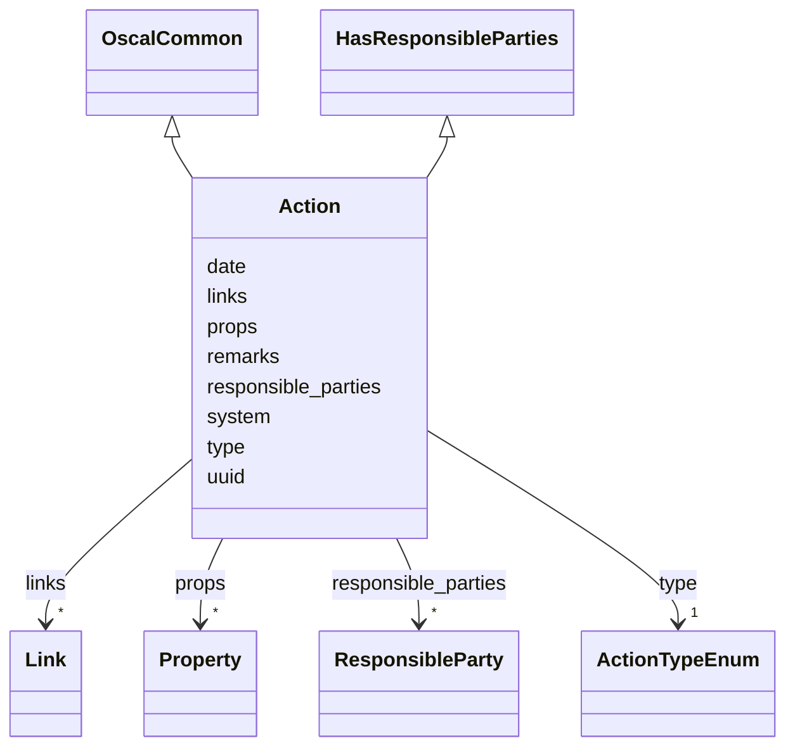

```mermaid
 classDiagram
    class Action
    click Action href "../Action"
      OscalCommon <|-- Action
        click OscalCommon href "../OscalCommon"
      HasResponsibleParties <|-- Action
        click HasResponsibleParties href "../HasResponsibleParties"
      
      Action : date
        
      Action : links
        
          
    
        
        
        Action --> "*" Link : links
        click Link href "../Link"
    

        
      Action : props
        
          
    
        
        
        Action --> "*" Property : props
        click Property href "../Property"
    

        
      Action : remarks
        
      Action : responsible_parties
        
          
    
        
        
        Action --> "*" ResponsibleParty : responsible_parties
        click ResponsibleParty href "../ResponsibleParty"
    

        
      Action : system
        
      Action : type
        
          
    
        
        
        Action --> "1" ActionTypeEnum : type
        click ActionTypeEnum href "../ActionTypeEnum"
    

        
      Action : uuid
        
      
```
