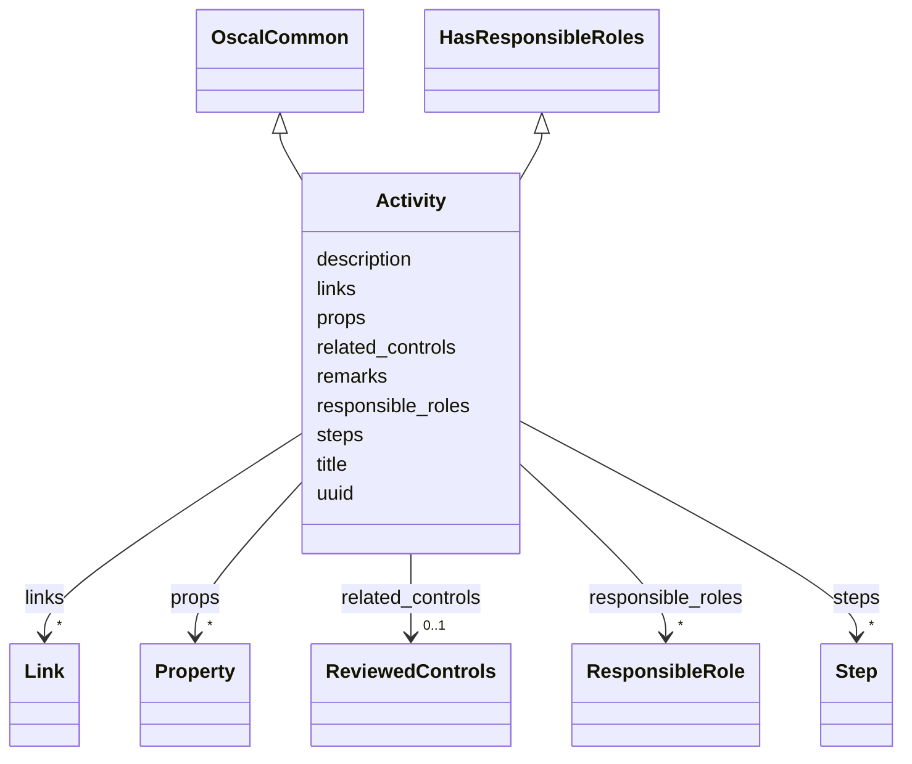

```mermaid
 classDiagram
    class Activity
    click Activity href "../Activity"
      OscalCommon <|-- Activity
        click OscalCommon href "../OscalCommon"
      HasResponsibleRoles <|-- Activity
        click HasResponsibleRoles href "../HasResponsibleRoles"
      
      Activity : description
        
      Activity : links
        
          
    
        
        
        Activity --> "*" Link : links
        click Link href "../Link"
    

        
      Activity : props
        
          
    
        
        
        Activity --> "*" Property : props
        click Property href "../Property"
    

        
      Activity : related_controls
        
          
    
        
        
        Activity --> "0..1" ReviewedControls : related_controls
        click ReviewedControls href "../ReviewedControls"
    

        
      Activity : remarks
        
      Activity : responsible_roles
        
          
    
        
        
        Activity --> "*" ResponsibleRole : responsible_roles
        click ResponsibleRole href "../ResponsibleRole"
    

        
      Activity : steps
        
          
    
        
        
        Activity --> "*" Step : steps
        click Step href "../Step"
    

        
      Activity : title
        
      Activity : uuid
        
      
```
