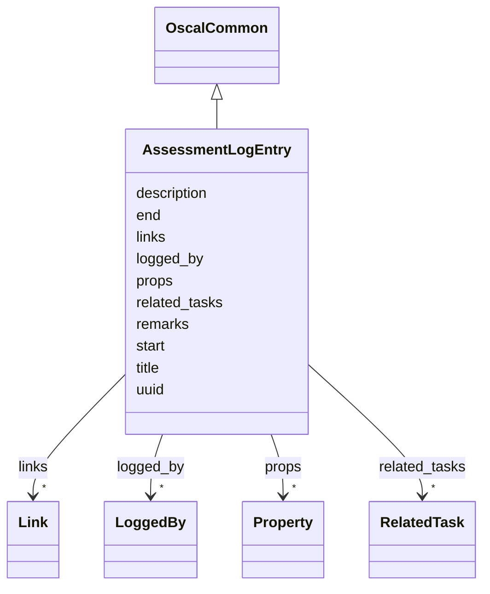

```mermaid
 classDiagram
    class AssessmentLogEntry
    click AssessmentLogEntry href "../AssessmentLogEntry"
      OscalCommon <|-- AssessmentLogEntry
        click OscalCommon href "../OscalCommon"
      
      AssessmentLogEntry : description
        
      AssessmentLogEntry : end
        
      AssessmentLogEntry : links
        
          
    
        
        
        AssessmentLogEntry --> "*" Link : links
        click Link href "../Link"
    

        
      AssessmentLogEntry : logged_by
        
          
    
        
        
        AssessmentLogEntry --> "*" LoggedBy : logged_by
        click LoggedBy href "../LoggedBy"
    

        
      AssessmentLogEntry : props
        
          
    
        
        
        AssessmentLogEntry --> "*" Property : props
        click Property href "../Property"
    

        
      AssessmentLogEntry : related_tasks
        
          
    
        
        
        AssessmentLogEntry --> "*" RelatedTask : related_tasks
        click RelatedTask href "../RelatedTask"
    

        
      AssessmentLogEntry : remarks
        
      AssessmentLogEntry : start
        
      AssessmentLogEntry : title
        
      AssessmentLogEntry : uuid
        
      
```
