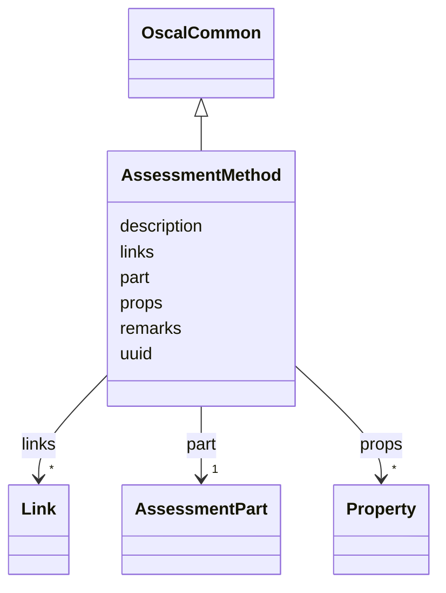

```mermaid
 classDiagram
    class AssessmentMethod
    click AssessmentMethod href "../AssessmentMethod"
      OscalCommon <|-- AssessmentMethod
        click OscalCommon href "../OscalCommon"
      
      AssessmentMethod : description
        
      AssessmentMethod : links
        
          
    
        
        
        AssessmentMethod --> "*" Link : links
        click Link href "../Link"
    

        
      AssessmentMethod : part
        
          
    
        
        
        AssessmentMethod --> "1" AssessmentPart : part
        click AssessmentPart href "../AssessmentPart"
    

        
      AssessmentMethod : props
        
          
    
        
        
        AssessmentMethod --> "*" Property : props
        click Property href "../Property"
    

        
      AssessmentMethod : remarks
        
      AssessmentMethod : uuid
        
      
```
