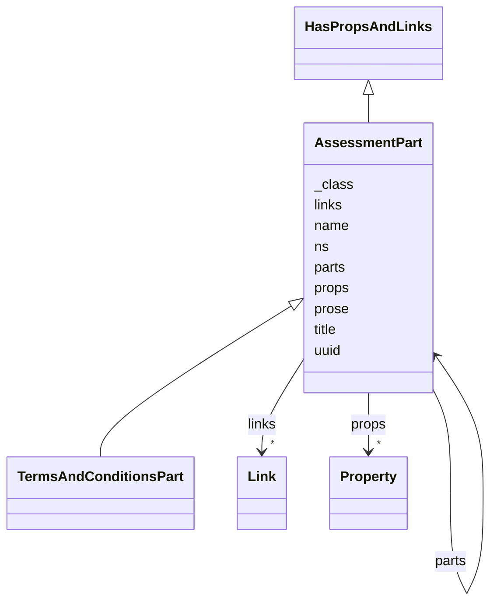

```mermaid
 classDiagram
    class AssessmentPart
    click AssessmentPart href "../AssessmentPart"
      HasPropsAndLinks <|-- AssessmentPart
        click HasPropsAndLinks href "../HasPropsAndLinks"
      

      AssessmentPart <|-- TermsAndConditionsPart
        click TermsAndConditionsPart href "../TermsAndConditionsPart"
      

      AssessmentPart : _class
        
      AssessmentPart : links
        
          
    
        
        
        AssessmentPart --> "*" Link : links
        click Link href "../Link"
    

        
      AssessmentPart : name
        
      AssessmentPart : ns
        
      AssessmentPart : parts
        
          
    
        
        
        AssessmentPart --> "*" AssessmentPart : parts
        click AssessmentPart href "../AssessmentPart"
    

        
      AssessmentPart : props
        
          
    
        
        
        AssessmentPart --> "*" Property : props
        click Property href "../Property"
    

        
      AssessmentPart : prose
        
      AssessmentPart : title
        
      AssessmentPart : uuid
        
      
```
