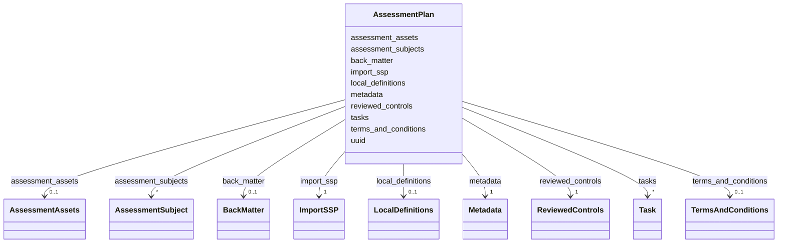

```mermaid
 classDiagram
    class AssessmentPlan
    click AssessmentPlan href "../AssessmentPlan"
      AssessmentPlan : assessment_assets
        
          
    
        
        
        AssessmentPlan --> "0..1" AssessmentAssets : assessment_assets
        click AssessmentAssets href "../AssessmentAssets"
    

        
      AssessmentPlan : assessment_subjects
        
          
    
        
        
        AssessmentPlan --> "*" AssessmentSubject : assessment_subjects
        click AssessmentSubject href "../AssessmentSubject"
    

        
      AssessmentPlan : back_matter
        
          
    
        
        
        AssessmentPlan --> "0..1" BackMatter : back_matter
        click BackMatter href "../BackMatter"
    

        
      AssessmentPlan : import_ssp
        
          
    
        
        
        AssessmentPlan --> "1" ImportSSP : import_ssp
        click ImportSSP href "../ImportSSP"
    

        
      AssessmentPlan : local_definitions
        
          
    
        
        
        AssessmentPlan --> "0..1" LocalDefinitions : local_definitions
        click LocalDefinitions href "../LocalDefinitions"
    

        
      AssessmentPlan : metadata
        
          
    
        
        
        AssessmentPlan --> "1" Metadata : metadata
        click Metadata href "../Metadata"
    

        
      AssessmentPlan : reviewed_controls
        
          
    
        
        
        AssessmentPlan --> "1" ReviewedControls : reviewed_controls
        click ReviewedControls href "../ReviewedControls"
    

        
      AssessmentPlan : tasks
        
          
    
        
        
        AssessmentPlan --> "*" Task : tasks
        click Task href "../Task"
    

        
      AssessmentPlan : terms_and_conditions
        
          
    
        
        
        AssessmentPlan --> "0..1" TermsAndConditions : terms_and_conditions
        click TermsAndConditions href "../TermsAndConditions"
    

        
      AssessmentPlan : uuid
        
      
```
