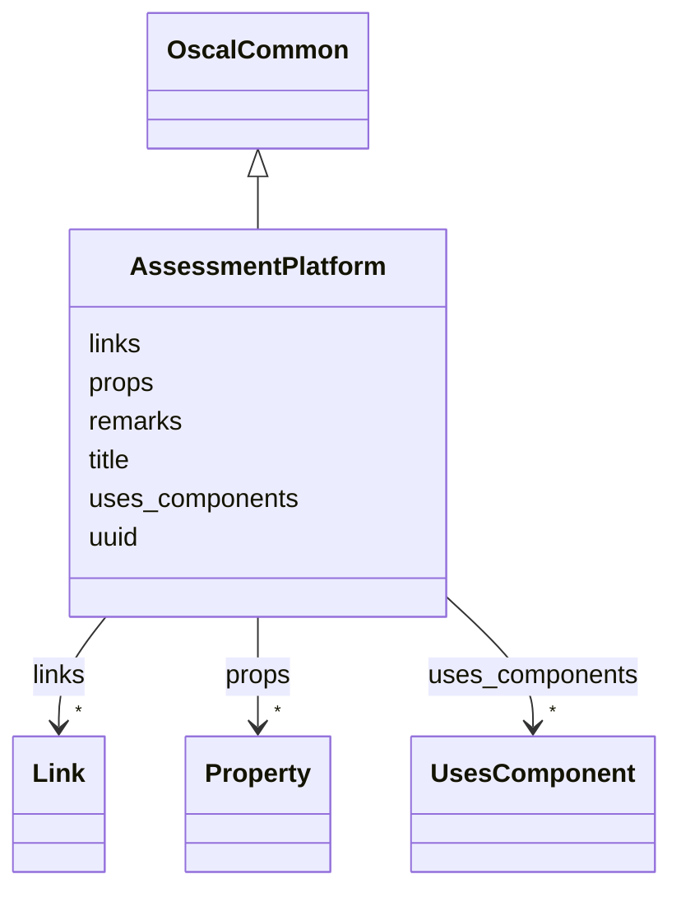

```mermaid
 classDiagram
    class AssessmentPlatform
    click AssessmentPlatform href "../AssessmentPlatform"
      OscalCommon <|-- AssessmentPlatform
        click OscalCommon href "../OscalCommon"
      
      AssessmentPlatform : links
        
          
    
        
        
        AssessmentPlatform --> "*" Link : links
        click Link href "../Link"
    

        
      AssessmentPlatform : props
        
          
    
        
        
        AssessmentPlatform --> "*" Property : props
        click Property href "../Property"
    

        
      AssessmentPlatform : remarks
        
      AssessmentPlatform : title
        
      AssessmentPlatform : uses_components
        
          
    
        
        
        AssessmentPlatform --> "*" UsesComponent : uses_components
        click UsesComponent href "../UsesComponent"
    

        
      AssessmentPlatform : uuid
        
      
```
