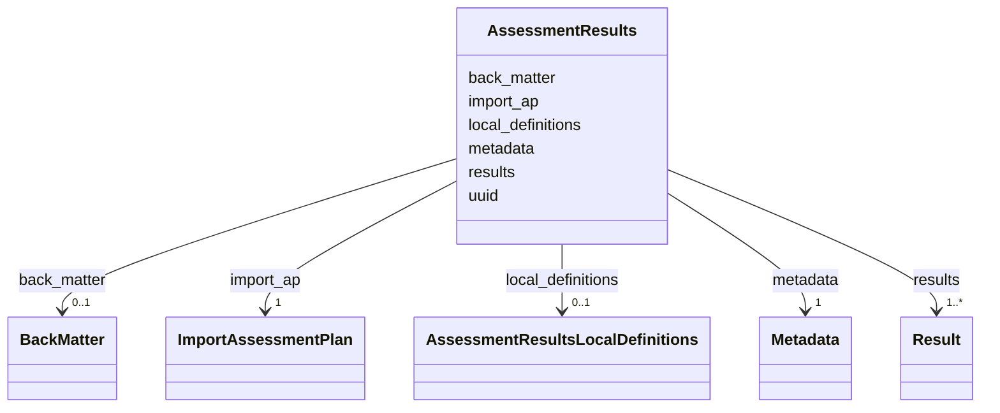

```mermaid
 classDiagram
    class AssessmentResults
    click AssessmentResults href "../AssessmentResults"
      AssessmentResults : back_matter
        
          
    
        
        
        AssessmentResults --> "0..1" BackMatter : back_matter
        click BackMatter href "../BackMatter"
    

        
      AssessmentResults : import_ap
        
          
    
        
        
        AssessmentResults --> "1" ImportAssessmentPlan : import_ap
        click ImportAssessmentPlan href "../ImportAssessmentPlan"
    

        
      AssessmentResults : local_definitions
        
          
    
        
        
        AssessmentResults --> "0..1" AssessmentResultsLocalDefinitions : local_definitions
        click AssessmentResultsLocalDefinitions href "../AssessmentResultsLocalDefinitions"
    

        
      AssessmentResults : metadata
        
          
    
        
        
        AssessmentResults --> "1" Metadata : metadata
        click Metadata href "../Metadata"
    

        
      AssessmentResults : results
        
          
    
        
        
        AssessmentResults --> "1..*" Result : results
        click Result href "../Result"
    

        
      AssessmentResults : uuid
        
      
```
