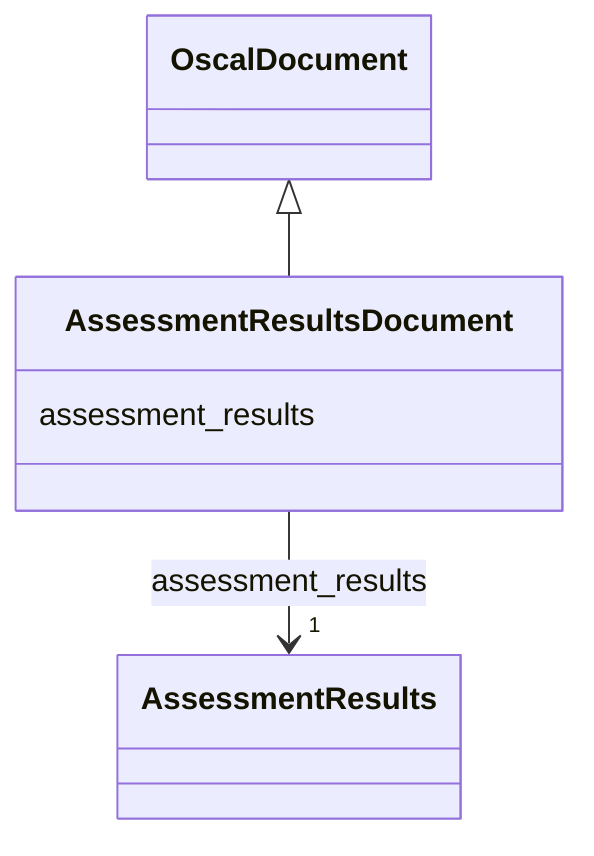

```mermaid
 classDiagram
    class AssessmentResultsDocument
    click AssessmentResultsDocument href "../AssessmentResultsDocument"
      OscalDocument <|-- AssessmentResultsDocument
        click OscalDocument href "../OscalDocument"
      
      AssessmentResultsDocument : assessment_results
        
          
    
        
        
        AssessmentResultsDocument --> "1" AssessmentResults : assessment_results
        click AssessmentResults href "../AssessmentResults"
    

        
      
```
