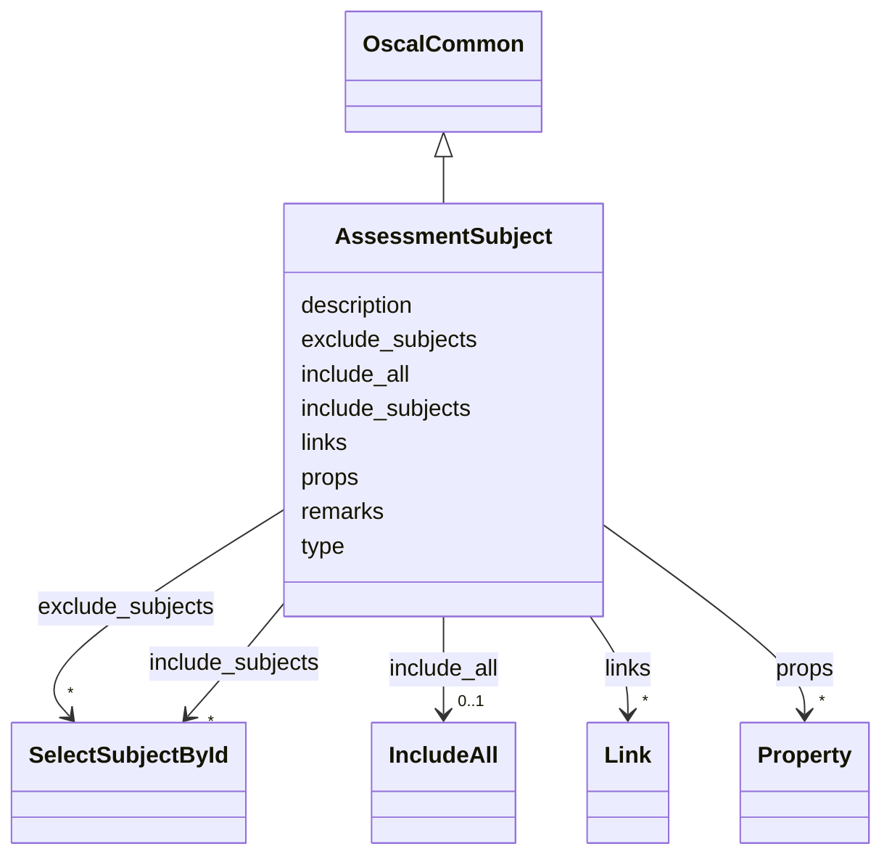

```mermaid
 classDiagram
    class AssessmentSubject
    click AssessmentSubject href "../AssessmentSubject"
      OscalCommon <|-- AssessmentSubject
        click OscalCommon href "../OscalCommon"
      
      AssessmentSubject : description
        
      AssessmentSubject : exclude_subjects
        
          
    
        
        
        AssessmentSubject --> "*" SelectSubjectById : exclude_subjects
        click SelectSubjectById href "../SelectSubjectById"
    

        
      AssessmentSubject : include_all
        
          
    
        
        
        AssessmentSubject --> "0..1" IncludeAll : include_all
        click IncludeAll href "../IncludeAll"
    

        
      AssessmentSubject : include_subjects
        
          
    
        
        
        AssessmentSubject --> "*" SelectSubjectById : include_subjects
        click SelectSubjectById href "../SelectSubjectById"
    

        
      AssessmentSubject : links
        
          
    
        
        
        AssessmentSubject --> "*" Link : links
        click Link href "../Link"
    

        
      AssessmentSubject : props
        
          
    
        
        
        AssessmentSubject --> "*" Property : props
        click Property href "../Property"
    

        
      AssessmentSubject : remarks
        
      AssessmentSubject : type
        
      
```
