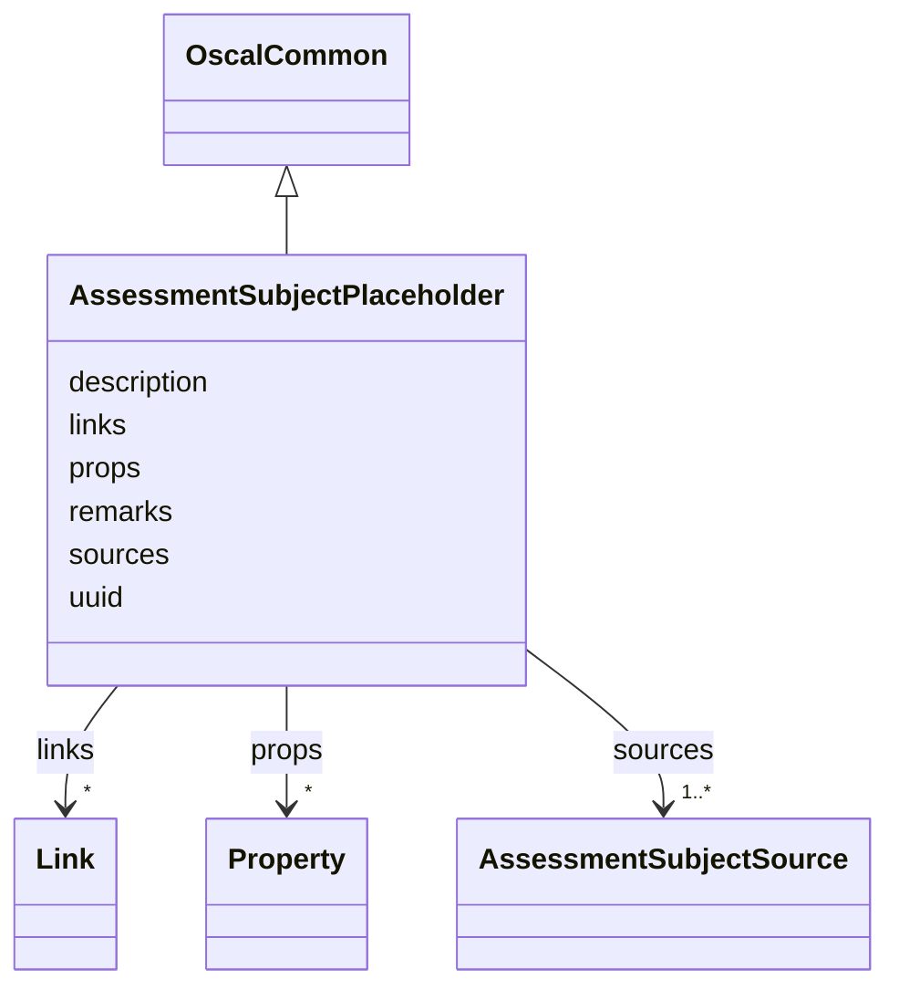

```mermaid
 classDiagram
    class AssessmentSubjectPlaceholder
    click AssessmentSubjectPlaceholder href "../AssessmentSubjectPlaceholder"
      OscalCommon <|-- AssessmentSubjectPlaceholder
        click OscalCommon href "../OscalCommon"
      
      AssessmentSubjectPlaceholder : description
        
      AssessmentSubjectPlaceholder : links
        
          
    
        
        
        AssessmentSubjectPlaceholder --> "*" Link : links
        click Link href "../Link"
    

        
      AssessmentSubjectPlaceholder : props
        
          
    
        
        
        AssessmentSubjectPlaceholder --> "*" Property : props
        click Property href "../Property"
    

        
      AssessmentSubjectPlaceholder : remarks
        
      AssessmentSubjectPlaceholder : sources
        
          
    
        
        
        AssessmentSubjectPlaceholder --> "1..*" AssessmentSubjectSource : sources
        click AssessmentSubjectSource href "../AssessmentSubjectSource"
    

        
      AssessmentSubjectPlaceholder : uuid
        
      
```
