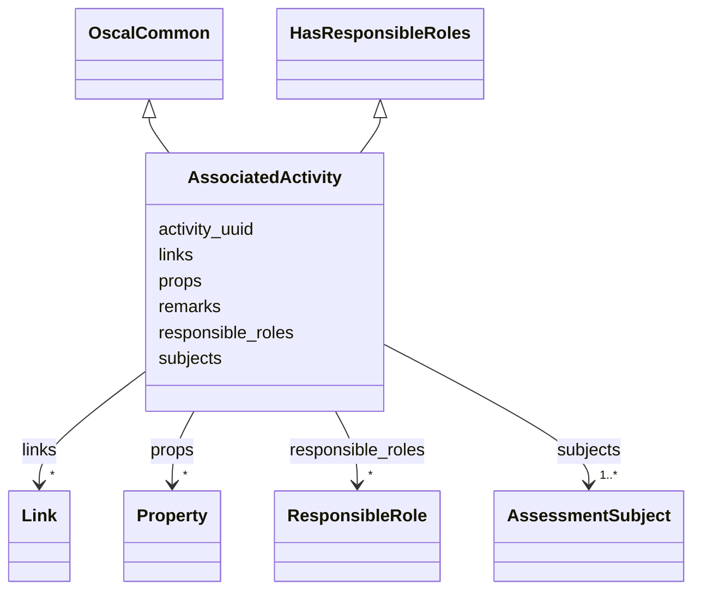

```mermaid
 classDiagram
    class AssociatedActivity
    click AssociatedActivity href "../AssociatedActivity"
      OscalCommon <|-- AssociatedActivity
        click OscalCommon href "../OscalCommon"
      HasResponsibleRoles <|-- AssociatedActivity
        click HasResponsibleRoles href "../HasResponsibleRoles"
      
      AssociatedActivity : activity_uuid
        
      AssociatedActivity : links
        
          
    
        
        
        AssociatedActivity --> "*" Link : links
        click Link href "../Link"
    

        
      AssociatedActivity : props
        
          
    
        
        
        AssociatedActivity --> "*" Property : props
        click Property href "../Property"
    

        
      AssociatedActivity : remarks
        
      AssociatedActivity : responsible_roles
        
          
    
        
        
        AssociatedActivity --> "*" ResponsibleRole : responsible_roles
        click ResponsibleRole href "../ResponsibleRole"
    

        
      AssociatedActivity : subjects
        
          
    
        
        
        AssociatedActivity --> "1..*" AssessmentSubject : subjects
        click AssessmentSubject href "../AssessmentSubject"
    

        
      
```
