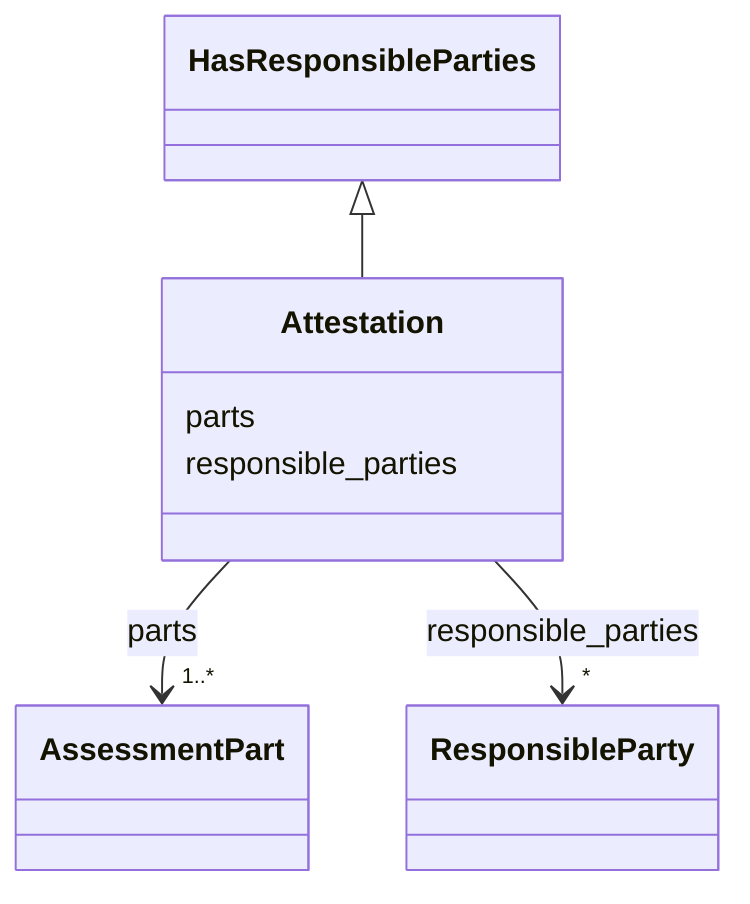

```mermaid
 classDiagram
    class Attestation
    click Attestation href "../Attestation"
      HasResponsibleParties <|-- Attestation
        click HasResponsibleParties href "../HasResponsibleParties"
      
      Attestation : parts
        
          
    
        
        
        Attestation --> "1..*" AssessmentPart : parts
        click AssessmentPart href "../AssessmentPart"
    

        
      Attestation : responsible_parties
        
          
    
        
        
        Attestation --> "*" ResponsibleParty : responsible_parties
        click ResponsibleParty href "../ResponsibleParty"
    

        
      
```
