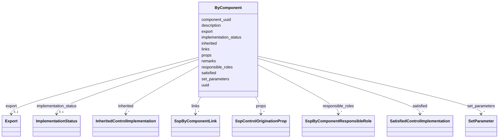

```mermaid
 classDiagram
    class ByComponent
    click ByComponent href "../ByComponent"
      ByComponent : component_uuid
        
      ByComponent : description
        
      ByComponent : export
        
          
    
        
        
        ByComponent --> "0..1" Export : export
        click Export href "../Export"
    

        
      ByComponent : implementation_status
        
          
    
        
        
        ByComponent --> "0..1" ImplementationStatus : implementation_status
        click ImplementationStatus href "../ImplementationStatus"
    

        
      ByComponent : inherited
        
          
    
        
        
        ByComponent --> "*" InheritedControlImplementation : inherited
        click InheritedControlImplementation href "../InheritedControlImplementation"
    

        
      ByComponent : links
        
          
    
        
        
        ByComponent --> "*" SspByComponentLink : links
        click SspByComponentLink href "../SspByComponentLink"
    

        
      ByComponent : props
        
          
    
        
        
        ByComponent --> "*" SspControlOriginationProp : props
        click SspControlOriginationProp href "../SspControlOriginationProp"
    

        
      ByComponent : remarks
        
      ByComponent : responsible_roles
        
          
    
        
        
        ByComponent --> "*" SspByComponentResponsibleRole : responsible_roles
        click SspByComponentResponsibleRole href "../SspByComponentResponsibleRole"
    

        
      ByComponent : satisfied
        
          
    
        
        
        ByComponent --> "*" SatisfiedControlImplementation : satisfied
        click SatisfiedControlImplementation href "../SatisfiedControlImplementation"
    

        
      ByComponent : set_parameters
        
          
    
        
        
        ByComponent --> "*" SetParameter : set_parameters
        click SetParameter href "../SetParameter"
    

        
      ByComponent : uuid
        
      
```
