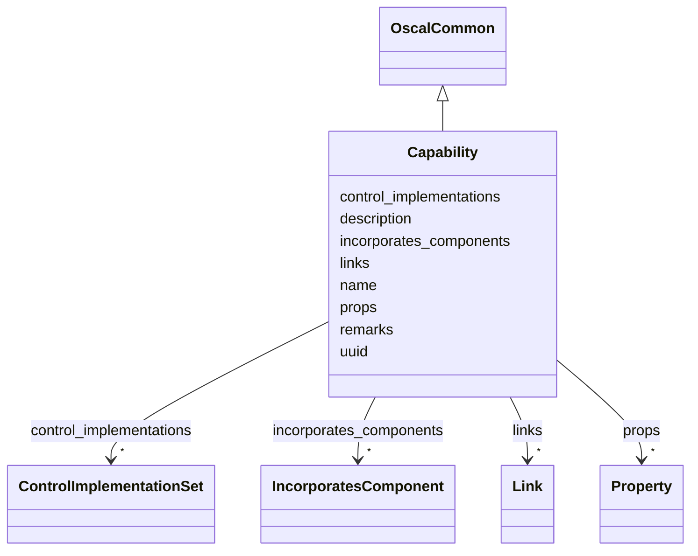

```mermaid
 classDiagram
    class Capability
    click Capability href "../Capability"
      OscalCommon <|-- Capability
        click OscalCommon href "../OscalCommon"
      
      Capability : control_implementations
        
          
    
        
        
        Capability --> "*" ControlImplementationSet : control_implementations
        click ControlImplementationSet href "../ControlImplementationSet"
    

        
      Capability : description
        
      Capability : incorporates_components
        
          
    
        
        
        Capability --> "*" IncorporatesComponent : incorporates_components
        click IncorporatesComponent href "../IncorporatesComponent"
    

        
      Capability : links
        
          
    
        
        
        Capability --> "*" Link : links
        click Link href "../Link"
    

        
      Capability : name
        
      Capability : props
        
          
    
        
        
        Capability --> "*" Property : props
        click Property href "../Property"
    

        
      Capability : remarks
        
      Capability : uuid
        
      
```
