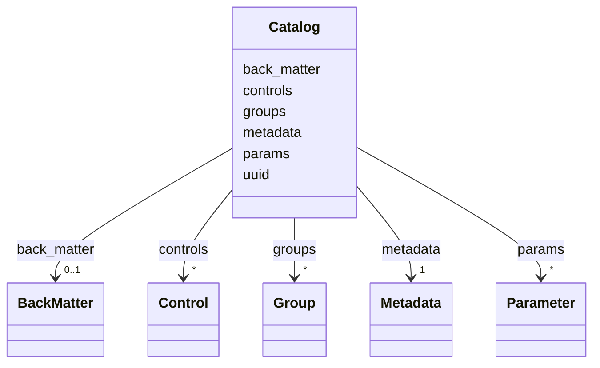

```mermaid
 classDiagram
    class Catalog
    click Catalog href "../Catalog"
      Catalog : back_matter
        
          
    
        
        
        Catalog --> "0..1" BackMatter : back_matter
        click BackMatter href "../BackMatter"
    

        
      Catalog : controls
        
          
    
        
        
        Catalog --> "*" Control : controls
        click Control href "../Control"
    

        
      Catalog : groups
        
          
    
        
        
        Catalog --> "*" Group : groups
        click Group href "../Group"
    

        
      Catalog : metadata
        
          
    
        
        
        Catalog --> "1" Metadata : metadata
        click Metadata href "../Metadata"
    

        
      Catalog : params
        
          
    
        
        
        Catalog --> "*" Parameter : params
        click Parameter href "../Parameter"
    

        
      Catalog : uuid
        
      
```
