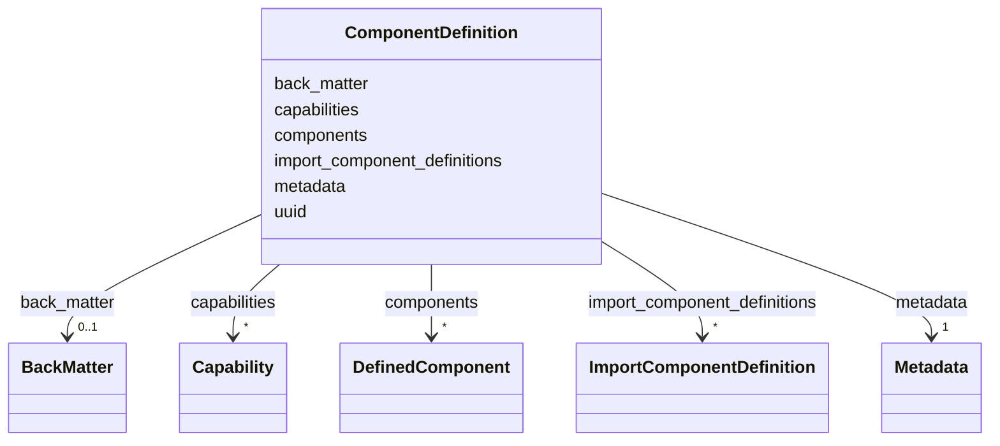

```mermaid
 classDiagram
    class ComponentDefinition
    click ComponentDefinition href "../ComponentDefinition"
      ComponentDefinition : back_matter
        
          
    
        
        
        ComponentDefinition --> "0..1" BackMatter : back_matter
        click BackMatter href "../BackMatter"
    

        
      ComponentDefinition : capabilities
        
          
    
        
        
        ComponentDefinition --> "*" Capability : capabilities
        click Capability href "../Capability"
    

        
      ComponentDefinition : components
        
          
    
        
        
        ComponentDefinition --> "*" DefinedComponent : components
        click DefinedComponent href "../DefinedComponent"
    

        
      ComponentDefinition : import_component_definitions
        
          
    
        
        
        ComponentDefinition --> "*" ImportComponentDefinition : import_component_definitions
        click ImportComponentDefinition href "../ImportComponentDefinition"
    

        
      ComponentDefinition : metadata
        
          
    
        
        
        ComponentDefinition --> "1" Metadata : metadata
        click Metadata href "../Metadata"
    

        
      ComponentDefinition : uuid
        
      
```
