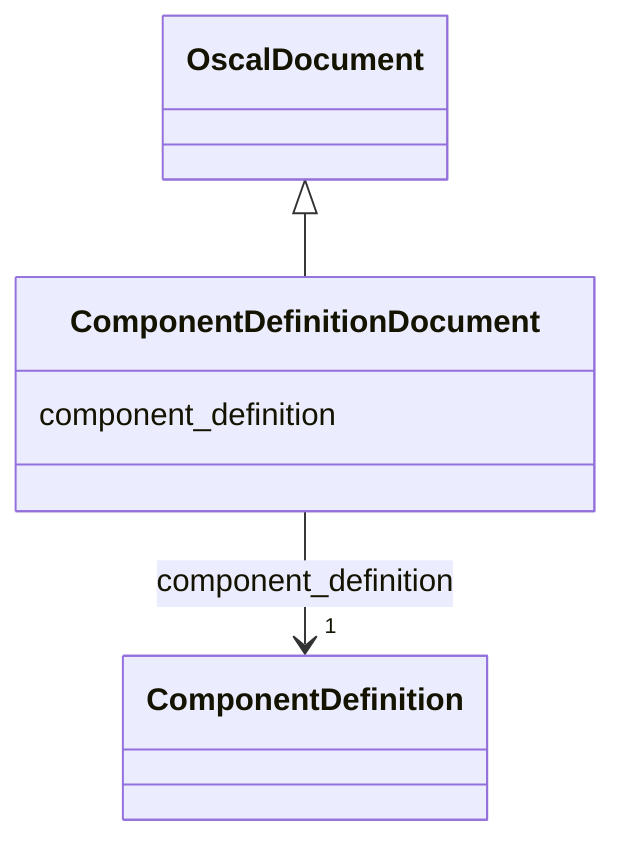

```mermaid
 classDiagram
    class ComponentDefinitionDocument
    click ComponentDefinitionDocument href "../ComponentDefinitionDocument"
      OscalDocument <|-- ComponentDefinitionDocument
        click OscalDocument href "../OscalDocument"
      
      ComponentDefinitionDocument : component_definition
        
          
    
        
        
        ComponentDefinitionDocument --> "1" ComponentDefinition : component_definition
        click ComponentDefinition href "../ComponentDefinition"
    

        
      
```
