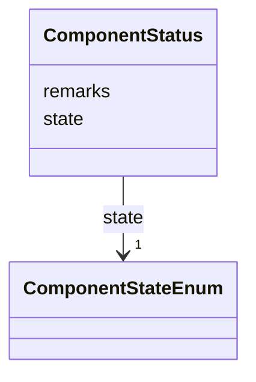

```mermaid
 classDiagram
    class ComponentStatus
    click ComponentStatus href "../ComponentStatus"
      ComponentStatus : remarks
        
      ComponentStatus : state
        
          
    
        
        
        ComponentStatus --> "1" ComponentStateEnum : state
        click ComponentStateEnum href "../ComponentStateEnum"
    

        
      
```
