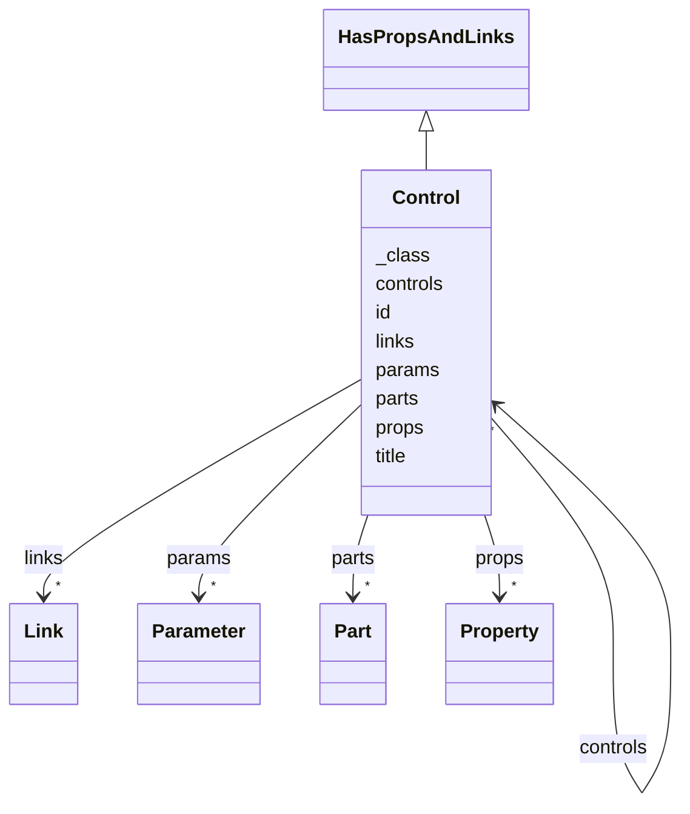

```mermaid
 classDiagram
    class Control
    click Control href "../Control"
      HasPropsAndLinks <|-- Control
        click HasPropsAndLinks href "../HasPropsAndLinks"
      
      Control : _class
        
      Control : controls
        
          
    
        
        
        Control --> "*" Control : controls
        click Control href "../Control"
    

        
      Control : id
        
      Control : links
        
          
    
        
        
        Control --> "*" Link : links
        click Link href "../Link"
    

        
      Control : params
        
          
    
        
        
        Control --> "*" Parameter : params
        click Parameter href "../Parameter"
    

        
      Control : parts
        
          
    
        
        
        Control --> "*" Part : parts
        click Part href "../Part"
    

        
      Control : props
        
          
    
        
        
        Control --> "*" Property : props
        click Property href "../Property"
    

        
      Control : title
        
      
```
