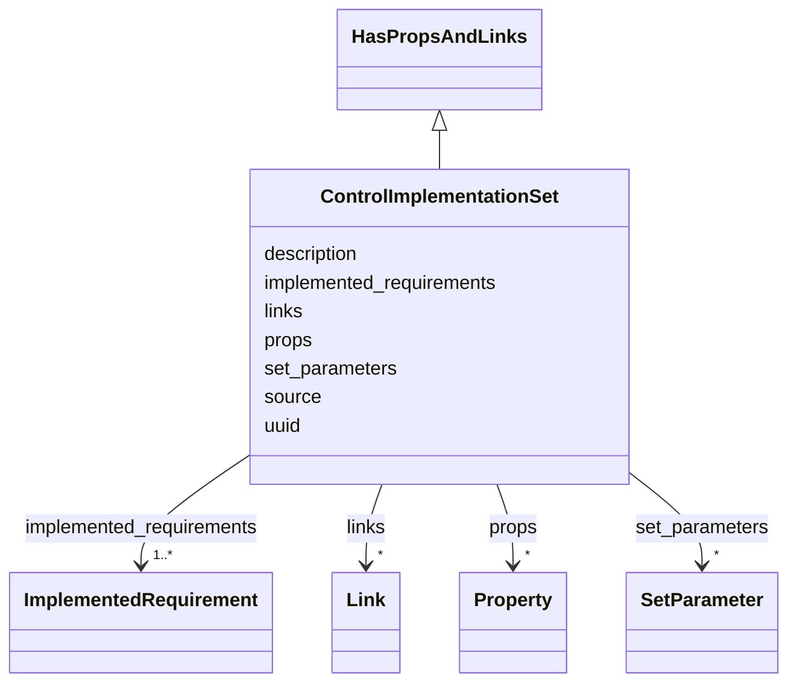

```mermaid
 classDiagram
    class ControlImplementationSet
    click ControlImplementationSet href "../ControlImplementationSet"
      HasPropsAndLinks <|-- ControlImplementationSet
        click HasPropsAndLinks href "../HasPropsAndLinks"
      
      ControlImplementationSet : description
        
      ControlImplementationSet : implemented_requirements
        
          
    
        
        
        ControlImplementationSet --> "1..*" ImplementedRequirement : implemented_requirements
        click ImplementedRequirement href "../ImplementedRequirement"
    

        
      ControlImplementationSet : links
        
          
    
        
        
        ControlImplementationSet --> "*" Link : links
        click Link href "../Link"
    

        
      ControlImplementationSet : props
        
          
    
        
        
        ControlImplementationSet --> "*" Property : props
        click Property href "../Property"
    

        
      ControlImplementationSet : set_parameters
        
          
    
        
        
        ControlImplementationSet --> "*" SetParameter : set_parameters
        click SetParameter href "../SetParameter"
    

        
      ControlImplementationSet : source
        
      ControlImplementationSet : uuid
        
      
```
