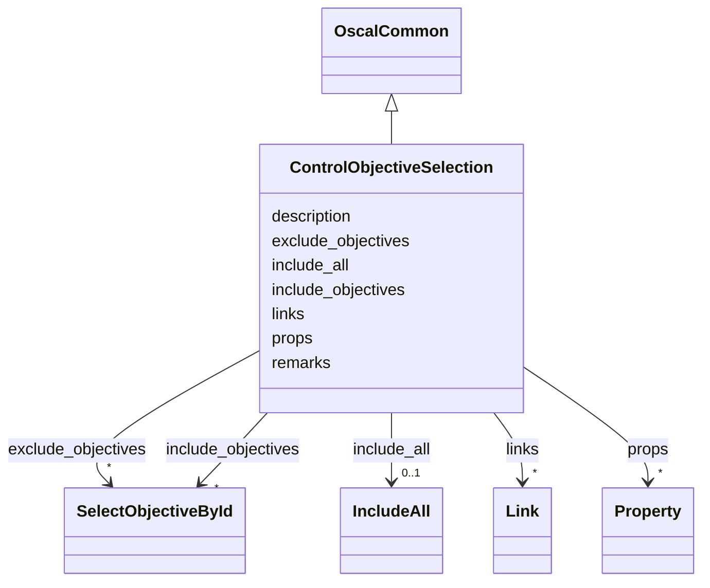

```mermaid
 classDiagram
    class ControlObjectiveSelection
    click ControlObjectiveSelection href "../ControlObjectiveSelection"
      OscalCommon <|-- ControlObjectiveSelection
        click OscalCommon href "../OscalCommon"
      
      ControlObjectiveSelection : description
        
      ControlObjectiveSelection : exclude_objectives
        
          
    
        
        
        ControlObjectiveSelection --> "*" SelectObjectiveById : exclude_objectives
        click SelectObjectiveById href "../SelectObjectiveById"
    

        
      ControlObjectiveSelection : include_all
        
          
    
        
        
        ControlObjectiveSelection --> "0..1" IncludeAll : include_all
        click IncludeAll href "../IncludeAll"
    

        
      ControlObjectiveSelection : include_objectives
        
          
    
        
        
        ControlObjectiveSelection --> "*" SelectObjectiveById : include_objectives
        click SelectObjectiveById href "../SelectObjectiveById"
    

        
      ControlObjectiveSelection : links
        
          
    
        
        
        ControlObjectiveSelection --> "*" Link : links
        click Link href "../Link"
    

        
      ControlObjectiveSelection : props
        
          
    
        
        
        ControlObjectiveSelection --> "*" Property : props
        click Property href "../Property"
    

        
      ControlObjectiveSelection : remarks
        
      
```
