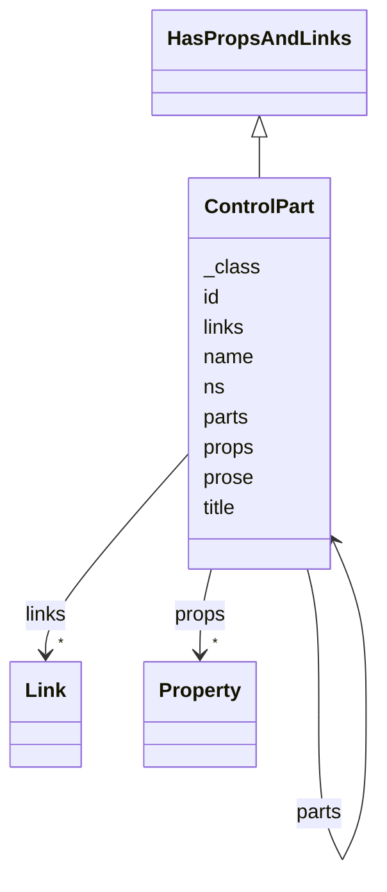

```mermaid
 classDiagram
    class ControlPart
    click ControlPart href "../ControlPart"
      HasPropsAndLinks <|-- ControlPart
        click HasPropsAndLinks href "../HasPropsAndLinks"
      
      ControlPart : _class
        
      ControlPart : id
        
      ControlPart : links
        
          
    
        
        
        ControlPart --> "*" Link : links
        click Link href "../Link"
    

        
      ControlPart : name
        
      ControlPart : ns
        
      ControlPart : parts
        
          
    
        
        
        ControlPart --> "*" ControlPart : parts
        click ControlPart href "../ControlPart"
    

        
      ControlPart : props
        
          
    
        
        
        ControlPart --> "*" Property : props
        click Property href "../Property"
    

        
      ControlPart : prose
        
      ControlPart : title
        
      
```
