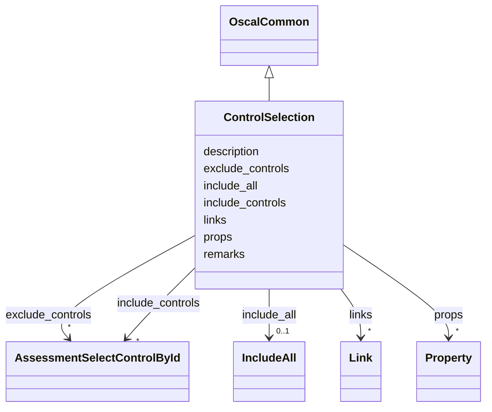

```mermaid
 classDiagram
    class ControlSelection
    click ControlSelection href "../ControlSelection"
      OscalCommon <|-- ControlSelection
        click OscalCommon href "../OscalCommon"
      
      ControlSelection : description
        
      ControlSelection : exclude_controls
        
          
    
        
        
        ControlSelection --> "*" AssessmentSelectControlById : exclude_controls
        click AssessmentSelectControlById href "../AssessmentSelectControlById"
    

        
      ControlSelection : include_all
        
          
    
        
        
        ControlSelection --> "0..1" IncludeAll : include_all
        click IncludeAll href "../IncludeAll"
    

        
      ControlSelection : include_controls
        
          
    
        
        
        ControlSelection --> "*" AssessmentSelectControlById : include_controls
        click AssessmentSelectControlById href "../AssessmentSelectControlById"
    

        
      ControlSelection : links
        
          
    
        
        
        ControlSelection --> "*" Link : links
        click Link href "../Link"
    

        
      ControlSelection : props
        
          
    
        
        
        ControlSelection --> "*" Property : props
        click Property href "../Property"
    

        
      ControlSelection : remarks
        
      
```
