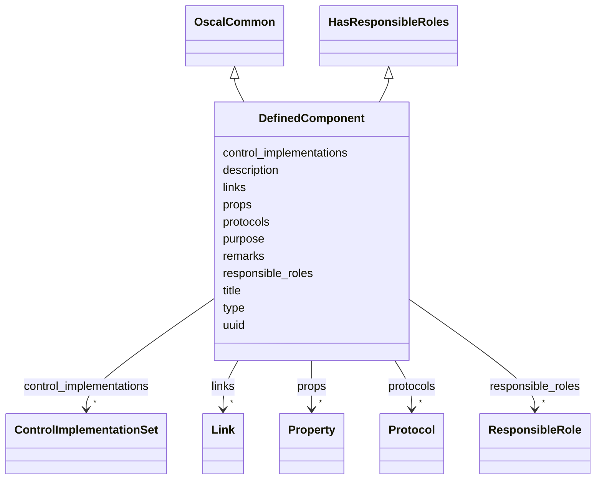

```mermaid
 classDiagram
    class DefinedComponent
    click DefinedComponent href "../DefinedComponent"
      OscalCommon <|-- DefinedComponent
        click OscalCommon href "../OscalCommon"
      HasResponsibleRoles <|-- DefinedComponent
        click HasResponsibleRoles href "../HasResponsibleRoles"
      
      DefinedComponent : control_implementations
        
          
    
        
        
        DefinedComponent --> "*" ControlImplementationSet : control_implementations
        click ControlImplementationSet href "../ControlImplementationSet"
    

        
      DefinedComponent : description
        
      DefinedComponent : links
        
          
    
        
        
        DefinedComponent --> "*" Link : links
        click Link href "../Link"
    

        
      DefinedComponent : props
        
          
    
        
        
        DefinedComponent --> "*" Property : props
        click Property href "../Property"
    

        
      DefinedComponent : protocols
        
          
    
        
        
        DefinedComponent --> "*" Protocol : protocols
        click Protocol href "../Protocol"
    

        
      DefinedComponent : purpose
        
      DefinedComponent : remarks
        
      DefinedComponent : responsible_roles
        
          
    
        
        
        DefinedComponent --> "*" ResponsibleRole : responsible_roles
        click ResponsibleRole href "../ResponsibleRole"
    

        
      DefinedComponent : title
        
      DefinedComponent : type
        
      DefinedComponent : uuid
        
      
```
