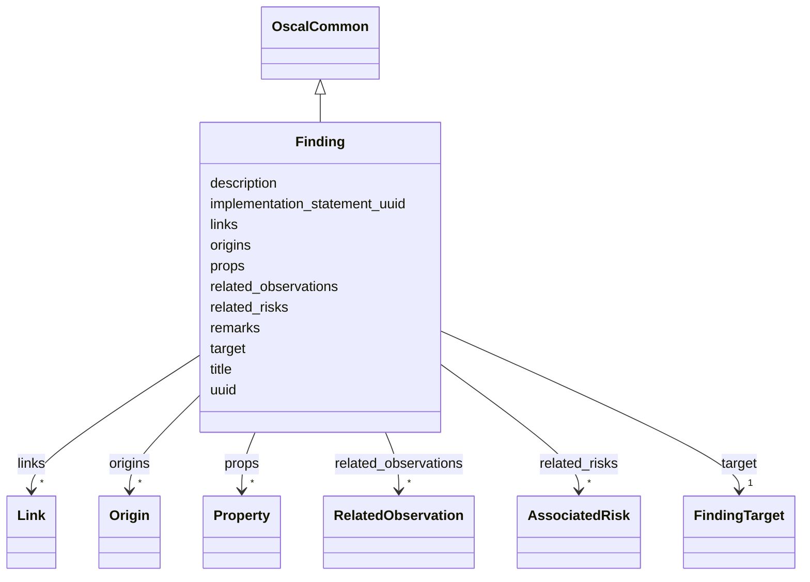

```mermaid
 classDiagram
    class Finding
    click Finding href "../Finding"
      OscalCommon <|-- Finding
        click OscalCommon href "../OscalCommon"
      
      Finding : description
        
      Finding : implementation_statement_uuid
        
      Finding : links
        
          
    
        
        
        Finding --> "*" Link : links
        click Link href "../Link"
    

        
      Finding : origins
        
          
    
        
        
        Finding --> "*" Origin : origins
        click Origin href "../Origin"
    

        
      Finding : props
        
          
    
        
        
        Finding --> "*" Property : props
        click Property href "../Property"
    

        
      Finding : related_observations
        
          
    
        
        
        Finding --> "*" RelatedObservation : related_observations
        click RelatedObservation href "../RelatedObservation"
    

        
      Finding : related_risks
        
          
    
        
        
        Finding --> "*" AssociatedRisk : related_risks
        click AssociatedRisk href "../AssociatedRisk"
    

        
      Finding : remarks
        
      Finding : target
        
          
    
        
        
        Finding --> "1" FindingTarget : target
        click FindingTarget href "../FindingTarget"
    

        
      Finding : title
        
      Finding : uuid
        
      
```
