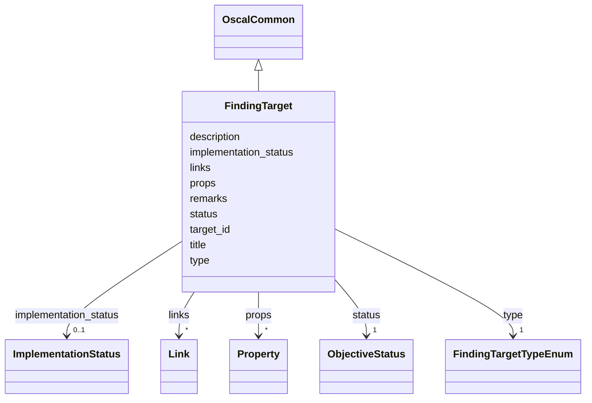

```mermaid
 classDiagram
    class FindingTarget
    click FindingTarget href "../FindingTarget"
      OscalCommon <|-- FindingTarget
        click OscalCommon href "../OscalCommon"
      
      FindingTarget : description
        
      FindingTarget : implementation_status
        
          
    
        
        
        FindingTarget --> "0..1" ImplementationStatus : implementation_status
        click ImplementationStatus href "../ImplementationStatus"
    

        
      FindingTarget : links
        
          
    
        
        
        FindingTarget --> "*" Link : links
        click Link href "../Link"
    

        
      FindingTarget : props
        
          
    
        
        
        FindingTarget --> "*" Property : props
        click Property href "../Property"
    

        
      FindingTarget : remarks
        
      FindingTarget : status
        
          
    
        
        
        FindingTarget --> "1" ObjectiveStatus : status
        click ObjectiveStatus href "../ObjectiveStatus"
    

        
      FindingTarget : target_id
        
      FindingTarget : title
        
      FindingTarget : type
        
          
    
        
        
        FindingTarget --> "1" FindingTargetTypeEnum : type
        click FindingTargetTypeEnum href "../FindingTargetTypeEnum"
    

        
      
```
