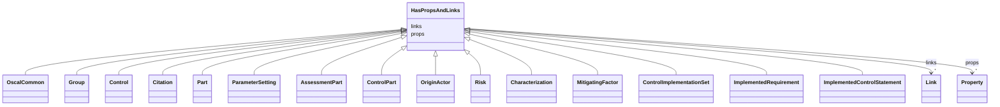

```mermaid
 classDiagram
    class HasPropsAndLinks
    click HasPropsAndLinks href "../HasPropsAndLinks"
      HasPropsAndLinks <|-- OscalCommon
        click OscalCommon href "../OscalCommon"
      HasPropsAndLinks <|-- Group
        click Group href "../Group"
      HasPropsAndLinks <|-- Control
        click Control href "../Control"
      HasPropsAndLinks <|-- Citation
        click Citation href "../Citation"
      HasPropsAndLinks <|-- Part
        click Part href "../Part"
      HasPropsAndLinks <|-- ParameterSetting
        click ParameterSetting href "../ParameterSetting"
      HasPropsAndLinks <|-- AssessmentPart
        click AssessmentPart href "../AssessmentPart"
      HasPropsAndLinks <|-- ControlPart
        click ControlPart href "../ControlPart"
      HasPropsAndLinks <|-- OriginActor
        click OriginActor href "../OriginActor"
      HasPropsAndLinks <|-- Risk
        click Risk href "../Risk"
      HasPropsAndLinks <|-- Characterization
        click Characterization href "../Characterization"
      HasPropsAndLinks <|-- MitigatingFactor
        click MitigatingFactor href "../MitigatingFactor"
      HasPropsAndLinks <|-- ControlImplementationSet
        click ControlImplementationSet href "../ControlImplementationSet"
      HasPropsAndLinks <|-- ImplementedRequirement
        click ImplementedRequirement href "../ImplementedRequirement"
      HasPropsAndLinks <|-- ImplementedControlStatement
        click ImplementedControlStatement href "../ImplementedControlStatement"
      
      HasPropsAndLinks : links
        
          
    
        
        
        HasPropsAndLinks --> "*" Link : links
        click Link href "../Link"
    

        
      HasPropsAndLinks : props
        
          
    
        
        
        HasPropsAndLinks --> "*" Property : props
        click Property href "../Property"
    

        
      
```
