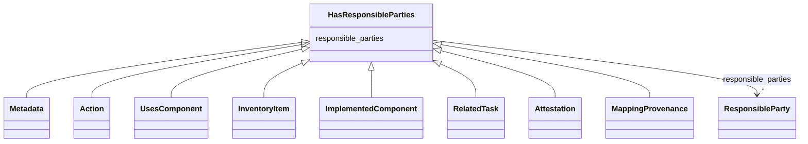

```mermaid
 classDiagram
    class HasResponsibleParties
    click HasResponsibleParties href "../HasResponsibleParties"
      HasResponsibleParties <|-- Metadata
        click Metadata href "../Metadata"
      HasResponsibleParties <|-- Action
        click Action href "../Action"
      HasResponsibleParties <|-- UsesComponent
        click UsesComponent href "../UsesComponent"
      HasResponsibleParties <|-- InventoryItem
        click InventoryItem href "../InventoryItem"
      HasResponsibleParties <|-- ImplementedComponent
        click ImplementedComponent href "../ImplementedComponent"
      HasResponsibleParties <|-- RelatedTask
        click RelatedTask href "../RelatedTask"
      HasResponsibleParties <|-- Attestation
        click Attestation href "../Attestation"
      HasResponsibleParties <|-- MappingProvenance
        click MappingProvenance href "../MappingProvenance"
      
      HasResponsibleParties : responsible_parties
        
          
    
        
        
        HasResponsibleParties --> "*" ResponsibleParty : responsible_parties
        click ResponsibleParty href "../ResponsibleParty"
    

        
      
```
