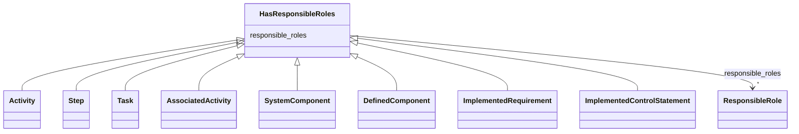

```mermaid
 classDiagram
    class HasResponsibleRoles
    click HasResponsibleRoles href "../HasResponsibleRoles"
      HasResponsibleRoles <|-- Activity
        click Activity href "../Activity"
      HasResponsibleRoles <|-- Step
        click Step href "../Step"
      HasResponsibleRoles <|-- Task
        click Task href "../Task"
      HasResponsibleRoles <|-- AssociatedActivity
        click AssociatedActivity href "../AssociatedActivity"
      HasResponsibleRoles <|-- SystemComponent
        click SystemComponent href "../SystemComponent"
      HasResponsibleRoles <|-- DefinedComponent
        click DefinedComponent href "../DefinedComponent"
      HasResponsibleRoles <|-- ImplementedRequirement
        click ImplementedRequirement href "../ImplementedRequirement"
      HasResponsibleRoles <|-- ImplementedControlStatement
        click ImplementedControlStatement href "../ImplementedControlStatement"
      
      HasResponsibleRoles : responsible_roles
        
          
    
        
        
        HasResponsibleRoles --> "*" ResponsibleRole : responsible_roles
        click ResponsibleRole href "../ResponsibleRole"
    

        
      
```
