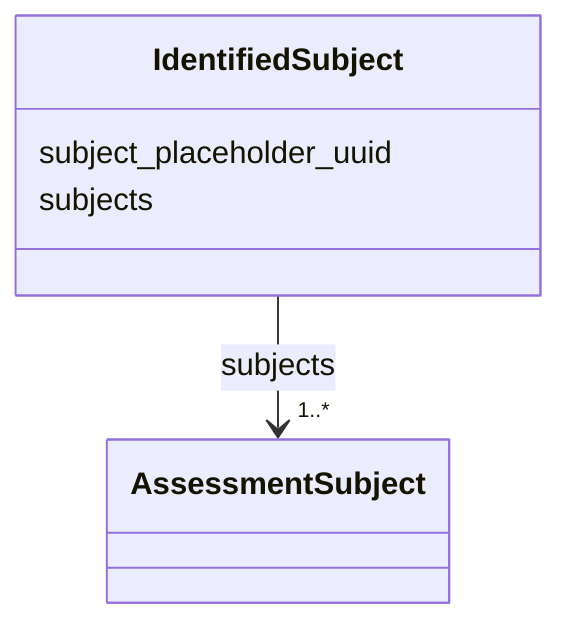

```mermaid
 classDiagram
    class IdentifiedSubject
    click IdentifiedSubject href "../IdentifiedSubject"
      IdentifiedSubject : subject_placeholder_uuid
        
      IdentifiedSubject : subjects
        
          
    
        
        
        IdentifiedSubject --> "1..*" AssessmentSubject : subjects
        click AssessmentSubject href "../AssessmentSubject"
    

        
      
```
