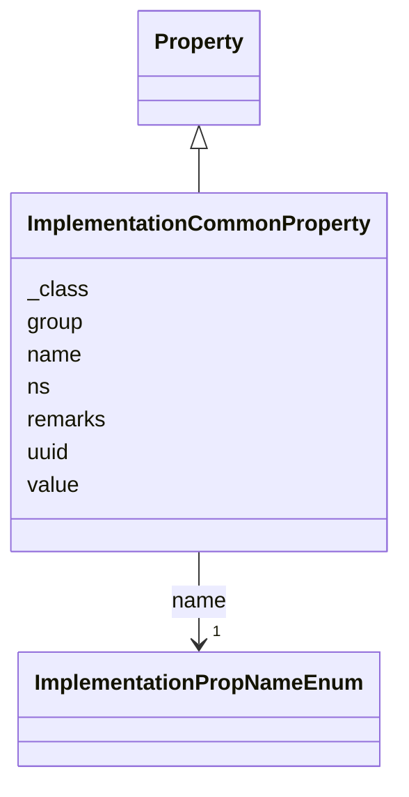

```mermaid
 classDiagram
    class ImplementationCommonProperty
    click ImplementationCommonProperty href "../ImplementationCommonProperty"
      Property <|-- ImplementationCommonProperty
        click Property href "../Property"
      
      ImplementationCommonProperty : _class
        
      ImplementationCommonProperty : group
        
      ImplementationCommonProperty : name
        
          
    
        
        
        ImplementationCommonProperty --> "1" ImplementationPropNameEnum : name
        click ImplementationPropNameEnum href "../ImplementationPropNameEnum"
    

        
      ImplementationCommonProperty : ns
        
      ImplementationCommonProperty : remarks
        
      ImplementationCommonProperty : uuid
        
      ImplementationCommonProperty : value
        
      
```
