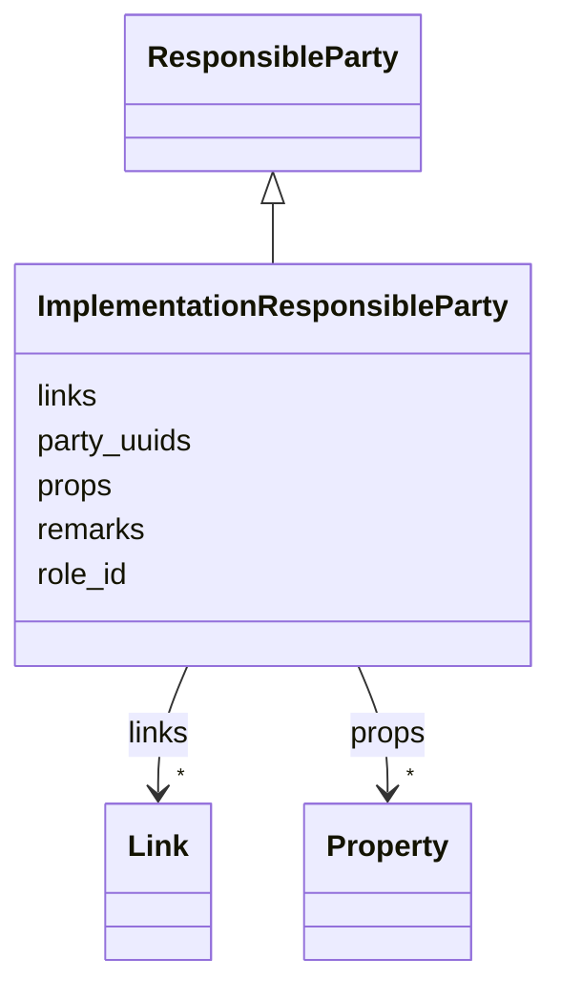

```mermaid
 classDiagram
    class ImplementationResponsibleParty
    click ImplementationResponsibleParty href "../ImplementationResponsibleParty"
      ResponsibleParty <|-- ImplementationResponsibleParty
        click ResponsibleParty href "../ResponsibleParty"
      
      ImplementationResponsibleParty : links
        
          
    
        
        
        ImplementationResponsibleParty --> "*" Link : links
        click Link href "../Link"
    

        
      ImplementationResponsibleParty : party_uuids
        
      ImplementationResponsibleParty : props
        
          
    
        
        
        ImplementationResponsibleParty --> "*" Property : props
        click Property href "../Property"
    

        
      ImplementationResponsibleParty : remarks
        
      ImplementationResponsibleParty : role_id
        
      
```
