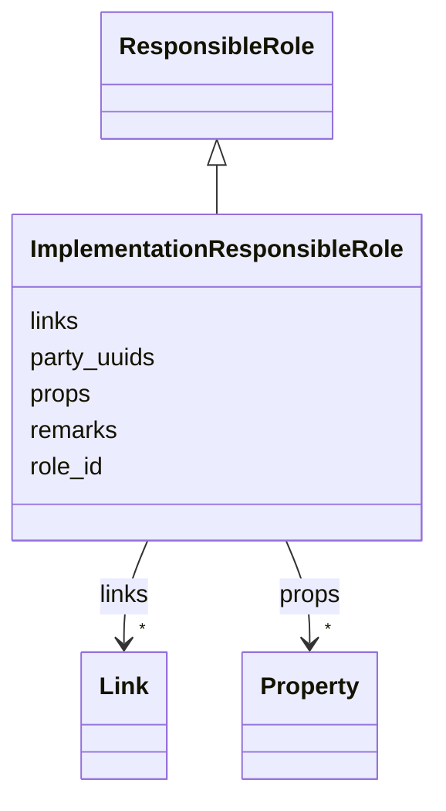

```mermaid
 classDiagram
    class ImplementationResponsibleRole
    click ImplementationResponsibleRole href "../ImplementationResponsibleRole"
      ResponsibleRole <|-- ImplementationResponsibleRole
        click ResponsibleRole href "../ResponsibleRole"
      
      ImplementationResponsibleRole : links
        
          
    
        
        
        ImplementationResponsibleRole --> "*" Link : links
        click Link href "../Link"
    

        
      ImplementationResponsibleRole : party_uuids
        
      ImplementationResponsibleRole : props
        
          
    
        
        
        ImplementationResponsibleRole --> "*" Property : props
        click Property href "../Property"
    

        
      ImplementationResponsibleRole : remarks
        
      ImplementationResponsibleRole : role_id
        
      
```
