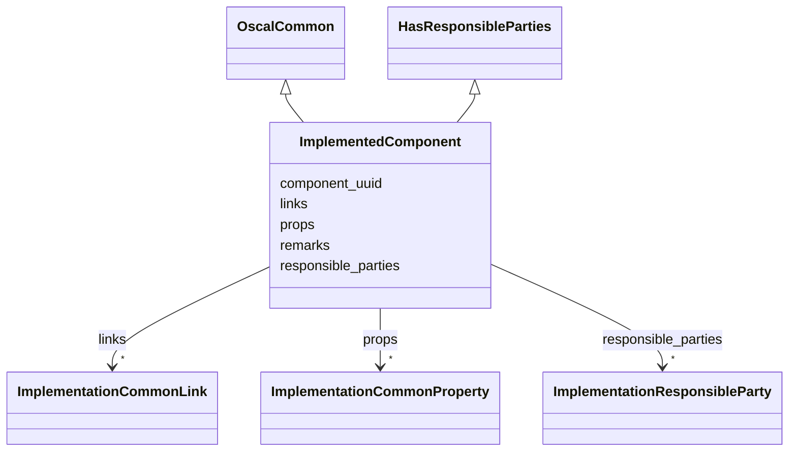

```mermaid
 classDiagram
    class ImplementedComponent
    click ImplementedComponent href "../ImplementedComponent"
      OscalCommon <|-- ImplementedComponent
        click OscalCommon href "../OscalCommon"
      HasResponsibleParties <|-- ImplementedComponent
        click HasResponsibleParties href "../HasResponsibleParties"
      
      ImplementedComponent : component_uuid
        
      ImplementedComponent : links
        
          
    
        
        
        ImplementedComponent --> "*" ImplementationCommonLink : links
        click ImplementationCommonLink href "../ImplementationCommonLink"
    

        
      ImplementedComponent : props
        
          
    
        
        
        ImplementedComponent --> "*" ImplementationCommonProperty : props
        click ImplementationCommonProperty href "../ImplementationCommonProperty"
    

        
      ImplementedComponent : remarks
        
      ImplementedComponent : responsible_parties
        
          
    
        
        
        ImplementedComponent --> "*" ImplementationResponsibleParty : responsible_parties
        click ImplementationResponsibleParty href "../ImplementationResponsibleParty"
    

        
      
```
