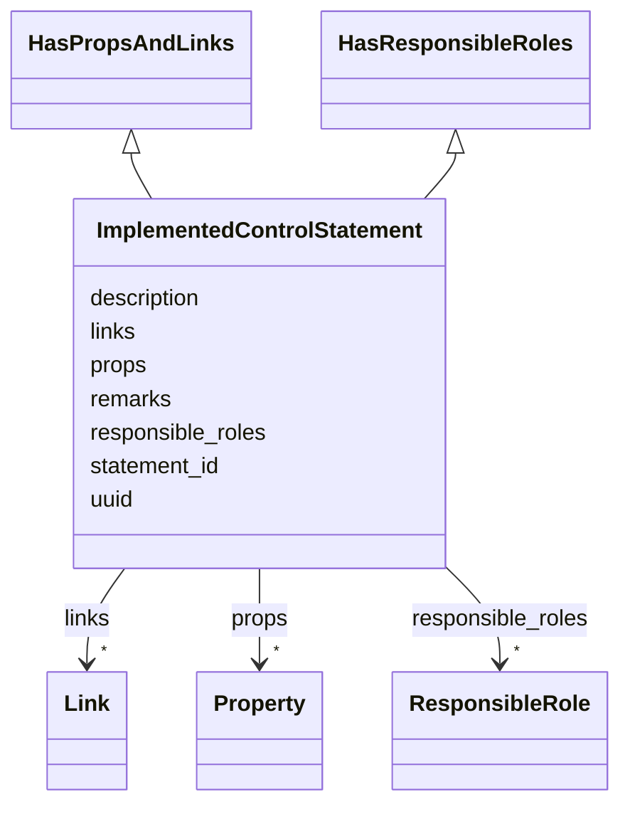

```mermaid
 classDiagram
    class ImplementedControlStatement
    click ImplementedControlStatement href "../ImplementedControlStatement"
      HasPropsAndLinks <|-- ImplementedControlStatement
        click HasPropsAndLinks href "../HasPropsAndLinks"
      HasResponsibleRoles <|-- ImplementedControlStatement
        click HasResponsibleRoles href "../HasResponsibleRoles"
      
      ImplementedControlStatement : description
        
      ImplementedControlStatement : links
        
          
    
        
        
        ImplementedControlStatement --> "*" Link : links
        click Link href "../Link"
    

        
      ImplementedControlStatement : props
        
          
    
        
        
        ImplementedControlStatement --> "*" Property : props
        click Property href "../Property"
    

        
      ImplementedControlStatement : remarks
        
      ImplementedControlStatement : responsible_roles
        
          
    
        
        
        ImplementedControlStatement --> "*" ResponsibleRole : responsible_roles
        click ResponsibleRole href "../ResponsibleRole"
    

        
      ImplementedControlStatement : statement_id
        
      ImplementedControlStatement : uuid
        
      
```
