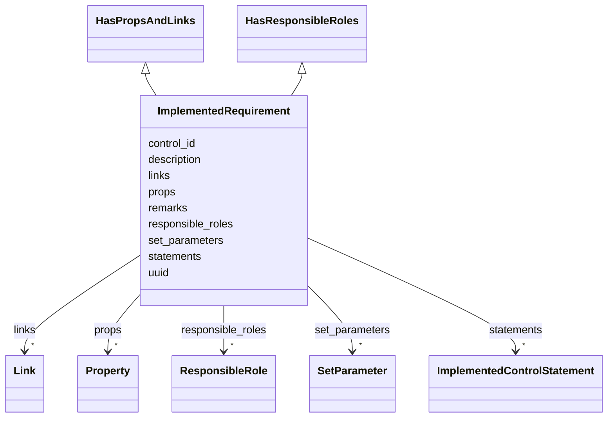

```mermaid
 classDiagram
    class ImplementedRequirement
    click ImplementedRequirement href "../ImplementedRequirement"
      HasPropsAndLinks <|-- ImplementedRequirement
        click HasPropsAndLinks href "../HasPropsAndLinks"
      HasResponsibleRoles <|-- ImplementedRequirement
        click HasResponsibleRoles href "../HasResponsibleRoles"
      
      ImplementedRequirement : control_id
        
      ImplementedRequirement : description
        
      ImplementedRequirement : links
        
          
    
        
        
        ImplementedRequirement --> "*" Link : links
        click Link href "../Link"
    

        
      ImplementedRequirement : props
        
          
    
        
        
        ImplementedRequirement --> "*" Property : props
        click Property href "../Property"
    

        
      ImplementedRequirement : remarks
        
      ImplementedRequirement : responsible_roles
        
          
    
        
        
        ImplementedRequirement --> "*" ResponsibleRole : responsible_roles
        click ResponsibleRole href "../ResponsibleRole"
    

        
      ImplementedRequirement : set_parameters
        
          
    
        
        
        ImplementedRequirement --> "*" SetParameter : set_parameters
        click SetParameter href "../SetParameter"
    

        
      ImplementedRequirement : statements
        
          
    
        
        
        ImplementedRequirement --> "*" ImplementedControlStatement : statements
        click ImplementedControlStatement href "../ImplementedControlStatement"
    

        
      ImplementedRequirement : uuid
        
      
```
