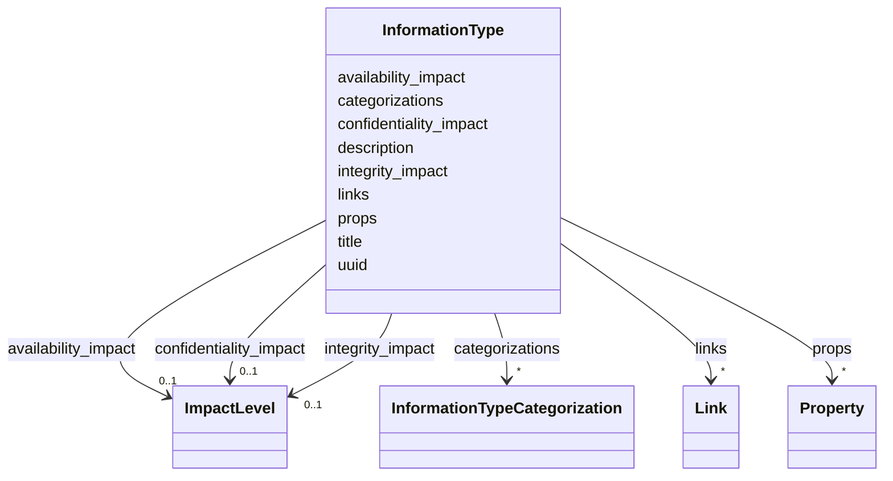

```mermaid
 classDiagram
    class InformationType
    click InformationType href "../InformationType"
      InformationType : availability_impact
        
          
    
        
        
        InformationType --> "0..1" ImpactLevel : availability_impact
        click ImpactLevel href "../ImpactLevel"
    

        
      InformationType : categorizations
        
          
    
        
        
        InformationType --> "*" InformationTypeCategorization : categorizations
        click InformationTypeCategorization href "../InformationTypeCategorization"
    

        
      InformationType : confidentiality_impact
        
          
    
        
        
        InformationType --> "0..1" ImpactLevel : confidentiality_impact
        click ImpactLevel href "../ImpactLevel"
    

        
      InformationType : description
        
      InformationType : integrity_impact
        
          
    
        
        
        InformationType --> "0..1" ImpactLevel : integrity_impact
        click ImpactLevel href "../ImpactLevel"
    

        
      InformationType : links
        
          
    
        
        
        InformationType --> "*" Link : links
        click Link href "../Link"
    

        
      InformationType : props
        
          
    
        
        
        InformationType --> "*" Property : props
        click Property href "../Property"
    

        
      InformationType : title
        
      InformationType : uuid
        
      
```
