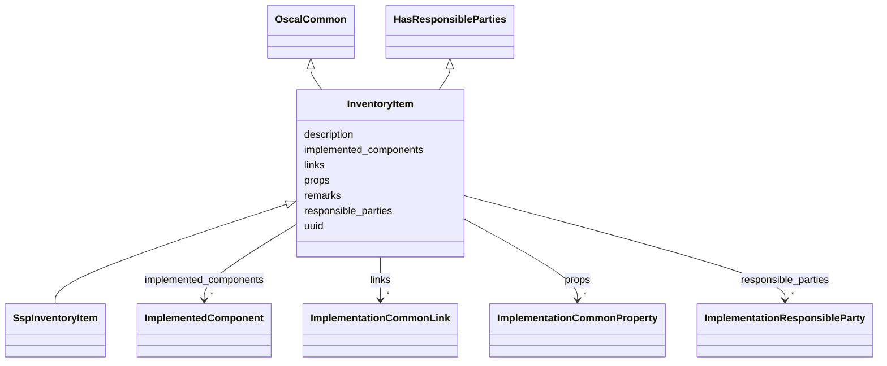

```mermaid
 classDiagram
    class InventoryItem
    click InventoryItem href "../InventoryItem"
      OscalCommon <|-- InventoryItem
        click OscalCommon href "../OscalCommon"
      HasResponsibleParties <|-- InventoryItem
        click HasResponsibleParties href "../HasResponsibleParties"
      

      InventoryItem <|-- SspInventoryItem
        click SspInventoryItem href "../SspInventoryItem"
      

      InventoryItem : description
        
      InventoryItem : implemented_components
        
          
    
        
        
        InventoryItem --> "*" ImplementedComponent : implemented_components
        click ImplementedComponent href "../ImplementedComponent"
    

        
      InventoryItem : links
        
          
    
        
        
        InventoryItem --> "*" ImplementationCommonLink : links
        click ImplementationCommonLink href "../ImplementationCommonLink"
    

        
      InventoryItem : props
        
          
    
        
        
        InventoryItem --> "*" ImplementationCommonProperty : props
        click ImplementationCommonProperty href "../ImplementationCommonProperty"
    

        
      InventoryItem : remarks
        
      InventoryItem : responsible_parties
        
          
    
        
        
        InventoryItem --> "*" ImplementationResponsibleParty : responsible_parties
        click ImplementationResponsibleParty href "../ImplementationResponsibleParty"
    

        
      InventoryItem : uuid
        
      
```
