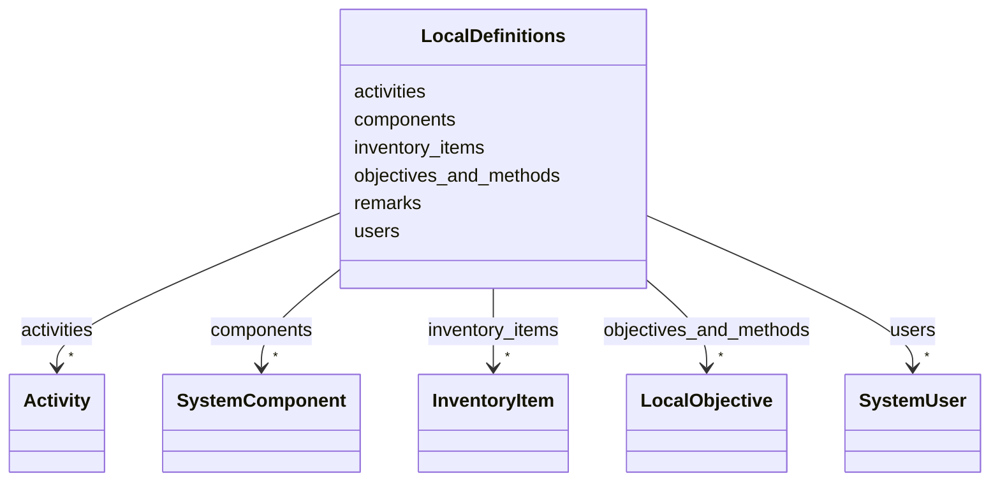

```mermaid
 classDiagram
    class LocalDefinitions
    click LocalDefinitions href "../LocalDefinitions"
      LocalDefinitions : activities
        
          
    
        
        
        LocalDefinitions --> "*" Activity : activities
        click Activity href "../Activity"
    

        
      LocalDefinitions : components
        
          
    
        
        
        LocalDefinitions --> "*" SystemComponent : components
        click SystemComponent href "../SystemComponent"
    

        
      LocalDefinitions : inventory_items
        
          
    
        
        
        LocalDefinitions --> "*" InventoryItem : inventory_items
        click InventoryItem href "../InventoryItem"
    

        
      LocalDefinitions : objectives_and_methods
        
          
    
        
        
        LocalDefinitions --> "*" LocalObjective : objectives_and_methods
        click LocalObjective href "../LocalObjective"
    

        
      LocalDefinitions : remarks
        
      LocalDefinitions : users
        
          
    
        
        
        LocalDefinitions --> "*" SystemUser : users
        click SystemUser href "../SystemUser"
    

        
      
```
