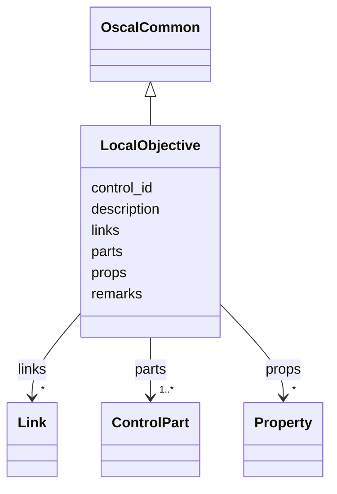

```mermaid
 classDiagram
    class LocalObjective
    click LocalObjective href "../LocalObjective"
      OscalCommon <|-- LocalObjective
        click OscalCommon href "../OscalCommon"
      
      LocalObjective : control_id
        
      LocalObjective : description
        
      LocalObjective : links
        
          
    
        
        
        LocalObjective --> "*" Link : links
        click Link href "../Link"
    

        
      LocalObjective : parts
        
          
    
        
        
        LocalObjective --> "1..*" ControlPart : parts
        click ControlPart href "../ControlPart"
    

        
      LocalObjective : props
        
          
    
        
        
        LocalObjective --> "*" Property : props
        click Property href "../Property"
    

        
      LocalObjective : remarks
        
      
```
