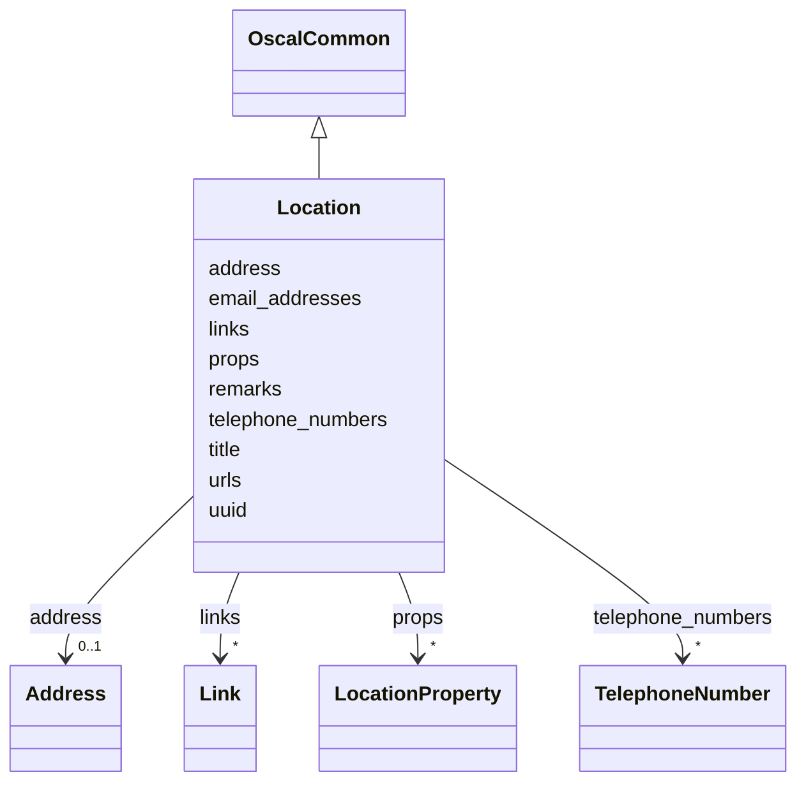

```mermaid
 classDiagram
    class Location
    click Location href "../Location"
      OscalCommon <|-- Location
        click OscalCommon href "../OscalCommon"
      
      Location : address
        
          
    
        
        
        Location --> "0..1" Address : address
        click Address href "../Address"
    

        
      Location : email_addresses
        
      Location : links
        
          
    
        
        
        Location --> "*" Link : links
        click Link href "../Link"
    

        
      Location : props
        
          
    
        
        
        Location --> "*" LocationProperty : props
        click LocationProperty href "../LocationProperty"
    

        
      Location : remarks
        
      Location : telephone_numbers
        
          
    
        
        
        Location --> "*" TelephoneNumber : telephone_numbers
        click TelephoneNumber href "../TelephoneNumber"
    

        
      Location : title
        
      Location : urls
        
      Location : uuid
        
      
```
