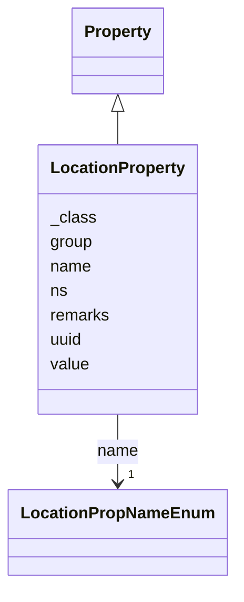

```mermaid
 classDiagram
    class LocationProperty
    click LocationProperty href "../LocationProperty"
      Property <|-- LocationProperty
        click Property href "../Property"
      
      LocationProperty : _class
        
      LocationProperty : group
        
      LocationProperty : name
        
          
    
        
        
        LocationProperty --> "1" LocationPropNameEnum : name
        click LocationPropNameEnum href "../LocationPropNameEnum"
    

        
      LocationProperty : ns
        
      LocationProperty : remarks
        
      LocationProperty : uuid
        
      LocationProperty : value
        
      
```
