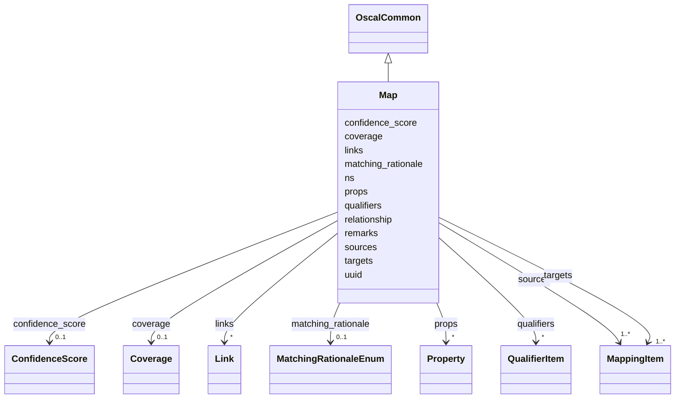

```mermaid
 classDiagram
    class Map
    click Map href "../Map"
      OscalCommon <|-- Map
        click OscalCommon href "../OscalCommon"
      
      Map : confidence_score
        
          
    
        
        
        Map --> "0..1" ConfidenceScore : confidence_score
        click ConfidenceScore href "../ConfidenceScore"
    

        
      Map : coverage
        
          
    
        
        
        Map --> "0..1" Coverage : coverage
        click Coverage href "../Coverage"
    

        
      Map : links
        
          
    
        
        
        Map --> "*" Link : links
        click Link href "../Link"
    

        
      Map : matching_rationale
        
          
    
        
        
        Map --> "0..1" MatchingRationaleEnum : matching_rationale
        click MatchingRationaleEnum href "../MatchingRationaleEnum"
    

        
      Map : ns
        
      Map : props
        
          
    
        
        
        Map --> "*" Property : props
        click Property href "../Property"
    

        
      Map : qualifiers
        
          
    
        
        
        Map --> "*" QualifierItem : qualifiers
        click QualifierItem href "../QualifierItem"
    

        
      Map : relationship
        
      Map : remarks
        
      Map : sources
        
          
    
        
        
        Map --> "1..*" MappingItem : sources
        click MappingItem href "../MappingItem"
    

        
      Map : targets
        
          
    
        
        
        Map --> "1..*" MappingItem : targets
        click MappingItem href "../MappingItem"
    

        
      Map : uuid
        
      
```
