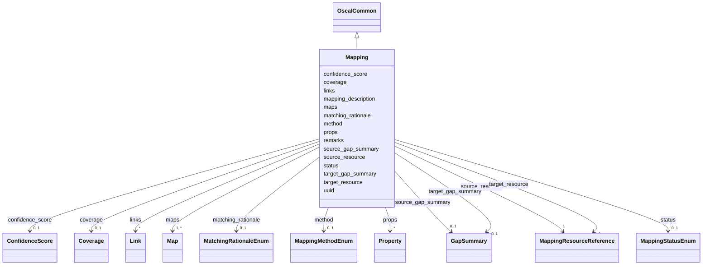

```mermaid
 classDiagram
    class Mapping
    click Mapping href "../Mapping"
      OscalCommon <|-- Mapping
        click OscalCommon href "../OscalCommon"
      
      Mapping : confidence_score
        
          
    
        
        
        Mapping --> "0..1" ConfidenceScore : confidence_score
        click ConfidenceScore href "../ConfidenceScore"
    

        
      Mapping : coverage
        
          
    
        
        
        Mapping --> "0..1" Coverage : coverage
        click Coverage href "../Coverage"
    

        
      Mapping : links
        
          
    
        
        
        Mapping --> "*" Link : links
        click Link href "../Link"
    

        
      Mapping : mapping_description
        
      Mapping : maps
        
          
    
        
        
        Mapping --> "1..*" Map : maps
        click Map href "../Map"
    

        
      Mapping : matching_rationale
        
          
    
        
        
        Mapping --> "0..1" MatchingRationaleEnum : matching_rationale
        click MatchingRationaleEnum href "../MatchingRationaleEnum"
    

        
      Mapping : method
        
          
    
        
        
        Mapping --> "0..1" MappingMethodEnum : method
        click MappingMethodEnum href "../MappingMethodEnum"
    

        
      Mapping : props
        
          
    
        
        
        Mapping --> "*" Property : props
        click Property href "../Property"
    

        
      Mapping : remarks
        
      Mapping : source_gap_summary
        
          
    
        
        
        Mapping --> "0..1" GapSummary : source_gap_summary
        click GapSummary href "../GapSummary"
    

        
      Mapping : source_resource
        
          
    
        
        
        Mapping --> "1" MappingResourceReference : source_resource
        click MappingResourceReference href "../MappingResourceReference"
    

        
      Mapping : status
        
          
    
        
        
        Mapping --> "0..1" MappingStatusEnum : status
        click MappingStatusEnum href "../MappingStatusEnum"
    

        
      Mapping : target_gap_summary
        
          
    
        
        
        Mapping --> "0..1" GapSummary : target_gap_summary
        click GapSummary href "../GapSummary"
    

        
      Mapping : target_resource
        
          
    
        
        
        Mapping --> "1" MappingResourceReference : target_resource
        click MappingResourceReference href "../MappingResourceReference"
    

        
      Mapping : uuid
        
      
```
