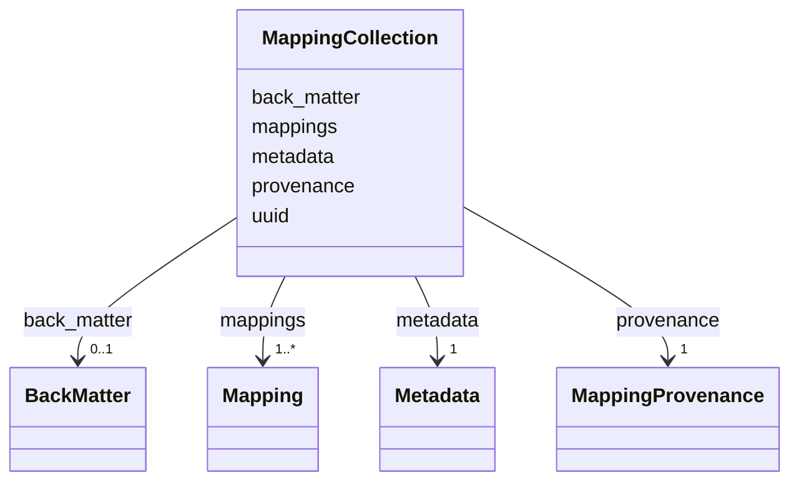

```mermaid
 classDiagram
    class MappingCollection
    click MappingCollection href "../MappingCollection"
      MappingCollection : back_matter
        
          
    
        
        
        MappingCollection --> "0..1" BackMatter : back_matter
        click BackMatter href "../BackMatter"
    

        
      MappingCollection : mappings
        
          
    
        
        
        MappingCollection --> "1..*" Mapping : mappings
        click Mapping href "../Mapping"
    

        
      MappingCollection : metadata
        
          
    
        
        
        MappingCollection --> "1" Metadata : metadata
        click Metadata href "../Metadata"
    

        
      MappingCollection : provenance
        
          
    
        
        
        MappingCollection --> "1" MappingProvenance : provenance
        click MappingProvenance href "../MappingProvenance"
    

        
      MappingCollection : uuid
        
      
```
