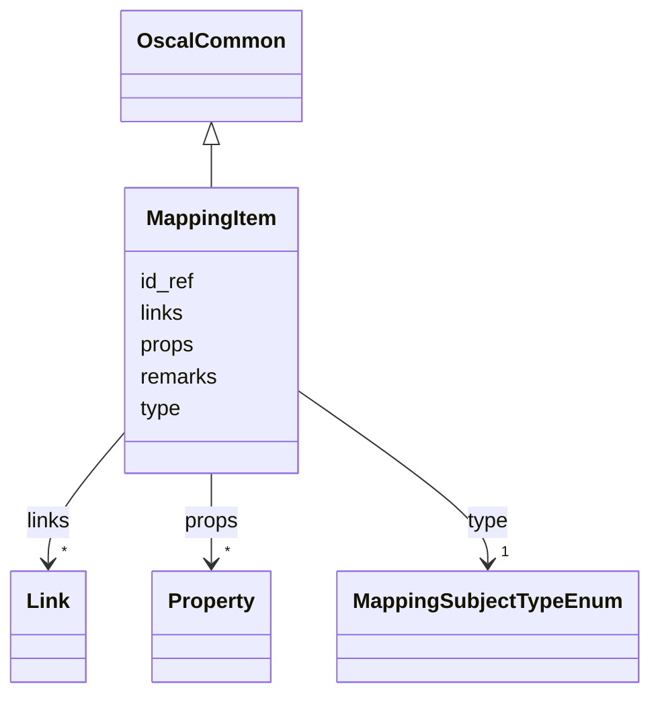

```mermaid
 classDiagram
    class MappingItem
    click MappingItem href "../MappingItem"
      OscalCommon <|-- MappingItem
        click OscalCommon href "../OscalCommon"
      
      MappingItem : id_ref
        
      MappingItem : links
        
          
    
        
        
        MappingItem --> "*" Link : links
        click Link href "../Link"
    

        
      MappingItem : props
        
          
    
        
        
        MappingItem --> "*" Property : props
        click Property href "../Property"
    

        
      MappingItem : remarks
        
      MappingItem : type
        
          
    
        
        
        MappingItem --> "1" MappingSubjectTypeEnum : type
        click MappingSubjectTypeEnum href "../MappingSubjectTypeEnum"
    

        
      
```
