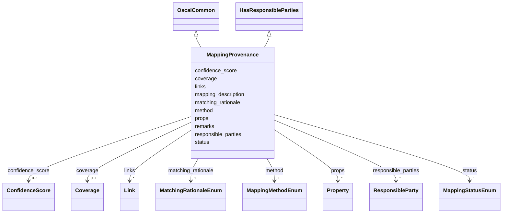

```mermaid
 classDiagram
    class MappingProvenance
    click MappingProvenance href "../MappingProvenance"
      OscalCommon <|-- MappingProvenance
        click OscalCommon href "../OscalCommon"
      HasResponsibleParties <|-- MappingProvenance
        click HasResponsibleParties href "../HasResponsibleParties"
      
      MappingProvenance : confidence_score
        
          
    
        
        
        MappingProvenance --> "0..1" ConfidenceScore : confidence_score
        click ConfidenceScore href "../ConfidenceScore"
    

        
      MappingProvenance : coverage
        
          
    
        
        
        MappingProvenance --> "0..1" Coverage : coverage
        click Coverage href "../Coverage"
    

        
      MappingProvenance : links
        
          
    
        
        
        MappingProvenance --> "*" Link : links
        click Link href "../Link"
    

        
      MappingProvenance : mapping_description
        
      MappingProvenance : matching_rationale
        
          
    
        
        
        MappingProvenance --> "1" MatchingRationaleEnum : matching_rationale
        click MatchingRationaleEnum href "../MatchingRationaleEnum"
    

        
      MappingProvenance : method
        
          
    
        
        
        MappingProvenance --> "1" MappingMethodEnum : method
        click MappingMethodEnum href "../MappingMethodEnum"
    

        
      MappingProvenance : props
        
          
    
        
        
        MappingProvenance --> "*" Property : props
        click Property href "../Property"
    

        
      MappingProvenance : remarks
        
      MappingProvenance : responsible_parties
        
          
    
        
        
        MappingProvenance --> "*" ResponsibleParty : responsible_parties
        click ResponsibleParty href "../ResponsibleParty"
    

        
      MappingProvenance : status
        
          
    
        
        
        MappingProvenance --> "1" MappingStatusEnum : status
        click MappingStatusEnum href "../MappingStatusEnum"
    

        
      
```
