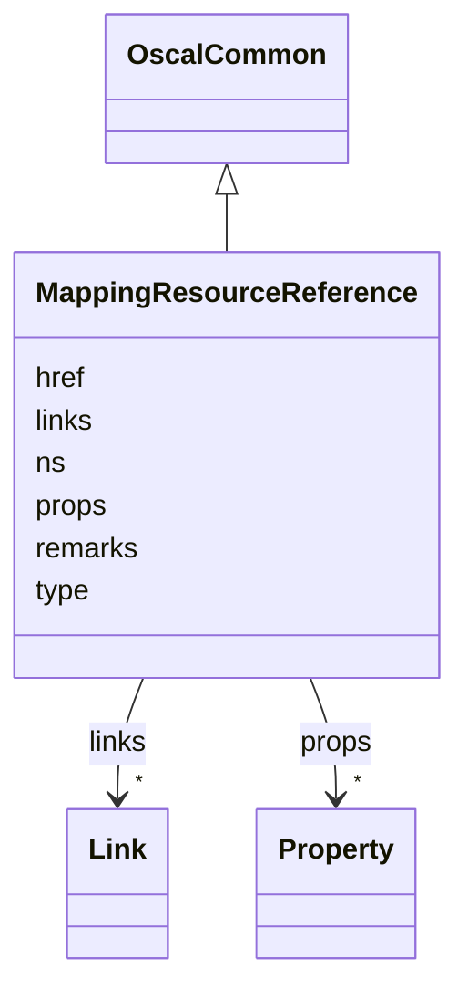

```mermaid
 classDiagram
    class MappingResourceReference
    click MappingResourceReference href "../MappingResourceReference"
      OscalCommon <|-- MappingResourceReference
        click OscalCommon href "../OscalCommon"
      
      MappingResourceReference : href
        
      MappingResourceReference : links
        
          
    
        
        
        MappingResourceReference --> "*" Link : links
        click Link href "../Link"
    

        
      MappingResourceReference : ns
        
      MappingResourceReference : props
        
          
    
        
        
        MappingResourceReference --> "*" Property : props
        click Property href "../Property"
    

        
      MappingResourceReference : remarks
        
      MappingResourceReference : type
        
      
```
